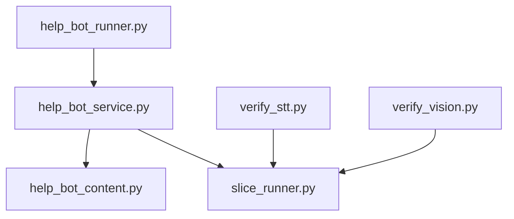
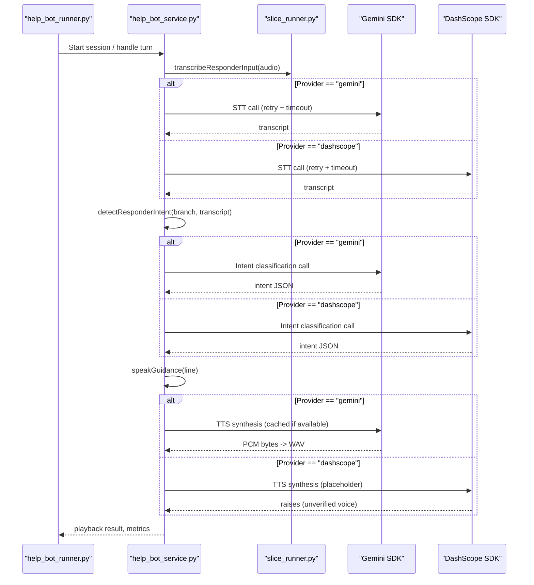
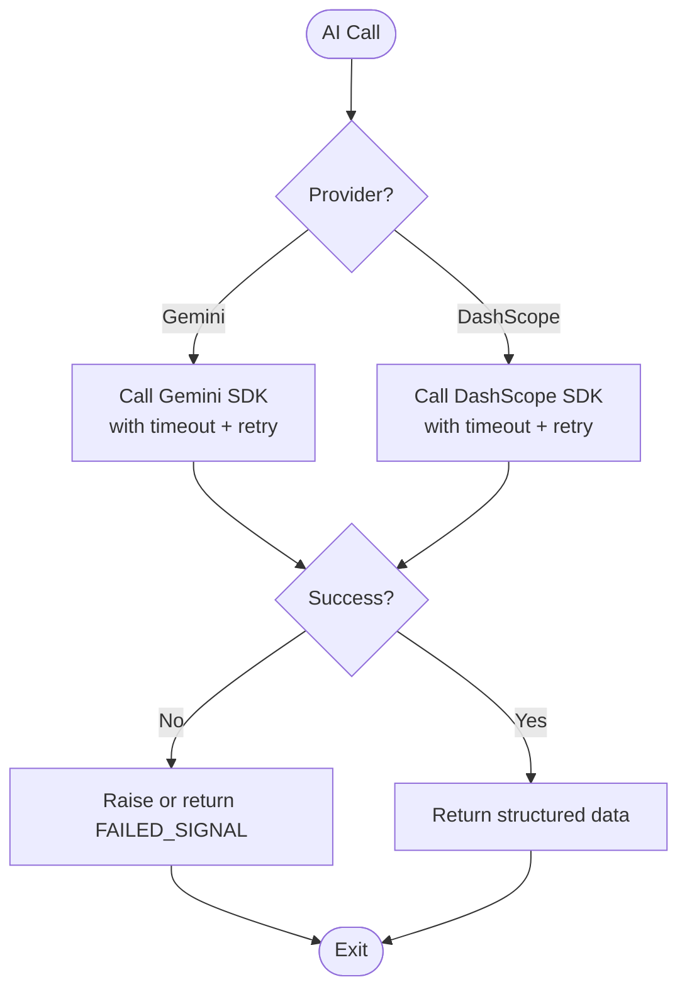
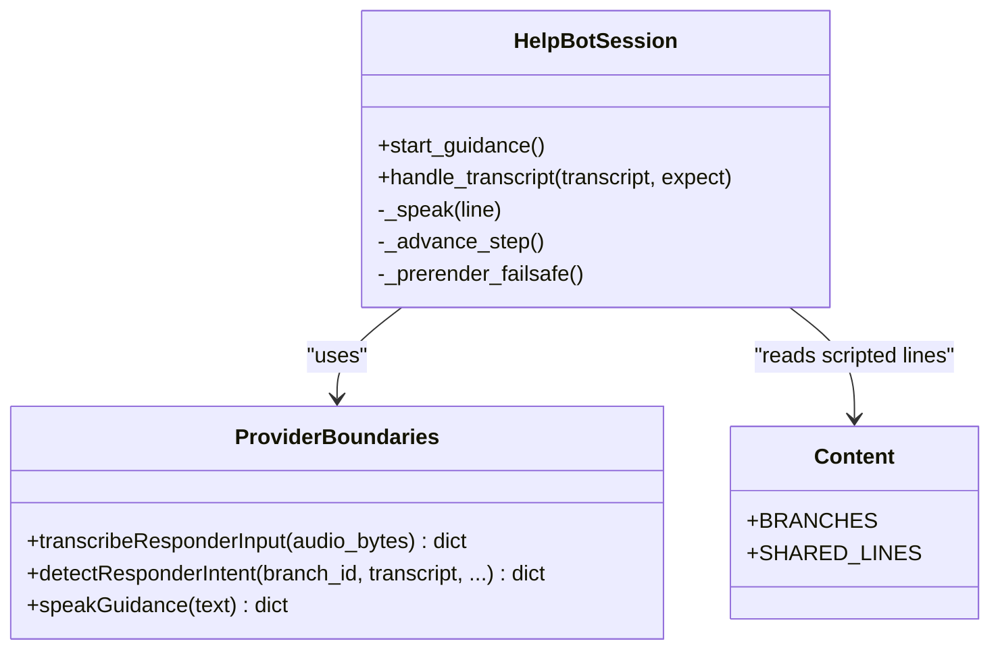
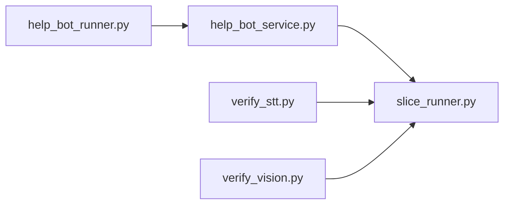

# AI Provider Integration

<cite>
**Referenced Files in This Document**
- [slice_runner.py](file://backend/slice_runner.py)
- [help_bot_service.py](file://backend/services/help_bot_service.py)
- [help_bot_content.py](file://backend/services/help_bot_content.py)
- [help_bot_runner.py](file://backend/help_bot_runner.py)
- [verify_stt.py](file://backend/verify_stt.py)
- [verify_vision.py](file://backend/verify_vision.py)
</cite>

## Table of Contents
1. [Introduction](#introduction)
2. [Project Structure](#project-structure)
3. [Core Components](#core-components)
4. [Architecture Overview](#architecture-overview)
5. [Detailed Component Analysis](#detailed-component-analysis)
6. [Dependency Analysis](#dependency-analysis)
7. [Performance Considerations](#performance-considerations)
8. [Troubleshooting Guide](#troubleshooting-guide)
9. [Conclusion](#conclusion)
10. [Appendices](#appendices)

## Introduction
This document explains the AI Provider Integration sub-component that abstracts multiple AI services behind a uniform interface. It focuses on how Gemini and DashScope are implemented as interchangeable providers for speech-to-text (STT), vision classification, intent classification, and text-to-speech (TTS). It also documents automatic failover behavior, configuration options for model selection and rate limiting, error handling strategies, monitoring/logging practices, and best practices for adding new providers.

The integration is designed to keep emergency workflows resilient: provider failures or quota limits do not block the system; instead, they route to safe defaults while preserving auditability and observability.

## Project Structure
At a high level:
- slice_runner.py defines the provider abstraction layer, environment-based provider selection, retry/backoff, timeouts, and per-step provider implementations for STT, vision, and classifier steps.
- help_bot_service.py extends the abstraction to the Responder Help Bot with provider-specific STT, intent detection, and TTS boundaries, plus a robust session loop with pre-rendered failsafe audio.
- help_bot_content.py contains all scripted Urdu content used by the bot; the AI never composes responder-facing text.
- help_bot_runner.py orchestrates runs (replay or mic mode), prewarming TTS cache, and verification utilities.
- verify_stt.py and verify_vision.py exercise the active provider through the pipeline for validation.

**Diagram sources**
- [help_bot_runner.py:1-241](file://backend/help_bot_runner.py#L1-L241)
- [help_bot_service.py:1-960](file://backend/services/help_bot_service.py#L1-L960)
- [slice_runner.py:1-745](file://backend/slice_runner.py#L1-L745)
- [help_bot_content.py:1-255](file://backend/services/help_bot_content.py#L1-L255)
- [verify_stt.py:1-61](file://backend/verify_stt.py#L1-L61)
- [verify_vision.py:1-58](file://backend/verify_vision.py#L1-L58)

**Section sources**
- [slice_runner.py:1-154](file://backend/slice_runner.py#L1-L154)
- [help_bot_service.py:1-120](file://backend/services/help_bot_service.py#L1-L120)
- [help_bot_runner.py:1-100](file://backend/help_bot_runner.py#L1-L100)

## Core Components
- Provider selection and configuration:
  - Active provider is chosen via an environment variable; default is Gemini.
  - Per-call timeout and retry/backoff are configured via environment variables.
  - API keys are loaded from environment and never logged.
- Step-level provider implementations:
  - STT: gemini_transcribe_voice vs dashscope_transcribe_voice.
  - Vision: gemini_classify_injury vs dashscope_classify_injury.
  - Classifier: gemini_combine_signals vs dashscope_combine_signals.
  - Intent detection (Help Bot): gemini_detect_intent vs dashscope_detect_intent.
  - TTS (Help Bot): gemini_synthesize_speech vs dashscope_synthesize_speech (placeholder until verified).
- Failover and resilience:
  - Quota/rate-limit retries with exponential backoff capped at a maximum wait.
  - Timeouts per call to avoid blocking the emergency flow.
  - Fail-safe outputs when calls fail or return invalid JSON.
  - Pre-rendered failsafe audio for the Help Bot to guarantee vocal continuity.

**Section sources**
- [slice_runner.py:55-95](file://backend/slice_runner.py#L55-L95)
- [slice_runner.py:132-154](file://backend/slice_runner.py#L132-L154)
- [help_bot_service.py:127-168](file://backend/services/help_bot_service.py#L127-L168)
- [help_bot_service.py:244-289](file://backend/services/help_bot_service.py#L244-L289)
- [help_bot_service.py:307-388](file://backend/services/help_bot_service.py#L307-L388)

## Architecture Overview
The provider abstraction isolates business logic from vendor specifics. Each step has two concrete implementations (Gemini and DashScope) selected at runtime. The same selection pattern applies across STT, vision, classifier, and Help Bot steps.

**Diagram sources**
- [help_bot_service.py:127-168](file://backend/services/help_bot_service.py#L127-L168)
- [help_bot_service.py:244-289](file://backend/services/help_bot_service.py#L244-L289)
- [help_bot_service.py:307-388](file://backend/services/help_bot_service.py#L307-L388)
- [slice_runner.py:367-426](file://backend/slice_runner.py#L367-L426)
- [slice_runner.py:428-517](file://backend/slice_runner.py#L428-L517)

## Detailed Component Analysis

### Provider Abstraction Layer (slice_runner.py)
- Environment-driven provider selection:
  - TRIAGE_AI_PROVIDER selects the active provider; default is gemini.
  - DASHSCOPE_BASE_URL auto-detects endpoint based on key length if not set.
- Configuration:
  - TRIAGE_CALL_TIMEOUT_S sets per-call timeout.
  - TRIAGE_QUOTA_RETRIES controls retry attempts for 429/RESOURCE_EXHAUSTED errors.
  - Model selection via environment variables per step (e.g., GEMINI_STT_MODEL, GEMINI_VISION_MODEL, GEMINI_CLASSIFIER_MODEL, DASHSCOPE_CLASSIFIER_MODEL).
- Retry and backoff:
  - _call_with_retry wraps provider calls, catching quota/rate-limit errors and retrying with increasing delays up to a cap.
- Provider implementations:
  - STT: gemini_transcribe_voice and dashscope_transcribe_voice.
  - Vision: gemini_classify_injury and dashscope_classify_injury.
  - Classifier: gemini_combine_signals and dashscope_combine_signals.
- Failover:
  - Any step failure returns a standardized failed signal or degrades confidence flags rather than halting the pipeline.

**Diagram sources**
- [slice_runner.py:55-95](file://backend/slice_runner.py#L55-L95)
- [slice_runner.py:367-426](file://backend/slice_runner.py#L367-L426)
- [slice_runner.py:428-517](file://backend/slice_runner.py#L428-L517)

**Section sources**
- [slice_runner.py:1-154](file://backend/slice_runner.py#L1-L154)
- [slice_runner.py:367-517](file://backend/slice_runner.py#L367-L517)

### Help Bot Provider Boundaries (help_bot_service.py)
- STT boundary:
  - transcribeResponderInput selects gemini_transcribe_responder or dashscope_transcribe_responder based on active provider.
  - Errors return unusable transcripts to prevent blocking the conversation.
- Intent detection boundary:
  - detectResponderIntent builds a strict prompt using branch context and recent turns, then calls the appropriate provider implementation.
  - Output is normalized to a fixed schema; invalid responses become “unclear”.
- TTS boundary:
  - speakGuidance uses gemini_synthesize_speech or dashscope_synthesize_speech.
  - TTS output is cached to disk to avoid repeated quota usage and to enable deterministic replay runs.
  - If TTS fails, a pre-rendered failsafe line is played to ensure continuous guidance.
- Session resilience:
  - HelpBotSession prerenders failsafe audio at startup.
  - Playback supports barge-in and logs interruptions.
  - Escalation hook updates incident state and logs transitions.

**Diagram sources**
- [help_bot_service.py:663-783](file://backend/services/help_bot_service.py#L663-L783)
- [help_bot_service.py:127-168](file://backend/services/help_bot_service.py#L127-L168)
- [help_bot_service.py:244-289](file://backend/services/help_bot_service.py#L244-L289)
- [help_bot_service.py:307-388](file://backend/services/help_bot_service.py#L307-L388)
- [help_bot_content.py:21-43](file://backend/services/help_bot_content.py#L21-L43)

**Section sources**
- [help_bot_service.py:127-168](file://backend/services/help_bot_service.py#L127-L168)
- [help_bot_service.py:244-289](file://backend/services/help_bot_service.py#L244-L289)
- [help_bot_service.py:307-388](file://backend/services/help_bot_service.py#L307-L388)
- [help_bot_service.py:663-783](file://backend/services/help_bot_service.py#L663-L783)
- [help_bot_content.py:21-43](file://backend/services/help_bot_content.py#L21-L43)

### Runner and Verification Utilities
- help_bot_runner.py:
  - Orchestrates simulated or pipeline-driven incidents.
  - Prewarms TTS cache to respect free-tier quotas and ensure deterministic runs.
  - Provides a spoken-Urdu verification mode that round-trips TTS audio through STT.
- verify_stt.py and verify_vision.py:
  - Exercise the active provider through slice_runner to validate accuracy and latency.
  - Report failures and latencies for each media item.

**Section sources**
- [help_bot_runner.py:102-172](file://backend/help_bot_runner.py#L102-L172)
- [help_bot_runner.py:175-236](file://backend/help_bot_runner.py#L175-L236)
- [verify_stt.py:22-52](file://backend/verify_stt.py#L22-L52)
- [verify_vision.py:22-49](file://backend/verify_vision.py#L22-L49)

## Dependency Analysis
- Provider selection is centralized in slice_runner._ai_provider(), which influences every step’s routing.
- help_bot_service.py depends on slice_runner for shared client creation, timeouts, retries, and provider selection.
- help_bot_runner.py depends on both help_bot_service and slice_runner to build incidents and run sessions.
- Verification scripts depend on slice_runner to test STT and vision paths independently.

**Diagram sources**
- [help_bot_runner.py:39-44](file://backend/help_bot_runner.py#L39-L44)
- [help_bot_service.py:42-47](file://backend/services/help_bot_service.py#L42-L47)
- [verify_stt.py:15-16](file://backend/verify_stt.py#L15-L16)
- [verify_vision.py:15-16](file://backend/verify_vision.py#L15-L16)

**Section sources**
- [slice_runner.py:132-154](file://backend/slice_runner.py#L132-L154)
- [help_bot_service.py:42-47](file://backend/services/help_bot_service.py#L42-L47)
- [help_bot_runner.py:39-44](file://backend/help_bot_runner.py#L39-L44)

## Performance Considerations
- Rate limiting and quota management:
  - TRIAGE_QUOTA_RETRIES enables bounded retries with backoff for 429/RESOURCE_EXHAUSTED errors.
  - TTS prewarming renders all scripted lines into a local cache to avoid repeated quota consumption during replay runs.
- Latency control:
  - TRIAGE_CALL_TIMEOUT_S ensures no single AI call blocks the emergency flow indefinitely.
  - First playback delay is measured per turn to monitor perceived responsiveness.
- Caching:
  - TTS cache keyed by voice+text avoids redundant synthesis.
  - Triage results are cached for identical media inputs to reduce API calls.

[No sources needed since this section provides general guidance]

## Troubleshooting Guide
Common issues and diagnostics:
- Missing API keys:
  - Ensure GEMINI_API_KEY and DASHSCOPE_API_KEY are set in the project-root .env file.
  - The code raises explicit errors if keys are missing.
- Provider misconfiguration:
  - Set TRIAGE_AI_PROVIDER to gemini or dashscope.
  - For DashScope, optionally set DASHSCOPE_BASE_URL to select intl or cn endpoints.
- Quota exhaustion:
  - Observe retry logs indicating quota limits; increase TRIAGE_QUOTA_RETRIES cautiously.
  - Use TTS prewarm to minimize live synthesis during tests.
- Invalid JSON responses:
  - The parser tolerates markdown fences but will treat malformed output as failure; inspect raw responses in logs.
- STT/Vision verification:
  - Run verify_stt.py and verify_vision.py to isolate provider-specific issues and measure latency.

**Section sources**
- [slice_runner.py:36-52](file://backend/slice_runner.py#L36-L52)
- [slice_runner.py:72-95](file://backend/slice_runner.py#L72-L95)
- [slice_runner.py:349-364](file://backend/slice_runner.py#L349-L364)
- [verify_stt.py:22-52](file://backend/verify_stt.py#L22-L52)
- [verify_vision.py:22-49](file://backend/verify_vision.py#L22-L49)

## Conclusion
The AI Provider Integration provides a clean abstraction over Gemini and DashScope, enabling seamless switching between providers without changing business logic. It emphasizes resilience through timeouts, retries, and fail-safe behaviors, while offering strong observability via structured logs and caches. The design makes it straightforward to add new providers by implementing the same step interfaces and routing them through the central provider selector.

[No sources needed since this section summarizes without analyzing specific files]

## Appendices

### Configuration Options
- TRIAGE_AI_PROVIDER: Selects active provider ("gemini" or "dashscope").
- TRIAGE_CALL_TIMEOUT_S: Per-call timeout in seconds.
- TRIAGE_QUOTA_RETRIES: Number of retries for quota/rate-limit errors.
- GEMINI_*_MODEL: Model names for STT, vision, classifier, and TTS steps.
- DASHSCOPE_*_MODEL: Model names for DashScope steps.
- DASHSCOPE_BASE_URL: Explicit DashScope endpoint override.
- GEMINI_API_KEY, DASHSCOPE_API_KEY: Credentials loaded from .env.

**Section sources**
- [slice_runner.py:27-59](file://backend/slice_runner.py#L27-L59)
- [slice_runner.py:367-426](file://backend/slice_runner.py#L367-L426)
- [slice_runner.py:428-517](file://backend/slice_runner.py#L428-L517)
- [help_bot_service.py:295-305](file://backend/services/help_bot_service.py#L295-L305)

### Monitoring and Logging Strategies
- Structured logs:
  - Provider selection and step names are included in logs (e.g., STT, vision, classifier, HB-STT, HB-INTENT, HB-TTS).
  - Retries log attempt counts and wait durations.
- Metrics:
  - First playback delay per turn is recorded to gauge perceived latency.
  - TTS cache hit/miss ratios can be inferred from manifest entries.
- Auditability:
  - Incident transition logs capture state changes, triggers, and details for accountability.

**Section sources**
- [slice_runner.py:72-95](file://backend/slice_runner.py#L72-L95)
- [help_bot_service.py:696-712](file://backend/services/help_bot_service.py#L696-L712)
- [help_bot_service.py:727-750](file://backend/services/help_bot_service.py#L727-L750)

### Best Practices for Adding New Providers
- Implement step functions:
  - Create gemini_* and dashscope_* equivalents for STT, vision, classifier, and TTS.
  - Ensure consistent input/output schemas and error signaling.
- Route via provider selector:
  - Update step wrappers to choose the correct implementation based on TRIAGE_AI_PROVIDER.
- Add environment configuration:
  - Expose model names and endpoints via environment variables.
- Validate with verification scripts:
  - Use verify_stt.py and verify_vision.py to confirm correctness and latency.
- Test failover:
  - Simulate provider failures to ensure fallbacks and retries behave as expected.

[No sources needed since this section provides general guidance]