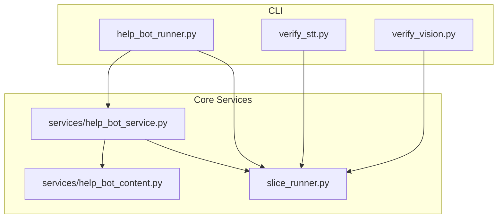
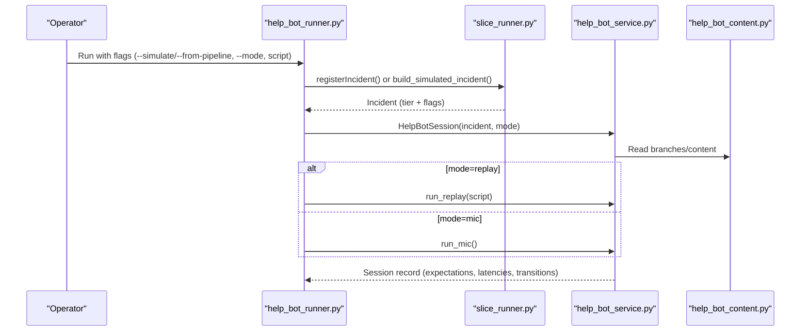
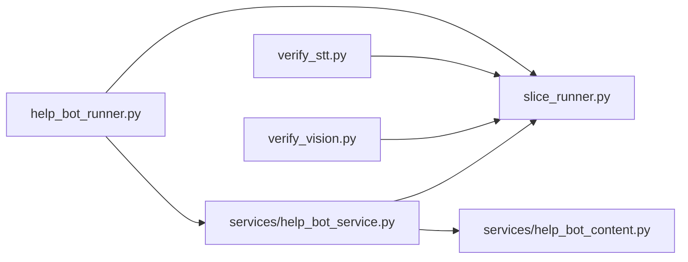

# API Reference

<cite>
**Referenced Files in This Document**
- [help_bot_runner.py](file://backend/help_bot_runner.py)
- [slice_runner.py](file://backend/slice_runner.py)
- [help_bot_service.py](file://backend/services/help_bot_service.py)
- [help_bot_content.py](file://backend/services/help_bot_content.py)
- [verify_stt.py](file://backend/verify_stt.py)
- [verify_vision.py](file://backend/verify_vision.py)
- [PROJECT.md](file://PROJECT.md)
</cite>

## Table of Contents
1. Introduction
2. Project Structure
3. Core Components
4. Architecture Overview
5. Detailed Component Analysis
6. Dependency Analysis
7. Performance Considerations
8. Troubleshooting Guide
9. Conclusion
10. Appendices

## Introduction
This document provides an API reference for the LifeLine Ride system, focusing on:
- CLI commands and their parameters for help_bot_runner.py and slice_runner.py
- Internal service interfaces used by the CLI and between modules
- Data model schemas, error handling patterns, and provider boundaries
- Protocol-specific usage examples, expected outputs, and integration guidance
- Authentication, rate limiting, versioning, migration notes, and performance tips

The system implements a voice-first emergency triage and responder guidance flow with Urdu STT/TTS, vision-based injury classification, severity tiering, matching/dispatch to responders and Basic Health Units (BHUs), and a stateful help-bot session that can escalate incidents mid-session.

**Section sources**
- [PROJECT.md:1-20](file://PROJECT.md#L1-L20)

## Project Structure
At a high level:
- backend/slice_runner.py: Module 1 triage pipeline, data models, seed data, matching/dispatch, and logging
- backend/help_bot_runner.py: CLI entrypoint for Module 2 help-bot runs (simulate, replay, mic mode, TTS prewarm/verify)
- backend/services/help_bot_service.py: Help-bot conversation engine, STT/intent/TTS boundaries, session state machine, escalation hook
- backend/services/help_bot_content.py: Hardcoded Urdu first-aid content (branches, steps, Q&A, shared lines)
- backend/verify_stt.py and verify_vision.py: Verification utilities for STT and vision components
- backend/routes/: Placeholder for future HTTP endpoints (currently empty)

**Diagram sources**
- [help_bot_runner.py:1-241](file://backend/help_bot_runner.py#L1-L241)
- [slice_runner.py:1-745](file://backend/slice_runner.py#L1-L745)
- [help_bot_service.py:1-800](file://backend/services/help_bot_service.py#L1-L800)
- [help_bot_content.py:1-255](file://backend/services/help_bot_content.py#L1-L255)
- [verify_stt.py:1-61](file://backend/verify_stt.py#L1-L61)
- [verify_vision.py:1-58](file://backend/verify_vision.py#L1-L58)

**Section sources**
- [help_bot_runner.py:1-241](file://backend/help_bot_runner.py#L1-L241)
- [slice_runner.py:1-745](file://backend/slice_runner.py#L1-L745)
- [help_bot_service.py:1-800](file://backend/services/help_bot_service.py#L1-L800)
- [help_bot_content.py:1-255](file://backend/services/help_bot_content.py#L1-L255)
- [verify_stt.py:1-61](file://backend/verify_stt.py#L1-L61)
- [verify_vision.py:1-58](file://backend/verify_vision.py#L1-L58)

## Core Components
- CLI Entrypoint (Module 2): help_bot_runner.py
  - Modes: simulate, from-pipeline, replay, mic, prewarm-tts, verify-tts
  - Integrates Module 1 triage and Module 2 help-bot session
- Module 1 Pipeline (slice_runner.py)
  - STT, Vision, Classifier steps with provider abstraction (Gemini/DashScope)
  - Data models: GPSLocation, Incident, Responder, BHU, DispatchResult
  - Matching and dispatch logic; incident logging
- Help-Bot Service (services/help_bot_service.py)
  - Branch routing, STT/intent/TTS boundaries, MicMonitor, playback with barge-in
  - Session state machine and escalation hook
  - TTS caching and verification
- Content (services/help_bot_content.py)
  - Hardcoded Urdu guidance per branch (initial guidance, steps, Q&A, escalation signals/guidance)

**Section sources**
- [help_bot_runner.py:1-241](file://backend/help_bot_runner.py#L1-L241)
- [slice_runner.py:156-213](file://backend/slice_runner.py#L156-L213)
- [help_bot_service.py:95-117](file://backend/services/help_bot_service.py#L95-L117)
- [help_bot_content.py:21-43](file://backend/services/help_bot_content.py#L21-L43)

## Architecture Overview
The system composes three layers:
- CLI layer: orchestrates runs, selects modes, and invokes services
- Service layer: encapsulates AI provider calls, session management, and business rules
- Data layer: Pydantic models and in-memory stores for incidents/responders/BHUs

**Diagram sources**
- [help_bot_runner.py:175-236](file://backend/help_bot_runner.py#L175-L236)
- [slice_runner.py:589-672](file://backend/slice_runner.py#L589-L672)
- [help_bot_service.py:663-783](file://backend/services/help_bot_service.py#L663-L783)
- [help_bot_content.py:46-255](file://backend/services/help_bot_content.py#L46-L255)

## Detailed Component Analysis

### CLI: help_bot_runner.py
Purpose:
- Entry point for running Module 2 help-bot scenarios
- Supports simulated incidents, full pipeline runs, deterministic replay, live mic mode, TTS prewarming, and spoken-Urdu verification

Command-line arguments:
- --simulate <scenario>: builds a dispatched incident from seed flags/tier (no AI quota). Choices include heavy_bleeding, fracture_crush, snakebite
- --from-pipeline: runs Module 1 triage on mock media first, then hands off to help bot
- --photo <path>: required with --from-pipeline; path to photo
- --voice <path>: required with --from-pipeline; path to voice note audio
- --village <id>: village identifier for location (default VILLAGE-A)
- --mode <replay|mic>: interaction mode (default replay)
- script (positional): JSON replay script path when mode=replay
- --prewarm-tts: render all scripted lines into TTS cache and exit
- --verify-tts: run spoken-Urdu round-trip check and exit

Parameter validation:
- --from-pipeline requires both --photo and --voice
- mode=replay requires a script JSON path
- Paths are resolved relative to repo root if not absolute

Output formats:
- Console logs for incident creation, dispatch status, and session summary
- Session summary includes expectation summary, average latency ms, final tier, and number of escalations
- verify-tts writes a JSON report to mockdata/helpbot/test_runs/verify_tts.json

Usage examples:
- Simulate scenario and replay: python backend/help_bot_runner.py --simulate heavy_bleeding --mode replay mockdata/helpbot/scripts/heavy_bleeding.json
- Full pipeline run: python backend/help_bot_runner.py --from-pipeline --photo <photo> --voice <voice> --village VILLAGE-A --mode replay <script>
- Live hands-free: python backend/help_bot_runner.py --simulate snakebite --mode mic
- Pre-warm TTS: python backend/help_bot_runner.py --prewarm-tts
- Verify TTS: python backend/help_bot_runner.py --verify-tts

Error handling:
- Missing required args produce parser errors
- Replay script must be valid JSON
- Audio device absence is handled gracefully in playback/capture paths

**Section sources**
- [help_bot_runner.py:4-18](file://backend/help_bot_runner.py#L4-L18)
- [help_bot_runner.py:74-99](file://backend/help_bot_runner.py#L74-L99)
- [help_bot_runner.py:102-172](file://backend/help_bot_runner.py#L102-L172)
- [help_bot_runner.py:175-236](file://backend/help_bot_runner.py#L175-L236)

### CLI: slice_runner.py (Module 1)
Purpose:
- Implements triage pipeline (STT, vision, classifier), data contracts, seed data, matching/dispatch, and logging
- Provides verification scripts for STT and vision

Key functions:
- getTriageResultMOCK(photo_ref, voice_note_transcript): real triage pipeline returning severity tier and injury flags; caches results for identical media
- registerIncident(photo_ref, voice_transcript, gps_location, reporter_id): creates Incident via triage
- matchResponderAndBHU(incident): finds available responder and linked BHU
- dispatch(incident, responder, bhu): assigns responder, notifies BHU, requests ambulance for critical
- logIncident(incident, dispatch_result): persists incident and dispatch status
- transcribe_voice_note(audio_ref): STT step with provider selection and retry
- classify_injury_photo(photo_ref): vision step with provider selection
- _combine_triage_signals(transcript, vision): classifier step with provider selection

Provider configuration:
- TRIAGE_AI_PROVIDER: gemini (default) or dashscope
- DASHSCOPE_BASE_URL auto-detected based on key length if not set
- Timeout and retries controlled via TRIAGE_CALL_TIMEOUT_S and TRIAGE_QUOTA_RETRIES

Data models:
- GPSLocation(latitude, longitude, village_id)
- Incident(incident_id, timestamp_reported, reporter_id, gps_location, photo_ref, voice_transcript, severity_tier, injury_type_flags, responder_assigned_id, responder_dispatch_timestamp, bhu_notified, bhu_notify_timestamp, ambulance_requested, outcome, help_bot_transitions)
- Responder(responder_id, name, village, linked_bhu_id, current_availability_status, points_total)
- BHU(bhu_id, name, union_council, linked_village_ids)
- DispatchResult(incident_id, responder, bhu, ambulance_requested, status)

Verification scripts:
- verify_stt.py: iterates audio clips, prints transcription vs ground truth, reports latency and failures
- verify_vision.py: iterates photos, prints classification details and latency

**Section sources**
- [slice_runner.py:156-213](file://backend/slice_runner.py#L156-L213)
- [slice_runner.py:284-303](file://backend/slice_runner.py#L284-L303)
- [slice_runner.py:367-425](file://backend/slice_runner.py#L367-L425)
- [slice_runner.py:428-474](file://backend/slice_runner.py#L428-L474)
- [slice_runner.py:477-517](file://backend/slice_runner.py#L477-L517)
- [slice_runner.py:519-587](file://backend/slice_runner.py#L519-L587)
- [slice_runner.py:589-672](file://backend/slice_runner.py#L589-L672)
- [verify_stt.py:1-61](file://backend/verify_stt.py#L1-L61)
- [verify_vision.py:1-58](file://backend/verify_vision.py#L1-L58)

### Internal Service: help_bot_service.py
Purpose:
- Conversation engine for guided first aid with Urdu voice
- Provider boundary for STT, intent detection, and TTS
- Session state machine and escalation hook

Key interfaces:
- route_branch(injury_type_flags): maps flags to branch id and whether matched
- transcribeResponderInput(audio_bytes): STT step returning text and usability
- detectResponderIntent(branch_id, transcript, current_step_line, recent_context): intent classification returning strict schema
- speakGuidance(text): TTS with disk cache; returns wav_path, cached flag, bytes size
- play_wav(wav_path, mic_monitor): playback with barge-in support
- MicMonitor: continuous capture, VAD, calibration, barge-in detection, utterance capture
- escalateIncident(incident_id, new_signals): upgrades tier, merges flags, marks BHU notification/ambulance request, appends transition event
- HelpBotSession: manages lifecycle, initial guidance, step progression, turn handling, and recording

State machine:
- States: created -> initial_guidance -> ongoing_monitor -> escalated_monitor
- Transitions recorded with timestamps, triggers, and details

TTS caching:
- Cache keyed by voice+text; manifest tracks provenance
- Prewarming recommended to avoid quota limits during demos

Audio I/O:
- Best-effort playback/capture; headless environments continue without audio hardware

Escalation hook:
- Clean integration point for future modules; updates active incident and INCIDENT_STORE snapshot

**Section sources**
- [help_bot_service.py:95-117](file://backend/services/help_bot_service.py#L95-L117)
- [help_bot_service.py:120-168](file://backend/services/help_bot_service.py#L120-L168)
- [help_bot_service.py:170-289](file://backend/services/help_bot_service.py#L170-L289)
- [help_bot_service.py:291-388](file://backend/services/help_bot_service.py#L291-L388)
- [help_bot_service.py:390-570](file://backend/services/help_bot_service.py#L390-L570)
- [help_bot_service.py:572-657](file://backend/services/help_bot_service.py#L572-L657)
- [help_bot_service.py:663-783](file://backend/services/help_bot_service.py#L663-L783)

### Content: help_bot_content.py
Purpose:
- Hardcoded Urdu first-aid content for each branch
- Shared lines for failsafe, out-of-scope fallback, check-in, and session complete

Structure:
- SHARED_LINES: global strings used across branches
- BRANCHES: mapping of branch_id to title_ur, initial_guidance, steps, qa_entries, escalation_signals, escalated_guidance

Branches:
- heavy_bleeding: direct pressure, elevation, cloth management
- fracture_crush: immobilization, wound coverage, splinting
- snakebite: keep still, remove constriction, no harmful remedies

**Section sources**
- [help_bot_content.py:21-43](file://backend/services/help_bot_content.py#L21-L43)
- [help_bot_content.py:46-255](file://backend/services/help_bot_content.py#L46-L255)

## Dependency Analysis
Component relationships:
- help_bot_runner.py depends on slice_runner.py and services/help_bot_service.py
- help_bot_service.py depends on slice_runner.py for provider helpers and on services/help_bot_content.py for content
- verify_stt.py and verify_vision.py depend on slice_runner.py for STT and vision steps

**Diagram sources**
- [help_bot_runner.py:1-241](file://backend/help_bot_runner.py#L1-L241)
- [slice_runner.py:1-745](file://backend/slice_runner.py#L1-L745)
- [help_bot_service.py:1-800](file://backend/services/help_bot_service.py#L1-L800)
- [help_bot_content.py:1-255](file://backend/services/help_bot_content.py#L1-L255)
- [verify_stt.py:1-61](file://backend/verify_stt.py#L1-L61)
- [verify_vision.py:1-58](file://backend/verify_vision.py#L1-L58)

**Section sources**
- [help_bot_runner.py:1-241](file://backend/help_bot_runner.py#L1-L241)
- [slice_runner.py:1-745](file://backend/slice_runner.py#L1-L745)
- [help_bot_service.py:1-800](file://backend/services/help_bot_service.py#L1-L800)
- [help_bot_content.py:1-255](file://backend/services/help_bot_content.py#L1-L255)
- [verify_stt.py:1-61](file://backend/verify_stt.py#L1-L61)
- [verify_vision.py:1-58](file://backend/verify_vision.py#L1-L58)

## Performance Considerations
- TTS caching: Use --prewarm-tts to render all scripted lines once; subsequent replay runs achieve near-zero TTS quota usage and deterministic behavior
- STT/Vision caching: Identical media inputs reuse cached triage results to avoid repeated AI calls
- Rate limiting: The pipeline retries on quota/rate-limit errors with exponential backoff; tune TRIAGE_QUOTA_RETRIES and TRIAGE_CALL_TIMEOUT_S
- Audio I/O: Playback and capture are best-effort; headless environments skip audio but still produce transcripts and logs
- Latency measurement: First playback delay captured per turn; average latency reported in session summary

[No sources needed since this section provides general guidance]

## Troubleshooting Guide
Common issues and resolutions:
- Missing environment variables: Ensure DASHSCOPE_API_KEY and GEMINI_API_KEY are set in .env; missing keys raise runtime errors
- No audio devices: Playback/capture return gracefully; use replay mode for deterministic verification
- Non-JSON model output: Parser tolerates markdown fences and extracts JSON; persistent non-JSON raises errors and falls back to fail-safe tiers or intents
- Quota exhaustion: Retries with backoff; consider prewarming TTS and using cached triage results
- Unknown incident_id in escalation: escalateIncident raises KeyError if incident is neither active nor in INCIDENT_STORE

Operational checks:
- verify_stt.py: validates STT accuracy and latency across audio clips
- verify_vision.py: validates vision classification and latency across photos

**Section sources**
- [slice_runner.py:27-53](file://backend/slice_runner.py#L27-L53)
- [slice_runner.py:72-95](file://backend/slice_runner.py#L72-L95)
- [slice_runner.py:349-365](file://backend/slice_runner.py#L349-L365)
- [help_bot_service.py:572-657](file://backend/services/help_bot_service.py#L572-L657)
- [verify_stt.py:22-52](file://backend/verify_stt.py#L22-L52)
- [verify_vision.py:22-49](file://backend/verify_vision.py#L22-L49)

## Conclusion
The LifeLine Ride system provides a robust CLI-driven workflow for emergency triage and responder guidance:
- CLI commands enable simulation, pipeline runs, replay, live mic mode, and TTS verification
- Internal services implement provider-agnostic STT/vision/classifier steps, session management, and escalation hooks
- Data models and caching ensure consistent behavior and efficient resource usage
- Integration points are designed for future modules (dispatch, escalation, analytics) while maintaining backwards compatibility through stable contracts

[No sources needed since this section summarizes without analyzing specific files]

## Appendices

### CLI Command Reference
- help_bot_runner.py
  - Arguments: --simulate, --from-pipeline, --photo, --voice, --village, --mode, script, --prewarm-tts, --verify-tts
  - Validation: --from-pipeline requires --photo and --voice; mode=replay requires script
  - Outputs: console logs and session summary; verify-tts writes JSON report
- slice_runner.py verification
  - verify_stt.py: prints transcription vs ground truth and latency
  - verify_vision.py: prints classification details and latency

**Section sources**
- [help_bot_runner.py:175-236](file://backend/help_bot_runner.py#L175-L236)
- [verify_stt.py:22-52](file://backend/verify_stt.py#L22-L52)
- [verify_vision.py:22-49](file://backend/verify_vision.py#L22-L49)

### Data Model Schemas
- GPSLocation: latitude (float), longitude (float), village_id (str)
- Incident: incident_id (str), timestamp_reported (str), reporter_id (str), gps_location (GPSLocation), photo_ref (str), voice_transcript (str), severity_tier (minor|moderate|critical), injury_type_flags (List[str]), responder_assigned_id (Optional[str]), responder_dispatch_timestamp (Optional[str]), bhu_notified (bool), bhu_notify_timestamp (Optional[str]), ambulance_requested (bool), outcome (Optional[self-resolved|taken_to_bhu|referred_to_hospital|unresolved]), help_bot_transitions (List[dict])
- Responder: responder_id (str), name (str), village (str), linked_bhu_id (str), current_availability_status (available|busy|offline), points_total (int)
- BHU: bhu_id (str), name (str), union_council (str), linked_village_ids (List[str])
- DispatchResult: incident_id (str), responder (Optional[Responder]), bhu (Optional[BHU]), ambulance_requested (bool), status (dispatched|escalated_bhu_only|no_responders_available)

**Section sources**
- [slice_runner.py:156-213](file://backend/slice_runner.py#L156-L213)

### Error Handling Patterns
- Provider calls wrapped with retry on quota/rate-limit errors; timeouts configurable
- Fail-safe tiers and intents prevent blocking emergency flows
- TTS failures fall back to pre-rendered failsafe audio/text
- Escalation hook enforces additive flag merging and tier upgrades only

**Section sources**
- [slice_runner.py:72-95](file://backend/slice_runner.py#L72-L95)
- [slice_runner.py:519-587](file://backend/slice_runner.py#L519-L587)
- [help_bot_service.py:274-289](file://backend/services/help_bot_service.py#L274-L289)
- [help_bot_service.py:572-657](file://backend/services/help_bot_service.py#L572-L657)

### Authentication and Environment
- DASHSCOPE_API_KEY and GEMINI_API_KEY required; loaded from .env
- DASHSCOPE_BASE_URL optional; auto-detected based on key length
- TRIAGE_AI_PROVIDER selects gemini or dashscope
- TRIAGE_CALL_TIMEOUT_S and TRIAGE_QUOTA_RETRIES control timeouts and retries

**Section sources**
- [slice_runner.py:11-53](file://backend/slice_runner.py#L11-L53)
- [slice_runner.py:132-154](file://backend/slice_runner.py#L132-L154)

### Versioning and Migration Notes
- Stable contracts: Pydantic models define stable schemas for Incident, Responder, BHU, DispatchResult
- Provider swap-back: TRIAGE_AI_PROVIDER allows switching between Gemini and DashScope without code changes
- Backwards compatibility: Additive fields (e.g., help_bot_transitions) preserve older clients’ expectations
- Deprecated interfaces: None currently; placeholder routes exist for future HTTP APIs

**Section sources**
- [slice_runner.py:156-213](file://backend/slice_runner.py#L156-L213)
- [slice_runner.py:132-154](file://backend/slice_runner.py#L132-L154)

### Client Implementation Guidelines
- Use CLI for testing and verification; integrate services programmatically via slice_runner and help_bot_service functions
- Respect provider boundaries: use transcribeResponderInput, detectResponderIntent, speakGuidance
- Handle best-effort audio: continue operation without playback/capture in headless environments
- Leverage caching: prewarm TTS and rely on triage cache for deterministic runs

**Section sources**
- [help_bot_service.py:120-168](file://backend/services/help_bot_service.py#L120-L168)
- [help_bot_service.py:291-388](file://backend/services/help_bot_service.py#L291-L388)
- [help_bot_service.py:390-570](file://backend/services/help_bot_service.py#L390-L570)

### Performance Optimization Tips
- Pre-warm TTS to eliminate quota consumption during replay runs
- Use cached triage results for identical media inputs
- Tune timeouts and retries for optimal responsiveness under quota constraints
- Prefer replay mode for deterministic verification and benchmarking

**Section sources**
- [help_bot_runner.py:102-133](file://backend/help_bot_runner.py#L102-L133)
- [slice_runner.py:97-130](file://backend/slice_runner.py#L97-L130)
- [slice_runner.py:72-95](file://backend/slice_runner.py#L72-L95)