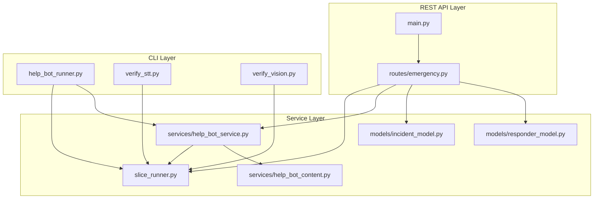
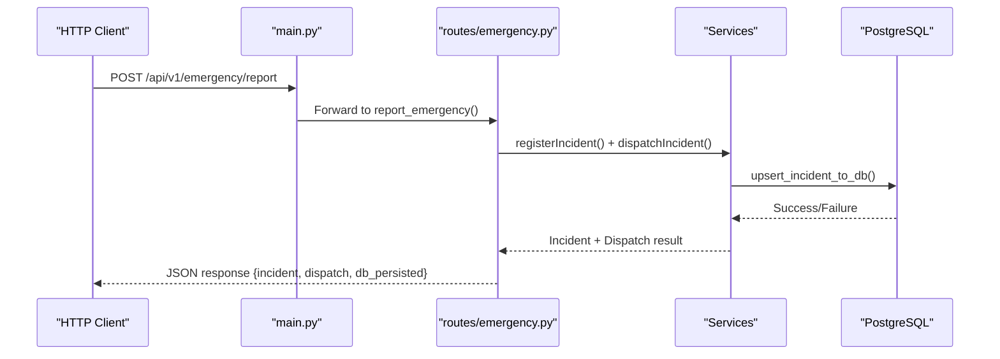

# API Reference

<cite>
**Referenced Files in This Document**
- [main.py](file://backend/main.py)
- [emergency.py](file://backend/routes/emergency.py)
- [help_bot_runner.py](file://backend/help_bot_runner.py)
- [slice_runner.py](file://backend/slice_runner.py)
- [help_bot_service.py](file://backend/services/help_bot_service.py)
- [help_bot_content.py](file://backend/services/help_bot_content.py)
- [incident_model.py](file://backend/models/incident_model.py)
- [responder_model.py](file://backend/models/responder_model.py)
- [verify_stt.py](file://backend/verify_stt.py)
- [verify_vision.py](file://backend/verify_vision.py)
- [PROJECT.md](file://PROJECT.md)
</cite>

## Update Summary
**Changes Made**
- Added comprehensive REST API documentation for FastAPI endpoints under `/api/v1`
- Documented standardized error contract with structured JSON responses
- Added form-encoded emergency reporting endpoint specifications
- Documented help-bot session management through HTTP stateful endpoints
- Added audio asset serving through static file mounting at `/media`
- Updated CLI documentation to reflect integration with new REST APIs
- Enhanced authentication and CORS configuration details

## Table of Contents
1. Introduction
2. Project Structure
3. Core Components
4. Architecture Overview
5. REST API Endpoints
6. CLI Commands and Interfaces
7. Internal Service Interfaces
8. Data Model Schemas
9. Error Handling and Authentication
10. Performance Considerations
11. Troubleshooting Guide
12. Migration Notes
13. Conclusion
14. Appendices

## Introduction
This document provides a comprehensive API reference for the LifeLine Ride system, focusing on:
- **REST API endpoints** with standardized error contracts and structured JSON responses
- **CLI commands** for help_bot_runner.py and slice_runner.py with enhanced integration
- **Internal service interfaces** used by both CLI and REST endpoints
- **Data model schemas**, error handling patterns, and provider boundaries
- **Protocol-specific usage examples**, expected outputs, and integration guidance
- **Authentication methods**, CORS configuration, rate limiting considerations, and versioning strategies
- **Audio asset serving** through static file mounting for help-bot TTS cache

The system implements a voice-first emergency triage and responder guidance flow with Urdu STT/TTS, vision-based injury classification, severity tiering, matching/dispatch to responders and Basic Health Units (BHUs), and a stateful help-bot session that can escalate incidents mid-session.

**Section sources**
- [PROJECT.md:1-20](file://PROJECT.md#L1-L20)
- [main.py:1-43](file://backend/main.py#L1-L43)

## Project Structure
At a high level:
- **backend/main.py**: FastAPI application entrypoint with startup bootstrap, CORS middleware, and static file mounting
- **backend/routes/emergency.py**: REST API controller layer with standardized error handling and all HTTP endpoints
- **backend/help_bot_runner.py**: CLI entrypoint for Module 2 help-bot runs (simulate, replay, mic mode, TTS prewarm/verify)
- **backend/slice_runner.py**: Module 1 triage pipeline, data models, seed data, matching/dispatch, and logging
- **backend/services/help_bot_service.py**: Help-bot conversation engine, STT/intent/TTS boundaries, session state machine, escalation hook
- **backend/services/help_bot_content.py**: Hardcoded Urdu first-aid content (branches, steps, Q&A, shared lines)
- **backend/models/**: SQLAlchemy ORM models for PostgreSQL persistence (incidents, responders, point transactions)
- **backend/verify_stt.py and verify_vision.py**: Verification utilities for STT and vision components



**Diagram sources**
- [main.py:247-271](file://backend/main.py#L247-L271)
- [emergency.py:180-728](file://backend/routes/emergency.py#L180-L728)
- [help_bot_runner.py:1-241](file://backend/help_bot_runner.py#L1-L241)
- [slice_runner.py:1-745](file://backend/slice_runner.py#L1-L745)
- [help_bot_service.py:1-800](file://backend/services/help_bot_service.py#L1-L800)
- [incident_model.py:1-416](file://backend/models/incident_model.py#L1-L416)
- [responder_model.py:1-579](file://backend/models/responder_model.py#L1-L579)

**Section sources**
- [main.py:1-301](file://backend/main.py#L1-L301)
- [emergency.py:1-728](file://backend/routes/emergency.py#L1-L728)
- [help_bot_runner.py:1-241](file://backend/help_bot_runner.py#L1-L241)
- [slice_runner.py:1-745](file://backend/slice_runner.py#L1-L745)
- [help_bot_service.py:1-800](file://backend/services/help_bot_service.py#L1-L800)
- [help_bot_content.py:1-255](file://backend/services/help_bot_content.py#L1-L255)
- [incident_model.py:1-416](file://backend/models/incident_model.py#L1-L416)
- [responder_model.py:1-579](file://backend/models/responder_model.py#L1-L579)
- [verify_stt.py:1-61](file://backend/verify_stt.py#L1-L61)
- [verify_vision.py:1-58](file://backend/verify_vision.py#L1-L58)

## Core Components
- **REST API Controller** (routes/emergency.py): Pure controller layer with payload validation, service invocation, and JSON responses
- **FastAPI Application** (main.py): Application setup with CORS middleware, error handlers, static file mounting, and health endpoints
- **CLI Entrypoint** (help_bot_runner.py): Entry point for running Module 2 help-bot scenarios with enhanced integration
- **Module 1 Pipeline** (slice_runner.py): STT, Vision, Classifier steps with provider abstraction and caching
- **Help-Bot Service** (services/help_bot_service.py): Conversation engine with provider boundaries and session management
- **Database Models** (models/): SQLAlchemy ORM models for PostgreSQL persistence with idempotent operations
- **Content Management** (services/help_bot_content.py): Hardcoded Urdu guidance per branch with shared lines

**Section sources**
- [emergency.py:1-123](file://backend/routes/emergency.py#L1-L123)
- [main.py:75-271](file://backend/main.py#L75-L271)
- [help_bot_runner.py:1-241](file://backend/help_bot_runner.py#L1-L241)
- [slice_runner.py:156-213](file://backend/slice_runner.py#L156-L213)
- [help_bot_service.py:95-117](file://backend/services/help_bot_service.py#L95-L117)
- [incident_model.py:49-113](file://backend/models/incident_model.py#L49-L113)
- [responder_model.py:36-82](file://backend/models/responder_model.py#L36-L82)
- [help_bot_content.py:21-43](file://backend/services/help_bot_content.py#L21-L43)

## Architecture Overview
The system composes four layers:
- **HTTP Layer**: FastAPI application with CORS, error handling, and static file serving
- **Controller Layer**: REST endpoints with standardized error contracts and request/response validation
- **Service Layer**: Business logic encapsulation with provider-agnostic AI calls and session management
- **Data Layer**: Pydantic models, SQLAlchemy ORM, and in-memory stores for incidents/responders/BHUs



**Diagram sources**
- [main.py:247-271](file://backend/main.py#L247-L271)
- [emergency.py:187-251](file://backend/routes/emergency.py#L187-L251)
- [incident_model.py:212-248](file://backend/models/incident_model.py#L212-L248)

## REST API Endpoints

### Base URL and Configuration
- **Base URL**: `http://localhost:5000/api/v1`
- **CORS**: Configured origins from environment variable or defaults (localhost:5173, localhost:4173)
- **Media Assets**: Static files served at `/media` from `mockdata/` directory
- **Health Check**: `GET /health` returns application status and metrics

### Emergency Reporting Endpoint
**POST** `/api/v1/emergency/report`

Form-encoded endpoint for registering, triaging, and dispatching emergencies.

**Request Parameters** (form-encoded):
- `latitude`: float - GPS latitude (-90.0 to 90.0)
- `longitude`: float - GPS longitude (-180.0 to 180.0)  
- `village_id`: string - Village identifier (required)
- `reporter_id`: string - Reporter identifier (optional, defaults to REP-USER-001)
- `photo_ref`: string - Photo reference path (required)
- `voice_ref`: string - Voice note reference path (required)

**Response Format**:
```json
{
  "incident": { /* Full incident object */ },
  "dispatch": {
    "status": "dispatched|escalated_bhu_only|no_responders_available",
    "responder": { /* Responder object if assigned */ },
    "bhu": { /* BHU object if notified */ },
    "notify_bhu": boolean,
    "bhu_urgency": string,
    "ambulance_requested": boolean,
    "reasoning": string
  },
  "db_persisted": boolean
}
```

**Error Responses**:
- `400 VALIDATION_ERROR`: Invalid coordinates or missing required fields
- `400 MISSING_PHOTO`: Photo reference is required
- `400 MISSING_VOICE_INPUT`: Voice reference is required

### Incident Management Endpoints

**GET** `/api/v1/emergency/incident/{incident_id}`
- Returns full incident lifecycle record from memory or database
- Response: Complete incident record with all historical data

**POST** `/api/v1/emergency/incident/{incident_id}/close`
- Closes an incident with outcome recording
- Request body: `{outcome: string, confirmed_by: string, closed_by_id?: string}`
- Valid outcomes: defined in lifecycle.VALID_OUTCOMES
- Valid confirmers: defined in lifecycle.VALID_CONFIRMERS

**GET** `/api/v1/emergency/incident/{incident_id}/timeline`
- Returns lightweight chronological status updates for distressed reporter tracking
- Response includes: incident_id, status, severity_tier, assigned_responder, coverage_gap, mid_incident_escalated, updates

### Help-Bot Session Management

**POST** `/api/v1/helpbot/step`
- Stateful help-bot guidance session over HTTP
- Request body: `{incident_id: string, responder_transcript?: string}`
- Maintains session state across requests with step progression and turn history
- Response includes: incident_id, branch_id, state, intent, qa_entry_id, escalation_signal, escalated, escalation_snapshot, spoken_text_urdu, step_index, step_id, turn_count, audio_url, audio_cached

**Session States**: created → initial_guidance → ongoing_monitor → escalated_monitor

### Responder Management

**POST** `/api/v1/responder/respond`
- Acknowledge or decline incident assignment
- Request body: `{incident_id: string, responder_id: string, action: "accept"|"decline", reason?: string}`

**POST** `/api/v1/responder/arrived`
- Mark responder arrival at incident location (Module 9)
- Request body: `{incident_id: string, responder_id: string}`

### Responder Registry and Onboarding

**POST** `/api/v1/responders/register`
- Register new candidate responder profile
- Request body: `{name: string, village: string, phone_number: string, linked_bhu_id: string, responder_id?: string, training_completed?: boolean, training_org?: string, equipment_checklist?: list}`
- Returns 201 Created with unverified status

**POST** `/api/v1/responders/{responder_id}/verify`
- Admin/trainer verification endpoint
- Request body: `{verified_by: string, equipment_checklist: list}`

**GET** `/api/v1/responders/pending`
- List candidate responders awaiting verification review
- Optional filter: `?village_id={village_id}`

**GET** `/api/v1/responders`
- Read-only availability view with optional filters
- Query parameters: `?village_id={village_id}&verified={boolean}`

### Accountability and Metrics

**GET** `/api/v1/accountability/responder/{responder_id}/performance`
- Factual performance record without scoring or ranking
- Response includes: incidents_responded_to, incidents_by_outcome, average_response_time_seconds, timeout_count, decline_count, dispatch_metrics, status_flag

### Audio Asset Serving

**Static File Mount**: `/media` serves files from `mockdata/` directory
- Help-bot TTS cache: `/media/helpbot/tts_cache/{filename}.wav`
- Media references in API responses use relative paths resolved by frontend

**Section sources**
- [emergency.py:187-728](file://backend/routes/emergency.py#L187-L728)
- [main.py:266-271](file://backend/main.py#L266-L271)

## CLI Commands and Interfaces

### help_bot_runner.py CLI
Enhanced with REST API integration capabilities.

**Command-line Arguments**:
- `--simulate <scenario>`: builds dispatched incident from seed flags/tier (heavy_bleeding, fracture_crush, snakebite)
- `--from-pipeline`: runs Module 1 triage on mock media first, then hands off to help bot
- `--photo <path>`: required with --from-pipeline; path to photo
- `--voice <path>`: required with --from-pipeline; path to voice note audio
- `--village <id>`: village identifier for location (default VILLAGE-A)
- `--mode <replay|mic>`: interaction mode (default replay)
- `script`: positional JSON replay script path when mode=replay
- `--prewarm-tts`: render all scripted lines into TTS cache and exit
- `--verify-tts`: run spoken-Urdu round-trip check and exit

**Usage Examples**:
- Simulate scenario and replay: `python backend/help_bot_runner.py --simulate heavy_bleeding --mode replay mockdata/helpbot/scripts/heavy_bleeding.json`
- Full pipeline run: `python backend/help_bot_runner.py --from-pipeline --photo <photo> --voice <voice> --village VILLAGE-A --mode replay <script>`
- Live hands-free: `python backend/help_bot_runner.py --simulate snakebite --mode mic`
- Pre-warm TTS: `python backend/help_bot_runner.py --prewarm-tts`
- Verify TTS: `python backend/help_bot_runner.py --verify-tts`

### slice_runner.py Verification Scripts
- `verify_stt.py`: Iterates audio clips, prints transcription vs ground truth, reports latency and failures
- `verify_vision.py`: Iterates photos, prints classification details and latency

**Section sources**
- [help_bot_runner.py:74-236](file://backend/help_bot_runner.py#L74-L236)
- [verify_stt.py:1-61](file://backend/verify_stt.py#L1-L61)
- [verify_vision.py:1-58](file://backend/verify_vision.py#L1-L58)

## Internal Service Interfaces

### Help-Bot Service Interface
**Purpose**: Conversation engine for guided first aid with Urdu voice

**Key Functions**:
- `route_branch(injury_type_flags)`: maps flags to branch id and whether matched
- `transcribeResponderInput(audio_bytes)`: STT step returning text and usability
- `detectResponderIntent(branch_id, transcript, current_step_line, recent_context)`: intent classification returning strict schema
- `speakGuidance(text)`: TTS with disk cache; returns wav_path, cached flag, bytes size
- `play_wav(wav_path, mic_monitor)`: playback with barge-in support
- `escalateIncident(incident_id, new_signals)`: upgrades tier, merges flags, marks BHU notification/ambulance request

### Module 1 Pipeline Interface
**Key Functions**:
- `getTriageResultMOCK(photo_ref, voice_note_transcript)`: real triage pipeline returning severity tier and injury flags
- `registerIncident(photo_ref, voice_transcript, gps_location, reporter_id)`: creates Incident via triage
- `matchResponderAndBHU(incident)`: finds available responder and linked BHU
- `dispatch(incident, responder, bhu)`: assigns responder, notifies BHU, requests ambulance for critical
- `logIncident(incident, dispatch_result)`: persists incident and dispatch status

**Section sources**
- [help_bot_service.py:95-117](file://backend/services/help_bot_service.py#L95-L117)
- [help_bot_service.py:120-168](file://backend/services/help_bot_service.py#L120-L168)
- [help_bot_service.py:170-289](file://backend/services/help_bot_service.py#L170-L289)
- [help_bot_service.py:291-388](file://backend/services/help_bot_service.py#L291-L388)
- [help_bot_service.py:390-570](file://backend/services/help_bot_service.py#L390-L570)
- [help_bot_service.py:572-657](file://backend/services/help_bot_service.py#L572-L657)
- [help_bot_service.py:663-783](file://backend/services/help_bot_service.py#L663-L783)
- [slice_runner.py:156-213](file://backend/slice_runner.py#L156-L213)
- [slice_runner.py:284-303](file://backend/slice_runner.py#L284-L303)
- [slice_runner.py:367-425](file://backend/slice_runner.py#L367-L425)
- [slice_runner.py:428-474](file://backend/slice_runner.py#L428-L474)
- [slice_runner.py:477-517](file://backend/slice_runner.py#L477-L517)
- [slice_runner.py:519-587](file://backend/slice_runner.py#L519-L587)
- [slice_runner.py:589-672](file://backend/slice_runner.py#L589-L672)

## Data Model Schemas

### Database Models

**IncidentRecord** (PostgreSQL table: incidents)
- Primary key: `incident_id` (VARCHAR(64))
- Core fields: timestamp_reported, reporter_id, latitude, longitude, village_id, photo_ref, voice_transcript, severity_tier, injury_type_flags
- Dispatch fields: responder_assigned_id, responder_dispatch_timestamp, bhu_notified, bhu_notify_timestamp, ambulance_requested
- Outcome fields: outcome, outcome_confirmed_by, incident_closed_timestamp
- Trace fields: help_bot_transitions (JSONB), dispatch_events (JSONB), dispatch_fallback_count
- Module 8&9 fields: coverage_gap, mid_incident_escalated, responder_arrived_timestamp, reporter_updates (JSONB)

**ResponderRecord** (PostgreSQL table: responders)
- Primary key: `responder_id` (VARCHAR(64))
- Core fields: name, village, linked_bhu_id, current_availability_status, points_total, reliability_tier
- Module 7 fields: phone_number (unique), is_verified, verified_by, verified_at, training_completed, training_org, equipment_checklist (JSONB)

**PointTransaction** (PostgreSQL table: point_transactions)
- Primary key: `id` (autoincrement)
- Fields: incident_id (unique), responder_id, delta, reason, awarded_at

### In-Memory Models

**GPSLocation**: latitude (float), longitude (float), village_id (str)
**Incident**: incident_id (str), timestamp_reported (str), reporter_id (str), gps_location (GPSLocation), photo_ref (str), voice_transcript (str), severity_tier (minor|moderate|critical), injury_type_flags (List[str]), responder_assigned_id (Optional[str]), responder_dispatch_timestamp (Optional[str]), bhu_notified (bool), bhu_notify_timestamp (Optional[str]), ambulance_requested (bool), outcome (Optional[self-resolved|taken_to_bhu|referred_to_hospital|unresolved]), help_bot_transitions (List[dict])
**Responder**: responder_id (str), name (str), village (str), linked_bhu_id (str), current_availability_status (available|busy|offline), points_total (int)
**BHU**: bhu_id (str), name (str), union_council (str), linked_village_ids (List[str])
**DispatchResult**: incident_id (str), responder (Optional[Responder]), bhu (Optional[BHU]), ambulance_requested (bool), status (dispatched|escalated_bhu_only|no_responders_available)

**Section sources**
- [incident_model.py:49-113](file://backend/models/incident_model.py#L49-L113)
- [responder_model.py:36-82](file://backend/models/responder_model.py#L36-L82)
- [slice_runner.py:156-213](file://backend/slice_runner.py#L156-L213)

## Error Handling and Authentication

### Standardized Error Contract
All API errors follow a consistent JSON structure:
```json
{
  "code": "ERROR_CODE",
  "message": "Human-readable error description"
}
```

**Error Codes**:
- `VALIDATION_ERROR`: Invalid input parameters or payload
- `INCIDENT_NOT_FOUND`: Referenced incident does not exist
- `INCIDENT_CLOSED`: Attempted operation on closed incident
- `NOT_ASSIGNED_RESPONDER`: Responder not assigned to incident
- `ALREADY_CLOSED`: Incident already closed
- `RESPONDER_NOT_FOUND`: Referenced responder does not exist
- `INTERNAL_ERROR`: Unhandled server error

### Authentication and Security
- **CORS Configuration**: Configurable origins via environment variable `CORS_ORIGINS`
- **Default Origins**: localhost:5173, 127.0.0.1:5173, localhost:4173, 127.0.0.1:4173
- **Allowed Methods**: GET, POST, PUT, PATCH, DELETE, OPTIONS
- **Allowed Headers**: Content-Type, Authorization
- **Credentials**: Enabled for cross-origin requests

### Rate Limiting and Quota Management
- Provider calls wrapped with retry on quota/rate-limit errors with exponential backoff
- Timeout and retries controlled via `TRIAGE_CALL_TIMEOUT_S` and `TRIAGE_QUOTA_RETRIES`
- TTS caching prevents repeated synthesis calls during demo sessions

**Section sources**
- [emergency.py:66-123](file://backend/routes/emergency.py#L66-L123)
- [main.py:78-90](file://backend/main.py#L78-L90)
- [main.py:249-258](file://backend/main.py#L249-L258)

## Performance Considerations

### API Performance
- **Form-encoded submissions**: Optimized for mobile field-app submissions with GPS and media refs
- **Stateful help-bot sessions**: Reduces AI calls by maintaining conversation context
- **Database optimization**: Composite indexes on frequently queried columns (responder_assigned_id, outcome_confirmed_by)
- **Idempotent operations**: PostgreSQL INSERT ... ON CONFLICT DO UPDATE for safe retries

### Caching Strategies
- **TTS caching**: Disk-based cache keyed by voice+text; manifest tracks provenance
- **Triage caching**: Identical media inputs reuse cached results to avoid repeated AI calls
- **Session caching**: Help-bot sessions maintained in memory for fast state access

### Audio Asset Serving
- **Static file mounting**: Direct file serving from `mockdata/` directory via FastAPI StaticFiles
- **TTS cache optimization**: Pre-warming recommended to avoid quota limits during demos
- **Best-effort audio**: Playback/capture gracefully handled in headless environments

**Section sources**
- [main.py:266-271](file://backend/main.py#L266-L271)
- [incident_model.py:102-109](file://backend/models/incident_model.py#L102-L109)
- [help_bot_service.py:390-570](file://backend/services/help_bot_service.py#L390-L570)

## Troubleshooting Guide

### Common Issues and Solutions
- **Database connectivity**: Bootstrap function handles DB unreachability gracefully, falling back to seed data
- **CORS errors**: Configure `CORS_ORIGINS` environment variable for development domains
- **Missing media files**: Static file mount warns if `mockdata/` directory is missing
- **Help-bot session issues**: Sessions automatically cleaned up when incidents are closed
- **Provider quota exhaustion**: Retries with backoff; consider prewarming TTS and using cached triage results

### Operational Checks
- **Health endpoint**: `GET /health` returns application status, DB reachability, and session counts
- **Verification scripts**: `verify_stt.py` and `verify_vision.py` validate component functionality
- **Bootstrap summary**: Startup logs show seeding, loading, rehydration, and reconciliation results

**Section sources**
- [main.py:105-116](file://backend/main.py#L105-L116)
- [main.py:164-231](file://backend/main.py#L164-L231)
- [main.py:274-287](file://backend/main.py#L274-L287)
- [verify_stt.py:22-52](file://backend/verify_stt.py#L22-L52)
- [verify_vision.py:22-49](file://backend/verify_vision.py#L22-L49)

## Migration Notes

### Version Compatibility
- **API Version**: All endpoints under `/api/v1` prefix for future evolution
- **Backward compatibility**: Additive fields preserve older client expectations
- **Provider abstraction**: TRIAGE_AI_PROVIDER allows switching between Gemini and DashScope without code changes

### Deprecated Features
- **Legacy endpoints**: No deprecated endpoints currently; placeholder routes exist for future expansion
- **Points system**: Removed leaderboard endpoint to prevent incentivizing scoring over helping

### Upgrade Path
- **Database migrations**: SQLAlchemy models auto-create tables; existing data preserved via idempotent upserts
- **Configuration**: Environment variables provide flexible configuration without code changes
- **Testing**: Comprehensive test suite validates backward compatibility

**Section sources**
- [emergency.py:180](file://backend/routes/emergency.py#L180)
- [incident_model.py:212-248](file://backend/models/incident_model.py#L212-L248)
- [responder_model.py:369-426](file://backend/models/responder_model.py#L369-L426)

## Conclusion
The LifeLine Ride system provides a comprehensive emergency response platform with:
- **Robust REST API** with standardized error handling and structured JSON responses
- **Stateful help-bot sessions** over HTTP for continuous guidance
- **Form-encoded emergency reporting** optimized for mobile field applications
- **Static file serving** for audio assets and media references
- **Persistent data layer** with PostgreSQL integration and idempotent operations
- **Flexible CLI tools** for testing, verification, and development workflows

The architecture supports future expansion while maintaining backward compatibility and providing clear migration paths for evolving requirements.

## Appendices

### REST API Quick Reference

**Emergency Reporting**:
- `POST /api/v1/emergency/report` - Form-encoded emergency registration and dispatch
- `GET /api/v1/emergency/incident/{id}` - Retrieve full incident record
- `POST /api/v1/emergency/incident/{id}/close` - Close incident with outcome
- `GET /api/v1/emergency/incident/{id}/timeline` - Get incident timeline

**Help-Bot Sessions**:
- `POST /api/v1/helpbot/step` - Stateful conversation step with intent detection

**Responder Management**:
- `POST /api/v1/responder/respond` - Accept or decline incident assignment
- `POST /api/v1/responder/arrived` - Mark responder arrival
- `POST /api/v1/responders/register` - Register new responder candidate
- `POST /api/v1/responders/{id}/verify` - Verify responder credentials
- `GET /api/v1/responders` - List responders with filters

**Accountability**:
- `GET /api/v1/accountability/responder/{id}/performance` - Factual performance metrics

**System**:
- `GET /health` - Application health and status

### CLI Command Reference
- **help_bot_runner.py**: Enhanced with REST API integration capabilities
- **verify_stt.py**: STT accuracy and latency validation
- **verify_vision.py**: Vision classification and latency validation

### Environment Variables
- `PORT`: Server port (default 5000)
- `CORS_ORIGINS`: Comma-separated list of allowed origins
- `DASHSCOPE_API_KEY`, `GEMINI_API_KEY`: AI provider authentication
- `TRIAGE_AI_PROVIDER`: gemini or dashscope
- `TRIAGE_CALL_TIMEOUT_S`, `TRIAGE_QUOTA_RETRIES`: Provider call configuration

**Section sources**
- [emergency.py:180-728](file://backend/routes/emergency.py#L180-L728)
- [help_bot_runner.py:74-236](file://backend/help_bot_runner.py#L74-L236)
- [verify_stt.py:22-52](file://backend/verify_stt.py#L22-L52)
- [verify_vision.py:22-49](file://backend/verify_vision.py#L22-L49)
- [main.py:78-90](file://backend/main.py#L78-L90)
- [main.py:298-300](file://backend/main.py#L298-L300)