# Audio Processing & Voice Interface

<cite>
**Referenced Files in This Document**
- [help_bot_service.py](file://backend/services/help_bot_service.py)
- [help_bot_content.py](file://backend/services/help_bot_content.py)
- [help_bot_runner.py](file://backend/help_bot_runner.py)
- [slice_runner.py](file://backend/slice_runner.py)
- [verify_stt.py](file://backend/verify_stt.py)
- [manifest.json](file://mockdata/helpbot/tts_cache/manifest.json)
</cite>

## Table of Contents
1. Introduction
2. Project Structure
3. Core Components
4. Architecture Overview
5. Detailed Component Analysis
6. Dependency Analysis
7. Performance Considerations
8. Troubleshooting Guide
9. Conclusion
10. Appendices

## Introduction
This document explains the Audio Processing & Voice Interface sub-component that powers real-time voice interaction for a first-responder help bot. It covers:
- Voice Activity Detection (VAD) and utterance capture
- Barge-in to interrupt playback during guidance
- Urdu speech recognition integration via STT providers
- Audio capture and playback pipeline
- TTS caching strategy for performance and quota management
- Error handling for audio device failures and provider errors
- Integration with the help bot system for hands-free operation
- Considerations for low-connectivity environments
- Performance optimization, battery usage, and accessibility considerations

## Project Structure
The audio and voice features are implemented primarily in the backend services and runner:
- Help Bot Service: VAD, barge-in, STT/TTS boundaries, session state machine, playback control
- Help Bot Content: Hardcoded Urdu guidance content used by the bot
- Runner: CLI entrypoints to run replay or live mic mode, prewarm TTS cache, verify TTS round-trip
- Slice Runner: Shared AI provider boundary for STT, vision triage, and dispatch logic
- Verification script: Validates Urdu STT accuracy on sample clips
- TTS Cache manifest: Tracks rendered audio assets and provenance

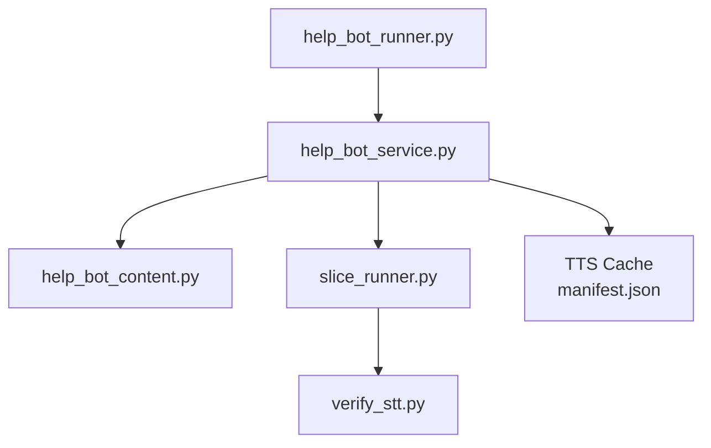

**Diagram sources**
- [help_bot_runner.py:175-235](file://backend/help_bot_runner.py#L175-L235)
- [help_bot_service.py:368-444](file://backend/services/help_bot_service.py#L368-L444)
- [help_bot_content.py:22-43](file://backend/services/help_bot_content.py#L22-L43)
- [slice_runner.py:369-425](file://backend/slice_runner.py#L369-L425)
- [manifest.json:1-152](file://mockdata/helpbot/tts_cache/manifest.json#L1-L152)

**Section sources**
- [help_bot_runner.py:1-241](file://backend/help_bot_runner.py#L1-L241)
- [help_bot_service.py:1-960](file://backend/services/help_bot_service.py#L1-L960)
- [help_bot_content.py:1-255](file://backend/services/help_bot_content.py#L1-L255)
- [slice_runner.py:1-745](file://backend/slice_runner.py#L1-L745)
- [verify_stt.py:1-60](file://backend/verify_stt.py#L1-L60)
- [manifest.json:1-152](file://mockdata/helpbot/tts_cache/manifest.json#L1-L152)

## Core Components
- MicMonitor: Continuous microphone capture at 16 kHz mono with energy-based VAD and barge-in detection
- play_wav: Best-effort playback with interruption support when barge-in is detected
- STT boundary: Provider-agnostic transcription of responder utterances (Gemini or DashScope)
- Intent classification: Classifies user intent into step completion, in-scope question, out-of-scope, escalation, or unclear
- TTS boundary: Provider-agnostic synthesis of Urdu guidance with disk caching
- HelpBotSession: Orchestrates guidance flow, state transitions, and turn handling
- Runner: CLI to run replay or live mic mode; prewarms TTS cache; verifies TTS round-trip

**Section sources**
- [help_bot_service.py:456-569](file://backend/services/help_bot_service.py#L456-L569)
- [help_bot_service.py:405-444](file://backend/services/help_bot_service.py#L405-L444)
- [help_bot_service.py:127-167](file://backend/services/help_bot_service.py#L127-L167)
- [help_bot_service.py:244-288](file://backend/services/help_bot_service.py#L244-L288)
- [help_bot_service.py:307-387](file://backend/services/help_bot_service.py#L307-L387)
- [help_bot_service.py:663-960](file://backend/services/help_bot_service.py#L663-L960)
- [help_bot_runner.py:102-172](file://backend/help_bot_runner.py#L102-L172)

## Architecture Overview
The voice interface follows a continuous listen-think-respond loop:
- Capture: MicMonitor streams audio blocks, computes energy, and detects speech segments using VAD thresholds
- Transcribe: Utterance PCM/WAV is sent to STT provider to get Urdu transcript
- Classify: Transcript is classified into intents to decide next action
- Speak: Guidance text is synthesized to Urdu audio via TTS, cached on disk, and played back
- Barge-in: During playback, if sustained speech energy exceeds threshold, playback is interrupted

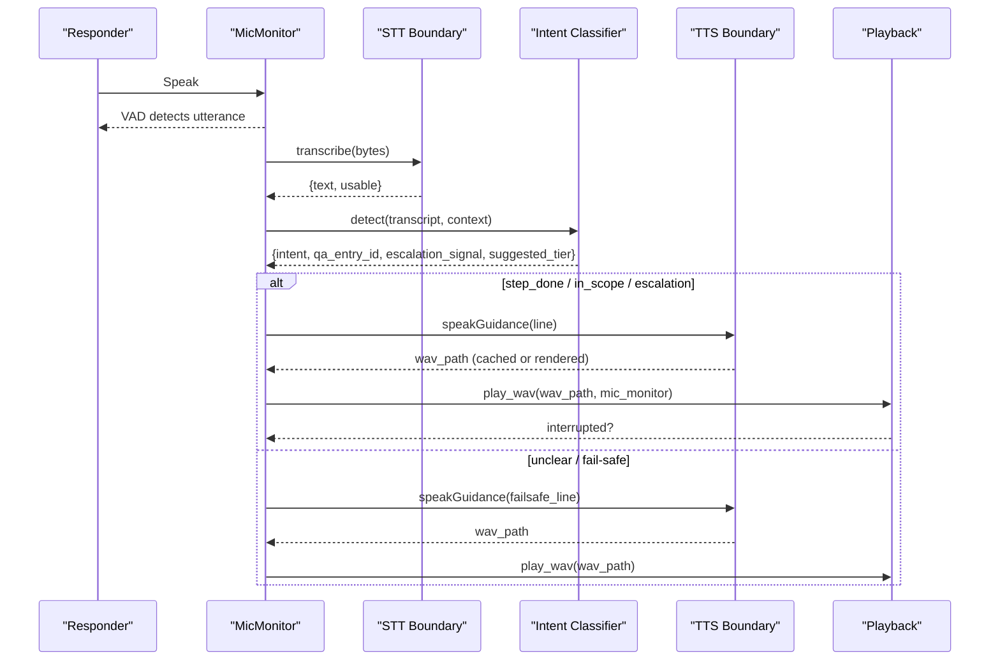

**Diagram sources**
- [help_bot_service.py:456-569](file://backend/services/help_bot_service.py#L456-L569)
- [help_bot_service.py:127-167](file://backend/services/help_bot_service.py#L127-L167)
- [help_bot_service.py:244-288](file://backend/services/help_bot_service.py#L244-L288)
- [help_bot_service.py:307-387](file://backend/services/help_bot_service.py#L307-L387)
- [help_bot_service.py:405-444](file://backend/services/help_bot_service.py#L405-L444)

## Detailed Component Analysis

### Voice Activity Detection (VAD) and Capture Pipeline
- MicMonitor opens an InputStream at 16 kHz mono, buffering recent blocks in a ring buffer
- Energy per block is computed; noise floor is calibrated from recent blocks
- Speech threshold is set above noise floor; utterance capture uses silence gaps and max length constraints
- Returns WAV bytes for one utterance or None if no valid speech detected

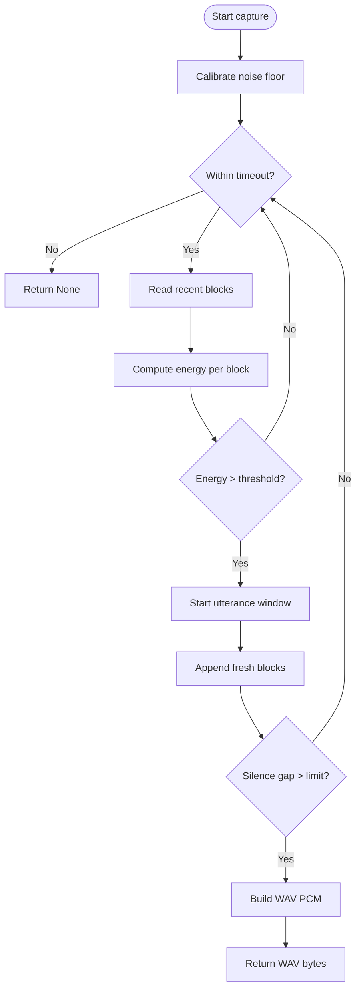

**Diagram sources**
- [help_bot_service.py:498-569](file://backend/services/help_bot_service.py#L498-L569)

**Section sources**
- [help_bot_service.py:456-569](file://backend/services/help_bot_service.py#L456-L569)

### Barge-In Functionality
- During playback, the player polls MicMonitor.barge_in_detected() periodically
- Barge-in triggers when sustained speech energy exceeds a raised threshold over a short hold time
- Playback stream is aborted and the session resumes listening

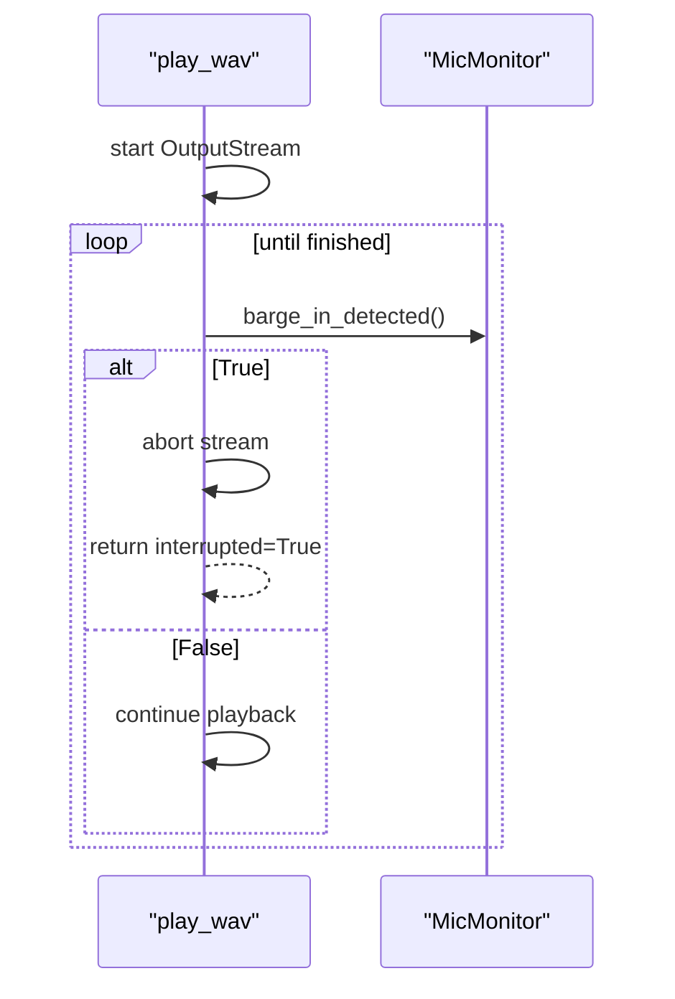

**Diagram sources**
- [help_bot_service.py:405-444](file://backend/services/help_bot_service.py#L405-L444)
- [help_bot_service.py:509-519](file://backend/services/help_bot_service.py#L509-L519)

**Section sources**
- [help_bot_service.py:405-444](file://backend/services/help_bot_service.py#L405-L444)
- [help_bot_service.py:509-519](file://backend/services/help_bot_service.py#L509-L519)

### Urdu Speech Recognition Integration (STT)
- Provider boundary supports Gemini and DashScope implementations
- For live sessions, bytes are passed directly; for file-based verification, paths are used
- On any error, returns unusable so the session can fall back to failsafe lines

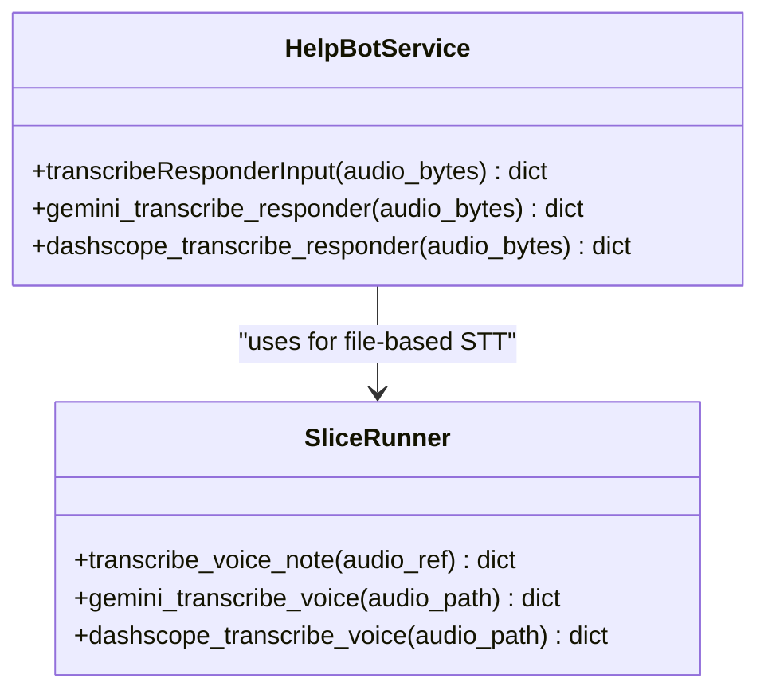

**Diagram sources**
- [help_bot_service.py:127-167](file://backend/services/help_bot_service.py#L127-L167)
- [slice_runner.py:369-425](file://backend/slice_runner.py#L369-L425)

**Section sources**
- [help_bot_service.py:127-167](file://backend/services/help_bot_service.py#L127-L167)
- [slice_runner.py:369-425](file://backend/slice_runner.py#L369-L425)
- [verify_stt.py:22-52](file://backend/verify_stt.py#L22-L52)

### Audio Capture and Playback Pipeline
- Capture: MicMonitor captures PCM blocks, builds WAV, and sends to STT
- Playback: play_wav reads WAV, streams int16 frames, checks for barge-in
- Device availability: If sounddevice is unavailable, playback returns False and logs a warning

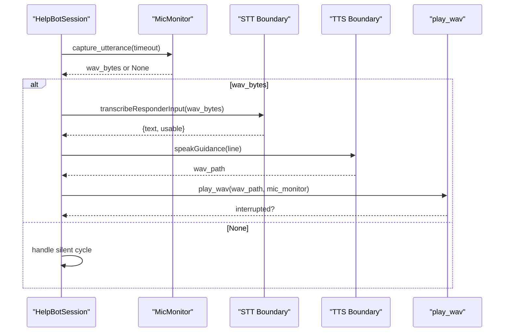

**Diagram sources**
- [help_bot_service.py:405-444](file://backend/services/help_bot_service.py#L405-L444)
- [help_bot_service.py:456-569](file://backend/services/help_bot_service.py#L456-L569)
- [help_bot_service.py:307-387](file://backend/services/help_bot_service.py#L307-L387)

**Section sources**
- [help_bot_service.py:405-444](file://backend/services/help_bot_service.py#L405-L444)
- [help_bot_service.py:456-569](file://backend/services/help_bot_service.py#L456-L569)
- [help_bot_service.py:307-387](file://backend/services/help_bot_service.py#L307-L387)

### TTS Caching Strategy
- Every scripted line is synthesized once and saved as WAV under tts_cache
- Manifest tracks model, voice, render timestamp, and truncated source text
- Prewarm function renders all lines with pacing to respect rate limits; subsequent runs hit cache
- Fail-safe line is prerendered at session start to ensure vocal fallback even if network fails later

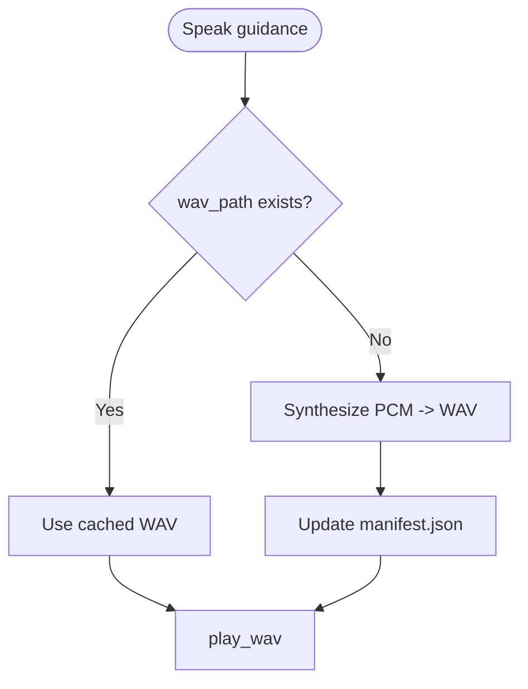

**Diagram sources**
- [help_bot_service.py:350-387](file://backend/services/help_bot_service.py#L350-L387)
- [help_bot_runner.py:102-132](file://backend/help_bot_runner.py#L102-L132)
- [manifest.json:1-152](file://mockdata/helpbot/tts_cache/manifest.json#L1-L152)

**Section sources**
- [help_bot_service.py:350-387](file://backend/services/help_bot_service.py#L350-L387)
- [help_bot_runner.py:102-132](file://backend/help_bot_runner.py#L102-L132)
- [manifest.json:1-152](file://mockdata/helpbot/tts_cache/manifest.json#L1-L152)

### Intent Classification and Action Handling
- Intent classifier receives branch context, current step, recent conversation, and latest transcript
- Outputs strict schema: step_done, in_scope_question, out_of_scope, escalation, unclear
- Actions include advancing steps, answering Q&A, speaking honest fallback, escalating incident, or playing failsafe

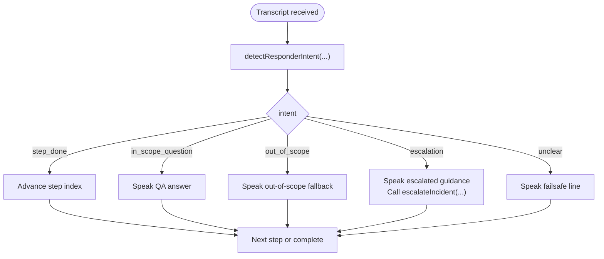

**Diagram sources**
- [help_bot_service.py:244-288](file://backend/services/help_bot_service.py#L244-L288)
- [help_bot_service.py:833-874](file://backend/services/help_bot_service.py#L833-L874)

**Section sources**
- [help_bot_service.py:244-288](file://backend/services/help_bot_service.py#L244-L288)
- [help_bot_service.py:833-874](file://backend/services/help_bot_service.py#L833-L874)

### Live Hands-Free Operation and Replay Mode
- Live mode: Opens mic, calibrates, starts guidance, loops capture/transcribe/classify/speak
- Replay mode: Deterministic turns from script JSON; audio turns exercise real STT path; text turns skip STT
- Finalization writes session record including latencies, expectations, and transitions

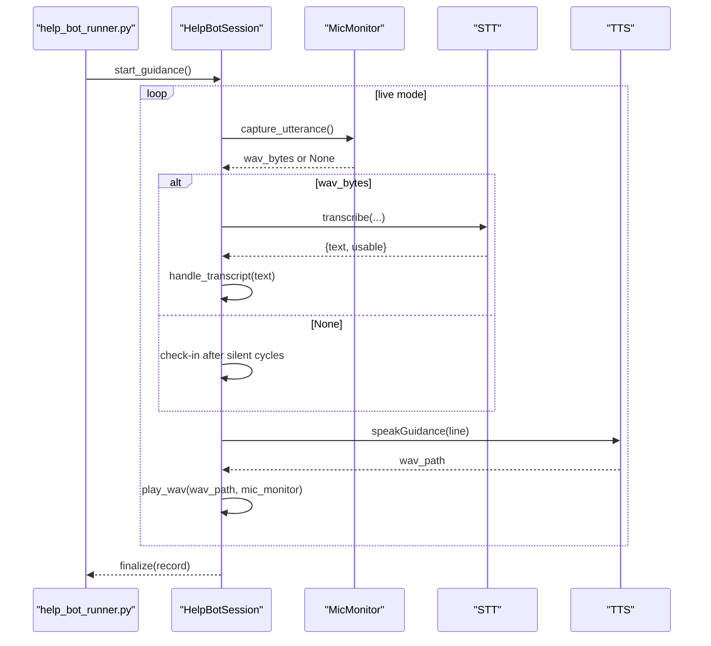

**Diagram sources**
- [help_bot_runner.py:175-235](file://backend/help_bot_runner.py#L175-L235)
- [help_bot_service.py:878-925](file://backend/services/help_bot_service.py#L878-L925)
- [help_bot_service.py:929-960](file://backend/services/help_bot_service.py#L929-L960)

**Section sources**
- [help_bot_runner.py:175-235](file://backend/help_bot_runner.py#L175-L235)
- [help_bot_service.py:878-925](file://backend/services/help_bot_service.py#L878-L925)
- [help_bot_service.py:929-960](file://backend/services/help_bot_service.py#L929-L960)

### Integration with Help Bot System
- Branch routing maps injury flags to knowledge branches
- Escalation hook updates severity tier, merges flags, marks BHU notification and ambulance request
- Incident store snapshots are kept synchronized for auditability

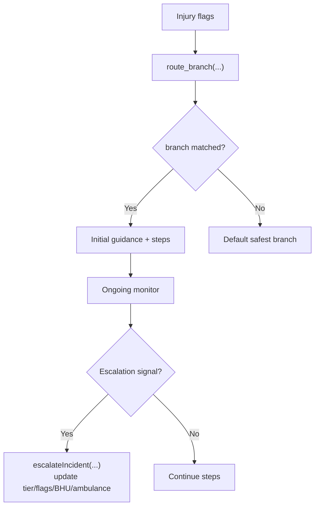

**Diagram sources**
- [help_bot_service.py:95-116](file://backend/services/help_bot_service.py#L95-L116)
- [help_bot_service.py:576-647](file://backend/services/help_bot_service.py#L576-L647)

**Section sources**
- [help_bot_service.py:95-116](file://backend/services/help_bot_service.py#L95-L116)
- [help_bot_service.py:576-647](file://backend/services/help_bot_service.py#L576-L647)

## Dependency Analysis
- HelpBotSession depends on MicMonitor for capture and barge-in, STT/TTS boundaries for I/O, and content module for scripted lines
- STT/TTS boundaries delegate to slice_runner provider implementations
- Runner orchestrates modes and utilities like prewarm and verify-tts
- TTS cache manifest provides provenance and enables deterministic runs

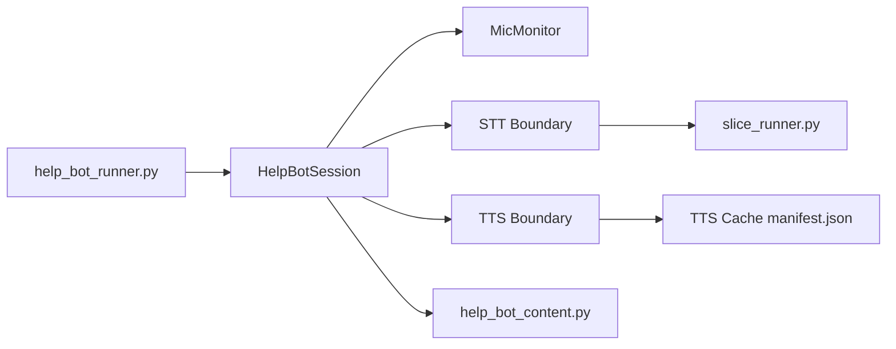

**Diagram sources**
- [help_bot_runner.py:175-235](file://backend/help_bot_runner.py#L175-L235)
- [help_bot_service.py:663-960](file://backend/services/help_bot_service.py#L663-L960)
- [help_bot_content.py:22-43](file://backend/services/help_bot_content.py#L22-L43)
- [slice_runner.py:369-425](file://backend/slice_runner.py#L369-L425)
- [manifest.json:1-152](file://mockdata/helpbot/tts_cache/manifest.json#L1-L152)

**Section sources**
- [help_bot_runner.py:175-235](file://backend/help_bot_runner.py#L175-L235)
- [help_bot_service.py:663-960](file://backend/services/help_bot_service.py#L663-L960)
- [help_bot_content.py:22-43](file://backend/services/help_bot_content.py#L22-L43)
- [slice_runner.py:369-425](file://backend/slice_runner.py#L369-L425)
- [manifest.json:1-152](file://mockdata/helpbot/tts_cache/manifest.json#L1-L152)

## Performance Considerations
- TTS prewarming reduces latency and avoids quota exhaustion during demos; subsequent runs achieve near-zero TTS latency via cache hits
- VAD thresholds adapt to ambient noise; calibration minimizes false positives/negatives
- Barge-in uses a raised threshold to avoid self-interruption due to speaker-to-mic echo
- Provider calls use timeouts and retry on quota limits to keep the pipeline responsive
- In low-connectivity environments:
  - Pre-render critical lines (including failsafe) before going live
  - Prefer replay mode for deterministic testing without network
  - Rely on cached TTS assets to minimize online calls
- Mobile/battery considerations:
  - Keep mic sampling at 16 kHz mono to reduce CPU and power
  - Limit continuous capture duration; stop mic promptly after session ends
  - Avoid unnecessary re-renders by leveraging TTS cache
- Accessibility:
  - Provide clear audible cues and consistent pacing
  - Ensure failsafe lines are always available to prevent dead air
  - Offer visual feedback where possible (e.g., status indicators) to complement audio-only flows

[No sources needed since this section provides general guidance]

## Troubleshooting Guide
- No audio device:
  - Playback returns False and logs a warning; session continues with transcripts and saved WAVs as evidence
- STT failure:
  - Returns unusable; session speaks failsafe line and continues loop
- Intent classification failure:
  - Normalized to unclear; session speaks failsafe and persists
- TTS failure:
  - Speaks failsafe line; if failsafe WAV is not available, prints Urdu text
- Low connectivity:
  - Use prewarm-tts to populate cache; rely on cached assets
  - Verify STT accuracy offline using verify_stt.py against local clips
- Calibration issues:
  - Re-run calibration in quiet environment; adjust thresholds by ensuring speech_threshold > noise_floor

**Section sources**
- [help_bot_service.py:394-402](file://backend/services/help_bot_service.py#L394-L402)
- [help_bot_service.py:405-444](file://backend/services/help_bot_service.py#L405-L444)
- [help_bot_service.py:159-167](file://backend/services/help_bot_service.py#L159-L167)
- [help_bot_service.py:274-288](file://backend/services/help_bot_service.py#L274-L288)
- [help_bot_service.py:727-757](file://backend/services/help_bot_service.py#L727-L757)
- [verify_stt.py:22-52](file://backend/verify_stt.py#L22-L52)

## Conclusion
The Audio Processing & Voice Interface delivers a robust, real-time voice interaction system tailored for emergency responders. It combines reliable VAD, effective barge-in, provider-agnostic STT/TTS, and a hardened session loop with failsafes. The TTS caching strategy ensures performance and resilience under quota constraints. With careful calibration, error handling, and operational modes (live vs replay), the system remains functional in challenging environments while prioritizing safety and clarity.

[No sources needed since this section summarizes without analyzing specific files]

## Appendices

### Concrete Examples from Codebase
- Microphone access and capture:
  - See MicMonitor initialization and capture_utterance for live capture and VAD chunking
  - Reference: [help_bot_service.py:456-569](file://backend/services/help_bot_service.py#L456-L569)
- Audio stream processing:
  - See play_wav callback streaming int16 frames and barge-in polling
  - Reference: [help_bot_service.py:405-444](file://backend/services/help_bot_service.py#L405-L444)
- Voice command interpretation:
  - See intent detection and action handling for step completion, Q&A, escalation, and failsafe
  - Reference: [help_bot_service.py:244-288](file://backend/services/help_bot_service.py#L244-L288), [help_bot_service.py:833-874](file://backend/services/help_bot_service.py#L833-L874)
- TTS caching:
  - See speakGuidance and prewarm_tts for rendering and caching Urdu guidance
  - Reference: [help_bot_service.py:350-387](file://backend/services/help_bot_service.py#L350-L387), [help_bot_runner.py:102-132](file://backend/help_bot_runner.py#L102-L132)
- STT verification:
  - See verify_stt.py for running Urdu STT accuracy checks on sample clips
  - Reference: [verify_stt.py:22-52](file://backend/verify_stt.py#L22-L52)

[No additional sources beyond those cited above]