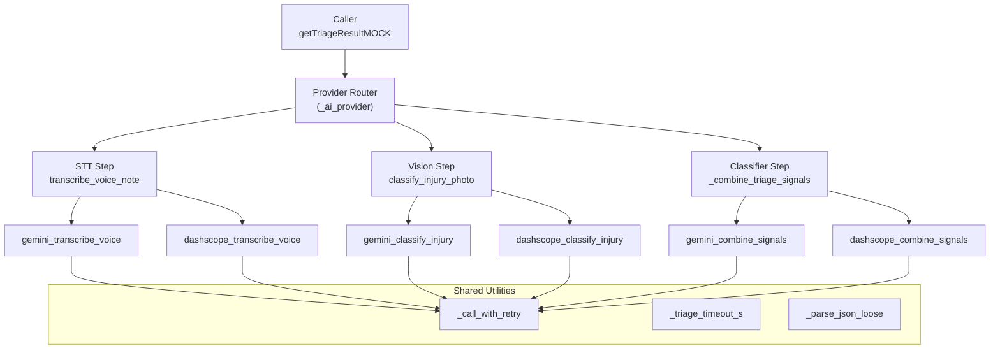
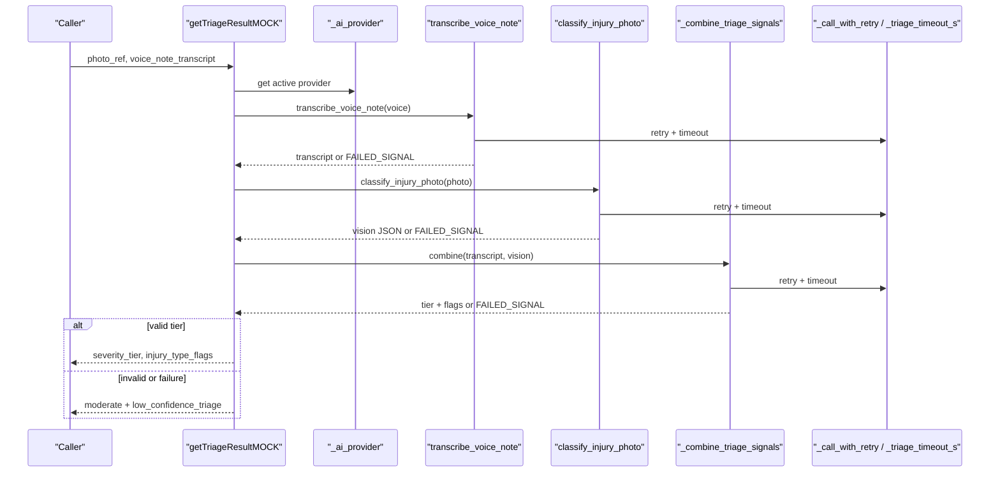
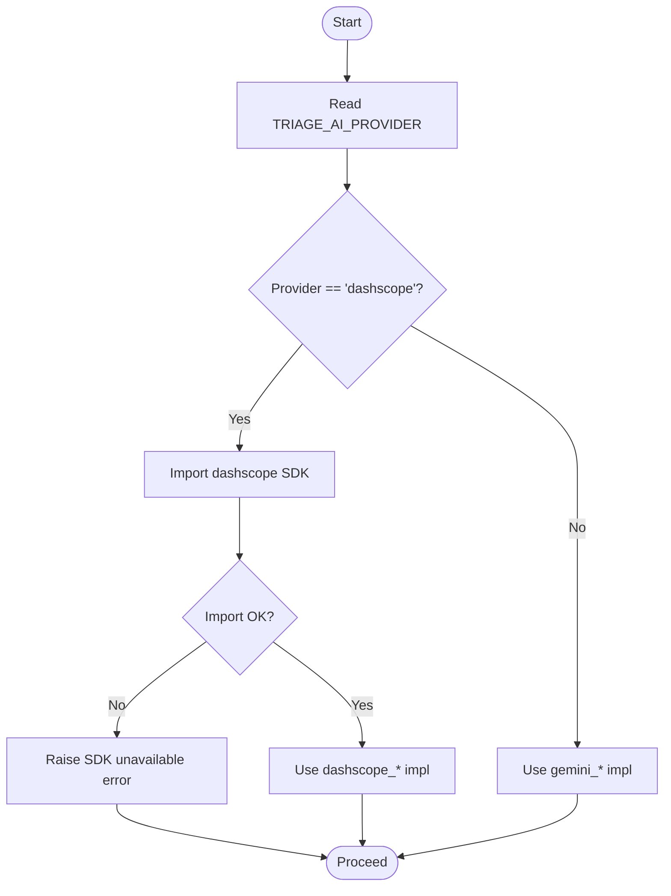
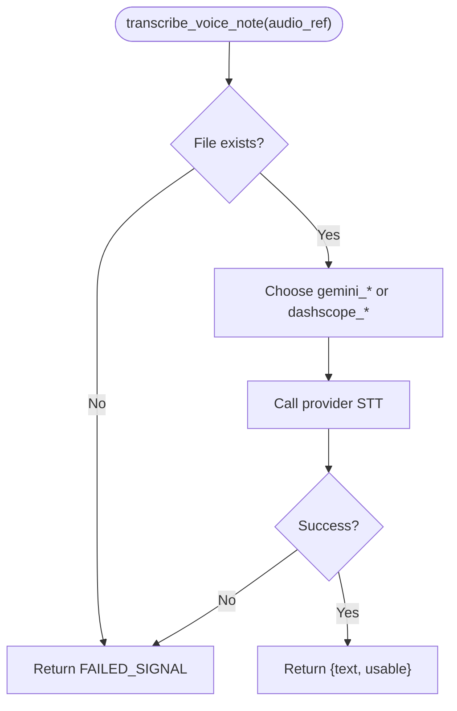
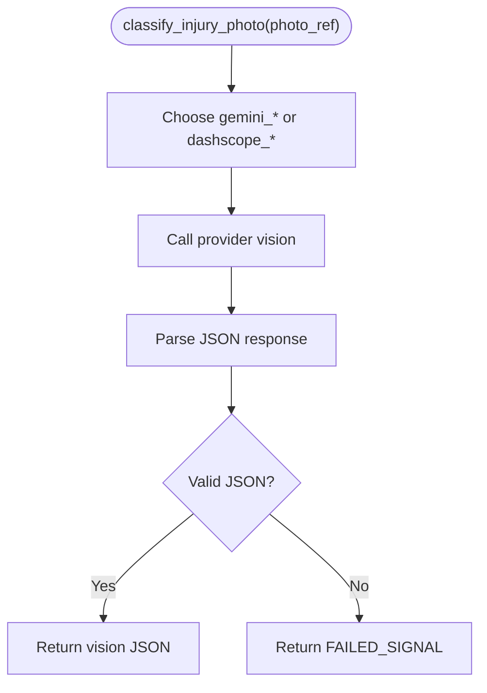
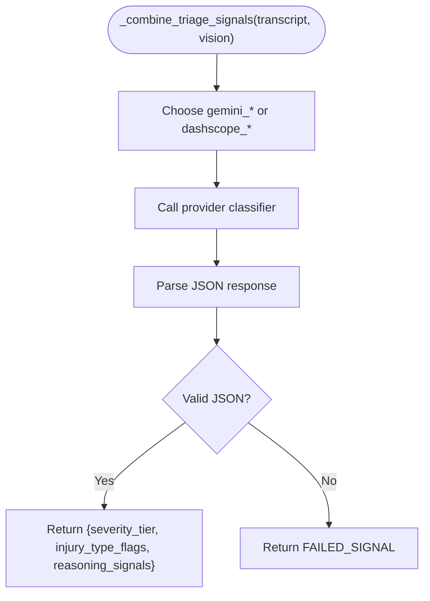
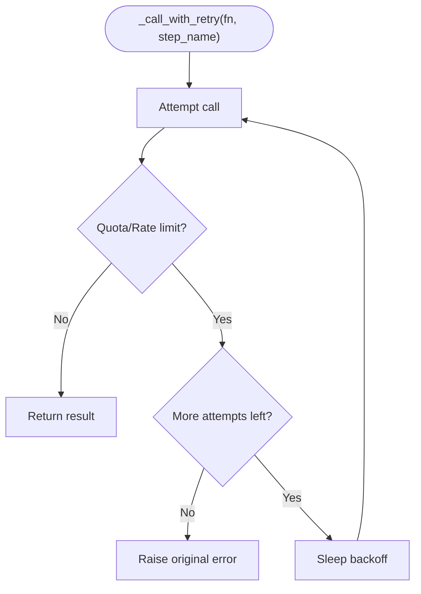
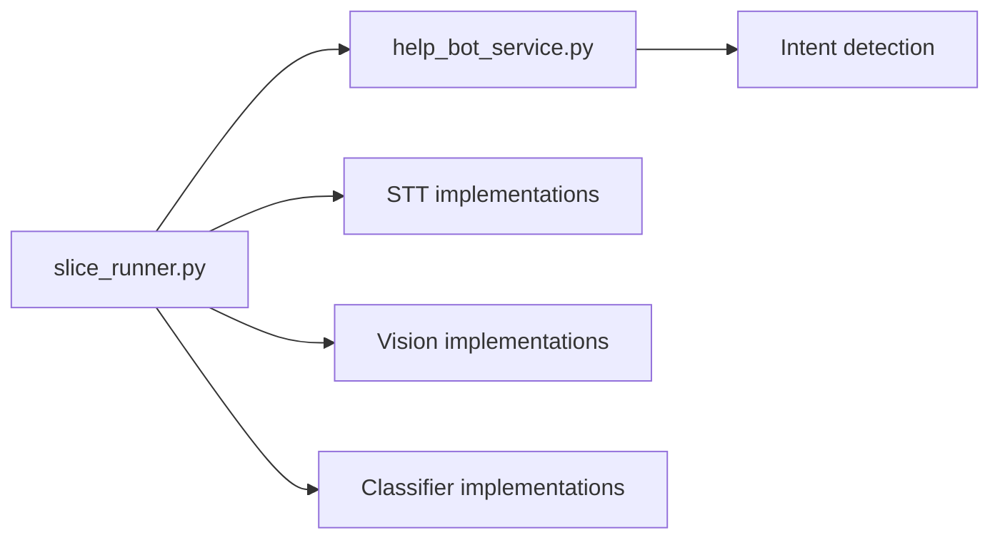

# AI Provider Abstraction Layer

<cite>
**Referenced Files in This Document**
- [slice_runner.py](file://backend/slice_runner.py)
- [help_bot_service.py](file://backend/services/help_bot_service.py)
</cite>

## Table of Contents
1. [Introduction](#introduction)
2. [Project Structure](#project-structure)
3. [Core Components](#core-components)
4. [Architecture Overview](#architecture-overview)
5. [Detailed Component Analysis](#detailed-component-analysis)
6. [Dependency Analysis](#dependency-analysis)
7. [Performance Considerations](#performance-considerations)
8. [Troubleshooting Guide](#troubleshooting-guide)
9. [Conclusion](#conclusion)
10. [Appendices](#appendices)

## Introduction
This document describes the AI provider abstraction layer that enables switching between Gemini and DashScope services for speech-to-text, vision analysis, and severity classification. It explains how the TRIAGE_AI_PROVIDER environment variable selects the active provider, how calls are routed to provider-specific implementations, and how failover, retry with backoff, and timeouts protect the emergency triage pipeline. It also documents configuration requirements for both providers and shows how to integrate a new provider by implementing the same interface functions.

## Project Structure
The abstraction is implemented primarily in:
- backend/slice_runner.py: Core triage pipeline, provider selection, shared utilities (retry, timeout, JSON parsing), and provider-specific STT/vision/classifier implementations.
- backend/services/help_bot_service.py: Responder help bot that reuses the same provider boundary pattern for STT and intent classification, plus TTS (currently Gemini-only).

**Diagram sources**
- [slice_runner.py:132-139](file://backend/slice_runner.py#L132-L139)
- [slice_runner.py:367-425](file://backend/slice_runner.py#L367-L425)
- [slice_runner.py:428-474](file://backend/slice_runner.py#L428-L474)
- [slice_runner.py:477-516](file://backend/slice_runner.py#L477-L516)
- [slice_runner.py:72-95](file://backend/slice_runner.py#L72-L95)
- [slice_runner.py:55-69](file://backend/slice_runner.py#L55-L69)
- [slice_runner.py:349-364](file://backend/slice_runner.py#L349-L364)

**Section sources**
- [slice_runner.py:1-154](file://backend/slice_runner.py#L1-L154)
- [help_bot_service.py:12-21](file://backend/services/help_bot_service.py#L12-L21)

## Core Components
- Provider selection: _ai_provider reads TRIAGE_AI_PROVIDER and returns the active provider name ("gemini" or "dashscope").
- Three core provider interfaces:
  - transcribe_voice_note(audio_ref): Speech-to-text step returning transcript and usability flag or FAILED_SIGNAL.
  - classify_injury_photo(photo_ref): Vision step returning injury classification JSON or FAILED_SIGNAL.
  - combine signals via _combine_triage_signals(transcript, vision): Severity classifier combining STT and vision into tier and flags.
- Failover and resilience:
  - Retry with exponential-ish backoff on quota/rate-limit errors using _call_with_retry.
  - Per-call timeout via _triage_timeout_s applied to both Gemini HTTP options and DashScope calls.
  - Pipeline-level fallback to moderate severity with low_confidence_triage when any step fails or returns invalid output.
- Configuration:
  - API keys and endpoints loaded from .env.
  - Model names configurable per provider.

**Section sources**
- [slice_runner.py:132-139](file://backend/slice_runner.py#L132-L139)
- [slice_runner.py:367-425](file://backend/slice_runner.py#L367-L425)
- [slice_runner.py:428-474](file://backend/slice_runner.py#L428-L474)
- [slice_runner.py:477-516](file://backend/slice_runner.py#L477-L516)
- [slice_runner.py:72-95](file://backend/slice_runner.py#L72-L95)
- [slice_runner.py:55-69](file://backend/slice_runner.py#L55-L69)
- [slice_runner.py:36-52](file://backend/slice_runner.py#L36-L52)
- [slice_runner.py:27-33](file://backend/slice_runner.py#L27-L33)

## Architecture Overview
The abstraction isolates provider-specific logic behind stable function names. The pipeline orchestrator calls provider-agnostic functions; each function chooses the implementation based on TRIAGE_AI_PROVIDER. Shared utilities handle retries, timeouts, and robust JSON parsing.

**Diagram sources**
- [slice_runner.py:519-586](file://backend/slice_runner.py#L519-L586)
- [slice_runner.py:367-425](file://backend/slice_runner.py#L367-L425)
- [slice_runner.py:428-474](file://backend/slice_runner.py#L428-L474)
- [slice_runner.py:477-516](file://backend/slice_runner.py#L477-L516)
- [slice_runner.py:72-95](file://backend/slice_runner.py#L72-L95)
- [slice_runner.py:55-69](file://backend/slice_runner.py#L55-L69)

## Detailed Component Analysis

### Provider Selection Mechanism
- TRIAGE_AI_PROVIDER determines the active provider at runtime. Default is "gemini".
- Each step function selects gemini_* or dashscope_* implementation accordingly.
- DashScope SDK import is deferred; if selected but unavailable, the pipeline raises early to fail fast.

**Diagram sources**
- [slice_runner.py:132-139](file://backend/slice_runner.py#L132-L139)
- [slice_runner.py:142-153](file://backend/slice_runner.py#L142-L153)
- [slice_runner.py:527-530](file://backend/slice_runner.py#L527-L530)

**Section sources**
- [slice_runner.py:132-139](file://backend/slice_runner.py#L132-L139)
- [slice_runner.py:142-153](file://backend/slice_runner.py#L142-L153)
- [slice_runner.py:527-530](file://backend/slice_runner.py#L527-L530)

### STT Interface: transcribe_voice_note
- Purpose: Convert voice note audio to text.
- Behavior:
  - Validates file existence.
  - Selects gemini_transcribe_voice or dashscope_transcribe_voice based on provider.
  - Returns {"text", "usable"} or FAILED_SIGNAL on error.
- Error handling: Any exception is caught and converted to FAILED_SIGNAL; caller treats missing transcript as empty.

**Diagram sources**
- [slice_runner.py:367-425](file://backend/slice_runner.py#L367-L425)

**Section sources**
- [slice_runner.py:367-425](file://backend/slice_runner.py#L367-L425)

### Vision Interface: classify_injury_photo
- Purpose: Analyze injury image and return structured JSON with classification, severity, confidence, visible signals, and usability.
- Behavior:
  - Supports local files and remote URLs.
  - Selects gemini_classify_injury or dashscope_classify_injury.
  - Returns classification JSON or FAILED_SIGNAL on error.
- Error handling: Exceptions are caught and converted to FAILED_SIGNAL; downstream uses image_usable to decide whether to trust vision.

**Diagram sources**
- [slice_runner.py:428-474](file://backend/slice_runner.py#L428-L474)
- [slice_runner.py:349-364](file://backend/slice_runner.py#L349-L364)

**Section sources**
- [slice_runner.py:428-474](file://backend/slice_runner.py#L428-L474)
- [slice_runner.py:349-364](file://backend/slice_runner.py#L349-L364)

### Classifier Interface: combine signals
- Purpose: Combine transcript and vision outputs into a final severity tier and injury-type flags.
- Behavior:
  - Selects gemini_combine_signals or dashscope_combine_signals.
  - Parses model JSON output; raises on non-JSON.
  - Wrapper converts exceptions to FAILED_SIGNAL.
- Safety rules: If either input is missing or unclear, the pipeline defaults to moderate with low_confidence_triage.

**Diagram sources**
- [slice_runner.py:477-516](file://backend/slice_runner.py#L477-L516)
- [slice_runner.py:349-364](file://backend/slice_runner.py#L349-L364)

**Section sources**
- [slice_runner.py:477-516](file://backend/slice_runner.py#L477-L516)
- [slice_runner.py:349-364](file://backend/slice_runner.py#L349-L364)

### Retry Logic and Backoff
- _call_with_retry wraps provider calls and retries on quota/rate-limit errors (HTTP 429 or RESOURCE_EXHAUSTED).
- Backoff increases with attempts and caps at a maximum wait time.
- Non-quota errors are raised immediately.

**Diagram sources**
- [slice_runner.py:72-95](file://backend/slice_runner.py#L72-L95)

**Section sources**
- [slice_runner.py:72-95](file://backend/slice_runner.py#L72-L95)

### Timeout Handling
- _triage_timeout_s provides a per-call timeout in seconds.
- For Gemini, set via HTTP options; for DashScope, passed to API calls.
- On timeout, exceptions bubble up and are handled by step wrappers, leading to fail-safe behavior.

**Section sources**
- [slice_runner.py:55-69](file://backend/slice_runner.py#L55-L69)
- [slice_runner.py:449-464](file://backend/slice_runner.py#L449-L464)
- [slice_runner.py:492-506](file://backend/slice_runner.py#L492-L506)

### Failover and Fallback Behaviors
- Step-level: Each step wrapper catches exceptions and returns FAILED_SIGNAL.
- Pipeline-level: If any step fails or produces invalid output, the pipeline returns severity_tier "moderate" with injury_type_flags including "low_confidence_triage".
- Cache: Successful AI results are cached to avoid repeated calls; fail-safe results are not cached.

**Section sources**
- [slice_runner.py:414-425](file://backend/slice_runner.py#L414-L425)
- [slice_runner.py:467-474](file://backend/slice_runner.py#L467-L474)
- [slice_runner.py:509-516](file://backend/slice_runner.py#L509-L516)
- [slice_runner.py:519-586](file://backend/slice_runner.py#L519-L586)
- [slice_runner.py:107-129](file://backend/slice_runner.py#L107-L129)

### Configuration Requirements
- Environment variables:
  - TRIAGE_AI_PROVIDER: "gemini" or "dashscope" (default "gemini").
  - TRIAGE_CALL_TIMEOUT_S: per-call timeout in seconds (default 30).
  - TRIAGE_QUOTA_RETRIES: number of retry attempts for quota errors (default 3).
  - GEMINI_API_KEY: required for Gemini.
  - DASHSCOPE_API_KEY: required for DashScope.
  - DASHSCOPE_BASE_URL: optional endpoint override; otherwise auto-detected by key length.
  - GEMINI_STT_MODEL, GEMINI_VISION_MODEL, GEMINI_CLASSIFIER_MODEL: model names for Gemini steps.
  - DASHSCOPE_CLASSIFIER_MODEL: model name for DashScope classifier.
- Endpoint setup:
  - DashScope endpoint configured via DASHSCOPE_BASE_URL or auto-detected; ensures correct region routing.

**Section sources**
- [slice_runner.py:27-33](file://backend/slice_runner.py#L27-L33)
- [slice_runner.py:36-52](file://backend/slice_runner.py#L36-L52)
- [slice_runner.py:55-69](file://backend/slice_runner.py#L55-L69)
- [slice_runner.py:374-378](file://backend/slice_runner.py#L374-L378)
- [slice_runner.py:439-442](file://backend/slice_runner.py#L439-L442)
- [slice_runner.py:481-485](file://backend/slice_runner.py#L481-L485)
- [slice_runner.py:492-506](file://backend/slice_runner.py#L492-L506)

### Integrating a New Provider
To add a new provider (e.g., ProviderX):
1. Implement three functions with the same signatures:
   - transcribe_voice_note(audio_ref) -> dict
   - classify_injury_photo(photo_ref) -> dict
   - _combine_triage_signals(transcript, vision) -> dict
2. Add provider-specific implementations:
   - providerx_transcribe_voice
   - providerx_classify_injury
   - providerx_combine_signals
3. Update provider selection:
   - Extend _ai_provider to recognize "providerx".
   - Update step routers to choose providerx_* when TRIAGE_AI_PROVIDER equals "providerx".
4. Ensure consistent error handling:
   - Return FAILED_SIGNAL on errors.
   - Use _call_with_retry where applicable.
   - Respect _triage_timeout_s.
5. Test:
   - Verify STT, vision, and classifier paths.
   - Confirm failover to moderate + low_confidence_triage on failures.
   - Validate caching behavior and retry/backoff.

[No sources needed since this section provides general integration guidance]

## Dependency Analysis
The abstraction introduces minimal coupling:
- slice_runner.py centralizes provider selection and shared utilities.
- help_bot_service.py depends on slice_runner’s provider boundary for STT and intent classification, ensuring consistent behavior across modules.
- No circular dependencies; provider implementations are isolated behind stable function names.

**Diagram sources**
- [help_bot_service.py:12-21](file://backend/services/help_bot_service.py#L12-L21)
- [help_bot_service.py:127-167](file://backend/services/help_bot_service.py#L127-L167)
- [help_bot_service.py:244-288](file://backend/services/help_bot_service.py#L244-L288)

**Section sources**
- [help_bot_service.py:12-21](file://backend/services/help_bot_service.py#L12-L21)
- [help_bot_service.py:127-167](file://backend/services/help_bot_service.py#L127-L167)
- [help_bot_service.py:244-288](file://backend/services/help_bot_service.py#L244-L288)

## Performance Considerations
- Timeouts prevent blocking the emergency flow; adjust TRIAGE_CALL_TIMEOUT_S based on network conditions and model latency.
- Retry with backoff mitigates transient quota limits; tune TRIAGE_QUOTA_RETRIES for your quota profile.
- Caching reduces repeated AI calls for identical media inputs; cache excludes fail-safe results to avoid poisoning with degraded tiers.
- Prefer lightweight models for STT and classifier to reduce latency and cost.

[No sources needed since this section provides general guidance]

## Troubleshooting Guide
Common issues and resolutions:
- Missing API keys: Ensure GEMINI_API_KEY or DASHSCOPE_API_KEY is set in .env.
- Wrong DashScope endpoint: Set DASHSCOPE_BASE_URL explicitly if auto-detection fails.
- Quota limits: Increase TRIAGE_QUOTA_RETRIES or wait for quota replenishment; logs show retry attempts.
- Non-JSON responses: Inspect model prompts and ensure strict JSON output; parser tolerates markdown fences but may still fail on malformed content.
- Provider SDK unavailable: If TRIAGE_AI_PROVIDER=dashscope but SDK not installed, the pipeline raises an error; install SDK or switch provider.

**Section sources**
- [slice_runner.py:36-52](file://backend/slice_runner.py#L36-L52)
- [slice_runner.py:27-33](file://backend/slice_runner.py#L27-L33)
- [slice_runner.py:72-95](file://backend/slice_runner.py#L72-L95)
- [slice_runner.py:349-364](file://backend/slice_runner.py#L349-L364)
- [slice_runner.py:527-530](file://backend/slice_runner.py#L527-L530)

## Conclusion
The AI provider abstraction layer cleanly separates provider-specific logic from the triage pipeline through stable function boundaries and environment-driven selection. It ensures reliability via retries, timeouts, and fail-safe defaults, while remaining extensible for additional providers. Configuration is centralized in .env, enabling easy switching between Gemini and DashScope without code changes.

[No sources needed since this section summarizes without analyzing specific files]

## Appendices

### Environment Variables Reference
- TRIAGE_AI_PROVIDER: Active provider ("gemini" or "dashscope"; default "gemini").
- TRIAGE_CALL_TIMEOUT_S: Per-call timeout in seconds (default 30).
- TRIAGE_QUOTA_RETRIES: Retry attempts for quota errors (default 3).
- GEMINI_API_KEY: Required for Gemini.
- DASHSCOPE_API_KEY: Required for DashScope.
- DASHSCOPE_BASE_URL: Optional endpoint override; auto-detected if unset.
- GEMINI_STT_MODEL, GEMINI_VISION_MODEL, GEMINI_CLASSIFIER_MODEL: Gemini model names.
- DASHSCOPE_CLASSIFIER_MODEL: DashScope classifier model name.

**Section sources**
- [slice_runner.py:27-33](file://backend/slice_runner.py#L27-L33)
- [slice_runner.py:36-52](file://backend/slice_runner.py#L36-L52)
- [slice_runner.py:55-69](file://backend/slice_runner.py#L55-L69)
- [slice_runner.py:374-378](file://backend/slice_runner.py#L374-L378)
- [slice_runner.py:439-442](file://backend/slice_runner.py#L439-L442)
- [slice_runner.py:481-485](file://backend/slice_runner.py#L481-L485)
- [slice_runner.py:492-506](file://backend/slice_runner.py#L492-L506)