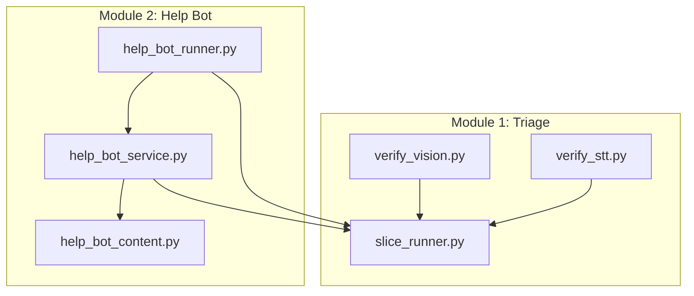
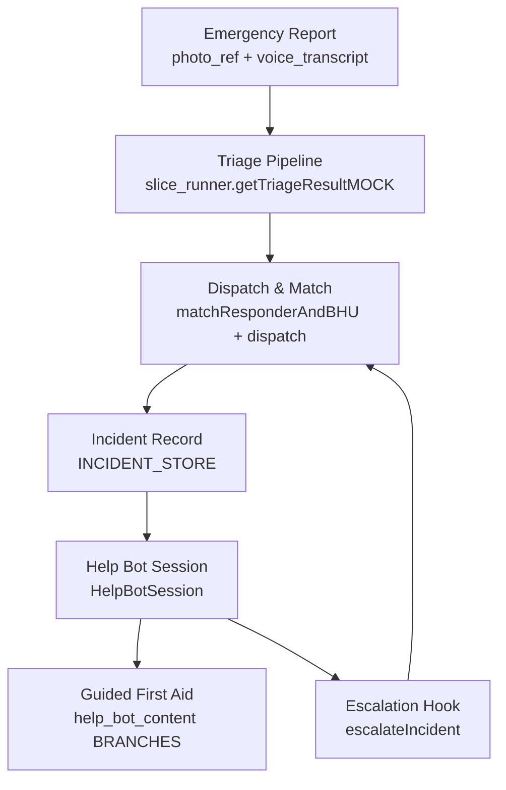
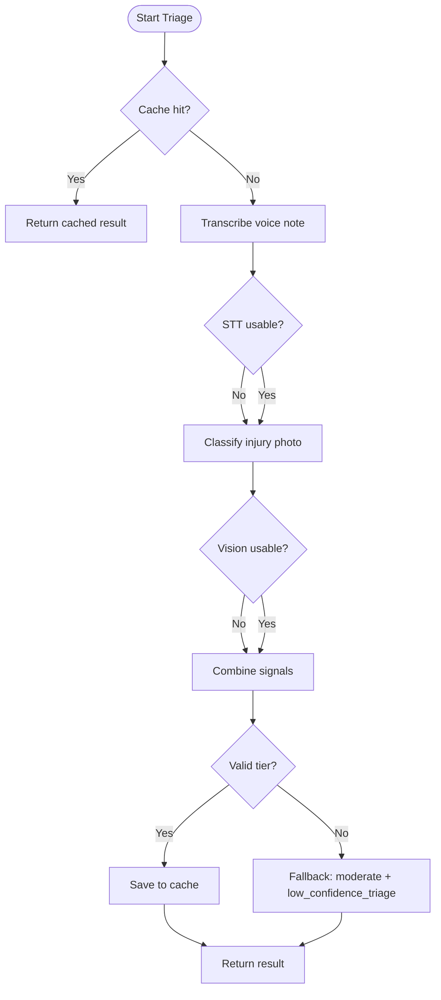
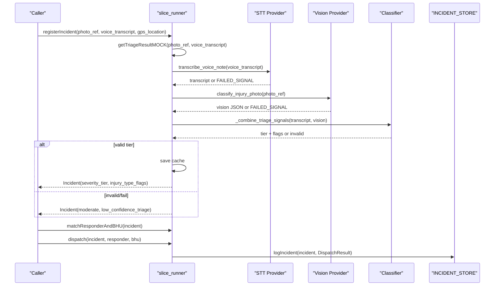
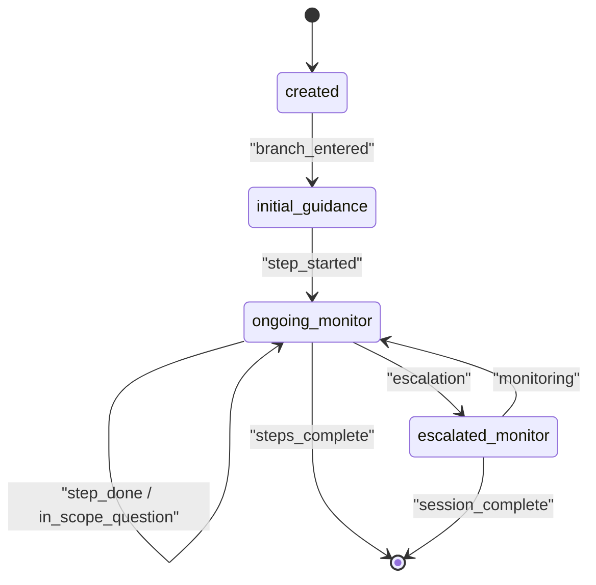
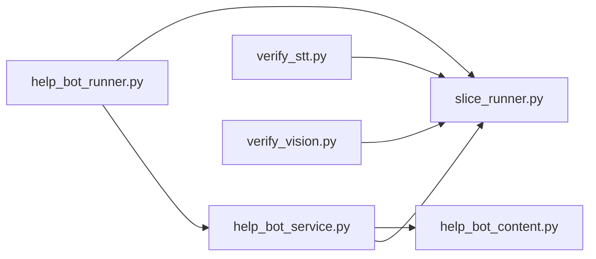
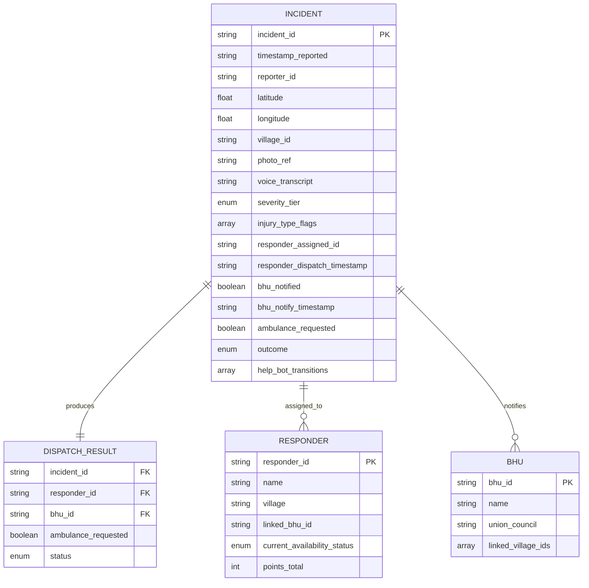

# Core System Architecture

<cite>
**Referenced Files in This Document**
- [slice_runner.py](file://backend/slice_runner.py)
- [help_bot_service.py](file://backend/services/help_bot_service.py)
- [help_bot_content.py](file://backend/services/help_bot_content.py)
- [help_bot_runner.py](file://backend/help_bot_runner.py)
- [verify_stt.py](file://backend/verify_stt.py)
- [verify_vision.py](file://backend/verify_vision.py)
</cite>

## Table of Contents
1. [Introduction](#introduction)
2. [Project Structure](#project-structure)
3. [Core Components](#core-components)
4. [Architecture Overview](#architecture-overview)
5. [Detailed Component Analysis](#detailed-component-analysis)
6. [Dependency Analysis](#dependency-analysis)
7. [Performance Considerations](#performance-considerations)
8. [Troubleshooting Guide](#troubleshooting-guide)
9. [Conclusion](#conclusion)
10. [Appendices](#appendices)

## Introduction
This document describes the architectural design of the LifeLine Ride core system with a focus on its modular, service-oriented structure. It explains how emergency reports flow through multi-modal input processing (audio and image), how triage decisions are made using an AI provider abstraction layer, and how the responder help bot guides first responders via a state machine over scripted medical content. The architecture emphasizes:
- Provider abstraction for AI services (Gemini and DashScope) with failover and retry behavior
- A pipeline pattern for triage processing (STT, vision classification, classifier combination)
- A state machine pattern for conversation flow in the help bot
- Clear boundaries between orchestration, conversation management, and content to enable scalability and maintainability

## Project Structure
The backend implements two cooperating modules:
- Module 1 (triage): slice_runner orchestrates incident registration, triage, dispatch, and logging
- Module 2 (help bot): help_bot_service manages conversation sessions; help_bot_content provides hardcoded Urdu guidance; help_bot_runner is the console entrypoint

**Diagram sources**
- [slice_runner.py:132-154](file://backend/slice_runner.py#L132-L154)
- [help_bot_service.py:42-47](file://backend/services/help_bot_service.py#L42-L47)
- [help_bot_runner.py:39-44](file://backend/help_bot_runner.py#L39-L44)

**Section sources**
- [slice_runner.py:155-213](file://backend/slice_runner.py#L155-L213)
- [help_bot_service.py:1-21](file://backend/services/help_bot_service.py#L1-L21)
- [help_bot_content.py:1-19](file://backend/services/help_bot_content.py#L1-L19)
- [help_bot_runner.py:1-19](file://backend/help_bot_runner.py#L1-L19)

## Core Components
- slice_runner.py: Central orchestrator that defines data contracts, seed data, the triage pipeline, dispatch logic, and provider selection utilities. It exposes functions used by both Module 1 tests and Module 2 integration points.
- help_bot_service.py: Conversation engine implementing a state machine for guided first aid. It handles STT, intent detection, TTS, audio I/O, barge-in, escalation hooks, and session lifecycle.
- help_bot_content.py: Hardcoded Urdu guidance content organized into branches per injury type, including initial guidance, steps, Q&A entries, escalation signals, and shared lines.
- help_bot_runner.py: Console entrypoint that builds incidents (simulated or from the triage pipeline), runs replay or live mic mode, prewarms TTS cache, and verifies spoken Urdu round-trips.
- verify_stt.py / verify_vision.py: Verification scripts that exercise the active AI provider’s STT and vision capabilities against mock media.

Key responsibilities:
- Orchestration and data contracts: slice_runner
- Conversation state and flow: help_bot_service
- Medical guidance content: help_bot_content
- Entrypoints and test harnesses: help_bot_runner, verify_stt.py, verify_vision.py

**Section sources**
- [slice_runner.py:155-213](file://backend/slice_runner.py#L155-L213)
- [help_bot_service.py:663-685](file://backend/services/help_bot_service.py#L663-L685)
- [help_bot_content.py:21-43](file://backend/services/help_bot_content.py#L21-L43)
- [help_bot_runner.py:64-99](file://backend/help_bot_runner.py#L64-L99)
- [verify_stt.py:22-52](file://backend/verify_stt.py#L22-L52)
- [verify_vision.py:22-49](file://backend/verify_vision.py#L22-L49)

## Architecture Overview
The system follows a modular, service-oriented architecture with clear boundaries:
- Provider abstraction layer: Each AI capability (STT, vision, classifier, intent detection, TTS) has gemini_* and dashscope_* implementations selected at runtime via TRIAGE_AI_PROVIDER. Failover and retries are built-in.
- Pipeline pattern for triage: STT -> Vision -> Classifier combination, with caching and safe defaults when inputs are missing or models fail.
- State machine pattern for conversation: HelpBotSession transitions between states (initial_guidance, ongoing_monitor, escalated_monitor) driven by intents and escalation signals.
- Orchestrator role: slice_runner coordinates incident registration, triage, matching, dispatch, and logging; help_bot_runner wires Module 1 outputs into Module 2 sessions.

**Diagram sources**
- [slice_runner.py:521-586](file://backend/slice_runner.py#L521-L586)
- [slice_runner.py:589-672](file://backend/slice_runner.py#L589-L672)
- [help_bot_service.py:576-647](file://backend/services/help_bot_service.py#L576-L647)
- [help_bot_content.py:46-254](file://backend/services/help_bot_content.py#L46-L254)

## Detailed Component Analysis

### Provider Abstraction Layer (AI Services)
The provider abstraction isolates AI calls behind consistent interfaces, enabling swap between Gemini and DashScope without changing downstream logic.

- Selection mechanism: _ai_provider() reads TRIAGE_AI_PROVIDER; default is gemini.
- STT: gemini_transcribe_voice vs dashscope_transcribe_voice; transcribe_voice_note selects implementation.
- Vision: gemini_classify_injury vs dashscope_classify_injury; classify_injury_photo selects implementation.
- Classifier: gemini_combine_signals vs dashscope_combine_signals; _combine_triage_signals selects implementation.
- Intent detection: gemini_detect_intent vs dashscope_detect_intent; detectResponderIntent selects implementation.
- TTS: gemini_synthesize_speech vs dashscope_synthesize_speech; speakGuidance selects implementation.

Failover and resilience:
- Quota/rate-limit retries with backoff via _call_with_retry.
- Timeouts via _triage_timeout_s applied to client calls.
- Safe defaults: if any step fails or returns unusable output, the pipeline falls back to moderate severity with low_confidence_triage flag.

Caching:
- Triage results cached by photo_ref and voice transcript hash to avoid repeated API calls.
- TTS audio cached by voice+text hash to reduce quota usage and ensure deterministic playback.

**Diagram sources**
- [slice_runner.py:521-586](file://backend/slice_runner.py#L521-L586)
- [slice_runner.py:97-129](file://backend/slice_runner.py#L97-L129)

**Section sources**
- [slice_runner.py:132-154](file://backend/slice_runner.py#L132-L154)
- [slice_runner.py:367-426](file://backend/slice_runner.py#L367-L426)
- [slice_runner.py:428-474](file://backend/slice_runner.py#L428-L474)
- [slice_runner.py:477-517](file://backend/slice_runner.py#L477-L517)
- [help_bot_service.py:127-168](file://backend/services/help_bot_service.py#L127-L168)
- [help_bot_service.py:244-289](file://backend/services/help_bot_service.py#L244-L289)
- [help_bot_service.py:307-387](file://backend/services/help_bot_service.py#L307-L387)

### Triage Pipeline (Pipeline Pattern)
The triage pipeline processes multi-modal inputs to produce severity tiers and injury flags:
- STT step: Converts voice notes to Urdu transcripts using the active provider.
- Vision step: Classifies visible injuries from photos using the active provider.
- Classifier step: Combines transcript and vision signals to determine severity tier and injury flags, following safety rules that prioritize more severe signals.

Data flows:
- Inputs: photo_ref (local path or URL), voice_note_transcript (path to audio).
- Outputs: severity_tier, injury_type_flags, voice_transcript, triage_signals.
- Fail-safe: If any step fails or inputs are missing/unusable, defaults to moderate severity with low_confidence_triage flag.

Integration points:
- registerIncident invokes getTriageResultMOCK to populate Incident fields.
- matchResponderAndBHU uses GPS location to find linked BHU and available responders.
- dispatch sets ambulance_requested for critical cases and updates responder availability.

**Diagram sources**
- [slice_runner.py:521-586](file://backend/slice_runner.py#L521-L586)
- [slice_runner.py:589-672](file://backend/slice_runner.py#L589-L672)

**Section sources**
- [slice_runner.py:314-346](file://backend/slice_runner.py#L314-L346)
- [slice_runner.py:349-365](file://backend/slice_runner.py#L349-L365)
- [slice_runner.py:521-586](file://backend/slice_runner.py#L521-L586)
- [slice_runner.py:589-672](file://backend/slice_runner.py#L589-L672)

### Conversation Management (State Machine Pattern)
HelpBotSession implements a state machine guiding responders through scripted first aid steps:
- States: initial_guidance -> ongoing_monitor -> escalated_monitor
- Transitions driven by intents (step_done, in_scope_question, out_of_scope, escalation, unclear) and escalation signals
- Every spoken line comes from help_bot_content; AI is only used for ears (STT) and routing (intent detection)

Key behaviors:
- Branch routing based on injury_type_flags to select appropriate guidance branch
- Pre-rendered failsafe audio ensures continuous vocal support even during AI failures
- Escalation hook upgrades severity tier, merges new flags, notifies BHU, requests ambulance if critical, and logs transitions

**Diagram sources**
- [help_bot_service.py:663-685](file://backend/services/help_bot_service.py#L663-L685)
- [help_bot_service.py:760-783](file://backend/services/help_bot_service.py#L760-L783)
- [help_bot_service.py:576-647](file://backend/services/help_bot_service.py#L576-L647)

**Section sources**
- [help_bot_service.py:94-117](file://backend/services/help_bot_service.py#L94-L117)
- [help_bot_service.py:170-289](file://backend/services/help_bot_service.py#L170-L289)
- [help_bot_service.py:663-783](file://backend/services/help_bot_service.py#L663-L783)
- [help_bot_content.py:46-254](file://backend/services/help_bot_content.py#L46-L254)

### Orchestrator Role (Central Coordination)
slice_runner serves as the central orchestrator:
- Defines stable data contracts (Incident, Responder, BHU, DispatchResult)
- Implements triage pipeline with provider abstraction
- Matches responders and BHUs based on location and availability
- Dispatches incidents with appropriate actions (ambulance request, BHU notification)
- Logs incidents to INCIDENT_STORE for inspection and auditing

Integration points:
- help_bot_runner uses slice_runner to build incidents (simulated or from pipeline)
- help_bot_service integrates via escalateIncident to upgrade severity and update records

**Section sources**
- [slice_runner.py:155-213](file://backend/slice_runner.py#L155-L213)
- [slice_runner.py:589-672](file://backend/slice_runner.py#L589-L672)
- [help_bot_runner.py:64-99](file://backend/help_bot_runner.py#L64-L99)
- [help_bot_service.py:576-647](file://backend/services/help_bot_service.py#L576-L647)

## Dependency Analysis
Component relationships and coupling:
- help_bot_runner depends on slice_runner for incident creation and dispatch, and on help_bot_service for conversation management
- help_bot_service depends on slice_runner for provider utilities and data contracts, and on help_bot_content for guidance content
- verify_stt.py and verify_vision.py depend on slice_runner to exercise AI providers independently

External dependencies:
- Google GenAI SDK for Gemini STT, vision, classifier, and TTS
- DashScope SDK for alternative provider implementations (STT, vision, classifier)
- Audio stack (sounddevice, numpy, soundfile) for live mic mode and playback

Potential circular dependencies:
- None detected; imports are structured to avoid cycles (help_bot_service imports slice_runner, not vice versa)

**Diagram sources**
- [help_bot_runner.py:39-44](file://backend/help_bot_runner.py#L39-L44)
- [help_bot_service.py:42-47](file://backend/services/help_bot_service.py#L42-L47)

**Section sources**
- [help_bot_runner.py:39-44](file://backend/help_bot_runner.py#L39-L44)
- [help_bot_service.py:42-47](file://backend/services/help_bot_service.py#L42-L47)
- [verify_stt.py:15-16](file://backend/verify_stt.py#L15-L16)
- [verify_vision.py:15-16](file://backend/verify_vision.py#L15-L16)

## Performance Considerations
- Caching reduces API costs and latency:
  - Triage results cached by media hash to avoid redundant AI calls
  - TTS audio cached by voice+text hash to prevent repeated rendering
- Retry and timeout mechanisms improve resilience:
  - Quota/rate-limit retries with exponential backoff
  - Configurable timeouts per AI call to prevent blocking
- Deterministic verification paths:
  - Replay mode uses scripted turns for reproducible testing
  - Prewarming TTS cache ensures zero-quota runs for verification
- Audio processing optimizations:
  - VAD-based utterance capture minimizes unnecessary STT calls
  - Barge-in detection improves responsiveness during playback

[No sources needed since this section provides general guidance]

## Troubleshooting Guide
Common issues and resolution strategies:
- Missing environment variables: Ensure DASHSCOPE_API_KEY and GEMINI_API_KEY are set in .env
- Provider import errors: DashScope SDK may be unavailable; fallback to Gemini or install required packages
- STT failures: Check audio file format and language hints; verify transcription_url accessibility for DashScope
- Vision failures: Validate image format and accessibility; check model-specific requirements
- TTS failures: Verify voice availability and quota limits; use cached audio when possible
- Escalation issues: Confirm incident_id exists in active sessions or INCIDENT_STORE before calling escalateIncident

Verification tools:
- verify_stt.py: Tests STT accuracy across all voice clips with ground truth comparison
- verify_vision.py: Tests injury classification across all photos with latency reporting

**Section sources**
- [slice_runner.py:36-52](file://backend/slice_runner.py#L36-L52)
- [slice_runner.py:142-154](file://backend/slice_runner.py#L142-L154)
- [slice_runner.py:383-411](file://backend/slice_runner.py#L383-L411)
- [slice_runner.py:449-464](file://backend/slice_runner.py#L449-L464)
- [help_bot_service.py:327-337](file://backend/services/help_bot_service.py#L327-L337)
- [help_bot_service.py:595-604](file://backend/services/help_bot_service.py#L595-L604)
- [verify_stt.py:22-52](file://backend/verify_stt.py#L22-L52)
- [verify_vision.py:22-49](file://backend/verify_vision.py#L22-L49)

## Conclusion
The LifeLine Ride core system demonstrates a well-architected, modular approach to emergency response automation. Key strengths include:
- Robust provider abstraction enabling seamless switching between AI services
- Pipeline pattern ensuring reliable multi-modal processing with safe defaults
- State machine pattern providing structured, auditable conversation flows
- Clear separation of concerns between orchestration, conversation management, and content
- Comprehensive caching and retry mechanisms for performance and reliability

This architecture supports scalability through modular components and maintainability through clear interfaces and documented data contracts. The system is designed to evolve with additional modules while preserving existing functionality through well-defined integration points.

[No sources needed since this section summarizes without analyzing specific files]

## Appendices

### Data Models
Core data structures define the system's information flow:

**Diagram sources**
- [slice_runner.py:164-213](file://backend/slice_runner.py#L164-L213)

### Integration Points
Key integration points for future module expansion:
- escalateIncident: Clean interface for Module 3/8 escalation workflows
- register_incident: Active incident tracking for help bot sessions
- INCIDENT_STORE: Centralized audit trail for all incidents and their lifecycle

**Section sources**
- [help_bot_service.py:576-647](file://backend/services/help_bot_service.py#L576-L647)
- [help_bot_service.py:90-92](file://backend/services/help_bot_service.py#L90-L92)
- [slice_runner.py:665-672](file://backend/slice_runner.py#L665-L672)