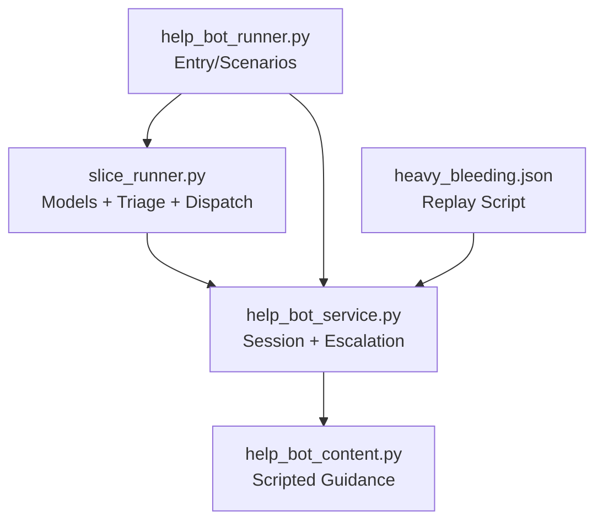
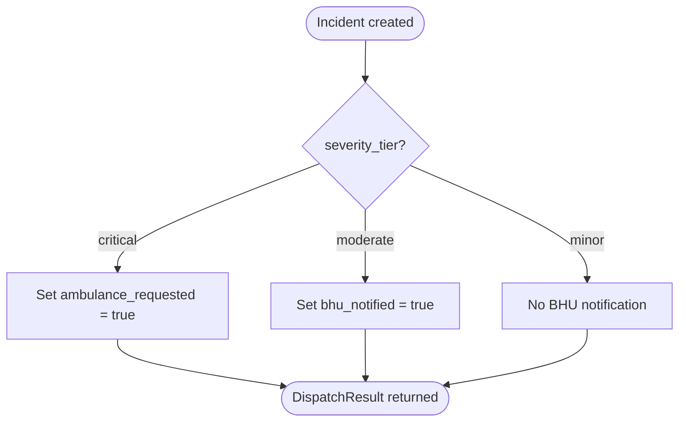
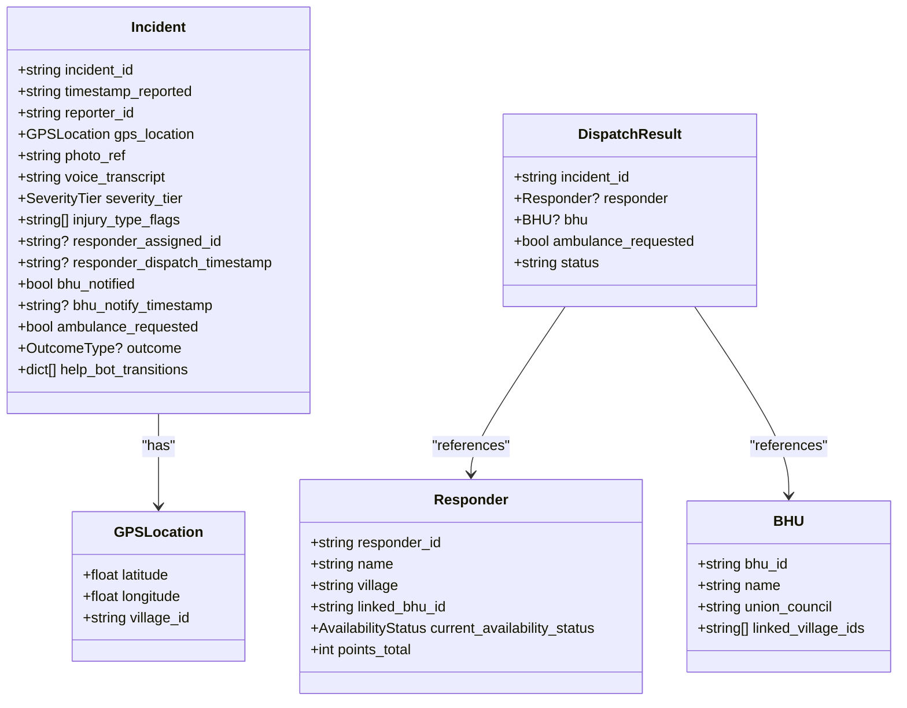
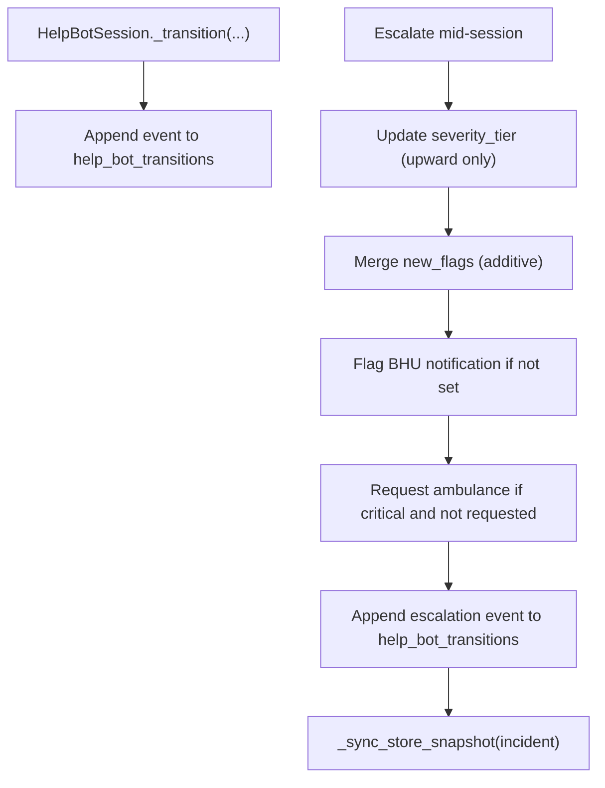
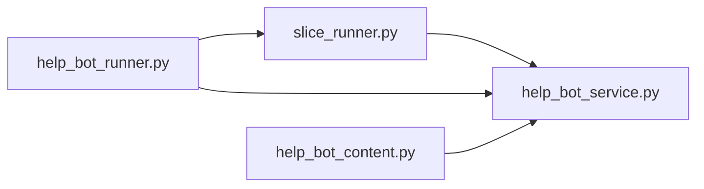

# Data Models and Contracts

<cite>
**Referenced Files in This Document**
- [slice_runner.py](file://backend/slice_runner.py)
- [help_bot_service.py](file://backend/services/help_bot_service.py)
- [help_bot_content.py](file://backend/services/help_bot_content.py)
- [help_bot_runner.py](file://backend/help_bot_runner.py)
- [heavy_bleeding.json](file://mockdata/helpbot/scripts/heavy_bleeding.json)
</cite>

## Table of Contents
1. [Introduction](#introduction)
2. [Project Structure](#project-structure)
3. [Core Components](#core-components)
4. [Architecture Overview](#architecture-overview)
5. [Detailed Component Analysis](#detailed-component-analysis)
6. [Dependency Analysis](#dependency-analysis)
7. [Performance Considerations](#performance-considerations)
8. [Troubleshooting Guide](#troubleshooting-guide)
9. [Conclusion](#conclusion)

## Introduction
This document specifies the core data models and contracts used by LifeLine Ride for emergency triage, dispatch, and responder help-bot interactions. It focuses on Pydantic models (Incident, Responder, BHU, GPSLocation, DispatchResult), severity tiers, outcome types, availability status enums, and the incident lifecycle from creation through dispatch to outcome tracking. It also explains how the help bot appends transitions to an additive log for accountability and how incidents are persisted and retrieved across components.

## Project Structure
The data models and their usage live primarily in the backend module that implements Module 1 (triage and dispatch) and Module 2 (responder help bot). The key files are:
- Backend slice runner: defines models, seed data, triage pipeline, matching/dispatch, and logging
- Help bot service: orchestrates conversation state, escalation hooks, and updates to the incident record
- Help bot content: contains scripted guidance content used by the bot
- Help bot runner: entrypoint that builds incidents and runs sessions
- Mock scripts: replay scenarios used to exercise the bot’s flow



**Diagram sources**
- [slice_runner.py:159-212](file://backend/slice_runner.py#L159-L212)
- [help_bot_service.py:663-710](file://backend/services/help_bot_service.py#L663-L710)
- [help_bot_content.py:21-43](file://backend/services/help_bot_content.py#L21-L43)
- [help_bot_runner.py:64-99](file://backend/help_bot_runner.py#L64-L99)
- [heavy_bleeding.json:1-10](file://mockdata/helpbot/scripts/heavy_bleeding.json#L1-L10)

**Section sources**
- [slice_runner.py:159-212](file://backend/slice_runner.py#L159-L212)
- [help_bot_service.py:663-710](file://backend/services/help_bot_service.py#L663-L710)
- [help_bot_content.py:21-43](file://backend/services/help_bot_content.py#L21-L43)
- [help_bot_runner.py:64-99](file://backend/help_bot_runner.py#L64-L99)
- [heavy_bleeding.json:1-10](file://mockdata/helpbot/scripts/heavy_bleeding.json#L1-L10)

## Core Components
This section documents the Pydantic models, enums, and relationships that form the system’s data contract.

### Enums and Types
- SeverityTier: minor, moderate, critical
- OutcomeType: self-resolved, taken_to_bhu, referred_to_hospital, unresolved
- AvailabilityStatus: available, busy, offline

These enums constrain field values and ensure consistent behavior across modules.

**Section sources**
- [slice_runner.py:159-161](file://backend/slice_runner.py#L159-L161)

### GPSLocation
Represents the reporter’s location with latitude, longitude, and a village identifier used for matching responders and BHUs.

- Fields:
  - latitude: float
  - longitude: float
  - village_id: str

Validation rules:
- All fields required; type-checked by Pydantic.

Usage:
- Incident.gps_location
- Matching logic uses village_id to find responders and linked BHUs.

**Section sources**
- [slice_runner.py:164-168](file://backend/slice_runner.py#L164-L168)
- [slice_runner.py:612-623](file://backend/slice_runner.py#L612-L623)

### Incident
Central entity representing a reported emergency.

- Fields:
  - incident_id: str
  - timestamp_reported: str (ISO timestamp)
  - reporter_id: str
  - gps_location: GPSLocation
  - photo_ref: str
  - voice_transcript: str
  - severity_tier: SeverityTier
  - injury_type_flags: List[str]
  - responder_assigned_id: Optional[str]
  - responder_dispatch_timestamp: Optional[str]
  - bhu_notified: bool
  - bhu_notify_timestamp: Optional[str]
  - ambulance_requested: bool
  - outcome: Optional[OutcomeType]
  - help_bot_transitions: List[dict]

Validation rules:
- severity_tier must be one of minor/moderate/critical
- outcome must be one of allowed types when present
- help_bot_transitions is an append-only list maintained by the help bot

Relationships:
- References GPSLocation
- Optionally references Responder via responder_assigned_id
- Optionally references BHU indirectly via dispatch outcomes and notifications

Lifecycle notes:
- Created during registration/triage
- Updated during dispatch (assignment timestamps, BHU notification flags, ambulance request flag)
- Updated during help-bot session (transitions appended, tier upgrades, new flags)
- Finalized later with outcome (tracked in future modules)

**Section sources**
- [slice_runner.py:170-188](file://backend/slice_runner.py#L170-L188)
- [slice_runner.py:589-609](file://backend/slice_runner.py#L589-L609)
- [help_bot_service.py:696-710](file://backend/services/help_bot_service.py#L696-L710)
- [help_bot_service.py:576-647](file://backend/services/help_bot_service.py#L576-L647)

### Responder
A first responder associated with a village and BHU.

- Fields:
  - responder_id: str
  - name: str
  - village: str
  - linked_bhu_id: str
  - current_availability_status: AvailabilityStatus
  - points_total: int

Validation rules:
- current_availability_status must be available/busy/offline

Usage:
- Matched by village_id and availability during dispatch
- Mutated to busy upon assignment to prevent double-assignment

**Section sources**
- [slice_runner.py:191-198](file://backend/slice_runner.py#L191-L198)
- [slice_runner.py:617-623](file://backend/slice_runner.py#L617-L623)
- [slice_runner.py:631-635](file://backend/slice_runner.py#L631-L635)

### BHU
Basic Health Unit linked to villages for escalation.

- Fields:
  - bhu_id: str
  - name: str
  - union_council: str
  - linked_village_ids: List[str]

Usage:
- Selected based on incident’s village_id
- Notified for moderate/critical tiers

**Section sources**
- [slice_runner.py:200-205](file://backend/slice_runner.py#L200-L205)
- [slice_runner.py:612-623](file://backend/slice_runner.py#L612-L623)
- [slice_runner.py:637-639](file://backend/slice_runner.py#L637-L639)

### DispatchResult
Immutable result of a dispatch attempt.

- Fields:
  - incident_id: str
  - responder: Optional[Responder]
  - bhu: Optional[BHU]
  - ambulance_requested: bool
  - status: Literal["dispatched", "escalated_bhu_only", "no_responders_available"]

Validation rules:
- status constrained to three allowed values

Usage:
- Returned by dispatch() to indicate what happened
- Logged alongside the incident for auditability

**Section sources**
- [slice_runner.py:207-212](file://backend/slice_runner.py#L207-L212)
- [slice_runner.py:626-662](file://backend/slice_runner.py#L626-L662)

## Architecture Overview
The data models participate in a clear pipeline:
- Registration & Triage creates an Incident with severity and flags
- Matching selects a Responder and/or BHU based on location and availability
- Dispatch mutates the Incident and returns a DispatchResult
- Help Bot augments the Incident with transitions and can escalate severity
- Logging persists snapshots for inspection

```mermaid
sequenceDiagram
participant Client as "Client"
participant Slice as "slice_runner.py"
participant Bot as "help_bot_service.py"
participant Store as "INCIDENT_STORE"
Client->>Slice : registerIncident(photo, voice, location)
Slice->>Slice : getTriageResultMOCK(...)
Slice-->>Client : Incident(severity, flags)
Client->>Slice : matchResponderAndBHU(incident)
Slice-->>Client : (responder?, bhu?)
Client->>Slice : dispatch(incident, responder?, bhu?)
Slice->>Slice : mutate incident (assign, notify, ambulance)
Slice-->>Client : DispatchResult(status, flags)
Client->>Bot : HelpBotSession(incident)
Bot->>Bot : _transition(...), append help_bot_transitions
Bot->>Store : _sync_store_snapshot(incident)
Note over Client,Store : Incident evolves; logs remain inspectable
```

**Diagram sources**
- [slice_runner.py:589-662](file://backend/slice_runner.py#L589-L662)
- [help_bot_service.py:696-710](file://backend/services/help_bot_service.py#L696-L710)
- [help_bot_service.py:650-657](file://backend/services/help_bot_service.py#L650-L657)

## Detailed Component Analysis

### Severity Tier System
- Values: minor, moderate, critical
- Behavior:
  - Critical triggers immediate ambulance request
  - Moderate and critical trigger BHU notification
  - Help bot can upgrade tier only upward (never downgrade)



**Diagram sources**
- [slice_runner.py:626-662](file://backend/slice_runner.py#L626-L662)
- [help_bot_service.py:610-627](file://backend/services/help_bot_service.py#L610-L627)

**Section sources**
- [slice_runner.py:159-161](file://backend/slice_runner.py#L159-L161)
- [slice_runner.py:626-662](file://backend/slice_runner.py#L626-L662)
- [help_bot_service.py:610-627](file://backend/services/help_bot_service.py#L610-L627)

### Outcome Types
- Allowed values: self-resolved, taken_to_bhu, referred_to_hospital, unresolved
- Purpose: capture final resolution of an incident after care or follow-up
- Current state: optional field on Incident; finalized in later modules

**Section sources**
- [slice_runner.py:160-161](file://backend/slice_runner.py#L160-L161)
- [slice_runner.py:170-188](file://backend/slice_runner.py#L170-L188)

### Availability Status Enum
- Values: available, busy, offline
- Rules:
  - Only available responders are matched during dispatch
  - On assignment, responder status is set to busy to prevent double-assignment

**Section sources**
- [slice_runner.py:161-161](file://backend/slice_runner.py#L161-L161)
- [slice_runner.py:617-623](file://backend/slice_runner.py#L617-L623)
- [slice_runner.py:631-635](file://backend/slice_runner.py#L631-L635)

### Incident Lifecycle
1. Creation: registerIncident calls triage to determine severity and flags, then constructs an Incident
2. Matching: matchResponderAndBHU finds an available responder and linked BHU by village
3. Dispatch: dispatch sets assignment timestamps, BHU notification, and ambulance request; returns DispatchResult
4. Help Bot Session: HelpBotSession records transitions and can escalate severity and flags
5. Persistence: logIncident writes a snapshot to INCIDENT_STORE; help bot syncs live changes back into the store



**Diagram sources**
- [slice_runner.py:164-212](file://backend/slice_runner.py#L164-L212)

**Section sources**
- [slice_runner.py:589-662](file://backend/slice_runner.py#L589-L662)
- [help_bot_service.py:696-710](file://backend/services/help_bot_service.py#L696-L710)

### Additive help_bot_transitions for Accountability
- The Incident.help_bot_transitions list is append-only and never overwritten
- Each transition includes:
  - timestamp
  - branch context
  - from_state/to_state
  - trigger_type (e.g., step_started, steps_complete, escalation_hook)
  - detail (human-readable summary)
- Escalation events include:
  - trigger
  - old_tier/new_tier
  - transcript_excerpt
  - new_flags merged additively
- Syncing ensures INCIDENT_STORE reflects live session state



**Diagram sources**
- [help_bot_service.py:696-710](file://backend/services/help_bot_service.py#L696-L710)
- [help_bot_service.py:576-647](file://backend/services/help_bot_service.py#L576-L647)
- [help_bot_service.py:650-657](file://backend/services/help_bot_service.py#L650-L657)

**Section sources**
- [help_bot_service.py:696-710](file://backend/services/help_bot_service.py#L696-L710)
- [help_bot_service.py:576-647](file://backend/services/help_bot_service.py#L576-L647)
- [help_bot_service.py:650-657](file://backend/services/help_bot_service.py#L650-L657)

### Examples of Model Usage

#### Triage Pipeline (Module 1)
- Inputs: photo_ref, voice_transcript, GPSLocation
- Output: Incident with severity_tier and injury_type_flags
- Fail-safe: defaults to moderate with low_confidence_triage if AI calls fail

**Section sources**
- [slice_runner.py:521-586](file://backend/slice_runner.py#L521-L586)
- [slice_runner.py:589-609](file://backend/slice_runner.py#L589-L609)

#### Help Bot Interactions (Module 2)
- Branch routing maps injury_type_flags to scripted guidance
- Transitions recorded per step and completion
- Replay scripts drive deterministic turns and expectations

**Section sources**
- [help_bot_content.py:46-253](file://backend/services/help_bot_content.py#L46-L253)
- [help_bot_runner.py:175-235](file://backend/help_bot_runner.py#L175-L235)
- [heavy_bleeding.json:1-10](file://mockdata/helpbot/scripts/heavy_bleeding.json#L1-L10)

## Dependency Analysis
- slice_runner.py defines all core models and provides triage/dispatch functions
- help_bot_service.py depends on slice_runner for models and INCIDENT_STORE
- help_bot_runner.py composes both modules to run end-to-end scenarios
- help_bot_content.py supplies static content consumed by the bot



**Diagram sources**
- [slice_runner.py:159-212](file://backend/slice_runner.py#L159-L212)
- [help_bot_service.py:42-47](file://backend/services/help_bot_service.py#L42-L47)
- [help_bot_runner.py:39-44](file://backend/help_bot_runner.py#L39-L44)

**Section sources**
- [slice_runner.py:159-212](file://backend/slice_runner.py#L159-L212)
- [help_bot_service.py:42-47](file://backend/services/help_bot_service.py#L42-L47)
- [help_bot_runner.py:39-44](file://backend/help_bot_runner.py#L39-L44)

## Performance Considerations
- Triage pipeline caches results for identical media inputs to reduce API quota usage
- Help bot prewarms TTS cache for scripted lines to avoid repeated synthesis
- Intent classification and STT use retry/backoff for rate limits
- Avoid heavy object mutation outside defined paths; prefer appending to lists like help_bot_transitions

[No sources needed since this section provides general guidance]

## Troubleshooting Guide
Common issues and where to look:
- Missing or unusable media leads to fail-safe triage (moderate + low_confidence_triage)
- No available responders escalates to BHU-only or no_responders_available
- Help bot audio failures fall back to cached failsafe line
- Intent detection failures default to unclear intent and safe responses

Check these areas:
- Triage signals and fallback behavior
- Responder availability and matching
- Help bot transitions and escalation events
- INCIDENT_STORE snapshots for post-run inspection

**Section sources**
- [slice_runner.py:521-586](file://backend/slice_runner.py#L521-L586)
- [slice_runner.py:626-662](file://backend/slice_runner.py#L626-L662)
- [help_bot_service.py:689-757](file://backend/services/help_bot_service.py#L689-L757)

## Conclusion
LifeLine Ride’s data models provide a robust, validated contract for emergency reporting, dispatch, and responder assistance. The severity tier system drives appropriate escalation, while the additive help_bot_transitions log ensures full accountability. Incidents are created via triage, dispatched with clear outcomes, and augmented by the help bot without losing historical context. The design supports future persistence layers and additional modules while keeping the core contracts stable and inspectable.