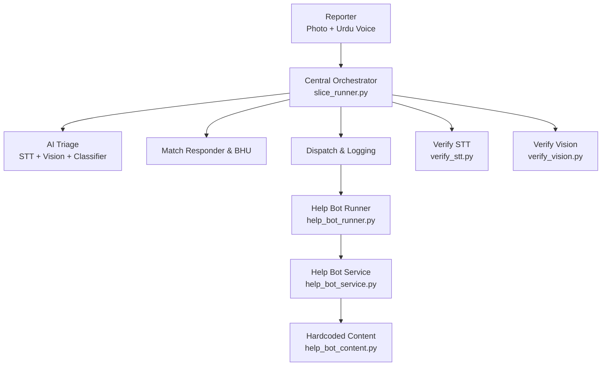
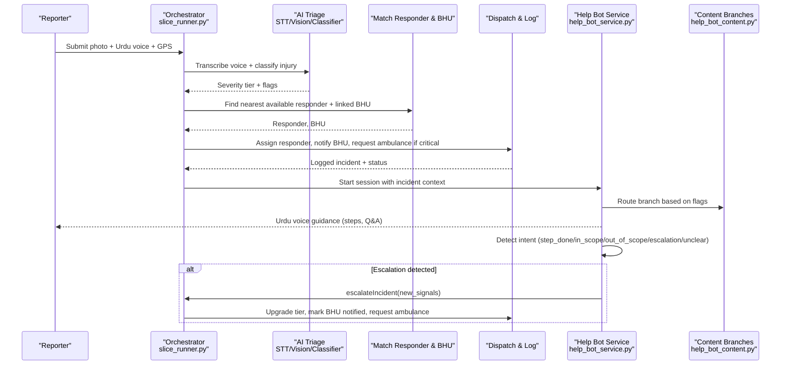
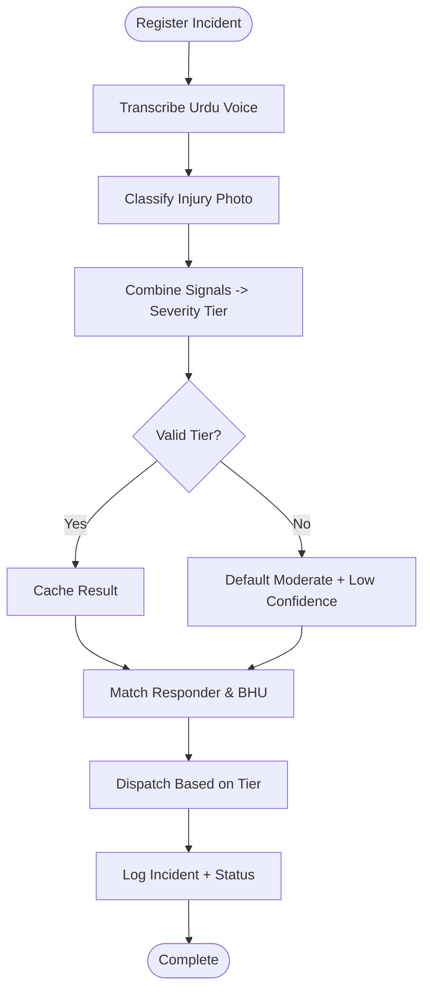
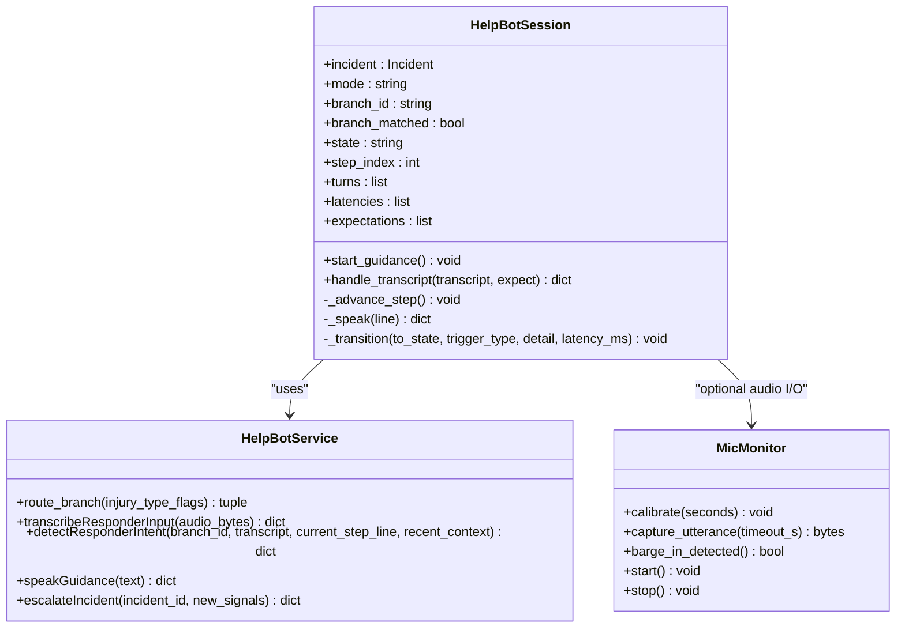
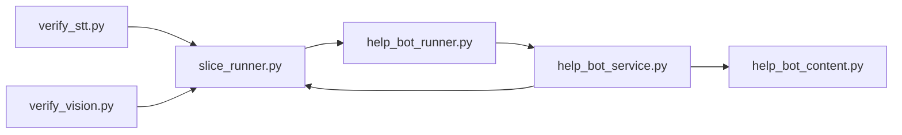

# System Overview

<cite>
**Referenced Files in This Document**
- [slice_runner.py](file://backend/slice_runner.py)
- [help_bot_runner.py](file://backend/help_bot_runner.py)
- [help_bot_service.py](file://backend/services/help_bot_service.py)
- [help_bot_content.py](file://backend/services/help_bot_content.py)
- [verify_stt.py](file://backend/verify_stt.py)
- [verify_vision.py](file://backend/verify_vision.py)
- [PROJECT.md](file://PROJECT.md)
- [village-emergency-response-system-spec.md](file://village-emergency-response-system-spec.md)
</cite>

## Table of Contents
1. Introduction
2. Project Structure
3. Core Components
4. Architecture Overview
5. Detailed Component Analysis
6. Dependency Analysis
7. Performance Considerations
8. Troubleshooting Guide
9. Conclusion

## Introduction
LifeLine Ride is an AI-powered community first-responder system designed for rural Pakistan to reduce emergency reporting and response time. It enables emergency reporters (family members or bystanders) to submit a photo and an Urdu voice note, which are triaged by AI into severity tiers. The system then coordinates trained village responders and Basic Health Units (BHUs), guiding responders hands-free with Urdu voice instructions and escalating when conditions worsen. The target audiences are:
- Emergency reporters (rural families/bystanders)
- Trained village first responders
- System administrators and BHU staff

The system’s purpose is to deliver rapid, reliable triage and coordination under real-world constraints: limited connectivity, low literacy, and urgent situations where typing is not feasible.

**Section sources**
- [village-emergency-response-system-spec.md:1-20](file://village-emergency-response-system-spec.md#L1-L20)
- [PROJECT.md:1-20](file://PROJECT.md#L1-L20)

## Project Structure
At a high level, the backend implements:
- A central orchestrator that ingests media, runs triage, matches responders/BHUs, dispatches, and logs incidents
- A responder help bot service that guides responders via Urdu voice, classifies intents, and escalates when needed
- Content modules that define hardcoded first-aid guidance branches and shared lines
- Verification utilities to test STT and vision components independently

**Diagram sources**
- [slice_runner.py:519-672](file://backend/slice_runner.py#L519-L672)
- [help_bot_runner.py:175-236](file://backend/help_bot_runner.py#L175-L236)
- [help_bot_service.py:663-800](file://backend/services/help_bot_service.py#L663-L800)
- [help_bot_content.py:21-255](file://backend/services/help_bot_content.py#L21-L255)
- [verify_stt.py:22-52](file://backend/verify_stt.py#L22-L52)
- [verify_vision.py:22-49](file://backend/verify_vision.py#L22-L49)

**Section sources**
- [slice_runner.py:155-277](file://backend/slice_runner.py#L155-L277)
- [help_bot_runner.py:1-19](file://backend/help_bot_runner.py#L1-L19)
- [help_bot_service.py:1-21](file://backend/services/help_bot_service.py#L1-L21)
- [help_bot_content.py:1-19](file://backend/services/help_bot_content.py#L1-L19)

## Core Components
- Central orchestrator (slice_runner.py): Ingests incident media, performs AI triage (STT, vision, classifier), matches nearest available responder and linked BHU, dispatches based on severity tier, and logs the full lifecycle. Includes provider selection (Gemini/DashScope), retry/backoff, timeouts, and fail-safe defaults.
- Help bot runner (help_bot_runner.py): Console entrypoint for Module 2; supports simulated scenarios, replay mode, live mic mode, TTS prewarming, and spoken-Urdu verification. Integrates with Module 1 to build incidents from real media or seed data.
- Help bot service (help_bot_service.py): Conversation engine implementing a state machine with Urdu voice-in/out, intent classification, scripted guidance, barge-in support, and escalation hooks that upgrade severity and trigger BHU/ambulance actions.
- Help bot content (help_bot_content.py): Hardcoded Urdu first-aid guidance for specific injury branches (heavy bleeding, fracture/crush, snakebite), including steps, Q&A entries, escalation signals, and shared fallback lines.
- Verification utilities (verify_stt.py, verify_vision.py): Independent tests to validate STT transcription accuracy and vision-based injury classification through the active provider pipeline.

Key responsibilities:
- Orchestration and data contracts: Incident, Responder, BHU models and dispatch outcomes
- Provider abstraction: Swappable AI providers with consistent interfaces and error handling
- Safety-first design: Fail-safes default to moderate severity when inputs are missing or unclear
- Accountability: Transition logs and incident records capture decisions and escalations

**Section sources**
- [slice_runner.py:159-213](file://backend/slice_runner.py#L159-L213)
- [slice_runner.py:519-672](file://backend/slice_runner.py#L519-L672)
- [help_bot_runner.py:74-99](file://backend/help_bot_runner.py#L74-L99)
- [help_bot_service.py:94-117](file://backend/services/help_bot_service.py#L94-L117)
- [help_bot_content.py:46-255](file://backend/services/help_bot_content.py#L46-L255)
- [verify_stt.py:22-52](file://backend/verify_stt.py#L22-L52)
- [verify_vision.py:22-49](file://backend/verify_vision.py#L22-L49)

## Architecture Overview
The system follows a modular, service-oriented architecture centered around a central orchestrator that coordinates triage, matching, dispatch, and logging. The responder help bot operates as a separate service that consumes incident context and provides hands-free guidance while feeding escalation signals back into the incident record.

**Diagram sources**
- [slice_runner.py:519-672](file://backend/slice_runner.py#L519-L672)
- [help_bot_service.py:576-647](file://backend/services/help_bot_service.py#L576-L647)
- [help_bot_service.py:663-800](file://backend/services/help_bot_service.py#L663-L800)
- [help_bot_content.py:46-255](file://backend/services/help_bot_content.py#L46-L255)

## Detailed Component Analysis

### Central Orchestrator (slice_runner.py)
Responsibilities:
- Environment configuration and provider selection (Gemini vs DashScope)
- Data contracts: Incident, Responder, BHU, DispatchResult
- Seed data for BHUs and responders
- Real triage pipeline: STT, vision classification, combined classifier
- Matching and dispatch logic based on severity tier
- Logging and caching for quota-friendly operation

Key behaviors:
- STT step transcribes Urdu audio using selected provider; returns usable flag
- Vision step classifies visible injuries and assesses image usability
- Classifier combines transcript and vision output into severity tier with safety rules (prefer more severe when conflicting)
- Fail-safe defaults to moderate tier with low-confidence flag when inputs are missing or unclear
- Matching selects nearest available responder in the same village and links to BHU
- Dispatch sets ambulance_requested for critical tier and marks BHU notification timestamps
- Caches triage results to avoid repeated API calls for identical media

**Diagram sources**
- [slice_runner.py:519-672](file://backend/slice_runner.py#L519-L672)

**Section sources**
- [slice_runner.py:27-69](file://backend/slice_runner.py#L27-L69)
- [slice_runner.py:159-213](file://backend/slice_runner.py#L159-L213)
- [slice_runner.py:367-517](file://backend/slice_runner.py#L367-L517)
- [slice_runner.py:519-672](file://backend/slice_runner.py#L519-L672)

### Help Bot Runner (help_bot_runner.py)
Responsibilities:
- CLI entrypoint for Module 2
- Build simulated incidents from seed data or run full Module 1 pipeline on mock media
- Support replay mode (deterministic scripts) and live mic mode (hands-free interaction)
- Prewarm TTS cache to avoid quota limits during replay runs
- Verify spoken-Urdu round-trip (TTS -> STT) per branch

Usage patterns:
- Simulate specific injury scenarios without consuming AI quota
- Integrate with Module 1 to process real media and hand off to help bot
- Pre-render all scripted lines into disk cache for deterministic playback
- Generate verification reports for spoken-Urdu quality checks

**Section sources**
- [help_bot_runner.py:1-19](file://backend/help_bot_runner.py#L1-L19)
- [help_bot_runner.py:74-99](file://backend/help_bot_runner.py#L74-L99)
- [help_bot_runner.py:102-172](file://backend/help_bot_runner.py#L102-L172)
- [help_bot_runner.py:175-236](file://backend/help_bot_runner.py#L175-L236)

### Help Bot Service (help_bot_service.py)
Responsibilities:
- Conversation engine implementing a state machine for guided first aid
- Urdu voice input/output with VAD-based capture and barge-in detection
- Intent classification to route responses (step_done, in_scope_question, out_of_scope, escalation, unclear)
- Scripted guidance delivery via TTS with disk caching
- Escalation hook that upgrades severity, merges new flags, and triggers BHU/ambulance notifications
- Session lifecycle management with transition logging

Key features:
- Branch routing based on incident injury_type_flags
- Provider boundary mirroring Module 1 (gemini_* and dashscope_* implementations)
- Shared fail-safe lines to ensure continuous guidance even when AI calls fail
- Active incident tracking and store synchronization for auditability

**Diagram sources**
- [help_bot_service.py:663-800](file://backend/services/help_bot_service.py#L663-L800)
- [help_bot_service.py:456-569](file://backend/services/help_bot_service.py#L456-L569)
- [help_bot_service.py:94-117](file://backend/services/help_bot_service.py#L94-L117)
- [help_bot_service.py:576-647](file://backend/services/help_bot_service.py#L576-L647)

**Section sources**
- [help_bot_service.py:1-21](file://backend/services/help_bot_service.py#L1-L21)
- [help_bot_service.py:94-117](file://backend/services/help_bot_service.py#L94-L117)
- [help_bot_service.py:127-167](file://backend/services/help_bot_service.py#L127-L167)
- [help_bot_service.py:244-288](file://backend/services/help_bot_service.py#L244-L288)
- [help_bot_service.py:307-387](file://backend/services/help_bot_service.py#L307-L387)
- [help_bot_service.py:456-569](file://backend/services/help_bot_service.py#L456-L569)
- [help_bot_service.py:576-647](file://backend/services/help_bot_service.py#L576-L647)
- [help_bot_service.py:663-800](file://backend/services/help_bot_service.py#L663-L800)

### Help Bot Content (help_bot_content.py)
Responsibilities:
- Define hardcoded Urdu first-aid guidance for specific injury branches
- Provide initial guidance, step-by-step instructions, Q&A entries, escalation signals, and escalated guidance
- Include shared lines for failsafe, out-of-scope fallback, check-in prompts, and session completion

Branches implemented:
- Heavy bleeding: Direct pressure, elevation, cloth management, tourniquet guidance if needed
- Fracture/crush: Immobilization, wound coverage, splinting, pain management
- Snakebite: Keep still, remove constrictions, no harmful remedies, monitor breathing

Safety notes:
- All content is drafted for demonstration purposes and requires professional medical review before deployment
- Every spoken line comes verbatim from this module — the AI never composes medical advice

**Section sources**
- [help_bot_content.py:1-19](file://backend/services/help_bot_content.py#L1-L19)
- [help_bot_content.py:21-43](file://backend/services/help_bot_content.py#L21-L43)
- [help_bot_content.py:46-255](file://backend/services/help_bot_content.py#L46-L255)

### Verification Utilities
- verify_stt.py: Tests Urdu speech-to-text accuracy across audio clips, comparing ground truth sidecars with actual transcriptions
- verify_vision.py: Tests injury classification accuracy across photos, reporting classification, severity, confidence, and usability

These tools enable independent validation of AI components before integration into the full pipeline.

**Section sources**
- [verify_stt.py:1-61](file://backend/verify_stt.py#L1-L61)
- [verify_vision.py:1-58](file://backend/verify_vision.py#L1-L58)

## Dependency Analysis
The system exhibits clear separation of concerns with minimal coupling between modules:

Key dependencies:
- help_bot_runner.py depends on slice_runner.py for incident creation and dispatch
- help_bot_service.py depends on slice_runner.py for provider selection and shared utilities
- help_bot_service.py depends on help_bot_content.py for scripted guidance
- Verification utilities depend on slice_runner.py to exercise the active provider pipeline

Potential risks:
- Circular dependency between help_bot_service.py and slice_runner.py is managed through careful import ordering
- Provider abstraction ensures swapability without affecting downstream logic
- Disk caching reduces external dependencies on AI services during replay/testing

**Diagram sources**
- [help_bot_runner.py:39-44](file://backend/help_bot_runner.py#L39-L44)
- [help_bot_service.py:42-47](file://backend/services/help_bot_service.py#L42-L47)
- [verify_stt.py:15-16](file://backend/verify_stt.py#L15-L16)
- [verify_vision.py:15-16](file://backend/verify_vision.py#L15-L16)

**Section sources**
- [help_bot_runner.py:39-44](file://backend/help_bot_runner.py#L39-L44)
- [help_bot_service.py:42-47](file://backend/services/help_bot_service.py#L42-L47)
- [verify_stt.py:15-16](file://backend/verify_stt.py#L15-L16)
- [verify_vision.py:15-16](file://backend/verify_vision.py#L15-L16)

## Performance Considerations
- Quota management: Retry with exponential backoff for rate-limited AI calls; cache triage results and TTS audio to minimize API usage
- Timeout handling: Configurable per-call timeouts prevent blocking the emergency flow; failures route to fail-safe tiers
- Audio processing: VAD-based capture optimizes microphone usage; barge-in detection prevents interruptions during playback
- Caching strategies: Triage results cached by media hash; TTS audio cached by voice+text combination with manifest tracking
- Provider abstraction: Swappable AI providers allow optimization without code changes

Optimization opportunities:
- Batch processing for multiple incidents in low-connectivity scenarios
- Adaptive timeout adjustment based on network conditions
- Progressive loading of large media assets
- Local preprocessing to reduce API payload sizes

[No sources needed since this section provides general guidance]

## Troubleshooting Guide
Common issues and resolutions:

AI Provider Configuration:
- Ensure DASHSCOPE_API_KEY and GEMINI_API_KEY are set in .env file
- Configure TRIAGE_AI_PROVIDER to switch between Gemini and DashScope
- Verify endpoint configuration for international vs China-region keys

Media Processing Issues:
- Check file paths for photo and voice note references
- Validate audio format compatibility (MP3/WAV supported)
- Verify image usability scores from vision model

Voice Recognition Problems:
- Test STT accuracy using verify_stt.py with sample audio clips
- Check for regional accent variations in Urdu transcription
- Validate ground truth sidecar files for comparison

Visual Classification Issues:
- Use verify_vision.py to test photo classification accuracy
- Review image_usable flags for blurry or dark images
- Check confidence scores and visible signals output

Help Bot Issues:
- Pre-warm TTS cache to avoid quota exhaustion during replay runs
- Verify spoken-Urdu round-trip using --verify-tts option
- Check barge-in detection thresholds for audio environment

Escalation Problems:
- Review help_bot_transitions log for escalation events
- Verify incident severity tier upgrades and BHU notification timestamps
- Check ambulance_requested flags for critical cases

**Section sources**
- [slice_runner.py:27-69](file://backend/slice_runner.py#L27-L69)
- [slice_runner.py:519-586](file://backend/slice_runner.py#L519-L586)
- [help_bot_runner.py:102-172](file://backend/help_bot_runner.py#L102-L172)
- [help_bot_service.py:689-757](file://backend/services/help_bot_service.py#L689-L757)
- [verify_stt.py:22-52](file://backend/verify_stt.py#L22-L52)
- [verify_vision.py:22-49](file://backend/verify_vision.py#L22-L49)

## Conclusion
LifeLine Ride provides a comprehensive emergency response coordination system tailored for rural Pakistan. The architecture centers around a robust orchestrator that handles AI-powered triage, intelligent matching, and coordinated dispatch to both village responders and Basic Health Units. The system's modular design enables independent development and testing of components while maintaining clear interfaces for integration.

Key strengths include:
- Safety-first approach with fail-safe defaults and escalation mechanisms
- Urdu-first design ensuring accessibility for rural populations
- Hands-free operation for responders with occupied hands
- Comprehensive logging and accountability through transition tracking
- Flexible AI provider abstraction supporting future technology updates

The system effectively bridges the gap between emergency reporters and trained responders, leveraging AI to accelerate triage while maintaining human oversight and professional medical guidance through structured first-aid protocols.

[No sources needed since this section summarizes without analyzing specific files]