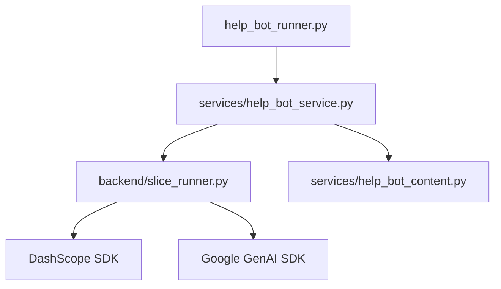
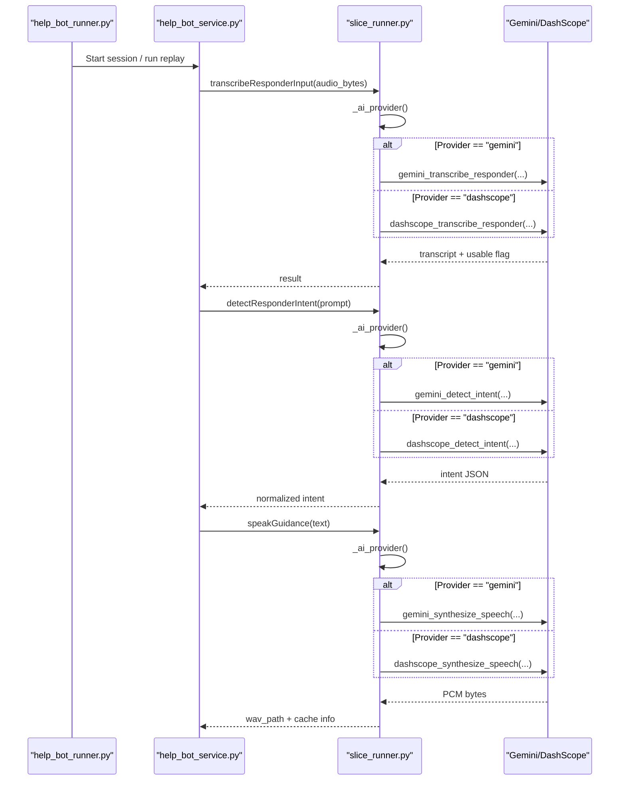
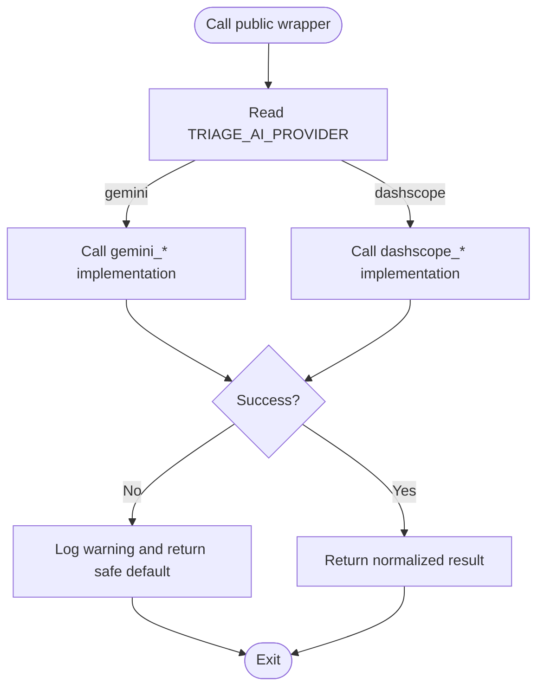
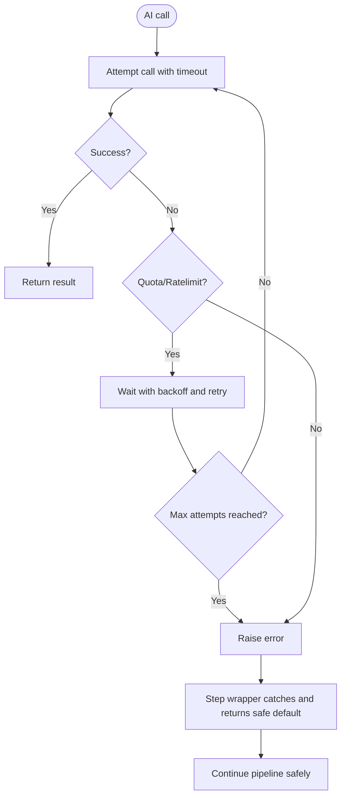
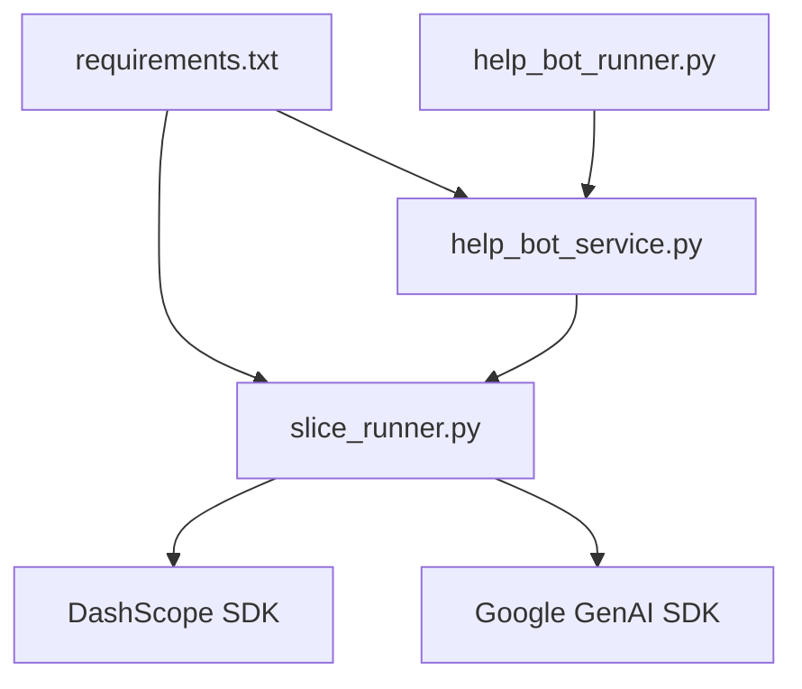

# AI Provider Abstraction Layer

<cite>
**Referenced Files in This Document**
- [slice_runner.py](file://backend/slice_runner.py)
- [help_bot_service.py](file://backend/services/help_bot_service.py)
- [help_bot_content.py](file://backend/services/help_bot_content.py)
- [help_bot_runner.py](file://backend/help_bot_runner.py)
- [requirements.txt](file://backend/requirements.txt)
</cite>

## Table of Contents
1. [Introduction](#introduction)
2. [Project Structure](#project-structure)
3. [Core Components](#core-components)
4. [Architecture Overview](#architecture-overview)
5. [Detailed Component Analysis](#detailed-component-analysis)
6. [Dependency Analysis](#dependency-analysis)
7. [Performance Considerations](#performance-considerations)
8. [Troubleshooting Guide](#troubleshooting-guide)
9. [Conclusion](#conclusion)
10. [Appendices](#appendices)

## Introduction
This document explains the AI provider abstraction layer that enables seamless switching between Gemini and DashScope services across the triage pipeline and the Responder Help Bot. It covers:
- How provider selection works via environment variables
- The dual implementation pattern (gemini_* vs dashscope_*) for each pipeline step
- Consistent interfaces regardless of underlying provider
- Configuration for both providers, including API keys, endpoints, and model parameters
- Failover mechanisms, retry logic with exponential backoff for quota limits, and timeout handling
- Practical examples to switch providers in different environments
- Troubleshooting common integration issues

The goal is to make it safe and simple to swap providers without changing business logic or downstream code.

## Project Structure
The abstraction lives primarily in the backend module and is consumed by the help bot service and runner:
- slice_runner.py: Core provider selection, client setup, retry/backoff, timeouts, and dual implementations for STT, vision classification, and classifier steps
- services/help_bot_service.py: Dual implementations for STT, intent detection, and TTS; consistent wrappers that select provider at runtime
- services/help_bot_content.py: Hardcoded Urdu content used by the bot (not part of provider logic but relevant to fail-safe behavior)
- help_bot_runner.py: Entry point that uses the above modules and demonstrates usage modes
- requirements.txt: External dependencies including dashscope SDK and Google GenAI

**Diagram sources**
- [help_bot_runner.py:1-241](file://backend/help_bot_runner.py#L1-L241)
- [help_bot_service.py:1-960](file://backend/services/help_bot_service.py#L1-L960)
- [slice_runner.py:1-745](file://backend/slice_runner.py#L1-L745)

**Section sources**
- [slice_runner.py:1-745](file://backend/slice_runner.py#L1-L745)
- [help_bot_service.py:1-960](file://backend/services/help_bot_service.py#L1-L960)
- [help_bot_runner.py:1-241](file://backend/help_bot_runner.py#L1-L241)
- [requirements.txt:1-6](file://backend/requirements.txt#L1-L6)

## Core Components
- Provider selection: A single environment variable selects the active provider for all steps.
- Dual implementations: Each pipeline step has gemini_* and dashscope_* functions with identical signatures.
- Consistent wrappers: Public functions call the selected implementation transparently.
- Retry and backoff: Quota/rate-limit errors are retried with bounded waits.
- Timeouts: Per-call timeouts prevent blocking during emergencies.
- Fail-safes: On failure, the system returns safe defaults or pre-rendered audio to keep responders guided.

Key responsibilities:
- slice_runner.py: Provider selection, retries, timeouts, STT/vision/classifier dual implementations, and triage pipeline orchestration
- help_bot_service.py: STT/intent/TTS dual implementations and session flow with fail-safes
- help_bot_runner.py: CLI entrypoint demonstrating usage and prewarming

**Section sources**
- [slice_runner.py:132-154](file://backend/slice_runner.py#L132-L154)
- [slice_runner.py:367-516](file://backend/slice_runner.py#L367-L516)
- [help_bot_service.py:127-167](file://backend/services/help_bot_service.py#L127-L167)
- [help_bot_service.py:244-289](file://backend/services/help_bot_service.py#L244-L289)
- [help_bot_service.py:307-387](file://backend/services/help_bot_service.py#L307-L387)

## Architecture Overview
The system uses a provider boundary at each AI step. The active provider is chosen once per call using an environment variable, then routed to the corresponding gemini_* or dashscope_* function. All callers see the same interface.

**Diagram sources**
- [help_bot_service.py:159-167](file://backend/services/help_bot_service.py#L159-L167)
- [help_bot_service.py:274-289](file://backend/services/help_bot_service.py#L274-L289)
- [help_bot_service.py:368-387](file://backend/services/help_bot_service.py#L368-L387)
- [slice_runner.py:132-154](file://backend/slice_runner.py#L132-L154)

## Detailed Component Analysis

### Provider Selection Mechanism
- Environment variable TRIAGE_AI_PROVIDER controls the active provider. Default is "gemini".
- The helper reads this value and lowercases it to decide which implementation to call.
- This selection is applied consistently across STT, intent detection, and TTS steps.

Practical effect:
- Set TRIAGE_AI_PROVIDER=gemini to use Gemini (default).
- Set TRIAGE_AI_PROVIDER=dashscope to use DashScope (requires SDK and credentials configured).

**Section sources**
- [slice_runner.py:132-154](file://backend/slice_runner.py#L132-L154)
- [help_bot_service.py:159-167](file://backend/services/help_bot_service.py#L159-L167)
- [help_bot_service.py:274-289](file://backend/services/help_bot_service.py#L274-L289)
- [help_bot_service.py:368-387](file://backend/services/help_bot_service.py#L368-L387)

### Dual Implementation Pattern
Each pipeline step exposes two implementations with identical input/output contracts:
- STT: gemini_transcribe_responder vs dashscope_transcribe_responder
- Intent classification: gemini_detect_intent vs dashscope_detect_intent
- TTS: gemini_synthesize_speech vs dashscope_synthesize_speech

Public wrappers choose the implementation based on the active provider and catch exceptions to return safe defaults when needed.

**Diagram sources**
- [help_bot_service.py:159-167](file://backend/services/help_bot_service.py#L159-L167)
- [help_bot_service.py:274-289](file://backend/services/help_bot_service.py#L274-L289)
- [help_bot_service.py:368-387](file://backend/services/help_bot_service.py#L368-L387)

**Section sources**
- [help_bot_service.py:127-167](file://backend/services/help_bot_service.py#L127-L167)
- [help_bot_service.py:244-289](file://backend/services/help_bot_service.py#L244-L289)
- [help_bot_service.py:307-387](file://backend/services/help_bot_service.py#L307-L387)

### Consistent Interfaces
- STT returns a dict with text and usable flags.
- Intent detection returns a strict schema with intent, optional fields, and reason.
- TTS returns cached file path and metadata; PCM is converted to WAV and persisted.

These stable interfaces ensure that higher-level logic does not need to change when switching providers.

**Section sources**
- [help_bot_service.py:127-167](file://backend/services/help_bot_service.py#L127-L167)
- [help_bot_service.py:216-241](file://backend/services/help_bot_service.py#L216-L241)
- [help_bot_service.py:368-387](file://backend/services/help_bot_service.py#L368-L387)

### Configuration Process

#### Environment Variables
- TRIAGE_AI_PROVIDER: Selects "gemini" or "dashscope"
- TRIAGE_CALL_TIMEOUT_S: Per-AI-call timeout in seconds (used by both providers)
- TRIAGE_QUOTA_RETRIES: Number of retries for quota/rate-limit errors
- GEMINI_API_KEY: Required for Gemini calls
- DASHSCOPE_API_KEY: Required for DashScope calls
- GEMINI_STT_MODEL, GEMINI_CLASSIFIER_MODEL, GEMINI_TTS_MODEL, GEMINI_TTS_VOICE: Model and voice tuning for Gemini
- DASHSCOPE_BASE_URL: Optional endpoint override for DashScope; auto-detected if unset

#### API Key Management
- Keys are loaded from a .env file at the repository root
- Keys are never printed or logged
- Missing keys raise explicit errors to guide setup

#### Endpoint Selection
- DashScope endpoint can be set explicitly via DASHSCOPE_BASE_URL
- If not set, endpoint is auto-selected based on key length (international vs China region)

#### Model Parameter Tuning
- Models for STT, classifier, and TTS are configurable via environment variables
- TTS voice is configurable via environment variable
- These allow quick tuning without code changes

**Section sources**
- [slice_runner.py:27-69](file://backend/slice_runner.py#L27-L69)
- [slice_runner.py:36-52](file://backend/slice_runner.py#L36-L52)
- [help_bot_service.py:295-305](file://backend/services/help_bot_service.py#L295-L305)

### Failover and Retry Logic

#### Quota and Rate-Limit Retries
- Calls wrapped with retry logic handle 429 and RESOURCE_EXHAUSTED errors
- Backoff increases with attempts, capped to avoid long waits
- After exhausting retries, failures propagate to step wrappers for safe fallback

#### Timeouts
- Per-call timeouts prevent blocking the emergency flow
- For Gemini, HTTP options enforce timeouts
- For DashScope, timeouts are passed into API calls

#### Fail-Safe Behavior
- STT failures return unusable results; conversation continues with safe defaults
- Intent detection failures return unclear intent with reason
- TTS failures trigger pre-rendered failsafe audio or print Urdu guidance
- Pre-rendered failsafe audio is prepared at session start to minimize network dependency

**Diagram sources**
- [slice_runner.py:72-95](file://backend/slice_runner.py#L72-L95)
- [help_bot_service.py:159-167](file://backend/services/help_bot_service.py#L159-L167)
- [help_bot_service.py:274-289](file://backend/services/help_bot_service.py#L274-L289)
- [help_bot_service.py:727-750](file://backend/services/help_bot_service.py#L727-L750)

**Section sources**
- [slice_runner.py:72-95](file://backend/slice_runner.py#L72-L95)
- [slice_runner.py:55-69](file://backend/slice_runner.py#L55-L69)
- [help_bot_service.py:159-167](file://backend/services/help_bot_service.py#L159-L167)
- [help_bot_service.py:274-289](file://backend/services/help_bot_service.py#L274-L289)
- [help_bot_service.py:727-750](file://backend/services/help_bot_service.py#L727-L750)

### Practical Examples: Switching Providers

#### Development (Gemini)
- Ensure GEMINI_API_KEY is set in .env
- Leave TRIAGE_AI_PROVIDER unset or set to "gemini"
- Configure models and voices via GEMINI_* environment variables

#### Production (DashScope)
- Ensure DASHSCOPE_API_KEY is set in .env
- Optionally set DASHSCOPE_BASE_URL to force endpoint
- Set TRIAGE_AI_PROVIDER=dashscope
- Verify DashScope SDK is installed (see requirements)

#### Mixed Environments
- Use TRIAGE_AI_PROVIDER to flip providers without code changes
- Keep TRIAGE_CALL_TIMEOUT_S and TRIAGE_QUOTA_RETRIES tuned per environment
- Prewarm TTS cache to reduce live quota usage during demos

**Section sources**
- [slice_runner.py:27-69](file://backend/slice_runner.py#L27-L69)
- [slice_runner.py:132-154](file://backend/slice_runner.py#L132-L154)
- [help_bot_service.py:295-305](file://backend/services/help_bot_service.py#L295-L305)
- [help_bot_runner.py:102-133](file://backend/help_bot_runner.py#L102-L133)

## Dependency Analysis
External dependencies:
- dashscope SDK: Used for DashScope STT, vision, and generation
- google-genai SDK: Used for Gemini STT, vision, classifier, and TTS
- python-dotenv: Loads environment variables from .env
- sounddevice and soundfile: Audio capture/playback for live mode

Coupling:
- help_bot_service.py depends on slice_runner.py for provider selection and shared utilities
- help_bot_runner.py depends on both service and content modules
- slice_runner.py conditionally imports DashScope SDK only when needed

**Diagram sources**
- [requirements.txt:1-6](file://backend/requirements.txt#L1-L6)
- [slice_runner.py:142-154](file://backend/slice_runner.py#L142-L154)
- [help_bot_service.py:1-960](file://backend/services/help_bot_service.py#L1-L960)
- [help_bot_runner.py:1-241](file://backend/help_bot_runner.py#L1-L241)

**Section sources**
- [requirements.txt:1-6](file://backend/requirements.txt#L1-L6)
- [slice_runner.py:142-154](file://backend/slice_runner.py#L142-L154)

## Performance Considerations
- TTS caching: Scripted lines are rendered once and cached to disk, avoiding repeated quota consumption and ensuring deterministic runs
- Prewarming: Pre-render all scripted lines before sessions to stay within free-tier rate limits
- Timeouts: Short timeouts prevent blocking during emergencies
- Retries: Bounded retries with backoff improve resilience under quota pressure
- VAD and barge-in: Efficient audio capture reduces unnecessary processing

Recommendations:
- Use prewarm-tts in CI or staging to validate audio quality and cache coverage
- Tune TRIAGE_CALL_TIMEOUT_S based on network conditions
- Monitor TRIAGE_QUOTA_RETRIES to balance responsiveness and resilience

[No sources needed since this section provides general guidance]

## Troubleshooting Guide

Common issues and resolutions:
- Missing API keys: Ensure GEMINI_API_KEY or DASHSCOPE_API_KEY is set in .env
- Wrong DashScope endpoint: Set DASHSCOPE_BASE_URL explicitly if auto-detection fails
- SDK not installed: Install dependencies from requirements.txt
- Quota exceeded: Increase TRIAGE_QUOTA_RETRIES or wait for quota replenishment; use prewarmed TTS cache
- Timeout errors: Adjust TRIAGE_CALL_TIMEOUT_S for slower networks
- No audio device: Live mic mode requires sounddevice; replay mode works without hardware

Diagnostic tips:
- Check logs for provider-specific warnings and retry messages
- Verify TTS cache exists and contains expected files
- Run verify-tts to check STT round-trip quality for spoken Urdu

**Section sources**
- [slice_runner.py:36-52](file://backend/slice_runner.py#L36-L52)
- [slice_runner.py:72-95](file://backend/slice_runner.py#L72-L95)
- [help_bot_runner.py:102-133](file://backend/help_bot_runner.py#L102-L133)
- [help_bot_runner.py:135-172](file://backend/help_bot_runner.py#L135-L172)

## Conclusion
The AI provider abstraction layer cleanly separates provider-specific logic behind consistent interfaces. By configuring environment variables, you can switch between Gemini and DashScope without modifying business logic. Robust retry, timeout, and fail-safe mechanisms ensure reliability in emergency scenarios. Prewarming TTS and caching strategies further improve performance and quota efficiency.

[No sources needed since this section summarizes without analyzing specific files]

## Appendices

### Environment Variables Reference
- TRIAGE_AI_PROVIDER: "gemini" (default) or "dashscope"
- TRIAGE_CALL_TIMEOUT_S: Seconds per AI call (default 30)
- TRIAGE_QUOTA_RETRIES: Number of retries for quota/rate-limit errors (default 3)
- GEMINI_API_KEY: Required for Gemini
- DASHSCOPE_API_KEY: Required for DashScope
- DASHSCOPE_BASE_URL: Optional endpoint override for DashScope
- GEMINI_STT_MODEL, GEMINI_CLASSIFIER_MODEL, GEMINI_TTS_MODEL, GEMINI_TTS_VOICE: Gemini model and voice configuration

**Section sources**
- [slice_runner.py:27-69](file://backend/slice_runner.py#L27-L69)
- [help_bot_service.py:295-305](file://backend/services/help_bot_service.py#L295-L305)