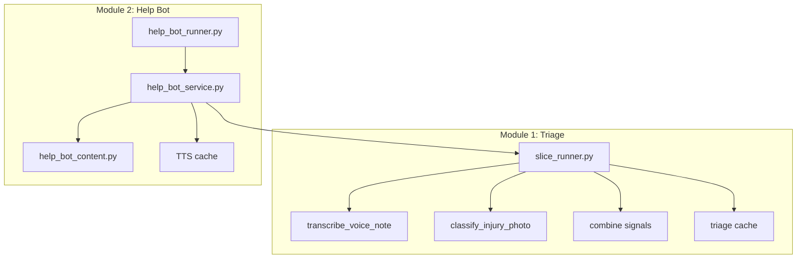
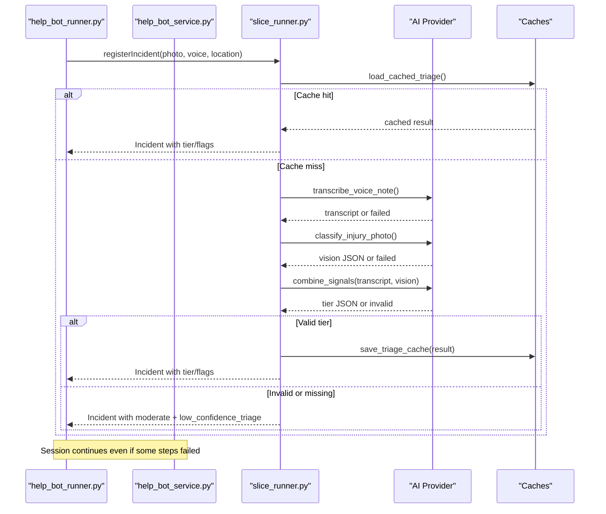
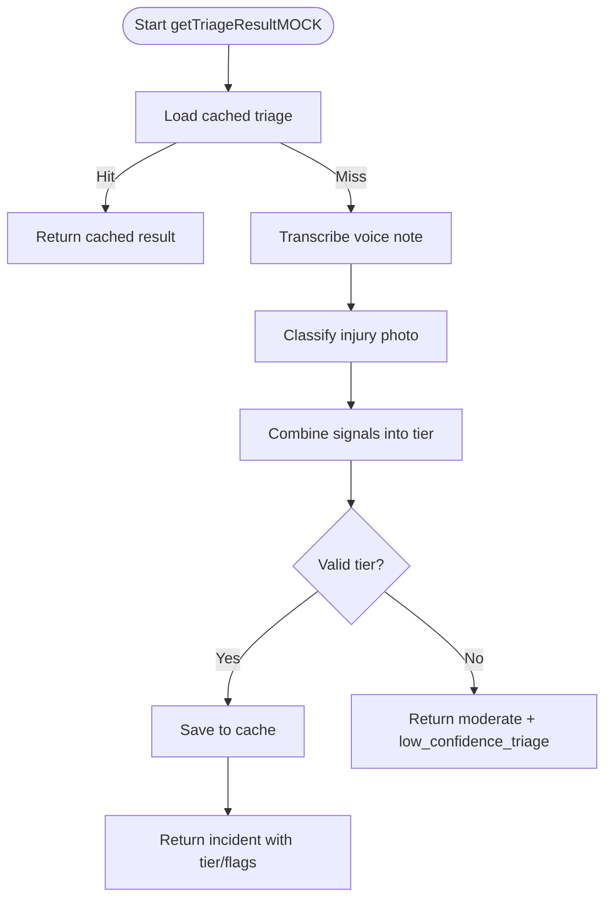
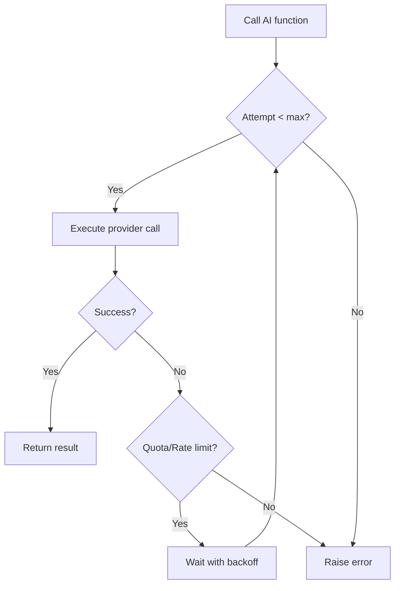
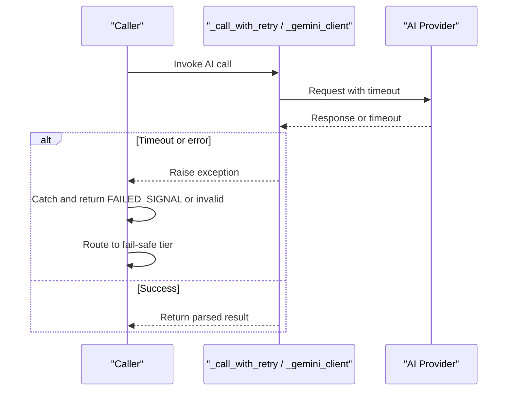
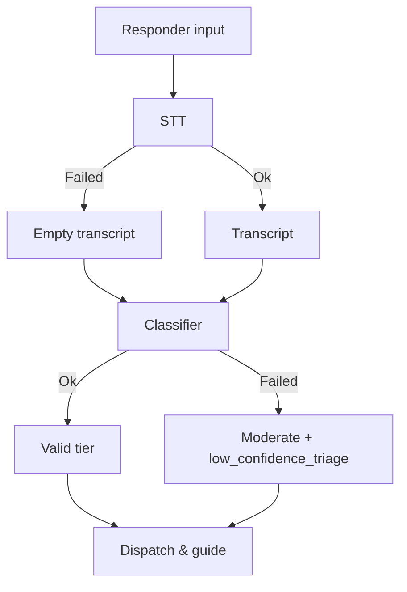
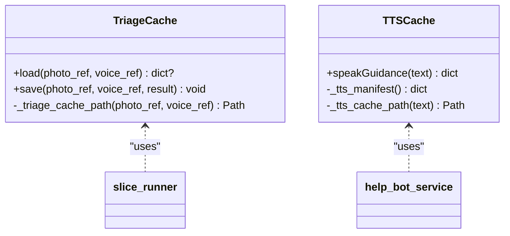
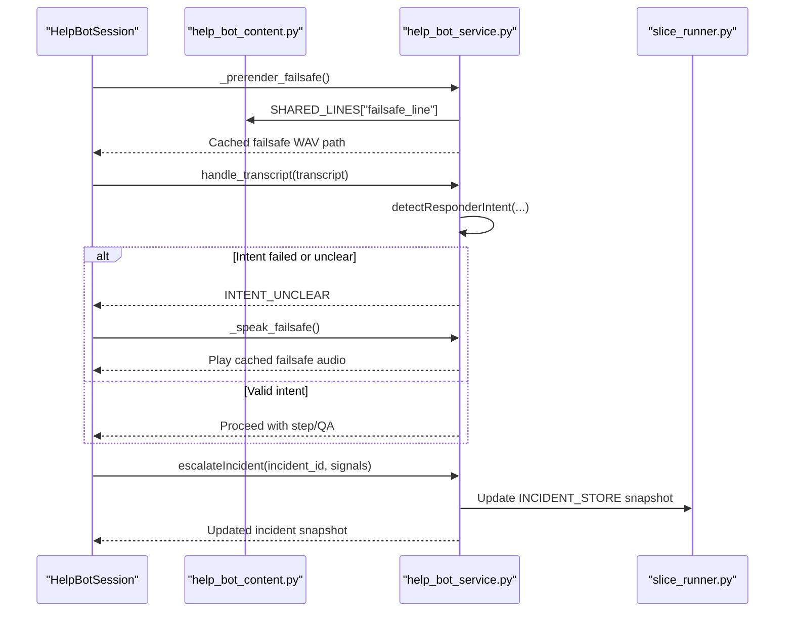
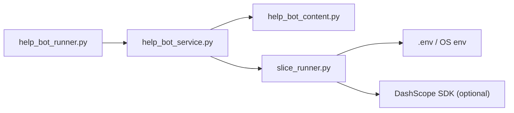

# Error Handling and Recovery Mechanisms

<cite>
**Referenced Files in This Document**
- [help_bot_runner.py](file://backend/help_bot_runner.py)
- [help_bot_service.py](file://backend/services/help_bot_service.py)
- [help_bot_content.py](file://backend/services/help_bot_content.py)
- [slice_runner.py](file://backend/slice_runner.py)
- [verify_stt.py](file://backend/verify_stt.py)
- [verify_vision.py](file://backend/verify_vision.py)
</cite>

## Table of Contents
1. [Introduction](#introduction)
2. [Project Structure](#project-structure)
3. [Core Components](#core-components)
4. [Architecture Overview](#architecture-overview)
5. [Detailed Component Analysis](#detailed-component-analysis)
6. [Dependency Analysis](#dependency-analysis)
7. [Performance Considerations](#performance-considerations)
8. [Troubleshooting Guide](#troubleshooting-guide)
9. [Conclusion](#conclusion)

## Introduction
This document explains the error handling and recovery mechanisms that keep the emergency response system reliable when AI services fail, return invalid responses, or hit rate limits. It focuses on:
- A fail-safe tier system that defaults to moderate severity with low_confidence_triage flags when triage cannot be confidently performed.
- Retry logic with exponential backoff for rate limiting and quota exhaustion.
- Timeout handling to prevent pipeline blocking.
- Graceful degradation when individual components (STT, vision, intent classification, TTS) fail.
- Caching strategies that avoid redundant API calls and protect against quota limits.
- Concrete examples such as missing media files, network timeouts, invalid AI responses, and quota exceeded errors, and how each is handled while maintaining availability.

## Project Structure
The error-handling behavior spans two layers:
- Module 1 triage layer (slice_runner): STT, vision, classifier, caching, retries, timeouts, and fail-safe defaults.
- Module 2 help-bot layer (help_bot_service + content): conversation loop, provider boundaries, TTS cache, failsafe audio, escalation hook, and session state transitions.

**Diagram sources**
- [slice_runner.py:519-586](file://backend/slice_runner.py#L519-L586)
- [help_bot_service.py:127-167](file://backend/services/help_bot_service.py#L127-L167)
- [help_bot_service.py:244-288](file://backend/services/help_bot_service.py#L244-L288)
- [help_bot_service.py:307-387](file://backend/services/help_bot_service.py#L307-L387)
- [help_bot_runner.py:92-99](file://backend/help_bot_runner.py#L92-L99)

**Section sources**
- [slice_runner.py:519-586](file://backend/slice_runner.py#L519-L586)
- [help_bot_service.py:127-167](file://backend/services/help_bot_service.py#L127-L167)
- [help_bot_service.py:244-288](file://backend/services/help_bot_service.py#L244-L288)
- [help_bot_service.py:307-387](file://backend/services/help_bot_service.py#L307-L387)
- [help_bot_runner.py:92-99](file://backend/help_bot_runner.py#L92-L99)

## Core Components
- Fail-safe tier default: When triage cannot produce a valid tier or inputs are missing/invalid, the system returns moderate severity with low_confidence_triage flag to ensure safe dispatch without blocking.
- Retry with backoff: Quota/rate-limit errors trigger bounded retries with increasing waits to survive transient provider issues.
- Timeouts: Per-call timeouts prevent long hangs; on timeout, the call raises and is caught by wrappers that route to fail-safe paths.
- Graceful degradation: Each step (STT, vision, classifier, intent detection, TTS) has explicit fallbacks so partial failures do not stop the flow.
- Caching: Successful triage results are cached to avoid redundant API calls; TTS outputs are cached to stay within free-tier quotas.

**Section sources**
- [slice_runner.py:55-95](file://backend/slice_runner.py#L55-L95)
- [slice_runner.py:97-129](file://backend/slice_runner.py#L97-L129)
- [slice_runner.py:519-586](file://backend/slice_runner.py#L519-L586)
- [help_bot_service.py:350-387](file://backend/services/help_bot_service.py#L350-L387)

## Architecture Overview
The system uses a provider boundary pattern to isolate AI calls and enforce consistent error handling across STT, vision, classifier, and intent detection. The help-bot layer adds conversational safeguards, pre-rendered failsafe audio, and an escalation hook to upgrade severity mid-session.

**Diagram sources**
- [slice_runner.py:519-586](file://backend/slice_runner.py#L519-L586)
- [slice_runner.py:107-129](file://backend/slice_runner.py#L107-L129)

## Detailed Component Analysis

### Triage Pipeline Fail-Safe Tier and Low Confidence Flag
- Behavior: If any triage step fails or returns unusable data, the pipeline avoids blocking and returns a safe default: moderate severity with low_confidence_triage flag.
- Rationale: Safety-first design ensures responders still receive guidance and dispatch proceeds.
- Where implemented: The triage entry point checks validity and applies the fail-safe path when needed.

**Diagram sources**
- [slice_runner.py:519-586](file://backend/slice_runner.py#L519-L586)
- [slice_runner.py:107-129](file://backend/slice_runner.py#L107-L129)

**Section sources**
- [slice_runner.py:519-586](file://backend/slice_runner.py#L519-L586)

### Retry Logic with Exponential Backoff for Rate Limiting and Quota Exhaustion
- Behavior: Calls wrapped with retry logic detect quota/rate-limit conditions and wait with increasing delays before retrying up to a configured number of attempts.
- Scope: Applies to STT, vision, classifier, and intent detection calls through shared helpers.
- Outcome: Improves resilience during temporary provider throttling; final failure routes to fail-safe.

**Diagram sources**
- [slice_runner.py:72-95](file://backend/slice_runner.py#L72-L95)

**Section sources**
- [slice_runner.py:72-95](file://backend/slice_runner.py#L72-L95)

### Timeout Handling to Prevent Pipeline Blocking
- Behavior: Each AI call enforces a per-call timeout. On timeout, the call raises and is caught by wrapper functions that return a failed signal or invalid output, which then triggers fail-safe behavior.
- Configuration: Timeout value is read from environment and applied to client HTTP options or SDK calls.
- Impact: Ensures responsiveness even under slow or unresponsive providers.

**Diagram sources**
- [slice_runner.py:55-69](file://backend/slice_runner.py#L55-L69)
- [slice_runner.py:72-95](file://backend/slice_runner.py#L72-L95)

**Section sources**
- [slice_runner.py:55-69](file://backend/slice_runner.py#L55-L69)
- [slice_runner.py:72-95](file://backend/slice_runner.py#L72-L95)

### Graceful Degradation Across Components
- STT failures: Returns empty transcript and usable=false; downstream classifier still runs and may produce a tier based on available signals.
- Vision failures: Returns failed status; classifier receives empty vision input and can still produce a tier based on transcript.
- Classifier failures: Returns failed signal; triage falls back to moderate + low_confidence_triage.
- Intent detection failures: Returns unclear intent; conversation engine uses failsafe lines and continues guiding.
- TTS failures: Uses pre-rendered failsafe audio or prints Urdu text; playback best-effort.

**Diagram sources**
- [slice_runner.py:414-425](file://backend/slice_runner.py#L414-L425)
- [slice_runner.py:467-474](file://backend/slice_runner.py#L467-L474)
- [slice_runner.py:509-516](file://backend/slice_runner.py#L509-L516)
- [help_bot_service.py:159-167](file://backend/services/help_bot_service.py#L159-L167)
- [help_bot_service.py:274-288](file://backend/services/help_bot_service.py#L274-L288)
- [help_bot_service.py:727-750](file://backend/services/help_bot_service.py#L727-L750)

**Section sources**
- [slice_runner.py:414-425](file://backend/slice_runner.py#L414-L425)
- [slice_runner.py:467-474](file://backend/slice_runner.py#L467-L474)
- [slice_runner.py:509-516](file://backend/slice_runner.py#L509-L516)
- [help_bot_service.py:159-167](file://backend/services/help_bot_service.py#L159-L167)
- [help_bot_service.py:274-288](file://backend/services/help_bot_service.py#L274-L288)
- [help_bot_service.py:727-750](file://backend/services/help_bot_service.py#L727-L750)

### Caching Strategy for Triage Results and TTS
- Triage cache: Stores successful AI-derived triage results keyed by photo_ref and voice_transcript; skips redundant calls and protects quota.
- TTS cache: Stores rendered Urdu audio per scripted line keyed by voice+text; prewarming reduces live latency and quota usage.
- Safeguards: Only genuine AI results are cached; fail-safe degraded results are intentionally excluded from triage cache to avoid poisoning it.

**Diagram sources**
- [slice_runner.py:97-129](file://backend/slice_runner.py#L97-L129)
- [help_bot_service.py:350-387](file://backend/services/help_bot_service.py#L350-L387)

**Section sources**
- [slice_runner.py:97-129](file://backend/slice_runner.py#L97-L129)
- [help_bot_service.py:350-387](file://backend/services/help_bot_service.py#L350-L387)

### Conversation Engine Failsafes and Escalation Hook
- Failsafe audio: Pre-rendered Urdu failsafe line is prepared at session start; if TTS fails, this cached audio is played to avoid silence.
- Intent detection fallback: Unclear or failed intent leads to out-of-scope or step_done handling with honest guidance and continued monitoring.
- Escalation hook: Mid-session escalation upgrades severity only upward, merges new flags, marks BHU notification and ambulance request, and logs transitions.

**Diagram sources**
- [help_bot_service.py:689-694](file://backend/services/help_bot_service.py#L689-L694)
- [help_bot_service.py:727-750](file://backend/services/help_bot_service.py#L727-L750)
- [help_bot_service.py:274-288](file://backend/services/help_bot_service.py#L274-L288)
- [help_bot_service.py:576-647](file://backend/services/help_bot_service.py#L576-L647)

**Section sources**
- [help_bot_service.py:689-694](file://backend/services/help_bot_service.py#L689-L694)
- [help_bot_service.py:727-750](file://backend/services/help_bot_service.py#L727-L750)
- [help_bot_service.py:274-288](file://backend/services/help_bot_service.py#L274-L288)
- [help_bot_service.py:576-647](file://backend/services/help_bot_service.py#L576-L647)

## Dependency Analysis
- slice_runner depends on environment configuration and optional DashScope SDK; it centralizes provider selection, retries, timeouts, and caching.
- help_bot_service depends on slice_runner for provider utilities and incident store, and on help_bot_content for scripted lines and branches.
- help_bot_runner orchestrates modes (replay/mic), builds incidents via slice_runner, and manages session lifecycle.

**Diagram sources**
- [help_bot_runner.py:39-44](file://backend/help_bot_runner.py#L39-L44)
- [help_bot_service.py:42-47](file://backend/services/help_bot_service.py#L42-L47)
- [slice_runner.py:8-16](file://backend/slice_runner.py#L8-L16)
- [slice_runner.py:144-153](file://backend/slice_runner.py#L144-L153)

**Section sources**
- [help_bot_runner.py:39-44](file://backend/help_bot_runner.py#L39-L44)
- [help_bot_service.py:42-47](file://backend/services/help_bot_service.py#L42-L47)
- [slice_runner.py:8-16](file://backend/slice_runner.py#L8-L16)
- [slice_runner.py:144-153](file://backend/slice_runner.py#L144-L153)

## Performance Considerations
- Use TTS prewarming to eliminate live TTS calls during replay runs, reducing latency and protecting quota.
- Leverage triage cache to avoid repeated AI calls for identical media inputs.
- Tune retry counts and backoff durations via environment variables to balance responsiveness and resilience.
- Monitor first-playback delay metrics to detect bottlenecks in TTS or playback paths.

[No sources needed since this section provides general guidance]

## Troubleshooting Guide
Common error scenarios and their handling:

- Missing media files:
  - Symptom: STT or vision steps report missing files and return failed signals.
  - Handling: Triage pipeline treats missing inputs as unusable, falling back to moderate + low_confidence_triage; no pipeline block.
  - Evidence: STT and vision wrappers log warnings and return failed signals.

- Network timeouts:
  - Symptom: AI calls exceed configured timeout.
  - Handling: Exceptions raised and caught; wrappers return failed signals or invalid outputs; triage routes to fail-safe tier.

- Invalid AI responses:
  - Symptom: Non-JSON or malformed outputs from vision/classifier/intent detection.
  - Handling: Loose JSON parsing attempted; if invalid, treated as failure and routed to fail-safe or unclear intent.

- Quota exceeded errors:
  - Symptom: 429 or RESOURCE_EXHAUSTED messages.
  - Handling: Bounded retries with exponential backoff; after max attempts, proceed with fail-safe behavior.

- TTS failures:
  - Symptom: Live TTS generation fails.
  - Handling: Pre-rendered failsafe audio is played; otherwise printed Urdu text guides responder; playback best-effort.

- Audio hardware unavailable:
  - Symptom: Playback/capture dependencies missing.
  - Handling: Logs warning and continues without playback/capture; transcripts and saved artifacts remain evidence.

**Section sources**
- [slice_runner.py:414-425](file://backend/slice_runner.py#L414-L425)
- [slice_runner.py:467-474](file://backend/slice_runner.py#L467-L474)
- [slice_runner.py:509-516](file://backend/slice_runner.py#L509-L516)
- [slice_runner.py:72-95](file://backend/slice_runner.py#L72-L95)
- [help_bot_service.py:159-167](file://backend/services/help_bot_service.py#L159-L167)
- [help_bot_service.py:274-288](file://backend/services/help_bot_service.py#L274-L288)
- [help_bot_service.py:394-402](file://backend/services/help_bot_service.py#L394-L402)
- [help_bot_service.py:727-750](file://backend/services/help_bot_service.py#L727-L750)

## Conclusion
The system prioritizes safety and availability through layered error handling:
- Fail-safe defaults ensure responders always receive actionable guidance even when AI components fail.
- Retries and timeouts provide resilience against transient provider issues.
- Caching reduces quota pressure and improves performance.
- Graceful degradation keeps the pipeline moving despite partial failures.
These mechanisms collectively maintain reliability during emergency processing, ensuring continuity of care and dispatch operations under adverse conditions.

[No sources needed since this section summarizes without analyzing specific files]