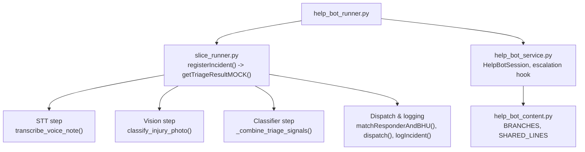
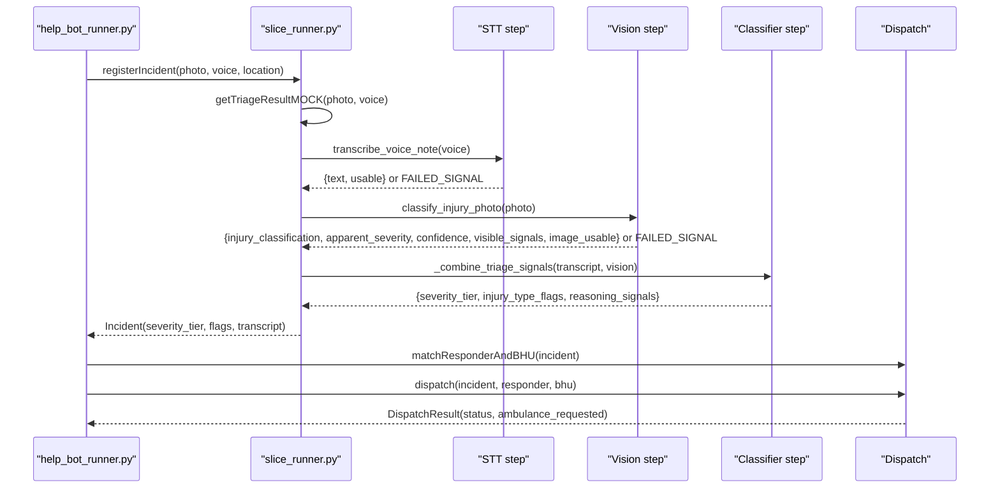
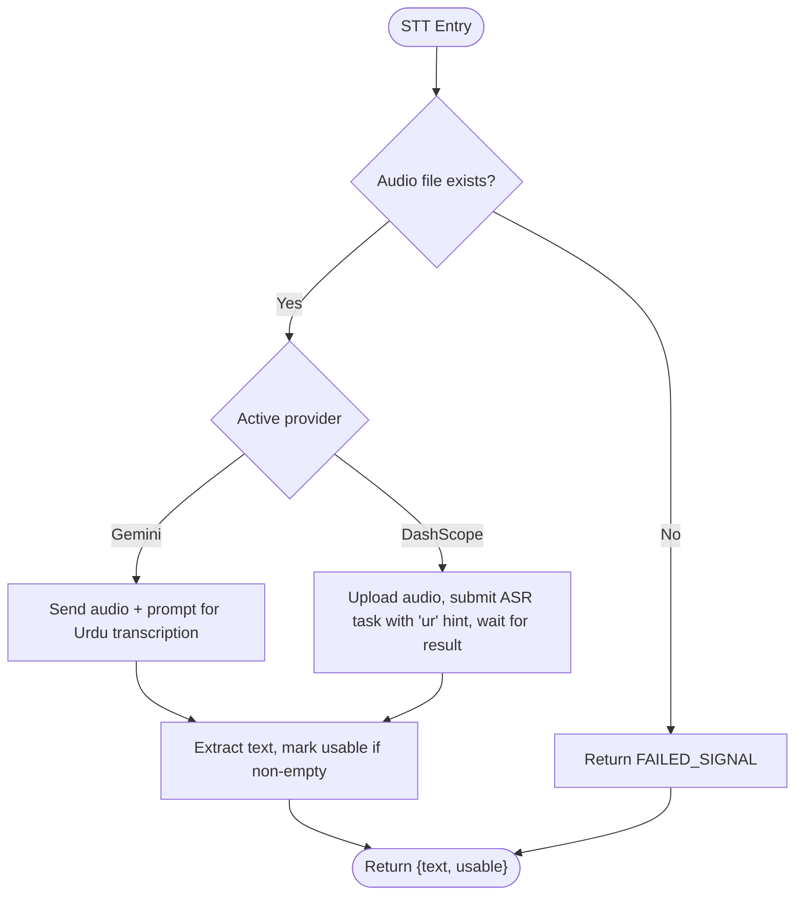
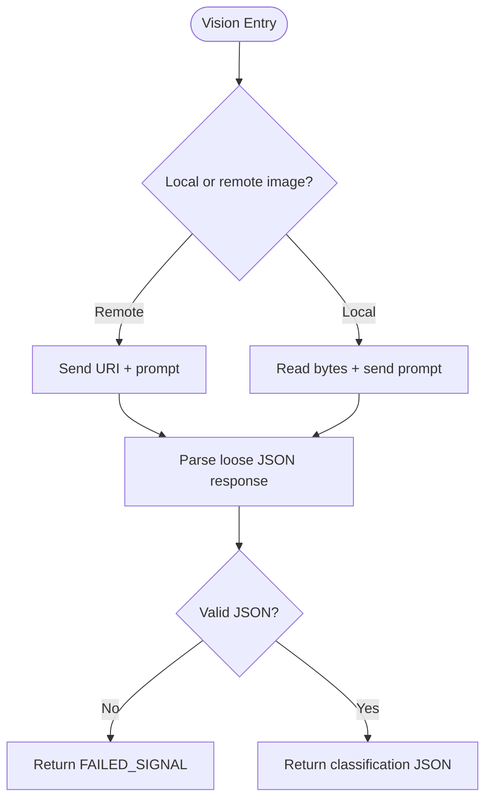
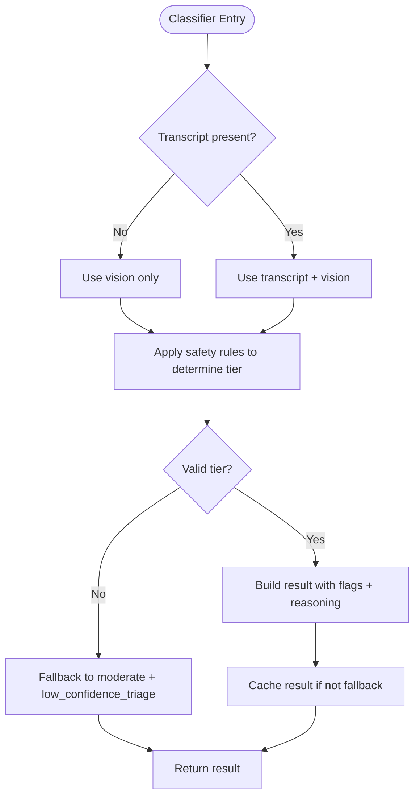
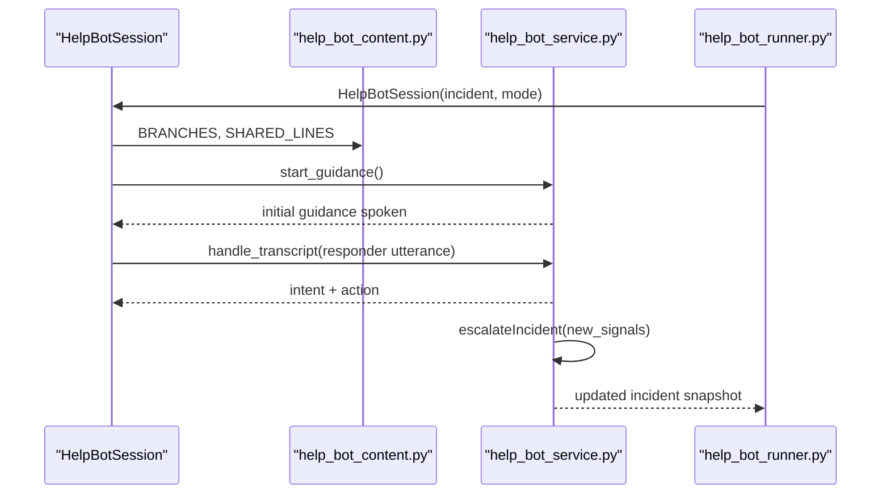
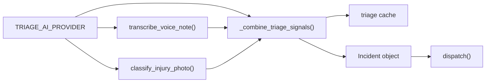

# Pipeline Processing Stages

<cite>
**Referenced Files in This Document**
- [slice_runner.py](file://backend/slice_runner.py)
- [help_bot_runner.py](file://backend/help_bot_runner.py)
- [help_bot_service.py](file://backend/services/help_bot_service.py)
- [help_bot_content.py](file://backend/services/help_bot_content.py)
- [verify_stt.py](file://backend/verify_stt.py)
- [verify_vision.py](file://backend/verify_vision.py)
- [0a494362c7b0d139.json](file://mockdata/media/.triage_cache/0a494362c7b0d139.json)
- [9b9fcb4f441ca8a6.json](file://mockdata/media/.triage_cache/9b9fcb4f441ca8a6.json)
</cite>

## Table of Contents
1. Introduction
2. Project Structure
3. Core Components
4. Architecture Overview
5. Detailed Component Analysis
6. Dependency Analysis
7. Performance Considerations
8. Troubleshooting Guide
9. Conclusion

## Introduction
This document explains the triage pipeline that processes emergency reports by combining two modalities: voice notes and photos. It covers three core stages:
- Speech-to-text transcription (STT)
- Vision-based injury classification
- Signal combination for severity determination

The pipeline is provider-agnostic and supports both Gemini and DashScope AI services through a single environment variable. It validates inputs, handles errors at each stage, and uses safety-first conflict resolution when voice and visual signals disagree. Examples include processing Urdu voice transcriptions, analyzing images for visible trauma indicators, and resolving conflicting signals to ensure patient safety.

## Project Structure
At a high level:
- The triage pipeline entry point lives in the backend runner and orchestrates Module 1 triage before handing off to Module 2 help-bot flows.
- The core triage logic, provider selection, STT, vision, classifier, caching, and dispatch are implemented in a single module with clear boundaries between steps.
- Verification scripts exercise STT and vision independently against mock media.
- Help-bot content defines scripted Urdu guidance and branching rules.

**Diagram sources**
- [help_bot_runner.py:92-99](file://backend/help_bot_runner.py#L92-L99)
- [slice_runner.py:589-610](file://backend/slice_runner.py#L589-L610)
- [slice_runner.py:519-586](file://backend/slice_runner.py#L519-L586)
- [help_bot_service.py:663-783](file://backend/services/help_bot_service.py#L663-L783)
- [help_bot_content.py:21-43](file://backend/services/help_bot_content.py#L21-L43)

**Section sources**
- [help_bot_runner.py:92-99](file://backend/help_bot_runner.py#L92-L99)
- [slice_runner.py:589-610](file://backend/slice_runner.py#L589-L610)

## Core Components
- Provider-agnostic boundary: A single function selects the active AI provider (Gemini or DashScope) via an environment variable. Each step has gemini_* and dashscope_* implementations behind this boundary.
- STT step: Transcribes Urdu audio into text using either Gemini ASR or DashScope SenseVoice-v1. Returns usable text or a failure signal.
- Vision step: Classifies injuries from photos using either Gemini vision or DashScope qwen-vl-max. Returns structured JSON with injury classification, apparent severity, confidence, visible signals, and image usability.
- Classifier step: Combines transcript and vision outputs into a final severity tier and injury flags, following explicit safety-first conflict resolution rules.
- Caching: Results are cached per photo+voice hash to avoid repeated quota usage and to support deterministic replay runs.
- Dispatch: After triage, responders and BHUs are matched and incidents logged; critical tiers trigger ambulance requests.

**Section sources**
- [slice_runner.py:138-153](file://backend/slice_runner.py#L138-L153)
- [slice_runner.py:369-425](file://backend/slice_runner.py#L369-L425)
- [slice_runner.py:430-474](file://backend/slice_runner.py#L430-L474)
- [slice_runner.py:479-516](file://backend/slice_runner.py#L479-L516)
- [slice_runner.py:97-129](file://backend/slice_runner.py#L97-L129)
- [slice_runner.py:612-662](file://backend/slice_runner.py#L612-L662)

## Architecture Overview
The pipeline executes three sequential, independent steps with robust error handling and provider abstraction.

**Diagram sources**
- [help_bot_runner.py:92-99](file://backend/help_bot_runner.py#L92-L99)
- [slice_runner.py:519-586](file://backend/slice_runner.py#L519-L586)
- [slice_runner.py:612-662](file://backend/slice_runner.py#L612-L662)

## Detailed Component Analysis

### Stage 1: Speech-to-Text Transcription (STT)
Responsibilities:
- Validate input audio file existence.
- Call the active provider’s STT implementation.
- Return a normalized result with text and usability flag, or a failure signal on any error.

Provider implementations:
- Gemini: Sends audio bytes with a prompt requesting verbatim Urdu transcription.
- DashScope: Uploads audio via helper, submits async transcription task with language hint “ur”, waits for completion, and retrieves transcripts.

Input validation and error handling:
- Missing audio files return a failure signal immediately.
- Network or quota errors are caught and converted to failure signals so downstream stages can degrade gracefully.
- Retries with backoff are applied to provider calls to handle temporary quota limits.

Urdu example:
- Mock voice clips under mockdata/media/voice contain Urdu speech. The verification script iterates these clips, calls the pipeline’s STT function, and prints latency and output side-by-side with optional ground-truth sidecars.

**Diagram sources**
- [slice_runner.py:369-425](file://backend/slice_runner.py#L369-L425)
- [verify_stt.py:22-52](file://backend/verify_stt.py#L22-L52)

**Section sources**
- [slice_runner.py:369-425](file://backend/slice_runner.py#L369-L425)
- [verify_stt.py:22-52](file://backend/verify_stt.py#L22-L52)

### Stage 2: Vision-Based Injury Classification
Responsibilities:
- Accept local or remote image references.
- Call the active provider’s vision model with a strict JSON prompt describing expected fields.
- Parse model output loosely to tolerate markdown fences and prose.
- Return structured classification including injury type, apparent severity, confidence, visible signals, and image usability.

Provider implementations:
- Gemini: Builds Part from bytes or URI and sends the prompt.
- DashScope: Uses MultiModalConversation with image and text parts.

Input validation and error handling:
- Non-JSON responses raise errors that are caught by the wrapper and converted to failure signals.
- Timeouts and API errors are handled consistently across providers.

Example analysis:
- For a snakebite image, the vision model may report puncture marks and mild swelling, while the transcript indicates venomous bite risk. The classifier later resolves this conflict using safety-first rules.

**Diagram sources**
- [slice_runner.py:430-474](file://backend/slice_runner.py#L430-L474)
- [verify_vision.py:22-49](file://backend/verify_vision.py#L22-L49)

**Section sources**
- [slice_runner.py:430-474](file://backend/slice_runner.py#L430-L474)
- [verify_vision.py:22-49](file://backend/verify_vision.py#L22-L49)

### Stage 3: Signal Combination for Severity Determination
Responsibilities:
- Combine transcript and vision outputs into a single severity tier and injury-type flags.
- Apply explicit safety-first conflict resolution: when voice and vision disagree, adopt the more severe tier.
- Preserve reasoning signals for auditability.

Conflict resolution principles:
- Voice-reported danger signals (e.g., venomous bite, unconsciousness, uncontrolled bleeding, machine entanglement, breathing difficulty) must never be downgraded by vision findings.
- If either source indicates critical, the final tier is critical.
- If both inputs are missing or unclear, default to moderate (safer default).

Partial failures and reliability:
- If STT fails or produces empty text, the pipeline still proceeds with vision-only input.
- If vision fails or image is unusable, the pipeline proceeds with transcript-only input.
- If classifier returns invalid output, the pipeline falls back to moderate with a low-confidence flag.
- Triage results are cached to avoid repeated quota usage and to support deterministic replays.

**Diagram sources**
- [slice_runner.py:479-516](file://backend/slice_runner.py#L479-L516)
- [slice_runner.py:519-586](file://backend/slice_runner.py#L519-L586)

**Section sources**
- [slice_runner.py:479-516](file://backend/slice_runner.py#L479-L516)
- [slice_runner.py:519-586](file://backend/slice_runner.py#L519-L586)

### End-to-End Example: Snakebite Case
- Transcript: Reporter describes a venomous snakebite with severe pain and suspected poison.
- Vision: Image shows puncture marks and localized redness/swelling; model may rate apparent severity lower than voice suggests.
- Combination: Safety-first rule prioritizes voice-reported venomous bite risk; final tier is critical with relevant flags.

Evidence in cache:
- The triage cache for the snakebite scenario records critical tier, flags like venomous_snake_bite and puncture_wounds, and reasoning signals noting that voice-reported venomous bites are never downgraded by minor vision findings.

**Section sources**
- [0a494362c7b0d139.json:1-42](file://mockdata/media/.triage_cache/0a494362c7b0d139.json#L1-L42)

### End-to-End Example: Crushed Leg Case
- Transcript: Reporter describes a heavy block falling onto the leg causing major trauma and deep wound.
- Vision: Image shows heavy bleeding, large open wound, and significant blood saturation; model rates apparent severity as critical.
- Combination: Both modalities agree on critical severity; final tier is critical with flags reflecting heavy bleeding, major trauma, and deep open wound.

Evidence in cache:
- The triage cache for the crushed leg scenario records critical tier and detailed reasoning signals from transcript and vision.

**Section sources**
- [9b9fcb4f441ca8a6.json:1-42](file://mockdata/media/.triage_cache/9b9fcb4f441ca8a6.json#L1-L42)

### Help-Bot Integration and Escalation
After triage, the runner creates an incident and optionally runs the help-bot session. The help-bot:
- Routes to a branch based on injury flags.
- Speaks scripted Urdu guidance and listens for responder input.
- Detects intents and escalates incidents mid-session when warranted.

Escalation hook:
- Upgrades severity tier without downgrading.
- Merges new injury flags additively.
- Flags BHU notification and ambulance request on critical tiers.
- Appends timestamped transition events for accountability.

**Diagram sources**
- [help_bot_runner.py:215-234](file://backend/help_bot_runner.py#L215-L234)
- [help_bot_service.py:663-783](file://backend/services/help_bot_service.py#L663-L783)
- [help_bot_service.py:576-647](file://backend/services/help_bot_service.py#L576-L647)
- [help_bot_content.py:21-43](file://backend/services/help_bot_content.py#L21-L43)

**Section sources**
- [help_bot_runner.py:215-234](file://backend/help_bot_runner.py#L215-L234)
- [help_bot_service.py:576-647](file://backend/services/help_bot_service.py#L576-L647)
- [help_bot_service.py:663-783](file://backend/services/help_bot_service.py#L663-L783)
- [help_bot_content.py:21-43](file://backend/services/help_bot_content.py#L21-L43)

## Dependency Analysis
Key dependencies and relationships:
- Provider selection depends on an environment variable; each step delegates to gemini_* or dashscope_* functions.
- STT and vision steps are independent and can fail partially without blocking the pipeline.
- Classifier depends on outputs from STT and vision but enforces safety-first rules to resolve conflicts.
- Caching reduces external dependency load and ensures deterministic behavior for replay runs.
- Help-bot service depends on Module 1 incident data and provides an escalation integration point for future modules.

**Diagram sources**
- [slice_runner.py:138-153](file://backend/slice_runner.py#L138-L153)
- [slice_runner.py:519-586](file://backend/slice_runner.py#L519-L586)
- [slice_runner.py:612-662](file://backend/slice_runner.py#L612-L662)

**Section sources**
- [slice_runner.py:138-153](file://backend/slice_runner.py#L138-L153)
- [slice_runner.py:519-586](file://backend/slice_runner.py#L519-L586)
- [slice_runner.py:612-662](file://backend/slice_runner.py#L612-L662)

## Performance Considerations
- Per-call timeouts prevent blocking the emergency flow during network delays.
- Quota retries with exponential backoff improve resilience under free-tier constraints.
- Triage caching avoids repeated AI calls for identical media pairs, reducing latency and quota consumption.
- TTS prewarming caches all scripted lines to eliminate runtime rendering costs during replay runs.
- Audio capture uses VAD and barge-in detection to minimize unnecessary processing and improve responsiveness.

[No sources needed since this section provides general guidance]

## Troubleshooting Guide
Common issues and resolutions:
- Missing audio or image files: STT/vision wrappers return failure signals; the pipeline degrades to transcript-only or vision-only and may fall back to moderate with low-confidence flag.
- Non-JSON model outputs: Parsers attempt loose parsing; failures convert to failure signals and trigger safe defaults.
- Quota exhaustion: Retries with backoff handle temporary 429/RESOURCE_EXHAUSTED errors; if exhausted, the system continues with degraded inputs and safe defaults.
- Provider misconfiguration: Ensure TRIAGE_AI_PROVIDER matches available SDKs and credentials; verify DASHSCOPE_API_KEY and GEMINI_API_KEY are set.
- Urdu transcription quality: Use verify_stt.py to compare outputs against ground-truth sidecars and assess latency.
- Vision classification accuracy: Use verify_vision.py to inspect classification, severity, confidence, and usability per image.

**Section sources**
- [slice_runner.py:72-95](file://backend/slice_runner.py#L72-L95)
- [slice_runner.py:349-365](file://backend/slice_runner.py#L349-L365)
- [verify_stt.py:22-52](file://backend/verify_stt.py#L22-L52)
- [verify_vision.py:22-49](file://backend/verify_vision.py#L22-L49)

## Conclusion
The triage pipeline reliably processes multi-modal emergency reports by separating concerns into STT, vision, and classifier stages with provider-agnostic boundaries. It validates inputs, handles partial failures gracefully, and applies safety-first conflict resolution to ensure patient safety. Caching and timeouts improve performance and resilience, while the help-bot integration enables real-time guidance and escalation. Verification scripts support ongoing quality assurance for Urdu transcription and injury classification.