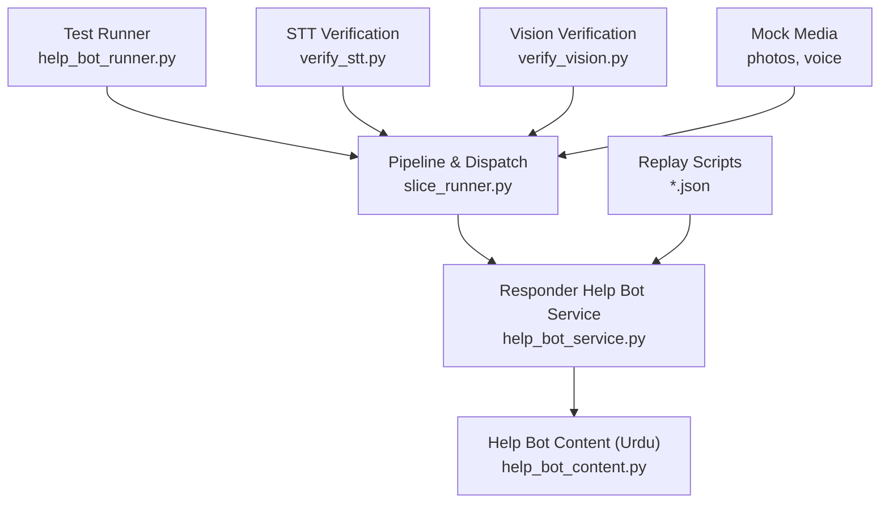
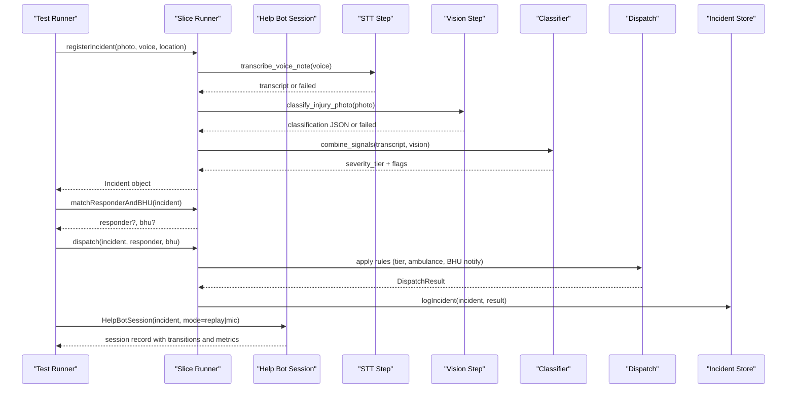
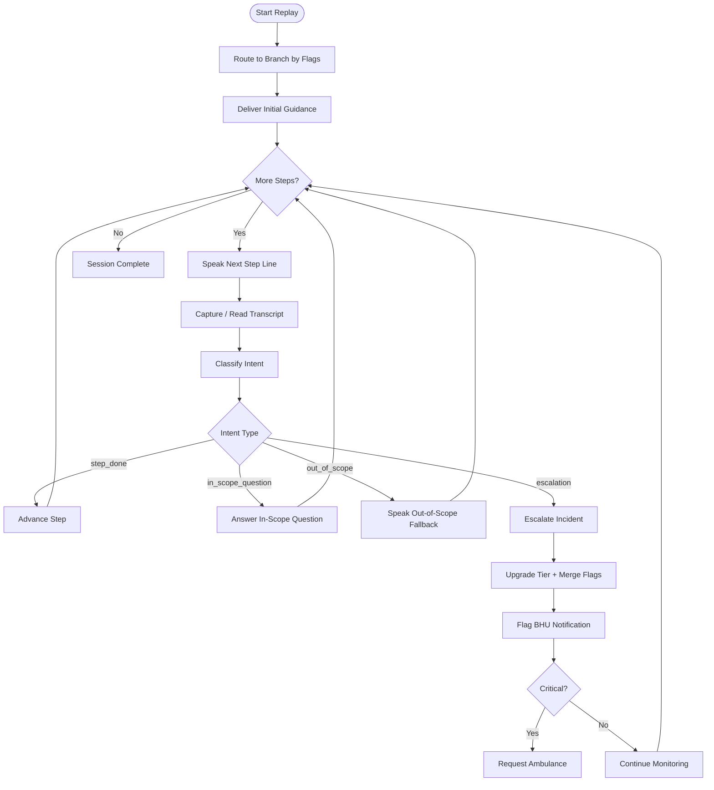
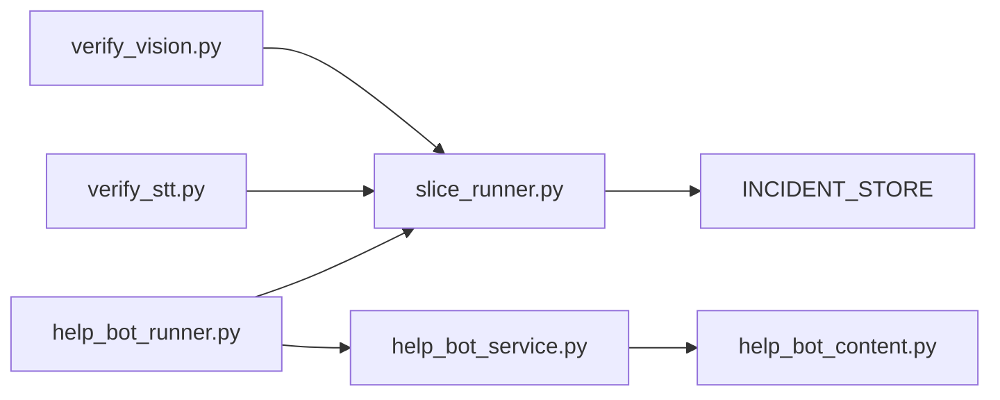

# Test Suite and Validation Framework

<cite>
**Referenced Files in This Document**
- [slice_runner.py](file://backend/slice_runner.py)
- [help_bot_runner.py](file://backend/help_bot_runner.py)
- [help_bot_service.py](file://backend/services/help_bot_service.py)
- [help_bot_content.py](file://backend/services/help_bot_content.py)
- [verify_stt.py](file://backend/verify_stt.py)
- [verify_vision.py](file://backend/verify_vision.py)
- [heavy_bleeding.json](file://mockdata/helpbot/scripts/heavy_bleeding.json)
- [fracture_crush.json](file://mockdata/helpbot/scripts/fracture_crush.json)
- [snakebite.json](file://mockdata/helpbot/scripts/snakebite.json)
</cite>

## Table of Contents
1. [Introduction](#introduction)
2. [Project Structure](#project-structure)
3. [Core Components](#core-components)
4. [Architecture Overview](#architecture-overview)
5. [Detailed Component Analysis](#detailed-component-analysis)
6. [Dependency Analysis](#dependency-analysis)
7. [Performance Considerations](#performance-considerations)
8. [Troubleshooting Guide](#troubleshooting-guide)
9. [Conclusion](#conclusion)
10. [Appendices](#appendices)

## Introduction
This document explains the comprehensive test suite that validates the triage pipeline end-to-end, from incident registration through AI triage, responder matching, dispatch, and escalation to Basic Health Units (BHU). It focuses on four main scenarios:
- Real media processing with a machine hand injury
- Village exhaustion when all responders are busy
- Critical simultaneous dispatch for venomous snakebite cases
- Fail-safe path testing with missing or unusable media

It also documents how to add new scenarios, run the tests, interpret outputs, and debug issues using structured logging and verification mechanisms built into the framework.

## Project Structure
The validation framework is implemented primarily in the backend module slice runner and the help bot runner, with supporting verification utilities for STT and vision steps. The mock data includes voice notes, photos, and replay scripts used by deterministic test runs.

**Diagram sources**
- [help_bot_runner.py:175-236](file://backend/help_bot_runner.py#L175-L236)
- [slice_runner.py:589-672](file://backend/slice_runner.py#L589-L672)
- [help_bot_service.py:663-783](file://backend/services/help_bot_service.py#L663-L783)
- [help_bot_content.py:21-255](file://backend/services/help_bot_content.py#L21-L255)
- [verify_stt.py:22-52](file://backend/verify_stt.py#L22-L52)
- [verify_vision.py:22-49](file://backend/verify_vision.py#L22-L49)

**Section sources**
- [help_bot_runner.py:175-236](file://backend/help_bot_runner.py#L175-L236)
- [slice_runner.py:589-672](file://backend/slice_runner.py#L589-L672)
- [verify_stt.py:22-52](file://backend/verify_stt.py#L22-L52)
- [verify_vision.py:22-49](file://backend/verify_vision.py#L22-L49)

## Core Components
- Triage pipeline entry point: registers incidents, performs STT, vision classification, and classifier combination; caches results; falls back to moderate tier with low-confidence flag on failures.
- Matching and dispatch: selects an available responder in the same village; notifies linked BHU; requests ambulance for critical severity; logs outcomes.
- Responder help bot session: routes to knowledge branches based on flags; plays scripted Urdu guidance via TTS; captures and classifies responder intent; escalates incidents mid-session.
- Verification utilities: standalone checks for STT accuracy and vision classification quality against real media.

Key responsibilities and interactions are exercised by the test suite to validate correctness across normal and edge-case conditions.

**Section sources**
- [slice_runner.py:314-586](file://backend/slice_runner.py#L314-L586)
- [slice_runner.py:612-672](file://backend/slice_runner.py#L612-L672)
- [help_bot_service.py:94-117](file://backend/services/help_bot_service.py#L94-L117)
- [help_bot_service.py:663-783](file://backend/services/help_bot_service.py#L663-L783)
- [verify_stt.py:22-52](file://backend/verify_stt.py#L22-L52)
- [verify_vision.py:22-49](file://backend/verify_vision.py#L22-L49)

## Architecture Overview
The test suite drives the full pipeline through two primary paths:
- End-to-end vertical slice tests that register incidents with real media, match responders, dispatch, and log outcomes.
- Deterministic replay sessions that exercise the help bot’s state machine using scripted turns.

**Diagram sources**
- [slice_runner.py:589-672](file://backend/slice_runner.py#L589-L672)
- [help_bot_runner.py:205-236](file://backend/help_bot_runner.py#L205-L236)
- [help_bot_service.py:663-783](file://backend/services/help_bot_service.py#L663-L783)

## Detailed Component Analysis

### Scenario 1: Real Media Processing — Machine Hand Injury
- Purpose: Validate end-to-end flow with real photo and Urdu voice note; confirm correct triage tier and flags; ensure responder matching and dispatch work as expected.
- Inputs: Photo and voice note under mockdata/media; GPS location set to VILLAGE-A.
- Expected behavior:
  - STT produces usable transcript.
  - Vision model classifies injury signals.
  - Classifier combines inputs to produce severity tier and flags.
  - Matching selects an available responder in VILLAGE-A; if multiple, first available is chosen.
  - Dispatch marks responder busy; notifies linked BHU; requests ambulance only if critical.
  - Logging records incident and dispatch status.

Validation points:
- Check triage output tier and flags.
- Confirm responder assignment and availability mutation to busy.
- Verify BHU notification timestamp and ambulance request flag.
- Inspect logged incident record for completeness.

**Section sources**
- [slice_runner.py:679-737](file://backend/slice_runner.py#L679-L737)
- [slice_runner.py:589-672](file://backend/slice_runner.py#L589-L672)

### Scenario 2: Village Exhaustion — All Responders Busy
- Purpose: Validate escalation path when no responders are available in the village.
- Inputs: Same village (VILLAGE-A), consecutive incident after previous assignment sets responders busy.
- Expected behavior:
  - Matching finds no available responder in the village.
  - Dispatch escalates to BHU-only or reports no responders available depending on linked BHU presence.
  - BHU is notified per tier rules; ambulance requested only if critical.
  - Logging reflects escalation status.

Validation points:
- Ensure no responder assigned.
- Confirm BHU notification and status indicates escalation.
- Verify ambulance request aligns with severity tier.

**Section sources**
- [slice_runner.py:612-672](file://backend/slice_runner.py#L612-L672)
- [slice_runner.py:679-737](file://backend/slice_runner.py#L679-L737)

### Scenario 3: Critical Simultaneous Dispatch — Venomous Snakebite
- Purpose: Validate critical-tier handling with immediate ambulance request and BHU notification.
- Inputs: Photo and voice note for snakebite scenario; GPS location set to VILLAGE-C.
- Expected behavior:
  - Triage yields critical tier with appropriate flags.
  - Matching selects available responder in VILLAGE-C.
  - Dispatch assigns responder, notifies BHU, and requests ambulance immediately.
  - Logging records critical dispatch with ambulance flag.

Validation points:
- Confirm severity tier is critical.
- Verify responder assignment and BHU notification timestamps.
- Ensure ambulance_requested is true.

**Section sources**
- [slice_runner.py:679-737](file://backend/slice_runner.py#L679-L737)
- [slice_runner.py:612-672](file://backend/slice_runner.py#L612-L672)

### Scenario 4: Fail-Safe Path — Missing/Unusable Media
- Purpose: Validate robust fallback when both photo and voice note are missing or unusable.
- Inputs: Nonexistent photo and voice file paths; GPS location set to VILLAGE-B.
- Expected behavior:
  - STT returns failed or empty; vision returns failed or unusable.
  - Classifier cannot produce valid tier; pipeline defaults to moderate tier with low_confidence_triage flag.
  - Matching may find no available responder in VILLAGE-B; dispatch escalates to BHU-only or reports no responders available.
  - Logging records fail-safe outcome.

Validation points:
- Confirm tier defaulted to moderate and low_confidence_triage flag present.
- Verify no responder assigned if none available.
- Ensure BHU notification occurs per tier rules.

**Section sources**
- [slice_runner.py:519-586](file://backend/slice_runner.py#L519-L586)
- [slice_runner.py:679-737](file://backend/slice_runner.py#L679-L737)

### Help Bot Replay and Escalation Flow
Deterministic replay scripts drive the help bot through scripted turns, validating:
- Branch routing based on flags.
- Scripted Urdu guidance playback via TTS cache.
- Intent classification for step completion, in-scope questions, out-of-scope questions, and escalation triggers.
- Escalation hook updates severity tier, merges flags, flags BHU notification, and requests ambulance when needed.

**Diagram sources**
- [help_bot_service.py:663-783](file://backend/services/help_bot_service.py#L663-L783)
- [help_bot_service.py:576-647](file://backend/services/help_bot_service.py#L576-L647)
- [help_bot_content.py:21-255](file://backend/services/help_bot_content.py#L21-L255)

**Section sources**
- [help_bot_runner.py:219-236](file://backend/help_bot_runner.py#L219-L236)
- [help_bot_service.py:663-783](file://backend/services/help_bot_service.py#L663-L783)
- [help_bot_service.py:576-647](file://backend/services/help_bot_service.py#L576-L647)
- [heavy_bleeding.json:1-11](file://mockdata/helpbot/scripts/heavy_bleeding.json#L1-L11)
- [fracture_crush.json:1-11](file://mockdata/helpbot/scripts/fracture_crush.json#L1-L11)
- [snakebite.json:1-11](file://mockdata/helpbot/scripts/snakebite.json#L1-L11)

## Dependency Analysis
The test suite depends on:
- slice_runner for triage, matching, dispatch, and logging.
- help_bot_runner for orchestrating simulation, replay, and TTS prewarming.
- help_bot_service for conversation engine, intent detection, TTS, and escalation.
- verify_stt and verify_vision for isolated component verification.
- Mock data for deterministic inputs and replay scripts.

**Diagram sources**
- [help_bot_runner.py:175-236](file://backend/help_bot_runner.py#L175-L236)
- [slice_runner.py:589-672](file://backend/slice_runner.py#L589-L672)
- [help_bot_service.py:663-783](file://backend/services/help_bot_service.py#L663-L783)
- [verify_stt.py:22-52](file://backend/verify_stt.py#L22-L52)
- [verify_vision.py:22-49](file://backend/verify_vision.py#L22-L49)

**Section sources**
- [help_bot_runner.py:175-236](file://backend/help_bot_runner.py#L175-L236)
- [slice_runner.py:589-672](file://backend/slice_runner.py#L589-L672)
- [help_bot_service.py:663-783](file://backend/services/help_bot_service.py#L663-L783)
- [verify_stt.py:22-52](file://backend/verify_stt.py#L22-L52)
- [verify_vision.py:22-49](file://backend/verify_vision.py#L22-L49)

## Performance Considerations
- Triage caching: Repeated runs with identical media reuse cached results to avoid quota consumption and reduce latency.
- Quota retries: AI calls retry on rate-limit errors with exponential backoff to keep demos functional.
- TTS prewarming: Pre-rendering all scripted lines ensures deterministic replay without burning live quota.
- Timeouts: Configurable per-call timeouts prevent blocking during network or API delays.

Recommendations:
- Use prewarm-tts before replay runs to guarantee deterministic behavior.
- Monitor triage cache hits to optimize repeated testing.
- Adjust TRIAGE_CALL_TIMEOUT_S and TRIAGE_QUOTA_RETRIES for environment stability.

[No sources needed since this section provides general guidance]

## Troubleshooting Guide
Common issues and debugging steps:
- STT failures:
  - Run verify_stt.py to check transcription quality and latency for each audio clip.
  - Inspect TRIAGE_WARN logs for provider-specific errors.
  - Ensure audio files exist and are readable.

- Vision failures:
  - Run verify_vision.py to inspect classification outputs and latency.
  - Check for non-JSON responses and parsing errors.
  - Confirm image files are accessible and supported formats.

- Pipeline failures:
  - Review triage_signals in incident records to identify which step failed.
  - Confirm fallback to moderate tier with low_confidence_triage when inputs are unusable.
  - Validate environment variables for API keys and endpoints.

- Help bot issues:
  - Use replay mode with scripts to isolate intent classification and branching logic.
  - Check TTS cache and manifest for rendered lines and provenance.
  - Inspect help_bot_transitions for state changes and escalation events.

Operational commands:
- Run vertical slice tests: execute the test suite function in slice_runner.
- Run STT verification: execute verify_stt.py.
- Run vision verification: execute verify_vision.py.
- Prewarm TTS: use help_bot_runner with --prewarm-tts.
- Verify spoken Urdu round-trip: use help_bot_runner with --verify-tts.

**Section sources**
- [verify_stt.py:22-52](file://backend/verify_stt.py#L22-L52)
- [verify_vision.py:22-49](file://backend/verify_vision.py#L22-L49)
- [help_bot_runner.py:102-172](file://backend/help_bot_runner.py#L102-L172)
- [help_bot_runner.py:175-236](file://backend/help_bot_runner.py#L175-L236)
- [slice_runner.py:519-586](file://backend/slice_runner.py#L519-L586)

## Conclusion
The test suite comprehensively validates the triage pipeline across realistic and edge-case scenarios. It exercises registration, AI triage, responder matching, dispatch, and escalation while ensuring robust fallbacks and deterministic replay capabilities. By leveraging structured logging, verification utilities, and TTS caching, teams can confidently add new scenarios, run tests, interpret outputs, and debug issues efficiently.

[No sources needed since this section summarizes without analyzing specific files]

## Appendices

### How to Add New Test Scenarios
- Define a new scenario in the test suite list within slice_runner with title, description, media paths, and GPS location.
- Ensure media files exist and are accessible.
- Validate expected triage tier and flags by running the suite and inspecting logs.
- For help bot scenarios, create a new replay script under mockdata/helpbot/scripts with turns and expected intents.

**Section sources**
- [slice_runner.py:679-737](file://backend/slice_runner.py#L679-L737)
- [heavy_bleeding.json:1-11](file://mockdata/helpbot/scripts/heavy_bleeding.json#L1-L11)
- [fracture_crush.json:1-11](file://mockdata/helpbot/scripts/fracture_crush.json#L1-L11)
- [snakebite.json:1-11](file://mockdata/helpbot/scripts/snakebite.json#L1-L11)

### Running the Test Suite
- Execute the vertical slice tests via the slice_runner entry point.
- Run STT and vision verification utilities independently.
- Use help_bot_runner modes: simulate, from-pipeline, replay, mic, prewarm-tts, verify-tts.

**Section sources**
- [slice_runner.py:740-745](file://backend/slice_runner.py#L740-L745)
- [verify_stt.py:22-52](file://backend/verify_stt.py#L22-L52)
- [verify_vision.py:22-49](file://backend/verify_vision.py#L22-L49)
- [help_bot_runner.py:175-236](file://backend/help_bot_runner.py#L175-L236)

### Interpreting Test Output
- Look for structured logs prefixed with tags like TRIAGE, DISPATCH, HELPBOT, ESCALATION.
- Inspect incident records in INCIDENT_STORE for triage signals, dispatch status, and help_bot_transitions.
- Use replay summaries to assess expectations, latency averages, final tiers, and escalation counts.

**Section sources**
- [slice_runner.py:665-672](file://backend/slice_runner.py#L665-L672)
- [help_bot_runner.py:230-236](file://backend/help_bot_runner.py#L230-L236)
- [help_bot_service.py:696-711](file://backend/services/help_bot_service.py#L696-L711)

### Debugging Pipeline Issues
- Enable detailed logging by reviewing print statements in slice_runner and help_bot_service.
- Check TTS cache and manifest for rendered lines and provenance.
- Validate environment configuration for API keys and endpoints.
- Use replay mode to isolate intent classification and branching logic without hardware dependencies.

**Section sources**
- [help_bot_service.py:82-88](file://backend/services/help_bot_service.py#L82-L88)
- [help_bot_service.py:350-387](file://backend/services/help_bot_service.py#L350-L387)
- [slice_runner.py:27-59](file://backend/slice_runner.py#L27-L59)