# Triage Pipeline Orchestration

<cite>
**Referenced Files in This Document**
- [slice_runner.py](file://backend/slice_runner.py)
- [help_bot_runner.py](file://backend/help_bot_runner.py)
- [help_bot_service.py](file://backend/services/help_bot_service.py)
- [help_bot_content.py](file://backend/services/help_bot_content.py)
- [verify_stt.py](file://backend/verify_stt.py)
- [verify_vision.py](file://backend/verify_vision.py)
- [0a494362c7b0d139.json](file://mockdata/media/.triage_cache/0a494362c7b0d139.json)
- [9b9fcb4f441ca8a6.json](file://mockdata/media/.triage_cache/9b9fcb4f441ca8a6.json)
- [fb85fe0a20b5d729.json](file://mockdata/media/.triage_cache/fb85fe0a20b5d729.json)
</cite>

## Table of Contents
1. Introduction
2. Project Structure
3. Core Components
4. Architecture Overview
5. Detailed Component Analysis
6. Dependency Analysis
7. Performance Considerations
8. Troubleshooting Guide
9. Conclusion

## Introduction
This document explains the triage pipeline orchestration system that processes emergency reports from multi-modal inputs (voice and photo) through speech-to-text transcription, computer vision injury classification, and a signal-combining classifier to produce severity tiers and dispatch decisions. It focuses on the main entry point getTriageResultMOCK, its caching and fail-safe behavior, confidence scoring, partial failure handling, and the test suite that validates end-to-end behavior including edge cases with missing or unusable media.

## Project Structure
The backend implements:
- A provider-agnostic triage pipeline with STT, vision, and classifier steps
- Caching for triage results and TTS audio
- A help bot session engine that routes responders into scripted guidance branches
- Verification scripts for STT and vision accuracy
- Seed data and incident matching/dispatch logic

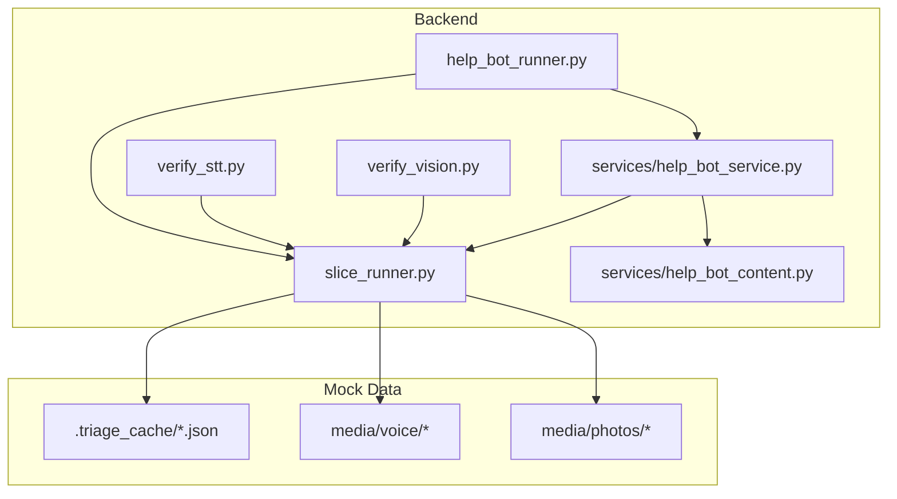

**Diagram sources**
- [slice_runner.py:284-586](file://backend/slice_runner.py#L284-L586)
- [help_bot_runner.py:175-236](file://backend/help_bot_runner.py#L175-L236)
- [help_bot_service.py:663-800](file://backend/services/help_bot_service.py#L663-L800)
- [help_bot_content.py:21-255](file://backend/services/help_bot_content.py#L21-L255)
- [verify_stt.py:22-52](file://backend/verify_stt.py#L22-L52)
- [verify_vision.py:22-49](file://backend/verify_vision.py#L22-L49)

**Section sources**
- [slice_runner.py:1-155](file://backend/slice_runner.py#L1-L155)
- [help_bot_runner.py:1-100](file://backend/help_bot_runner.py#L1-L100)

## Core Components
- Provider selection and retry: selects Gemini or DashScope via environment; retries on quota errors with backoff; enforces per-call timeouts.
- STT step: transcribes voice notes to Urdu text; returns usable flag; fails gracefully when files are missing or API calls error.
- Vision step: classifies injuries from photos; returns severity, confidence, visible signals, and image usability.
- Classifier step: combines transcript and vision JSON into a final severity tier and injury flags with safety rules.
- Caching: persists successful triage results keyed by photo_ref and voice_note_transcript; avoids re-running AI calls.
- Fail-safe: if any stage fails or produces invalid output, defaults to moderate severity with low_confidence_triage flag.
- Incident registration and dispatch: registers incidents, matches responders/BHUs, sets ambulance requests for critical cases, and logs outcomes.

**Section sources**
- [slice_runner.py:55-95](file://backend/slice_runner.py#L55-L95)
- [slice_runner.py:97-130](file://backend/slice_runner.py#L97-L130)
- [slice_runner.py:367-426](file://backend/slice_runner.py#L367-L426)
- [slice_runner.py:428-475](file://backend/slice_runner.py#L428-L475)
- [slice_runner.py:477-517](file://backend/slice_runner.py#L477-L517)
- [slice_runner.py:519-586](file://backend/slice_runner.py#L519-L586)
- [slice_runner.py:589-672](file://backend/slice_runner.py#L589-L672)

## Architecture Overview
The pipeline is a three-stage flow with robust error handling and caching:

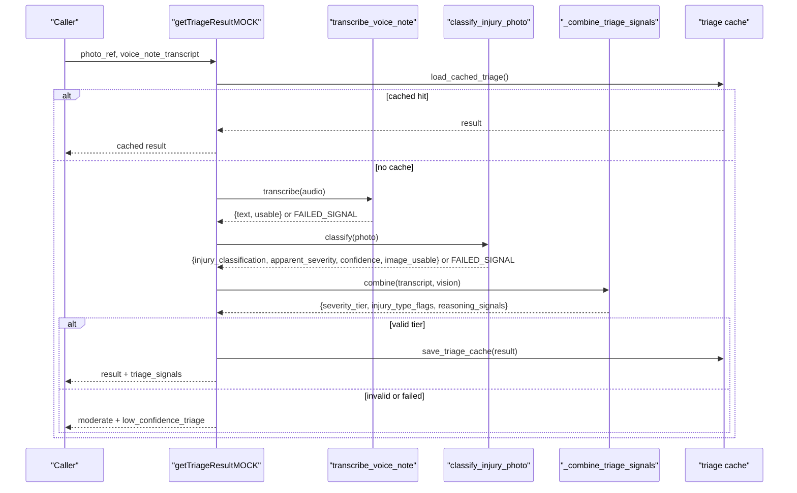

**Diagram sources**
- [slice_runner.py:519-586](file://backend/slice_runner.py#L519-L586)
- [slice_runner.py:367-426](file://backend/slice_runner.py#L367-L426)
- [slice_runner.py:428-475](file://backend/slice_runner.py#L428-L475)
- [slice_runner.py:477-517](file://backend/slice_runner.py#L477-L517)
- [slice_runner.py:97-130](file://backend/slice_runner.py#L97-L130)

## Detailed Component Analysis

### Main Entry Point: getTriageResultMOCK
- Purpose: Orchestrates STT, vision, and classifier steps; caches results; applies fail-safe defaults.
- Inputs: photo_ref (path or URL), voice_note_transcript (path to audio file).
- Outputs: severity_tier, injury_type_flags, voice_transcript, triage_signals.
- Behavior:
  - Checks provider availability and loads cached result if available.
  - Runs STT; records status and detail.
  - Runs vision; checks image_usable and status.
  - Combines signals; validates tier; augments flags with low_confidence_triage if inputs were degraded.
  - Saves non-fail-safe results to cache.
  - On any failure path, returns moderate severity with low_confidence_triage.

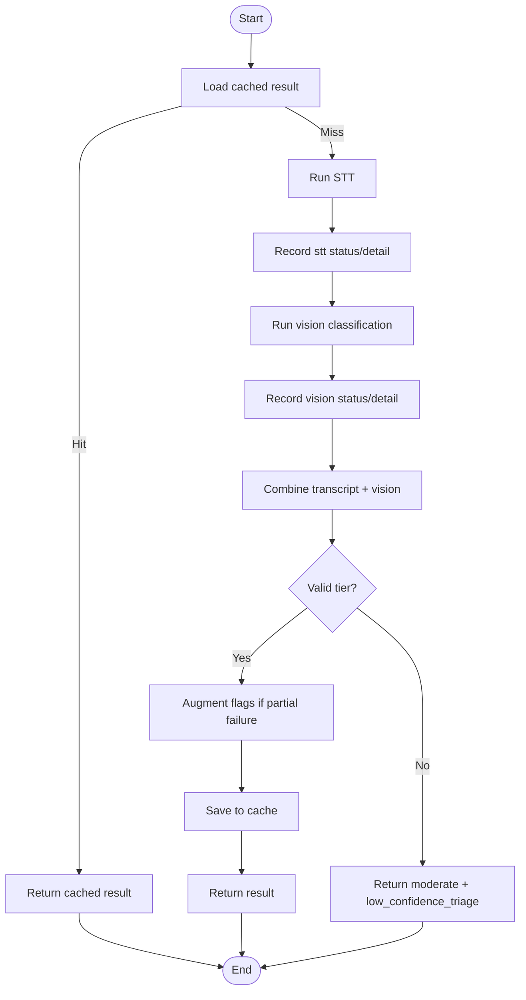

**Diagram sources**
- [slice_runner.py:519-586](file://backend/slice_runner.py#L519-L586)

**Section sources**
- [slice_runner.py:519-586](file://backend/slice_runner.py#L519-L586)

### Speech-to-Text Transcription
- Providers: gemini_transcribe_voice or dashscope_transcribe_voice based on TRIAGE_AI_PROVIDER.
- Error handling: returns FAILED_SIGNAL on missing files or exceptions; wrapper ensures safe downstream behavior.
- Output: text and usable flag; empty or failed transcripts treated as missing input.

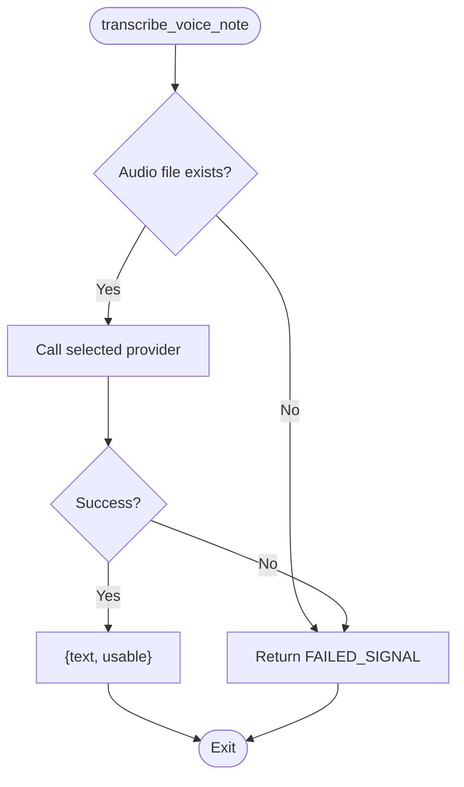

**Diagram sources**
- [slice_runner.py:367-426](file://backend/slice_runner.py#L367-L426)

**Section sources**
- [slice_runner.py:367-426](file://backend/slice_runner.py#L367-L426)

### Vision Injury Classification
- Providers: gemini_classify_injury or dashscope_classify_injury.
- Input: local file path or HTTP(S) URI.
- Output: injury_classification, apparent_severity, confidence, visible_signals, image_usable.
- Error handling: returns FAILED_SIGNAL on API errors or non-JSON responses.

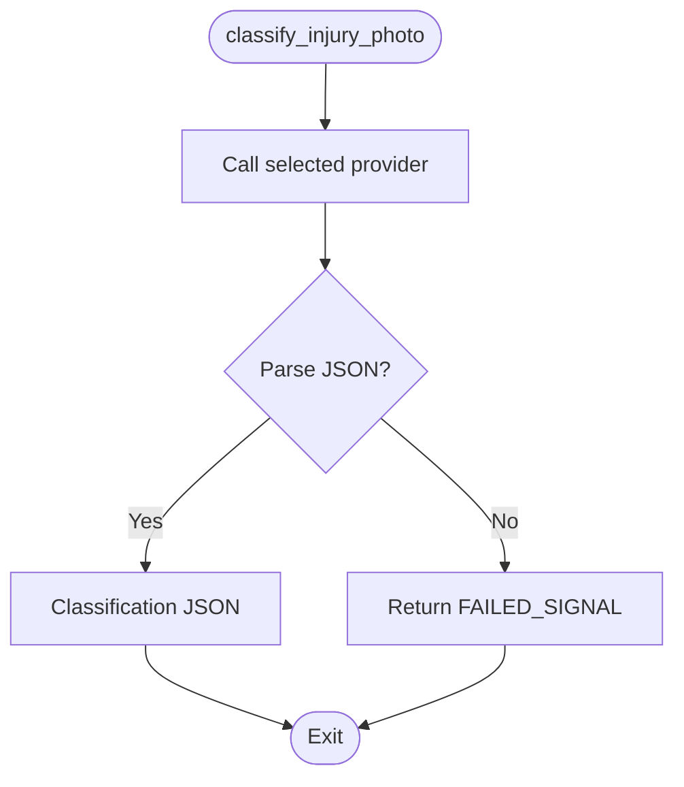

**Diagram sources**
- [slice_runner.py:428-475](file://backend/slice_runner.py#L428-L475)

**Section sources**
- [slice_runner.py:428-475](file://backend/slice_runner.py#L428-L475)

### Signal Combination and Severity Determination
- Inputs: transcript string and vision JSON.
- Rules:
  - Critical if life-threatening signs present in either source.
  - Safety rule: when transcript and vision disagree, adopt the more severe tier.
  - If both inputs are missing/unclear, default to moderate.
- Output: severity_tier, injury_type_flags, reasoning_signals.
- Partial failures: if transcript or vision is missing/unusable, add low_confidence_triage flag.

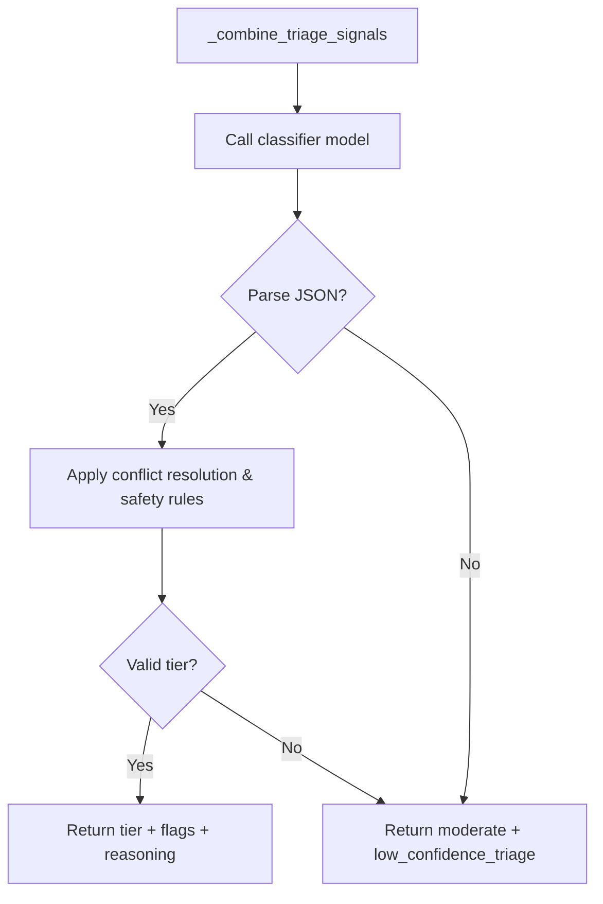

**Diagram sources**
- [slice_runner.py:477-517](file://backend/slice_runner.py#L477-L517)

**Section sources**
- [slice_runner.py:477-517](file://backend/slice_runner.py#L477-L517)

### Caching and Fail-Safe Mechanisms
- Cache key: SHA-based hash of photo_ref and voice_note_transcript.
- Cache policy: only saves genuine AI-derived results; never caches fail-safe fallbacks to avoid poisoning cache during quota blips.
- Fail-safe: if classifier fails or returns invalid tier, returns moderate severity with low_confidence_triage flag; pipeline continues without blocking dispatch.

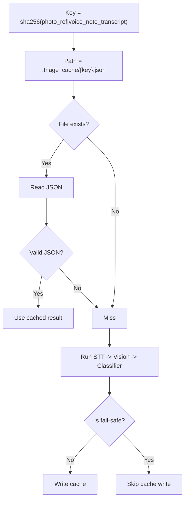

**Diagram sources**
- [slice_runner.py:97-130](file://backend/slice_runner.py#L97-L130)
- [slice_runner.py:519-586](file://backend/slice_runner.py#L519-L586)

**Section sources**
- [slice_runner.py:97-130](file://backend/slice_runner.py#L97-L130)
- [slice_runner.py:519-586](file://backend/slice_runner.py#L519-L586)

### Confidence Scoring and Partial Failure Handling
- Vision confidence: returned as a number between 0.0 and 1.0; used alongside image_usable to assess reliability.
- Partial failure: if transcript is empty or vision is unusable, the pipeline still produces a tier but adds low_confidence_triage to flags to indicate reduced reliability.
- Safety rule: voice-reported danger signals (e.g., venomous bite, unconsciousness, uncontrolled bleeding) are never downgraded by vision findings.

**Section sources**
- [slice_runner.py:316-346](file://backend/slice_runner.py#L316-L346)
- [slice_runner.py:557-586](file://backend/slice_runner.py#L557-L586)

### Dispatch Decisions and Escalation
- Matching: selects responder by village and availability; links BHU by village mapping.
- Dispatch:
  - Assigns responder if available; marks busy to prevent double assignment.
  - Notifies BHU for moderate/critical tiers.
  - Requests ambulance immediately for critical tier.
- Logging: stores incident and dispatch status for inspection.

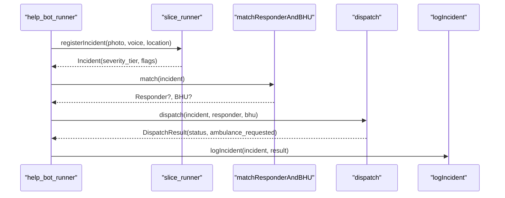

**Diagram sources**
- [help_bot_runner.py:64-99](file://backend/help_bot_runner.py#L64-L99)
- [slice_runner.py:589-672](file://backend/slice_runner.py#L589-L672)

**Section sources**
- [help_bot_runner.py:64-99](file://backend/help_bot_runner.py#L64-L99)
- [slice_runner.py:612-672](file://backend/slice_runner.py#L612-L672)

### Help Bot Integration and Branch Routing
- Branch routing maps incident injury_type_flags to predefined knowledge branches (heavy_bleeding, fracture_crush, snakebite).
- Session lifecycle: initial guidance, step-by-step instructions, escalation hooks, and completion messages.
- Content: all spoken lines are hardcoded in help_bot_content.py; AI is used only for STT and intent detection.

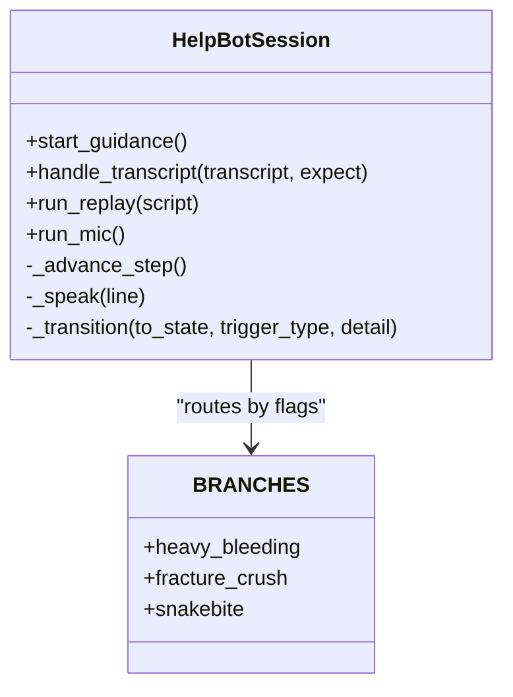

**Diagram sources**
- [help_bot_service.py:663-800](file://backend/services/help_bot_service.py#L663-L800)
- [help_bot_content.py:46-255](file://backend/services/help_bot_content.py#L46-L255)

**Section sources**
- [help_bot_service.py:663-800](file://backend/services/help_bot_service.py#L663-L800)
- [help_bot_content.py:46-255](file://backend/services/help_bot_content.py#L46-L255)

### Test Suite Structure and Scenarios
- End-to-end scenarios run real media through the live AI pipeline:
  - Real media with fallback matching (machine hand injury)
  - Village exhaustion (crushed leg, consecutive incidents)
  - Critical simultaneous dispatch (venomous snakebite)
  - Edge case: missing/unusable media triggers fail-safe path
- Verification scripts:
  - verify_stt.py: runs STT on all voice clips, compares with ground truth sidecars, measures latency.
  - verify_vision.py: runs vision classification on all photos, prints classification details and latency.

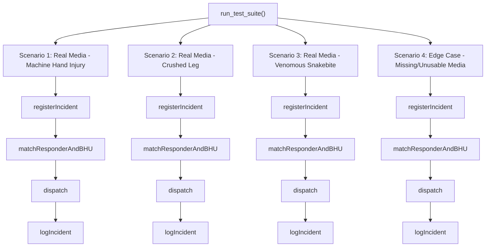

**Diagram sources**
- [slice_runner.py:679-737](file://backend/slice_runner.py#L679-L737)

**Section sources**
- [slice_runner.py:679-737](file://backend/slice_runner.py#L679-L737)
- [verify_stt.py:22-52](file://backend/verify_stt.py#L22-L52)
- [verify_vision.py:22-49](file://backend/verify_vision.py#L22-L49)

## Dependency Analysis
- slice_runner.py centralizes provider selection, STT, vision, classifier, caching, incident registration, matching, dispatch, and logging.
- help_bot_runner.py orchestrates Module 2 flows, optionally running Module 1 triage first, then launching help bot sessions.
- help_bot_service.py provides conversation state machine, STT/intent/TTS boundaries, and escalation hooks.
- help_bot_content.py defines hardcoded Urdu guidance content and branch structures.
- verify_stt.py and verify_vision.py depend on slice_runner to exercise individual pipeline stages.

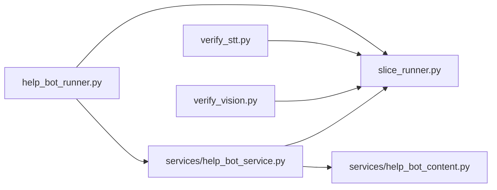

**Diagram sources**
- [help_bot_runner.py:175-236](file://backend/help_bot_runner.py#L175-L236)
- [help_bot_service.py:663-800](file://backend/services/help_bot_service.py#L663-L800)
- [verify_stt.py:22-52](file://backend/verify_stt.py#L22-L52)
- [verify_vision.py:22-49](file://backend/verify_vision.py#L22-L49)

**Section sources**
- [help_bot_runner.py:175-236](file://backend/help_bot_runner.py#L175-L236)
- [help_bot_service.py:663-800](file://backend/services/help_bot_service.py#L663-L800)
- [verify_stt.py:22-52](file://backend/verify_stt.py#L22-L52)
- [verify_vision.py:22-49](file://backend/verify_vision.py#L22-L49)

## Performance Considerations
- Per-call timeout: configurable via TRIAGE_CALL_TIMEOUT_S to prevent blocking on slow AI calls.
- Quota retries: bounded retries with exponential backoff for 429/RESOURCE_EXHAUSTED errors.
- Caching: reduces repeated AI calls for identical media pairs; prewarming TTS cache eliminates quota usage during replay runs.
- Latency measurement: verification scripts measure STT and vision latency; help bot tracks first playback delay.

[No sources needed since this section provides general guidance]

## Troubleshooting Guide
- STT failures: check audio file existence and provider availability; verify_stt.py helps isolate issues.
- Vision failures: ensure image format support and network access; verify_vision.py prints classification details and latency.
- Classifier failures: inspect triage_signals for non-JSON outputs; pipeline falls back to moderate severity.
- Cache issues: confirm .triage_cache directory permissions and JSON validity; cache excludes fail-safe results.
- Help bot audio: prewarm TTS cache to avoid quota limits; use replay mode for deterministic testing.

**Section sources**
- [verify_stt.py:22-52](file://backend/verify_stt.py#L22-L52)
- [verify_vision.py:22-49](file://backend/verify_vision.py#L22-L49)
- [slice_runner.py:97-130](file://backend/slice_runner.py#L97-L130)
- [help_bot_runner.py:102-133](file://backend/help_bot_runner.py#L102-L133)

## Conclusion
The triage pipeline orchestrates multi-modal emergency reporting with robust error handling, caching, and fail-safe defaults to ensure reliable dispatch decisions. The getTriageResultMOCK function serves as the main entry point, coordinating STT, vision, and classifier steps while preserving system reliability under partial failures. The test suite and verification scripts validate behavior across realistic and edge-case scenarios, ensuring consistent performance and safety.

[No sources needed since this section summarizes without analyzing specific files]