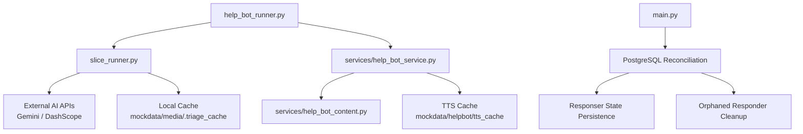
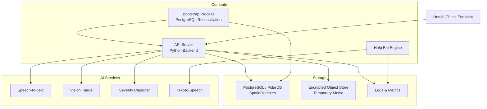
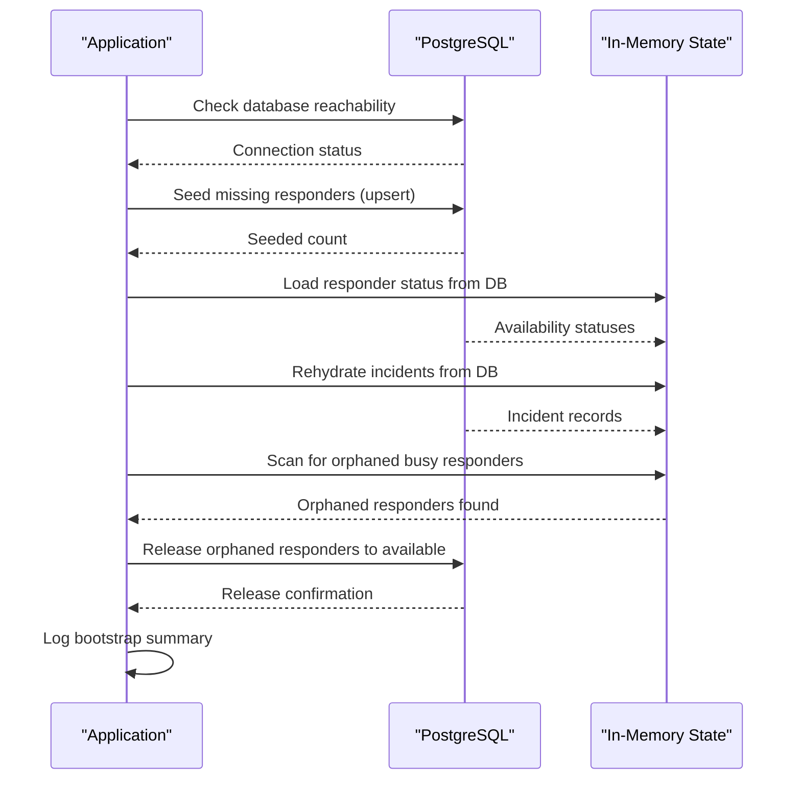
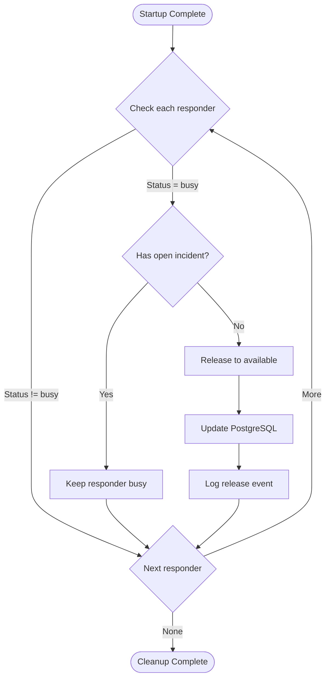
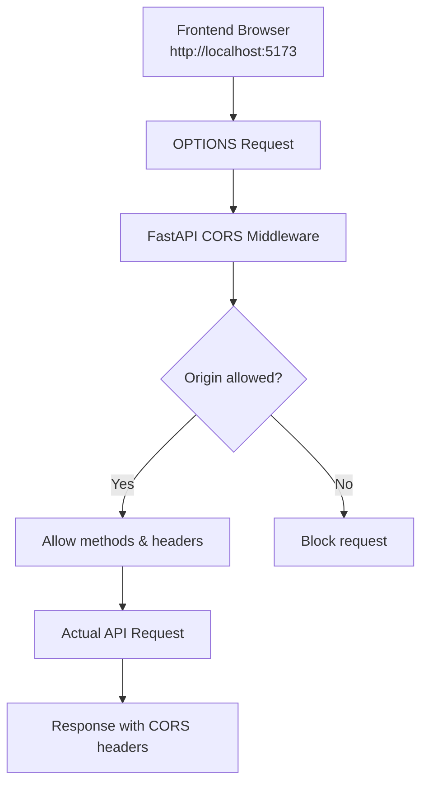
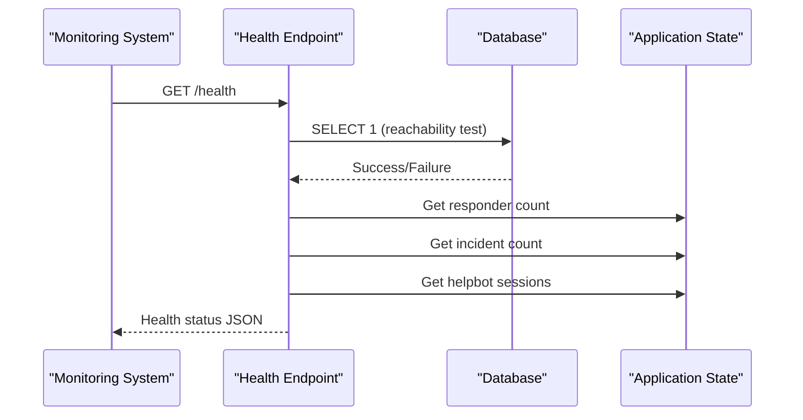
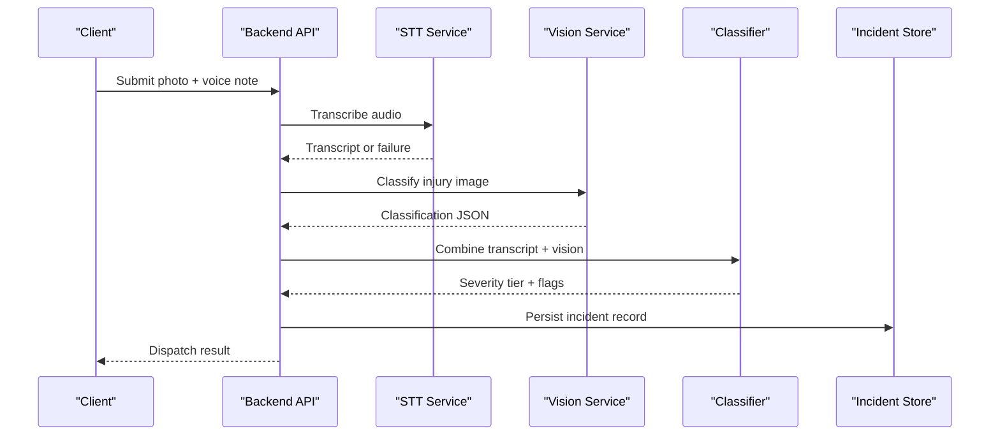
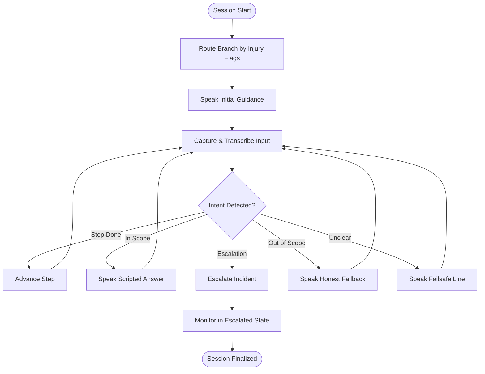
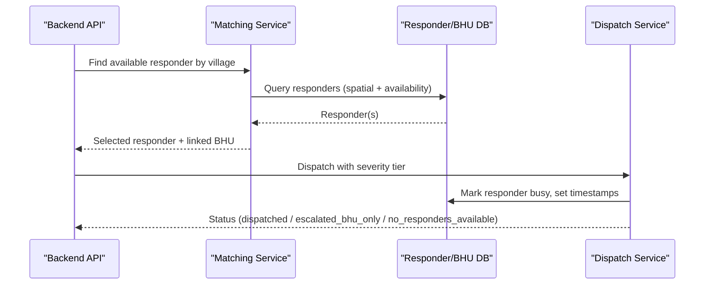
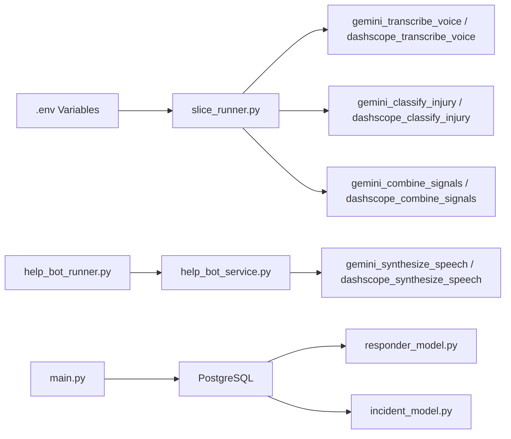

# Deployment & Operations

<cite>
**Referenced Files in This Document**
- [PROJECT.md](file://PROJECT.md)
- [village-emergency-response-system-spec.md](file://village-emergency-response-system-spec.md)
- [backend/requirements.txt](file://backend/requirements.txt)
- [backend/slice_runner.py](file://backend/slice_runner.py)
- [backend/help_bot_runner.py](file://backend/help_bot_runner.py)
- [backend/services/help_bot_service.py](file://backend/services/help_bot_service.py)
- [backend/services/help_bot_content.py](file://backend/services/help_bot_content.py)
- [backend/main.py](file://backend/main.py)
- [backend/database.py](file://backend/database.py)
- [backend/models/responder_model.py](file://backend/models/responder_model.py)
- [backend/models/incident_model.py](file://backend/models/incident_model.py)
- [backend/services/incident_lifecycle_service.py](file://backend/services/incident_lifecycle_service.py)
- [frontend/cors-check.mjs](file://frontend/cors-check.mjs)
</cite>

## Update Summary
**Changes Made**
- Added comprehensive PostgreSQL reconciliation and state persistence section
- Updated deployment topology to include health check endpoints and CORS configuration
- Enhanced operational procedures with orphaned responder cleanup processes
- Added new monitoring strategies for bootstrap state and database connectivity
- Updated troubleshooting guide with PostgreSQL reconciliation issues

## Table of Contents
1. Introduction
2. Project Structure
3. Core Components
4. Architecture Overview
5. Detailed Component Analysis
6. Dependency Analysis
7. Performance Considerations
8. Troubleshooting Guide
9. Conclusion
10. Appendices

## Introduction
This document provides production-oriented deployment and operations guidance for the LifeLine Ride system. It focuses on infrastructure requirements, database setup with spatial lookup support, encrypted temporary media storage, deployment topology options, scaling for concurrent emergency requests, monitoring strategies, log management, backup and recovery, disaster recovery planning, security (API keys, encryption at rest/in transit, access control), troubleshooting, performance tuning, and maintenance procedures.

The system is designed as a Python-based backend that integrates AI services for speech-to-text, vision triage, and text-to-speech, with a responder help bot that guides first responders via Urdu voice. The project spec defines modules for registration and triage, matching/dispatch, escalation, logging, and follow-up notifications.

**Updated** The system now includes enhanced PostgreSQL reconciliation during startup, ensuring responder state persistence across process restarts and automatic cleanup of orphaned responders.

**Section sources**
- [PROJECT.md:1-20](file://PROJECT.md#L1-L20)
- [village-emergency-response-system-spec.md:11-137](file://village-emergency-response-system-spec.md#L11-L137)

## Project Structure
At runtime, the backend exposes the core pipeline through slice_runner and the help-bot session engine. The help bot runner orchestrates simulation or live modes and can prewarm TTS caches to reduce quota usage. Content for scripted guidance is centralized and provider-agnostic.

**Diagram sources**
- [backend/help_bot_runner.py:1-241](file://backend/help_bot_runner.py#L1-L241)
- [backend/slice_runner.py:1-745](file://backend/slice_runner.py#L1-L745)
- [backend/services/help_bot_service.py:1-960](file://backend/services/help_bot_service.py#L1-L960)
- [backend/services/help_bot_content.py:1-255](file://backend/services/help_bot_content.py#L1-L255)
- [backend/main.py:164-231](file://backend/main.py#L164-L231)

**Section sources**
- [backend/help_bot_runner.py:1-241](file://backend/help_bot_runner.py#L1-L241)
- [backend/slice_runner.py:1-745](file://backend/slice_runner.py#L1-L745)
- [backend/services/help_bot_service.py:1-960](file://backend/services/help_bot_service.py#L1-L960)
- [backend/services/help_bot_content.py:1-255](file://backend/services/help_bot_content.py#L1-L255)

## Core Components
- Triage pipeline: STT, vision classification, and severity-tier classifier with provider abstraction (Gemini/DashScope), retry/backoff, and fail-safe behavior.
- Matching and dispatch: Responder availability checks, BHU linkage by village, ambulance request for critical tier.
- Help bot: Hardcoded reactive flow with Urdu content, intent detection, TTS caching, barge-in, and escalation hook.
- Logging and state: In-memory incident store for demo; designed to integrate with persistent storage for production.

**Updated** Enhanced startup process now includes PostgreSQL reconciliation that ensures responder availability status persists across process restarts and automatically cleans up orphaned responders marked as busy without active incidents.

Operational implications:
- External API dependencies require robust retries, timeouts, and graceful degradation.
- Local caches reduce quota consumption and improve determinism for testing.
- Escalation hooks must be wired to external dispatch systems in production.
- Database connectivity failures are handled gracefully, allowing the system to boot with seed data while logging warnings.

**Section sources**
- [backend/slice_runner.py:305-586](file://backend/slice_runner.py#L305-L586)
- [backend/slice_runner.py:589-672](file://backend/slice_runner.py#L589-L672)
- [backend/services/help_bot_service.py:120-389](file://backend/services/help_bot_service.py#L120-L389)
- [backend/services/help_bot_service.py:572-657](file://backend/services/help_bot_service.py#L572-L657)
- [backend/main.py:164-231](file://backend/main.py#L164-L231)

## Architecture Overview
The production architecture should separate compute, storage, and AI service integrations. The current codebase uses local file caches and in-memory stores; production should replace these with managed services.

**Updated** The architecture now includes enhanced PostgreSQL reconciliation during application startup and comprehensive health monitoring endpoints.

[No sources needed since this diagram shows conceptual architecture, not actual code structure]

## Detailed Component Analysis

### Enhanced Bootstrap Process with PostgreSQL Reconciliation
**New** The application now implements a comprehensive startup bootstrap process that ensures data consistency across process restarts.

**Diagram sources**
- [backend/main.py:164-231](file://backend/main.py#L164-L231)
- [backend/models/responder_model.py:369-427](file://backend/models/responder_model.py#L369-L427)
- [backend/models/responder_model.py:429-477](file://backend/models/responder_model.py#L429-L477)
- [backend/models/incident_model.py:305-336](file://backend/models/incident_model.py#L305-L336)

**Section sources**
- [backend/main.py:164-231](file://backend/main.py#L164-L231)
- [backend/models/responder_model.py:369-427](file://backend/models/responder_model.py#L369-L427)
- [backend/models/responder_model.py:429-477](file://backend/models/responder_model.py#L429-L477)
- [backend/models/incident_model.py:305-336](file://backend/models/incident_model.py#L305-L336)

### Orphaned Responder Cleanup
**New** The system automatically detects and releases responders that are marked as "busy" but have no active incidents associated with them.

**Diagram sources**
- [backend/main.py:123-161](file://backend/main.py#L123-L161)

**Section sources**
- [backend/main.py:123-161](file://backend/main.py#L123-L161)

### CORS Middleware Configuration
**New** The application now includes proper CORS middleware configuration to enable cross-origin requests from the frontend.

**Diagram sources**
- [backend/main.py:78-90](file://backend/main.py#L78-L90)
- [backend/main.py:252-258](file://backend/main.py#L252-L258)

**Section sources**
- [backend/main.py:78-90](file://backend/main.py#L78-L90)
- [backend/main.py:252-258](file://backend/main.py#L252-L258)

### Health Check Endpoints
**New** A comprehensive health check endpoint provides system status information including database connectivity, responder counts, and CORS configuration.

**Diagram sources**
- [backend/main.py:274-287](file://backend/main.py#L274-L287)

**Section sources**
- [backend/main.py:274-287](file://backend/main.py#L274-L287)

### Triage Pipeline and Provider Abstraction
- Provider selection is environment-driven; calls are wrapped with timeouts and retries for rate limits.
- Fail-safe defaults ensure emergency flows continue even when AI components degrade.
- Local cache avoids repeated AI calls for identical media inputs.

**Diagram sources**
- [backend/slice_runner.py:367-586](file://backend/slice_runner.py#L367-L586)
- [backend/slice_runner.py:589-672](file://backend/slice_runner.py#L589-L672)

**Section sources**
- [backend/slice_runner.py:55-95](file://backend/slice_runner.py#L55-L95)
- [backend/slice_runner.py:97-129](file://backend/slice_runner.py#L97-L129)
- [backend/slice_runner.py:367-586](file://backend/slice_runner.py#L367-L586)
- [backend/slice_runner.py:589-672](file://backend/slice_runner.py#L589-L672)

### Responder Help Bot Session
- Hardcoded Urdu guidance ensures safety and compliance; AI only handles STT and intent routing.
- TTS output is cached to disk to avoid quota exhaustion and enable deterministic replay.
- Escalation hook upgrades severity, flags BHU notification and ambulance request, and logs transitions.

**Diagram sources**
- [backend/services/help_bot_service.py:663-800](file://backend/services/help_bot_service.py#L663-L800)
- [backend/services/help_bot_service.py:572-657](file://backend/services/help_bot_service.py#L572-L657)
- [backend/services/help_bot_content.py:21-43](file://backend/services/help_bot_content.py#L21-L43)

**Section sources**
- [backend/services/help_bot_service.py:120-389](file://backend/services/help_bot_service.py#L120-L389)
- [backend/services/help_bot_service.py:572-657](file://backend/services/help_bot_service.py#L572-L657)
- [backend/services/help_bot_content.py:21-43](file://backend/services/help_bot_content.py#L21-L43)

### Matching and Dispatch Logic
- Matches nearest available responder per village and links to BHU based on predefined associations.
- For moderate/critical tiers, BHU is notified; for critical, ambulance is requested immediately.
- In production, this logic should query a spatially indexed database and enforce concurrency controls to prevent double assignment.

**Diagram sources**
- [backend/slice_runner.py:612-662](file://backend/slice_runner.py#L612-L662)

**Section sources**
- [backend/slice_runner.py:612-662](file://backend/slice_runner.py#L612-L662)

## Dependency Analysis
- External AI providers: Gemini and DashScope SDKs are used conditionally; environment variables select endpoints and models.
- Audio stack: sounddevice/soundfile are optional and best-effort; playback/capture failures do not block the session.
- Local caches: Triage results and TTS audio are cached under mockdata paths for development/demo; production should move to managed storage.

**Updated** The system now depends on PostgreSQL for state persistence and includes robust error handling for database connectivity issues.

**Diagram sources**
- [backend/slice_runner.py:11-69](file://backend/slice_runner.py#L11-L69)
- [backend/slice_runner.py:367-506](file://backend/slice_runner.py#L367-L506)
- [backend/services/help_bot_service.py:295-389](file://backend/services/help_bot_service.py#L295-L389)
- [backend/help_bot_runner.py:102-133](file://backend/help_bot_runner.py#L102-L133)
- [backend/main.py:105-116](file://backend/main.py#L105-L116)

**Section sources**
- [backend/requirements.txt:1-6](file://backend/requirements.txt#L1-L6)
- [backend/slice_runner.py:11-69](file://backend/slice_runner.py#L11-L69)
- [backend/services/help_bot_service.py:295-389](file://backend/services/help_bot_service.py#L295-L389)
- [backend/help_bot_runner.py:102-133](file://backend/help_bot_runner.py#L102-L133)
- [backend/database.py:1-33](file://backend/database.py#L1-L33)

## Performance Considerations
- Timeouts and retries: Configure per-call timeouts and bounded retries for AI services to protect latency during quota spikes.
- Caching strategy: Pre-warm TTS cache and leverage triage result cache to minimize AI calls and stabilize response times.
- Concurrency: Use connection pooling for databases and object storage; implement worker pools for STT/vision/classifier calls.
- Spatial queries: Ensure PostgreSQL/PolarDB has appropriate indexes (e.g., PostGIS) for fast nearest-responder lookups.
- Media handling: Stream large audio/video to object storage; process chunks to reduce memory pressure.
- Monitoring: Track latency percentiles, error rates, quota utilization, and cache hit ratios.

**Updated** PostgreSQL connection pooling is configured with automatic reconnection and connection recycling to handle database connectivity issues gracefully.

[No sources needed since this section provides general guidance]

## Troubleshooting Guide
Common operational issues and resolutions:
- Missing API keys: Ensure .env contains required keys for AI providers; the code raises explicit errors if missing.
- Quota exhaustion: Use retries with backoff; pre-warm TTS cache; monitor quotas and adjust model choices.
- Audio device unavailable: Playback/capture are best-effort; sessions continue without hardware.
- Non-JSON model responses: Robust parsing tolerates markdown fences; still log failures and fall back safely.
- No responders available: Escalation path triggers BHU-only dispatch; verify village-BHU mappings and responder availability.

**Updated** PostgreSQL-related issues:
- Database unreachable: Application boots with seed data and logs warnings; check DATABASE_URL configuration
- Bootstrap failures: Review startup logs for reconciliation errors; verify PostgreSQL connectivity
- Orphaned responders: Check if responders are stuck in "busy" state without active incidents
- CORS errors: Verify CORS_ORIGINS environment variable includes your frontend domain

**Section sources**
- [backend/slice_runner.py:36-52](file://backend/slice_runner.py#L36-L52)
- [backend/slice_runner.py:72-95](file://backend/slice_runner.py#L72-L95)
- [backend/slice_runner.py:349-364](file://backend/slice_runner.py#L349-L364)
- [backend/services/help_bot_service.py:394-403](file://backend/services/help_bot_service.py#L394-L403)
- [backend/slice_runner.py:612-662](file://backend/slice_runner.py#L612-L662)
- [backend/main.py:105-116](file://backend/main.py#L105-L116)
- [backend/main.py:187-190](file://backend/main.py#L187-L190)

## Conclusion
LifeLine Ride's backend implements a resilient triage and help-bot pipeline with provider abstraction, caching, and fail-safe behaviors suitable for production hardening. The enhanced PostgreSQL reconciliation ensures data consistency across process restarts, while CORS configuration enables proper frontend integration. To reach production readiness, replace in-memory stores and local caches with managed services, secure API key management, encrypt media at rest and in transit, implement robust monitoring and alerting, and establish backup and disaster recovery procedures aligned with the system's emergency nature.

**Updated** The system now includes comprehensive startup reconciliation, health monitoring, and CORS support, making it more suitable for production deployments with proper frontend integration and operational visibility.

[No sources needed since this section summarizes without analyzing specific files]

## Appendices

### Infrastructure Requirements
- Compute: Containerized Python runtime with sufficient CPU/memory for concurrent AI calls and media processing.
- Database: PostgreSQL or PolarDB with spatial extensions enabled for GPS proximity matching and BHU/responder lookups.
- Storage: Encrypted object store for temporary incident media (photos, voice notes); lifecycle policies to auto-delete after retention.
- Networking: Outbound access to AI service endpoints; inbound HTTPS termination via reverse proxy/load balancer.

**Updated** Database connectivity is now critical for full functionality, though the system can operate with degraded capabilities if PostgreSQL is unavailable.

**Section sources**
- [PROJECT.md:17-20](file://PROJECT.md#L17-L20)
- [village-emergency-response-system-spec.md:93-100](file://village-emergency-response-system-spec.md#L93-L100)
- [backend/database.py:8-22](file://backend/database.py#L8-L22)

### Deployment Topology Options
- Single-node container: Suitable for dev/test; includes app, caches, and minimal services.
- Multi-container microservices: Separate API server, help-bot workers, and background jobs; scale horizontally.
- Serverless/API gateway: Expose endpoints via managed API gateway; use function compute for bursty workloads.

**Updated** All topologies should include health check endpoints and proper CORS configuration for frontend integration.

[No sources needed since this section provides general guidance]

### Scaling for Concurrent Emergency Requests
- Horizontal scaling: Add instances behind load balancer; ensure shared state via database and object storage.
- Queueing: Decouple STT/vision/classifier calls using message queues to smooth spikes.
- Rate limiting: Enforce per-client and global quotas to protect AI providers and downstream services.
- Circuit breakers: Fail fast on degraded providers; route to fallback models or safe defaults.

**Updated** PostgreSQL connection pooling and automatic reconnection handle connection spikes and transient database issues.

[No sources needed since this section provides general guidance]

### Monitoring Strategies
- Health checks: Liveness/readiness probes for containers; dependency health for AI services and DB.
- Metrics: Request latency, error rates, quota usage, cache hit ratios, queue depths, DB query latencies.
- Alerts: Thresholds for high error rates, slow responses, quota exhaustion, and escalations.
- Tracing: End-to-end traces across STT, vision, classifier, and dispatch steps.

**Updated** Health endpoint provides comprehensive system status including database connectivity, responder counts, and CORS configuration.

**Section sources**
- [backend/main.py:274-287](file://backend/main.py#L274-L287)

### Log Management
- Centralized logging: Ship structured logs to a log aggregation service; include incident IDs and timestamps.
- Retention: Define retention policies aligned with privacy requirements; mask sensitive data.
- Audit trails: Capture escalation events, state transitions, and operator actions.

**Updated** Startup reconciliation logs provide visibility into database connectivity, responder state restoration, and orphaned responder cleanup.

**Section sources**
- [backend/services/help_bot_service.py:696-717](file://backend/services/help_bot_service.py#L696-L717)
- [backend/slice_runner.py:665-672](file://backend/slice_runner.py#L665-L672)
- [backend/main.py:224-231](file://backend/main.py#L224-L231)

### Backup and Recovery
- Database backups: Automated daily snapshots with point-in-time recovery; test restore procedures regularly.
- Object storage: Versioning and cross-region replication for media; define lifecycle rules for deletion.
- Configuration backups: Securely back up .env and secrets; rotate keys periodically.

**Updated** PostgreSQL state persistence ensures responder availability and incident data survive process restarts and can be restored from backups.

[No sources needed since this section provides general guidance]

### Disaster Recovery Planning
- RTO/RPO targets: Define acceptable recovery time and data loss windows for emergency operations.
- Failover: Multi-region deployments with DNS failover; warm standby environments.
- Runbooks: Document step-by-step recovery procedures for DB restoration, media retrieval, and service restarts.

**Updated** Graceful degradation allows the system to continue operating with seed data if PostgreSQL is temporarily unavailable.

[No sources needed since this section provides general guidance]

### Security Considerations
- API key management: Store keys in secret managers; never commit to repositories; rotate regularly.
- Encryption: Encrypt media at rest in object storage; enforce TLS in transit for all endpoints.
- Access control: Role-based access for admin/BHU dashboards; least privilege for service accounts.
- Data privacy: Auto-delete sensitive media post-resolution; limit retention; audit access.

**Updated** CORS configuration should be carefully controlled to only allow trusted origins; never use wildcard origins in production.

**Section sources**
- [backend/slice_runner.py:11-52](file://backend/slice_runner.py#L11-L52)
- [village-emergency-response-system-spec.md:196-198](file://village-emergency-response-system-spec.md#L196-L198)
- [backend/main.py:78-90](file://backend/main.py#L78-L90)

### Operational Procedures
- Log rotation and archival: Implement automated rotation; archive to cold storage as needed.
- Periodic audits: Review escalation logs, triage accuracy, and help-bot transitions for quality assurance.
- Maintenance windows: Schedule updates during low-traffic periods; maintain backward compatibility for schemas.

**Updated** Monitor startup reconciliation logs to ensure proper database connectivity and responder state restoration after deployments.

[No sources needed since this section provides general guidance]

### Performance Tuning Recommendations
- Tune AI call timeouts and retries based on observed latency distributions.
- Increase cache sizes and TTLs for frequently accessed TTS lines and triage results.
- Optimize DB queries with proper indexing for spatial lookups; analyze slow query logs.
- Profile media processing pipelines to reduce CPU and memory peaks.

**Updated** PostgreSQL connection pool settings (pool_pre_ping, pool_recycle) are optimized for production database connectivity patterns.

**Section sources**
- [backend/database.py:17-22](file://backend/database.py#L17-L22)

### Maintenance Procedures for Long-Term Reliability
- Dependency updates: Regularly update Python packages and AI SDKs; test against regressions.
- Model versioning: Pin model versions where possible; manage drift and evaluate new models incrementally.
- Capacity planning: Monitor growth in media and logs; right-size storage and compute resources.

**Updated** Monitor PostgreSQL reconciliation effectiveness and orphaned responder cleanup to ensure data consistency over time.

[No sources needed since this section provides general guidance]