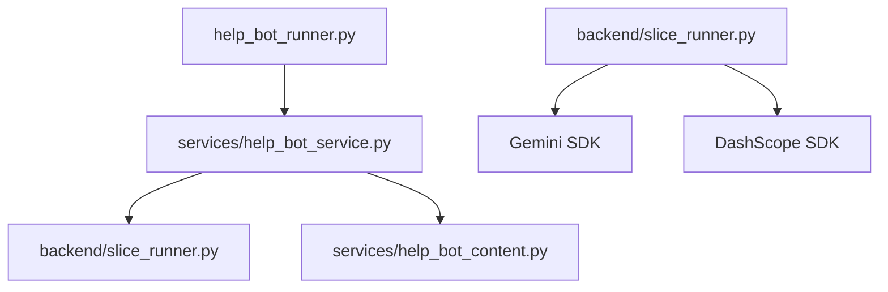
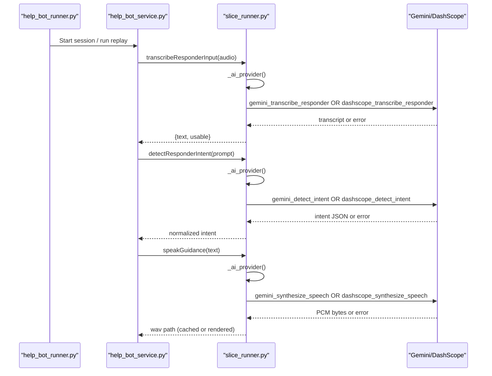
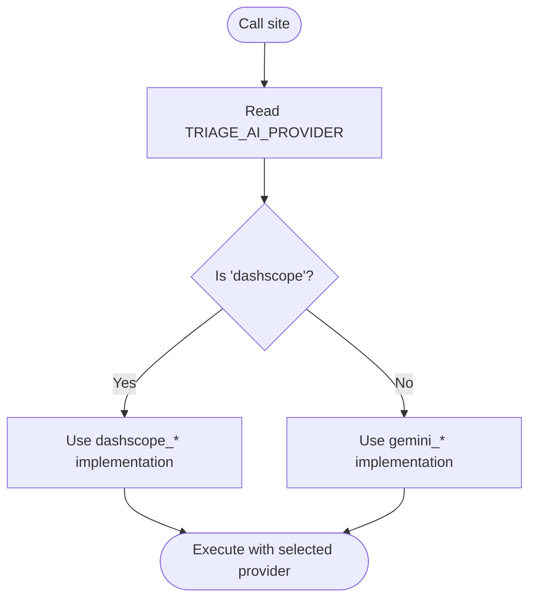
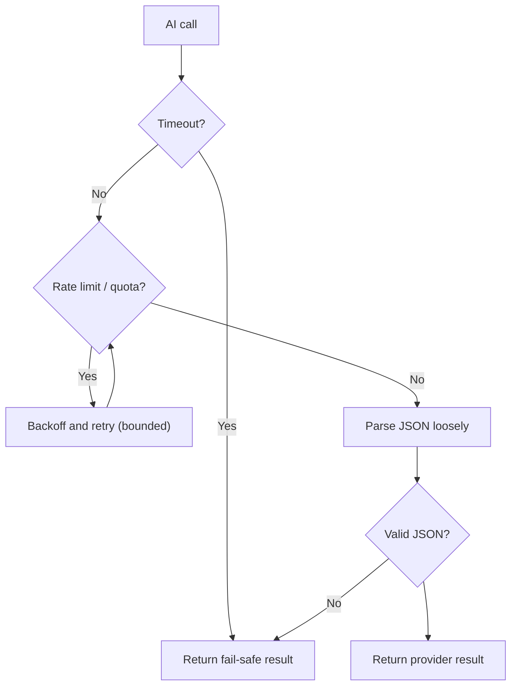
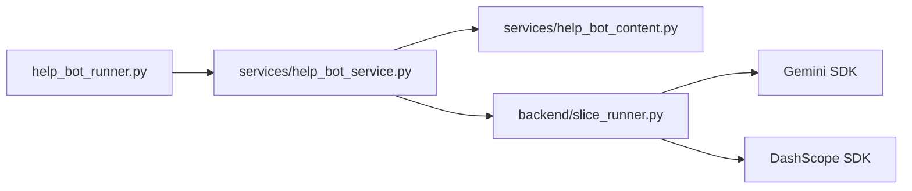

# AI Provider Abstraction Layer

<cite>
**Referenced Files in This Document**
- [slice_runner.py](file://backend/slice_runner.py)
- [help_bot_service.py](file://backend/services/help_bot_service.py)
- [help_bot_content.py](file://backend/services/help_bot_content.py)
- [help_bot_runner.py](file://backend/help_bot_runner.py)
</cite>

## Table of Contents
1. [Introduction](#introduction)
2. [Project Structure](#project-structure)
3. [Core Components](#core-components)
4. [Architecture Overview](#architecture-overview)
5. [Detailed Component Analysis](#detailed-component-analysis)
6. [Dependency Analysis](#dependency-analysis)
7. [Performance Considerations](#performance-considerations)
8. [Troubleshooting Guide](#troubleshooting-guide)
9. [Conclusion](#conclusion)
10. [Appendices](#appendices)

## Introduction
This document explains the AI provider abstraction layer that enables seamless switching between Gemini and DashScope services across speech-to-text (STT), intent classification, vision analysis, and text-to-speech (TTS). It covers:
- How TRIAGE_AI_PROVIDER selects the active provider without code changes
- The consistent interface maintained for each provider
- Fallback strategies when providers are unavailable or rate-limited
- Configuration requirements per provider (API keys, endpoints, models)
- How to add new providers and implement provider-specific optimizations
- Monitoring and performance considerations, including authentication, rate limiting, and quota management

## Project Structure
The abstraction spans two layers:
- Triage pipeline (Module 1): STT, vision, classifier, all behind a provider boundary
- Help bot (Module 2): STT, intent detection, TTS, also behind the same provider boundary

**Diagram sources**
- [help_bot_runner.py:1-241](file://backend/help_bot_runner.py#L1-L241)
- [help_bot_service.py:1-960](file://backend/services/help_bot_service.py#L1-L960)
- [slice_runner.py:1-745](file://backend/slice_runner.py#L1-L745)
- [help_bot_content.py:1-255](file://backend/services/help_bot_content.py#L1-L255)

**Section sources**
- [help_bot_runner.py:1-241](file://backend/help_bot_runner.py#L1-L241)
- [help_bot_service.py:1-960](file://backend/services/help_bot_service.py#L1-L960)
- [slice_runner.py:1-745](file://backend/slice_runner.py#L1-L745)
- [help_bot_content.py:1-255](file://backend/services/help_bot_content.py#L1-L255)

## Core Components
- Provider selection: single environment variable controls behavior globally
- Provider boundaries: each capability has gemini_* and dashscope_* implementations
- Shared resilience: timeouts, retries, JSON parsing, caching, fail-safe outputs
- Consistent interfaces: callers choose implementation via _ai_provider()

Key elements:
- TRIAGE_AI_PROVIDER: selects "gemini" (default) or "dashscope"
- Per-step functions: transcribe voice, classify image, combine signals, detect intent, synthesize speech
- Resilience helpers: timeout, retry on 429/RESOURCE_EXHAUSTED, loose JSON parsing
- Fail-safes: pre-rendered Urdu audio, low-confidence triage defaults, never silence

**Section sources**
- [slice_runner.py:27-153](file://backend/slice_runner.py#L27-L153)
- [slice_runner.py:367-516](file://backend/slice_runner.py#L367-L516)
- [help_bot_service.py:127-387](file://backend/services/help_bot_service.py#L127-L387)
- [help_bot_content.py:21-43](file://backend/services/help_bot_content.py#L21-L43)

## Architecture Overview
The system uses a provider boundary pattern:
- Each step exposes two implementations (gemini_*, dashscope_*)
- A central selector chooses the active implementation based on TRIAGE_AI_PROVIDER
- All calls go through shared resilience utilities (timeout, retry, JSON parsing)
- Fail-safe paths ensure continuity even when providers are down

**Diagram sources**
- [help_bot_service.py:159-387](file://backend/services/help_bot_service.py#L159-L387)
- [slice_runner.py:132-153](file://backend/slice_runner.py#L132-L153)
- [slice_runner.py:367-516](file://backend/slice_runner.py#L367-L516)

## Detailed Component Analysis

### Provider Selection Mechanism
- TRIAGE_AI_PROVIDER is read once per call site; default is "gemini"
- All provider-specific steps branch on this value to pick gemini_* vs dashscope_*
- No code changes needed to switch providers; only environment configuration

**Diagram sources**
- [slice_runner.py:132-153](file://backend/slice_runner.py#L132-L153)
- [help_bot_service.py:159-387](file://backend/services/help_bot_service.py#L159-L387)

**Section sources**
- [slice_runner.py:132-153](file://backend/slice_runner.py#L132-L153)

### Interface Consistency Across Providers
Each capability has matching signatures and return types regardless of provider:
- STT: returns {"text": str, "usable": bool}
- Vision: returns classification dict with status and fields
- Classifier: returns severity tier and flags
- Intent detection: returns strict schema with intent, qa_entry_id, escalation_signal, suggested_tier, reason
- TTS: returns PCM bytes wrapped into WAV cache; callers get {"wav_path", "cached", "bytes"}

Consistency ensures callers do not need provider-specific logic beyond the initial selection.

**Section sources**
- [slice_runner.py:367-516](file://backend/slice_runner.py#L367-L516)
- [help_bot_service.py:127-387](file://backend/services/help_bot_service.py#L127-L387)

### Fallback Strategies When Primary Providers Are Unavailable
- Timeouts: per-call timeout enforced via TRIAGE_CALL_TIMEOUT_S
- Retries: automatic retry on 429/RESOURCE_EXHAUSTED with backoff (TRIAGE_QUOTA_RETRIES)
- Loose JSON parsing: tolerates markdown fences and stray prose
- Fail-safe outputs:
  - Triage: if classifier fails or invalid, defaults to moderate tier with low_confidence_triage flag
  - Help bot: pre-rendered Urdu fail-safe line spoken on any AI failure; never silent
- Caching:
  - Triage results cached by media fingerprint to avoid repeated calls
  - TTS lines cached to disk to avoid quota burn and enable deterministic runs

**Diagram sources**
- [slice_runner.py:55-95](file://backend/slice_runner.py#L55-L95)
- [slice_runner.py:349-364](file://backend/slice_runner.py#L349-L364)
- [slice_runner.py:519-586](file://backend/slice_runner.py#L519-L586)
- [help_bot_service.py:689-757](file://backend/services/help_bot_service.py#L689-L757)

**Section sources**
- [slice_runner.py:55-95](file://backend/slice_runner.py#L55-L95)
- [slice_runner.py:349-364](file://backend/slice_runner.py#L349-L364)
- [slice_runner.py:519-586](file://backend/slice_runner.py#L519-L586)
- [help_bot_service.py:689-757](file://backend/services/help_bot_service.py#L689-L757)

### Configuration Requirements

#### Environment Variables
- TRIAGE_AI_PROVIDER: "gemini" (default) or "dashscope"
- TRIAGE_CALL_TIMEOUT_S: per-AI-call timeout in seconds
- TRIAGE_QUOTA_RETRIES: number of retries on quota/rate-limit errors
- GEMINI_API_KEY: required for Gemini
- DASHSCOPE_API_KEY: required for DashScope
- GEMINI_STT_MODEL, GEMINI_CLASSIFIER_MODEL, GEMINI_VISION_MODEL, GEMINI_TTS_MODEL, GEMINI_TTS_VOICE: model overrides for Gemini
- DASHSCOPE_BASE_URL: optional endpoint override for DashScope (auto-detected otherwise)
- DASHSCOPE_CLASSIFIER_MODEL: model override for DashScope classifier

#### Authentication Handling
- API keys are loaded from .env at module load time
- Keys are never printed or logged
- Missing keys raise explicit runtime errors guiding users to set them in .env

#### Endpoint Configuration
- DashScope endpoint auto-detection based on key length; can be overridden via DASHSCOPE_BASE_URL
- Gemini client configured with timeout derived from TRIAGE_CALL_TIMEOUT_S

#### Model Specifications
- STT:
  - Gemini: configurable via GEMINI_STT_MODEL (default gemini-3.5-flash)
  - DashScope: SenseVoice-v1 (Urdu-capable ASR)
- Vision:
  - Gemini: configurable via GEMINI_VISION_MODEL (default gemini-3.5-flash)
  - DashScope: qwen-vl-max
- Classifier:
  - Gemini: configurable via GEMINI_CLASSIFIER_MODEL (default gemini-3.5-flash)
  - DashScope: configurable via DASHSCOPE_CLASSIFIER_MODEL (default qwen-plus)
- TTS:
  - Gemini: configurable via GEMINI_TTS_MODEL and GEMINI_TTS_VOICE
  - DashScope: CosyVoice boundary exists but intentionally refuses until Urdu voice availability is verified

**Section sources**
- [slice_runner.py:27-69](file://backend/slice_runner.py#L27-L69)
- [slice_runner.py:36-52](file://backend/slice_runner.py#L36-L52)
- [slice_runner.py:367-411](file://backend/slice_runner.py#L367-L411)
- [slice_runner.py:430-464](file://backend/slice_runner.py#L430-L464)
- [slice_runner.py:479-506](file://backend/slice_runner.py#L479-L506)
- [help_bot_service.py:295-337](file://backend/services/help_bot_service.py#L295-L337)

### Adding New Providers
To add a new provider (e.g., ProviderX):
1. Implement provider-specific functions for each capability:
   - transcribe_voice_note -> providerx_transcribe_voice(...)
   - classify_injury_photo -> providerx_classify_injury(...)
   - combine_signals -> providerx_combine_signals(...)
   - For help bot: transcribeResponderInput, detectResponderIntent, speakGuidance
2. Ensure return shapes match existing interfaces
3. Update _ai_provider() selection to include "providerx"
4. Add environment variables for keys, endpoints, and model names
5. Add fallback handling and logging consistent with existing patterns

Best practices:
- Keep provider-specific imports deferred to avoid import-time dependencies
- Use shared resilience helpers (_call_with_retry, _triage_timeout_s, _parse_json_loose)
- Validate responses strictly; normalize to common schemas
- Provide clear error messages and logs for failures

**Section sources**
- [slice_runner.py:132-153](file://backend/slice_runner.py#L132-L153)
- [slice_runner.py:367-516](file://backend/slice_runner.py#L367-L516)
- [help_bot_service.py:127-387](file://backend/services/help_bot_service.py#L127-L387)

### Implementing Provider-Specific Optimizations
- STT:
  - Gemini: use Part.from_bytes with appropriate MIME type; leverage streaming where applicable
  - DashScope: upload file via helper, then async transcription; handle subtask success checks
- Vision:
  - Gemini: support both local files and URIs; pass image part directly
  - DashScope: use MultiModalConversation with image and text content
- Classifier:
  - Gemini: generate_content with prompt and inputs
  - DashScope: Generation.call with structured messages
- TTS:
  - Gemini: configure response modalities and speech config for audio output
  - DashScope: placeholder boundary raises until Urdu voice availability confirmed

Optimization tips:
- Cache TTS outputs to disk to avoid repeated renders
- Pre-warm TTS cache for deterministic replay runs
- Use timeouts and retries to handle transient issues gracefully
- Normalize JSON outputs robustly to tolerate model quirks

**Section sources**
- [slice_runner.py:367-411](file://backend/slice_runner.py#L367-L411)
- [slice_runner.py:430-464](file://backend/slice_runner.py#L430-L464)
- [slice_runner.py:479-506](file://backend/slice_runner.py#L479-L506)
- [help_bot_service.py:307-337](file://backend/services/help_bot_service.py#L307-L337)
- [help_bot_runner.py:102-132](file://backend/help_bot_runner.py#L102-L132)

### Monitoring Provider Performance
- Latency tracking:
  - First playback delay measured per turn in help bot session
  - Transitions recorded with latency_ms when available
- Quota and rate limits:
  - Automatic retries with backoff on 429/RESOURCE_EXHAUSTED
  - Pacing during TTS prewarm to respect free-tier limits
- Observability:
  - Logs indicate provider used per step and warnings on failures
  - TTS manifest tracks model, voice, render time, and source text snippet

**Section sources**
- [help_bot_service.py:727-750](file://backend/services/help_bot_service.py#L727-L750)
- [help_bot_service.py:696-711](file://backend/services/help_bot_service.py#L696-L711)
- [help_bot_service.py:350-387](file://backend/services/help_bot_service.py#L350-L387)
- [help_bot_runner.py:102-132](file://backend/help_bot_runner.py#L102-L132)

## Dependency Analysis
The abstraction layer decouples business logic from provider specifics:
- help_bot_runner orchestrates sessions and scripts
- help_bot_service implements conversation flow and provider boundaries for STT, intent, TTS
- slice_runner provides triage pipeline and shared provider utilities
- help_bot_content contains hardcoded Urdu guidance strings

**Diagram sources**
- [help_bot_runner.py:1-241](file://backend/help_bot_runner.py#L1-L241)
- [help_bot_service.py:1-960](file://backend/services/help_bot_service.py#L1-L960)
- [help_bot_content.py:1-255](file://backend/services/help_bot_content.py#L1-L255)
- [slice_runner.py:1-745](file://backend/slice_runner.py#L1-L745)

**Section sources**
- [help_bot_runner.py:1-241](file://backend/help_bot_runner.py#L1-L241)
- [help_bot_service.py:1-960](file://backend/services/help_bot_service.py#L1-L960)
- [help_bot_content.py:1-255](file://backend/services/help_bot_content.py#L1-L255)
- [slice_runner.py:1-745](file://backend/slice_runner.py#L1-L745)

## Performance Considerations
- Timeouts: Configure TRIAGE_CALL_TIMEOUT_S to balance responsiveness and reliability
- Retries: Tune TRIAGE_QUOTA_RETRIES for your quota limits; backoff prevents thundering herds
- Caching:
  - Triage results cached by media fingerprint to reduce API calls
  - TTS cache avoids repeated rendering and quota consumption
- Pacing:
  - TTS prewarm paces requests to respect free-tier limits
- Audio processing:
  - VAD-based capture reduces unnecessary STT calls
  - Barge-in detection improves user experience without extra provider calls

[No sources needed since this section provides general guidance]

## Troubleshooting Guide
Common issues and resolutions:
- Missing API keys:
  - Set GEMINI_API_KEY or DASHSCOPE_API_KEY in .env
  - Errors explicitly guide you to add keys to .env
- Provider SDK not installed:
  - DashScope import errors are captured; pipeline enforces availability when selecting dashscope
- Rate limits and quotas:
  - Automatic retries with backoff; adjust TRIAGE_QUOTA_RETRIES if needed
  - Use TTS prewarm to batch renders and minimize live calls
- Non-JSON responses:
  - Loose JSON parser handles markdown fences and stray text; still may fall back to safe defaults
- Fail-safe activation:
  - If AI calls fail, help bot speaks pre-rendered Urdu fail-safe line; check logs for warnings

**Section sources**
- [slice_runner.py:36-52](file://backend/slice_runner.py#L36-L52)
- [slice_runner.py:142-153](file://backend/slice_runner.py#L142-L153)
- [slice_runner.py:72-95](file://backend/slice_runner.py#L72-L95)
- [slice_runner.py:349-364](file://backend/slice_runner.py#L349-L364)
- [help_bot_service.py:689-757](file://backend/services/help_bot_service.py#L689-L757)

## Conclusion
The AI provider abstraction layer provides a clean, resilient, and configurable mechanism to switch between Gemini and DashScope services. By enforcing consistent interfaces, centralized provider selection, and robust fallbacks, the system remains reliable under varying conditions. Configuration is straightforward via environment variables, and the design supports adding new providers with minimal disruption. Monitoring and performance tuning are built-in through timeouts, retries, caching, and pacing.

[No sources needed since this section summarizes without analyzing specific files]

## Appendices

### Provider Boundary Functions Reference
- STT:
  - gemini_transcribe_voice / dashscope_transcribe_voice
  - gemini_transcribe_responder / dashscope_transcribe_responder
- Vision:
  - gemini_classify_injury / dashscope_classify_injury
- Classifier:
  - gemini_combine_signals / dashscope_combine_signals
- Intent Detection:
  - gemini_detect_intent / dashscope_detect_intent
- TTS:
  - gemini_synthesize_speech / dashscope_synthesize_speech

**Section sources**
- [slice_runner.py:367-516](file://backend/slice_runner.py#L367-L516)
- [help_bot_service.py:127-387](file://backend/services/help_bot_service.py#L127-L387)