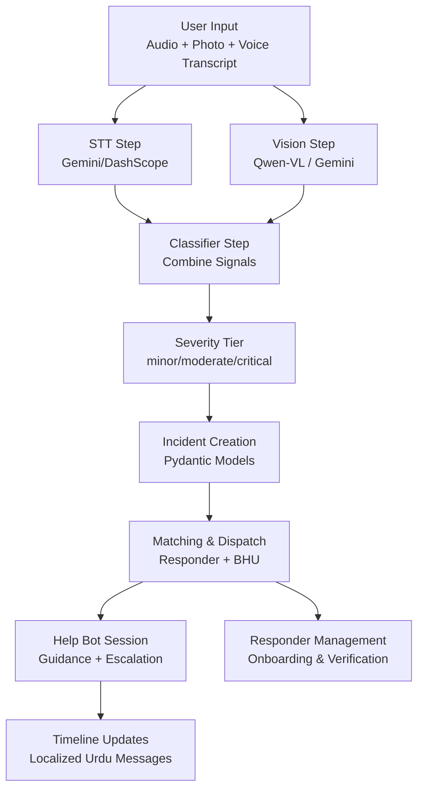
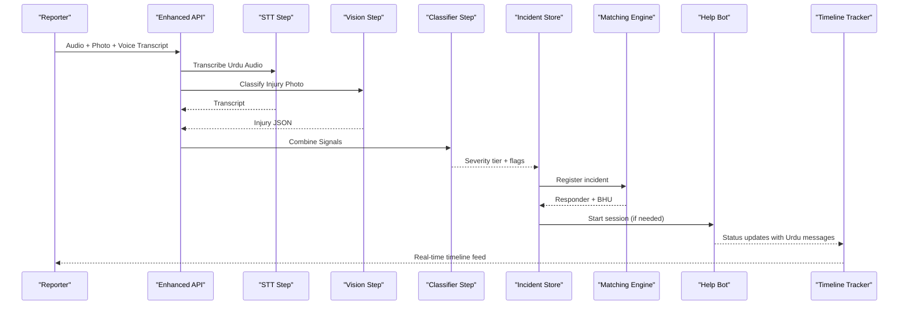
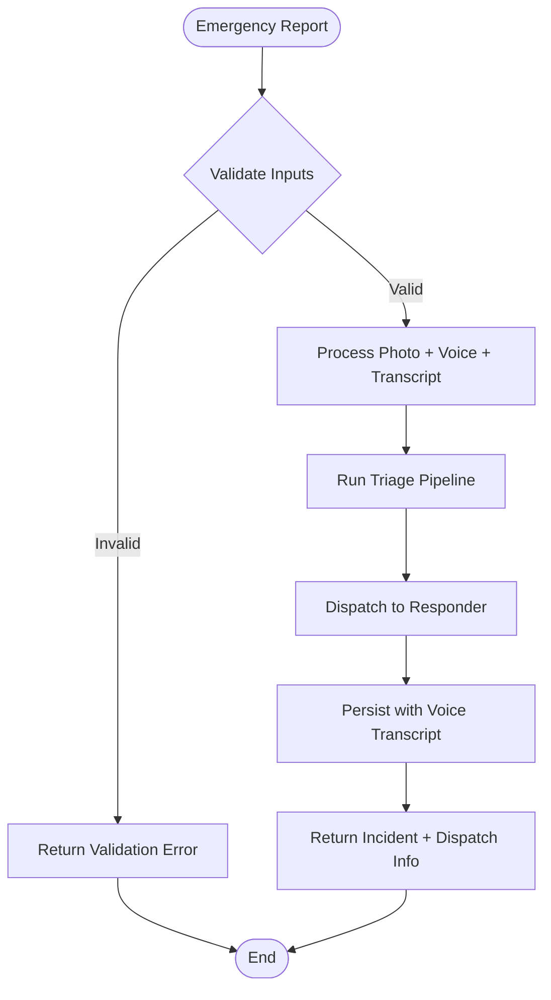
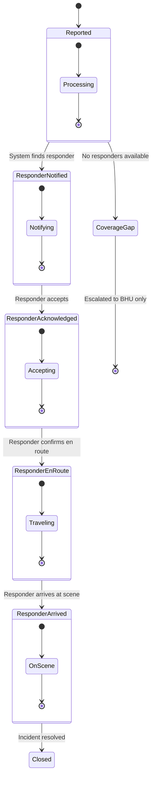
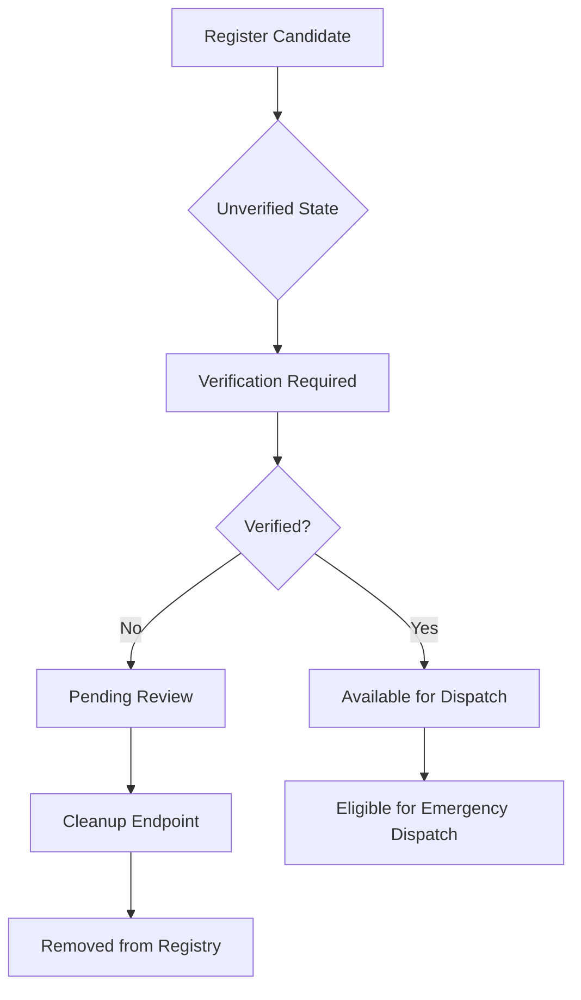
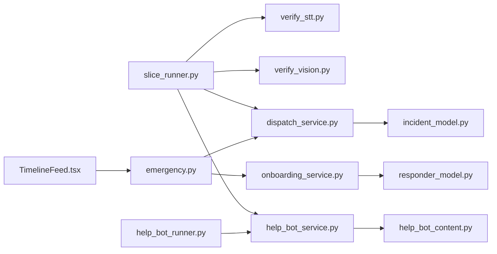

# Emergency Triage System

<cite>
**Referenced Files in This Document**
- [slice_runner.py](file://backend/slice_runner.py)
- [verify_stt.py](file://backend/verify_stt.py)
- [verify_vision.py](file://backend/verify_vision.py)
- [help_bot_runner.py](file://backend/help_bot_runner.py)
- [help_bot_service.py](file://backend/services/help_bot_service.py)
- [help_bot_content.py](file://backend/services/help_bot_content.py)
- [emergency.py](file://backend/routes/emergency.py)
- [dispatch_service.py](file://backend/services/dispatch_service.py)
- [incident_model.py](file://backend/models/incident_model.py)
- [onboarding_service.py](file://backend/services/onboarding_service.py)
- [TimelineFeed.tsx](file://frontend/src/components/TimelineFeed.tsx)
- [PROJECT.md](file://PROJECT.md)
</cite>

## Update Summary
**Changes Made**
- Enhanced API endpoints with voice transcript support for real-time processing
- Improved timeline tracking for responder acknowledgment states with localized Urdu messages
- Added new responder management endpoints for pending responder cleanup and verification workflow
- Enhanced dispatch service with better acknowledgment timeout handling and fallback mechanisms
- Updated incident model to support comprehensive timeline tracking and reporter updates

## Table of Contents
1. [Introduction](#introduction)
2. [Project Structure](#project-structure)
3. [Core Components](#core-components)
4. [Architecture Overview](#architecture-overview)
5. [Detailed Component Analysis](#detailed-component-analysis)
6. [Dependency Analysis](#dependency-analysis)
7. [Performance Considerations](#performance-considerations)
8. [Troubleshooting Guide](#troubleshooting-guide)
9. [Conclusion](#conclusion)
10. [Appendices](#appendices)

## Introduction
This document explains the Emergency Triage System sub-component that processes multi-modal inputs (Urdu audio and photos) to classify injuries and determine severity tiers, then orchestrates dispatch and integrates with the Responder Help Bot system. It covers:
- Speech-to-text processing for Urdu audio with enhanced voice transcript support
- Vision-based injury classification using Qwen-VL models
- Severity tier determination logic combining voice and vision signals
- Provider switching between Gemini and DashScope services
- Data validation via Pydantic models
- Incident creation, GPS location handling, and severity assessment workflows
- Enhanced timeline tracking for responder acknowledgment states
- New responder management endpoints for pending responder cleanup
- Relationships with the matching engine and help bot system
- Error handling strategies, performance considerations for real-time processing, and testing approaches for triage accuracy

The system is designed for rural emergency response in Pakistan, prioritizing speed, safety, and reliability under constrained conditions.

## Project Structure
At a high level:
- backend/slice_runner.py implements the triage pipeline, provider selection, data contracts, incident registration, matching/dispatch, and test harnesses
- backend/routes/emergency.py provides HTTP endpoints with enhanced voice transcript support and responder management
- backend/services/dispatch_service.py handles dispatch logic with improved acknowledgment tracking and timeline updates
- backend/services/onboarding_service.py manages responder onboarding and verification workflows
- backend/models/incident_model.py provides database persistence with enhanced timeline tracking
- frontend/src/components/TimelineFeed.tsx displays real-time status updates with localized Urdu messages
- backend/verify_stt.py and backend/verify_vision.py are verification scripts that exercise STT and vision steps against mock media
- backend/help_bot_runner.py orchestrates Module 2 (Responder Help Bot), integrating with Module 1 triage results
- backend/services/help_bot_service.py implements the conversation state machine, STT/intent/TTS boundaries, escalation hooks, and audio I/O
- backend/services/help_bot_content.py contains hardcoded Urdu guidance content and branch definitions
- PROJECT.md outlines the overall architecture and tech stack

**Diagram sources**
- [emergency.py:187-259](file://backend/routes/emergency.py#L187-L259)
- [dispatch_service.py:305-440](file://backend/services/dispatch_service.py#L305-L440)
- [onboarding_service.py:49-131](file://backend/services/onboarding_service.py#L49-L131)

**Section sources**
- [PROJECT.md:1-20](file://PROJECT.md#L1-L20)

## Core Components
- Multi-modal triage pipeline: STT, vision classification, classifier combination, fail-safe defaults
- Enhanced API layer: Voice transcript support, responder management endpoints, timeline tracking
- Provider abstraction: Gemini vs DashScope selection via environment variable
- Data contracts: Pydantic models for GPSLocation, Incident, Responder, BHU, DispatchResult
- Incident lifecycle: registerIncident -> matchResponderAndBHU -> dispatch -> logIncident
- Help bot integration: session management, intent detection, TTS caching, escalation hook
- Responder onboarding: candidate registration, verification workflow, pending cleanup
- Timeline tracking: Real-time status updates with localized Urdu messages and acknowledgment states

Key responsibilities:
- slice_runner.py: orchestration, provider boundary, AI calls, caching, tests
- emergency.py: HTTP endpoints with enhanced voice transcript support and responder management
- dispatch_service.py: dispatch logic with improved acknowledgment tracking and timeline updates
- onboarding_service.py: responder onboarding and verification workflows
- incident_model.py: database persistence with enhanced timeline tracking
- TimelineFeed.tsx: real-time status display with localized Urdu messages
- verify_stt.py / verify_vision.py: verification gates for STT and vision
- help_bot_service.py: conversation engine, provider boundary for STT/intent/TTS, escalation
- help_bot_content.py: hardcoded Urdu guidance and branches

**Section sources**
- [emergency.py:187-259](file://backend/routes/emergency.py#L187-L259)
- [dispatch_service.py:305-440](file://backend/services/dispatch_service.py#L305-L440)
- [onboarding_service.py:49-131](file://backend/services/onboarding_service.py#L49-L131)
- [incident_model.py:339-398](file://backend/models/incident_model.py#L339-L398)

## Architecture Overview
The triage pipeline uses a provider-agnostic design with enhanced API support:
- STT step transcribes Urdu audio via Gemini or DashScope SenseVoice-v1
- Vision step classifies injuries via Qwen-VL (DashScope) or Gemini multimodal model
- Classifier step merges transcript and vision JSON into a severity tier with safety rules
- Enhanced API endpoints accept voice transcripts alongside photo and voice references
- Fail-safe defaults ensure dispatch proceeds even if AI calls fail
- Matching selects an available responder in the same village and links to BHU based on geography
- Help bot provides hands-free Urdu guidance, escalates incidents mid-session, and logs transitions
- Timeline tracking provides real-time status updates with localized Urdu messages
- Responder management supports onboarding, verification, and pending cleanup workflows

**Diagram sources**
- [emergency.py:187-259](file://backend/routes/emergency.py#L187-L259)
- [dispatch_service.py:305-440](file://backend/services/dispatch_service.py#L305-L440)
- [TimelineFeed.tsx:18-158](file://frontend/src/components/TimelineFeed.tsx#L18-L158)

## Detailed Component Analysis

### Enhanced API Endpoints with Voice Transcript Support
**Updated** The emergency reporting endpoint now supports direct voice transcript input alongside traditional audio file processing.

- POST /emergency/report accepts voice_transcript as a form field alongside photo_ref and voice_ref
- Voice transcripts are attached to incidents and persisted through the full lifecycle
- Enhanced validation ensures both evidence channels are mandatory for triage
- Database persistence includes voice_transcript field for complete audit trail

**Diagram sources**
- [emergency.py:187-259](file://backend/routes/emergency.py#L187-L259)

**Section sources**
- [emergency.py:187-259](file://backend/routes/emergency.py#L187-L259)

### Improved Timeline Tracking for Responder Acknowledgment States
**Updated** Enhanced timeline tracking provides real-time status updates with localized Urdu messages and improved acknowledgment state management.

- Dispatcher service adds localized Urdu messages for each timeline stage
- Acknowledgment timeout handling with proper timer cancellation
- Enhanced reporter_updates array with timestamped, localized messages
- Timeline feed displays coverage gaps, escalations, and ambulance requests
- Real-time polling with live status indicators

**Diagram sources**
- [dispatch_service.py:305-440](file://backend/services/dispatch_service.py#L305-L440)
- [TimelineFeed.tsx:18-158](file://frontend/src/components/TimelineFeed.tsx#L18-L158)

**Section sources**
- [dispatch_service.py:305-440](file://backend/services/dispatch_service.py#L305-L440)
- [TimelineFeed.tsx:18-158](file://frontend/src/components/TimelineFeed.tsx#L18-L158)

### New Responder Management Endpoints for Pending Cleanup
**Updated** New Module 7 endpoints provide comprehensive responder onboarding, verification, and cleanup capabilities.

- POST /responders/register: Register new candidate responders with validation
- POST /responders/{responder_id}/verify: Admin/trainer sign-off for verification
- GET /responders/pending: List all candidate responders awaiting verification
- DELETE /responders/pending/clear: Delete all unverified candidate responders
- GET /responders: Read-only availability view with filtering
- PUT /responders/{responder_id}/status: Update duty availability status

**Diagram sources**
- [onboarding_service.py:49-131](file://backend/services/onboarding_service.py#L49-L131)
- [emergency.py:686-749](file://backend/routes/emergency.py#L686-L749)

**Section sources**
- [onboarding_service.py:49-131](file://backend/services/onboarding_service.py#L49-L131)
- [emergency.py:686-749](file://backend/routes/emergency.py#L686-L749)

### Multi-Modal Input Processing
- STT: Transcribes Urdu audio; supports both Gemini and DashScope endpoints; returns usable flag and text
- Vision: Classifies visible injuries; supports Qwen-VL (DashScope) and Gemini; returns classification, severity, confidence, signals, usability
- Classifier: Combines transcript and vision JSON; enforces safety rules (voice danger signals override vision); outputs severity tier and injury type flags

**Diagram sources**
- [slice_runner.py:316-586](file://backend/slice_runner.py#L316-L586)

**Section sources**
- [slice_runner.py:369-425](file://backend/slice_runner.py#L369-L425)
- [slice_runner.py:430-474](file://backend/slice_runner.py#L430-L474)
- [slice_runner.py:479-516](file://backend/slice_runner.py#L479-L516)

### Severity Classification Logic
- Safety-first conflict resolution: when transcript and vision disagree, adopt the more severe tier
- Voice-reported danger signals (e.g., unconsciousness, uncontrolled bleeding, venomous bite) must never be downgraded by vision output
- If either source indicates critical, final tier is critical
- Missing or unclear inputs default to moderate with low-confidence flag

**Section sources**
- [slice_runner.py:327-346](file://backend/slice_runner.py#L327-L346)
- [slice_runner.py:557-586](file://backend/slice_runner.py#L557-L586)

### Provider Switching Mechanism
- TRIAGE_AI_PROVIDER environment variable selects active provider ("gemini" default, "dashscope" swap-back ready)
- Each step has gemini_* and dashscope_* implementations behind a unified interface
- Timeout and retry policies apply uniformly across providers
- DashScope endpoint auto-detection based on API key length; international vs China region support

**Section sources**
- [slice_runner.py:21-33](file://backend/slice_runner.py#L21-L33)
- [slice_runner.py:138-153](file://backend/slice_runner.py#L138-L153)
- [slice_runner.py:414-425](file://backend/slice_runner.py#L414-L425)
- [slice_runner.py:467-474](file://backend/slice_runner.py#L467-L474)
- [slice_runner.py:509-516](file://backend/slice_runner.py#L509-L516)

### Data Validation Using Pydantic Models
- GPSLocation: latitude, longitude, village_id
- Incident: incident_id, timestamp_reported, reporter_id, gps_location, photo_ref, voice_transcript, severity_tier, injury_type_flags, plus optional fields for responder assignment, BHU notification, ambulance request, outcome, and help bot transitions
- Responder: responder_id, name, village, linked_bhu_id, availability status, points
- BHU: bhu_id, name, union_council, linked_village_ids
- DispatchResult: incident_id, responder, bhu, ambulance_requested, status

**Section sources**
- [slice_runner.py:164-213](file://backend/slice_runner.py#L164-L213)

### Incident Creation, GPS Location Processing, and Severity Assessment Workflows
- registerIncident creates an Incident with triage results from the pipeline
- Enhanced API accepts voice_transcript alongside traditional audio/video references
- GPSLocation validates geographic context and links to village-based matching
- Severity assessment flows through STT, vision, and classifier steps with fail-safe defaults
- Matching selects available responders in the same village and links to BHU based on village associations
- Dispatch sets responder busy, notifies BHU for moderate/critical, requests ambulance for critical
- Enhanced timeline tracking with localized Urdu messages for each stage

**Section sources**
- [emergency.py:187-259](file://backend/routes/emergency.py#L187-L259)
- [dispatch_service.py:305-440](file://backend/services/dispatch_service.py#L305-L440)

### Help Bot Integration
- Help bot routes to branches based on injury_type_flags
- Provides hands-free Urdu guidance with pre-rendered TTS cache
- Detects intents via AI (STT + intent classification) while keeping medical content hardcoded
- Escalation hook upgrades severity tier, merges new flags, notifies BHU, requests ambulance if critical, and logs transitions

**Section sources**
- [help_bot_service.py:99-117](file://backend/services/help_bot_service.py#L99-L117)
- [help_bot_service.py:576-647](file://backend/services/help_bot_service.py#L576-L647)
- [help_bot_content.py:21-43](file://backend/services/help_bot_content.py#L21-L43)

## Dependency Analysis
- slice_runner.py depends on Google GenAI SDK (Gemini) and optionally DashScope SDK
- emergency.py depends on dispatch_service, help_bot_service, and onboarding_service
- dispatch_service.py depends on slice_runner for provider utilities and shared models
- onboarding_service.py depends on responder_model for database operations
- TimelineFeed.tsx depends on backend timeline endpoints for real-time updates
- Verification scripts depend on slice_runner for pipeline access
- Help bot runner depends on help_bot_service and help_bot_content for session orchestration

**Diagram sources**
- [emergency.py:1-800](file://backend/routes/emergency.py#L1-L800)
- [dispatch_service.py:1-800](file://backend/services/dispatch_service.py#L1-L800)
- [onboarding_service.py:1-340](file://backend/services/onboarding_service.py#L1-L340)
- [TimelineFeed.tsx:1-228](file://frontend/src/components/TimelineFeed.tsx#L1-L228)

**Section sources**
- [emergency.py:1-800](file://backend/routes/emergency.py#L1-L800)
- [dispatch_service.py:1-800](file://backend/services/dispatch_service.py#L1-L800)
- [onboarding_service.py:1-340](file://backend/services/onboarding_service.py#L1-L340)

## Performance Considerations
- Per-AI-call timeout configurable via TRIAGE_CALL_TIMEOUT_S to prevent blocking emergency flow
- Quota retry with exponential backoff for 429/RESOURCE_EXHAUSTED errors
- Media caching for triage results to avoid redundant AI calls and quota consumption
- TTS caching for help bot guidance to eliminate repeated synthesis costs
- Real-time audio capture with VAD and barge-in detection for responsive interaction
- Provider timeouts and retries applied consistently across STT, vision, and classifier steps
- Enhanced timeline polling with efficient state synchronization
- Database write-through operations with error handling for non-critical failures
- Responder verification workflow optimized for batch operations

**Section sources**
- [slice_runner.py:55-95](file://backend/slice_runner.py#L55-L95)
- [slice_runner.py:97-129](file://backend/slice_runner.py#L97-L129)
- [help_bot_service.py:53-62](file://backend/services/help_bot_service.py#L53-L62)
- [help_bot_service.py:102-132](file://backend/services/help_bot_service.py#L102-L132)
- [dispatch_service.py:358-362](file://backend/services/dispatch_service.py#L358-L362)

## Troubleshooting Guide
- STT failures: Check audio file existence, provider configuration, and transcription output; verify_stt.py prints side-by-side ground truth vs transcription
- Vision failures: Verify image path, model output parsing, and image usability; verify_vision.py prints classification details and latency
- Provider issues: Ensure TRIAGE_AI_PROVIDER is set correctly; check API keys and endpoint configuration; review timeout and retry logs
- Help bot issues: Confirm TTS cache availability, audio device presence, and intent detection prompts; use replay mode for deterministic testing
- Escalation issues: Validate incident_id in active sessions or INCIDENT_STORE; check severity tier upgrade logic and ambulance request flags
- Timeline issues: Verify backend connectivity, check polling intervals, and confirm localized message delivery
- Responder management issues: Check verification status, pending cleanup operations, and database synchronization
- Voice transcript issues: Validate form field transmission, check transcript persistence, and verify timeline inclusion

**Section sources**
- [verify_stt.py:22-52](file://backend/verify_stt.py#L22-L52)
- [verify_vision.py:22-49](file://backend/verify_vision.py#L22-L49)
- [help_bot_service.py:576-647](file://backend/services/help_bot_service.py#L576-L647)
- [emergency.py:187-259](file://backend/routes/emergency.py#L187-L259)

## Conclusion
The Emergency Triage System provides a robust, multi-modal pipeline for rapid severity classification and dispatch coordination in rural emergency scenarios. Its enhanced API layer with voice transcript support, improved timeline tracking with localized Urdu messages, and comprehensive responder management capabilities ensure reliable operation under constraints. The provider-agnostic design, fail-safe defaults, and comprehensive error handling maintain system resilience. Integration with the Responder Help Bot enables hands-free guidance and dynamic escalation, while Pydantic models enforce data integrity throughout the workflow. The system balances performance, safety, and usability to deliver timely emergency response with enhanced operational visibility.

## Appendices

### Testing Approaches for Triage Accuracy
- Use verify_stt.py to validate Urdu STT accuracy against ground truth sidecars
- Use verify_vision.py to assess injury classification quality and latency
- Run built-in test suite in slice_runner.py to exercise real media scenarios and edge cases
- Pre-warm TTS cache in help bot to ensure deterministic replay runs without quota consumption
- Verify spoken-Urdu round-trip using --verify-tts to validate TTS->STT fidelity
- Test enhanced API endpoints with voice transcript payloads
- Validate timeline tracking with acknowledgment state transitions
- Test responder management workflows including registration, verification, and cleanup operations

**Section sources**
- [verify_stt.py:22-52](file://backend/verify_stt.py#L22-L52)
- [verify_vision.py:22-49](file://backend/verify_vision.py#L22-L49)
- [slice_runner.py:679-737](file://backend/slice_runner.py#L679-L737)
- [help_bot_runner.py:102-172](file://backend/help_bot_runner.py#L102-L172)
- [emergency.py:686-749](file://backend/routes/emergency.py#L686-L749)