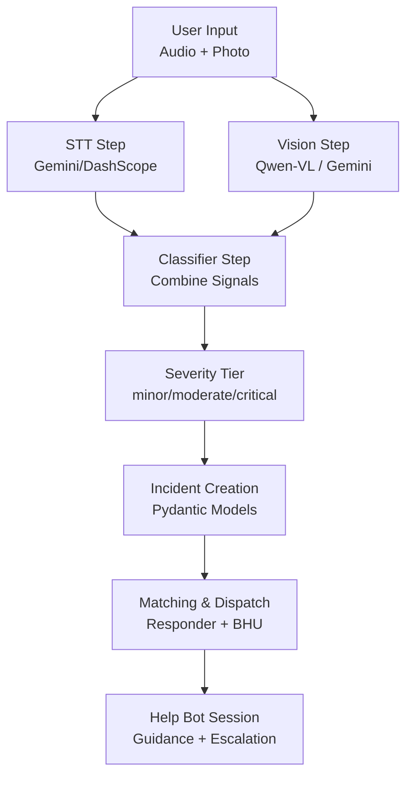
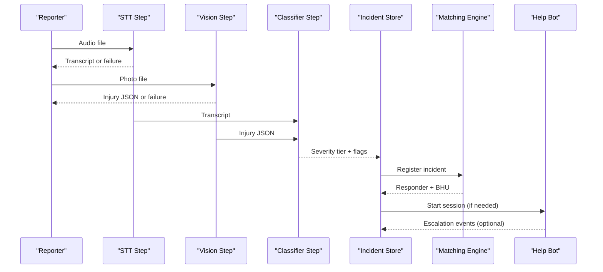
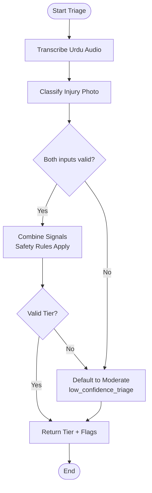
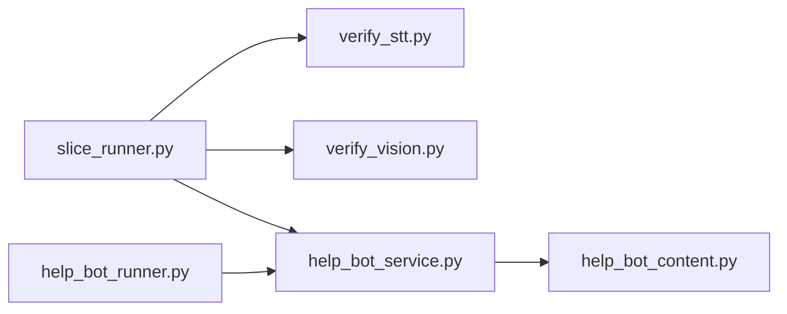

# Emergency Triage System

<cite>
**Referenced Files in This Document**
- [slice_runner.py](file://backend/slice_runner.py)
- [verify_stt.py](file://backend/verify_stt.py)
- [verify_vision.py](file://backend/verify_vision.py)
- [help_bot_runner.py](file://backend/help_bot_runner.py)
- [help_bot_service.py](file://backend/services/help_bot_service.py)
- [help_bot_content.py](file://backend/services/help_bot_content.py)
- [PROJECT.md](file://PROJECT.md)
</cite>

## Table of Contents
1. [Introduction](#introduction)
2. [Project Structure](#project-structure)
3. [Core Components](#core-components)
4. [Architecture Overview](#architecture-overview)
5. [Detailed Component Analysis](#detailed-component-analysis)
6. [Dependency Analysis](#dependency-analysis)
7. [Performance Considerations](#performance-considerations)
8. [Troubleshooting Guide](#troubleshooting-guide)
9. [Conclusion](#conclusion)
10. [Appendices](#appendices)

## Introduction
This document explains the Emergency Triage System sub-component that processes multi-modal inputs (Urdu audio and photos) to classify injuries and determine severity tiers, then orchestrates dispatch and integrates with the Responder Help Bot system. It covers:
- Speech-to-text processing for Urdu audio
- Vision-based injury classification using Qwen-VL models
- Severity tier determination logic combining voice and vision signals
- Provider switching between Gemini and DashScope services
- Data validation via Pydantic models
- Incident creation, GPS location handling, and severity assessment workflows
- Relationships with the matching engine and help bot system
- Error handling strategies, performance considerations for real-time processing, and testing approaches for triage accuracy

The system is designed for rural emergency response in Pakistan, prioritizing speed, safety, and reliability under constrained conditions.

## Project Structure
At a high level:
- backend/slice_runner.py implements the triage pipeline, provider selection, data contracts, incident registration, matching/dispatch, and test harnesses
- backend/verify_stt.py and backend/verify_vision.py are verification scripts that exercise STT and vision steps against mock media
- backend/help_bot_runner.py orchestrates Module 2 (Responder Help Bot), integrating with Module 1 triage results
- backend/services/help_bot_service.py implements the conversation state machine, STT/intent/TTS boundaries, escalation hooks, and audio I/O
- backend/services/help_bot_content.py contains hardcoded Urdu guidance content and branch definitions
- PROJECT.md outlines the overall architecture and tech stack

**Diagram sources**
- [slice_runner.py:316-586](file://backend/slice_runner.py#L316-L586)
- [help_bot_service.py:663-783](file://backend/services/help_bot_service.py#L663-L783)

**Section sources**
- [PROJECT.md:1-20](file://PROJECT.md#L1-L20)

## Core Components
- Multi-modal triage pipeline: STT, vision classification, classifier combination, fail-safe defaults
- Provider abstraction: Gemini vs DashScope selection via environment variable
- Data contracts: Pydantic models for GPSLocation, Incident, Responder, BHU, DispatchResult
- Incident lifecycle: registerIncident -> matchResponderAndBHU -> dispatch -> logIncident
- Help bot integration: session management, intent detection, TTS caching, escalation hook

Key responsibilities:
- slice_runner.py: orchestration, provider boundary, AI calls, caching, tests
- verify_stt.py / verify_vision.py: verification gates for STT and vision
- help_bot_service.py: conversation engine, provider boundary for STT/intent/TTS, escalation
- help_bot_content.py: hardcoded Urdu guidance and branches

**Section sources**
- [slice_runner.py:159-213](file://backend/slice_runner.py#L159-L213)
- [slice_runner.py:519-672](file://backend/slice_runner.py#L519-L672)
- [help_bot_service.py:127-167](file://backend/services/help_bot_service.py#L127-L167)
- [help_bot_service.py:244-288](file://backend/services/help_bot_service.py#L244-L288)
- [help_bot_service.py:307-387](file://backend/services/help_bot_service.py#L307-L387)

## Architecture Overview
The triage pipeline uses a provider-agnostic design:
- STT step transcribes Urdu audio via Gemini or DashScope SenseVoice-v1
- Vision step classifies injuries via Qwen-VL (DashScope) or Gemini multimodal model
- Classifier step merges transcript and vision JSON into a severity tier with safety rules
- Fail-safe defaults ensure dispatch proceeds even if AI calls fail
- Matching selects an available responder in the same village and links to BHU based on geography
- Help bot provides hands-free Urdu guidance, escalates incidents mid-session, and logs transitions

**Diagram sources**
- [slice_runner.py:369-586](file://backend/slice_runner.py#L369-L586)
- [help_bot_service.py:576-647](file://backend/services/help_bot_service.py#L576-L647)

## Detailed Component Analysis

### Multi-Modal Input Processing
- STT: Transcribes Urdu audio; supports both Gemini and DashScope endpoints; returns usable flag and text
- Vision: Classifies visible injuries; supports Qwen-VL (DashScope) and Gemini; returns classification, severity, confidence, signals, usability
- Classifier: Combines transcript and vision JSON; enforces safety rules (voice danger signals override vision); outputs severity tier and injury type flags

**Diagram sources**
- [slice_runner.py:316-586](file://backend/slice_runner.py#L316-L586)

**Section sources**
- [slice_runner.py:369-425](file://backend/slice_runner.py#L369-L425)
- [slice_runner.py:430-474](file://backend/slice_runner.py#L430-L474)
- [slice_runner.py:479-516](file://backend/slice_runner.py#L479-L516)

### Severity Classification Logic
- Safety-first conflict resolution: when transcript and vision disagree, adopt the more severe tier
- Voice-reported danger signals (e.g., unconsciousness, uncontrolled bleeding, venomous bite) must never be downgraded by vision output
- If either source indicates critical, final tier is critical
- Missing or unclear inputs default to moderate with low-confidence flag

**Section sources**
- [slice_runner.py:327-346](file://backend/slice_runner.py#L327-L346)
- [slice_runner.py:557-586](file://backend/slice_runner.py#L557-L586)

### Provider Switching Mechanism
- TRIAGE_AI_PROVIDER environment variable selects active provider ("gemini" default, "dashscope" swap-back ready)
- Each step has gemini_* and dashscope_* implementations behind a unified interface
- Timeout and retry policies apply uniformly across providers
- DashScope endpoint auto-detection based on API key length; international vs China region support

**Section sources**
- [slice_runner.py:21-33](file://backend/slice_runner.py#L21-L33)
- [slice_runner.py:138-153](file://backend/slice_runner.py#L138-L153)
- [slice_runner.py:414-425](file://backend/slice_runner.py#L414-L425)
- [slice_runner.py:467-474](file://backend/slice_runner.py#L467-L474)
- [slice_runner.py:509-516](file://backend/slice_runner.py#L509-L516)

### Data Validation Using Pydantic Models
- GPSLocation: latitude, longitude, village_id
- Incident: incident_id, timestamp_reported, reporter_id, gps_location, photo_ref, voice_transcript, severity_tier, injury_type_flags, plus optional fields for responder assignment, BHU notification, ambulance request, outcome, and help bot transitions
- Responder: responder_id, name, village, linked_bhu_id, availability status, points
- BHU: bhu_id, name, union_council, linked_village_ids
- DispatchResult: incident_id, responder, bhu, ambulance_requested, status

**Section sources**
- [slice_runner.py:164-213](file://backend/slice_runner.py#L164-L213)

### Incident Creation, GPS Location Processing, and Severity Assessment Workflows
- registerIncident creates an Incident with triage results from the pipeline
- GPSLocation validates geographic context and links to village-based matching
- Severity assessment flows through STT, vision, and classifier steps with fail-safe defaults
- Matching selects available responders in the same village and links to BHU based on village associations
- Dispatch sets responder busy, notifies BHU for moderate/critical, requests ambulance for critical

**Section sources**
- [slice_runner.py:589-672](file://backend/slice_runner.py#L589-L672)

### Help Bot Integration
- Help bot routes to branches based on injury_type_flags
- Provides hands-free Urdu guidance with pre-rendered TTS cache
- Detects intents via AI (STT + intent classification) while keeping medical content hardcoded
- Escalation hook upgrades severity tier, merges new flags, notifies BHU, requests ambulance if critical, and logs transitions

**Section sources**
- [help_bot_service.py:99-117](file://backend/services/help_bot_service.py#L99-L117)
- [help_bot_service.py:576-647](file://backend/services/help_bot_service.py#L576-L647)
- [help_bot_content.py:21-43](file://backend/services/help_bot_content.py#L21-L43)

## Dependency Analysis
- slice_runner.py depends on Google GenAI SDK (Gemini) and optionally DashScope SDK
- help_bot_service.py depends on slice_runner for provider utilities and shared models
- Verification scripts depend on slice_runner for pipeline access
- Help bot runner depends on help_bot_service and help_bot_content for session orchestration

**Diagram sources**
- [verify_stt.py:1-61](file://backend/verify_stt.py#L1-L61)
- [verify_vision.py:1-58](file://backend/verify_vision.py#L1-L58)
- [help_bot_runner.py:1-241](file://backend/help_bot_runner.py#L1-L241)
- [help_bot_service.py:1-960](file://backend/services/help_bot_service.py#L1-L960)
- [slice_runner.py:1-745](file://backend/slice_runner.py#L1-L745)

**Section sources**
- [slice_runner.py:1-153](file://backend/slice_runner.py#L1-L153)
- [help_bot_service.py:36-47](file://backend/services/help_bot_service.py#L36-L47)

## Performance Considerations
- Per-AI-call timeout configurable via TRIAGE_CALL_TIMEOUT_S to prevent blocking emergency flow
- Quota retry with exponential backoff for 429/RESOURCE_EXHAUSTED errors
- Media caching for triage results to avoid redundant AI calls and quota consumption
- TTS caching for help bot guidance to eliminate repeated synthesis costs
- Real-time audio capture with VAD and barge-in detection for responsive interaction
- Provider timeouts and retries applied consistently across STT, vision, and classifier steps

**Section sources**
- [slice_runner.py:55-95](file://backend/slice_runner.py#L55-L95)
- [slice_runner.py:97-129](file://backend/slice_runner.py#L97-L129)
- [help_bot_service.py:53-62](file://backend/services/help_bot_service.py#L53-L62)
- [help_bot_service.py:102-132](file://backend/services/help_bot_service.py#L102-L132)

## Troubleshooting Guide
- STT failures: Check audio file existence, provider configuration, and transcription output; verify_stt.py prints side-by-side ground truth vs transcription
- Vision failures: Verify image path, model output parsing, and image usability; verify_vision.py prints classification details and latency
- Provider issues: Ensure TRIAGE_AI_PROVIDER is set correctly; check API keys and endpoint configuration; review timeout and retry logs
- Help bot issues: Confirm TTS cache availability, audio device presence, and intent detection prompts; use replay mode for deterministic testing
- Escalation issues: Validate incident_id in active sessions or INCIDENT_STORE; check severity tier upgrade logic and ambulance request flags

**Section sources**
- [verify_stt.py:22-52](file://backend/verify_stt.py#L22-L52)
- [verify_vision.py:22-49](file://backend/verify_vision.py#L22-L49)
- [help_bot_service.py:576-647](file://backend/services/help_bot_service.py#L576-L647)

## Conclusion
The Emergency Triage System provides a robust, multi-modal pipeline for rapid severity classification and dispatch coordination in rural emergency scenarios. Its provider-agnostic design, fail-safe defaults, and comprehensive error handling ensure reliable operation under constraints. Integration with the Responder Help Bot enables hands-free guidance and dynamic escalation, while Pydantic models enforce data integrity throughout the workflow. The system balances performance, safety, and usability to deliver timely emergency response.

## Appendices

### Testing Approaches for Triage Accuracy
- Use verify_stt.py to validate Urdu STT accuracy against ground truth sidecars
- Use verify_vision.py to assess injury classification quality and latency
- Run built-in test suite in slice_runner.py to exercise real media scenarios and edge cases
- Pre-warm TTS cache in help bot to ensure deterministic replay runs without quota consumption
- Verify spoken-Urdu round-trip using --verify-tts to validate TTS->STT fidelity

**Section sources**
- [verify_stt.py:22-52](file://backend/verify_stt.py#L22-L52)
- [verify_vision.py:22-49](file://backend/verify_vision.py#L22-L49)
- [slice_runner.py:679-737](file://backend/slice_runner.py#L679-L737)
- [help_bot_runner.py:102-172](file://backend/help_bot_runner.py#L102-L172)