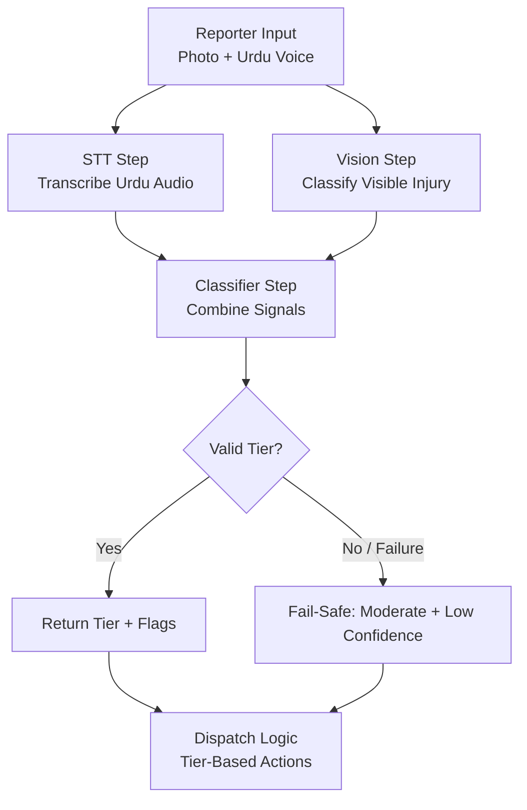
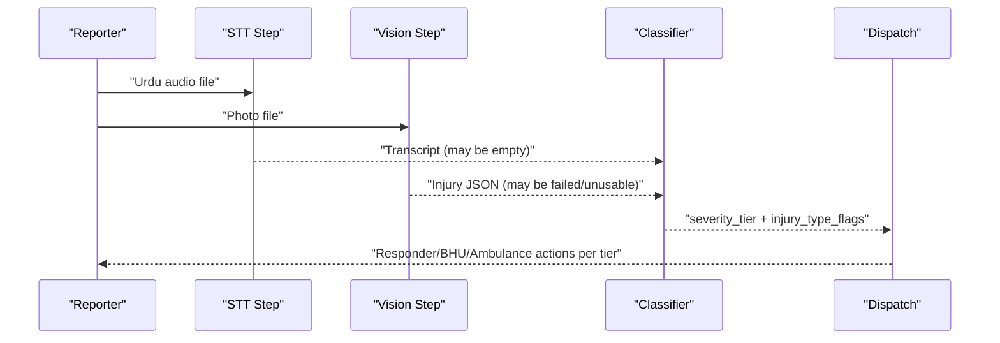
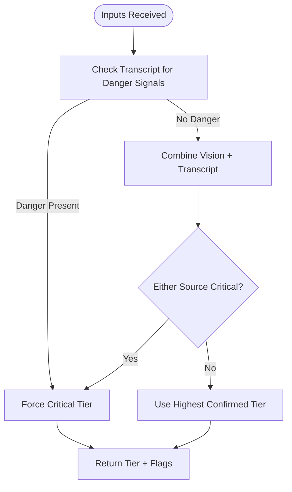
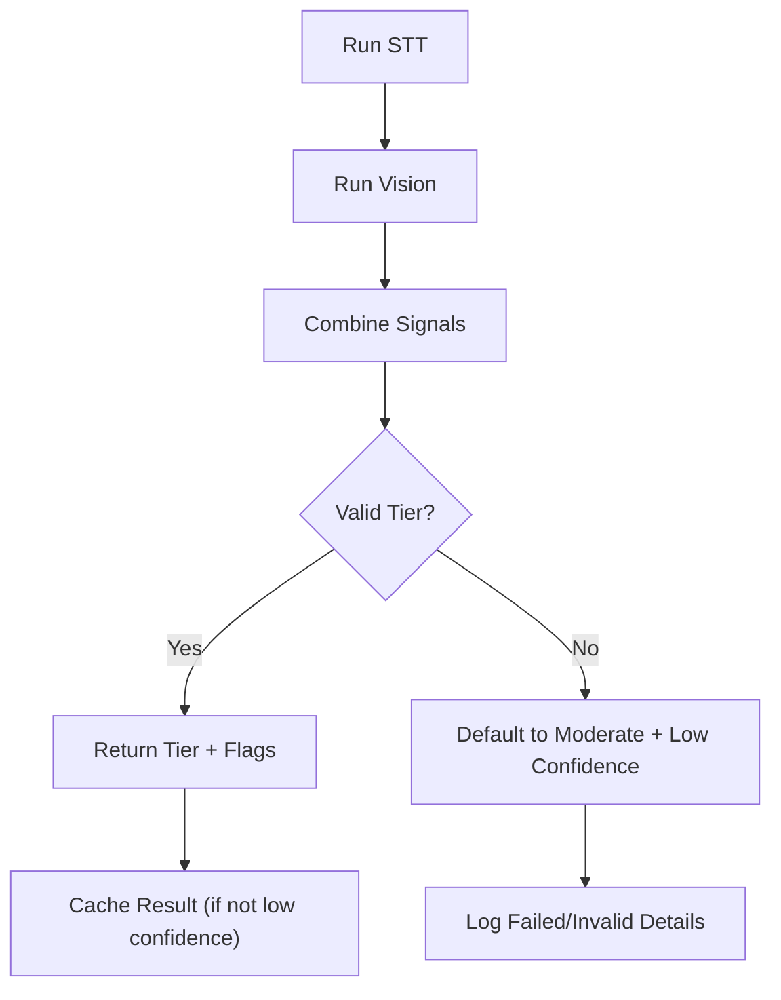
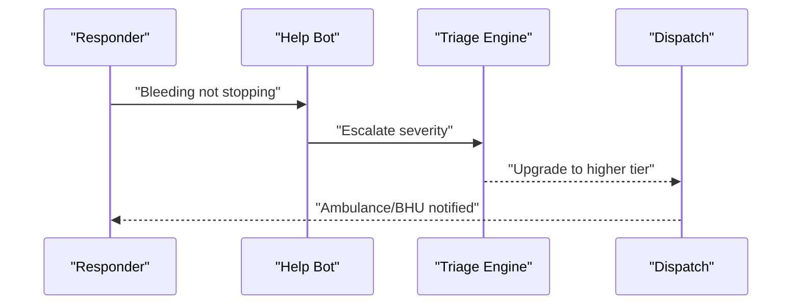
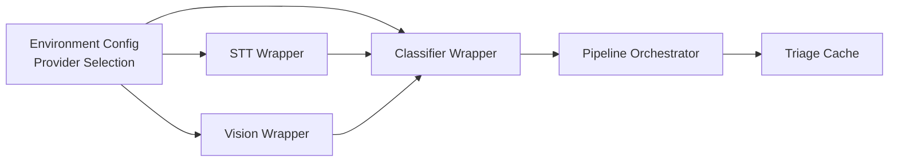

# Severity Classification Engine

<cite>
**Referenced Files in This Document**
- [slice_runner.py](file://backend/slice_runner.py)
- [village-emergency-response-system-spec.md](file://village-emergency-response-system-spec.md)
- [help_bot_content.py](file://backend/services/help_bot_content.py)
- [verify_stt.py](file://backend/verify_stt.py)
- [verify_vision.py](file://backend/verify_vision.py)
</cite>

## Table of Contents
1. [Introduction](#introduction)
2. [Project Structure](#project-structure)
3. [Core Components](#core-components)
4. [Architecture Overview](#architecture-overview)
5. [Detailed Component Analysis](#detailed-component-analysis)
6. [Dependency Analysis](#dependency-analysis)
7. [Performance Considerations](#performance-considerations)
8. [Troubleshooting Guide](#troubleshooting-guide)
9. [Conclusion](#conclusion)

## Introduction
This document explains the multi-modal severity classification engine that combines speech-to-text transcripts with vision analysis to produce a safety-first triage decision. It details the three-tier severity system (minor, moderate, critical), the conflict resolution logic that prioritizes voice-reported danger signals over visual assessment, and the fail-safe behavior that defaults to moderate when AI processing fails or inputs are partial. It also includes examples for handling low-confidence scenarios and conflicting modalities.

## Project Structure
The engine is implemented as a modular pipeline inside the backend slice runner, with verification scripts for each modality and a help bot module that can escalate incidents based on responder feedback.

**Diagram sources**
- [slice_runner.py:305-586](file://backend/slice_runner.py#L305-L586)
- [village-emergency-response-system-spec.md:21-35](file://village-emergency-response-system-spec.md#L21-L35)

**Section sources**
- [slice_runner.py:155-189](file://backend/slice_runner.py#L155-L189)
- [village-emergency-response-system-spec.md:11-35](file://village-emergency-response-system-spec.md#L11-L35)

## Core Components
- Speech-to-text (STT): Transcribes Urdu audio into text; returns usable flag and transcript.
- Vision classifier: Analyzes injury photo and returns injury type, apparent severity, confidence, visible signals, and image usability.
- Triage classifier: Combines transcript and vision output into a single severity tier using explicit rules and conflict resolution.
- Fail-safe: If any step fails or inputs are partial, defaults to moderate severity and flags low confidence.
- Dispatch integration: Uses the final tier to determine responder/BHU/ambulance actions.

Key responsibilities and contracts are defined in the data models and pipeline functions within the slice runner.

**Section sources**
- [slice_runner.py:155-213](file://backend/slice_runner.py#L155-L213)
- [slice_runner.py:367-586](file://backend/slice_runner.py#L367-L586)

## Architecture Overview
The pipeline executes three independent steps and then merges their outputs. Each step has provider-agnostic wrappers so either Gemini or DashScope can be used without changing downstream logic. The classifier enforces a safety-first rule: if voice reports life-threatening signs, the final tier must be at least as severe as the voice indicates, even if the image appears less severe.

**Diagram sources**
- [slice_runner.py:367-586](file://backend/slice_runner.py#L367-L586)
- [village-emergency-response-system-spec.md:21-35](file://village-emergency-response-system-spec.md#L21-L35)

## Detailed Component Analysis

### Three-Tier Severity System
- Minor: Superficial injuries only; dispatch responder only.
- Moderate: Significant injuries (e.g., fractures, deep cuts, burns); dispatch responder and notify BHU on standby.
- Critical: Life-threatening indicators such as unconsciousness, heavy/uncontrolled bleeding, major trauma; dispatch responder, BHU, and ambulance simultaneously without delay.

These tiers are enforced by the classifier prompt and validated before returning results. Any invalid tier falls back to moderate with a low-confidence flag.

**Section sources**
- [village-emergency-response-system-spec.md:21-35](file://village-emergency-response-system-spec.md#L21-L35)
- [slice_runner.py:327-346](file://backend/slice_runner.py#L327-L346)
- [slice_runner.py:557-586](file://backend/slice_runner.py#L557-L586)

### Conflict Resolution Logic (Safety-First)
When transcript and vision disagree, the classifier always adopts the more severe tier. Voice-reported danger signals—such as venomous bites/stings, unconsciousness, uncontrolled bleeding, crushing/machine entanglement, or breathing difficulty—are treated as invisible in photos and must never be downgraded by vision. If either source indicates critical, the final tier is critical.

**Diagram sources**
- [slice_runner.py:327-346](file://backend/slice_runner.py#L327-L346)

**Section sources**
- [slice_runner.py:327-346](file://backend/slice_runner.py#L327-L346)

### STT Step
- Accepts an audio file path and transcribes Urdu audio.
- Returns a dict with text and a usable flag; on failure or missing file, returns a standardized failed signal.
- Supports both Gemini and DashScope providers via a unified wrapper.

Verification script iterates all audio clips, runs transcription through the pipeline, and prints latency and results for human review.

**Section sources**
- [slice_runner.py:367-425](file://backend/slice_runner.py#L367-L425)
- [verify_stt.py:22-52](file://backend/verify_stt.py#L22-L52)

### Vision Step
- Accepts a photo reference (local path or URL) and classifies visible injury.
- Returns structured JSON including injury classification, apparent severity, confidence, visible signals, and image usability.
- On API errors or non-JSON responses, raises exceptions caught by the wrapper and converted to a failed signal.

Verification script processes all images, printing classification, severity, confidence, usability, and latency.

**Section sources**
- [slice_runner.py:428-474](file://backend/slice_runner.py#L428-L474)
- [verify_vision.py:22-49](file://backend/verify_vision.py#L22-L49)

### Classifier Step and Fail-Safe
- Combines transcript and vision into a single severity tier using explicit rules and conflict resolution.
- Validates the returned tier; if invalid or any step fails, defaults to moderate with a low-confidence flag.
- Adds triage signals for auditability and caches successful results to avoid repeated calls.

**Diagram sources**
- [slice_runner.py:509-586](file://backend/slice_runner.py#L509-L586)

**Section sources**
- [slice_runner.py:509-586](file://backend/slice_runner.py#L509-L586)

### Examples: Partial Inputs, Conflicts, and Low Confidence
- Partial inputs: If transcript is empty or image is unusable, the pipeline still produces a tier but adds a low-confidence flag. This ensures dispatch proceeds safely while marking the incident for later review.
- Conflicting information: If vision suggests minor but transcript reports unconsciousness or heavy bleeding, the classifier forces critical due to the safety-first rule.
- Low-confidence scenarios: When either modality fails or is unclear, the result is flagged and defaults to moderate to avoid under-triage.

These behaviors are demonstrated in the test suite scenarios that include real media and edge cases where both photo and voice are missing.

**Section sources**
- [slice_runner.py:537-586](file://backend/slice_runner.py#L537-L586)
- [slice_runner.py:684-737](file://backend/slice_runner.py#L684-L737)

### Help Bot Escalation (Mid-Incident Upgrades)
The help bot uses hardcoded branches for first aid guidance and escalation triggers. If the responder reports worsening conditions (e.g., bleeding not stopping, patient losing consciousness), the bot escalates to higher severity and re-triggers dispatch for BHU/ambulance if needed.

**Diagram sources**
- [help_bot_content.py:107-118](file://backend/services/help_bot_content.py#L107-L118)
- [help_bot_content.py:171-181](file://backend/services/help_bot_content.py#L171-L181)
- [help_bot_content.py:242-252](file://backend/services/help_bot_content.py#L242-L252)

**Section sources**
- [help_bot_content.py:21-43](file://backend/services/help_bot_content.py#L21-L43)
- [help_bot_content.py:107-118](file://backend/services/help_bot_content.py#L107-L118)
- [help_bot_content.py:171-181](file://backend/services/help_bot_content.py#L171-L181)
- [help_bot_content.py:242-252](file://backend/services/help_bot_content.py#L242-L252)

## Dependency Analysis
The pipeline depends on external AI providers for STT, vision, and classification. Provider selection is environment-driven, allowing seamless switching between Gemini and DashScope without code changes. Each step is wrapped to handle timeouts, retries, and failures gracefully.

**Diagram sources**
- [slice_runner.py:132-153](file://backend/slice_runner.py#L132-L153)
- [slice_runner.py:56-95](file://backend/slice_runner.py#L56-L95)
- [slice_runner.py:97-129](file://backend/slice_runner.py#L97-L129)

**Section sources**
- [slice_runner.py:56-95](file://backend/slice_runner.py#L56-L95)
- [slice_runner.py:97-129](file://backend/slice_runner.py#L97-L129)
- [slice_runner.py:132-153](file://backend/slice_runner.py#L132-L153)

## Performance Considerations
- Timeouts: Each AI call respects a configurable timeout to prevent blocking emergency flows.
- Retries: Quota/rate-limit errors trigger bounded retries with exponential backoff to keep the pipeline usable during demos.
- Caching: Successful triage results are cached by media hash to reduce redundant API calls and conserve quotas.
- Latency measurement: Verification scripts measure end-to-end latency for STT and vision steps to monitor performance.

[No sources needed since this section provides general guidance]

## Troubleshooting Guide
- STT failures: If transcription fails or returns empty text, the pipeline treats it as inaudible/missing and continues with vision-only input, adding low-confidence flags.
- Vision failures: If the image is blurry/dark or the model returns non-JSON, the step fails and the classifier proceeds with transcript-only input, again adding low-confidence flags.
- Classifier failures: If the classifier cannot produce a valid tier, the pipeline defaults to moderate with low-confidence to ensure safe dispatch.
- Provider issues: Ensure correct API keys and endpoints are set; the pipeline auto-detects DashScope endpoints based on key length unless overridden.

Operational checks:
- Run verify_stt.py to validate STT accuracy across sample audio clips.
- Run verify_vision.py to validate injury classification across sample photos.
- Review triage_signals in the incident record to understand which step succeeded or failed.

**Section sources**
- [slice_runner.py:367-425](file://backend/slice_runner.py#L367-L425)
- [slice_runner.py:428-474](file://backend/slice_runner.py#L428-L474)
- [slice_runner.py:509-586](file://backend/slice_runner.py#L509-L586)
- [verify_stt.py:22-52](file://backend/verify_stt.py#L22-L52)
- [verify_vision.py:22-49](file://backend/verify_vision.py#L22-L49)

## Conclusion
The severity classification engine implements a robust, safety-first triage process that combines Urdu speech-to-text and vision analysis to assign one of three severity tiers. It enforces strict conflict resolution rules that prioritize voice-reported danger signals, ensuring life-threatening cases are never downgraded. Fail-safe mechanisms default to moderate severity when AI processing fails or inputs are partial, maintaining safe dispatch outcomes. The system is designed for reliability, auditability, and easy provider switching, with verification tools to validate STT and vision performance.