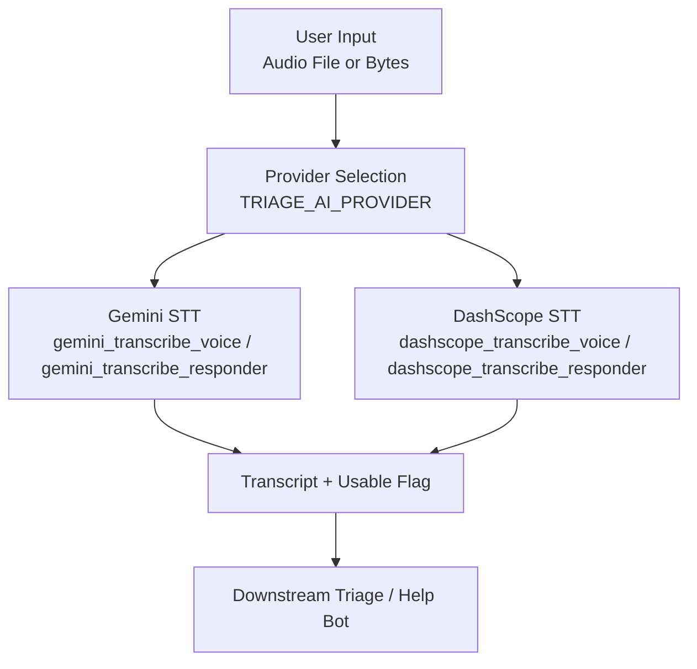
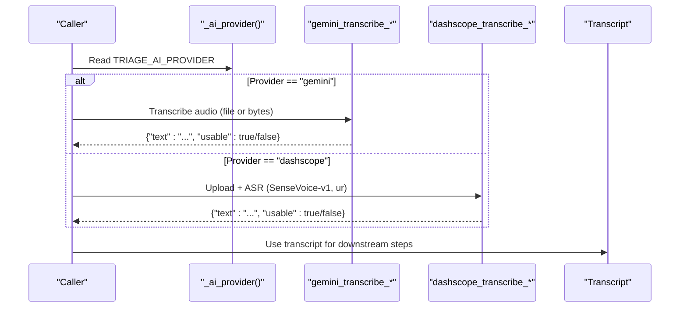
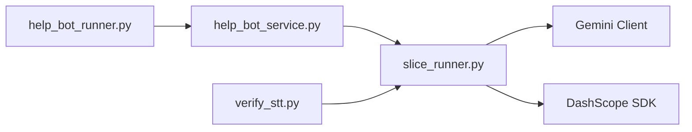

# Speech-to-Text Processing

<cite>
**Referenced Files in This Document**
- [slice_runner.py](file://backend/slice_runner.py)
- [help_bot_service.py](file://backend/services/help_bot_service.py)
- [verify_stt.py](file://backend/verify_stt.py)
- [help_bot_runner.py](file://backend/help_bot_runner.py)
</cite>

## Table of Contents
1. [Introduction](#introduction)
2. [Project Structure](#project-structure)
3. [Core Components](#core-components)
4. [Architecture Overview](#architecture-overview)
5. [Detailed Component Analysis](#detailed-component-analysis)
6. [Dependency Analysis](#dependency-analysis)
7. [Performance Considerations](#performance-considerations)
8. [Troubleshooting Guide](#troubleshooting-guide)
9. [Conclusion](#conclusion)

## Introduction
This document explains the Speech-to-Text (STT) processing component for Urdu audio transcription within the emergency response system. It covers:
- Dual-provider STT implementation supporting Gemini and DashScope services
- Integration with SenseVoice-v1 for Urdu language support via DashScope
- Audio file handling, provider selection via TRIAGE_AI_PROVIDER, and error handling strategies
- Concrete examples of processing audio files, extracting transcripts, and fallback mechanisms when STT fails
- Performance considerations for real-time emergency scenarios and caching strategies to avoid redundant API calls

## Project Structure
The STT logic is implemented across two primary modules:
- Module 1 triage pipeline (audio file-based STT): slice_runner.py
- Module 2 responder help bot (live audio bytes-based STT): help_bot_service.py

Both modules expose a consistent provider boundary so that switching providers requires only an environment variable change.

**Diagram sources**
- [slice_runner.py:369-425](file://backend/slice_runner.py#L369-L425)
- [help_bot_service.py:127-167](file://backend/services/help_bot_service.py#L127-L167)

**Section sources**
- [slice_runner.py:132-139](file://backend/slice_runner.py#L132-L139)
- [help_bot_service.py:120-167](file://backend/services/help_bot_service.py#L120-L167)

## Core Components
- Provider selection: _ai_provider reads TRIAGE_AI_PROVIDER; defaults to "gemini"
- Gemini STT:
  - For files: gemini_transcribe_voice(audio_path)
  - For live bytes: gemini_transcribe_responder(audio_bytes)
- DashScope STT:
  - For files: dashscope_transcribe_voice(audio_path) using SenseVoice-v1 with language hint "ur"
  - For live bytes: dashscope_transcribe_responder(audio_bytes) writes temp file then reuses dashscope_transcribe_voice
- Unified entry points:
  - transcribe_voice_note(audio_ref) returns {"text", "usable"} or FAILED_SIGNAL on errors
  - transcribeResponderInput(audio_bytes) returns {"text", "usable"} or unusable on errors

Key behaviors:
- Gemini uses generate_content with a prompt instructing verbatim Urdu transcription
- DashScope uploads audio, submits async transcription task, waits, fetches results, and concatenates transcript segments
- Both implementations return a normalized result dict with text and usability flag

**Section sources**
- [slice_runner.py:369-425](file://backend/slice_runner.py#L369-L425)
- [help_bot_service.py:127-167](file://backend/services/help_bot_service.py#L127-L167)

## Architecture Overview
The STT layer sits behind a provider boundary. The active provider is selected at runtime via TRIAGE_AI_PROVIDER. Each step has gemini_* and dashscope_* implementations; the caller chooses based on the provider.

**Diagram sources**
- [slice_runner.py:132-139](file://backend/slice_runner.py#L132-L139)
- [slice_runner.py:369-425](file://backend/slice_runner.py#L369-L425)
- [help_bot_service.py:127-167](file://backend/services/help_bot_service.py#L127-L167)

## Detailed Component Analysis

### Provider Selection and Environment
- TRIAGE_AI_PROVIDER controls which provider is used for STT (and other AI steps). Default is "gemini".
- API keys are loaded from .env:
  - GEMINI_API_KEY for Gemini
  - DASHSCOPE_API_KEY for DashScope
- Timeout and retry behavior are shared across AI calls via _triage_timeout_s and _call_with_retry.

Configuration highlights:
- Provider selection: _ai_provider()
- Timeout: TRIAGE_CALL_TIMEOUT_S
- Retry attempts: TRIAGE_QUOTA_RETRIES

**Section sources**
- [slice_runner.py:27-33](file://backend/slice_runner.py#L27-L33)
- [slice_runner.py:36-52](file://backend/slice_runner.py#L36-L52)
- [slice_runner.py:55-69](file://backend/slice_runner.py#L55-L69)
- [slice_runner.py:72-95](file://backend/slice_runner.py#L72-L95)
- [slice_runner.py:132-139](file://backend/slice_runner.py#L132-L139)

### Gemini STT Implementation
- File-based: gemini_transcribe_voice reads audio bytes, constructs a Part, and calls generate_content with model from GEMINI_STT_MODEL (default gemini-3.5-flash). Prompt requests verbatim Urdu transcription.
- Live bytes: gemini_transcribe_responder detects MIME type (WAV vs MP3), builds Part, and calls generate_content similarly.
- Returns {"text", "usable"} where usable indicates non-empty transcript.

Error handling:
- Quota/rate-limit errors are retried via _call_with_retry
- Any final exception propagates up to the wrapper which logs and returns FAILED_SIGNAL or unusable

**Section sources**
- [slice_runner.py:369-381](file://backend/slice_runner.py#L369-L381)
- [help_bot_service.py:127-140](file://backend/services/help_bot_service.py#L127-L140)
- [slice_runner.py:72-95](file://backend/slice_runner.py#L72-L95)

### DashScope STT Implementation (SenseVoice-v1)
- File-based: dashscope_transcribe_voice
  - Uploads audio via _dashscope_upload_file(model="sensevoice-v1")
  - Submits async transcription with language_hints=["ur"]
  - Waits for task completion and fetches transcription URL
  - Concatenates transcript segments into a single string
- Live bytes: dashscope_transcribe_responder
  - Writes bytes to a temporary file (.wav or .mp3 depending on MIME)
  - Reuses dashscope_transcribe_voice with the temp path
  - Cleans up temp file afterward

Error handling:
- Raises RuntimeError on upload failures, task submission errors, wait failures, or subtask not succeeded
- Wrapper functions catch exceptions and return FAILED_SIGNAL or unusable

**Section sources**
- [slice_runner.py:383-411](file://backend/slice_runner.py#L383-L411)
- [help_bot_service.py:142-157](file://backend/services/help_bot_service.py#L142-L157)

### Unified Entry Points and Error Handling
- transcribe_voice_note(audio_ref)
  - Validates file existence
  - Chooses provider implementation
  - Returns {"text", "usable"} or FAILED_SIGNAL on any error
- transcribeResponderInput(audio_bytes)
  - Chooses provider implementation
  - On any exception, logs warning and returns {"text": "", "usable": False}

Fail-safe behavior:
- Downstream components treat empty or failed transcripts as missing input and fall back to safe defaults (e.g., moderate tier with low_confidence_triage)

**Section sources**
- [slice_runner.py:414-425](file://backend/slice_runner.py#L414-L425)
- [help_bot_service.py:159-167](file://backend/services/help_bot_service.py#L159-L167)
- [slice_runner.py:539-586](file://backend/slice_runner.py#L539-L586)

### Audio File Handling
- Gemini expects audio bytes; MIME type detection is handled in the responder flow
- DashScope requires uploading the audio to a remote URL before transcription
- Temporary files are created and cleaned up in the responder flow for DashScope

Examples:
- File-based STT: pass a path to transcribe_voice_note
- Live bytes STT: pass raw PCM/WAV/MP3 bytes to transcribeResponderInput

**Section sources**
- [slice_runner.py:369-381](file://backend/slice_runner.py#L369-L381)
- [slice_runner.py:383-411](file://backend/slice_runner.py#L383-L411)
- [help_bot_service.py:123-157](file://backend/services/help_bot_service.py#L123-L157)

### Transcript Extraction and Normalization
- Gemini: extract resp.text, strip whitespace
- DashScope: fetch JSON from transcription_url, join all transcript texts with spaces, strip whitespace
- Both return normalized dicts with text and usable flags

**Section sources**
- [slice_runner.py:369-381](file://backend/slice_runner.py#L369-L381)
- [slice_runner.py:400-411](file://backend/slice_runner.py#L400-L411)

### Fallback Mechanisms When STT Fails
- If STT fails or returns empty text:
  - Triage pipeline treats transcript as missing and proceeds with vision-only or defaults
  - Final outcome may be set to moderate with low_confidence_triage to ensure safety
- Help bot:
  - If STT fails, intent classification receives unclear or empty input
  - System can route to pre-rendered fail-safe guidance

**Section sources**
- [slice_runner.py:539-586](file://backend/slice_runner.py#L539-L586)
- [help_bot_service.py:159-167](file://backend/services/help_bot_service.py#L159-L167)

## Dependency Analysis

- slice_runner.py provides core STT implementations and provider selection
- help_bot_service.py depends on slice_runner for provider utilities and STT implementations
- help_bot_runner.py orchestrates sessions and uses help_bot_service
- verify_stt.py exercises STT via slice_runner

**Diagram sources**
- [slice_runner.py:132-139](file://backend/slice_runner.py#L132-L139)
- [help_bot_service.py:42-47](file://backend/services/help_bot_service.py#L42-L47)
- [help_bot_runner.py:39-44](file://backend/help_bot_runner.py#L39-L44)
- [verify_stt.py:15-16](file://backend/verify_stt.py#L15-L16)

**Section sources**
- [slice_runner.py:132-139](file://backend/slice_runner.py#L132-L139)
- [help_bot_service.py:42-47](file://backend/services/help_bot_service.py#L42-L47)
- [help_bot_runner.py:39-44](file://backend/help_bot_runner.py#L39-L44)
- [verify_stt.py:15-16](file://backend/verify_stt.py#L15-L16)

## Performance Considerations
- Timeouts:
  - TRIAGE_CALL_TIMEOUT_S sets per-call timeout to prevent blocking during emergencies
- Retries:
  - TRIAGE_QUOTA_RETRIES enables bounded retries on quota/rate-limit errors with exponential backoff
- Caching:
  - Triage results are cached by media hash to avoid redundant AI calls
  - TTS outputs are cached to disk to reduce quota usage and enable deterministic replay
- Real-time considerations:
  - STT latency impacts first response time; prefer provider with lowest latency under your quotas
  - Pre-warming TTS cache reduces cold-start delays in help-bot sessions

Recommendations:
- Set appropriate timeouts for network conditions
- Monitor quota limits and adjust TRIAGE_QUOTA_RETRIES accordingly
- Use caching aggressively for repeated scenarios
- Prefer Gemini for lower latency if available; DashScope for redundancy or specific model needs

[No sources needed since this section provides general guidance]

## Troubleshooting Guide
Common issues and resolutions:
- Missing API keys:
  - Ensure GEMINI_API_KEY and/or DASHSCOPE_API_KEY are set in .env
- Provider import errors:
  - If DashScope SDK is unavailable and TRIAGE_AI_PROVIDER=dashscope, a runtime error will be raised
- STT failures:
  - Check network connectivity and provider quotas
  - Verify audio format compatibility (WAV/MP3)
  - Review logs for specific error messages from upload, task submission, or result fetching
- Empty transcripts:
  - Confirm audio clarity and language (Urdu)
  - Validate prompts and model settings
- Fallback activation:
  - If STT fails, downstream logic should default to safe tiers and pre-rendered guidance

Verification tools:
- verify_stt.py runs STT against sample audio clips and prints ground truth vs. output
- help_bot_runner.py supports --verify-tts to perform TTS -> STT round-trip checks

**Section sources**
- [slice_runner.py:36-52](file://backend/slice_runner.py#L36-L52)
- [slice_runner.py:528-530](file://backend/slice_runner.py#L528-L530)
- [slice_runner.py:414-425](file://backend/slice_runner.py#L414-L425)
- [verify_stt.py:22-52](file://backend/verify_stt.py#L22-L52)
- [help_bot_runner.py:135-172](file://backend/help_bot_runner.py#L135-L172)

## Conclusion
The STT component provides a robust, dual-provider solution for Urdu audio transcription tailored to emergency response workflows. By abstracting provider-specific logic behind a clean interface and leveraging caching, timeouts, and retries, the system ensures reliability and performance even under constrained conditions. The integration with SenseVoice-v1 via DashScope offers a viable alternative when Gemini is unavailable, while Gemini remains the default for its ease of use and strong Urdu support. Proper configuration, monitoring, and verification practices will help maintain high-quality transcription and timely responses in critical scenarios.

[No sources needed since this section summarizes without analyzing specific files]