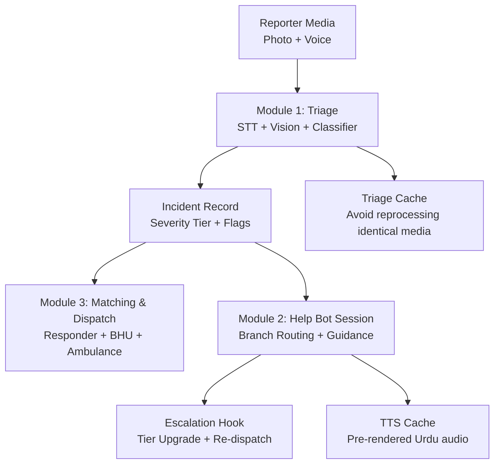
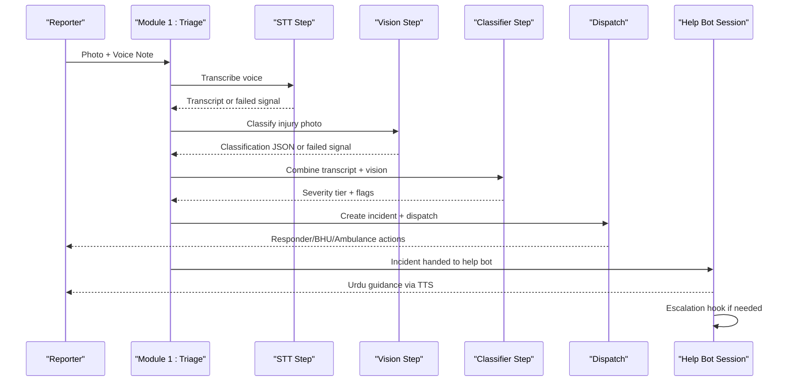
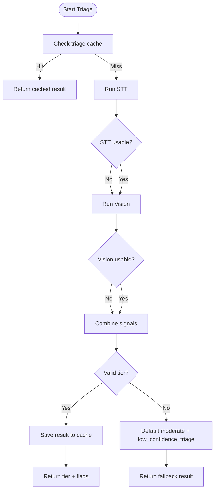
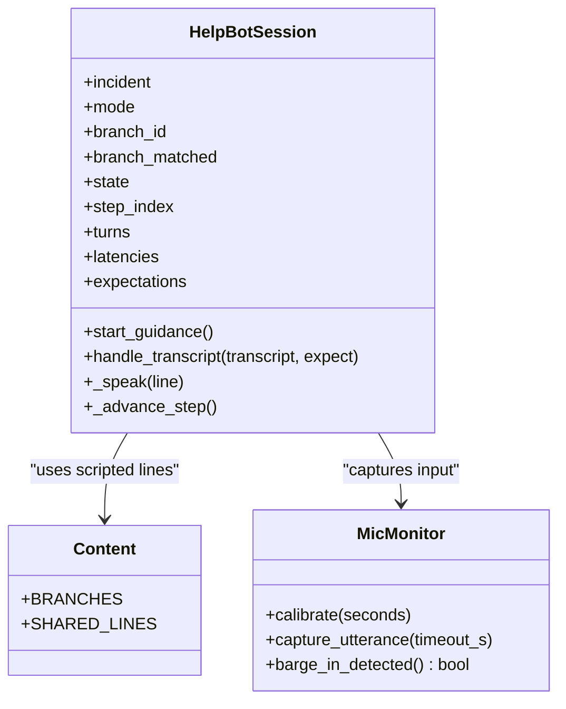
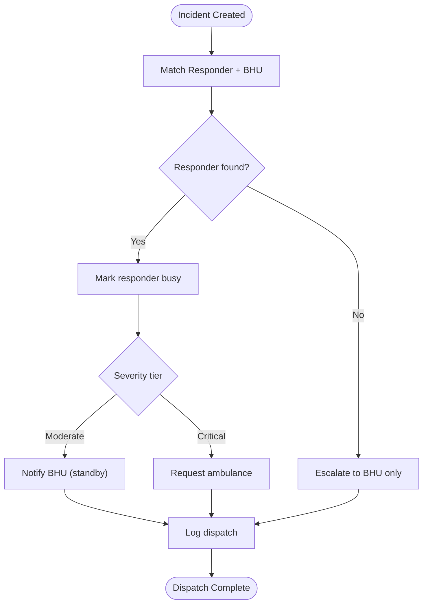
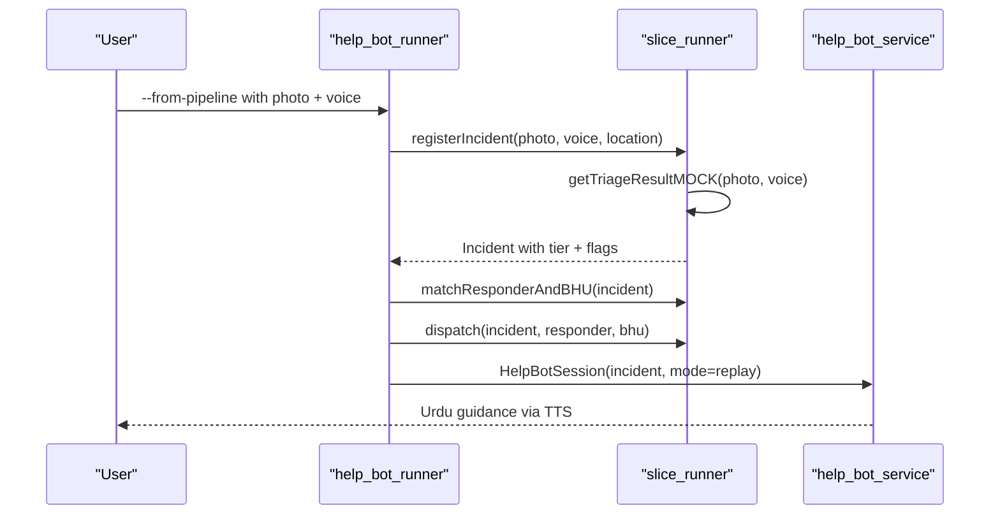

# Triage Pipeline Orchestration

<cite>
**Referenced Files in This Document**
- [help_bot_runner.py](file://backend/help_bot_runner.py)
- [slice_runner.py](file://backend/slice_runner.py)
- [verify_stt.py](file://backend/verify_stt.py)
- [verify_vision.py](file://backend/verify_vision.py)
- [help_bot_service.py](file://backend/services/help_bot_service.py)
- [help_bot_content.py](file://backend/services/help_bot_content.py)
- [PROJECT.md](file://PROJECT.md)
- [village-emergency-response-system-spec.md](file://village-emergency-response-system-spec.md)
</cite>

## Table of Contents
1. Introduction
2. Project Structure
3. Core Components
4. Architecture Overview
5. Detailed Component Analysis
6. Dependency Analysis
7. Performance Considerations
8. Troubleshooting Guide
9. Conclusion
10. Appendices

## Introduction
This document explains the end-to-end triage pipeline orchestration that coordinates emergency assessment from media ingestion to final severity determination, and then hands off to a responder help bot for real-time guidance. It covers:
- Sequential processing steps with parallel opportunities between STT and vision
- Caching strategy for repeated media processing
- Error propagation and fail-safe mechanisms when AI services fail
- Retry logic for transient failures and timeout handling for long-running operations
- Monitoring and logging at each stage
- Performance optimization techniques for high-volume scenarios

The system is designed so that emergencies are never blocked by AI service issues; safe defaults ensure responders receive actionable guidance while dispatch continues.

**Section sources**
- [village-emergency-response-system-spec.md:11-36](file://village-emergency-response-system-spec.md#L11-L36)
- [PROJECT.md:8-14](file://PROJECT.md#L8-L14)

## Project Structure
At a high level:
- Module 1 (triage): Ingests photo + voice note, runs STT and vision classification, combines signals into a severity tier, and creates an incident record.
- Module 2 (responder help bot): Guides responders via Urdu voice using a state machine driven by incident flags and live intent detection.
- Module 3 (matching/dispatch): Matches nearest available responder and links BHU based on location and severity.
- Supporting utilities: Verification scripts for STT and vision, caching layers, and content definitions for the help bot.

**Diagram sources**
- [slice_runner.py:521-586](file://backend/slice_runner.py#L521-L586)
- [help_bot_service.py:663-783](file://backend/services/help_bot_service.py#L663-L783)
- [help_bot_runner.py:92-99](file://backend/help_bot_runner.py#L92-L99)

**Section sources**
- [help_bot_runner.py:1-19](file://backend/help_bot_runner.py#L1-L19)
- [slice_runner.py:159-213](file://backend/slice_runner.py#L159-L213)
- [help_bot_service.py:49-76](file://backend/services/help_bot_service.py#L49-L76)

## Core Components
- Triage pipeline entry point: orchestrates STT, vision, classifier, caching, and fail-safe fallback.
- Provider boundary: pluggable STT/vision/classifier implementations behind environment-driven selection (Gemini or DashScope).
- Help bot session: stateful conversation engine with branch routing, intent detection, scripted guidance, and escalation hook.
- Matching and dispatch: assigns responder, notifies BHU, requests ambulance based on severity tier.
- Verification utilities: standalone checks for STT accuracy and vision classification quality.

Key responsibilities:
- Never block dispatch on AI failure; default to moderate severity with low-confidence flag.
- Keep all spoken guidance as pre-authored content; AI only powers ears (STT) and routing (intent).
- Maintain auditability through transition logs and incident store snapshots.

**Section sources**
- [slice_runner.py:521-586](file://backend/slice_runner.py#L521-L586)
- [help_bot_service.py:120-168](file://backend/services/help_bot_service.py#L120-L168)
- [help_bot_service.py:274-289](file://backend/services/help_bot_service.py#L274-L289)
- [help_bot_service.py:368-388](file://backend/services/help_bot_service.py#L368-L388)
- [slice_runner.py:612-672](file://backend/slice_runner.py#L612-L672)

## Architecture Overview
The orchestration flows from media ingestion through triage to dispatch and help-bot guidance, with robust error handling and caching at each step.

**Diagram sources**
- [slice_runner.py:521-586](file://backend/slice_runner.py#L521-L586)
- [help_bot_service.py:663-783](file://backend/services/help_bot_service.py#L663-L783)
- [help_bot_runner.py:92-99](file://backend/help_bot_runner.py#L92-L99)

## Detailed Component Analysis

### Triage Pipeline (Module 1)
The triage pipeline executes three stages:
1. STT: Transcribes Urdu voice note. Returns text or a failed signal on errors.
2. Vision: Classifies visible injury from photo. Returns structured JSON or a failed signal.
3. Classifier: Combines transcript and vision output into a severity tier and injury flags.

Parallelism and dependencies:
- STT and vision are independent calls and can be executed in parallel to reduce latency. The current implementation invokes them sequentially but the provider boundaries make parallelization straightforward.
- The classifier depends on both STT and vision outputs; it uses safety rules to prefer the more severe tier when inputs conflict.

Caching:
- Results are cached by a hash of photo_ref and voice_note_transcript to avoid redundant AI calls. Fail-safe results are not cached to prevent poisoning the cache with degraded tiers.

Fail-safe behavior:
- If any stage fails or returns unusable data, the pipeline defaults to moderate severity with a low_confidence_triage flag, ensuring dispatch proceeds without delay.

Retry and timeouts:
- Quota/rate-limit retries with exponential backoff for 429 and RESOURCE_EXHAUSTED errors.
- Per-call timeouts configured via environment variables to prevent blocking long-running AI operations.

Monitoring and logging:
- Each stage appends a signal entry with source, provider, status, and detail.
- Warnings are printed for failures and retries, enabling operational visibility.

**Diagram sources**
- [slice_runner.py:97-130](file://backend/slice_runner.py#L97-L130)
- [slice_runner.py:521-586](file://backend/slice_runner.py#L521-L586)

**Section sources**
- [slice_runner.py:367-426](file://backend/slice_runner.py#L367-L426)
- [slice_runner.py:428-475](file://backend/slice_runner.py#L428-L475)
- [slice_runner.py:477-517](file://backend/slice_runner.py#L477-L517)
- [slice_runner.py:521-586](file://backend/slice_runner.py#L521-L586)

### Help Bot Session (Module 2)
The help bot provides hands-free Urdu guidance through a deterministic state machine:
- Branch routing: Maps incident injury flags to predefined branches (heavy bleeding, fracture/crush, snakebite).
- Intent detection: Uses AI only to classify responder utterances into fixed intents (step_done, in_scope_question, out_of_scope, escalation, unclear).
- Scripted guidance: All spoken lines come from a curated content module; AI does not compose medical advice.
- Escalation hook: Upgrades severity tier, merges new flags, marks BHU notification and ambulance request, and logs transitions.

Audio I/O and barge-in:
- Captures microphone input with energy-based VAD and supports barge-in during playback.
- Plays pre-rendered TTS audio; falls back to a pre-cached fail-safe line if TTS fails.

Monitoring and logging:
- Every turn and state transition is recorded with timestamps, triggers, and details.
- Latency metrics per turn are tracked for performance analysis.

**Diagram sources**
- [help_bot_service.py:663-783](file://backend/services/help_bot_service.py#L663-L783)
- [help_bot_service.py:456-570](file://backend/services/help_bot_service.py#L456-L570)
- [help_bot_content.py:21-43](file://backend/services/help_bot_content.py#L21-L43)

**Section sources**
- [help_bot_service.py:94-117](file://backend/services/help_bot_service.py#L94-L117)
- [help_bot_service.py:120-168](file://backend/services/help_bot_service.py#L120-L168)
- [help_bot_service.py:274-289](file://backend/services/help_bot_service.py#L274-L289)
- [help_bot_service.py:368-388](file://backend/services/help_bot_service.py#L368-L388)
- [help_bot_service.py:576-648](file://backend/services/help_bot_service.py#L576-L648)
- [help_bot_service.py:663-783](file://backend/services/help_bot_service.py#L663-L783)

### Matching and Dispatch (Module 3)
Matching and dispatch operate on the incident’s severity tier and location:
- Responder matching: Finds nearest available responder in the same village; marks them busy upon assignment.
- BHU linkage: Notifies linked BHU for moderate and critical tiers; sets standby or urgent status.
- Ambulance request: Automatically requested for critical tier incidents.

State mutation and logging:
- Mutates responder availability to prevent double assignment.
- Logs dispatch status and alerts for ambulance requests.

**Diagram sources**
- [slice_runner.py:612-672](file://backend/slice_runner.py#L612-L672)

**Section sources**
- [slice_runner.py:612-672](file://backend/slice_runner.py#L612-L672)

### Verification Utilities
Standalone verification scripts validate individual components:
- STT verification: Runs transcriptions against all audio clips, prints ground truth vs output, measures latency, and reports failures.
- Vision verification: Runs injury classification on all photos, prints classification details and latency, and reports API errors.

These tools enable continuous quality assurance before integrating changes into the pipeline.

**Section sources**
- [verify_stt.py:22-52](file://backend/verify_stt.py#L22-L52)
- [verify_vision.py:22-49](file://backend/verify_vision.py#L22-L49)

## Dependency Analysis
Provider boundaries isolate AI implementations:
- STT: gemini_transcribe_voice vs dashscope_transcribe_voice
- Vision: gemini_classify_injury vs dashscope_classify_injury
- Classifier: gemini_combine_signals vs dashscope_combine_signals
- Help bot STT/intent/TTS: mirrored provider boundaries

Environment-driven selection:
- TRIAGE_AI_PROVIDER selects active provider (default Gemini).
- Model names configurable via environment variables per step.

Coupling and cohesion:
- slice_runner centralizes provider selection, retry logic, timeouts, and caching.
- help_bot_service focuses on conversation flow, content, and escalation hooks.
- help_bot_runner orchestrates end-to-end runs, including pipeline integration and replay modes.

Potential circular dependencies:
- None detected; modules import slice_runner for contracts and helpers, while services depend on slice_runner functions but not vice versa.

External integrations:
- Google GenAI (Gemini) and DashScope SDK for STT, vision, and classification.
- Audio hardware via sounddevice for live mic capture and playback.

**Section sources**
- [slice_runner.py:27-69](file://backend/slice_runner.py#L27-L69)
- [slice_runner.py:132-154](file://backend/slice_runner.py#L132-L154)
- [help_bot_service.py:120-168](file://backend/services/help_bot_service.py#L120-L168)
- [help_bot_service.py:244-289](file://backend/services/help_bot_service.py#L244-L289)
- [help_bot_service.py:307-338](file://backend/services/help_bot_service.py#L307-L338)

## Performance Considerations
Optimization techniques for high-volume emergency scenarios:
- Parallelize STT and vision calls: Since they are independent, executing them concurrently reduces total triage latency.
- Pre-warm TTS cache: Render all scripted lines once to eliminate runtime TTS quota consumption and ensure deterministic responses.
- Use triage cache: Avoid redundant AI calls for identical media pairs; cache keys derived from photo_ref and voice_note_transcript.
- Tune timeouts and retries: Adjust TRIAGE_CALL_TIMEOUT_S and TRIAGE_QUOTA_RETRIES to balance responsiveness and resilience under load.
- Batch verification: Run verify_stt.py and verify_vision.py periodically to detect regressions early.
- Monitor latencies: Track per-turn latencies in help bot sessions to identify bottlenecks in STT, intent detection, or TTS.

Operational tips:
- Ensure audio hardware is available for live mode; replay mode works headlessly.
- Use offline-friendly paths for media references to minimize I/O delays.
- Keep model endpoints and credentials up to date in .env to avoid authentication overhead.

[No sources needed since this section provides general guidance]

## Troubleshooting Guide
Common issues and resolutions:
- STT failures: Check audio file existence and format; review warnings for provider-specific errors; use verify_stt.py to diagnose clip-by-clip.
- Vision failures: Validate image paths and formats; review warnings for non-JSON outputs; use verify_vision.py to assess classification reliability.
- Quota limits: Increase TRIAGE_QUOTA_RETRIES or wait for rate limit windows; pre-warm TTS cache to avoid quota exhaustion during replays.
- Timeout errors: Adjust TRIAGE_CALL_TIMEOUT_S to accommodate slow models; monitor latency logs to identify prolonged calls.
- Missing audio devices: In headless environments, playback will be skipped; rely on saved WAV files and transcripts for evidence.
- Escalation not triggering: Verify intent detection prompts and escalation signals; check help_bot_transitions for missing escalation events.

Error propagation patterns:
- Failed STT/vision steps return FAILED_SIGNAL; classifier handles partial inputs safely.
- Help bot falls back to pre-rendered fail-safe audio if TTS fails; ensures continuous guidance.
- Dispatch continues even with low-confidence triage; moderate tier ensures BHU notification and potential ambulance request.

**Section sources**
- [slice_runner.py:72-95](file://backend/slice_runner.py#L72-L95)
- [slice_runner.py:414-426](file://backend/slice_runner.py#L414-L426)
- [slice_runner.py:467-475](file://backend/slice_runner.py#L467-L475)
- [help_bot_service.py:689-695](file://backend/services/help_bot_service.py#L689-L695)
- [help_bot_service.py:727-750](file://backend/services/help_bot_service.py#L727-L750)

## Conclusion
The triage pipeline orchestration delivers a resilient, auditable emergency assessment workflow that prioritizes speed and safety. By separating STT and vision into provider-agnostic steps, enforcing fail-safe defaults, and maintaining comprehensive logs, the system ensures that emergencies are processed efficiently even when AI services encounter transient failures. The help bot complements triage with deterministic, Urdu-first guidance and escalation capabilities, while caching strategies optimize performance for high-volume scenarios. Continuous verification and monitoring keep the pipeline reliable and responsive under real-world conditions.

[No sources needed since this section summarizes without analyzing specific files]

## Appendices

### Example Pipeline Execution Flow
A typical execution involves:
1. Ingesting photo and voice note
2. Running STT and vision classification
3. Combining signals into a severity tier
4. Dispatching responder and BHU
5. Initiating help bot session with branch-specific guidance
6. Logging transitions and outcomes

**Diagram sources**
- [help_bot_runner.py:92-99](file://backend/help_bot_runner.py#L92-L99)
- [slice_runner.py:589-609](file://backend/slice_runner.py#L589-L609)
- [help_bot_service.py:663-783](file://backend/services/help_bot_service.py#L663-L783)

### Monitoring and Logging Points
- Triage signals: Source, provider, status, and detail for STT, vision, and classifier
- Dispatch logs: Responder assignment, BHU notification, ambulance requests
- Help bot transitions: State changes, triggers, and latency metrics
- Verification outputs: STT and vision quality assessments with latency measurements

**Section sources**
- [slice_runner.py:537-586](file://backend/slice_runner.py#L537-L586)
- [slice_runner.py:665-672](file://backend/slice_runner.py#L665-L672)
- [help_bot_service.py:696-712](file://backend/services/help_bot_service.py#L696-L712)
- [verify_stt.py:22-52](file://backend/verify_stt.py#L22-L52)
- [verify_vision.py:22-49](file://backend/verify_vision.py#L22-L49)