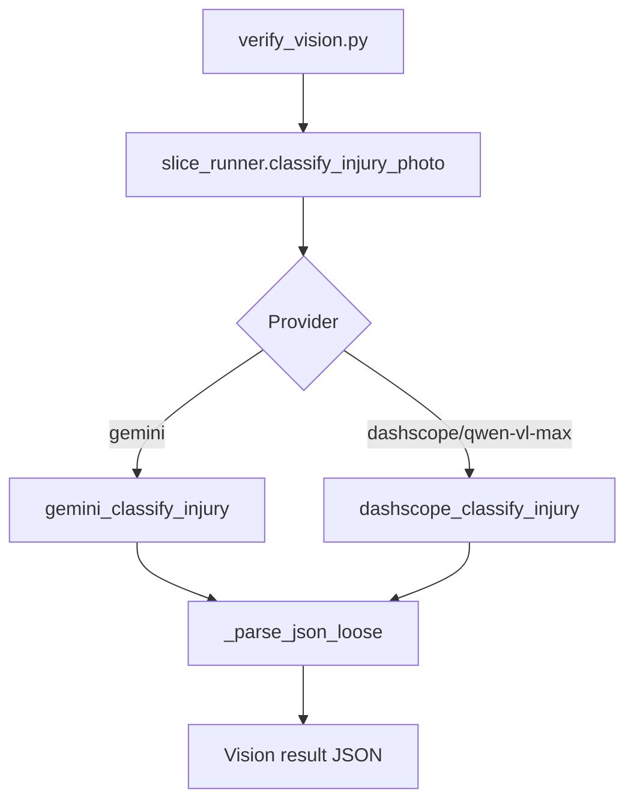
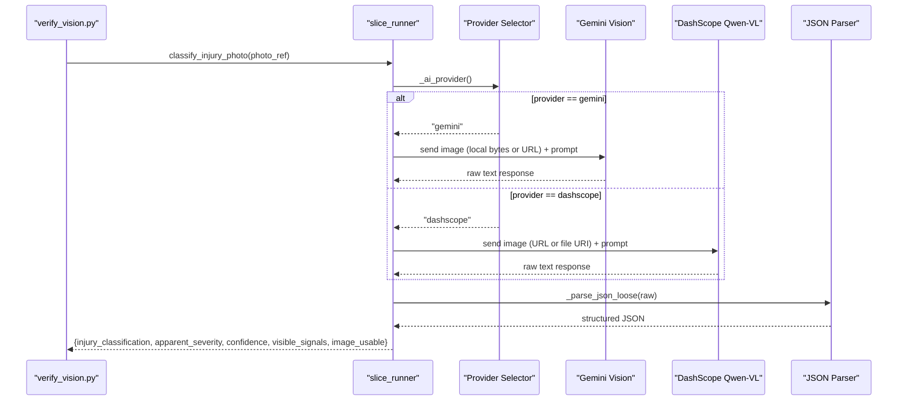
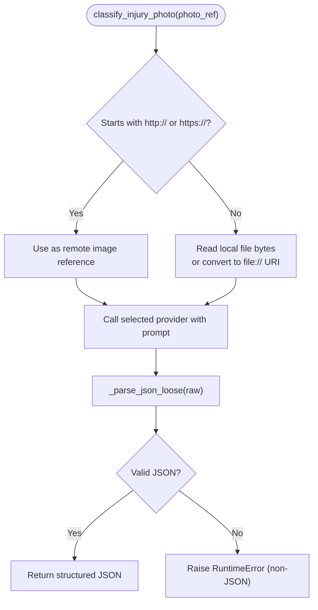
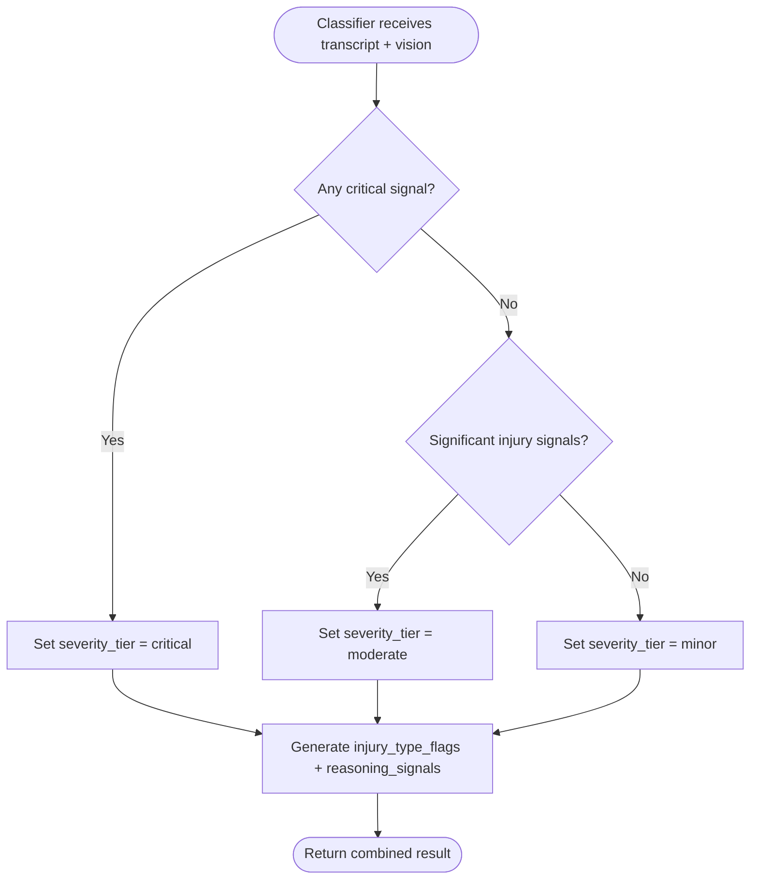
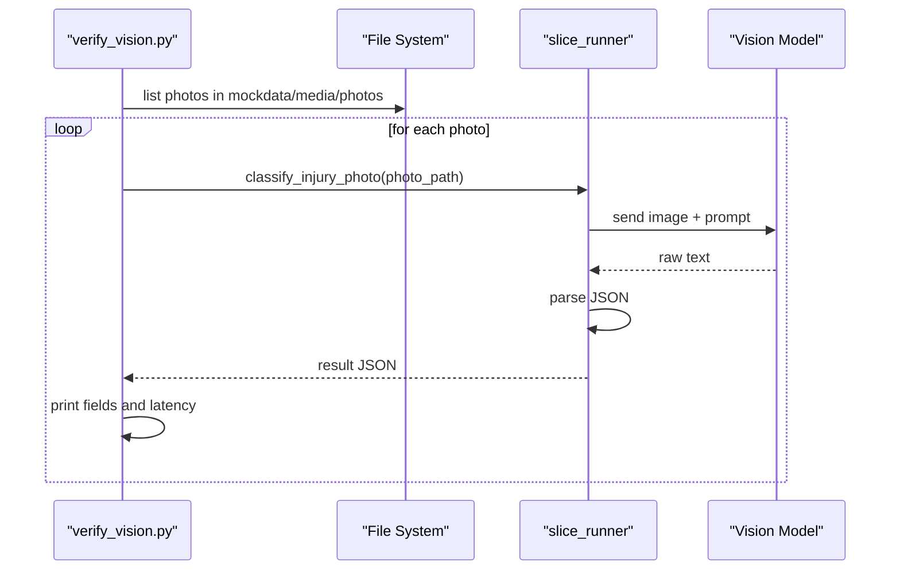

# Vision Injury Classification

<cite>
**Referenced Files in This Document**
- [slice_runner.py](file://backend/slice_runner.py)
- [verify_vision.py](file://backend/verify_vision.py)
- [PROJECT.md](file://PROJECT.md)
- [0a494362c7b0d139.json](file://mockdata/media/.triage_cache/0a494362c7b0d139.json)
</cite>

## Table of Contents
1. [Introduction](#introduction)
2. [Project Structure](#project-structure)
3. [Core Components](#core-components)
4. [Architecture Overview](#architecture-overview)
5. [Detailed Component Analysis](#detailed-component-analysis)
6. [Dependency Analysis](#dependency-analysis)
7. [Performance Considerations](#performance-considerations)
8. [Troubleshooting Guide](#troubleshooting-guide)
9. [Conclusion](#conclusion)
10. [Appendices](#appendices)

## Introduction
This document explains the vision-based injury classification system that uses Qwen-VL models (via DashScope) and a Gemini fallback to analyze emergency photos, support both local files and remote URLs, handle common image formats, and produce structured JSON outputs for triage decisions. It covers the image analysis pipeline, classification categories, severity assessment logic, confidence scoring, image quality assessment, error handling for corrupted images, network failures, and model response parsing issues.

The system is part of an emergency triage workflow that combines voice transcription and visual analysis to determine severity tiers and actionable flags for responders.

**Section sources**
- [PROJECT.md:8-19](file://PROJECT.md#L8-L19)

## Project Structure
At a high level:
- The backend module implements the triage pipeline with provider-agnostic steps for speech-to-text, vision classification, and severity combination.
- A verification script iterates over sample photos and prints classification results and latency.
- Mock data includes cached triage results demonstrating expected output structure and field values.

**Diagram sources**
- [verify_vision.py:22-49](file://backend/verify_vision.py#L22-L49)
- [slice_runner.py:430-474](file://backend/slice_runner.py#L430-L474)

**Section sources**
- [verify_vision.py:1-57](file://backend/verify_vision.py#L1-L57)
- [slice_runner.py:1-154](file://backend/slice_runner.py#L1-L154)

## Core Components
- Provider selection: TRIAGE_AI_PROVIDER controls whether the pipeline uses Gemini or DashScope (Qwen-VL).
- Vision step: Accepts local file paths or remote URLs; supports JPEG/PNG (and other formats via SDK behavior); returns structured JSON including injury_classification, apparent_severity, confidence, visible_signals, and image_usable.
- Classifier step: Combines transcript and vision output into a final severity tier and injury_type_flags with safety rules favoring higher severity when inputs conflict.
- Cache: Results are cached by media fingerprint to reduce API calls and improve demo performance.

Key behaviors:
- Local files: read bytes from path; for DashScope, converted to file URI scheme.
- Remote URLs: passed directly to providers as URIs.
- Image formats: explicit MIME types used for Gemini; DashScope handles multimodal input via URI.
- Structured JSON: strict schema enforced by prompts and parsed with tolerant JSON extraction.

**Section sources**
- [slice_runner.py:132-154](file://backend/slice_runner.py#L132-L154)
- [slice_runner.py:316-325](file://backend/slice_runner.py#L316-L325)
- [slice_runner.py:430-474](file://backend/slice_runner.py#L430-L474)
- [slice_runner.py:107-129](file://backend/slice_runner.py#L107-L129)

## Architecture Overview
The vision classification pipeline is one leg of a broader triage flow. For this document, we focus on the vision branch and its integration with the classifier.

**Diagram sources**
- [verify_vision.py:22-49](file://backend/verify_vision.py#L22-L49)
- [slice_runner.py:430-474](file://backend/slice_runner.py#L430-L474)
- [slice_runner.py:349-364](file://backend/slice_runner.py#L349-L364)

## Detailed Component Analysis

### Vision Step: Local Files and Remote URLs
- Input: photo_ref can be a local file path or a remote URL starting with http:// or https://.
- Gemini path:
  - Remote URL: sent as a URI with mime type image/jpeg.
  - Local file: read bytes and sent with mime type image/png.
- DashScope path:
  - Remote URL: used directly.
  - Local file: converted to a file:// URI before sending to qwen-vl-max.
- Output: structured JSON with fields defined by the vision prompt.

**Diagram sources**
- [slice_runner.py:430-474](file://backend/slice_runner.py#L430-L474)
- [slice_runner.py:349-364](file://backend/slice_runner.py#L349-L364)

**Section sources**
- [slice_runner.py:430-474](file://backend/slice_runner.py#L430-L474)

### Classification Categories and Severity Assessment
- Categories returned by the vision model include: laceration, burn, fracture_indicator, heavy_bleeding, bruise, swelling, no_visible_injury, unclear.
- Apparent severity levels: minor, moderate, critical, unclear.
- Confidence: numeric value between 0.0 and 1.0 indicating model confidence.
- Visible signals: short observable facts extracted from the image.
- Image usability: boolean flag indicating if the image is clear enough to assess.

Severity combination logic (classifier):
- Inputs: transcript (optional) and vision JSON (optional).
- Rules:
  - Critical if life-threatening signs are present (e.g., unconsciousness, heavy/uncontrolled bleeding, major trauma).
  - Moderate for significant injuries (fracture, deep cut, burn, heavy bruising).
  - Minor for superficial injuries only.
  - If either source indicates critical, final tier is critical (safety-first rule).
  - If both inputs are missing/unclear, default to moderate (safer default).
- Output: severity_tier, injury_type_flags, reasoning_signals.

**Diagram sources**
- [slice_runner.py:327-346](file://backend/slice_runner.py#L327-L346)

**Section sources**
- [slice_runner.py:316-346](file://backend/slice_runner.py#L316-L346)

### Structured JSON Output Format
The vision step returns a JSON object with these fields:
- injury_classification: one of the supported categories listed above.
- apparent_severity: minor, moderate, critical, or unclear.
- confidence: number between 0.0 and 1.0.
- visible_signals: array of short strings describing observable facts.
- image_usable: boolean indicating if the image is usable for assessment.

Example usage and fields can be observed in cached triage results.

**Section sources**
- [slice_runner.py:316-325](file://backend/slice_runner.py#L316-L325)
- [0a494362c7b0d139.json:1-42](file://mockdata/media/.triage_cache/0a494362c7b0d139.json#L1-L42)

### Image Processing Workflows and Examples
- Verification script scans mock photos and runs classification for each, printing classification, severity, confidence, usability, signals, and latency.
- Example workflow:
  - Provide a local PNG/JPEG path or a remote URL to classify_injury_photo.
  - Pipeline selects provider based on environment variable.
  - Model returns JSON; parser extracts it even if wrapped in markdown fences or prose.
  - Result is printed by verify_vision.py.

**Diagram sources**
- [verify_vision.py:22-49](file://backend/verify_vision.py#L22-L49)
- [slice_runner.py:430-474](file://backend/slice_runner.py#L430-L474)

**Section sources**
- [verify_vision.py:18-49](file://backend/verify_vision.py#L18-L49)
- [slice_runner.py:430-474](file://backend/slice_runner.py#L430-L474)

### Confidence Scoring Mechanisms
- Confidence is provided by the vision model as a float between 0.0 and 1.0.
- The pipeline does not alter confidence; downstream logic may use it implicitly through image_usable and overall triage signals.
- When inputs are degraded (missing transcript or unusable image), the classifier adds a low_confidence_triage flag to indicate reduced reliability.

**Section sources**
- [slice_runner.py:316-325](file://backend/slice_runner.py#L316-L325)
- [slice_runner.py:571-575](file://backend/slice_runner.py#L571-L575)

### Quality Assessment for Image Usability
- image_usable indicates whether the image is clear enough to assess (e.g., not blurry/dark/no injury visible).
- The pipeline treats failed or unusable images as degraded inputs and adjusts confidence flags accordingly.
- The verification script reports image_usable per photo.

**Section sources**
- [slice_runner.py:316-325](file://backend/slice_runner.py#L316-L325)
- [verify_vision.py:42-45](file://backend/verify_vision.py#L42-L45)

## Dependency Analysis
- Environment variables:
  - TRIAGE_AI_PROVIDER: selects gemini or dashscope.
  - DASHSCOPE_API_KEY and optional DASHSCOPE_BASE_URL: required for DashScope.
  - GEMINI_API_KEY: required for Gemini.
  - TRIAGE_CALL_TIMEOUT_S: per-call timeout controlling fail-safe behavior.
  - TRIAGE_QUOTA_RETRIES: retry attempts for quota/rate-limit errors.
- External dependencies:
  - Google GenAI client for Gemini.
  - DashScope SDK for Qwen-VL and ASR.
- Internal dependencies:
  - Provider selector delegates to specific implementations.
  - JSON parser tolerates markdown fences and stray prose.

**Diagram sources**
- [slice_runner.py:27-69](file://backend/slice_runner.py#L27-L69)
- [slice_runner.py:132-154](file://backend/slice_runner.py#L132-L154)
- [slice_runner.py:349-364](file://backend/slice_runner.py#L349-L364)

**Section sources**
- [slice_runner.py:27-69](file://backend/slice_runner.py#L27-L69)
- [slice_runner.py:132-154](file://backend/slice_runner.py#L132-L154)

## Performance Considerations
- Timeouts: Per-call timeouts prevent blocking the emergency flow; on expiry, the pipeline falls back to safe defaults.
- Retries: Quota/rate-limit errors trigger bounded retries with exponential backoff to keep demos functional.
- Caching: Identical media combinations are cached to reduce API calls and speed up repeated runs.
- Latency measurement: Verification script measures and prints latency per photo.

Recommendations:
- Tune TRIAGE_CALL_TIMEOUT_S based on network conditions and model responsiveness.
- Adjust TRIAGE_QUOTA_RETRIES to balance resilience and latency.
- Use caching judiciously; avoid caching low-confidence fallbacks to prevent degradation.

[No sources needed since this section provides general guidance]

## Troubleshooting Guide
Common issues and handling:
- Corrupted or unreadable images:
  - Local file read errors raise exceptions; caught by step wrappers and return FAILED_SIGNAL.
  - DashScope file URI conversion fails if path is invalid; handled similarly.
- Network failures:
  - HTTP timeouts and API errors raise exceptions; caught and logged; pipeline returns FAILED_SIGNAL and later falls back to moderate severity with low_confidence_triage.
- Model response parsing issues:
  - Non-JSON responses raise RuntimeErrors; caught by step wrappers and treated as failures.
  - Tolerant parser strips markdown fences and extracts JSON objects when possible.
- Missing credentials:
  - Missing API keys raise RuntimeErrors at startup; ensure .env contains required keys.

Operational checks:
- Verify TRIAGE_AI_PROVIDER matches available SDKs and keys.
- Confirm DASHSCOPE_BASE_URL aligns with key region (auto-detected if unset).
- Inspect triage_signals in full pipeline results to identify which step failed.

**Section sources**
- [slice_runner.py:36-52](file://backend/slice_runner.py#L36-L52)
- [slice_runner.py:72-95](file://backend/slice_runner.py#L72-L95)
- [slice_runner.py:349-364](file://backend/slice_runner.py#L349-L364)
- [slice_runner.py:430-474](file://backend/slice_runner.py#L430-L474)
- [slice_runner.py:577-586](file://backend/slice_runner.py#L577-L586)

## Conclusion
The vision-based injury classification system integrates Qwen-VL (DashScope) and Gemini to analyze emergency photos, supporting both local files and remote URLs, and producing structured JSON outputs with clear categories, severity assessments, confidence scores, and image usability flags. Robust error handling ensures the pipeline remains resilient against corrupted images, network issues, and parsing anomalies, while caching and timeouts optimize performance for emergency workflows.

[No sources needed since this section summarizes without analyzing specific files]

## Appendices

### Configuration Reference
- TRIAGE_AI_PROVIDER: gemini | dashscope
- DASHSCOPE_API_KEY: required for DashScope
- DASHSCOPE_BASE_URL: optional; auto-detected based on key length if unset
- GEMINI_API_KEY: required for Gemini
- TRIAGE_CALL_TIMEOUT_S: per-call timeout in seconds
- TRIAGE_QUOTA_RETRIES: number of retries on quota/rate-limit errors

**Section sources**
- [slice_runner.py:27-69](file://backend/slice_runner.py#L27-L69)
- [slice_runner.py:132-154](file://backend/slice_runner.py#L132-L154)