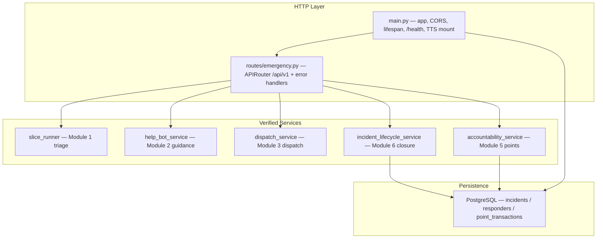

# FastAPI HTTP API Layer

<cite>
**Referenced Files in This Document**
- [main.py](file://backend/main.py)
- [emergency.py](file://backend/routes/emergency.py)
- [test_api_routes.py](file://backend/test_api_routes.py)
- [requirements.txt](file://backend/requirements.txt)
</cite>

## Table of Contents
1. Introduction
2. Architecture Overview
3. Endpoint Reference
4. Error Contract
5. Health Check & Operations
6. Help-Bot Session Model
7. Testing & Verification
8. Conclusion

## Introduction
The FastAPI HTTP API layer exposes the verified Module 1/2/3/5/6/6.5 service stack as a REST API for client apps (field report app, BHU dashboard, responder app). It is a PURE CONTROLLER: payload validation, service invocation, and response shaping only — no domain logic. Every endpoint lives under the `/api/v1` prefix, Swagger UI is served at `/docs`, and every error body follows the project error contract: JSON `{"code": <STRING_CODE>, "message": <detail>}`.

**Sources** · [emergency.py:1-55](file://backend/routes/emergency.py#L1-L55) · [main.py:78-103](file://backend/main.py#L78-L103)

## Architecture Overview

Boot sequence (`lifespan` in main.py):
1. `Base.metadata.create_all(engine)` — idempotent table initialization (incidents, responders, point_transactions).
2. `rehydrate_store_from_db()` — Module 6.5 reloads persisted incidents into `INCIDENT_STORE` so a restart preserves lifecycle history.
3. Responder registry seeding — `seed_responders_from_contract()` only when the responders table is empty (seed data over admin panels).

CORS is wide open (`allow_origins=["*"]`) for hackathon client prototyping; tighten before production. Cached Urdu TTS audio is served from `/media/helpbot/tts_cache` (StaticFiles over `mockdata/helpbot/tts_cache`).

**Sources** · [main.py:47-103](file://backend/main.py#L47-L103)

## Endpoint Reference

All routes are registered by `app.include_router(router)` where `router = APIRouter(prefix="/api/v1", tags=["Emergency Network"])`.

| Method | Path | Status | Purpose |
|---|---|---|---|
| POST | /api/v1/emergency/report | 201 | Module 1 triage + Module 3 dispatch + PostgreSQL persistence |
| GET | /api/v1/emergency/incident/{incident_id} | 200 | Full Module 6.5 lifecycle record |
| POST | /api/v1/emergency/incident/{incident_id}/close | 200 | Module 6 closure + Module 5 award receipt |
| POST | /api/v1/responder/respond | 200 | Module 3 ack (accept) or decline + fallback walk |
| POST | /api/v1/helpbot/step | 200 | One stateful Module 2 guidance turn |
| GET | /api/v1/accountability/responder/{responder_id}/scorecard | 200 | Module 5 deterministic scorecard |
| GET | /api/v1/accountability/leaderboard | 200 | Module 5 ranked registry (optional village filter) |
| GET | /health | 200 | DB probe + AI provider + incident/session counters |

### POST /emergency/report (form-encoded)
Fields: `latitude`, `longitude`, `village_id`, `reporter_id` (optional, defaults REP-USER-001), `photo_ref`, `voice_ref`. Validation order: location/village identity (`VALIDATION_ERROR`) → photo (`MISSING_PHOTO`) → voice (`MISSING_VOICE_INPUT`). Flow: `registerIncident` (AI triage, cache-friendly for identical media pairs) → `dispatchIncident` (Module 3 canonical entry: match + notify + busy-mark + ack timer) → `logIncident` → `upsert_incident_to_db` (non-fatal). Response: `{incident, dispatch: {status, responder, bhu, notify_bhu, bhu_urgency, ambulance_requested, reasoning}, db_persisted}`.

### GET /emergency/incident/{incident_id}
Returns the full lifecycle record via `getIncidentRecord` (DB-first, then in-memory store): registration snapshot, `dispatch_events`, `help_bot_transitions`, outcome/closure fields. Unknown id → 404 `INCIDENT_NOT_FOUND`.

### POST /emergency/incident/{incident_id}/close
Body: `{outcome, confirmed_by, closed_by_id}`. Pre-checks: unknown → 404 `INCIDENT_NOT_FOUND`; already closed → 409 `ALREADY_CLOSED`; outcome/confirmed_by outside the valid sets → 400 `VALIDATION_ERROR`. On success calls `closeIncident` (releases the responder, cancels the ack timer, writes through to PostgreSQL) and, only when `confirmed_by == "bhu_staff"` (the Module 5 fraud gate), `awardPointsForIncident`. Response: `{incident, points_award, closed_by_id}` — `points_award` is `null` for responder-confirmed closures.

### POST /responder/respond
Body: `{incident_id, responder_id, action: accept|decline, reason?}`. Conflict checks: 404 unknown incident, 409 `INCIDENT_CLOSED`, 409 `NOT_ASSIGNED_RESPONDER`. Accept calls `acknowledgeDispatch` (cancels the ack timer, logs `responder_acknowledged`); decline calls `handleResponderDecline` (decliner → available, immediate fallback walk, `responder_declined` + `fallback_triggered`/`all_responders_exhausted` events). Response carries the fresh `dispatch_events` timeline and `responder_status_after`.

### POST /helpbot/step
Body: `{incident_id, responder_transcript}`. One turn of the stateful guidance session (see Help-Bot Session Model). Response: `{incident_id, branch_id, state, intent, qa_entry_id, escalation_signal, escalated, escalation_snapshot, spoken_text_urdu, step_index, step_id, turn_count, audio_url, audio_cached}`. Empty transcript costs zero AI calls and speaks the fail-safe line. Closed incident → 409.

### GET /accountability/*
`scorecard`: `calculateResponderScorecard` after a registry existence check (unknown responder → 404 `RESPONDER_NOT_FOUND`). `leaderboard`: `{village_id, leaderboard}` wrapping `getVillageLeaderboard(village_id)` — points DESC; omit `village_id` for the global board.

**Sources** · [emergency.py:188-560](file://backend/routes/emergency.py#L188-L560)

## Error Contract
`install_error_handlers(app)` guarantees every failure path returns JSON `{"code", "message"}`:

| Code | HTTP | Meaning |
|---|---|---|
| VALIDATION_ERROR | 400 | Missing/invalid payload fields, invalid outcome or confirmer |
| MISSING_PHOTO | 400 | Report without a photo ref |
| MISSING_VOICE_INPUT | 400 | Report without a voice ref |
| INCIDENT_NOT_FOUND | 404 | Unknown incident id |
| RESPONDER_NOT_FOUND | 404 | Unknown responder id |
| NOT_ASSIGNED_RESPONDER | 409 | Respond action by the wrong responder |
| INCIDENT_CLOSED | 409 | Action on a closed (immutable) incident |
| ALREADY_CLOSED | 409 | Double-close attempt |
| INTERNAL_ERROR | 500 | Unhandled exception (message truncated to 300 chars) |

Controller-level errors raise `ApiError(status, code, message)`; FastAPI validation errors (422) are remapped to 400 `VALIDATION_ERROR`; service `ValueError`s (refused mutations) become 400; Starlette HTTP exceptions (unknown route, wrong method) are normalized too.

**Sources** · [emergency.py:63-134](file://backend/routes/emergency.py#L63-L134)

## Health Check & Operations
`GET /health` returns:
- `status`: `ok` (DB reachable) or `degraded`
- `database`: `{status: ok|error, detail}` from a `SELECT 1` probe
- `ai_provider`: active triage provider (gemini|dashscope)
- `classifier_model`: help-bot intent classifier model
- `incidents_in_memory`: `len(INCIDENT_STORE)`
- `active_helpbot_sessions`: `len(routes.emergency._HELPBOT_SESSIONS)`

Run: `python -m uvicorn main:app --port 8000` from `backend/` (or `python backend/main.py`, which enables reload). Dependencies: `fastapi`, `uvicorn`, `httpx` (TestClient transport), `python-multipart` (form parsing) — see requirements.txt.

**Sources** · [main.py:106-132](file://backend/main.py#L106-L132) · [requirements.txt:1-12](file://backend/requirements.txt#L1-L12)

## Help-Bot Session Model
HTTP has no mic/speaker, so the terminal `HelpBotSession` loop is re-expressed as a per-incident stateful registry `_HELPBOT_SESSIONS: Dict[incident_id, session]`. On the first `/helpbot/step` for an incident, the controller rebuilds the live `Incident` from the stored record, registers it with `help_bot_service.register_incident` (so escalation resolves), routes its flags to a knowledge branch, and enters at step 1. Each turn:
1. Records the responder utterance in the session turn history.
2. Classifies intent via `detectResponderIntent` (empty transcript skips AI entirely).
3. Acts: `step_done` advances the step index; `in_scope_question` answers from the branch's Q&A; `out_of_scope` speaks the honest fallback; `escalation` speaks the escalated guidance and wires Module 2 → Module 3 (`escalateIncident` first, then `dispatch_service.handleEscalation` with the returned snapshot); `unclear` speaks the fail-safe.
4. Appends a `help_bot_transitions` entry on the incident and syncs the store snapshot.
5. Returns the spoken Urdu text plus a best-effort `audio_url` into the mounted TTS cache (synthesized on cache miss, never played server-side).

Sessions are dropped when the incident closes.

**Sources** · [emergency.py:309-480](file://backend/routes/emergency.py#L309-L480)

## Testing & Verification
`backend/test_api_routes.py` drives the whole lifecycle through `fastapi.testclient.TestClient` against the REAL service stack (62 checks): health probe, report validation negatives, cached-triage snakebite report (critical → RESP-05 + ambulance), retrieval, ack/decline with fallback exhaustion, five scripted Urdu help-bot turns with escalation, bhu_staff closure with the +65 award (50 base + 15 critical bonus), fraud-gate responder closure, and scorecard/leaderboard consistency. Quota discipline: triage uses `mockdata/media/.triage_cache` exact media pairs; only intent turns touch the live classifier. Env before import: `LIFELINE_REPLAY_MODE=1`, `DISPATCH_ACK_TIMEOUT_S=600`.

Run: `python backend/test_api_routes.py`.

**Sources** · [test_api_routes.py:1-60](file://backend/test_api_routes.py#L1-L60)

## Conclusion
The HTTP layer turns the verified vertical slice into an integrable REST API without touching any service internals: controllers compose Module 1 triage, Module 2 guidance, Module 3 dispatch, Module 5 accountability, and Module 6/6.5 lifecycle persistence, with a uniform string-code error contract, a live health probe, and a stateful help-bot session model adapted for stateless HTTP.

[No sources needed since this section summarizes without analyzing specific files]