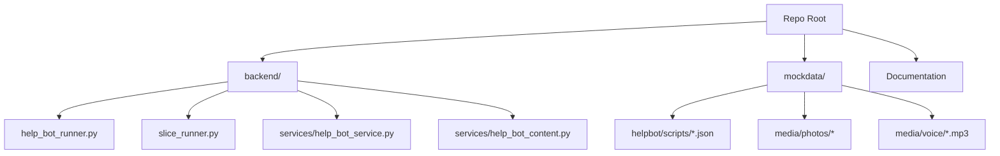
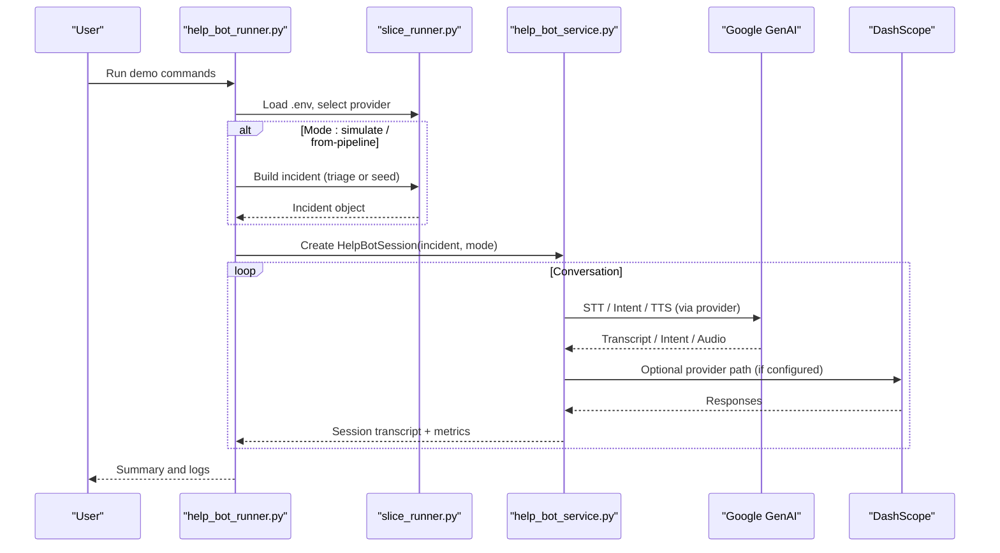
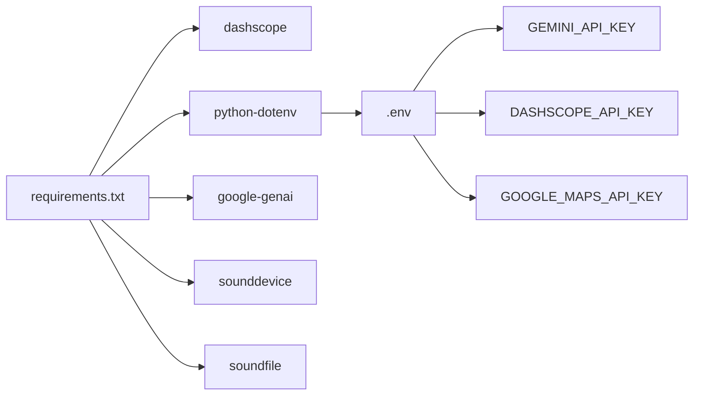

# Getting Started

<cite>
**Referenced Files in This Document**
- [requirements.txt](file://backend/requirements.txt)
- [.env](file://.env)
- [help_bot_runner.py](file://backend/help_bot_runner.py)
- [slice_runner.py](file://backend/slice_runner.py)
- [help_bot_service.py](file://backend/services/help_bot_service.py)
- [help_bot_content.py](file://backend/services/help_bot_content.py)
- [DEMO_SCRIPT.md](file://DEMO_SCRIPT.md)
</cite>

## Table of Contents
1. Introduction
2. Project Structure
3. Core Components
4. Architecture Overview
5. Detailed Component Analysis
6. Dependency Analysis
7. Performance Considerations
8. Troubleshooting Guide
9. Conclusion
10. Appendices

## Introduction
This guide helps you set up and run the LifeLine Ride system for the first time. You will install Python dependencies, configure environment variables for Google GenAI and DashScope services, and execute the initial demo using the help bot runner. It also includes step-by-step instructions to run test scenarios, understand the CLI interface, verify your installation, and provides troubleshooting tips and next steps.

## Project Structure
The repository is organized into backend logic, mock data for demos, and documentation:
- backend: Python modules implementing triage, dispatch, and the responder help bot
- mockdata: sample media and cached outputs used by demos and tests
- Documentation files describing demo flows and project overview

**Diagram sources**
- [help_bot_runner.py:1-241](file://backend/help_bot_runner.py#L1-L241)
- [slice_runner.py:1-745](file://backend/slice_runner.py#L1-L745)
- [help_bot_service.py:1-960](file://backend/services/help_bot_service.py#L1-L960)
- [help_bot_content.py:1-255](file://backend/services/help_bot_content.py#L1-L255)

**Section sources**
- [help_bot_runner.py:1-241](file://backend/help_bot_runner.py#L1-L241)
- [slice_runner.py:1-745](file://backend/slice_runner.py#L1-L745)

## Core Components
- Help Bot Runner: CLI entrypoint to run simulated or pipeline-driven sessions, replay scripted interactions, prewarm TTS cache, and verify spoken Urdu round-trips.
- Slice Runner: Loads environment configuration, selects AI provider (Gemini or DashScope), implements triage (STT, vision, classifier), matching/dispatch, and logging utilities.
- Help Bot Service: Conversation engine with STT, intent classification, TTS with caching, audio I/O, escalation hooks, and session state management.
- Help Bot Content: Hardcoded Urdu guidance content and branching logic for different injury scenarios.

Key responsibilities:
- Environment loading and API key validation
- Provider selection and model endpoints
- Triage pipeline orchestration and fail-safes
- Help bot conversation flow and escalation integration
- Deterministic replay and verification workflows

**Section sources**
- [help_bot_runner.py:1-241](file://backend/help_bot_runner.py#L1-L241)
- [slice_runner.py:1-745](file://backend/slice_runner.py#L1-L745)
- [help_bot_service.py:1-960](file://backend/services/help_bot_service.py#L1-L960)
- [help_bot_content.py:1-255](file://backend/services/help_bot_content.py#L1-L255)

## Architecture Overview
High-level flow from CLI to AI services and back:

**Diagram sources**
- [help_bot_runner.py:175-236](file://backend/help_bot_runner.py#L175-L236)
- [slice_runner.py:138-153](file://backend/slice_runner.py#L138-L153)
- [help_bot_service.py:127-167](file://backend/services/help_bot_service.py#L127-L167)
- [help_bot_service.py:244-288](file://backend/services/help_bot_service.py#L244-L288)
- [help_bot_service.py:307-387](file://backend/services/help_bot_service.py#L307-L387)

## Detailed Component Analysis

### Installation and Environment Setup
- Install Python dependencies listed in requirements.txt.
- Ensure a Python 3 environment is available.
- Configure environment variables in the project-root .env file:
  - GOOGLE_MAPS_API_KEY
  - GEMINI_API_KEY
  - DASHSCOPE_API_KEY
  - PORT (optional)
- The application loads .env automatically at runtime; do not commit secrets.

Verification checklist:
- Confirm dependencies are installed without import errors.
- Confirm .env contains required keys and no typos.
- Run a minimal command to ensure imports succeed and environment is loaded.

**Section sources**
- [requirements.txt:1-6](file://backend/requirements.txt#L1-L6)
- [.env:1-4](file://.env#L1-L4)
- [slice_runner.py:8-16](file://backend/slice_runner.py#L8-L16)
- [slice_runner.py:36-52](file://backend/slice_runner.py#L36-L52)

### Running the Initial Demo
Use the CLI to run a quick demo without consuming AI quota:
- Simulate a scenario and run in replay mode with a script JSON.
- Alternatively, run the full Module 1 pipeline on mock media then hand off to the help bot.
- Pre-warm the TTS cache to avoid quota usage during replays.
- Verify spoken Urdu via TTS-to-STT round-trip.

Example commands (run from repo root or backend/):
- Simulate heavy bleeding and replay a script:
  python backend/help_bot_runner.py --simulate heavy_bleeding --mode replay mockdata/helpbot/scripts/heavy_bleeding.json
- Run snakebite simulation in live mic mode:
  python backend/help_bot_runner.py --simulate snakebite --mode mic
- Full pipeline on mock media, then help bot:
  python backend/help_bot_runner.py --from-pipeline --photo "mockdata/media/photos/PhotoshopExtension_Image (1).png" --voice mockdata/media/voice/ungli.mp3 --village VILLAGE-A --mode replay mockdata/helpbot/scripts/heavy_bleeding.json
- Pre-warm TTS cache:
  python backend/help_bot_runner.py --prewarm-tts
- Verify spoken Urdu round-trip:
  python backend/help_bot_runner.py --verify-tts

Expected outcomes:
- Console logs showing incident creation, branch routing, and session transitions.
- For replay mode: deterministic transcript and metrics summary.
- For mic mode: interactive hands-free loop with barge-in support.
- For verification: generated WAV files and transcripts saved under mockdata/helpbot/test_runs.

**Section sources**
- [help_bot_runner.py:4-18](file://backend/help_bot_runner.py#L4-L18)
- [help_bot_runner.py:74-99](file://backend/help_bot_runner.py#L74-L99)
- [help_bot_runner.py:102-132](file://backend/help_bot_runner.py#L102-L132)
- [help_bot_runner.py:135-172](file://backend/help_bot_runner.py#L135-L172)
- [help_bot_runner.py:175-236](file://backend/help_bot_runner.py#L175-L236)

### Understanding the CLI Interface
Core options:
- --simulate: Choose a seeded scenario (heavy_bleeding, fracture_crush, snakebite) to build an incident without AI calls.
- --from-pipeline: Run Module 1 triage on provided photo and voice note, then start help bot.
- --mode: Choose replay (deterministic) or mic (live audio).
- --prewarm-tts: Render all scripted lines into the TTS cache and exit.
- --verify-tts: Generate audio for each branch and transcribe it back to validate spoken Urdu.

Replay scripts:
- Provide a JSON path when using --mode replay to drive scripted turns.

Outputs:
- Console logs include branch routing, transitions, latency summaries, final tier, and escalation counts.

**Section sources**
- [help_bot_runner.py:175-236](file://backend/help_bot_runner.py#L175-L236)

### Verifying Successful Installation
- Import check: Ensure Python can import slice_runner and help_bot_service without errors.
- Environment check: Confirm .env keys are present and non-empty.
- TTS cache check: After running --prewarm-tts, confirm WAV files exist under mockdata/helpbot/tts_cache.
- Replay check: Run a replay with a known script and verify expected console output and session summary.

**Section sources**
- [help_bot_runner.py:102-132](file://backend/help_bot_runner.py#L102-L132)
- [help_bot_runner.py:135-172](file://backend/help_bot_runner.py#L135-L172)
- [slice_runner.py:8-16](file://backend/slice_runner.py#L8-L16)

### Executing Test Scenarios
You can run the built-in vertical slice tests that exercise real media through the triage and dispatch pipeline:
- Execute the test suite from slice_runner to process multiple scenarios including edge cases.
- Observe logs for triage results, matching, dispatch status, and incident logging.

Notes:
- Tests use mock media paths; ensure those files exist in mockdata/media.
- Results are logged to INCIDENT_STORE and printed to console.

**Section sources**
- [slice_runner.py:679-745](file://backend/slice_runner.py#L679-L745)

### Exploring the System’s Features
- Branch routing: Based on injury flags, the help bot selects a scenario-specific knowledge branch.
- Hands-free interaction: Mic mode captures utterances, transcribes them, classifies intent, and speaks scripted guidance.
- Escalation: Detects worsening conditions and upgrades severity tier, triggers BHU notification and ambulance request markers.
- Deterministic replay: Use scripts to reproduce exact conversations for testing and QA.

**Section sources**
- [help_bot_service.py:95-116](file://backend/services/help_bot_service.py#L95-L116)
- [help_bot_service.py:576-647](file://backend/services/help_bot_service.py#L576-L647)
- [help_bot_content.py:46-255](file://backend/services/help_bot_content.py#L46-L255)

## Dependency Analysis
Runtime dependencies and their roles:
- dashscope: Optional SDK for DashScope provider path (STT/classifier/TTS swap-back targets).
- python-dotenv: Loads .env at startup.
- google-genai: Primary provider for STT, intent classification, and TTS.
- sounddevice, soundfile: Audio capture and playback for mic mode.

Provider selection:
- TRIAGE_AI_PROVIDER controls which provider is active; default is Gemini.
- Model names can be overridden via environment variables for STT, classifier, and TTS.

**Diagram sources**
- [requirements.txt:1-6](file://backend/requirements.txt#L1-L6)
- [.env:1-4](file://.env#L1-L4)
- [slice_runner.py:8-16](file://backend/slice_runner.py#L8-L16)
- [slice_runner.py:138-153](file://backend/slice_runner.py#L138-L153)

**Section sources**
- [requirements.txt:1-6](file://backend/requirements.txt#L1-L6)
- [slice_runner.py:138-153](file://backend/slice_runner.py#L138-L153)
- [.env:1-4](file://.env#L1-L4)

## Performance Considerations
- TTS caching: Pre-render scripted lines to avoid repeated API calls and stay within free-tier quotas.
- Quota retries: Built-in retry with backoff for rate-limited requests improves resilience during demos.
- Latency measurement: First playback delay is tracked per turn to assess responsiveness.
- Audio hardware: Mic mode requires a working microphone and speakers; otherwise, replay mode remains fully functional.

[No sources needed since this section provides general guidance]

## Troubleshooting Guide
Common issues and resolutions:
- Missing API keys:
  - Symptom: Runtime error indicating missing GEMINI_API_KEY or DASHSCOPE_API_KEY.
  - Resolution: Add the required keys to the project-root .env file.
- Provider SDK not installed:
  - Symptom: ImportError when switching to DashScope.
  - Resolution: Install dependencies from requirements.txt or keep TRIAGE_AI_PROVIDER set to gemini.
- Audio device unavailable:
  - Symptom: Playback/capture fails in mic mode.
  - Resolution: Use replay mode or ensure correct audio devices are selected by the OS.
- TTS quota exceeded:
  - Symptom: Rendering failures or delays.
  - Resolution: Use --prewarm-tts ahead of time; rely on cached WAV files for replays.
- Non-JSON responses from models:
  - Symptom: Errors about invalid JSON from classifiers or intents.
  - Resolution: Retry after a short wait; the system has loose JSON parsing and fallbacks.

Where these behaviors are implemented:
- Environment loading and key validation
- Provider selection and endpoint configuration
- Retry logic for quota limits
- TTS caching and fallback behavior
- Audio dependency checks and graceful degradation

**Section sources**
- [slice_runner.py:36-52](file://backend/slice_runner.py#L36-L52)
- [slice_runner.py:72-95](file://backend/slice_runner.py#L72-L95)
- [help_bot_service.py:394-402](file://backend/services/help_bot_service.py#L394-L402)
- [help_bot_service.py:689-695](file://backend/services/help_bot_service.py#L689-L695)

## Conclusion
You now have the essentials to install, configure, and run LifeLine Ride. Start with the help bot runner in replay mode to validate your setup, then explore mic mode and the full pipeline with mock media. Use the verification and prewarming tools to ensure reliable demos and consistent performance. Refer to the troubleshooting section if you encounter environment or audio issues.

[No sources needed since this section summarizes without analyzing specific files]

## Appendices

### Quick Start Commands
- Install dependencies:
  pip install -r backend/requirements.txt
- Set environment variables in .env:
  GOOGLE_MAPS_API_KEY=...
  GEMINI_API_KEY=...
  DASHSCOPE_API_KEY=...
  PORT=5000
- Run a quick demo:
  python backend/help_bot_runner.py --simulate heavy_bleeding --mode replay mockdata/helpbot/scripts/heavy_bleeding.json
- Pre-warm TTS cache:
  python backend/help_bot_runner.py --prewarm-tts
- Verify spoken Urdu:
  python backend/help_bot_runner.py --verify-tts

**Section sources**
- [requirements.txt:1-6](file://backend/requirements.txt#L1-L6)
- [.env:1-4](file://.env#L1-L4)
- [help_bot_runner.py:4-18](file://backend/help_bot_runner.py#L4-L18)
- [help_bot_runner.py:102-132](file://backend/help_bot_runner.py#L102-L132)
- [help_bot_runner.py:135-172](file://backend/help_bot_runner.py#L135-L172)

### Demo Script Reference
For a guided 3–5 minute demo flow covering reporter registration, responder guidance, escalation, and outcome tracking, see the demo script.

**Section sources**
- [DEMO_SCRIPT.md:1-20](file://DEMO_SCRIPT.md#L1-L20)