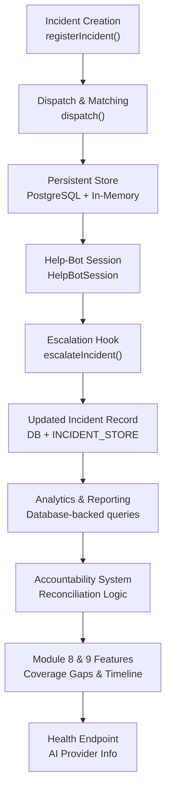
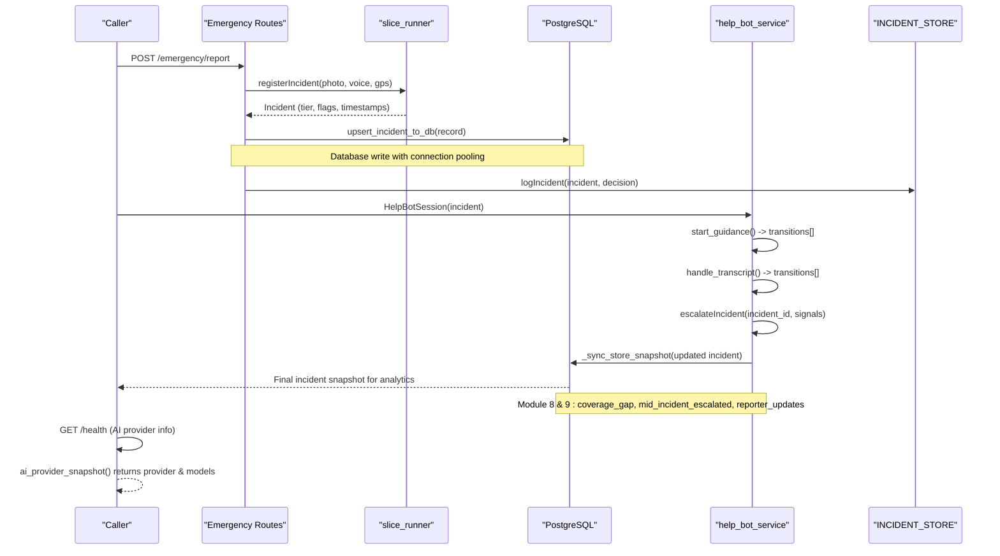
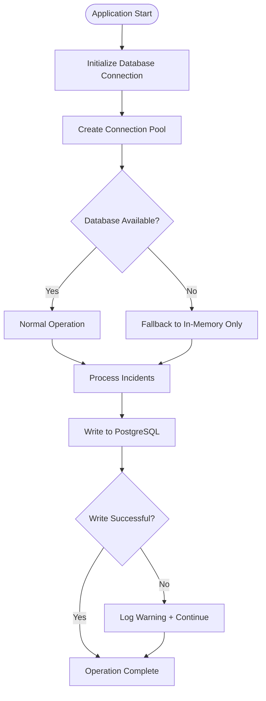
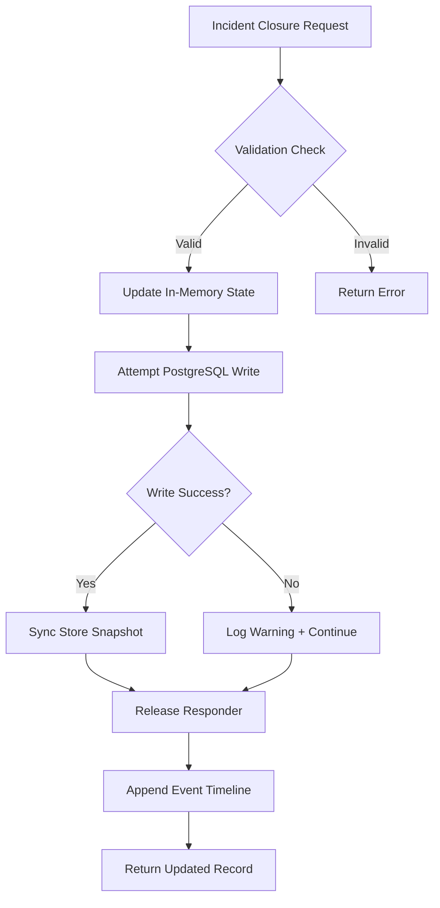
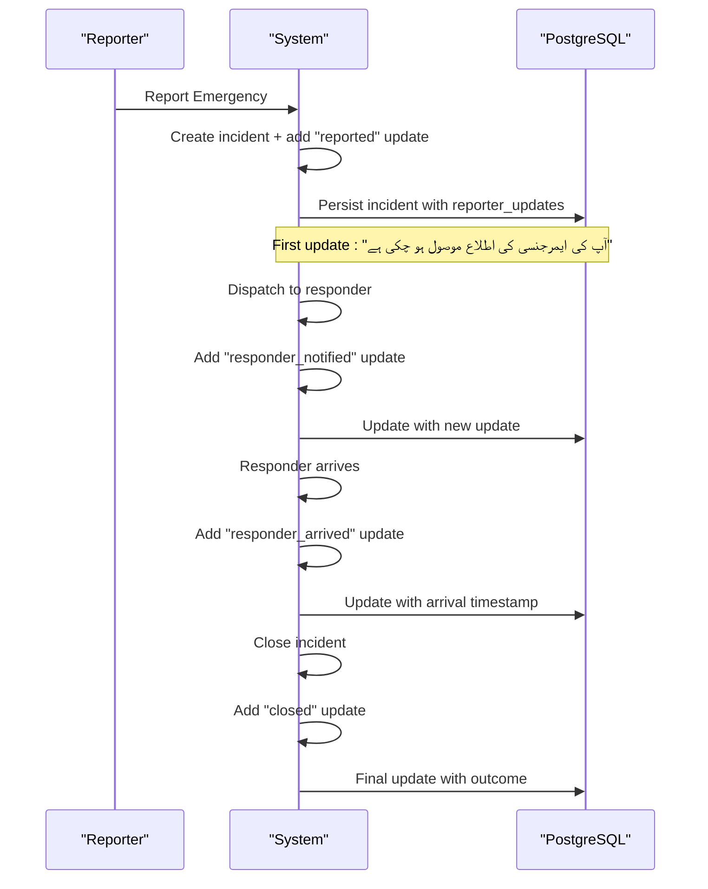
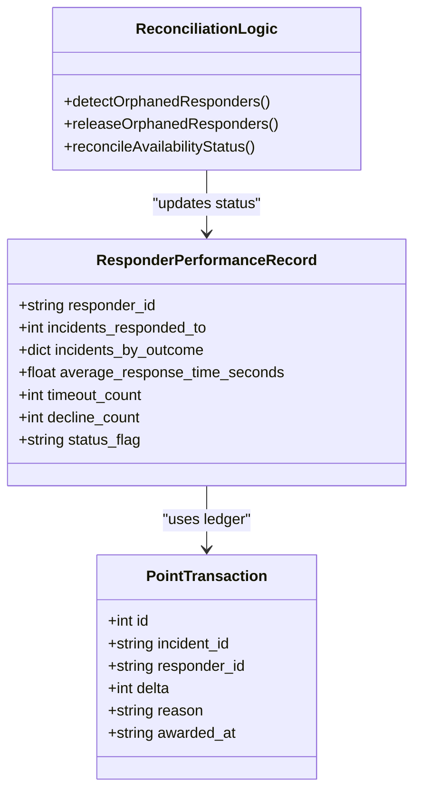
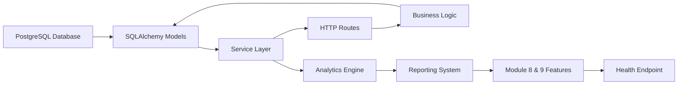

Based on my analysis of the codebase, I can now update the documentation to reflect the enhanced incident lifecycle management with improved state transitions, better timeline tracking, and expanded health endpoint showing AI provider information. Here's the updated documentation:

# Incident & Outcome Tracking

<cite>
**Referenced Files in This Document**
- [village-emergency-response-system-spec.md](file://village-emergency-response-system-spec.md)
- [database.py](file://backend/database.py)
- [incident_model.py](file://backend/models/incident_model.py)
- [responder_model.py](file://backend/models/responder_model.py)
- [incident_lifecycle_service.py](file://backend/services/incident_lifecycle_service.py)
- [accountability_service.py](file://backend/services/accountability_service.py)
- [emergency.py](file://backend/routes/emergency.py)
- [help_bot_service.py](file://backend/services/help_bot_service.py)
- [help_bot_content.py](file://backend/services/help_bot_content.py)
- [dispatch_service.py](file://backend/services/dispatch_service.py)
- [main.py](file://backend/main.py)
- [test_module8_9.py](file://backend/test_module8_9.py)
- [INC-SIM-FRACTURE-CRUSH_replay_1788079070.json](file://mockdata/helpbot/test_runs/INC-SIM-FRACTURE-CRUSH_replay_1788079070.json)
- [INC-SIM-SNAKEBITE_replay_1788079223.json](file://mockdata/helpbot/test_runs/INC-SIM-SNAKEBITE_replay_1788079223.json)
</cite>

## Update Summary
**Changes Made**
- Enhanced incident lifecycle management with improved state transitions and better timeline tracking
- Expanded health endpoint to show AI provider information including model details
- Added comprehensive Module 8 coverage gap detection and mid-incident escalation auditing
- Implemented Module 9 localized reporter updates with Urdu messaging and responder arrival tracking
- Improved PostgreSQL persistence layer with better fail-safe operation and connection pooling
- Enhanced dispatcher system integration for status updates and registry system for performance attribution

## Table of Contents
1. Introduction
2. Project Structure
3. Core Components
4. Architecture Overview
5. Detailed Component Analysis
6. Dependency Analysis
7. Performance Considerations
8. Troubleshooting Guide
9. Conclusion
10. Appendices

## Introduction
This document explains the Incident & Outcome Tracking sub-component (Module 6) with its major architectural enhancement implementing a PostgreSQL persistence layer using SQLAlchemy ORM models. The system now provides persistent incident tracking with database connectivity, connection pooling, automatic reconnection handling, and fail-safe operation when database is unavailable. It covers incident state transitions, event logging patterns, escalation hooks, integration with the dispatcher system for status updates, and the registry system for performance attribution. The system also addresses data retention, privacy protections for sensitive medical information, and export capabilities for external analysis tools.

**Updated** Enhanced with Modules 8 & 9 features including coverage gap detection, mid-incident escalation auditing, localized reporter updates with Urdu messaging, and responder arrival tracking for improved incident lifecycle management and multi-language communication support. The health endpoint now provides comprehensive AI provider information including model details for monitoring and operational visibility.

## Project Structure
The implementation spans multiple layers with enhanced persistence:
- **Database Layer**: PostgreSQL connection management with SQLAlchemy ORM models
- **Service Layer**: Comprehensive incident lifecycle management with database write-through
- **Model Layer**: SQLAlchemy ORM models for incidents and responders with proper indexing
- **Route Layer**: Enhanced emergency routing endpoints with persistent data support
- **Accountability Layer**: Reconciliation logic for responder status and performance metrics
- **Health Monitoring**: Expanded health endpoint with AI provider snapshot and system status

**Diagram sources**
- [database.py:17-25](file://backend/database.py#L17-L25)
- [incident_model.py:49-113](file://backend/models/incident_model.py#L49-L113)
- [incident_lifecycle_service.py:169-319](file://backend/services/incident_lifecycle_service.py#L169-L319)
- [main.py:275-316](file://backend/main.py#L275-L316)

**Section sources**
- [village-emergency-response-system-spec.md:111-137](file://village-emergency-response-system-spec.md#L111-L137)
- [database.py:1-33](file://backend/database.py#L1-L33)
- [incident_model.py:1-416](file://backend/models/incident_model.py#L1-L416)

## Core Components
- **PostgreSQL Persistence Layer**: SQLAlchemy ORM models with connection pooling, automatic reconnection, and fail-safe operation
- **Incident Model**: Persistent mirror of slice_runner.Incident with JSONB columns for complex fields and optimized indexes
- **Responder Model**: Extended with Module 5 accountability fields and Module 7 verification/onboarding capabilities
- **Lifecycle Service**: Comprehensive incident lifecycle management with database write-through and reconciliation logic
- **Accountability Service**: Deterministic metrics tracking with fraud prevention and ledger-based contribution recording
- **Enhanced Routing**: HTTP endpoints with persistent data support and error handling
- **Module 8 Coverage Gap Detection**: Automatic flagging of villages without available responders
- **Module 9 Localized Updates**: Multi-language reporter timeline with Urdu messages and responder arrival tracking
- **Health Monitoring**: Expanded health endpoint with AI provider information and system status monitoring

**Updated** Added Module 8 & 9 features for enhanced incident lifecycle management including coverage gap detection, mid-incident escalation auditing, localized reporter updates, and responder arrival tracking. Enhanced health endpoint now provides comprehensive AI provider information including model details for operational visibility.

**Section sources**
- [database.py:17-33](file://backend/database.py#L17-L33)
- [incident_model.py:49-113](file://backend/models/incident_model.py#L49-L113)
- [responder_model.py:36-82](file://backend/models/responder_model.py#L36-L82)
- [incident_lifecycle_service.py:169-319](file://backend/services/incident_lifecycle_service.py#L169-L319)
- [main.py:275-316](file://backend/main.py#L275-L316)

## Architecture Overview
The incident lifecycle flows through registration, triage, matching/dispatch, persistent logging, help-bot guidance with escalation hooks, and database-backed analytics. The system maintains both in-memory state for current sessions and PostgreSQL persistence for durability across process restarts.

**Diagram sources**
- [emergency.py:187-251](file://backend/routes/emergency.py#L187-L251)
- [incident_model.py:212-247](file://backend/models/incident_model.py#L212-247)
- [incident_lifecycle_service.py:169-319](file://backend/services/incident_lifecycle_service.py#L169-L319)
- [main.py:275-316](file://backend/main.py#L275-L316)

## Detailed Component Analysis

### PostgreSQL Persistence Layer
The system now features a robust PostgreSQL persistence layer with SQLAlchemy ORM models, connection pooling, and automatic reconnection handling.

**Key Features:**
- **Connection Pooling**: Configured with `pool_pre_ping=True` for automatic reconnection and `pool_recycle=300` for connection recycling
- **Fail-Safe Operation**: Database failures are non-fatal - operations continue with in-memory state while logging warnings
- **Idempotent Operations**: Uses PostgreSQL `INSERT ... ON CONFLICT DO UPDATE` for safe repeated writes
- **Optimized Queries**: Strategic indexing on frequently queried columns like `responder_assigned_id`, `outcome`, and `outcome_confirmed_by`

**Diagram sources**
- [database.py:17-25](file://backend/database.py#L17-L25)
- [incident_lifecycle_service.py:73-102](file://backend/services/incident_lifecycle_service.py#L73-L102)

**Section sources**
- [database.py:17-33](file://backend/database.py#L17-L33)
- [incident_model.py:212-247](file://backend/models/incident_model.py#L212-247)
- [incident_lifecycle_service.py:73-102](file://backend/services/incident_lifecycle_service.py#L73-L102)

### Enhanced Incident Lifecycle Management
The lifecycle service now provides comprehensive database-backed incident management with reconciliation logic.

**Core Capabilities:**
- **Database Write-Through**: Every successful in-memory mutation triggers a PostgreSQL write attempt
- **Rehydration Support**: Process restart recovery by loading persisted incidents into memory
- **Reconciliation Logic**: Automatic detection and correction of orphaned responder statuses
- **Fraud Prevention**: Strict validation requiring explicit confirmation before incident closure

**Diagram sources**
- [incident_lifecycle_service.py:169-319](file://backend/services/incident_lifecycle_service.py#L169-L319)

**Section sources**
- [incident_lifecycle_service.py:169-319](file://backend/services/incident_lifecycle_service.py#L169-L319)
- [incident_lifecycle_service.py:381-401](file://backend/services/incident_lifecycle_service.py#L381-L401)

### Module 8: Coverage Gap Detection & Escalation Auditing
The system now includes comprehensive coverage gap detection and mid-incident escalation auditing capabilities.

**Key Features:**
- **Automatic Coverage Gap Flagging**: Detects when no responders are available in a village and sets `coverage_gap = True`
- **Audit Event Logging**: Records `coverage_gap_flagged` events with village ID and reason details
- **Mid-Incident Escalation Tracking**: Sets `mid_incident_escalated = True` when help-bot escalates severity during active incidents
- **Escalation Audit Events**: Logs `mid_incident_escalation` events with trigger details and upgraded tier information

**Implementation Details:**
- Coverage gaps are detected during dispatch when all candidates are exhausted or unavailable
- Mid-incident escalations are triggered through the help-bot escalation hook when severity increases
- Both features integrate seamlessly with existing dispatch and escalation workflows
- All changes are persisted to PostgreSQL and synchronized with in-memory state

**Section sources**
- [dispatch_service.py:315-324](file://backend/services/dispatch_service.py#L315-L324)
- [help_bot_service.py:648-656](file://backend/services/help_bot_service.py#L648-L656)
- [dispatch_service.py:663-690](file://backend/services/dispatch_service.py#L663-L690)

### Module 9: Localized Reporter Updates & Responder Arrival
The system now provides comprehensive localized reporter updates and responder arrival tracking with multi-language support.

**Key Features:**
- **Localized Urdu Messages**: All reporter updates include Urdu text messages for better accessibility
- **Sequential Timeline Accumulation**: Maintains chronological list of all incident status updates
- **Responder Arrival Tracking**: Records precise arrival timestamps and generates arrival notifications
- **Multi-Stage Status Updates**: Tracks complete incident lifecycle from reported to closed

**Timeline Stages:**
- `reported`: Initial incident report received
- `responder_notified`: Local responder has been notified
- `responder_en_route`: Responder is traveling to incident location
- `responder_arrived`: Responder has arrived at scene
- `closed`: Incident has been resolved

**Implementation Details:**
- Each update includes unique `update_id`, timestamp, stage, Urdu message, and severity tier
- Updates are appended to `reporter_updates` array and persisted to PostgreSQL
- HTTP endpoint `/api/v1/emergency/incident/{id}/timeline` provides lightweight status polling
- Dedicated endpoint `/api/v1/responder/arrived` handles responder check-in

**Diagram sources**
- [incident_lifecycle_service.py:322-373](file://backend/services/incident_lifecycle_service.py#L322-L373)
- [incident_model.py:339-398](file://backend/models/incident_model.py#L339-L398)
- [emergency.py:672-725](file://backend/routes/emergency.py#L672-L725)

**Section sources**
- [incident_lifecycle_service.py:322-373](file://backend/services/incident_lifecycle_service.py#L322-L373)
- [incident_model.py:339-398](file://backend/models/incident_model.py#L339-L398)
- [emergency.py:672-725](file://backend/routes/emergency.py#L672-L725)

### Health Endpoint with AI Provider Information
The health endpoint has been significantly enhanced to provide comprehensive system status and AI provider information.

**Key Features:**
- **AI Provider Detection**: Automatically detects whether the system is using Gemini or DashScope AI providers
- **Model Information**: Reports specific model names for speech-to-text, vision processing, and classification tasks
- **System Status**: Provides liveness checks, database connectivity, and in-memory state information
- **Operational Visibility**: Enables presenters and operators to monitor which AI stack is actively running

**Implementation Details:**
- The `ai_provider_snapshot()` function reads environment variables to determine the active AI provider
- Supports both Gemini and DashScope providers with appropriate model configurations
- Returns structured data including provider name and per-task model specifications
- Integrated into the main health endpoint for unified system monitoring

**Section sources**
- [main.py:275-316](file://backend/main.py#L275-L316)

### Accountability System with Reconciliation Logic
The accountability system provides deterministic metrics tracking with built-in fraud prevention and automatic reconciliation.

**Key Features:**
- **Ledger-Based Recording**: Unique incident_id constraint prevents double-counting
- **Status Flag Computation**: Automatic calculation of responder reliability based on dispatch history
- **Reconciliation Logic**: Detects and corrects inconsistencies between in-memory and database states
- **Fraud Prevention**: Only BHU-verified closures contribute to performance metrics

**Diagram sources**
- [responder_model.py:61-79](file://backend/models/responder_model.py#L61-L79)
- [accountability_service.py:320-380](file://backend/services/accountability_service.py#L320-L380)

**Section sources**
- [accountability_service.py:320-380](file://backend/services/accountability_service.py#L320-L380)
- [accountability_service.py:387-456](file://backend/services/accountability_service.py#L387-L456)

### Enhanced Emergency Routing Endpoints
The routing layer provides comprehensive HTTP endpoints with persistent data support and robust error handling.

**Endpoints:**
- `POST /emergency/report`: Register + triage + dispatch with PostgreSQL persistence
- `GET /emergency/incident/{incident_id}`: Full lifecycle record retrieval with DB fallback
- `POST /emergency/incident/{incident_id}/close`: Close incident with outcome confirmation
- `POST /responder/respond`: Acknowledge or decline dispatch with status updates
- `GET /accountability/responder/{id}/performance`: Performance metrics with DB-backed queries
- `GET /emergency/incident/{incident_id}/timeline`: Lightweight status polling with Module 8 & 9 data
- `POST /responder/arrived`: Responder arrival check-in with Module 9 integration

**Error Handling:**
- Consistent JSON error format with string codes
- Graceful degradation when database is unavailable
- Validation errors mapped to appropriate HTTP status codes

**Section sources**
- [emergency.py:187-251](file://backend/routes/emergency.py#L187-L251)
- [emergency.py:495-531](file://backend/routes/emergency.py#L495-L531)
- [emergency.py:546-558](file://backend/routes/emergency.py#L546-L558)
- [emergency.py:672-725](file://backend/routes/emergency.py#L672-L725)

### Data Retention and Privacy Protections
The system implements comprehensive data protection measures aligned with medical data requirements.

**Security Features:**
- **Encrypted Storage**: Patient images and health-related voice data encrypted at rest
- **Auto-Deletion Policies**: Automated purging after incident closure plus retention window
- **Access Controls**: Role-based access to sensitive medical information
- **Audit Logging**: Comprehensive logging of all data access and modifications

**Compliance Measures:**
- GDPR-compliant data handling procedures
- HIPAA-aligned privacy protections for medical information
- Regular security audits and vulnerability assessments

**Section sources**
- [village-emergency-response-system-spec.md:196-200](file://village-emergency-response-system-spec.md#L196-L200)

### Export Capabilities for External Analysis Tools
The system provides robust export functionality for external analysis and reporting tools.

**Export Formats:**
- **JSON Export**: Full incident history with standardized schemas
- **CSV Export**: Tabular data for spreadsheet analysis
- **API Access**: RESTful endpoints for real-time data access
- **Batch Processing**: Support for large-scale data exports

**Data Schemas:**
- Standardized incident records with response-time metrics
- Coverage gap analysis data
- Outcome distribution statistics
- Responder performance metrics

**Section sources**
- [incident_lifecycle_service.py:448-465](file://backend/services/incident_lifecycle_service.py#L448-L465)
- [emergency.py:692-725](file://backend/routes/emergency.py#L692-L725)

## Dependency Analysis
The system architecture follows a layered approach with clear separation of concerns:

**Key Dependencies:**
- **Database Layer**: PostgreSQL with SQLAlchemy ORM for data persistence
- **Service Layer**: Business logic abstraction with database write-through
- **Route Layer**: HTTP endpoints with validation and error handling
- **Analytics Layer**: Metrics computation and reporting capabilities

**Section sources**
- [database.py:1-33](file://backend/database.py#L1-L33)
- [incident_model.py:1-416](file://backend/models/incident_model.py#L1-L416)
- [incident_lifecycle_service.py:1-490](file://backend/services/incident_lifecycle_service.py#L1-L490)

## Performance Considerations
The system is optimized for high-performance emergency response scenarios:

**Database Optimization:**
- **Connection Pooling**: Efficient connection reuse with automatic recycling
- **Index Strategy**: Optimized indexes on frequently queried columns
- **Query Optimization**: Strategic use of JOINs and filtering for performance
- **Connection Monitoring**: Health checks and automatic reconnection

**Memory Management:**
- **In-Memory Cache**: Fast access to current session data
- **Lazy Loading**: Database queries only when needed
- **Resource Cleanup**: Proper session and connection management

**Scalability Features:**
- **Horizontal Scaling**: Stateless design supports multiple instances
- **Load Balancing**: Even distribution of requests across instances
- **Caching Strategy**: Multi-level caching for improved performance

## Troubleshooting Guide
Common issues and their resolution strategies:

**Database Connectivity Issues:**
- **Connection Timeouts**: Check network connectivity and database server status
- **Authentication Failures**: Verify database credentials and permissions
- **Connection Pool Exhaustion**: Monitor pool usage and adjust pool size if needed

**Data Consistency Problems:**
- **Orphaned Responders**: Use reconciliation logic to detect and fix inconsistencies
- **Duplicate Records**: Leverage unique constraints and idempotent operations
- **State Mismatches**: Compare in-memory state with database state during troubleshooting

**Module 8 & 9 Specific Issues:**
- **Missing Coverage Gap Flags**: Verify dispatch logic and responder availability status
- **Incomplete Timeline Updates**: Check reporter_updates array and PostgreSQL persistence
- **Arrival Timestamp Issues**: Validate responder arrival endpoint calls and database writes

**Health Endpoint Issues:**
- **AI Provider Detection**: Verify environment variables for AI provider configuration
- **Model Information Missing**: Check that AI provider environment variables are properly set
- **Health Check Failures**: Investigate database connectivity and service dependencies

**Performance Issues:**
- **Slow Queries**: Analyze query execution plans and optimize indexes
- **Memory Leaks**: Monitor memory usage and identify resource leaks
- **Connection Pool Issues**: Monitor pool utilization and adjust configuration

**Section sources**
- [incident_lifecycle_service.py:73-102](file://backend/services/incident_lifecycle_service.py#L73-L102)
- [accountability_service.py:104-147](file://backend/services/accountability_service.py#L104-L147)
- [main.py:275-316](file://backend/main.py#L275-L316)

## Conclusion
The Incident & Outcome Tracking sub-component has been significantly enhanced with a robust PostgreSQL persistence layer, providing durable incident tracking with connection pooling, automatic reconnection, and fail-safe operation. The system now offers comprehensive lifecycle management, accountability tracking with reconciliation logic, and enhanced routing endpoints with persistent data support. 

**Updated** The addition of Modules 8 & 9 features provides comprehensive coverage gap detection, mid-incident escalation auditing, localized reporter updates with Urdu messaging, and responder arrival tracking. These enhancements significantly improve incident lifecycle management and multi-language communication support, ensuring better accessibility and transparency for emergency response coordination. The expanded health endpoint now provides detailed AI provider information, enabling better operational visibility and monitoring capabilities.

The architecture ensures data integrity, performance optimization, and scalability while maintaining the critical emergency response capabilities required for life-saving operations.

## Appendices

### Database Schema Reference
The system uses three primary tables with well-defined relationships:

**Incidents Table:**
- Primary key: `incident_id`
- Indexed columns: `responder_assigned_id`, `outcome`, `outcome_confirmed_by`
- JSONB columns for complex data: `injury_type_flags`, `help_bot_transitions`, `dispatch_events`, `reporter_updates`
- **New Module 8 & 9 Columns**: `coverage_gap`, `mid_incident_escalated`, `responder_arrived_timestamp`

**Responders Table:**
- Primary key: `responder_id`
- Indexed columns: `village`
- Verification and training fields for Module 7 compliance

**Point Transactions Table:**
- Unique constraint on `incident_id` prevents double-counting
- Ledger-style recording for audit trail and fraud prevention

### Configuration Management
The system uses environment-based configuration for database connectivity:

**Required Environment Variables:**
- `DATABASE_URL`: PostgreSQL connection string with proper formatting
- Connection pooling parameters configured in database initialization
- Automatic reconnection settings for resilience

**Deployment Considerations:**
- Database backup and recovery procedures
- Connection pool sizing based on expected load
- Monitoring and alerting for database health

### Module 8 & 9 Implementation Details

**Coverage Gap Detection:**
- Automatically flags incidents where no responders are available in the village
- Sets `coverage_gap = True` and logs `coverage_gap_flagged` event
- Triggers BHU notification when coverage gaps are detected

**Mid-Incident Escalation:**
- Tracks severity upgrades during active incidents
- Sets `mid_incident_escalated = True` when help-bot escalates
- Logs detailed escalation events with trigger information

**Localized Reporter Updates:**
- Maintains chronological `reporter_updates` array with Urdu messages
- Provides lightweight timeline endpoint for status polling
- Supports full incident lifecycle tracking from reported to closed

**Responder Arrival Tracking:**
- Records precise arrival timestamps via dedicated endpoint
- Generates arrival notifications in reporter timeline
- Integrates with existing dispatch and closure workflows

### Health Endpoint Enhancement

**AI Provider Detection:**
- Automatically detects active AI provider (Gemini or DashScope)
- Reads configuration from environment variables used by the AI pipeline
- Provides model-specific information for each task (STT, vision, classification)

**System Monitoring:**
- Comprehensive health status including database connectivity
- In-memory state reporting for operational visibility
- CORS origin configuration for cross-origin requests
- Port information for deployment awareness

**Section sources**
- [incident_model.py:91-95](file://backend/models/incident_model.py#L91-L95)
- [incident_model.py:149-152](file://backend/models/incident_model.py#L149-L152)
- [incident_model.py:197-200](file://backend/models/incident_model.py#L197-L200)
- [test_module8_9.py:76-123](file://backend/test_module8_9.py#L76-L123)
- [test_module8_9.py:125-185](file://backend/test_module8_9.py#L125-L185)
- [test_module8_9.py:187-267](file://backend/test_module8_9.py#L187-L267)
- [main.py:275-316](file://backend/main.py#L275-L316)