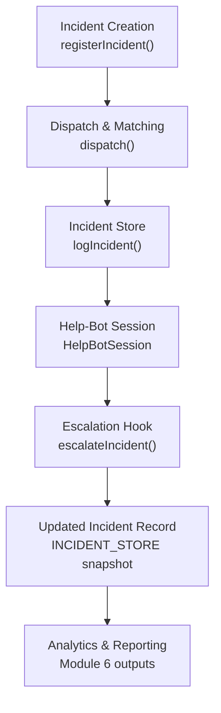
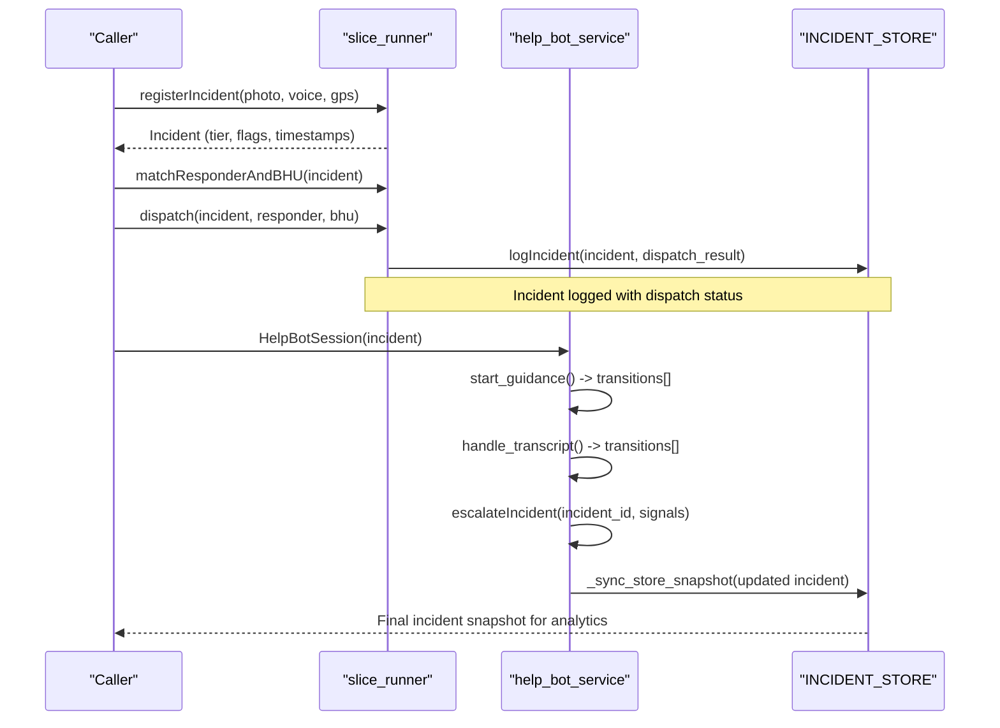
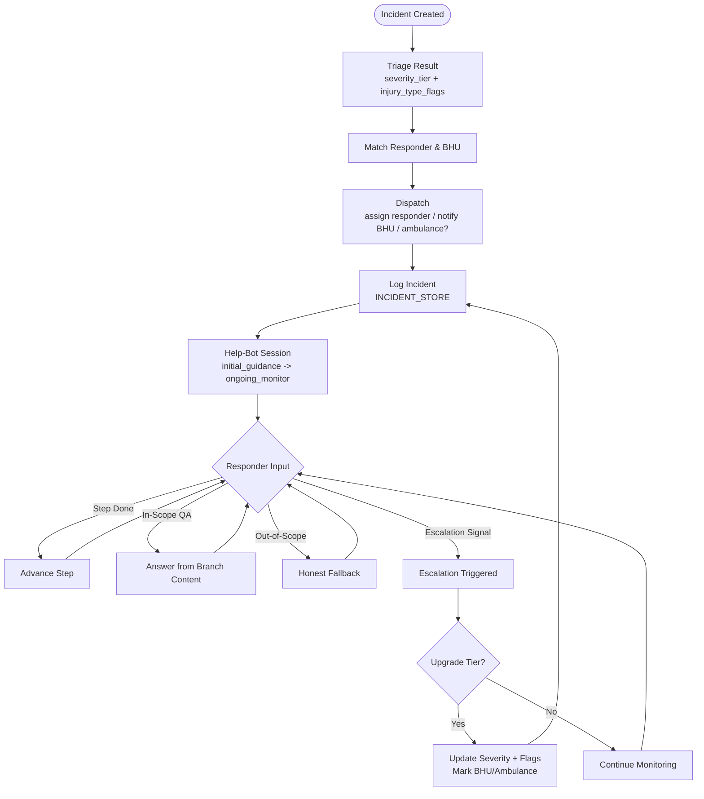
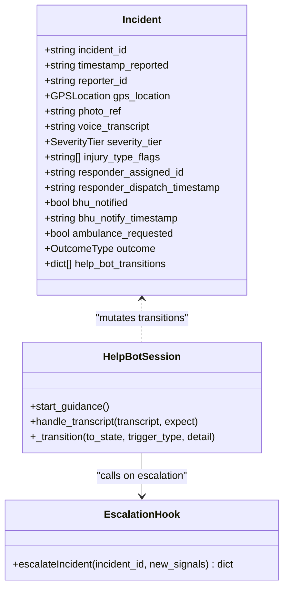
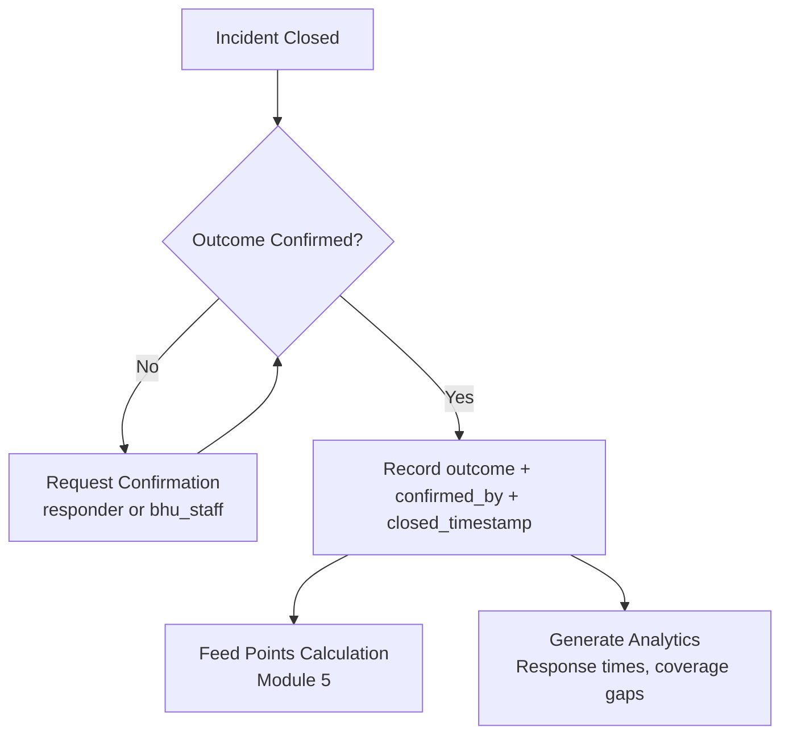
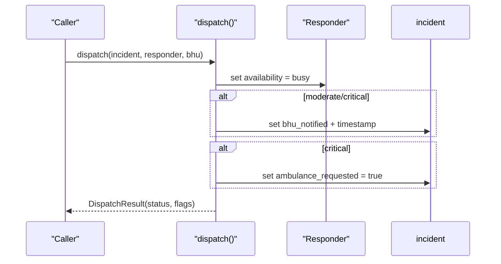
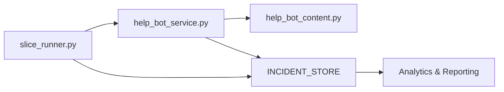

# Incident & Outcome Tracking

<cite>
**Referenced Files in This Document**
- [village-emergency-response-system-spec.md](file://village-emergency-response-system-spec.md)
- [slice_runner.py](file://backend/slice_runner.py)
- [help_bot_service.py](file://backend/services/help_bot_service.py)
- [help_bot_content.py](file://backend/services/help_bot_content.py)
- [INC-SIM-FRACTURE-CRUSH_replay_1788079070.json](file://mockdata/helpbot/test_runs/INC-SIM-FRACTURE-CRUSH_replay_1788079070.json)
- [INC-SIM-SNAKEBITE_replay_1788079223.json](file://mockdata/helpbot/test_runs/INC-SIM-SNAKEBITE_replay_1788079223.json)
</cite>

## Table of Contents
1. Introduction
2. Project Structure
3. Core Components
4. Architecture Overview
5. Detailed Component Analysis
6. Dependency Analysis
7. Performance Considerations
8. Troubleshooting Guide
9. Conclusion
10. Appendices

## Introduction
This document explains the Incident & Outcome Tracking sub-component (Module 6) and how it records the full lifecycle of an emergency from report to resolution, supports outcome confirmation workflows, and powers analytics and accountability. It covers incident state transitions, event logging patterns, escalation hooks, integration with the dispatcher system for status updates, and the registry system for performance attribution. It also addresses data retention, privacy protections for sensitive medical information, and export capabilities for external analysis tools.

## Project Structure
The relevant implementation spans:
- Data contracts and lifecycle orchestration in the backend slice runner
- Responder help-bot service that logs state transitions and escalations
- Hardcoded first-aid content used by the bot
- Specification defining the incident record schema and Module 6 goals
- Replay JSONs demonstrating end-to-end transitions and final incident snapshots

**Diagram sources**
- [slice_runner.py:589-672](file://backend/slice_runner.py#L589-L672)
- [help_bot_service.py:663-711](file://backend/services/help_bot_service.py#L663-L711)
- [help_bot_service.py:576-647](file://backend/services/help_bot_service.py#L576-L647)

**Section sources**
- [village-emergency-response-system-spec.md:111-137](file://village-emergency-response-system-spec.md#L111-L137)
- [slice_runner.py:170-213](file://backend/slice_runner.py#L170-L213)
- [slice_runner.py:589-672](file://backend/slice_runner.py#L589-L672)
- [help_bot_service.py:663-711](file://backend/services/help_bot_service.py#L663-L711)

## Core Components
- Incident model and lifecycle fields: severity tier, injury flags, timestamps for dispatch/BHU/ambulance, help-bot transition log, and outcome fields defined by spec.
- Dispatch logic: assigns responder, sets availability to busy, notifies BHU based on tier, requests ambulance for critical cases.
- Help-bot session: state machine that logs transitions (branch entered, steps started, questions, escalations), and integrates with escalation hook.
- Escalation hook: upgrades severity only upward, merges injury flags, marks BHU notification and ambulance request when appropriate, and appends a timestamped escalation event.
- Incident store: in-memory list of logged incidents with dispatch status and timestamps; updated by help-bot to reflect live session changes.

**Section sources**
- [village-emergency-response-system-spec.md:111-137](file://village-emergency-response-system-spec.md#L111-L137)
- [slice_runner.py:170-213](file://backend/slice_runner.py#L170-L213)
- [slice_runner.py:626-672](file://backend/slice_runner.py#L626-L672)
- [help_bot_service.py:576-647](file://backend/services/help_bot_service.py#L576-L647)
- [help_bot_service.py:663-711](file://backend/services/help_bot_service.py#L663-L711)

## Architecture Overview
The incident lifecycle flows through registration, triage, matching/dispatch, logging, and help-bot guidance with escalation hooks. The incident record is extended during the session and persisted in the store for later analytics and reporting.

**Diagram sources**
- [slice_runner.py:589-672](file://backend/slice_runner.py#L589-L672)
- [help_bot_service.py:663-711](file://backend/services/help_bot_service.py#L663-L711)
- [help_bot_service.py:576-647](file://backend/services/help_bot_service.py#L576-L647)

## Detailed Component Analysis

### Incident Lifecycle and State Transitions
- Registration creates an incident with triage results (severity tier and injury flags).
- Dispatch assigns a responder, marks BHU notification per tier, and requests ambulance for critical.
- Help-bot session logs transitions: branch entered, step started, in/out-of-scope questions, escalation triggered, session finalized.
- Escalation hook can upgrade severity, merge new flags, mark BHU notification and ambulance request, and append an escalation event.

**Diagram sources**
- [slice_runner.py:589-672](file://backend/slice_runner.py#L589-L672)
- [help_bot_service.py:663-711](file://backend/services/help_bot_service.py#L663-L711)
- [help_bot_service.py:576-647](file://backend/services/help_bot_service.py#L576-L647)

**Section sources**
- [slice_runner.py:589-672](file://backend/slice_runner.py#L589-L672)
- [help_bot_service.py:663-711](file://backend/services/help_bot_service.py#L663-L711)
- [help_bot_service.py:576-647](file://backend/services/help_bot_service.py#L576-L647)

### Event Logging Patterns
- Every state change is appended to incident.help_bot_transitions with timestamp, branch, from_state, to_state, trigger_type, and detail.
- Transition entries include step_started, in_scope_question, out_of_scope_question, escalation_triggered, and session_finalized.
- Replay JSONs demonstrate concrete examples of transitions and final_incident snapshots.

**Diagram sources**
- [slice_runner.py:170-213](file://backend/slice_runner.py#L170-L213)
- [help_bot_service.py:663-711](file://backend/services/help_bot_service.py#L663-L711)
- [help_bot_service.py:576-647](file://backend/services/help_bot_service.py#L576-L647)

**Section sources**
- [INC-SIM-FRACTURE-CRUSH_replay_1788079070.json:173-254](file://mockdata/helpbot/test_runs/INC-SIM-FRACTURE-CRUSH_replay_1788079070.json#L173-L254)
- [INC-SIM-FRACTURE-CRUSH_replay_1788079070.json:255-362](file://mockdata/helpbot/test_runs/INC-SIM-FRACTURE-CRUSH_replay_1788079070.json#L255-L362)
- [INC-SIM-SNAKEBITE_replay_1788079223.json:249-290](file://mockdata/helpbot/test_runs/INC-SIM-SNAKEBITE_replay_1788079223.json#L249-L290)

### Outcome Confirmation Workflows and Verification
- Spec defines outcome values and confirmation roles to prevent self-reported completion gaming points.
- Implementation exposes fields for outcome and confirmation; current code focuses on logging and escalation. Outcome confirmation is designed to be enforced at the workflow boundary before awarding points.
- Verification process should require confirmation by responder or BHU staff and record incident_closed_timestamp.

**Diagram sources**
- [village-emergency-response-system-spec.md:111-137](file://village-emergency-response-system-spec.md#L111-L137)

**Section sources**
- [village-emergency-response-system-spec.md:111-137](file://village-emergency-response-system-spec.md#L111-L137)

### Integration with Dispatcher System (Status Updates)
- Dispatch function mutates incident fields and responder availability, sets BHU notification and ambulance request flags based on severity tier.
- These flags serve as integration points for downstream dispatcher systems to update status and trigger notifications.

**Diagram sources**
- [slice_runner.py:626-662](file://backend/slice_runner.py#L626-L662)

**Section sources**
- [slice_runner.py:626-662](file://backend/slice_runner.py#L626-L662)

### Integration with Registry System (Performance Attribution)
- Spec states points are awarded per verified completed incident response, derived from Module 6 outcomes.
- Current code includes Responder.points_total and INCIDENT_STORE for historical records; future integration should compute points from confirmed outcomes and update registry accordingly.

**Section sources**
- [village-emergency-response-system-spec.md:102-108](file://village-emergency-response-system-spec.md#L102-L108)
- [slice_runner.py:191-213](file://backend/slice_runner.py#L191-L213)

### Concrete Examples from Codebase
- Fracture/Crush replay shows transitions from initial guidance to ongoing monitoring, in-scope questions, escalation triggered, and escalation hook updating severity and flags.
- Snakebite replay demonstrates similar transitions and final_incident snapshot with updated severity and flags after escalation.

**Section sources**
- [INC-SIM-FRACTURE-CRUSH_replay_1788079070.json:173-254](file://mockdata/helpbot/test_runs/INC-SIM-FRACTURE-CRUSH_replay_1788079070.json#L173-L254)
- [INC-SIM-FRACTURE-CRUSH_replay_1788079070.json:255-362](file://mockdata/helpbot/test_runs/INC-SIM-FRACTURE-CRUSH_replay_1788079070.json#L255-L362)
- [INC-SIM-SNAKEBITE_replay_1788079223.json:249-290](file://mockdata/helpbot/test_runs/INC-SIM-SNAKEBITE_replay_1788079223.json#L249-L290)

## Dependency Analysis
- slice_runner.py defines Incident, Responder, BHU, DispatchResult models and orchestrates registration, matching, dispatch, and logging.
- help_bot_service.py implements HelpBotSession and escalation hook, mutating incident transitions and syncing back to INCIDENT_STORE.
- help_bot_content.py provides hardcoded Urdu guidance and escalation signals used by the bot.
- Replay JSONs capture real runs including transitions and final_incident snapshots.

**Diagram sources**
- [slice_runner.py:170-213](file://backend/slice_runner.py#L170-L213)
- [help_bot_service.py:663-711](file://backend/services/help_bot_service.py#L663-L711)
- [help_bot_content.py:21-43](file://backend/services/help_bot_content.py#L21-L43)

**Section sources**
- [slice_runner.py:170-213](file://backend/slice_runner.py#L170-L213)
- [help_bot_service.py:663-711](file://backend/services/help_bot_service.py#L663-L711)
- [help_bot_content.py:21-43](file://backend/services/help_bot_content.py#L21-L43)

## Performance Considerations
- AI calls use retry with backoff for quota/rate-limit errors to keep pipeline usable during demos.
- TTS output is cached to disk to avoid repeated synthesis and reduce latency.
- First playback delay is measured per turn to monitor user-perceived responsiveness.
- In-memory incident store is suitable for demo-scale; production should persist to a database with indexing for query performance.

[No sources needed since this section provides general guidance]

## Troubleshooting Guide
- STT/TTS failures: The bot uses a failsafe line and pre-rendered audio to maintain continuity when AI services fail or hit quotas.
- Intent detection failures: Falls back to “unclear” intent and continues guidance without improvisation.
- Missing media: Triage pipeline defaults to moderate tier with low-confidence flag to ensure dispatch proceeds safely.
- No responders available: Dispatch escalates to BHU-only or reports no responders available; logs warnings for visibility.

**Section sources**
- [help_bot_service.py:689-695](file://backend/services/help_bot_service.py#L689-L695)
- [help_bot_service.py:727-750](file://backend/services/help_bot_service.py#L727-L750)
- [slice_runner.py:577-586](file://backend/slice_runner.py#L577-L586)
- [slice_runner.py:643-655](file://backend/slice_runner.py#L643-L655)

## Conclusion
The Incident & Outcome Tracking sub-component provides a robust foundation for logging the full emergency lifecycle, capturing state transitions, and enabling escalation-driven updates. While outcome confirmation and verification are specified, the current implementation emphasizes reliable logging, escalation hooks, and dispatcher integration points. With added outcome confirmation enforcement and persistent storage, the system will support comprehensive analytics, accountability, and export for external analysis tools.

[No sources needed since this section summarizes without analyzing specific files]

## Appendices

### Data Retention and Privacy Protections
- Spec recommends encrypting patient images and health-related voice data at rest and implementing auto-deletion policies after incident closure plus a retention window.
- Current code stores temporary media in mock directories and caches triage results locally; production should enforce encryption, access controls, and automated purging aligned with policy.

**Section sources**
- [village-emergency-response-system-spec.md:196-200](file://village-emergency-response-system-spec.md#L196-L200)

### Export Capabilities for External Analysis Tools
- INCIDENT_STORE holds incident records with dispatch status and timestamps; replay JSONs include turns, expectations, latencies, and help_bot_transitions.
- For external analysis, export these structures to CSV/JSON with standardized schemas for response-time metrics, coverage gaps, and outcome distributions.

**Section sources**
- [slice_runner.py:665-672](file://backend/slice_runner.py#L665-L672)
- [INC-SIM-FRACTURE-CRUSH_replay_1788079070.json:131-172](file://mockdata/helpbot/test_runs/INC-SIM-FRACTURE-CRUSH_replay_1788079070.json#L131-L172)