# Matching & Dispatch Engine

<cite>
**Referenced Files in This Document**
- [slice_runner.py](file://backend/slice_runner.py)
- [help_bot_runner.py](file://backend/help_bot_runner.py)
- [village-emergency-response-system-spec.md](file://village-emergency-response-system-spec.md)
- [PROJECT.md](file://PROJECT.md)
</cite>

## Table of Contents
1. [Introduction](#introduction)
2. [Project Structure](#project-structure)
3. [Core Components](#core-components)
4. [Architecture Overview](#architecture-overview)
5. [Detailed Component Analysis](#detailed-component-analysis)
6. [Dependency Analysis](#dependency-analysis)
7. [Performance Considerations](#performance-considerations)
8. [Troubleshooting Guide](#troubleshooting-guide)
9. [Conclusion](#conclusion)

## Introduction
This document explains the Matching & Dispatch Engine (Module 3) that selects responders and coordinates dispatch for emergencies using GPS-based location data, availability checks, and severity-driven tiered strategies. It covers:
- Ranked proximity matching with availability filtering
- Village-to-BHU association and responder registry integration
- Tiered dispatch logic based on severity (minor/moderate/critical)
- Coordination workflows involving multiple responders and BHUs
- Escalation mechanisms when no responders are available or within timeout
- Performance considerations for large-scale matching and geographic data optimization
- Failover procedures to ensure continuity when resources are exhausted

The engine integrates tightly with incident registration and triage (Module 1), the responder help bot (Module 2), and outcome tracking (Module 6).

**Section sources**
- [village-emergency-response-system-spec.md:66-82](file://village-emergency-response-system-spec.md#L66-L82)
- [PROJECT.md:8-15](file://PROJECT.md#L8-L15)

## Project Structure
At a high level, the Matching & Dispatch Engine is implemented as part of the backend slice runner and is invoked by the help bot runner during end-to-end flows. The key elements include:
- Data models for incidents, responders, BHUs, and dispatch results
- Seed registries for responders and BHUs with village associations
- Matching function that filters responders by village and availability
- Dispatch function that applies tiered notifications and ambulance requests
- Logging to persist lifecycle events

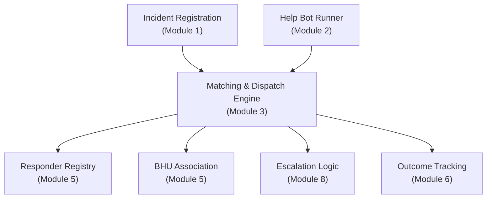

**Diagram sources**
- [slice_runner.py:170-213](file://backend/slice_runner.py#L170-L213)
- [slice_runner.py:219-275](file://backend/slice_runner.py#L219-L275)
- [slice_runner.py:612-662](file://backend/slice_runner.py#L612-L662)
- [help_bot_runner.py:64-99](file://backend/help_bot_runner.py#L64-L99)

**Section sources**
- [slice_runner.py:170-213](file://backend/slice_runner.py#L170-L213)
- [slice_runner.py:219-275](file://backend/slice_runner.py#L219-L275)
- [help_bot_runner.py:64-99](file://backend/help_bot_runner.py#L64-L99)

## Core Components
- Incident model: carries GPS location, severity tier, injury flags, and timestamps for dispatch and escalation
- Responder model: includes village assignment, linked BHU, and current availability status
- BHU model: includes union council and list of linked villages
- Dispatch result: captures assigned responder, BHU notification, ambulance request, and final status
- Matching function: filters responders by village and availability; returns first available responder and linked BHU
- Dispatch function: sets responder busy, notifies BHU per tier, requests ambulance for critical cases, and logs outcomes

Key responsibilities:
- Ensure only available responders are considered
- Apply severity-tiered dispatch rules
- Maintain state consistency by marking responders busy upon assignment
- Log all dispatch actions for accountability and analytics

**Section sources**
- [slice_runner.py:170-213](file://backend/slice_runner.py#L170-L213)
- [slice_runner.py:612-662](file://backend/slice_runner.py#L612-L662)

## Architecture Overview
The Matching & Dispatch Engine orchestrates three primary operations:
1. Match: Identify nearest available responder(s) based on village and availability
2. Dispatch: Apply tiered notifications and resource requests
3. Log: Persist incident lifecycle events for tracking and analytics

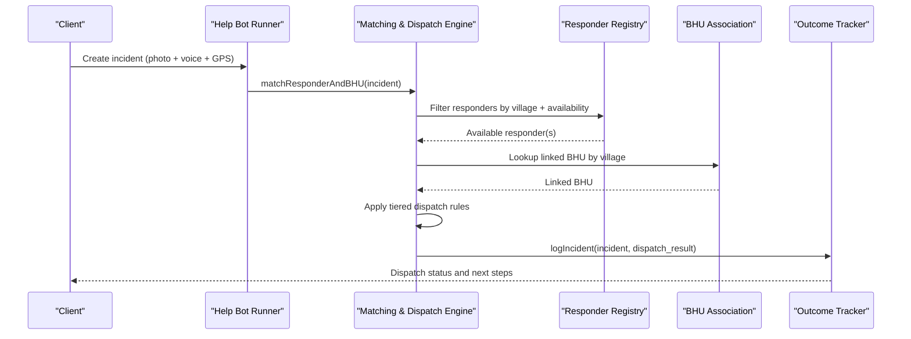

**Diagram sources**
- [help_bot_runner.py:64-99](file://backend/help_bot_runner.py#L64-L99)
- [slice_runner.py:612-662](file://backend/slice_runner.py#L612-L662)

## Detailed Component Analysis

### Ranked Proximity Matching Algorithm
- Current implementation filters responders by village and availability status
- Returns the first available responder in the village group
- Specification requires ranked proximity matching across the entire network, falling back to next-nearest if unavailable
- Future enhancement should compute distances from incident GPS to responder locations and sort candidates by distance

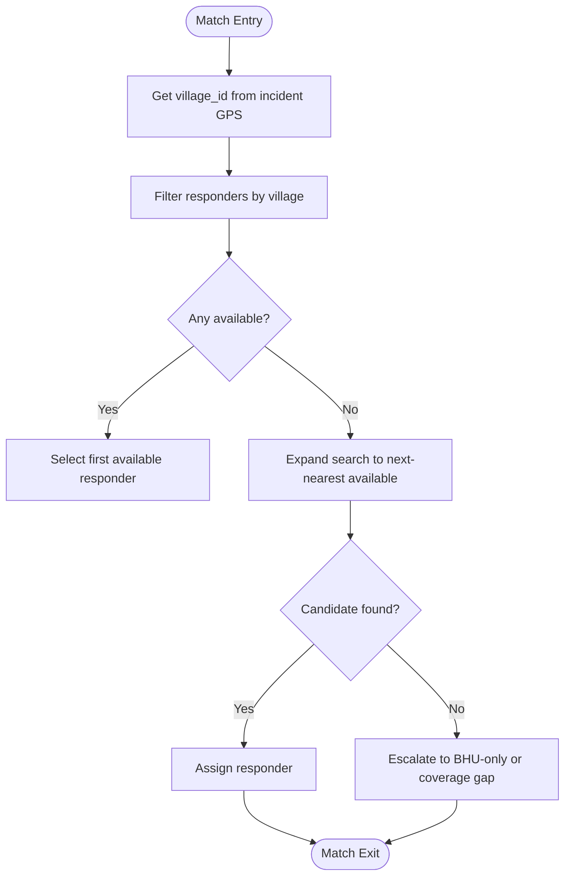

**Diagram sources**
- [slice_runner.py:612-623](file://backend/slice_runner.py#L612-L623)
- [village-emergency-response-system-spec.md:70-79](file://village-emergency-response-system-spec.md#L70-L79)

**Section sources**
- [slice_runner.py:612-623](file://backend/slice_runner.py#L612-L623)
- [village-emergency-response-system-spec.md:70-79](file://village-emergency-response-system-spec.md#L70-L79)

### Availability Checking Logic
- Responders have an availability status: available, busy, offline
- Only responders marked available are eligible for assignment
- Upon assignment, the responder’s status is updated to busy to prevent double-assignment
- This ensures concurrency safety during concurrent incident handling

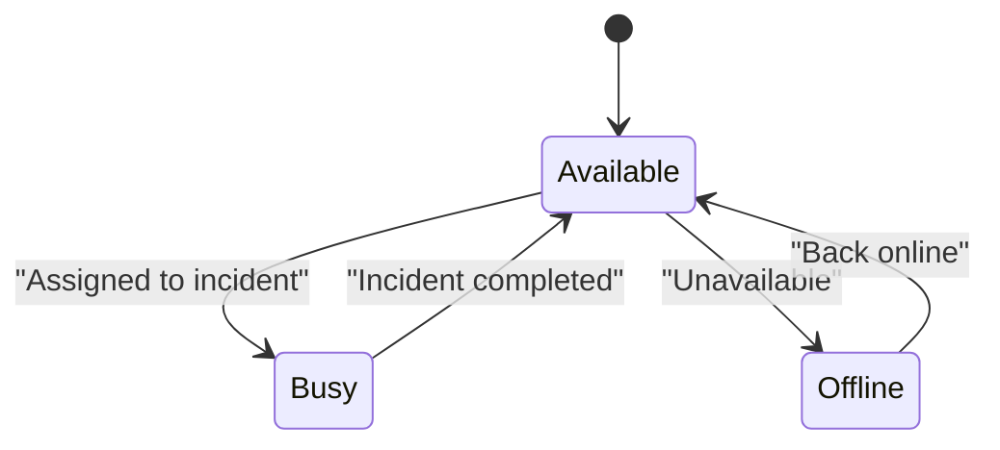

**Diagram sources**
- [slice_runner.py:191-198](file://backend/slice_runner.py#L191-L198)
- [slice_runner.py:631-635](file://backend/slice_runner.py#L631-L635)

**Section sources**
- [slice_runner.py:191-198](file://backend/slice_runner.py#L191-L198)
- [slice_runner.py:631-635](file://backend/slice_runner.py#L631-L635)

### Tiered Dispatch Strategies Based on Severity Levels
- Minor (Tier 1): Notify responder only
- Moderate (Tier 2): Notify responder and place linked BHU on standby
- Critical (Tier 3): Notify responder, notify BHU, and request ambulance simultaneously

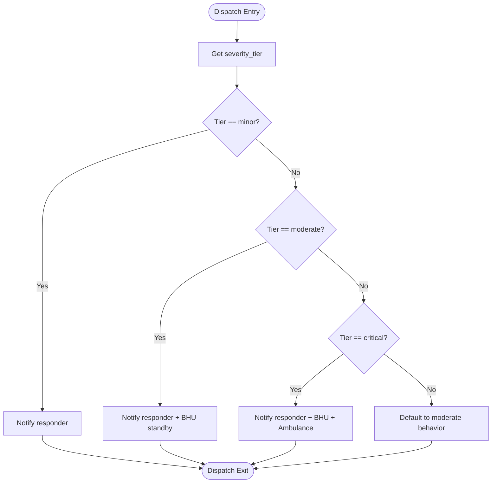

**Diagram sources**
- [slice_runner.py:626-662](file://backend/slice_runner.py#L626-L662)
- [village-emergency-response-system-spec.md:74-78](file://village-emergency-response-system-spec.md#L74-L78)

**Section sources**
- [slice_runner.py:626-662](file://backend/slice_runner.py#L626-L662)
- [village-emergency-response-system-spec.md:74-78](file://village-emergency-response-system-spec.md#L74-L78)

### Village-BHU Association System
- Each village is pre-associated with one nearby BHU via linked_village_ids
- Matching function retrieves the linked BHU for the incident’s village
- This fixed mapping ensures consistent local relationships and avoids independent BHU searches

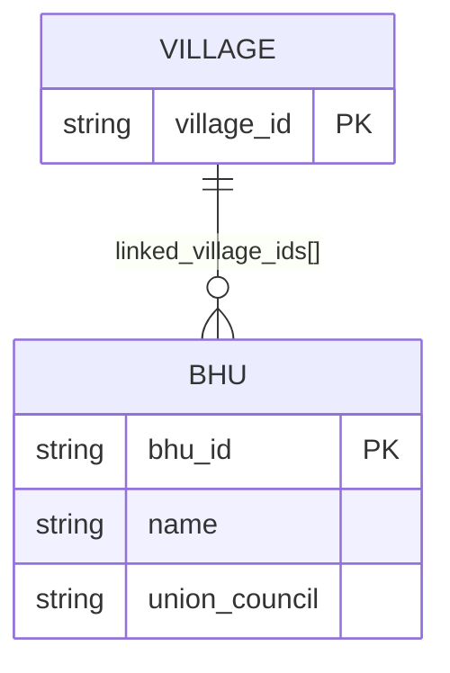

**Diagram sources**
- [slice_runner.py:219-232](file://backend/slice_runner.py#L219-L232)
- [slice_runner.py:615-616](file://backend/slice_runner.py#L615-L616)

**Section sources**
- [slice_runner.py:219-232](file://backend/slice_runner.py#L219-L232)
- [slice_runner.py:615-616](file://backend/slice_runner.py#L615-L616)

### Responder Registry Integration
- Responder records include village assignment, linked BHU, and availability status
- Matching function filters responders by village and availability
- Assignment updates responder status to busy to prevent conflicts

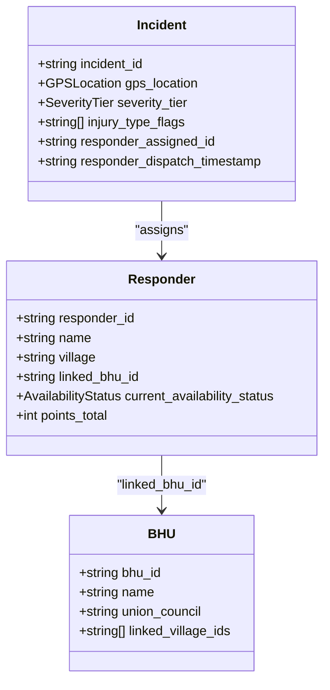

**Diagram sources**
- [slice_runner.py:170-213](file://backend/slice_runner.py#L170-L213)
- [slice_runner.py:234-275](file://backend/slice_runner.py#L234-L275)

**Section sources**
- [slice_runner.py:170-213](file://backend/slice_runner.py#L170-L213)
- [slice_runner.py:234-275](file://backend/slice_runner.py#L234-L275)

### Coordination Workflows for Multiple Responders
- When multiple responders are available in a village, the system selects the first available one
- If the selected responder becomes busy, subsequent incidents may select another available responder
- Escalation occurs if no responders are available within the village or network

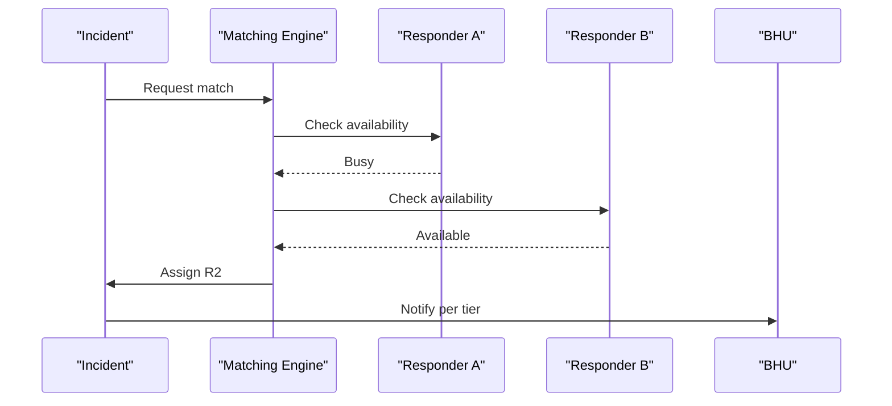

**Diagram sources**
- [slice_runner.py:617-623](file://backend/slice_runner.py#L617-L623)
- [slice_runner.py:637-651](file://backend/slice_runner.py#L637-L651)

**Section sources**
- [slice_runner.py:617-623](file://backend/slice_runner.py#L617-L623)
- [slice_runner.py:637-651](file://backend/slice_runner.py#L637-L651)

### Distance Calculations and Filtering Criteria
- Current implementation uses village-based filtering rather than GPS distance calculations
- Specification requires ranked proximity matching based on GPS coordinates
- Future enhancements should implement Haversine formula or spatial database queries for accurate distance computation
- Filtering criteria include:
  - Village membership
  - Availability status (available vs busy/offline)
  - Proximity ranking (future)

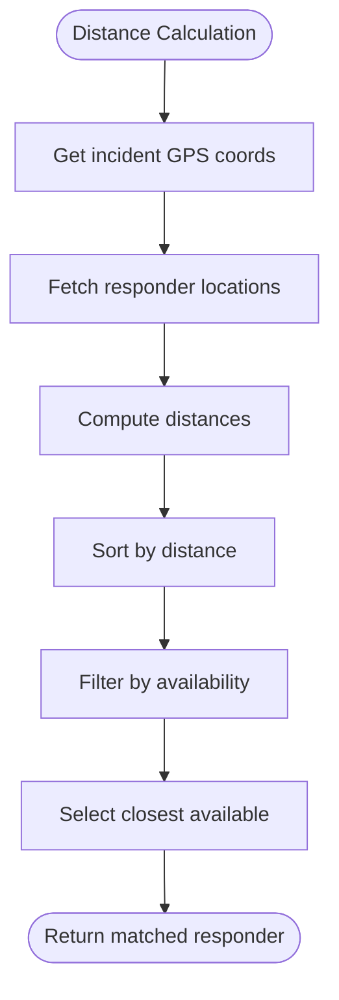

**Diagram sources**
- [village-emergency-response-system-spec.md:70-73](file://village-emergency-response-system-spec.md#L70-L73)
- [slice_runner.py:612-623](file://backend/slice_runner.py#L612-L623)

**Section sources**
- [village-emergency-response-system-spec.md:70-73](file://village-emergency-response-system-spec.md#L70-L73)
- [slice_runner.py:612-623](file://backend/slice_runner.py#L612-L623)

### Dispatch Result Generation
- Dispatch function creates a structured result including:
  - Incident ID
  - Assigned responder (if any)
  - BHU notification status
  - Ambulance request flag
  - Final status (dispatched, escalated_bhu_only, no_responders_available)
- Results are logged for tracking and analytics

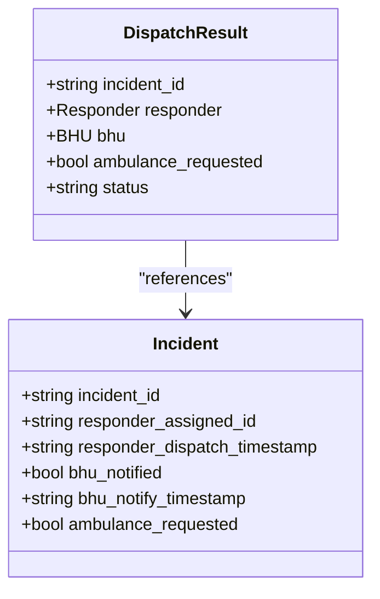

**Diagram sources**
- [slice_runner.py:207-213](file://backend/slice_runner.py#L207-L213)
- [slice_runner.py:656-662](file://backend/slice_runner.py#L656-L662)

**Section sources**
- [slice_runner.py:207-213](file://backend/slice_runner.py#L207-L213)
- [slice_runner.py:656-662](file://backend/slice_runner.py#L656-L662)

### Relationships with Incident Tracking and Escalation Mechanisms
- Incidents are logged with full lifecycle information including dispatch timestamps and outcomes
- Escalation occurs when:
  - No responders respond within timeout window
  - All responders in the network are unavailable
  - Mid-incident escalation from help bot indicates worsening condition
- Escalation triggers re-dispatch to next available responder or direct BHU notification

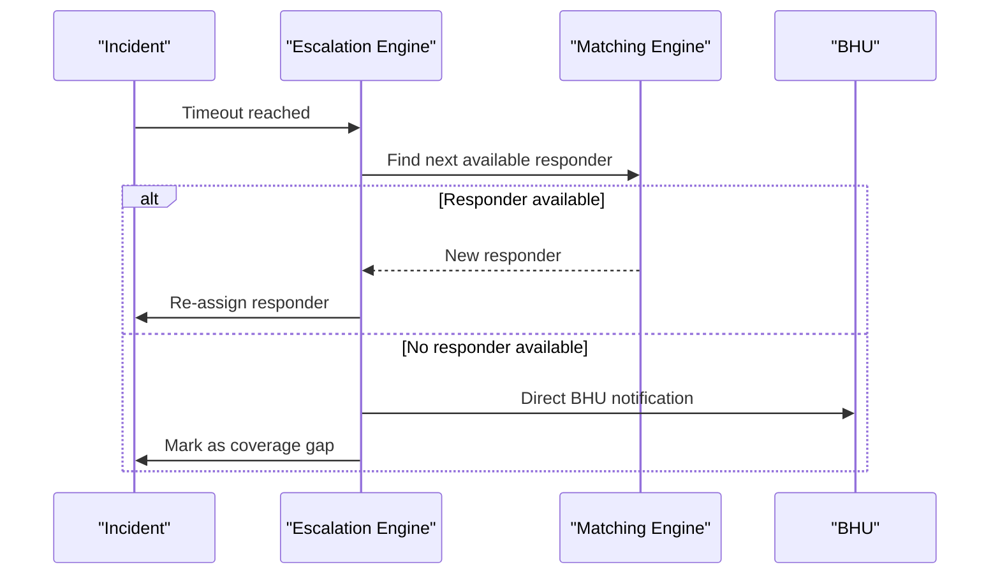

**Diagram sources**
- [village-emergency-response-system-spec.md:153-162](file://village-emergency-response-system-spec.md#L153-L162)
- [slice_runner.py:646-648](file://backend/slice_runner.py#L646-L648)

**Section sources**
- [village-emergency-response-system-spec.md:153-162](file://village-emergency-response-system-spec.md#L153-L162)
- [slice_runner.py:646-648](file://backend/slice_runner.py#L646-L648)

## Dependency Analysis
The Matching & Dispatch Engine depends on several components:
- Incident registration module for creating incidents with GPS and severity data
- Responder registry for availability and location data
- BHU association system for facility notifications
- Help bot runner for end-to-end workflow coordination
- Outcome tracking for logging and analytics

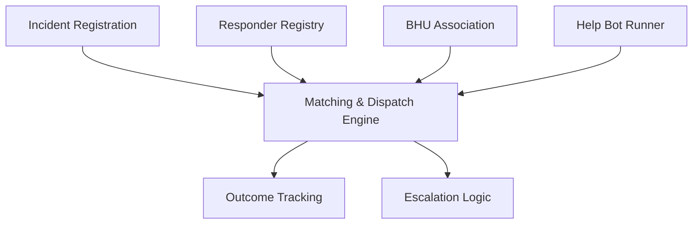

**Diagram sources**
- [help_bot_runner.py:64-99](file://backend/help_bot_runner.py#L64-L99)
- [slice_runner.py:612-662](file://backend/slice_runner.py#L612-L662)

**Section sources**
- [help_bot_runner.py:64-99](file://backend/help_bot_runner.py#L64-L99)
- [slice_runner.py:612-662](file://backend/slice_runner.py#L612-L662)

## Performance Considerations
For large-scale matching operations, consider:
- Geographic data optimization: Implement spatial indexing for faster proximity queries
- Caching: Cache responder availability and location data to reduce database load
- Batch processing: Process multiple incidents concurrently where possible
- Database optimization: Use spatial databases with GIS functions for distance calculations
- Memory management: Limit the number of responders loaded into memory at once
- Connection pooling: Optimize database connections for high-throughput scenarios

Current limitations:
- Village-based filtering instead of GPS-based proximity matching
- In-memory data structures that may not scale to thousands of responders
- Sequential processing without parallelization

Recommendations:
- Implement Haversine formula or PostGIS for accurate distance calculations
- Add database indexes on village_id and availability_status
- Consider Redis caching for frequently accessed responder data
- Implement circuit breakers for external service dependencies

[No sources needed since this section provides general guidance]

## Troubleshooting Guide
Common issues and their resolutions:
- No responders available: Verify responder availability status and village assignments
- Double-assignment prevention: Ensure responders are marked busy during active incidents
- BHU notification failures: Check linked BHU mappings and contact information
- Escalation loops: Monitor for repeated escalations indicating coverage gaps
- Performance bottlenecks: Profile matching algorithms and optimize database queries

Debugging steps:
- Check incident logs for dispatch status and timestamps
- Verify responder registry data integrity
- Monitor escalation triggers and timeout configurations
- Validate GPS coordinates and village associations

**Section sources**
- [slice_runner.py:646-648](file://backend/slice_runner.py#L646-L648)
- [slice_runner.py:665-672](file://backend/slice_runner.py#L665-L672)

## Conclusion
The Matching & Dispatch Engine provides a foundation for GPS-based responder selection and coordinated dispatch in rural emergency response systems. While the current implementation focuses on village-based matching and availability checking, it establishes the core architecture for future enhancements including:
- GPS-based proximity matching with distance calculations
- Advanced availability algorithms considering workload and response times
- Scalable infrastructure for large responder networks
- Enhanced escalation mechanisms for coverage gaps

The engine successfully integrates with incident registration, responder help bot, and outcome tracking to provide a comprehensive emergency response workflow. Future development should focus on implementing the specification requirements for ranked proximity matching and optimizing performance for real-world deployment scenarios.

[No sources needed since this section summarizes without analyzing specific files]