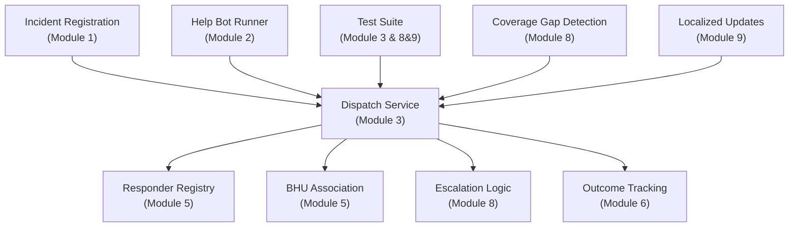
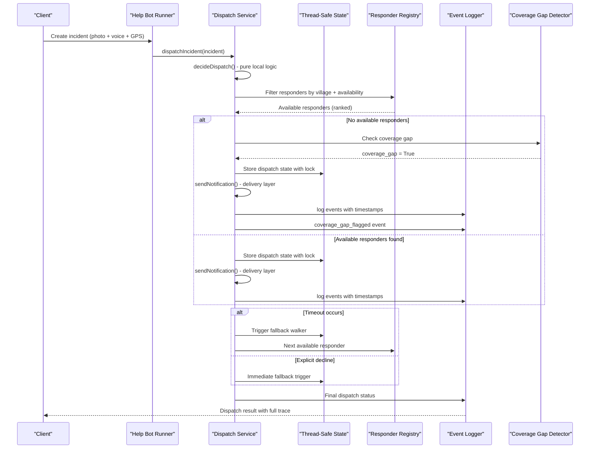
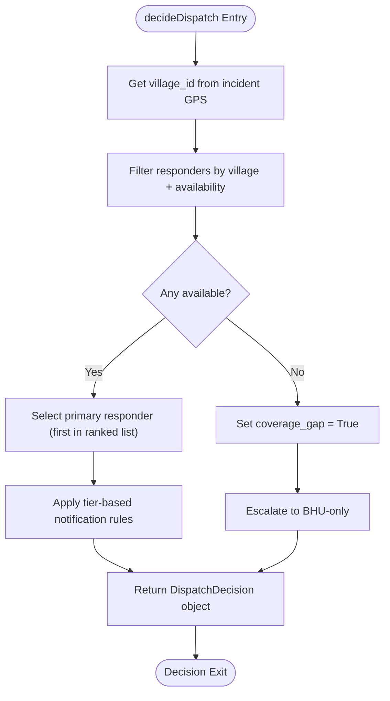
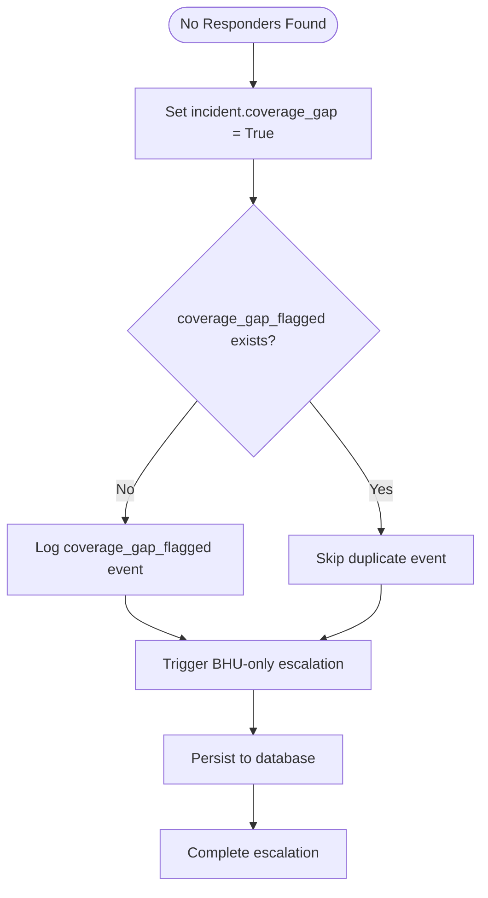
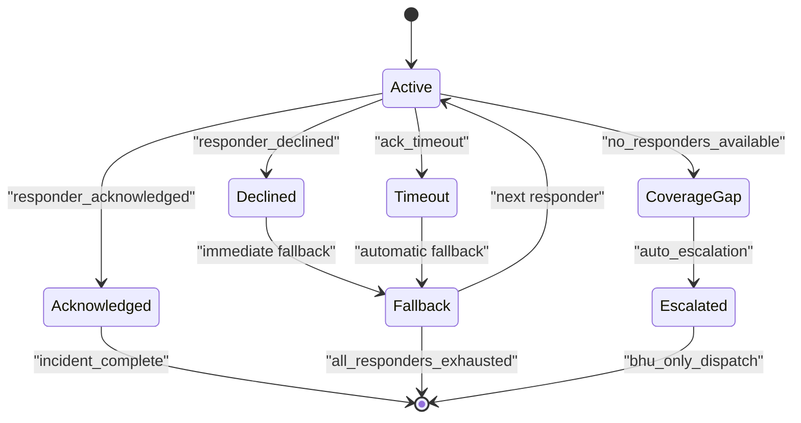
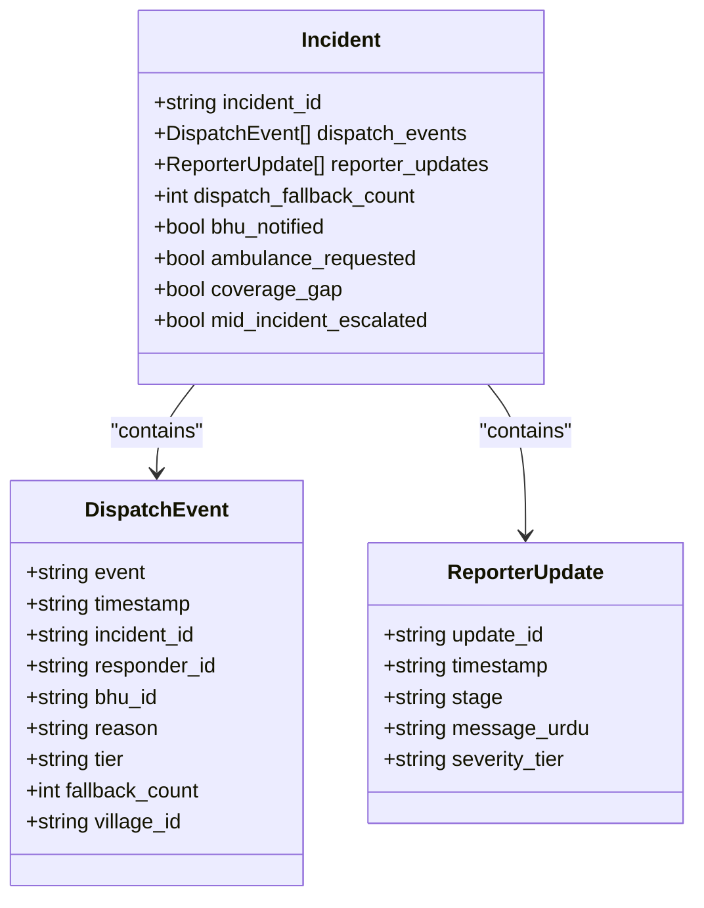
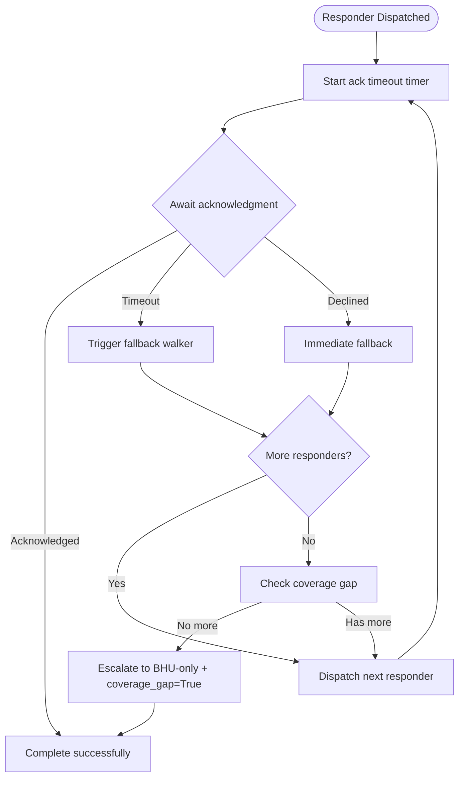
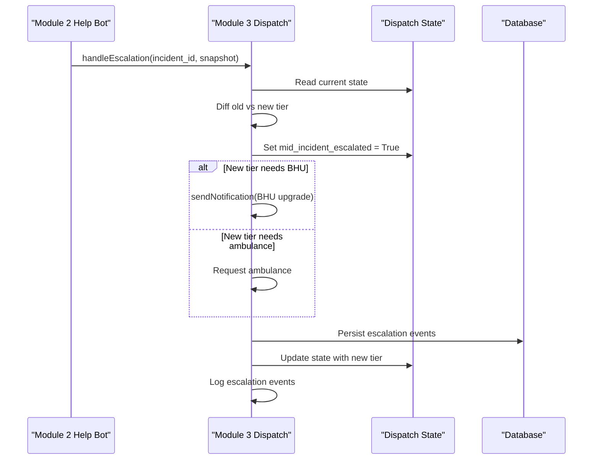
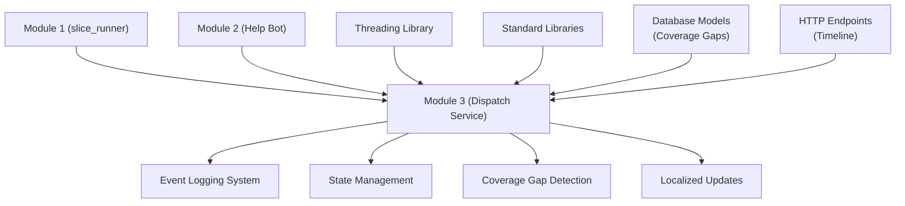

# Matching & Dispatch Engine

<cite>
**Referenced Files in This Document**
- [dispatch_service.py](file://backend/services/dispatch_service.py)
- [test_module3.py](file://backend/test_module3.py)
- [test_module8_9.py](file://backend/test_module8_9.py)
- [incident_model.py](file://backend/models/incident_model.py)
- [slice_runner.py](file://backend/slice_runner.py)
- [emergency.py](file://backend/routes/emergency.py)
- [help_bot_runner.py](file://backend/help_bot_runner.py)
- [village-emergency-response-system-spec.md](file://village-emergency-response-system-spec.md)
- [PROJECT.md](file://PROJECT.md)
</cite>

## Update Summary
**Changes Made**
- Added comprehensive coverage of enhanced coverage gap detection system with automatic escalation procedures
- Updated documentation for improved incident handling workflows with localized reporter updates
- Enhanced documentation for automatic escalation when village-level responders are unavailable
- Added detailed coverage of Module 8 & 9 integration including timeline accumulation and persistence
- Expanded performance considerations for large-scale matching operations with coverage gap analytics
- Updated troubleshooting guide with new error scenarios related to coverage gaps and escalation failures

## Table of Contents
1. [Introduction](#introduction)
2. [Project Structure](#project-structure)
3. [Core Components](#core-components)
4. [Architecture Overview](#architecture-overview)
5. [Detailed Component Analysis](#detailed-component-analysis)
6. [Dependency Analysis](#dependency-analysis)
7. [Performance Considerations](#performance-considerations)
8. [Troubleshooting Guide](#troubleshooting-guide)
9. [Conclusion](#conclusion)

## Introduction
This document explains the enhanced Matching & Dispatch Engine (Module 3) that selects responders and coordinates dispatch for emergencies using GPS-based location data, availability checks, and severity-driven tiered strategies. The system features an offline-first architecture with sophisticated dispatch capabilities including coverage gap detection, automatic escalation procedures, and comprehensive event logging. It covers:
- Ranked proximity matching with availability filtering and fallback walker
- Village-to-BHU association and responder registry integration
- Tiered dispatch logic based on severity (minor/moderate/critical) with timeout handling
- **Enhanced**: Coverage gap detection with automatic escalation when village-level responders are unavailable
- **Enhanced**: Localized reporter updates with sequential timeline accumulation
- Coordination workflows involving multiple responders and BHUs
- Escalation mechanisms when no responders are available or within timeout
- Thread-safe state management for concurrent incident handling
- Comprehensive event logging and analytics tracking
- Integration with escalation systems and Module 2 help bot

The engine integrates tightly with incident registration and triage (Module 1), the responder help bot (Module 2), and outcome tracking (Module 6).

**Section sources**
- [dispatch_service.py:1-37](file://backend/services/dispatch_service.py#L1-L37)
- [test_module3.py:1-11](file://backend/test_module3.py#L1-L11)
- [village-emergency-response-system-spec.md:66-82](file://village-emergency-response-system-spec.md#L66-L82)
- [PROJECT.md:8-15](file://PROJECT.md#L8-L15)

## Project Structure
At a high level, the Matching & Dispatch Engine is implemented as a sophisticated service module with clear separation between decision logic and delivery mechanisms. The key elements include:
- Core dispatch service with offline-first architecture and coverage gap detection
- Thread-safe state management for concurrent operations
- Comprehensive event logging system with localized reporter updates
- Integration points with Module 1 (incident registration) and Module 2 (help bot)
- Test suite covering all specified behaviors including coverage gap scenarios
- Backward compatibility with existing slice runner functions

**Diagram sources**
- [dispatch_service.py:146-237](file://backend/services/dispatch_service.py#L146-L237)
- [dispatch_service.py:644-658](file://backend/services/dispatch_service.py#L644-L658)
- [test_module3.py:672-681](file://backend/test_module3.py#L672-681)
- [help_bot_runner.py:64-99](file://backend/help_bot_runner.py#L64-L99)
- [test_module8_9.py:76-123](file://backend/test_module8_9.py#L76-L123)

**Section sources**
- [dispatch_service.py:146-237](file://backend/services/dispatch_service.py#L146-L237)
- [dispatch_service.py:644-658](file://backend/services/dispatch_service.py#L644-L658)
- [test_module3.py:672-681](file://backend/test_module3.py#L672-681)
- [help_bot_runner.py:64-99](file://backend/help_bot_runner.py#L64-L99)

## Core Components
- **DispatchDecision**: Immutable data structure containing ranked responders, notification flags, and status
- **Thread-safe State Management**: In-memory dispatch state with locking for concurrent access
- **Offline-First Architecture**: Pure local decision logic with zero network dependencies
- **Event Logging System**: Comprehensive dispatch event tracking with timestamped logs
- **Timeout Handling**: Configurable acknowledgment timeouts with automatic fallback
- **Fallback Walker**: Sequential traversal of ranked responders on timeout or decline
- **Escalation Integration**: Seamless integration with Module 2's escalation system
- **Coverage Gap Detection**: Automatic flagging and escalation when village-level responders are unavailable
- **Localized Reporter Updates**: Sequential timeline accumulation with Urdu language support

Key responsibilities:
- Ensure only available responders are considered with ranked fallback
- Apply severity-tiered dispatch rules with timeout handling
- Detect coverage gaps and trigger automatic escalation procedures
- Maintain thread-safe state consistency during concurrent operations
- Log all dispatch actions for accountability and analytics
- Provide offline-first operation capability for rural deployment
- Generate localized status updates for reporters throughout the incident lifecycle

**Section sources**
- [dispatch_service.py:76-89](file://backend/services/dispatch_service.py#L76-L89)
- [dispatch_service.py:96-99](file://backend/services/dispatch_service.py#L96-L99)
- [dispatch_service.py:146-237](file://backend/services/dispatch_service.py#L146-L237)
- [incident_model.py:91-96](file://backend/models/incident_model.py#L91-L96)

## Architecture Overview
The Matching & Dispatch Engine orchestrates sophisticated dispatch operations with offline-first design and enhanced coverage gap detection:
1. **Decide**: Pure local decision logic with ranked responder selection and coverage gap detection
2. **Notify**: Swappable delivery layer with structured logging and localized updates
3. **Monitor**: Timeout handling with automatic fallback mechanisms
4. **Escalate**: Integration with Module 2 for dynamic tier upgrades and automatic coverage gap escalation
5. **Log**: Comprehensive event tracking for analytics and debugging with timeline accumulation

**Diagram sources**
- [dispatch_service.py:146-237](file://backend/services/dispatch_service.py#L146-L237)
- [dispatch_service.py:244-344](file://backend/services/dispatch_service.py#L244-L344)
- [dispatch_service.py:350-486](file://backend/services/dispatch_service.py#L350-L486)
- [test_module3.py:147-212](file://backend/test_module3.py#L147-L212)
- [test_module8_9.py:76-123](file://backend/test_module8_9.py#L76-L123)

## Detailed Component Analysis

### Offline-First Decision Logic with Coverage Gap Detection
The core decision-making process operates entirely offline with zero network dependencies and enhanced coverage gap detection:
- Filters responders by village membership and availability status
- Maintains deterministic ranking based on original seed data order
- Applies tier-based notification rules without external calls
- **Enhanced**: Automatically detects coverage gaps when no responders are available
- Returns comprehensive decision objects with reasoning traces and coverage gap flags

**Diagram sources**
- [dispatch_service.py:146-237](file://backend/services/dispatch_service.py#L146-L237)
- [dispatch_service.py:288-297](file://backend/services/dispatch_service.py#L288-L297)

**Section sources**
- [dispatch_service.py:146-237](file://backend/services/dispatch_service.py#L146-L237)
- [dispatch_service.py:288-297](file://backend/services/dispatch_service.py#L288-L297)

### Enhanced Coverage Gap Detection and Automatic Escalation
The system now includes sophisticated coverage gap detection with automatic escalation procedures:
- **Automatic Flagging**: Sets `coverage_gap = True` when no responders are available in a village
- **Audit Events**: Logs `coverage_gap_flagged` events with village ID and reason
- **Immediate Escalation**: Triggers BHU-only escalation when coverage gaps are detected
- **Persistent Storage**: Persists coverage gap status to database for analytics
- **Analytics Integration**: Provides data for Module 6 analytics on coverage patterns

**Diagram sources**
- [dispatch_service.py:288-297](file://backend/services/dispatch_service.py#L288-L297)
- [incident_model.py:91-96](file://backend/models/incident_model.py#L91-L96)

**Section sources**
- [dispatch_service.py:288-297](file://backend/services/dispatch_service.py#L288-L297)
- [incident_model.py:91-96](file://backend/models/incident_model.py#L91-L96)
- [test_module8_9.py:76-123](file://backend/test_module8_9.py#L76-L123)

### Thread-Safe State Management with Enhanced Tracking
Comprehensive state management ensures concurrent safety across multiple threads with enhanced tracking:
- Lock-protected dispatch state dictionary keyed by incident ID
- Atomic timer management for acknowledgment timeouts
- Synchronized fallback walker operations
- Thread-safe incident state updates with coverage gap tracking
- **Enhanced**: Support for mid-incident escalation tracking and localized updates

**Diagram sources**
- [dispatch_service.py:96-99](file://backend/services/dispatch_service.py#L96-L99)
- [dispatch_service.py:350-396](file://backend/services/dispatch_service.py#L350-L396)
- [dispatch_service.py:402-486](file://backend/services/dispatch_service.py#L402-L486)
- [incident_model.py:91-96](file://backend/models/incident_model.py#L91-L96)

**Section sources**
- [dispatch_service.py:96-99](file://backend/services/dispatch_service.py#L96-L99)
- [dispatch_service.py:350-396](file://backend/services/dispatch_service.py#L350-L396)
- [dispatch_service.py:402-486](file://backend/services/dispatch_service.py#L402-L486)
- [incident_model.py:91-96](file://backend/models/incident_model.py#L91-L96)

### Enhanced Event Logging System with Localized Updates
Every dispatch action generates timestamped events for complete audit trails with localized reporter updates:
- Responder assignment and acknowledgment events
- BHU notification events with urgency levels
- Ambulance request events for critical cases
- Fallback and escalation events with detailed reasons
- **Enhanced**: Coverage gap flagged events with village-specific details
- **Enhanced**: Localized Urdu status updates throughout the incident lifecycle
- Integration with INCIDENT_STORE for persistent logging

**Diagram sources**
- [dispatch_service.py:113-125](file://backend/services/dispatch_service.py#L113-L125)
- [dispatch_service.py:269-330](file://backend/services/dispatch_service.py#L269-L330)
- [dispatch_service.py:426-483](file://backend/services/dispatch_service.py#L426-L483)
- [incident_model.py:91-96](file://backend/models/incident_model.py#L91-L96)

**Section sources**
- [dispatch_service.py:113-125](file://backend/services/dispatch_service.py#L113-L125)
- [dispatch_service.py:269-330](file://backend/services/dispatch_service.py#L269-L330)
- [dispatch_service.py:426-483](file://backend/services/dispatch_service.py#L426-L483)
- [incident_model.py:91-96](file://backend/models/incident_model.py#L91-L96)

### Timeout Handling and Fallback Mechanisms with Coverage Gap Integration
Sophisticated timeout management with automatic fallback walking and coverage gap detection:
- Configurable acknowledgment timeouts (default 120 seconds)
- Automatic fallback to next ranked responder on timeout
- Immediate fallback on explicit responder decline
- Exhaustion handling with BHU-only escalation and coverage gap flagging
- **Enhanced**: Automatic coverage gap detection when all responders are exhausted

**Diagram sources**
- [dispatch_service.py:350-376](file://backend/services/dispatch_service.py#L350-L376)
- [dispatch_service.py:402-486](file://backend/services/dispatch_service.py#L402-L486)
- [dispatch_service.py:540-579](file://backend/services/dispatch_service.py#L540-L579)

**Section sources**
- [dispatch_service.py:350-376](file://backend/services/dispatch_service.py#L350-L376)
- [dispatch_service.py:402-486](file://backend/services/dispatch_service.py#L402-L486)
- [dispatch_service.py:540-579](file://backend/services/dispatch_service.py#L540-L579)

### Enhanced Escalation System Integration with Mid-Incident Tracking
Seamless integration with Module 2's escalation system for dynamic tier upgrades with comprehensive tracking:
- Re-dispatch triggers based on upgraded severity tiers
- Delta-based notification sending to avoid duplicates
- Support for BHU urgency upgrades (standby → urgent)
- Ambulance request escalation for critical tier upgrades
- **Enhanced**: Mid-incident escalation tracking with `mid_incident_escalated` flag
- **Enhanced**: Comprehensive audit trail for escalation events

**Diagram sources**
- [dispatch_service.py:526-638](file://backend/services/dispatch_service.py#L526-L638)
- [test_module3.py:498-577](file://backend/test_module3.py#L498-577)
- [incident_model.py:91-96](file://backend/models/incident_model.py#L91-L96)

**Section sources**
- [dispatch_service.py:526-638](file://backend/services/dispatch_service.py#L526-L638)
- [test_module3.py:498-577](file://backend/test_module3.py#L498-577)
- [incident_model.py:91-96](file://backend/models/incident_model.py#L91-L96)

### Comprehensive Test Coverage with Coverage Gap Scenarios
Eight-scenario test suite covering all specified behaviors plus enhanced coverage gap testing:
- Ranked fallback matching with busy responders
- Village exhaustion leading to BHU-only escalation
- Critical tier simultaneous dispatch (responder + BHU + ambulance)
- Minor tier with no available responders
- Timeout fallback mechanisms
- Explicit responder decline handling
- Escalation re-dispatch functionality
- Offline verification ensuring zero network dependencies
- **Enhanced**: Coverage gap detection and automatic escalation testing
- **Enhanced**: Mid-incident escalation auditing and timeline accumulation

**Section sources**
- [test_module3.py:147-212](file://backend/test_module3.py#L147-L212)
- [test_module3.py:218-265](file://backend/test_module3.py#L218-265)
- [test_module3.py:272-327](file://backend/test_module3.py#L272-327)
- [test_module3.py:333-374](file://backend/test_module3.py#L333-374)
- [test_module3.py:380-424](file://backend/test_module3.py#L380-424)
- [test_module3.py:430-492](file://backend/test_module3.py#L430-492)
- [test_module3.py:498-577](file://backend/test_module3.py#L498-577)
- [test_module3.py:583-652](file://backend/test_module3.py#L583-652)
- [test_module8_9.py:76-123](file://backend/test_module8_9.py#L76-L123)
- [test_module8_9.py:125-185](file://backend/test_module8_9.py#L125-L185)

## Dependency Analysis
The Matching & Dispatch Engine has well-defined dependencies with enhanced integration:
- **slice_runner.py**: Provides data contracts, seed data, and incident models
- **Module 2 (help_bot_service)**: Integration point for escalation handling
- **Threading library**: For concurrent timer management and state protection
- **Standard libraries**: datetime, os, threading for core functionality
- **Enhanced**: Database models for coverage gap and escalation tracking
- **Enhanced**: HTTP endpoints for timeline polling and status updates

**Diagram sources**
- [dispatch_service.py:58-59](file://backend/services/dispatch_service.py#L58-L59)
- [dispatch_service.py:40-44](file://backend/services/dispatch_service.py#L40-L44)
- [incident_model.py:91-96](file://backend/models/incident_model.py#L91-L96)
- [emergency.py:693-727](file://backend/routes/emergency.py#L693-L727)

**Section sources**
- [dispatch_service.py:58-59](file://backend/services/dispatch_service.py#L58-L59)
- [dispatch_service.py:40-44](file://backend/services/dispatch_service.py#L40-L44)
- [incident_model.py:91-96](file://backend/models/incident_model.py#L91-L96)
- [emergency.py:693-727](file://backend/routes/emergency.py#L693-L727)

## Performance Considerations
For large-scale matching operations, the enhanced dispatch service provides:
- **Offline-first architecture**: Zero network dependencies ensure consistent performance
- **Thread-safe operations**: Concurrent incident handling without race conditions
- **Efficient state management**: In-memory dispatch state with lock-based synchronization
- **Configurable timeouts**: Tunable acknowledgment periods for different deployment scenarios
- **Memory efficiency**: Lightweight data structures and lazy loading patterns
- **Enhanced**: Coverage gap detection with minimal computational overhead
- **Enhanced**: Persistent storage optimization for coverage gap analytics

Current optimizations:
- Deterministic ranking preserves original seed data order for predictable behavior
- Lock-protected state prevents concurrent modification issues
- Daemon timers don't block process exit during testing
- Minimal object creation reduces memory overhead
- **Enhanced**: Efficient coverage gap detection with early termination
- **Enhanced**: Optimized database queries for coverage gap analytics

Recommendations for production scaling:
- Implement connection pooling for external service integrations
- Add circuit breakers for dependency failures
- Consider distributed state management for multi-instance deployments
- Monitor memory usage for long-running processes
- Implement graceful degradation for resource constraints
- **Enhanced**: Optimize coverage gap analytics queries for large datasets
- **Enhanced**: Implement caching for frequently accessed village-responder mappings

## Troubleshooting Guide
Common issues and their resolutions in the enhanced dispatch system:
- **No responders available**: Verify responder availability status and village assignments; check for BHU-only escalation and coverage gap flagging
- **Double-assignment prevention**: Ensure responders are marked busy during active incidents; verify thread-safe state updates
- **BH U notification failures**: Check linked BHU mappings and contact information; verify escalation paths and coverage gap detection
- **Timeout issues**: Adjust DISPATCH_ACK_TIMEOUT_S environment variable; monitor fallback walker progress and coverage gap triggers
- **Concurrent access problems**: Verify thread-safe state management; check for proper lock usage and coverage gap state updates
- **Event logging gaps**: Ensure dispatch events are properly appended; verify INCIDENT_STORE synchronization and coverage gap event logging
- **Coverage gap detection failures**: Verify village-responder mappings; check responder availability status and coverage gap flagging logic
- **Escalation workflow issues**: Check mid-incident escalation tracking; verify escalation event logging and database persistence

Debugging steps:
- Check dispatch_events array for complete audit trail including coverage gap events
- Monitor _DISPATCH_STATE for active incident tracking and coverage gap status
- Verify thread-safe operations with proper lock acquisition
- Test offline functionality by blocking network access
- Validate escalation integration with Module 2 and coverage gap detection
- Check database persistence for coverage gap flags and escalation events
- Use HTTP endpoints to query incident timelines and coverage gap status

**Section sources**
- [dispatch_service.py:402-486](file://backend/services/dispatch_service.py#L402-L486)
- [dispatch_service.py:526-638](file://backend/services/dispatch_service.py#L526-L638)
- [test_module3.py:583-652](file://backend/test_module3.py#L583-652)
- [test_module8_9.py:76-123](file://backend/test_module8_9.py#L76-L123)
- [emergency.py:693-727](file://backend/routes/emergency.py#L693-L727)

## Conclusion
The enhanced Matching & Dispatch Engine provides a robust foundation for GPS-based responder selection and coordinated dispatch in rural emergency response systems. The sophisticated dispatch service introduces significant improvements over the basic implementation with enhanced coverage gap detection and automatic escalation procedures:

**Key Enhancements:**
- **Offline-first architecture** ensuring reliable operation in connectivity-constrained environments
- **Thread-safe state management** supporting concurrent incident processing
- **Comprehensive event logging** providing complete audit trails for accountability
- **Sophisticated timeout handling** with automatic fallback mechanisms
- **Seamless escalation integration** enabling dynamic tier upgrades
- **Enhanced coverage gap detection** with automatic escalation when village-level responders are unavailable
- **Localized reporter updates** with sequential timeline accumulation in Urdu
- **Extensive test coverage** validating all specified behaviors including coverage gap scenarios

**Architectural Benefits:**
- Clear separation between decision logic and delivery mechanisms
- Swappable notification layers for future extensibility
- Deterministic ranking ensuring predictable behavior
- Minimal external dependencies reducing failure points
- **Enhanced**: Robust coverage gap detection with analytics integration
- **Enhanced**: Comprehensive escalation tracking with database persistence

The engine successfully integrates with incident registration, responder help bot, and outcome tracking to provide a comprehensive emergency response workflow with enhanced coverage gap detection and automatic escalation procedures. Future development should focus on implementing advanced geographic proximity matching while maintaining the current offline-first principles and thread-safety guarantees, along with further optimization of coverage gap analytics and escalation workflows.