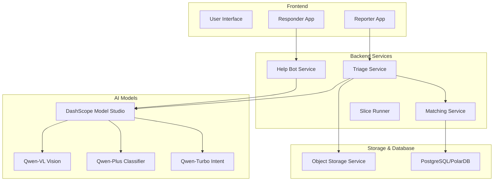
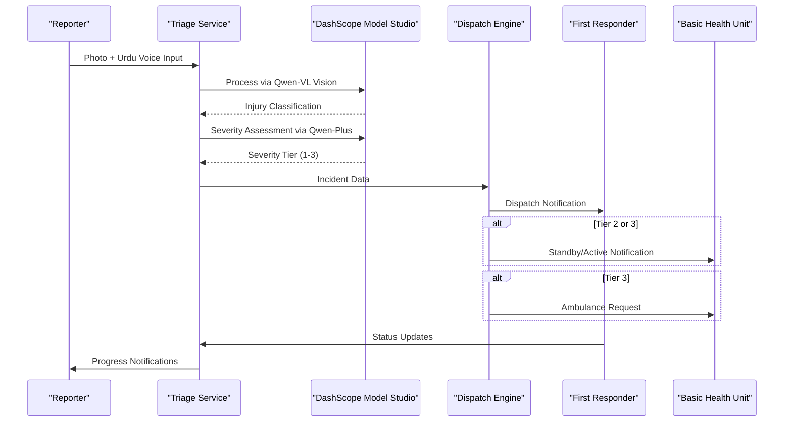
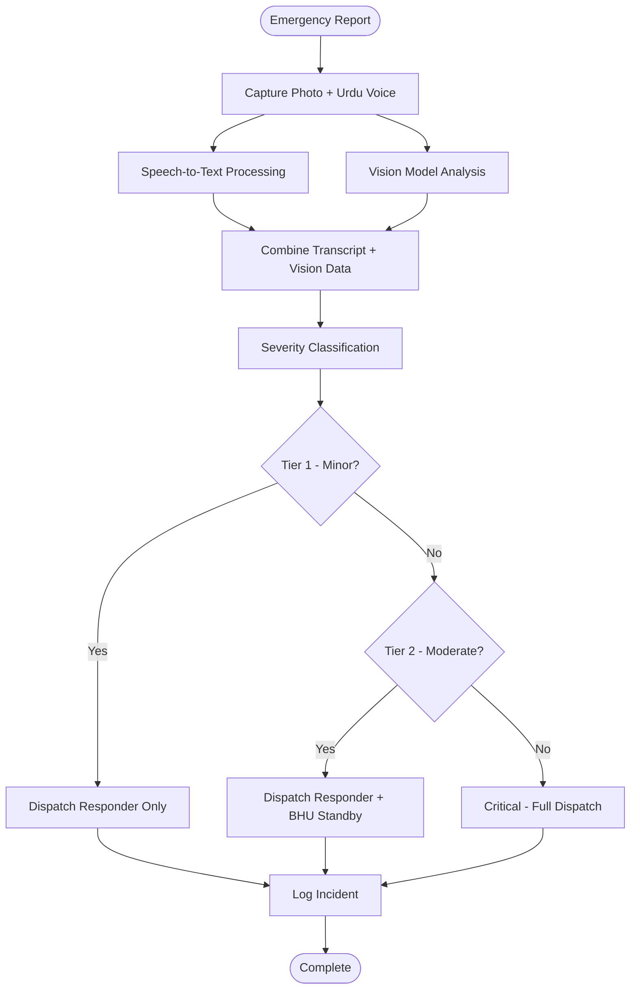
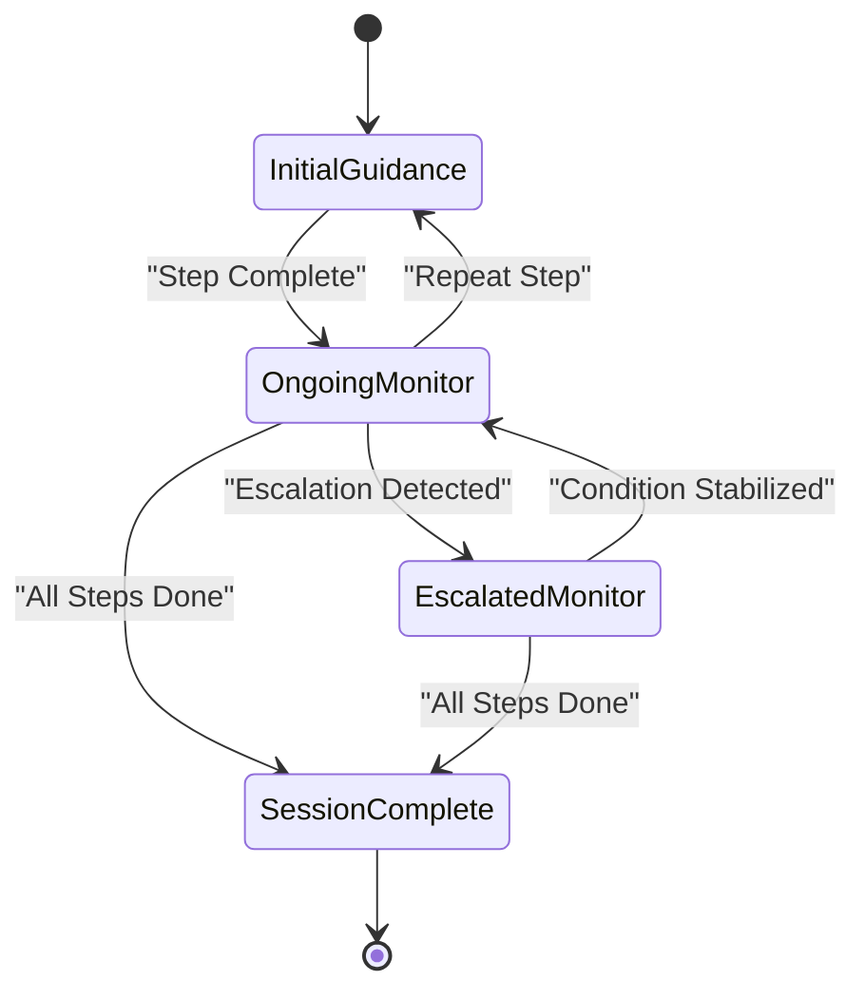
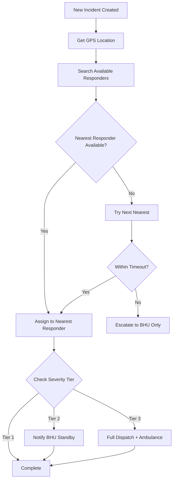
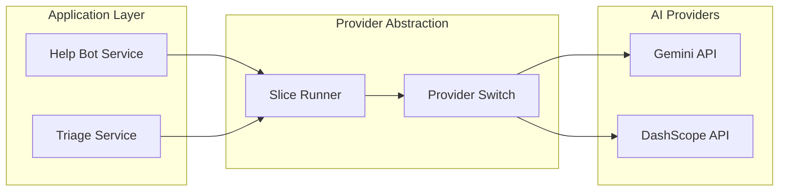

# Project Overview

<cite>
**Referenced Files in This Document**
- [PROJECT.md](file://PROJECT.md)
- [village-emergency-response-system-spec.md](file://village-emergency-response-system-spec.md)
- [DEMO_SCRIPT.md](file://DEMO_SCRIPT.md)
- [help_bot_service.py](file://backend/services/help_bot_service.py)
- [help_bot_content.py](file://backend/services/help_bot_content.py)
- [slice_runner.py](file://backend/slice_runner.py)
- [requirements.txt](file://backend/requirements.txt)
</cite>

## Table of Contents
1. [Introduction](#introduction)
2. [Project Structure](#project-structure)
3. [Core Components](#core-components)
4. [Architecture Overview](#architecture-overview)
5. [Detailed Component Analysis](#detailed-component-analysis)
6. [Dependency Analysis](#dependency-analysis)
7. [Performance Considerations](#performance-considerations)
8. [Troubleshooting Guide](#troubleshooting-guide)
9. [Conclusion](#conclusion)

## Introduction
LifeLine Ride is an AI-powered emergency response coordination system designed for rural Pakistan. Its mission is to drastically reduce the time it takes for a bystander or family member to report an emergency—targeting under 30 seconds—by enabling Urdu voice and photo-based triage without typing or complex forms. The system serves three primary user groups:
- Rural bystanders/families (Reporters) who can quickly report emergencies using voice and photos
- Non-professional first-responders who provide immediate, hands-free guidance via an AI help bot
- Basic Health Units (BHUs) that receive timely notifications and coordinate escalation when needed

The system addresses critical challenges in rural emergency response, including illiteracy barriers, panic-induced delays, limited connectivity, and slow dispatch times. By combining AI-driven triage with localized, voice-first workflows, LifeLine Ride ensures faster, more reliable emergency coordination even in low-resource settings.

## Project Structure
The project follows a modular architecture with clear separation between frontend, backend services, and mock data for testing and demonstration purposes.

**Diagram sources**
- [PROJECT.md:8-15](file://PROJECT.md#L8-L15)
- [village-emergency-response-system-spec.md:11-15](file://village-emergency-response-system-spec.md#L11-L15)

**Section sources**
- [PROJECT.md:1-20](file://PROJECT.md#L1-L20)
- [village-emergency-response-system-spec.md:1-20](file://village-emergency-response-system-spec.md#L1-L20)

## Core Components
LifeLine Ride consists of nine core modules that work together to provide comprehensive emergency response coordination:

### Module 1: Emergency Registration & AI Triage
This module enables rapid emergency reporting through Urdu voice input and photo capture. It processes voice recordings using speech-to-text technology and analyzes injury photos using vision models to determine severity levels. The system automatically captures GPS location and reporter information, then combines all inputs to classify incidents into three severity tiers: Minor (Tier 1), Moderate (Tier 2), and Critical (Tier 3).

### Module 2: Responder AI Help Bot
A hands-free, voice-first guidance system that provides real-time first aid instructions to non-professional responders. The bot uses a hardcoded decision tree approach rather than freeform conversation AI, ensuring medical accuracy while maintaining flexibility for unexpected situations. It supports Urdu voice interaction and includes escalation triggers for worsening conditions.

### Module 3: Matching & Dispatch Engine
Intelligent responder and BHU matching based on GPS proximity, availability status, and severity tier requirements. The system maintains ranked lists of available responders and automatically escalates to BHU notification or ambulance dispatch based on incident severity.

### Module 4: Localization System
Global Urdu-first interface design that ensures accessibility for rural users regardless of literacy level. The system treats Urdu as the default language across all components, with provisions for future multi-language support.

### Modules 5 & 6: Registry & Outcome Tracking
Comprehensive tracking system that monitors responder performance through a points-based accountability system and logs complete incident lifecycles from report to resolution. This includes fraud prevention mechanisms and coverage gap analysis.

### Module 8: Escalation Handling
Automated timeout and condition escalation logic that ensures no incident goes unaddressed. The system handles responder unavailability, mid-incident deterioration, and automatic re-routing to alternative resources.

### Module 9: Reporter Updates
Asynchronous status notifications that keep reporters informed throughout the emergency response process, reducing anxiety and improving transparency.

**Section sources**
- [PROJECT.md:8-15](file://PROJECT.md#L8-L15)
- [village-emergency-response-system-spec.md:11-178](file://village-emergency-response-system-spec.md#L11-L178)

## Architecture Overview
The system architecture leverages Alibaba Cloud's DashScope Model Studio with specialized Qwen models for different aspects of emergency processing.

**Diagram sources**
- [PROJECT.md:8-15](file://PROJECT.md#L8-L15)
- [village-emergency-response-system-spec.md:11-82](file://village-emergency-response-system-spec.md#L11-L82)

The technology stack utilizes:
- **Alibaba Cloud DashScope Model Studio**: Central AI service hub
- **Qwen-VL Max**: Vision model for injury classification from photos
- **Qwen-Plus**: Triage classifier for severity assessment
- **Qwen-Turbo**: Intent matching for natural language understanding
- **Function Compute 3.0**: Serverless API infrastructure
- **OSS (Object Storage Service)**: Encrypted temporary media storage
- **PostgreSQL/PolarDB**: Spatial database with location-based queries

**Section sources**
- [PROJECT.md:17-20](file://PROJECT.md#L17-L20)
- [slice_runner.py:132-140](file://slice_runner.py#L132-L140)

## Detailed Component Analysis

### Emergency Registration & AI Triage Module
The triage module implements a sophisticated two-model pipeline that processes both visual and audio inputs simultaneously to determine incident severity.

**Diagram sources**
- [village-emergency-response-system-spec.md:11-37](file://village-emergency-response-system-spec.md#L11-L37)
- [slice_runner.py:477-502](file://slice_runner.py#L477-L502)

The module handles edge cases gracefully by defaulting to moderate severity when confidence is low, ensuring safety over speed in uncertain situations.

### Responder AI Help Bot Module
The help bot implements a state machine-driven conversation flow that provides structured first aid guidance while monitoring for escalation signals.

**Diagram sources**
- [help_bot_service.py:663-686](file://backend/services/help_bot_service.py#L663-L686)
- [help_bot_content.py:46-200](file://backend/services/help_bot_content.py#L46-L200)

The bot uses hardcoded content for all responses, ensuring medical accuracy while providing flexibility through intent classification and escalation detection.

### Matching & Dispatch Engine
The dispatch engine implements intelligent resource allocation based on geographic proximity, availability, and incident severity requirements.

**Diagram sources**
- [village-emergency-response-system-spec.md:66-82](file://village-emergency-response-system-spec.md#L66-L82)

**Section sources**
- [village-emergency-response-system-spec.md:11-178](file://village-emergency-response-system-spec.md#L11-L178)
- [help_bot_service.py:576-648](file://backend/services/help_bot_service.py#L576-L648)

## Dependency Analysis
The system exhibits careful dependency management with clear separation between AI providers and business logic.

**Diagram sources**
- [slice_runner.py:132-140](file://slice_runner.py#L132-L140)
- [help_bot_service.py:160-168](file://backend/services/help_bot_service.py#L160-L168)

Key dependencies include:
- **Alibaba Cloud DashScope SDK**: For accessing Qwen models and other AI services
- **Google GenAI SDK**: Currently used as primary provider with DashScope as fallback
- **Audio Processing Libraries**: Sounddevice and Soundfile for voice input/output
- **Environment Configuration**: Python-dotenv for secure credential management

**Section sources**
- [requirements.txt:1-6](file://backend/requirements.txt#L1-L6)
- [slice_runner.py:142-148](file://slice_runner.py#L142-L148)

## Performance Considerations
The system is designed for optimal performance in rural environments with potential connectivity limitations:

- **Voice-First Interface**: Eliminates typing requirements, reducing cognitive load during emergencies
- **Offline-Friendly Design**: Supports SMS/USSD fallbacks for low-connectivity scenarios
- **Efficient AI Processing**: Uses specialized models for specific tasks (vision, text, intent) rather than monolithic approaches
- **Caching Mechanisms**: Implements TTS caching to reduce repeated API calls and improve response times
- **Graceful Degradation**: Falls back to safe defaults when AI services are unavailable

The system targets under-30-second emergency reporting through streamlined interfaces and parallel processing of voice and visual inputs.

## Troubleshooting Guide
Common issues and their resolutions:

### AI Service Failures
- **Symptom**: No response from AI models
- **Solution**: System automatically falls back to pre-rendered Urdu fail-safe messages
- **Prevention**: Implement proper error handling and retry logic

### Audio Processing Issues
- **Symptom**: Voice input not recognized
- **Solution**: Check microphone permissions and audio quality; system includes VAD (Voice Activity Detection) for noise filtering
- **Prevention**: Calibrate audio thresholds for different environments

### Network Connectivity Problems
- **Symptom**: Slow or failed API calls
- **Solution**: Implement timeout handling and local caching strategies
- **Prevention**: Use offline-first design patterns where possible

### Provider Switching Issues
- **Symptom**: Incorrect AI provider selection
- **Solution**: Verify environment variables and API key configuration
- **Prevention**: Implement provider health checks and automatic failover

**Section sources**
- [help_bot_service.py:689-695](file://backend/services/help_bot_service.py#L689-L695)
- [slice_runner.py:119-130](file://slice_runner.py#L119-L130)

## Conclusion
LifeLine Ride represents a significant advancement in rural emergency response coordination, addressing critical gaps in healthcare access for underserved communities in Pakistan. By leveraging AI-powered triage, voice-first interfaces, and intelligent dispatch systems, the platform dramatically reduces emergency reporting time while maintaining high standards of medical accuracy and safety.

The system's modular architecture allows for scalable deployment and easy integration with existing healthcare infrastructure. Its focus on localization, accessibility, and reliability makes it particularly well-suited for rural environments where traditional emergency response systems often fall short.

Future enhancements could include expanded language support, advanced predictive analytics for resource allocation, and integration with broader telemedicine platforms. The foundation established by LifeLine Ride provides a robust platform for continued innovation in rural healthcare delivery.