# Frontend Cockpit Application

<cite>
**Referenced Files in This Document**
- [main.tsx](file://frontend/src/main.tsx)
- [App.tsx](file://frontend/src/App.tsx)
- [CockpitContext.tsx](file://frontend/src/state/CockpitContext.tsx)
- [Header.tsx](file://frontend/src/components/Header.tsx)
- [SituationMap.tsx](file://frontend/src/components/SituationMap.tsx)
- [TimelineFeed.tsx](file://frontend/src/components/TimelineFeed.tsx)
- [ReporterView.tsx](file://frontend/src/views/ReporterView.tsx)
- [ResponderView.tsx](file://frontend/src/views/ResponderView.tsx)
- [BhuView.tsx](file://frontend/src/views/BhuView.tsx)
- [LandingView.tsx](file://frontend/src/views/LandingView.tsx)
- [api.ts](file://frontend/src/lib/api.ts)
- [types.ts](file://frontend/src/lib/types.ts)
- [usePoll.ts](file://frontend/src/hooks/usePoll.ts)
- [useSpeechToText.ts](file://frontend/src/hooks/useSpeechToText.ts)
- [ui.tsx](file://frontend/src/components/ui.tsx)
- [index.css](file://frontend/src/index.css)
- [package.json](file://frontend/package.json)
- [vite.config.ts](file://frontend/vite.config.ts)
</cite>

## Update Summary
**Changes Made**
- Major overhaul to three-panel concurrent cockpit layout with LandingView entry point
- Enhanced Header navigation with role-based panel jumping and live status indicators
- Improved SituationMap with route-based animations and ambulance markers
- Comprehensive updates to all view components (ReporterView, ResponderView, BhuView) supporting real-time multi-role demonstration capabilities
- New LandingView providing role selection gateway with live incident status display
- Enhanced speech-to-text integration across all views with Urdu language support
- Improved form handling with real-time audio recording capabilities
- Updated UI components with pill geometry and clinical styling

## Table of Contents
1. [Introduction](#introduction)
2. [Project Structure](#project-structure)
3. [Core Components](#core-components)
4. [Architecture Overview](#architecture-overview)
5. [Detailed Component Analysis](#detailed-component-analysis)
6. [Dependency Analysis](#dependency-analysis)
7. [Performance Considerations](#performance-considerations)
8. [Troubleshooting Guide](#troubleshooting-guide)
9. [Conclusion](#conclusion)

## Introduction
This document describes the frontend cockpit application for a village emergency response system. The application has been completely redesigned to feature a three-panel concurrent layout where all three role-based views (Reporter, Field Responder, BHU Clinic & Audit) are visible simultaneously on one screen, enabling real-time demonstration of the complete emergency response workflow. The new LandingView serves as an entry point allowing users to select their role, while the enhanced Header provides navigation between panels. The interface features smooth route-based animations on the situation map, comprehensive speech-to-text integration with Urdu language support, and improved form handling with real-time audio recording capabilities.

## Project Structure
The frontend is organized by feature areas with a new landing page architecture:
- Entry and layout: main.tsx, App.tsx, Header.tsx, LandingView.tsx
- State and polling: state/CockpitContext.tsx, hooks/usePoll.ts
- Speech processing: hooks/useSpeechToText.ts
- Views: ReporterView, ResponderView, BhuView, LandingView
- Shared components: ui.tsx, SituationMap.tsx, TimelineFeed.tsx
- API client and types: lib/api.ts, lib/types.ts
- Design system: index.css with high-contrast styling and animations
- Build and dev config: package.json, vite.config.ts

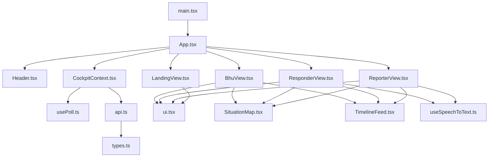

**Diagram sources**
- [main.tsx:10-25](file://frontend/src/main.tsx#L10-L25)
- [App.tsx:24-34](file://frontend/src/App.tsx#L24-L34)
- [CockpitContext.tsx:14-42](file://frontend/src/state/CockpitContext.tsx#L14-L42)
- [api.ts:24-40](file://frontend/src/lib/api.ts#L24-L40)
- [types.ts:15-62](file://frontend/src/lib/types.ts#L15-L62)

**Section sources**
- [main.tsx:1-26](file://frontend/src/main.tsx#L1-L26)
- [App.tsx:1-204](file://frontend/src/App.tsx#L1-L204)
- [package.json:1-33](file://frontend/package.json#L1-L33)
- [vite.config.ts:1-17](file://frontend/vite.config.ts#L1-L17)

## Core Components
- **Three-Panel Concurrent Layout**: All three role views (Reporter, Responder, BHU) are mounted simultaneously in equal columns from xl breakpoint up, with internal scrolling and sticky headers for optimal demonstration viewing.
- **Enhanced LandingView**: Gateway screen with role selection cards showing live incident status, responder availability, and health unit information.
- **CockpitProvider**: Centralized state container holding role, route, active incident, responders, health status, bot turns, and actions with hash-based routing.
- **Enhanced Header**: Global navigation with role tabs that scroll to panels, live backend status, active incident chip, and bilingual language switcher.
- **Speech-to-Text Integration**: useSpeechToText hook provides Web Speech API integration with Urdu language support, fallback languages, and error handling across all views.
- **Enhanced Polling Engine**: usePoll manages interval-based fetching with overlap safety, error handling, and subject-key resets.
- **API Client**: Typed HTTP client normalizing errors, form encoding for reporting, media URL resolution, and endpoint helpers.
- **Modern UI Components**: Pill buttons, cards with 24/32px radii, tags, badges, and status indicators following clinical design patterns.
- **Route-Based Animations**: Smooth interpolation system for responder and ambulance movement along polylines with CSS-animated route vectors.

**Section sources**
- [App.tsx:68-96](file://frontend/src/App.tsx#L68-L96)
- [LandingView.tsx:98-236](file://frontend/src/views/LandingView.tsx#L98-L236)
- [Header.tsx:32-217](file://frontend/src/components/Header.tsx#L32-L217)
- [CockpitContext.tsx:228-792](file://frontend/src/state/CockpitContext.tsx#L228-L792)
- [useSpeechToText.ts:47-229](file://frontend/src/hooks/useSpeechToText.ts#L47-L229)
- [usePoll.ts:1-139](file://frontend/src/hooks/usePoll.ts#L1-L139)
- [api.ts:42-153](file://frontend/src/lib/api.ts#L42-L153)
- [ui.tsx:17-356](file://frontend/src/components/ui.tsx#L17-L356)

## Architecture Overview
The cockpit uses a provider-driven architecture with hash-based routing where all views consume shared state from CockpitContext. The three-panel layout ensures all roles are visible simultaneously for demonstration purposes, while the LandingView provides role selection. Data flows via periodic polling of backend endpoints, while user actions trigger mutations that refresh relevant data.

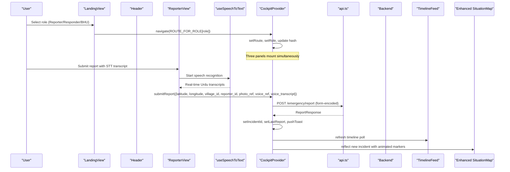

**Diagram sources**
- [LandingView.tsx:113-115](file://frontend/src/views/LandingView.tsx#L113-L115)
- [CockpitContext.tsx:329-336](file://frontend/src/state/CockpitContext.tsx#L329-L336)
- [ReporterView.tsx:205-239](file://frontend/src/views/ReporterView.tsx#L205-L239)
- [useSpeechToText.ts:67-81](file://frontend/src/hooks/useSpeechToText.ts#L67-L81)
- [CockpitContext.tsx:347-367](file://frontend/src/state/CockpitContext.tsx#L347-L367)
- [api.ts:172-186](file://frontend/src/lib/api.ts#L172-L186)

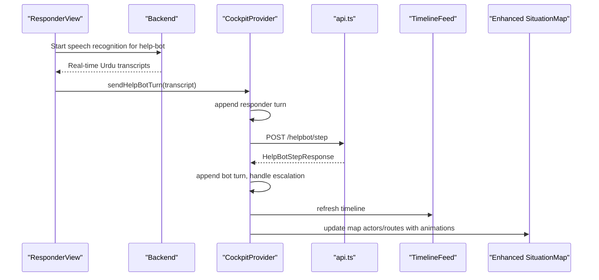

**Diagram sources**
- [ResponderView.tsx:231-241](file://frontend/src/views/ResponderView.tsx#L231-L241)
- [useSpeechToText.ts:477-482](file://frontend/src/hooks/useSpeechToText.ts#L477-L482)
- [CockpitContext.tsx:453-511](file://frontend/src/state/CockpitContext.tsx#L453-L511)
- [api.ts:228-238](file://frontend/src/lib/api.ts#L228-L238)

## Detailed Component Analysis

### Enhanced Three-Panel Layout and Shell
- **Concurrent Panel Display**: All three role views (Reporter, Responder, BHU) mount simultaneously in a responsive grid layout with equal columns from xl breakpoint.
- **Sticky Headers**: Each panel has sticky positioning under the header with internal scrolling, keeping panel headings visible during content scrolling.
- **Role Banner System**: Each panel displays step number, bilingual labels, and contextual hints with high-contrast styling.
- **Enhanced ToastStack**: Non-blocking notifications positioned bottom-right with tone-based styling and auto-dismiss functionality.

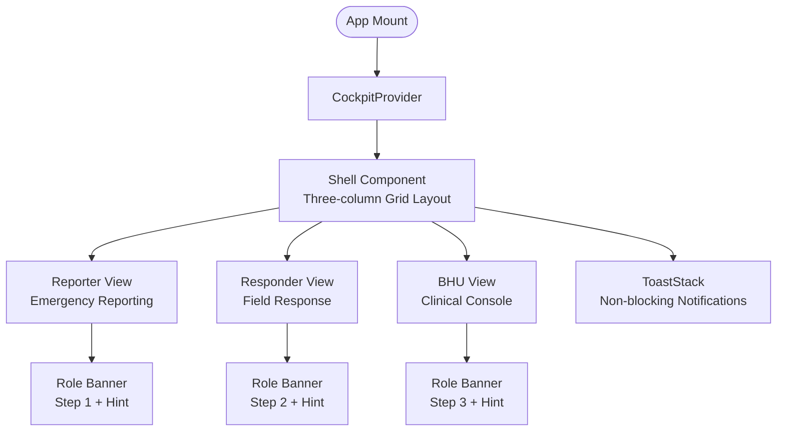

**Diagram sources**
- [App.tsx:76-96](file://frontend/src/App.tsx#L76-L96)
- [App.tsx:102-121](file://frontend/src/App.tsx#L102-L121)
- [App.tsx:123-167](file://frontend/src/App.tsx#L123-L167)
- [App.tsx:169-204](file://frontend/src/App.tsx#L169-L204)

**Section sources**
- [App.tsx:1-204](file://frontend/src/App.tsx#L1-L204)

### Enhanced LandingView (Gateway Screen)
- **Role Selection Cards**: Three large cards for Reporter, Responder, and BHU roles with bilingual descriptions and call-to-action buttons.
- **Live Status Integration**: Cards show real-time incident status, responder availability, and health unit information derived from backend data.
- **Stat Strip**: Displays key metrics including reportable villages, available responders, linked health units, and simultaneous alerts.
- **Healthcare Guardrail**: Prominent disclaimer about system assistance vs. diagnosis responsibilities.

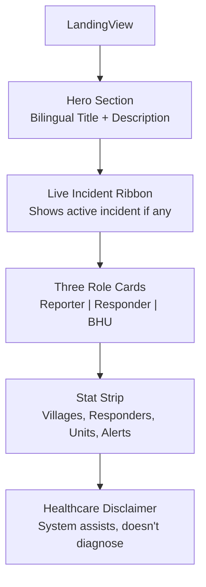

**Diagram sources**
- [LandingView.tsx:117-235](file://frontend/src/views/LandingView.tsx#L117-L235)
- [LandingView.tsx:242-316](file://frontend/src/views/LandingView.tsx#L242-L316)
- [LandingView.tsx:322-383](file://frontend/src/views/LandingView.tsx#L322-L383)

**Section sources**
- [LandingView.tsx:1-467](file://frontend/src/views/LandingView.tsx#L1-L467)

### Enhanced Header Navigation
- **Brand Wordmark**: Clickable logo that scrolls to reporter panel with bilingual branding.
- **Live Backend Status**: Health chip showing backend and database connectivity with detailed error information.
- **Active Incident Chip**: Shows current incident ID with status indicator and severity tier.
- **Role Navigation Tabs**: Segment-based navigation that scrolls to specific panels rather than changing views.
- **Quick Demo Button**: Triggers pre-configured demo scenario with cached assets.
- **Adopt Incident Feature**: Allows tracking existing incidents by ID.
- **Language Switcher**: Segmented English/اردو toggle with proper RTL support.

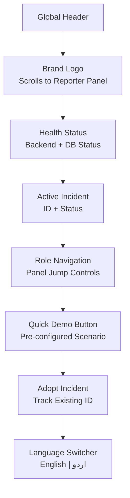

**Diagram sources**
- [Header.tsx:72-217](file://frontend/src/components/Header.tsx#L72-L217)
- [Header.tsx:319-360](file://frontend/src/components/Header.tsx#L319-L360)

**Section sources**
- [Header.tsx:1-360](file://frontend/src/components/Header.tsx#L1-L360)

### Enhanced CockpitProvider (State and Actions)
- **Hash-based Routing**: Maintains independent `route` and `role` state for deep-linking and browser navigation support.
- **Multi-Perspective State**: All three views share the same incident context while maintaining role-specific UI states.
- **Enhanced Actions**: submitReport, respond, markArrived, sendHelpBotTurn, closeActiveIncident, verifyCandidate, adoptIncident, resetDemo, refreshAll.
- **Improved Error Handling**: Normalizes failures into toasts and ensures safe refresh behavior across multiple polls.
- **Quick Demo Support**: Provides nonce-based signaling mechanism for automated demo scenarios.

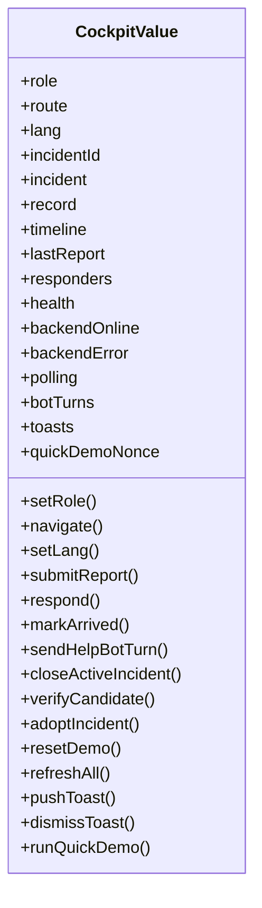

**Diagram sources**
- [CockpitContext.tsx:129-203](file://frontend/src/state/CockpitContext.tsx#L129-L203)
- [CockpitContext.tsx:228-792](file://frontend/src/state/CockpitContext.tsx#L228-L792)

**Section sources**
- [CockpitContext.tsx:1-814](file://frontend/src/state/CockpitContext.tsx#L1-L814)

### Enhanced Reporting Flow (ReporterView)
- **Integrated Audio Recording**: MediaRecorder API for capturing actual audio files with timer display and Web Speech API transcription.
- **Real-time Urdu Transcription**: Simultaneous speech recognition and audio recording with automatic injury classification.
- **Scenario Alignment**: Preset scenarios automatically align photo, voice, and village references for deterministic triage results.
- **Post-submit Tracker**: Distress status tracker shows assigned responder, dispatch facts, and progressive timeline feed.
- **Quick Demo Integration**: Seamless integration with header's quick demo button for automated testing.

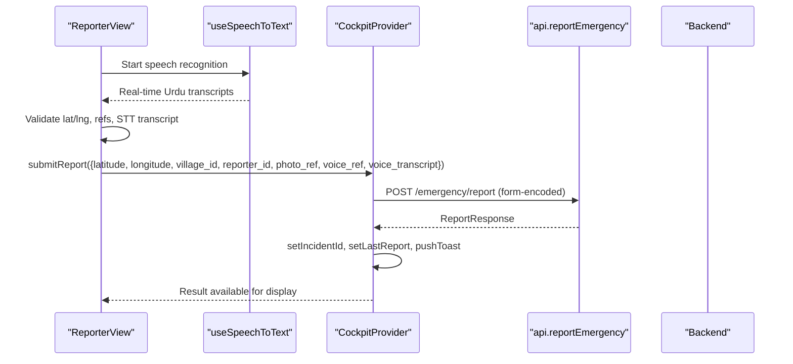

**Diagram sources**
- [ReporterView.tsx:205-239](file://frontend/src/views/ReporterView.tsx#L205-L239)
- [useSpeechToText.ts:67-81](file://frontend/src/hooks/useSpeechToText.ts#L67-L81)
- [api.ts:172-186](file://frontend/src/lib/api.ts#L172-L186)
- [CockpitContext.tsx:347-367](file://frontend/src/state/CockpitContext.tsx#L347-L367)

**Section sources**
- [ReporterView.tsx:1-659](file://frontend/src/views/ReporterView.tsx#L1-L659)

### Enhanced Responder Workflow (ResponderView)
- **Route Progress Animation**: Smooth interpolation progress for distance countdown matching situation map animations.
- **Hands-free Guidance**: Audio playback with explicit user gesture gating to prevent ghost audio on tab load.
- **Conversation Management**: Chat bubbles with speaker identification, timestamps, and escalation indicators.
- **Quick Reply Chips**: Pre-defined responses for common scenarios with exact transcript preservation.
- **Registry Roster**: Live responder availability display with color-coded status indicators.

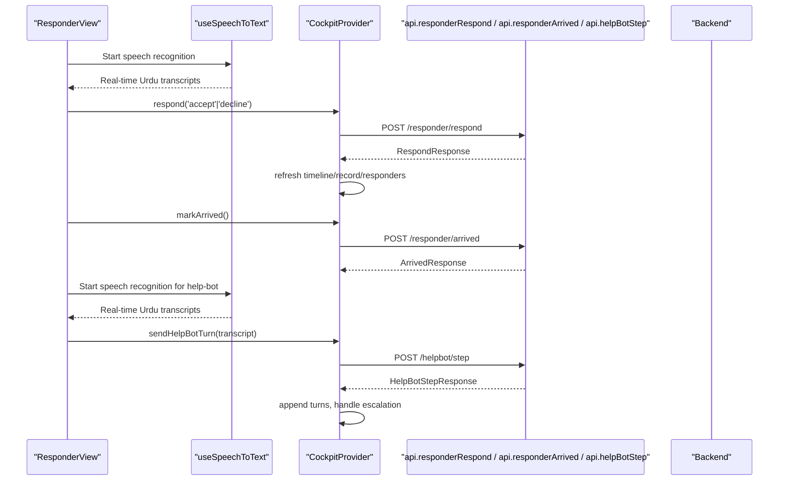

**Diagram sources**
- [ResponderView.tsx:219-241](file://frontend/src/views/ResponderView.tsx#L219-L241)
- [useSpeechToText.ts:477-482](file://frontend/src/hooks/useSpeechToText.ts#L477-L482)
- [CockpitContext.tsx:369-415](file://frontend/src/state/CockpitContext.tsx#L369-L415)
- [CockpitContext.tsx:417-451](file://frontend/src/state/CockpitContext.tsx#L417-L451)
- [CockpitContext.tsx:453-511](file://frontend/src/state/CockpitContext.tsx#L453-L511)
- [api.ts:208-238](file://frontend/src/lib/api.ts#L208-L238)

**Section sources**
- [ResponderView.tsx:1-789](file://frontend/src/views/ResponderView.tsx#L1-L789)

### Enhanced BHU Verification and Closure (BhuView)
- **Integrated Situation Map**: Top half displays live map with animated routes and actor positions.
- **Formal Closure Gate**: Outcome selection, confirmer choice, and actor identity with fraud prevention gate.
- **Accountability Scorecard**: Performance records per responder with automatic refresh on incident closure.
- **Verification Gate**: Equipment checklist and verifier identity requirements for candidate verification.

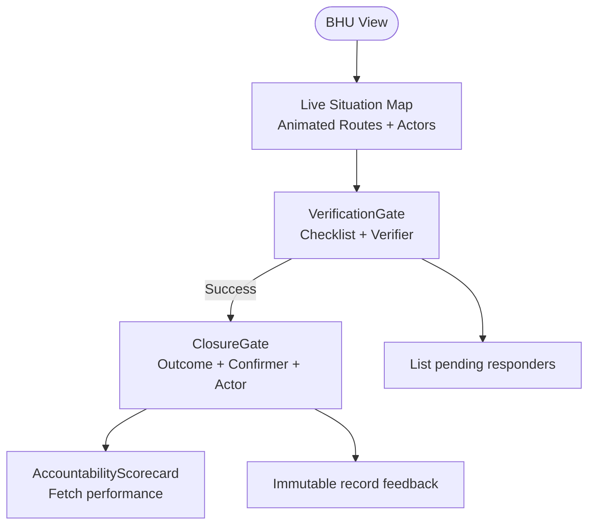

**Diagram sources**
- [BhuView.tsx:74-116](file://frontend/src/views/BhuView.tsx#L74-L116)
- [BhuView.tsx:127-440](file://frontend/src/views/BhuView.tsx#L127-L440)
- [BhuView.tsx:484-782](file://frontend/src/views/BhuView.tsx#L484-L782)

**Section sources**
- [BhuView.tsx:1-986](file://frontend/src/views/BhuView.tsx#L1-L986)

### Enhanced Live Situation Map with Route-Based Animations
- **Smooth Animation System**: 11-second interpolation cycle for responder and ambulance movement along polylines using requestAnimationFrame.
- **Ambulance Markers**: Special yellow ambulance markers that depart from BHU toward incident when requested with dashed route lines.
- **Animated Route Vectors**: CSS-animated dashed lines showing live routes between actors with flow animation.
- **Enhanced Marker System**: Custom div icons with proper sizing, z-indexing, and popups for different actor types.
- **Smart Bounds Management**: Fits bounds only when actor set changes to avoid constant re-zoom.
- **High-Contrast Styling**: Inverted OpenStreetMap tiles with custom dark theme and clinical accent colors.

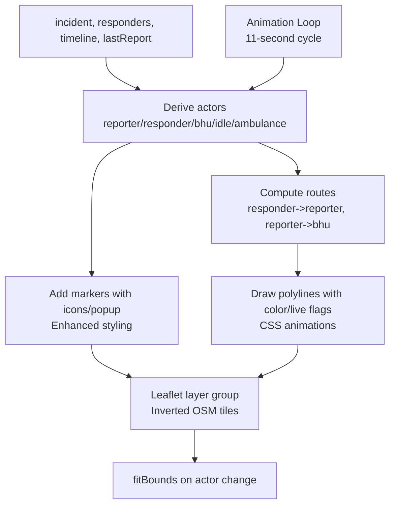

**Diagram sources**
- [SituationMap.tsx:100-146](file://frontend/src/components/SituationMap.tsx#L100-L146)
- [SituationMap.tsx:327-498](file://frontend/src/components/SituationMap.tsx#L327-L498)
- [index.css:207-296](file://frontend/src/index.css#L207-L296)

**Section sources**
- [SituationMap.tsx:1-618](file://frontend/src/components/SituationMap.tsx#L1-L618)

### Enhanced Live Status Timeline
- **High-Contrast Header**: Dark background with white text and improved status indicators.
- **Localized Urdu Updates**: Sorted by timestamp and stage order with enhanced visual hierarchy.
- **Enhanced Badges**: Coverage gap, mid-incident escalation, and ambulance request badges with improved styling.
- **Status Indicators**: Shows polling status and backend connectivity with better visual feedback.
- **Improved Accessibility**: Better contrast ratios and screen reader support.

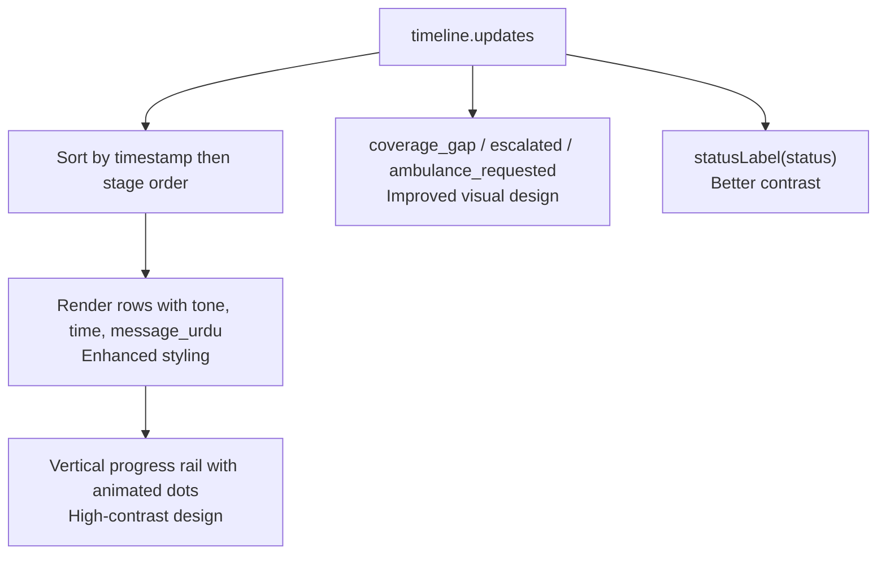

**Diagram sources**
- [TimelineFeed.tsx:16-31](file://frontend/src/components/TimelineFeed.tsx#L16-L31)
- [TimelineFeed.tsx:117-144](file://frontend/src/components/TimelineFeed.tsx#L117-L144)

**Section sources**
- [TimelineFeed.tsx:1-217](file://frontend/src/components/TimelineFeed.tsx#L1-L217)

### Enhanced API Client and Types
- Normalizes transport and HTTP errors into ApiRequestError with code/message.
- Form-encodes report submissions; JSON for other endpoints.
- Resolves relative media URLs for help-bot audio.
- Strongly typed payloads mirroring backend contracts.

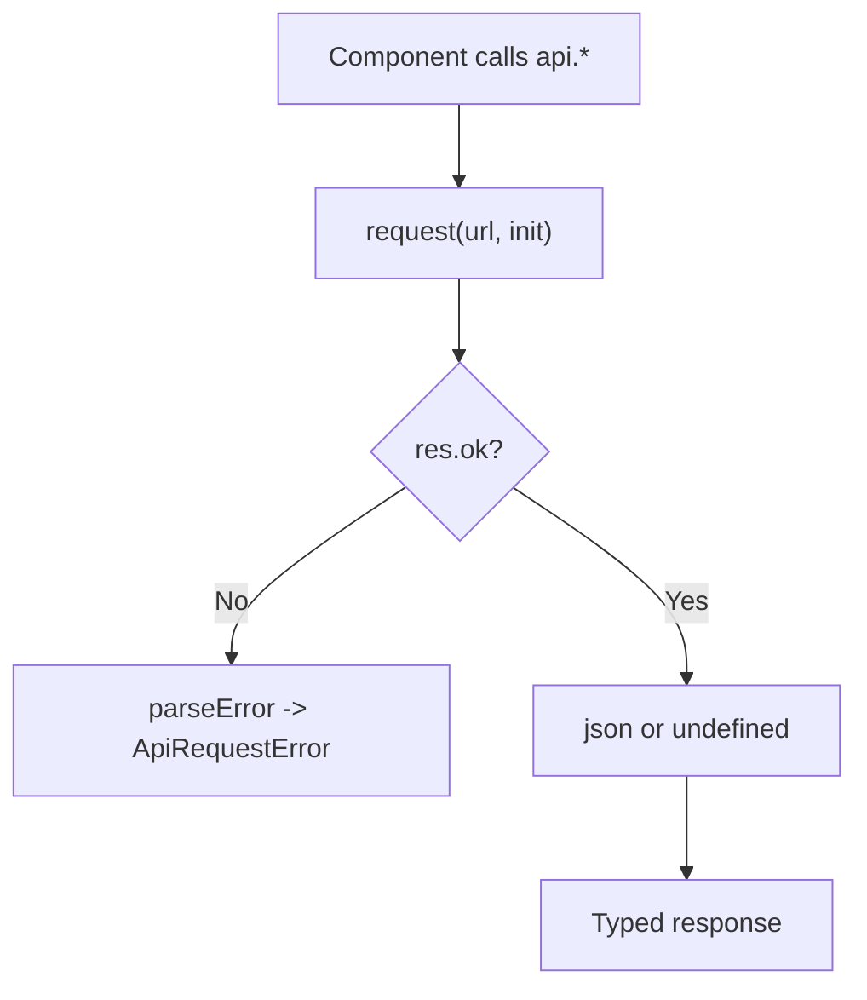

**Diagram sources**
- [api.ts:72-130](file://frontend/src/lib/api.ts#L72-L130)
- [api.ts:144-153](file://frontend/src/lib/api.ts#L144-L153)
- [types.ts:149-261](file://frontend/src/lib/types.ts#L149-L261)

**Section sources**
- [api.ts:1-318](file://frontend/src/lib/api.ts#L1-L318)
- [types.ts:1-268](file://frontend/src/lib/types.ts#L1-L268)

### Enhanced Speech-to-Text Hook
- **Web Speech API Integration**: Comprehensive implementation with browser compatibility checks.
- **Urdu Language Support**: Primary language 'ur-PK' with fallback to 'ur'.
- **Real-time Transcription**: Continuous listening with interim results and final transcripts.
- **Error Handling**: Graceful degradation for unsupported browsers and permission issues.
- **Auto-restart**: Automatic restart on silence timeouts and connection issues.

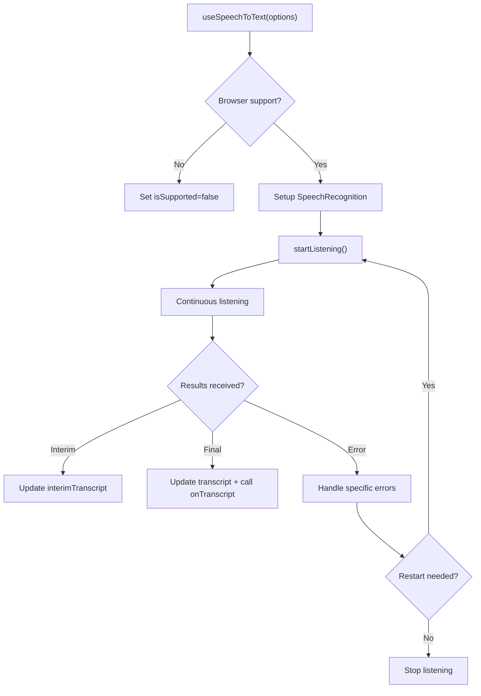

**Diagram sources**
- [useSpeechToText.ts:47-229](file://frontend/src/hooks/useSpeechToText.ts#L47-L229)

**Section sources**
- [useSpeechToText.ts:1-230](file://frontend/src/hooks/useSpeechToText.ts#L1-L230)

### Enhanced Polling Hook
- Overlap-safe interval polling with skip-if-enabled=false guard.
- Resets state when subject key changes; keeps previous data on error by default.
- Tracks loading, error, and last updated timestamps.

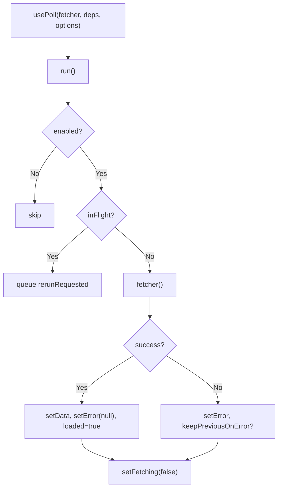

**Diagram sources**
- [usePoll.ts:32-139](file://frontend/src/hooks/usePoll.ts#L32-L139)

**Section sources**
- [usePoll.ts:1-139](file://frontend/src/hooks/usePoll.ts#L1-L139)

## Dependency Analysis
- App depends on CockpitProvider for state and actions with three-panel concurrent mounting.
- Views depend on api.ts for backend communication and types.ts for shape definitions.
- SituationMap and TimelineFeed depend on shared state and utility modules (geography, urdu).
- usePoll is reused by multiple providers and views for live data.
- **New**: useSpeechToText is integrated across ReporterView and ResponderView for voice input.
- **New**: LandingView provides role selection gateway with live status integration.
- **Enhanced**: UI components provide consistent styling with pill geometry and high-contrast design.

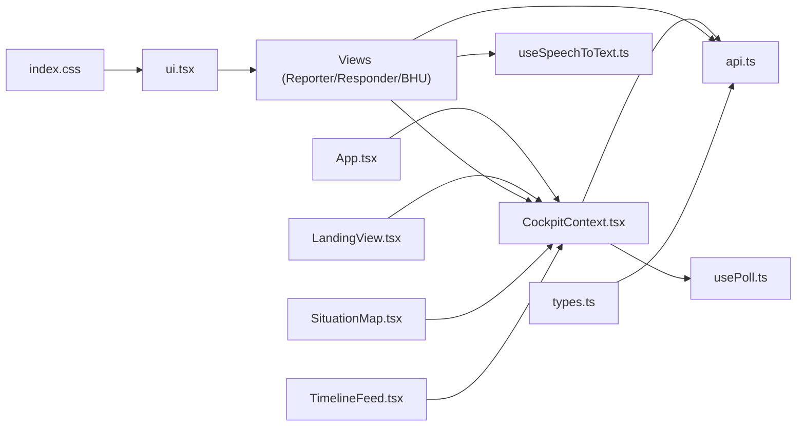

**Diagram sources**
- [App.tsx:24-34](file://frontend/src/App.tsx#L24-L34)
- [CockpitContext.tsx:14-42](file://frontend/src/state/CockpitContext.tsx#L14-L42)
- [api.ts:24-40](file://frontend/src/lib/api.ts#L24-L40)
- [types.ts:15-62](file://frontend/src/lib/types.ts#L15-L62)

**Section sources**
- [App.tsx:1-204](file://frontend/src/App.tsx#L1-L204)
- [CockpitContext.tsx:1-814](file://frontend/src/state/CockpitContext.tsx#L1-L814)
- [api.ts:1-318](file://frontend/src/lib/api.ts#L1-L318)
- [types.ts:1-268](file://frontend/src/lib/types.ts#L1-L268)

## Performance Considerations
- Polling intervals are tuned: timeline every ~2.5s, record every ~3s, health and responders every ~3-5s.
- usePoll prevents overlapping requests and avoids stacking behind slow backends.
- Map fitBounds runs only on actor set changes to prevent frequent re-zoom.
- **Enhanced Animation System**: Efficient 11-second animation cycles using requestAnimationFrame for smooth marker movement.
- **Speech Recognition Optimization**: Debounced transcription updates and efficient DOM manipulation.
- Media URLs resolved once; audio autoplay attempts gracefully degrade if blocked.
- StrictMode enabled to catch duplicate Leaflet instances and race conditions early.
- **Design System Efficiency**: Reusable Tailwind classes minimize CSS bloat and improve rendering performance.
- **Three-Panel Rendering**: All views mount simultaneously but maintain independent scroll contexts for optimal performance.

## Troubleshooting Guide
- Backend unreachable: Header shows offline indicator; toasts surface normalized errors with codes/messages.
- Missing incident: Views show empty states with guidance to return to Reporter view.
- Verification failures: Empty equipment checklist or missing verifier yields explicit error notes.
- Closure immutability: Repeated close attempts indicate already closed; fraud gate may refuse metric counting.
- Polling stalls: If feed stalls, check backend connectivity and ensure incidentId is set.
- **Speech Recognition Issues**: Browser compatibility checks, microphone permissions, and language support fallbacks.
- **Animation Performance**: Monitor frame rates and adjust animation complexity if needed.
- **Memory Management**: Proper cleanup of speech recognition instances and animation frames.
- **Three-Panel Memory**: Ensure each panel maintains independent state to prevent cross-contamination.
- **LandingView Issues**: Verify role selection properly navigates to correct routes and maintains incident context.

**Section sources**
- [Header.tsx:319-360](file://frontend/src/components/Header.tsx#L319-L360)
- [CockpitContext.tsx:277-292](file://frontend/src/state/CockpitContext.tsx#L277-L292)
- [BhuView.tsx:219-240](file://frontend/src/views/BhuView.tsx#L219-L240)
- [BhuView.tsx:521-533](file://frontend/src/views/BhuView.tsx#L521-L533)
- [TimelineFeed.tsx:57-64](file://frontend/src/components/TimelineFeed.tsx#L57-L64)
- [useSpeechToText.ts:102-129](file://frontend/src/hooks/useSpeechToText.ts#L102-L129)

## Conclusion
The cockpit application has been completely redesigned to deliver a cohesive, role-aware interface for end-to-end emergency response workflows with a revolutionary three-panel concurrent layout. The new LandingView provides intuitive role selection, while the enhanced Header offers seamless navigation between panels. The provider-driven state model, robust polling, enhanced speech-to-text integration, and clear separation of concerns enable responsive UX and maintainable code. The route-based animations, comprehensive Urdu language support, and improved accessibility emphasize transparency (inspectable tiers and decisions), accessibility (voice-first interactions), and resilience (error normalization and graceful degradation). The concurrent three-panel architecture enables real-time demonstration of the complete emergency response lifecycle, making it an invaluable tool for training and validation of the village emergency response system.