# Frontend Cockpit Application

<cite>
**Referenced Files in This Document**
- [main.tsx](file://frontend/src/main.tsx)
- [App.tsx](file://frontend/src/App.tsx)
- [CockpitContext.tsx](file://frontend/src/state/CockpitContext.tsx)
- [Header.tsx](file://frontend/src/components/Header.tsx)
- [SituationMap.tsx](file://frontend/src/components/SituationMap.tsx)
- [TimelineFeed.tsx](file://frontend/src/components/TimelineFeed.tsx)
- [ReporterView.tsx](file://frontend/src/views/ReporterView.tsx)
- [ResponderView.tsx](file://frontend/src/views/ResponderView.tsx)
- [BhuView.tsx](file://frontend/src/views/BhuView.tsx)
- [api.ts](file://frontend/src/lib/api.ts)
- [types.ts](file://frontend/src/lib/types.ts)
- [usePoll.ts](file://frontend/src/hooks/usePoll.ts)
- [useSpeechToText.ts](file://frontend/src/hooks/useSpeechToText.ts)
- [ui.tsx](file://frontend/src/components/ui.tsx)
- [index.css](file://frontend/src/index.css)
- [package.json](file://frontend/package.json)
- [vite.config.ts](file://frontend/vite.config.ts)
</cite>

## Update Summary
**Changes Made**
- Enhanced Situation Map with smooth animation system and ambulance markers
- Complete visual redesign with high-contrast design system and deep iris canvas
- New speech-to-text integration across all views using Web Speech API
- Improved form handling with real-time audio recording capabilities
- Updated UI components with pill geometry and clinical styling
- Enhanced timeline feed with animated status indicators

## Table of Contents
1. [Introduction](#introduction)
2. [Project Structure](#project-structure)
3. [Core Components](#core-components)
4. [Architecture Overview](#architecture-overview)
5. [Detailed Component Analysis](#detailed-component-analysis)
6. [Dependency Analysis](#dependency-analysis)
7. [Performance Considerations](#performance-considerations)
8. [Troubleshooting Guide](#troubleshooting-guide)
9. [Conclusion](#conclusion)

## Introduction
This document describes the frontend cockpit application for a village emergency response system. It is a single-page React application that provides three role-based views (Reporter, Field Responder, BHU Clinic & Audit) sharing one live incident context. The UI features a comprehensive modernization including an enhanced situation map with smooth animations and ambulance markers, complete visual redesign with high-contrast design system, new speech-to-text integration, and improved form handling across all views. The interface polls backend endpoints to display a real-time timeline and map, supports voice-guided help-bot interactions, and exposes verification and closure workflows with accountability metrics.

## Project Structure
The frontend is organized by feature areas:
- Entry and layout: main.tsx, App.tsx, Header.tsx
- State and polling: state/CockpitContext.tsx, hooks/usePoll.ts
- Speech processing: hooks/useSpeechToText.ts
- Views: ReporterView, ResponderView, BhuView
- Shared components: ui.tsx, SituationMap.tsx, TimelineFeed.tsx
- API client and types: lib/api.ts, lib/types.ts
- Design system: index.css with high-contrast styling
- Build and dev config: package.json, vite.config.ts

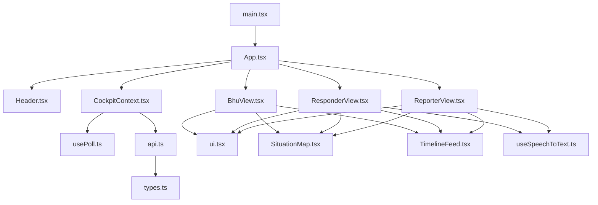

**Diagram sources**
- [main.tsx:10-25](file://frontend/src/main.tsx#L10-L25)
- [App.tsx:13-20](file://frontend/src/App.tsx#L13-L20)
- [CockpitContext.tsx:13-49](file://frontend/src/state/CockpitContext.tsx#L13-L49)
- [api.ts:24-40](file://frontend/src/lib/api.ts#L24-L40)
- [types.ts:15-62](file://frontend/src/lib/types.ts#L15-L62)

**Section sources**
- [main.tsx:1-26](file://frontend/src/main.tsx#L1-L26)
- [App.tsx:1-165](file://frontend/src/App.tsx#L1-L165)
- [package.json:1-33](file://frontend/package.json#L1-L33)
- [vite.config.ts:1-17](file://frontend/vite.config.ts#L1-L17)

## Core Components
- **Enhanced App Shell**: Provides a two-column layout with deep iris background, role banner, and toast notifications with high-contrast styling.
- **CockpitProvider**: Centralized state container holding role, active incident, responders, health status, bot turns, and actions (submit report, respond, mark arrived, help-bot turn, close incident, verify candidate).
- **Speech-to-Text Integration**: useSpeechToText hook provides Web Speech API integration with Urdu language support, fallback languages, and error handling.
- **Enhanced Polling Engine**: usePoll manages interval-based fetching with overlap safety, error handling, and subject-key resets.
- **API Client**: Typed HTTP client normalizing errors, form encoding for reporting, media URL resolution, and endpoint helpers.
- **Modern UI Components**: Pill buttons, cards with 24/32px radii, tags, badges, and status indicators following clinical design patterns.
- **Role Views**:
  - Reporter: scenario presets, custom ingestion with real-time audio recording, triage result display, dispatch reasoning.
  - Responder: accept/decline, mark arrival, interactive Urdu help-bot with audio playback and speech input.
  - BHU: responder verification gate, incident closure with fraud prevention, accountability scorecard.

**Section sources**
- [App.tsx:45-165](file://frontend/src/App.tsx#L45-L165)
- [CockpitContext.tsx:51-149](file://frontend/src/state/CockpitContext.tsx#L51-L149)
- [useSpeechToText.ts:47-229](file://frontend/src/hooks/useSpeechToText.ts#L47-L229)
- [usePoll.ts:1-139](file://frontend/src/hooks/usePoll.ts#L1-L139)
- [api.ts:42-153](file://frontend/src/lib/api.ts#L42-L153)
- [ui.tsx:17-343](file://frontend/src/components/ui.tsx#L17-L343)
- [ReporterView.tsx:49-135](file://frontend/src/views/ReporterView.tsx#L49-L135)
- [ResponderView.tsx:40-145](file://frontend/src/views/ResponderView.tsx#L40-L145)
- [BhuView.tsx:48-88](file://frontend/src/views/BhuView.tsx#L48-L88)

## Architecture Overview
The cockpit uses a provider-driven architecture where all views consume shared state from CockpitContext. Data flows via periodic polling of backend endpoints, while user actions trigger mutations that refresh relevant data. The enhanced system includes speech-to-text integration and animated visual feedback.

```mermaid
sequenceDiagram
participant U as "User"
participant V as "ReporterView"
participant S as "useSpeechToText"
participant P as "CockpitProvider"
participant A as "api.ts"
participant S as "Backend"
participant T as "TimelineFeed"
participant M as "Enhanced SituationMap"
U->>V : Submit report with STT transcript
V->>S : Start speech recognition
S-->>V : Real-time Urdu transcripts
V->>P : submitReport({latitude, longitude, village_id, reporter_id, photo_ref, voice_ref, voice_transcript})
P->>A : POST /emergency/report (form-encoded)
A-->>P : ReportResponse
P->>P : setIncidentId, setLastReport, pushToast
P->>T : refresh timeline poll
P->>M : reflect new incident with animated markers
Note over P,T,M : Incident adopted across views with enhanced visuals
```

**Diagram sources**
- [ReporterView.tsx:98-129](file://frontend/src/views/ReporterView.tsx#L98-L129)
- [useSpeechToText.ts:67-81](file://frontend/src/hooks/useSpeechToText.ts#L67-L81)
- [CockpitContext.tsx:238-258](file://frontend/src/state/CockpitContext.tsx#L238-L258)
- [api.ts:172-186](file://frontend/src/lib/api.ts#L172-L186)

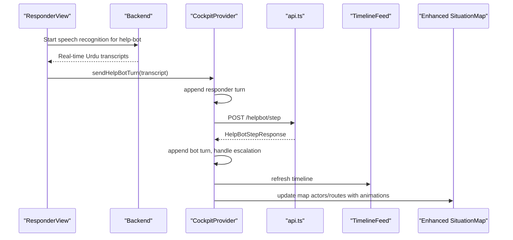

**Diagram sources**
- [ResponderView.tsx:140-145](file://frontend/src/views/ResponderView.tsx#L140-L145)
- [useSpeechToText.ts:477-482](file://frontend/src/hooks/useSpeechToText.ts#L477-L482)
- [CockpitContext.tsx:344-398](file://frontend/src/state/CockpitContext.tsx#L344-L398)
- [api.ts:228-238](file://frontend/src/lib/api.ts#L228-L238)

## Detailed Component Analysis

### Enhanced App Shell and Layout
- **Deep Iris Canvas**: Background with radial gradients creating clinical depth without neutral blacks or grays.
- **Two-column grid**: left 60% active role view; right 40% sticky SituationMap + TimelineFeed.
- **High-Contrast RoleBanner**: Shows step number, bilingual labels, and contextual hint with white text on dark backgrounds.
- **Enhanced ToastStack**: Renders non-blocking notifications capped at four items with improved visibility.

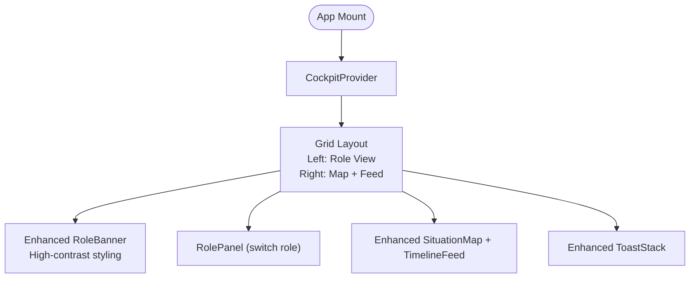

**Diagram sources**
- [App.tsx:45-83](file://frontend/src/App.tsx#L45-L83)
- [App.tsx:85-128](file://frontend/src/App.tsx#L85-L128)
- [App.tsx:130-165](file://frontend/src/App.tsx#L130-L165)

**Section sources**
- [App.tsx:1-165](file://frontend/src/App.tsx#L1-L165)

### CockpitProvider (State and Actions)
- Maintains role, incidentId, lastReport, botTurns, toasts.
- Runs multiple polls: health, responders, timeline, record.
- Exposes actions: submitReport, respond, markArrived, sendHelpBotTurn, closeActiveIncident, verifyCandidate, adoptIncident, resetDemo, refreshAll.
- Normalizes failures into toasts and ensures safe refresh behavior.

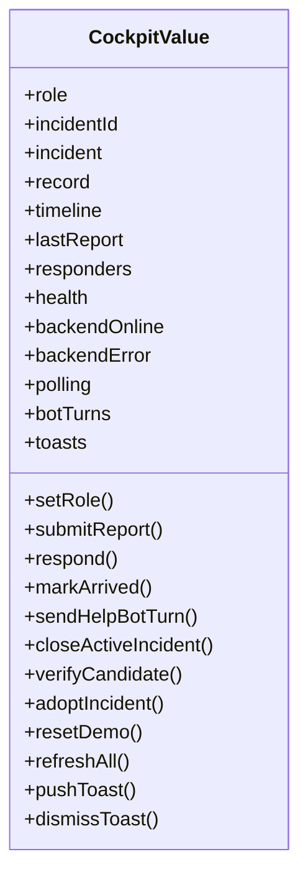

**Diagram sources**
- [CockpitContext.tsx:85-149](file://frontend/src/state/CockpitContext.tsx#L85-L149)

**Section sources**
- [CockpitContext.tsx:158-573](file://frontend/src/state/CockpitContext.tsx#L158-L573)

### Enhanced Reporting Flow (ReporterView)
- **Speech-to-Text Integration**: Real-time Urdu voice input with automatic injury classification based on spoken keywords.
- **Real-time Audio Recording**: MediaRecorder API for capturing actual audio files with timer display.
- **Enhanced Form Handling**: Supports preset scenarios and custom ingestion with photo and voice refs.
- **Improved Validation**: Validates inputs, submits form-encoded payload, and displays triage decision and dispatch reasoning.
- **Visual Feedback**: Animated listening states and improved error handling.

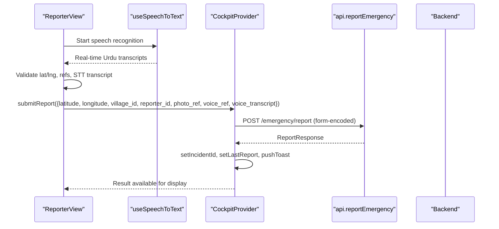

**Diagram sources**
- [ReporterView.tsx:98-129](file://frontend/src/views/ReporterView.tsx#L98-L129)
- [useSpeechToText.ts:67-81](file://frontend/src/hooks/useSpeechToText.ts#L67-L81)
- [api.ts:172-186](file://frontend/src/lib/api.ts#L172-L186)
- [CockpitContext.tsx:238-258](file://frontend/src/state/CockpitContext.tsx#L238-L258)

**Section sources**
- [ReporterView.tsx:49-607](file://frontend/src/views/ReporterView.tsx#L49-L607)

### Enhanced Responder Workflow (ResponderView)
- **Speech-to-Text Input**: Real-time Urdu voice input for help-bot conversations.
- **Accept/Decline dispatch**: Decline triggers fallback walker server-side.
- **Mark Arrived updates lifecycle**.
- **Interactive help-bot**: Quick replies or free text with speech input; auto-plays Urdu TTS when available; tracks branch and escalation signals.
- **Enhanced Visual States**: Improved loading states and error handling.

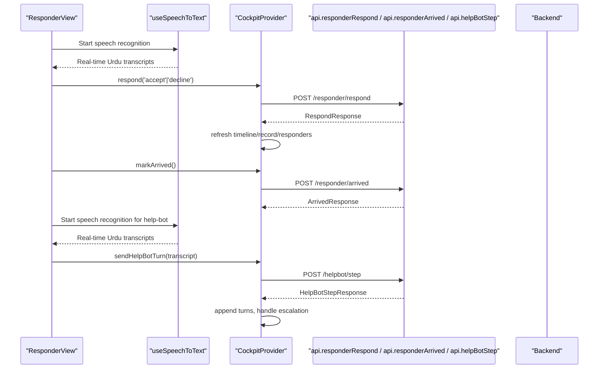

**Diagram sources**
- [ResponderView.tsx:128-145](file://frontend/src/views/ResponderView.tsx#L128-L145)
- [useSpeechToText.ts:477-482](file://frontend/src/hooks/useSpeechToText.ts#L477-L482)
- [CockpitContext.tsx:260-342](file://frontend/src/state/CockpitContext.tsx#L260-L342)
- [CockpitContext.tsx:344-398](file://frontend/src/state/CockpitContext.tsx#L344-L398)
- [api.ts:208-238](file://frontend/src/lib/api.ts#L208-L238)

**Section sources**
- [ResponderView.tsx:40-532](file://frontend/src/views/ResponderView.tsx#L40-L532)

### BHU Verification and Closure (BhuView)
- Candidate verification requires equipment checklist and verifier identity.
- Closure includes outcome selection, confirmer choice, and actor identity; fraud gate prevents self-reported closures from counting toward metrics.
- Accountability scorecard fetches performance records per responder.
- **Enhanced UI**: Improved visual feedback and error handling throughout the workflow.

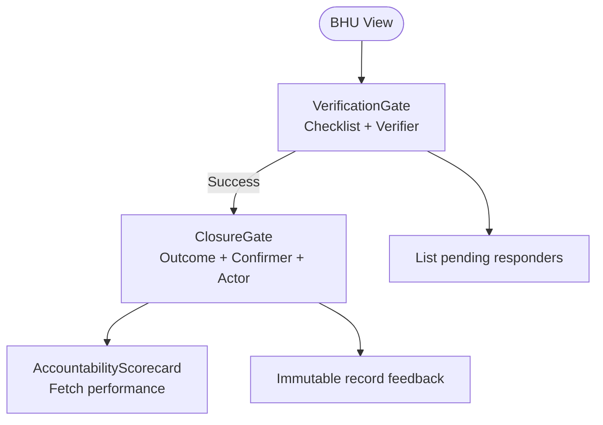

**Diagram sources**
- [BhuView.tsx:94-147](file://frontend/src/views/BhuView.tsx#L94-L147)
- [BhuView.tsx:321-536](file://frontend/src/views/BhuView.tsx#L321-L536)
- [BhuView.tsx:542-732](file://frontend/src/views/BhuView.tsx#L542-L732)

**Section sources**
- [BhuView.tsx:48-830](file://frontend/src/views/BhuView.tsx#L48-L830)

### Enhanced Live Situation Map
- **Smooth Animation System**: 18-second interpolation cycle for responder and ambulance movement along polylines.
- **Ambulance Markers**: Special yellow ambulance markers that depart from BHU toward incident when requested.
- **Animated Route Vectors**: CSS-animated dashed lines showing live routes between actors.
- **Enhanced Marker System**: Custom div icons with proper sizing, z-indexing, and popups.
- **Smart Bounds Management**: Fits bounds only when actor set changes to avoid constant re-zoom.
- **High-Contrast Styling**: Deep iris background with clinical accent colors.

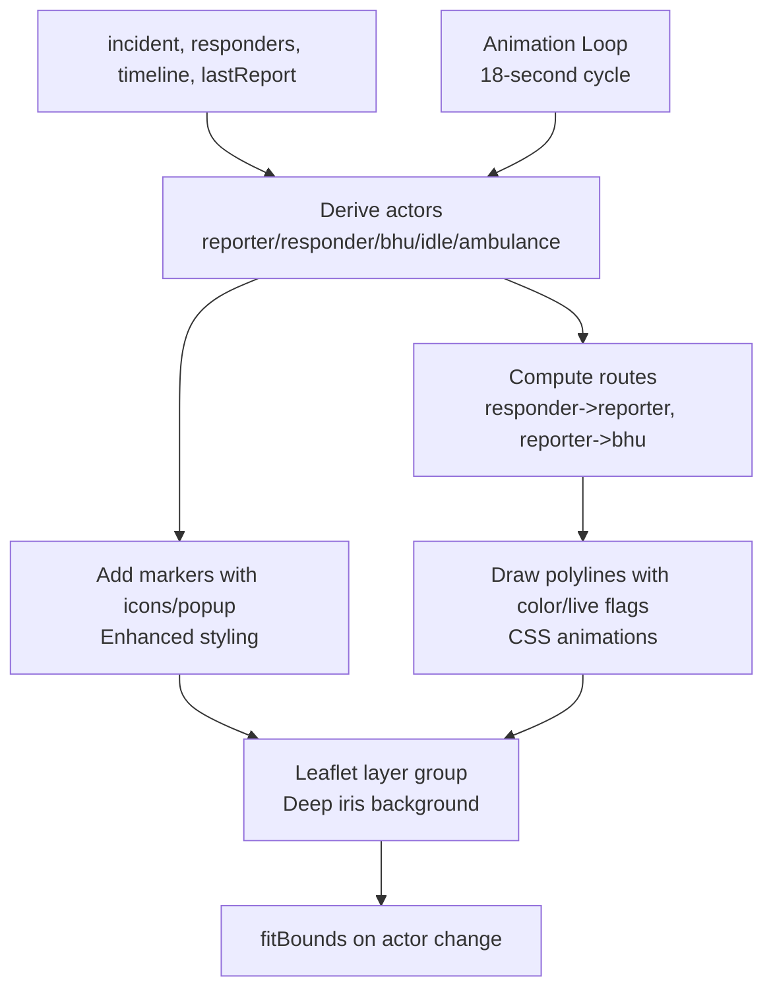

**Diagram sources**
- [SituationMap.tsx:65-177](file://frontend/src/components/SituationMap.tsx#L65-L177)
- [SituationMap.tsx:183-272](file://frontend/src/components/SituationMap.tsx#L183-L272)
- [index.css:246-264](file://frontend/src/index.css#L246-L264)

**Section sources**
- [SituationMap.tsx:1-435](file://frontend/src/components/SituationMap.tsx#L1-L435)

### Enhanced Live Status Timeline
- **High-Contrast Header**: Dark background with white text and improved status indicators.
- **Localized Urdu Updates**: Sorted by timestamp and stage order with enhanced visual hierarchy.
- **Enhanced Badges**: Coverage gap, mid-incident escalation, and ambulance request badges with improved styling.
- **Status Indicators**: Shows polling status and backend connectivity with better visual feedback.
- **Improved Accessibility**: Better contrast ratios and screen reader support.

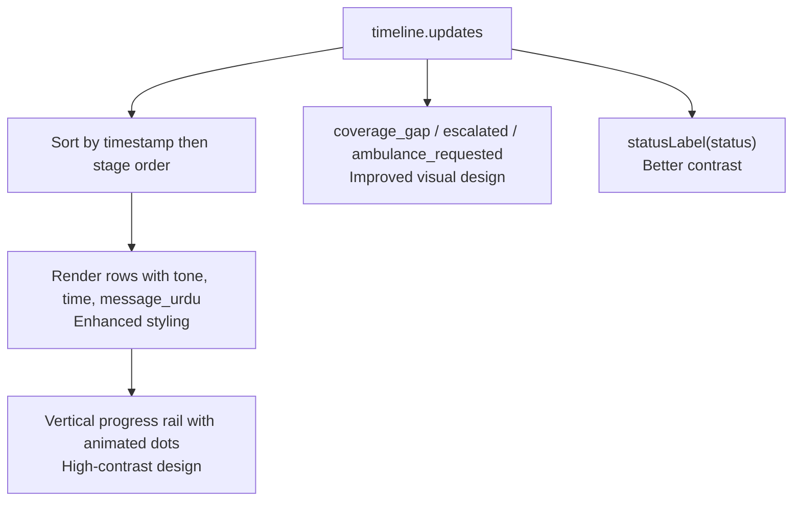

**Diagram sources**
- [TimelineFeed.tsx:16-31](file://frontend/src/components/TimelineFeed.tsx#L16-L31)
- [TimelineFeed.tsx:117-144](file://frontend/src/components/TimelineFeed.tsx#L117-L144)

**Section sources**
- [TimelineFeed.tsx:1-217](file://frontend/src/components/TimelineFeed.tsx#L1-L217)

### Enhanced API Client and Types
- Normalizes transport and HTTP errors into ApiRequestError with code/message.
- Form-encodes report submissions; JSON for other endpoints.
- Resolves relative media URLs for help-bot audio.
- Strongly typed payloads mirroring backend contracts.

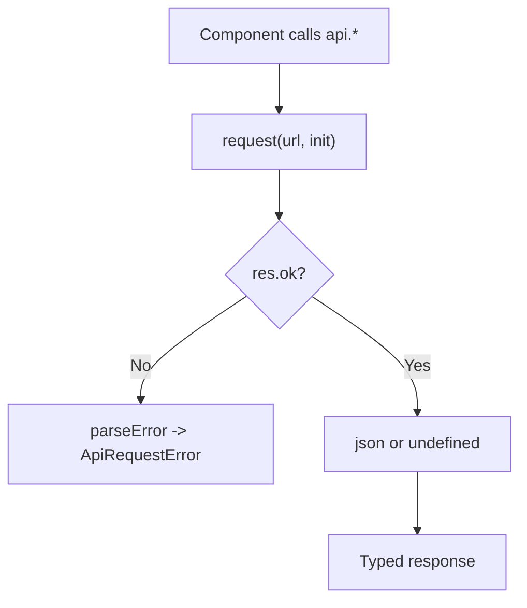

**Diagram sources**
- [api.ts:72-130](file://frontend/src/lib/api.ts#L72-L130)
- [api.ts:144-153](file://frontend/src/lib/api.ts#L144-L153)
- [types.ts:149-261](file://frontend/src/lib/types.ts#L149-L261)

**Section sources**
- [api.ts:1-318](file://frontend/src/lib/api.ts#L1-L318)
- [types.ts:1-268](file://frontend/src/lib/types.ts#L1-L268)

### Enhanced Speech-to-Text Hook
- **Web Speech API Integration**: Comprehensive implementation with browser compatibility checks.
- **Urdu Language Support**: Primary language 'ur-PK' with fallback to 'ur'.
- **Real-time Transcription**: Continuous listening with interim results and final transcripts.
- **Error Handling**: Graceful degradation for unsupported browsers and permission issues.
- **Auto-restart**: Automatic restart on silence timeouts and connection issues.

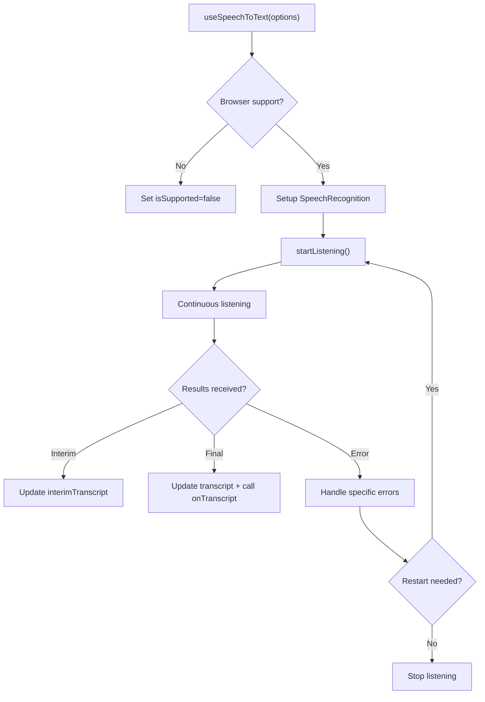

**Diagram sources**
- [useSpeechToText.ts:47-229](file://frontend/src/hooks/useSpeechToText.ts#L47-L229)

**Section sources**
- [useSpeechToText.ts:1-230](file://frontend/src/hooks/useSpeechToText.ts#L1-L230)

### Enhanced Polling Hook
- Overlap-safe interval polling with skip-if-enabled=false guard.
- Resets state when subject key changes; keeps previous data on error by default.
- Tracks loading, error, and last updated timestamps.

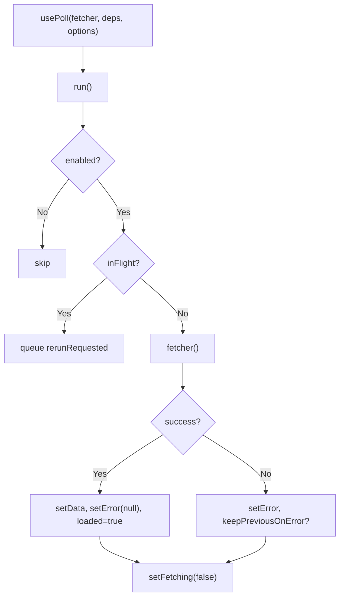

**Diagram sources**
- [usePoll.ts:32-139](file://frontend/src/hooks/usePoll.ts#L32-L139)

**Section sources**
- [usePoll.ts:1-139](file://frontend/src/hooks/usePoll.ts#L1-L139)

## Dependency Analysis
- App depends on CockpitProvider for state and actions.
- Views depend on api.ts for backend communication and types.ts for shape definitions.
- SituationMap and TimelineFeed depend on shared state and utility modules (geography, urdu).
- usePoll is reused by multiple providers and views for live data.
- **New**: useSpeechToText is integrated across ReporterView and ResponderView for voice input.
- **Enhanced**: UI components provide consistent styling with pill geometry and high-contrast design.

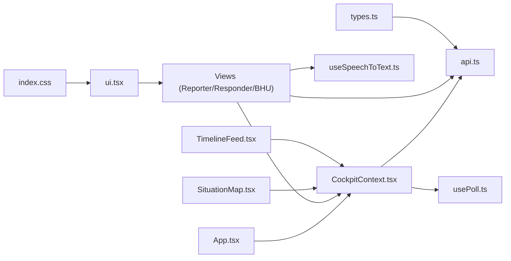

**Diagram sources**
- [App.tsx:13-20](file://frontend/src/App.tsx#L13-L20)
- [CockpitContext.tsx:13-49](file://frontend/src/state/CockpitContext.tsx#L13-L49)
- [api.ts:24-40](file://frontend/src/lib/api.ts#L24-L40)
- [types.ts:15-62](file://frontend/src/lib/types.ts#L15-L62)

**Section sources**
- [App.tsx:1-165](file://frontend/src/App.tsx#L1-L165)
- [CockpitContext.tsx:1-596](file://frontend/src/state/CockpitContext.tsx#L1-L596)
- [api.ts:1-318](file://frontend/src/lib/api.ts#L1-L318)
- [types.ts:1-268](file://frontend/src/lib/types.ts#L1-L268)

## Performance Considerations
- Polling intervals are tuned: timeline every ~2.5s, record every ~5s, health and responders every ~10s.
- usePoll prevents overlapping requests and avoids stacking behind slow backends.
- Map fitBounds runs only on actor set changes to prevent frequent re-zoom.
- **Enhanced Animation System**: Efficient 18-second animation cycles using requestAnimationFrame for smooth marker movement.
- **Speech Recognition Optimization**: Debounced transcription updates and efficient DOM manipulation.
- Media URLs resolved once; audio autoplay attempts gracefully degrade if blocked.
- StrictMode enabled to catch duplicate Leaflet instances and race conditions early.
- **Design System Efficiency**: Reusable Tailwind classes minimize CSS bloat and improve rendering performance.

## Troubleshooting Guide
- Backend unreachable: Header shows offline indicator; toasts surface normalized errors with codes/messages.
- Missing incident: Views show empty states with guidance to return to Reporter view.
- Verification failures: Empty equipment checklist or missing verifier yields explicit error notes.
- Closure immutability: Repeated close attempts indicate already closed; fraud gate may refuse metric counting.
- Polling stalls: If feed stalls, check backend connectivity and ensure incidentId is set.
- **Speech Recognition Issues**: Browser compatibility checks, microphone permissions, and language support fallbacks.
- **Animation Performance**: Monitor frame rates and adjust animation complexity if needed.
- **Memory Management**: Proper cleanup of speech recognition instances and animation frames.

**Section sources**
- [Header.tsx:214-265](file://frontend/src/components/Header.tsx#L214-L265)
- [CockpitContext.tsx:178-193](file://frontend/src/state/CockpitContext.tsx#L178-L193)
- [BhuView.tsx:126-147](file://frontend/src/views/BhuView.tsx#L126-L147)
- [BhuView.tsx:345-358](file://frontend/src/views/BhuView.tsx#L345-L358)
- [TimelineFeed.tsx:57-64](file://frontend/src/components/TimelineFeed.tsx#L57-L64)
- [useSpeechToText.ts:102-129](file://frontend/src/hooks/useSpeechToText.ts#L102-L129)

## Conclusion
The cockpit application delivers a cohesive, role-aware interface for end-to-end emergency response workflows with comprehensive modernization. Its provider-driven state model, robust polling, enhanced speech-to-text integration, and clear separation of concerns enable responsive UX and maintainable code. The enhanced visual design system with high-contrast styling, smooth animations, and improved accessibility emphasizes transparency (inspectable tiers and decisions), accessibility (Urdu-first messaging with voice input), and resilience (error normalization and graceful degradation). The new animation system and speech recognition capabilities significantly improve the user experience for field responders and reporters in emergency situations.