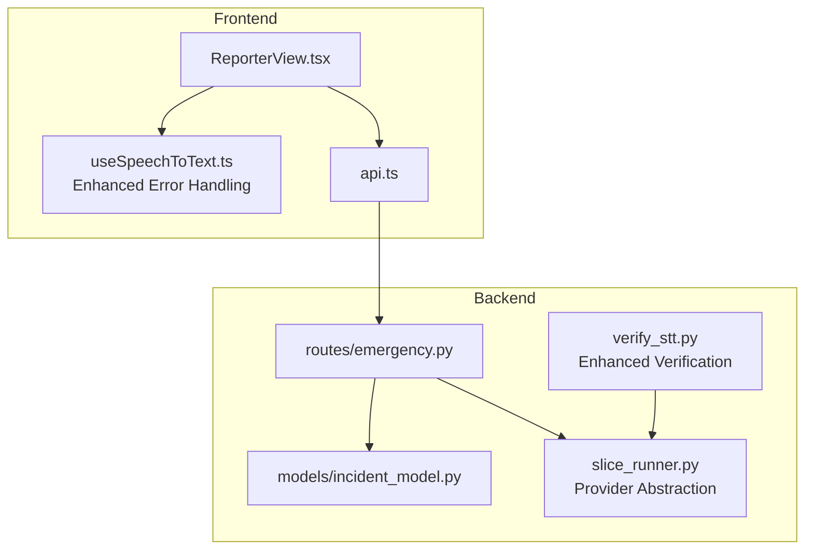
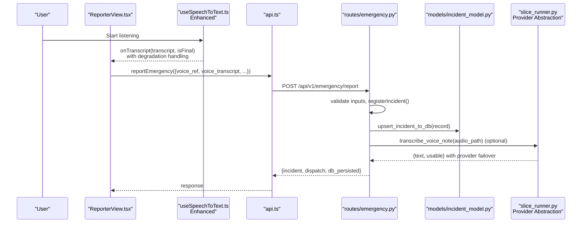
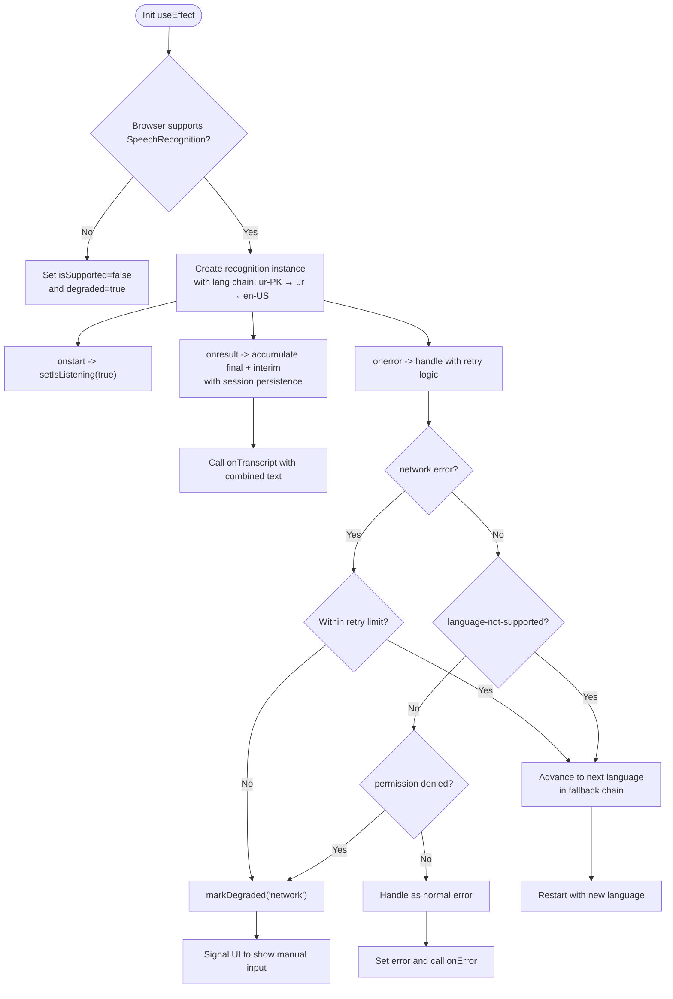
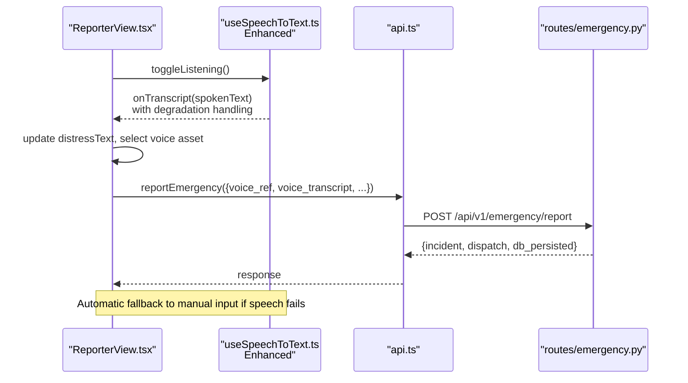
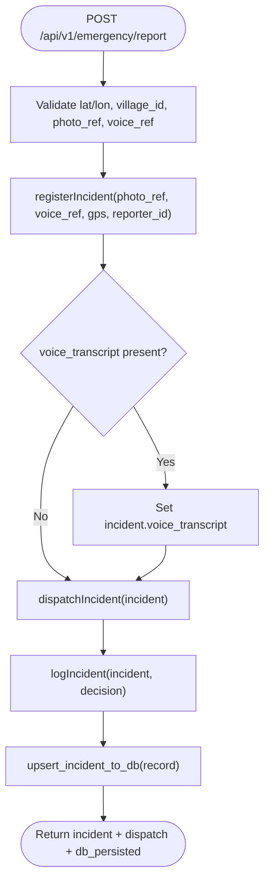
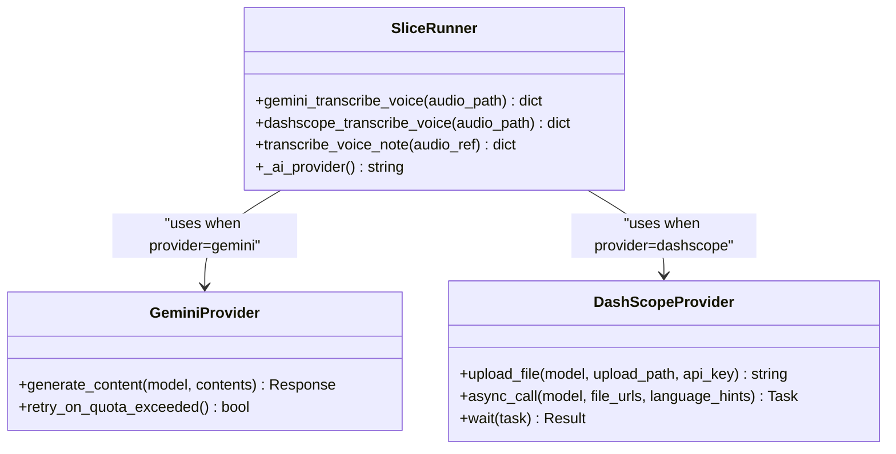
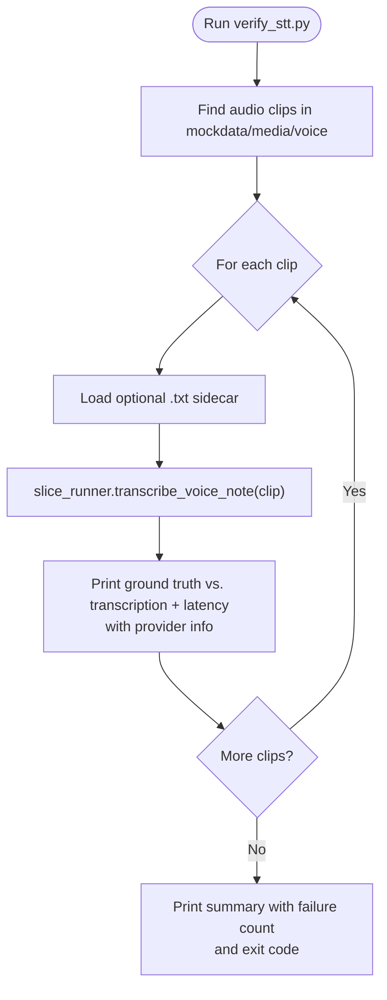
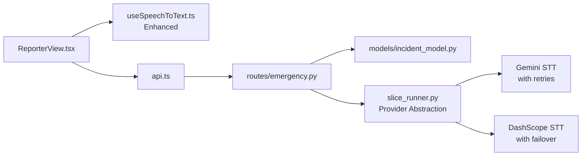

# Speech-to-Text Hook

<cite>
**Referenced Files in This Document**
- [useSpeechToText.ts](file://frontend/src/hooks/useSpeechToText.ts)
- [ReporterView.tsx](file://frontend/src/views/ReporterView.tsx)
- [api.ts](file://frontend/src/lib/api.ts)
- [emergency.py](file://backend/routes/emergency.py)
- [incident_model.py](file://backend/models/incident_model.py)
- [slice_runner.py](file://backend/slice_runner.py)
- [verify_stt.py](file://backend/verify_stt.py)
</cite>

## Update Summary
**Changes Made**
- Enhanced error handling with comprehensive network retry mechanisms and language fallback chains
- Improved voice transcript support with better interim result handling and session persistence
- Added robust degradation detection for when speech recognition becomes unreliable
- Enhanced backend STT pipeline with provider abstraction and improved error recovery
- Updated verification scripts with better error reporting and latency measurement

## Table of Contents
1. Introduction
2. Project Structure
3. Core Components
4. Architecture Overview
5. Detailed Component Analysis
6. Dependency Analysis
7. Performance Considerations
8. Troubleshooting Guide
9. Conclusion

## Introduction
This document explains the enhanced Speech-to-Text (STT) hook used by the emergency reporting flow. The system now features sophisticated error handling, automatic language fallback chains, network retry mechanisms, and improved voice transcript support. It covers how the frontend captures and transcribes Urdu speech using the Web Speech API with robust fallback strategies, how transcripts are sent to the backend, and how the backend integrates STT into triage and dispatch workflows with provider abstraction.

## Project Structure
The enhanced STT feature spans both client and server with improved resilience:
- Frontend: A React hook with comprehensive error handling, language fallback chains, and degradation detection
- Backend: Routes accept incident reports with optional live voice transcripts; the pipeline provides provider-backed transcription with automatic failover

**Diagram sources**
- [useSpeechToText.ts:60-355](file://frontend/src/hooks/useSpeechToText.ts#L60-L355)
- [ReporterView.tsx:96-116](file://frontend/src/views/ReporterView.tsx#L96-L116)
- [api.ts:195-212](file://frontend/src/lib/api.ts#L195-L212)
- [emergency.py:187-259](file://backend/routes/emergency.py#L187-L259)
- [incident_model.py:212-247](file://backend/models/incident_model.py#L212-L247)
- [slice_runner.py:456-516](file://backend/slice_runner.py#L456-L516)
- [verify_stt.py:22-52](file://backend/verify_stt.py#L22-L52)

**Section sources**
- [useSpeechToText.ts:60-355](file://frontend/src/hooks/useSpeechToText.ts#L60-L355)
- [ReporterView.tsx:96-116](file://frontend/src/views/ReporterView.tsx#L96-L116)
- [api.ts:195-212](file://frontend/src/lib/api.ts#L195-L212)
- [emergency.py:187-259](file://backend/routes/emergency.py#L187-L259)
- [incident_model.py:212-247](file://backend/models/incident_model.py#L212-L247)
- [slice_runner.py:456-516](file://backend/slice_runner.py#L456-L516)
- [verify_stt.py:22-52](file://backend/verify_stt.py#L22-L52)

## Core Components
- **Enhanced useSpeechToText hook**: Wraps browser SpeechRecognition with comprehensive error handling, automatic language fallback chains (ur-PK → ur → en-US), network retry mechanisms, and degradation detection
- **Improved ReporterView integration**: Uses the enhanced hook with real-time Urdu transcription, automatic scenario matching, and graceful degradation to manual input
- **Robust backend routes**: Accept form-encoded incident data with optional voice_transcript field, with improved error handling and validation
- **Provider-abstraction STT pipeline**: Supports both Gemini and DashScope providers with automatic failover and retry mechanisms
- **Enhanced verification script**: Runs STT against sample audio clips with detailed error reporting, latency measurement, and ground truth comparison

**Section sources**
- [useSpeechToText.ts:60-355](file://frontend/src/hooks/useSpeechToText.ts#L60-L355)
- [ReporterView.tsx:96-116](file://frontend/src/views/ReporterView.tsx#L96-L116)
- [emergency.py:187-259](file://backend/routes/emergency.py#L187-L259)
- [slice_runner.py:456-516](file://backend/slice_runner.py#L456-L516)
- [verify_stt.py:22-52](file://backend/verify_stt.py#L22-L52)

## Architecture Overview
End-to-end flow from microphone to persisted incident record with enhanced error handling:

**Diagram sources**
- [useSpeechToText.ts:126-321](file://frontend/src/hooks/useSpeechToText.ts#L126-L321)
- [ReporterView.tsx:96-116](file://frontend/src/views/ReporterView.tsx#L96-L116)
- [api.ts:195-212](file://frontend/src/lib/api.ts#L195-L212)
- [emergency.py:187-259](file://backend/routes/emergency.py#L187-L259)
- [incident_model.py:212-247](file://backend/models/incident_model.py#L212-L247)
- [slice_runner.py:503-516](file://backend/slice_runner.py#L503-L516)

## Detailed Component Analysis

### Enhanced Frontend Hook: useSpeechToText
**Updated** The hook now includes comprehensive error handling, automatic language fallback chains, and degradation detection for unreliable speech recognition scenarios.

- **Purpose**: Provide a resilient React hook that handles browser-based speech recognition with automatic fallbacks and degradation signals
- **Key Enhancements**:
  - **Language Fallback Chain**: Automatically tries `ur-PK` → `ur` → `en-US` when primary language fails
  - **Network Retry Mechanism**: Retries failed network requests with configurable retry limits before degrading
  - **Degradation Detection**: Signals when speech recognition becomes unreliable, allowing UI to show manual input alternatives
  - **Session Persistence**: Maintains accumulated transcripts across recognizer restarts to prevent data loss
  - **Comprehensive Error Handling**: Distinguishes between permission errors, network issues, and unsupported languages
- **Enhanced API**:
  - State: `isListening`, `transcript`, `interimTranscript`, `error`, `isSupported`, `degraded`, `activeLang`
  - Actions: `startListening`, `stopListening`, `toggleListening`, `resetTranscript`, `setTranscript`

**Diagram sources**
- [useSpeechToText.ts:126-321](file://frontend/src/hooks/useSpeechToText.ts#L126-L321)
- [useSpeechToText.ts:227-266](file://frontend/src/hooks/useSpeechToText.ts#L227-L266)

**Section sources**
- [useSpeechToText.ts:60-355](file://frontend/src/hooks/useSpeechToText.ts#L60-L355)

### Enhanced Frontend Integration: ReporterView
**Updated** Now uses the enhanced hook with comprehensive error handling and automatic degradation to manual input when speech recognition becomes unreliable.

- **Enhanced Usage**: Uses the hook with Urdu locale and multi-language fallback, updating distress text and selecting voice assets based on keywords
- **Improved Error Handling**: Shows contextual error messages and gracefully falls back to manual input when speech recognition fails
- **Better User Experience**: Displays active language and listening status while providing clear feedback during failures

**Diagram sources**
- [ReporterView.tsx:96-116](file://frontend/src/views/ReporterView.tsx#L96-L116)
- [ReporterView.tsx:205-239](file://frontend/src/views/ReporterView.tsx#L205-L239)
- [api.ts:195-212](file://frontend/src/lib/api.ts#L195-L212)
- [emergency.py:187-259](file://backend/routes/emergency.py#L187-L259)

**Section sources**
- [ReporterView.tsx:96-116](file://frontend/src/views/ReporterView.tsx#L96-L116)
- [ReporterView.tsx:205-239](file://frontend/src/views/ReporterView.tsx#L205-L239)
- [api.ts:195-212](file://frontend/src/lib/api.ts#L195-L212)

### Enhanced Backend Route: Emergency Report
**Updated** Improved validation and error handling for voice transcript processing with better failure modes.

- **Enhanced Validation**: Accepts form-encoded fields including latitude, longitude, village_id, reporter_id, photo_ref, voice_ref, and optional voice_transcript
- **Improved Error Handling**: Better validation of required fields with specific error codes for different failure scenarios
- **Robust Processing**: Handles missing or invalid voice transcripts gracefully while continuing the triage process

**Diagram sources**
- [emergency.py:187-259](file://backend/routes/emergency.py#L187-L259)
- [incident_model.py:212-247](file://backend/models/incident_model.py#L212-L247)

**Section sources**
- [emergency.py:187-259](file://backend/routes/emergency.py#L187-L259)
- [incident_model.py:60-100](file://backend/models/incident_model.py#L60-L100)
- [incident_model.py:212-247](file://backend/models/incident_model.py#L212-L247)

### Enhanced Server-Side STT Pipeline: slice_runner
**Updated** Provider abstraction with automatic failover between Gemini and DashScope implementations, improved error handling, and retry mechanisms.

- **Provider Abstraction**: Chooses between Gemini and DashScope implementations at runtime via environment configuration
- **Enhanced Implementations**:
  - **Gemini Provider**: Sends audio bytes to configured model with retry logic for quota/rate-limit errors
  - **DashScope Provider**: Uploads audio, submits async transcription task, waits for completion, and joins transcripts
- **Improved Error Handling**: Comprehensive error catching with fallback to safe defaults when transcription fails
- **Entry Point**: `transcribe_voice_note` validates file existence and delegates to selected provider with error recovery

**Diagram sources**
- [slice_runner.py:456-516](file://backend/slice_runner.py#L456-L516)

**Section sources**
- [slice_runner.py:456-516](file://backend/slice_runner.py#L456-L516)

### Enhanced Verification Script: verify_stt
**Updated** Improved error reporting, latency measurement, and comprehensive output formatting for STT quality assessment.

- **Enhanced Functionality**: Scans mockdata media for audio files, invokes the active provider's transcription, prints ground truth vs. output with detailed metrics
- **Improved Reporting**: Better error categorization, latency measurement, and exit codes for automated testing
- **Provider Awareness**: Automatically detects and reports which STT provider is being used

**Diagram sources**
- [verify_stt.py:22-52](file://backend/verify_stt.py#L22-L52)
- [slice_runner.py:503-516](file://backend/slice_runner.py#L503-L516)

**Section sources**
- [verify_stt.py:22-52](file://backend/verify_stt.py#L22-L52)

## Dependency Analysis
**Updated** Enhanced dependencies with improved error handling and provider abstraction.

- **Frontend Dependencies**:
  - ReporterView depends on enhanced useSpeechToText for resilient real-time Urdu transcription with automatic fallbacks
  - API layer handles form encoding and proper error propagation
- **Backend Dependencies**:
  - Routes depend on models for persistence and enhanced slice_runner for AI-powered transcription with provider abstraction
  - Provider selection allows seamless switching between Gemini and DashScope services
- **Enhanced Resilience**: Both frontend and backend include comprehensive error handling and fallback mechanisms

**Diagram sources**
- [ReporterView.tsx:96-116](file://frontend/src/views/ReporterView.tsx#L96-L116)
- [useSpeechToText.ts:60-355](file://frontend/src/hooks/useSpeechToText.ts#L60-L355)
- [api.ts:195-212](file://frontend/src/lib/api.ts#L195-L212)
- [emergency.py:187-259](file://backend/routes/emergency.py#L187-L259)
- [incident_model.py:212-247](file://backend/models/incident_model.py#L212-L247)
- [slice_runner.py:456-516](file://backend/slice_runner.py#L456-L516)

**Section sources**
- [ReporterView.tsx:96-116](file://frontend/src/views/ReporterView.tsx#L96-L116)
- [useSpeechToText.ts:60-355](file://frontend/src/hooks/useSpeechToText.ts#L60-L355)
- [api.ts:195-212](file://frontend/src/lib/api.ts#L195-L212)
- [emergency.py:187-259](file://backend/routes/emergency.py#L187-L259)
- [incident_model.py:212-247](file://backend/models/incident_model.py#L212-L247)
- [slice_runner.py:456-516](file://backend/slice_runner.py#L456-L516)

## Performance Considerations
**Updated** Enhanced performance considerations for the improved STT system.

- **Frontend Enhancements**:
  - Language fallback chains reduce repeated failures by trying multiple language codes automatically
  - Network retry mechanisms handle temporary connectivity issues without user intervention
  - Session persistence prevents data loss during recognizer restarts
  - Degradation detection allows UI to adapt gracefully when speech recognition becomes unreliable
- **Backend Improvements**:
  - Provider abstraction enables optimal service selection based on availability and performance
  - Retry mechanisms with exponential backoff handle quota and rate-limit errors efficiently
  - Audio uploads and async tasks include timeout handling and error recovery
  - Database writes remain idempotent with improved error handling
- **Verification Enhancements**:
  - Latency measurement helps identify performance bottlenecks
  - Provider-specific performance tracking aids in optimization decisions

## Troubleshooting Guide
**Updated** Enhanced troubleshooting guide covering new error handling and fallback mechanisms.

Common issues and resolutions:
- **Microphone Permission Denied**:
  - Symptom: Error indicates not-allowed or service-not-allowed; UI shows permission message
  - Resolution: Allow microphone access in browser settings and reload
- **Unsupported Language**:
  - Symptom: language-not-supported error triggers automatic fallback to alternate language codes
  - Resolution: System automatically tries ur-PK → ur → en-US; ensure fallbackLang is supported
- **Network Connectivity Issues**:
  - Symptom: network errors trigger automatic retry mechanism with language fallback
  - Resolution: System retries with different language codes; check internet connectivity
- **Empty or Failed Transcription**:
  - Symptom: Backend reports empty or failed transcription; verify audio file exists and provider credentials
  - Resolution: Re-run verify_stt.py to check provider behavior, latency, and error details
- **Database Persistence Failures**:
  - Symptom: DB upsert fails; route still returns success with db_persisted flag set to false
  - Resolution: Inspect database connectivity and schema; retry or fix constraints
- **Service Degradation**:
  - Symptom: Speech recognition becomes unreliable; UI shows manual input alternative
  - Resolution: System automatically degrades to manual input; check network and browser permissions

**Section sources**
- [useSpeechToText.ts:227-266](file://frontend/src/hooks/useSpeechToText.ts#L227-L266)
- [verify_stt.py:22-52](file://backend/verify_stt.py#L22-L52)
- [emergency.py:238-245](file://backend/routes/emergency.py#L238-L245)

## Conclusion
The enhanced Speech-to-Text hook provides a robust, resilient Urdu voice input system for emergency reporting. The frontend hook abstracts browser capabilities with comprehensive error handling, automatic language fallback chains, and degradation detection. The backend routes and pipeline provide provider-abstraction transcription with automatic failover between Gemini and DashScope services. Enhanced verification tools help maintain quality and performance while providing detailed metrics for monitoring and optimization.

The system now gracefully handles network issues, permission problems, and service unavailability while maintaining functionality through automatic fallbacks and degradation paths. This ensures reliable operation in challenging environments where emergency reporting is most critical.