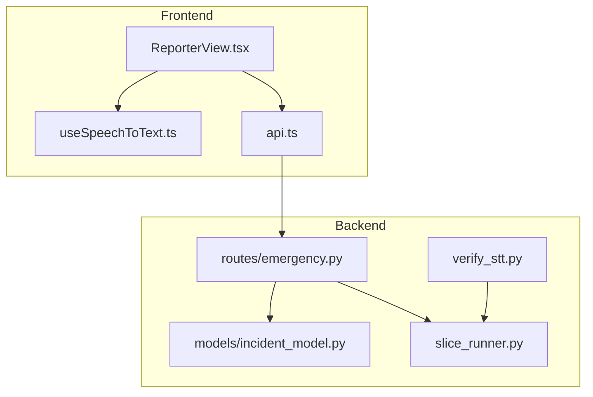
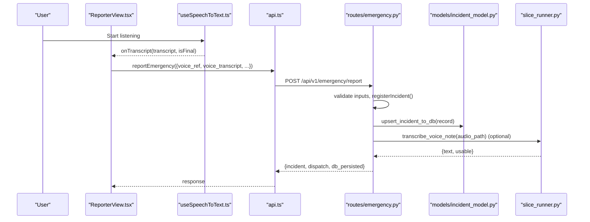
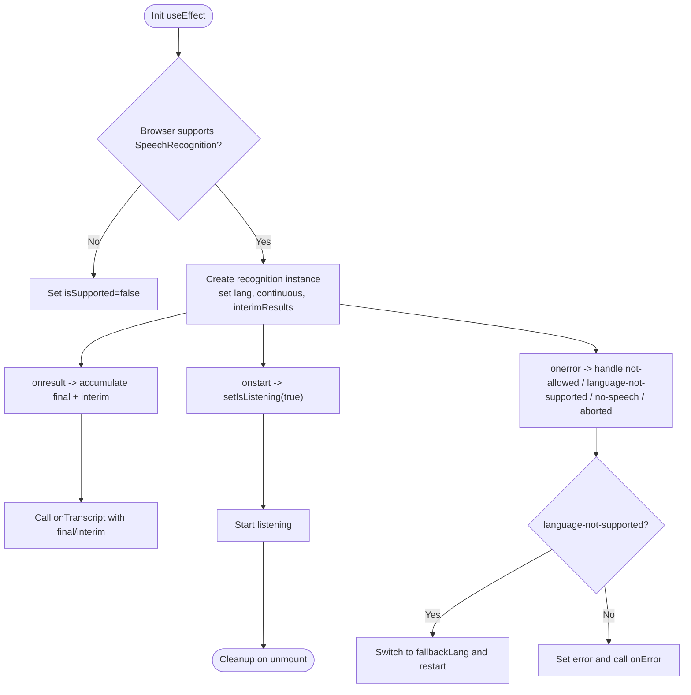
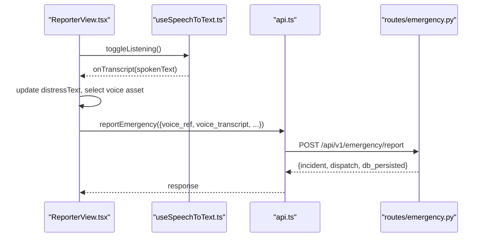
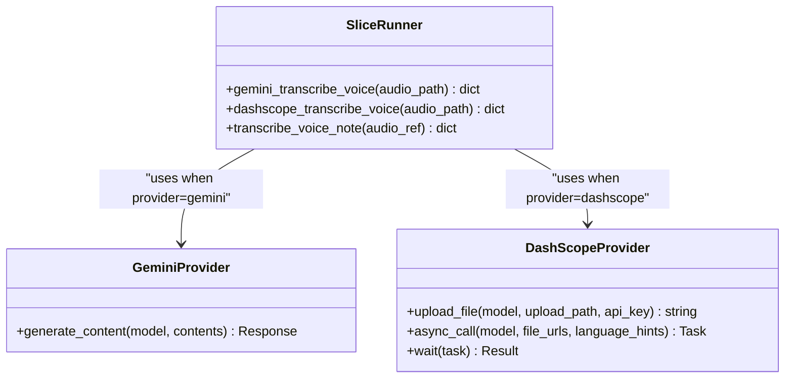
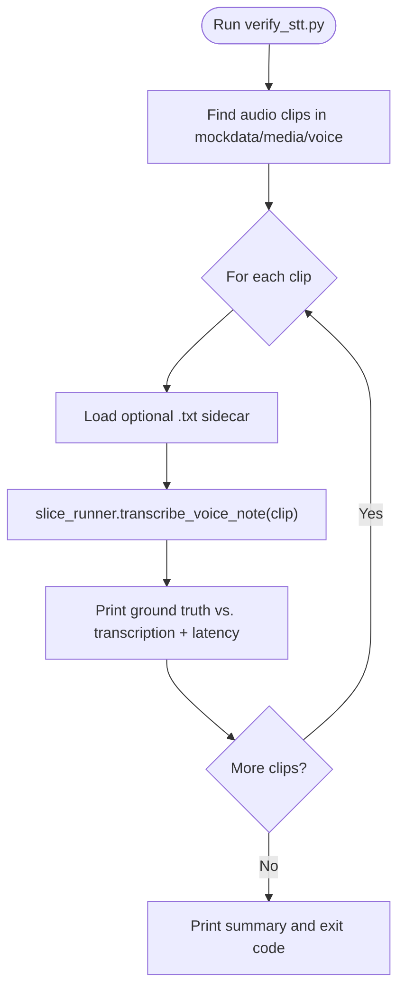
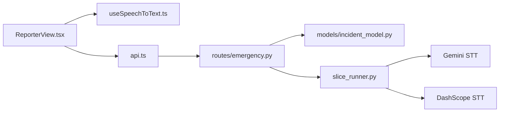

# Speech-to-Text Hook

<cite>
**Referenced Files in This Document**
- [useSpeechToText.ts](file://frontend/src/hooks/useSpeechToText.ts)
- [ReporterView.tsx](file://frontend/src/views/ReporterView.tsx)
- [api.ts](file://frontend/src/lib/api.ts)
- [emergency.py](file://backend/routes/emergency.py)
- [incident_model.py](file://backend/models/incident_model.py)
- [slice_runner.py](file://backend/slice_runner.py)
- [verify_stt.py](file://backend/verify_stt.py)
</cite>

## Table of Contents
1. Introduction
2. Project Structure
3. Core Components
4. Architecture Overview
5. Detailed Component Analysis
6. Dependency Analysis
7. Performance Considerations
8. Troubleshooting Guide
9. Conclusion

## Introduction
This document explains the Speech-to-Text (STT) hook used by the emergency reporting flow. It covers how the frontend captures and transcribes Urdu speech using the Web Speech API, how transcripts are sent to the backend, and how the backend integrates STT into triage and dispatch workflows. It also documents verification scripts and provider selection for server-side transcription.

## Project Structure
The STT feature spans both client and server:
- Frontend: A React hook encapsulates browser speech recognition and exposes a simple API to start/stop listening and receive transcripts.
- Backend: Routes accept incident reports including optional live voice transcripts; the pipeline can also transcribe uploaded audio via provider-specific implementations.

**Diagram sources**
- [useSpeechToText.ts:47-229](file://frontend/src/hooks/useSpeechToText.ts#L47-L229)
- [ReporterView.tsx:64-81](file://frontend/src/views/ReporterView.tsx#L64-L81)
- [api.ts:159-190](file://frontend/src/lib/api.ts#L159-L190)
- [emergency.py:187-259](file://backend/routes/emergency.py#L187-L259)
- [incident_model.py:60-100](file://backend/models/incident_model.py#L60-L100)
- [slice_runner.py:456-516](file://backend/slice_runner.py#L456-L516)
- [verify_stt.py:22-52](file://backend/verify_stt.py#L22-L52)

**Section sources**
- [useSpeechToText.ts:47-229](file://frontend/src/hooks/useSpeechToText.ts#L47-L229)
- [ReporterView.tsx:64-81](file://frontend/src/views/ReporterView.tsx#L64-L81)
- [api.ts:159-190](file://frontend/src/lib/api.ts#L159-L190)
- [emergency.py:187-259](file://backend/routes/emergency.py#L187-L259)
- [incident_model.py:60-100](file://backend/models/incident_model.py#L60-L100)
- [slice_runner.py:456-516](file://backend/slice_runner.py#L456-L516)
- [verify_stt.py:22-52](file://backend/verify_stt.py#L22-L52)

## Core Components
- useSpeechToText hook: Wraps browser SpeechRecognition, manages continuous listening, interim results, language fallback, error handling, and lifecycle cleanup.
- ReporterView integration: Uses the hook to capture Urdu speech, updates UI state, and sends the transcript with the report submission.
- Backend routes: Accept form-encoded incident data including an optional voice_transcript field and persist it alongside triage/dispatch outcomes.
- Server-side STT pipeline: Provides provider-backed transcription for uploaded audio (Gemini or DashScope), selectable at runtime.
- Verification script: Runs STT against sample audio clips and compares output to ground truth sidecars.

**Section sources**
- [useSpeechToText.ts:47-229](file://frontend/src/hooks/useSpeechToText.ts#L47-L229)
- [ReporterView.tsx:64-81](file://frontend/src/views/ReporterView.tsx#L64-L81)
- [emergency.py:187-259](file://backend/routes/emergency.py#L187-L259)
- [slice_runner.py:456-516](file://backend/slice_runner.py#L456-L516)
- [verify_stt.py:22-52](file://backend/verify_stt.py#L22-L52)

## Architecture Overview
End-to-end flow from microphone to persisted incident record:

**Diagram sources**
- [useSpeechToText.ts:68-171](file://frontend/src/hooks/useSpeechToText.ts#L68-L171)
- [ReporterView.tsx:64-81](file://frontend/src/views/ReporterView.tsx#L64-L81)
- [api.ts:159-190](file://frontend/src/lib/api.ts#L159-L190)
- [emergency.py:187-259](file://backend/routes/emergency.py#L187-L259)
- [incident_model.py:212-247](file://backend/models/incident_model.py#L212-L247)
- [slice_runner.py:503-516](file://backend/slice_runner.py#L503-L516)

## Detailed Component Analysis

### Frontend Hook: useSpeechToText
- Purpose: Provide a React hook that starts/stops browser-based speech recognition, emits interim and final transcripts, handles errors, and supports language fallback.
- Key behaviors:
  - Detects browser support and sets isSupported accordingly.
  - Configures continuous mode and interim results.
  - Auto-restarts if the engine stops prematurely while still intended to listen.
  - Falls back to a secondary language code when the primary is unsupported.
  - Normalizes accumulated final transcripts and emits interim text separately.
  - Cleans up on unmount by aborting recognition.
- Returned API:
  - State: isListening, transcript, interimTranscript, error, isSupported.
  - Actions: startListening, stopListening, toggleListening, resetTranscript, setTranscript.

**Diagram sources**
- [useSpeechToText.ts:68-171](file://frontend/src/hooks/useSpeechToText.ts#L68-L171)
- [useSpeechToText.ts:173-229](file://frontend/src/hooks/useSpeechToText.ts#L173-L229)

**Section sources**
- [useSpeechToText.ts:47-229](file://frontend/src/hooks/useSpeechToText.ts#L47-L229)

### Frontend Integration: ReporterView
- Uses the hook with Urdu locale and fallback, updating distress text and selecting voice assets based on keywords.
- Submits the report with voice_ref and optional voice_transcript via the API layer.

**Diagram sources**
- [ReporterView.tsx:64-81](file://frontend/src/views/ReporterView.tsx#L64-L81)
- [ReporterView.tsx:139-171](file://frontend/src/views/ReporterView.tsx#L139-L171)
- [api.ts:159-190](file://frontend/src/lib/api.ts#L159-L190)
- [emergency.py:187-259](file://backend/routes/emergency.py#L187-L259)

**Section sources**
- [ReporterView.tsx:64-81](file://frontend/src/views/ReporterView.tsx#L64-L81)
- [ReporterView.tsx:139-171](file://frontend/src/views/ReporterView.tsx#L139-L171)
- [api.ts:159-190](file://frontend/src/lib/api.ts#L159-L190)

### Backend Route: Emergency Report
- Accepts form-encoded fields including latitude, longitude, village_id, reporter_id, photo_ref, voice_ref, and optional voice_transcript.
- Validates inputs, registers the incident, attaches live transcript if provided, runs dispatch, logs the incident, and persists to PostgreSQL.

**Diagram sources**
- [emergency.py:187-259](file://backend/routes/emergency.py#L187-L259)
- [incident_model.py:212-247](file://backend/models/incident_model.py#L212-L247)

**Section sources**
- [emergency.py:187-259](file://backend/routes/emergency.py#L187-L259)
- [incident_model.py:60-100](file://backend/models/incident_model.py#L60-L100)
- [incident_model.py:212-247](file://backend/models/incident_model.py#L212-L247)

### Server-Side STT Pipeline: slice_runner
- Provider abstraction: Chooses between Gemini and DashScope implementations at runtime.
- Implementations:
  - Gemini: Sends audio bytes to a model configured via environment variables and returns extracted text.
  - DashScope: Uploads audio, submits async transcription task, waits for completion, fetches result payload, and joins transcripts.
- Entry point: transcribe_voice_note validates file existence and delegates to the selected provider implementation.

**Diagram sources**
- [slice_runner.py:456-516](file://backend/slice_runner.py#L456-L516)

**Section sources**
- [slice_runner.py:456-516](file://backend/slice_runner.py#L456-L516)

### Verification Script: verify_stt
- Scans mockdata media for audio files, invokes the active provider’s transcription, prints ground truth vs. output, measures latency, and exits with status indicating failures.

**Diagram sources**
- [verify_stt.py:22-52](file://backend/verify_stt.py#L22-L52)
- [slice_runner.py:503-516](file://backend/slice_runner.py#L503-L516)

**Section sources**
- [verify_stt.py:22-52](file://backend/verify_stt.py#L22-L52)

## Dependency Analysis
- Frontend dependencies:
  - ReporterView depends on useSpeechToText for real-time Urdu transcription and on api.ts for HTTP transport.
- Backend dependencies:
  - Routes depend on models for persistence and slice_runner for AI-powered transcription and classification.
- Provider selection:
  - Runtime choice between Gemini and DashScope affects transcription behavior and environment configuration.

**Diagram sources**
- [ReporterView.tsx:64-81](file://frontend/src/views/ReporterView.tsx#L64-L81)
- [useSpeechToText.ts:47-229](file://frontend/src/hooks/useSpeechToText.ts#L47-L229)
- [api.ts:159-190](file://frontend/src/lib/api.ts#L159-L190)
- [emergency.py:187-259](file://backend/routes/emergency.py#L187-L259)
- [incident_model.py:212-247](file://backend/models/incident_model.py#L212-L247)
- [slice_runner.py:456-516](file://backend/slice_runner.py#L456-L516)

**Section sources**
- [ReporterView.tsx:64-81](file://frontend/src/views/ReporterView.tsx#L64-L81)
- [useSpeechToText.ts:47-229](file://frontend/src/hooks/useSpeechToText.ts#L47-L229)
- [api.ts:159-190](file://frontend/src/lib/api.ts#L159-L190)
- [emergency.py:187-259](file://backend/routes/emergency.py#L187-L259)
- [incident_model.py:212-247](file://backend/models/incident_model.py#L212-L247)
- [slice_runner.py:456-516](file://backend/slice_runner.py#L456-L516)

## Performance Considerations
- Frontend:
  - Continuous listening with interim results improves responsiveness but increases event frequency; ensure UI updates are efficient.
  - Language fallback avoids repeated failures when the primary locale is unsupported.
- Backend:
  - Provider selection allows switching between cloud services; choose based on latency, cost, and availability.
  - Audio uploads and async tasks introduce network latency; consider caching and retries where appropriate.
  - Database writes are idempotent; batching or minimizing round-trips can improve throughput.

[No sources needed since this section provides general guidance]

## Troubleshooting Guide
Common issues and resolutions:
- Microphone permission denied:
  - Symptom: Error indicates not-allowed or service-not-allowed; UI shows permission message.
  - Resolution: Allow microphone access in browser settings and reload.
- Unsupported language:
  - Symptom: language-not-supported error triggers fallback to alternate language code.
  - Resolution: Ensure fallbackLang is supported in the user’s environment.
- Empty or failed transcription:
  - Symptom: Backend reports empty or failed transcription; verify audio file exists and provider credentials.
  - Resolution: Re-run verify_stt.py to check provider behavior and latency.
- Persistence failures:
  - Symptom: DB upsert fails; route still returns success with db_persisted flag.
  - Resolution: Inspect database connectivity and schema; retry or fix constraints.

**Section sources**
- [useSpeechToText.ts:102-129](file://frontend/src/hooks/useSpeechToText.ts#L102-L129)
- [verify_stt.py:22-52](file://backend/verify_stt.py#L22-L52)
- [emergency.py:238-245](file://backend/routes/emergency.py#L238-L245)

## Conclusion
The Speech-to-Text hook integrates seamless Urdu voice input into the emergency reporting workflow. The frontend hook abstracts browser capabilities and error handling, while the backend routes and pipeline provide robust transcription and persistence. Provider abstraction enables flexible deployment across different STT services, and verification tools help maintain quality and performance.

[No sources needed since this section summarizes without analyzing specific files]