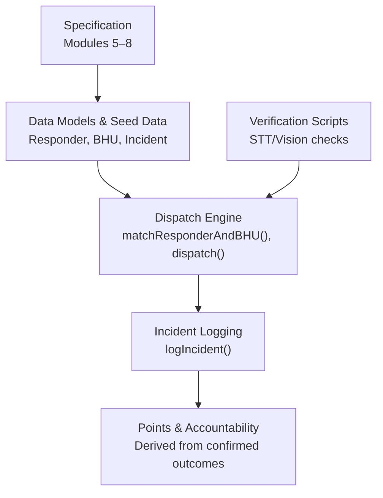
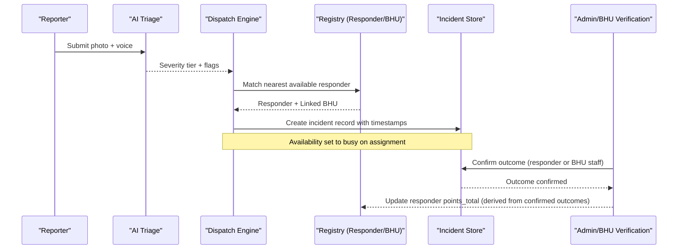
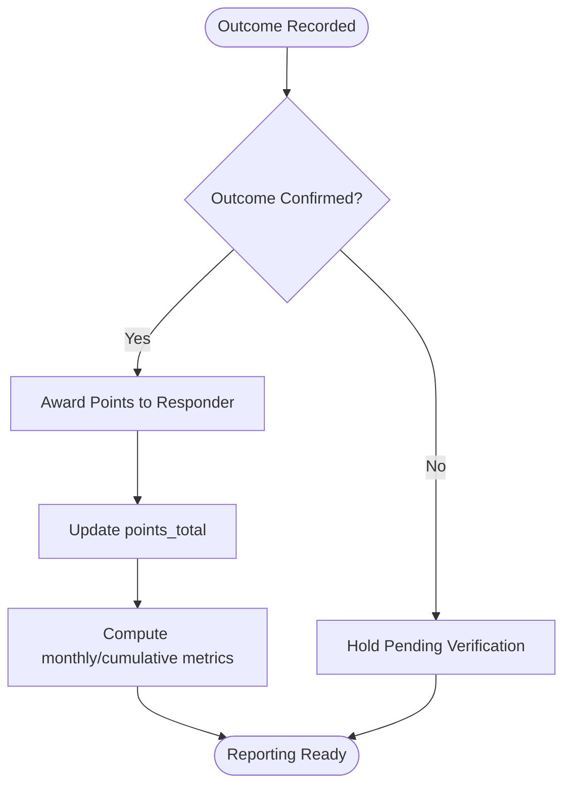
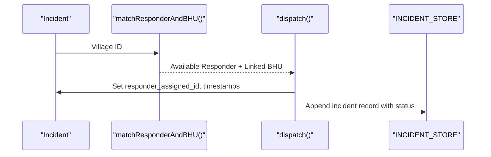
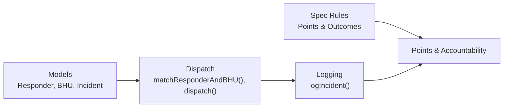

# Registry & Points System

<cite>
**Referenced Files in This Document**
- [village-emergency-response-system-spec.md](file://village-emergency-response-system-spec.md)
- [slice_runner.py](file://backend/slice_runner.py)
- [verify_stt.py](file://backend/verify_stt.py)
- [verify_vision.py](file://backend/verify_vision.py)
- [PROJECT.md](file://PROJECT.md)
</cite>

## Table of Contents
1. [Introduction](#introduction)
2. [Project Structure](#project-structure)
3. [Core Components](#core-components)
4. [Architecture Overview](#architecture-overview)
5. [Detailed Component Analysis](#detailed-component-analysis)
6. [Dependency Analysis](#dependency-analysis)
7. [Performance Considerations](#performance-considerations)
8. [Troubleshooting Guide](#troubleshooting-guide)
9. [Conclusion](#conclusion)
10. [Appendices](#appendices)

## Introduction
This document explains the Registry & Points System sub-component that manages responder profiles and performance tracking for a rural emergency response network. It covers:
- Responder profile structure and onboarding verification
- Points calculation rules tied to verified outcomes
- Accountability mechanisms and fraud prevention
- Coverage-gap tracking and performance metrics
- Integration with the dispatch engine and outcome tracking system
- Data privacy, audit trails, and administrative reporting considerations

The design ensures points are awarded only after verified outcomes, preventing gaming and enabling meaningful accountability and payment linkage.

## Project Structure
The relevant implementation is primarily in the backend module that defines data models, seed data, incident lifecycle functions, and AI triage integration. The specification documents define the registry, points logic, and outcome tracking requirements.

**Diagram sources**
- [village-emergency-response-system-spec.md:93-163](file://village-emergency-response-system-spec.md#L93-L163)
- [slice_runner.py:159-213](file://backend/slice_runner.py#L159-L213)
- [slice_runner.py:612-672](file://backend/slice_runner.py#L612-L672)

**Section sources**
- [village-emergency-response-system-spec.md:93-163](file://village-emergency-response-system-spec.md#L93-L163)
- [slice_runner.py:159-213](file://backend/slice_runner.py#L159-L213)
- [PROJECT.md:8-15](file://PROJECT.md#L8-L15)

## Core Components
- Responder profile model includes identity, village, linked BHU, availability status, and total points.
- BHU model links villages to health centers for escalation and coverage mapping.
- Incident model captures full lifecycle timestamps, severity tier, injury flags, help-bot transitions, and outcome fields used for verification and points.
- Dispatch engine selects nearest available responder per village and sets availability state during assignment.
- Incident logging persists the complete lifecycle record for analytics and points derivation.

Key responsibilities:
- Maintain accurate responder availability and linkage to BHUs
- Record incident events with precise timestamps for performance metrics
- Provide structured outcome fields to support verified points awarding

**Section sources**
- [slice_runner.py:159-213](file://backend/slice_runner.py#L159-L213)
- [slice_runner.py:219-275](file://backend/slice_runner.py#L219-L275)
- [slice_runner.py:612-672](file://backend/slice_runner.py#L612-L672)
- [village-emergency-response-system-spec.md:93-136](file://village-emergency-response-system-spec.md#L93-L136)

## Architecture Overview
The Registry & Points System integrates with the dispatch engine and outcome tracking to ensure points reflect verified responses.

**Diagram sources**
- [slice_runner.py:589-672](file://backend/slice_runner.py#L589-L672)
- [village-emergency-response-system-spec.md:111-136](file://village-emergency-response-system-spec.md#L111-L136)

## Detailed Component Analysis

### Responder Profile Structure
- Fields include unique ID, name, village, linked BHU, phone, registration date, training reference, equipment checklist status, current availability status, total points, and active status.
- Availability states: available, busy, offline.
- Points total is a derived aggregate computed from confirmed outcomes; it should not be self-reported.

Implementation highlights:
- Responder model defines core fields including points_total and availability status.
- Seed data demonstrates multiple responders across villages with varying availability and points totals.
- Matching logic filters responders by village and availability to select the nearest available candidate.

**Section sources**
- [slice_runner.py:159-198](file://backend/slice_runner.py#L159-L198)
- [slice_runner.py:219-275](file://backend/slice_runner.py#L219-L275)
- [slice_runner.py:612-623](file://backend/slice_runner.py#L612-L623)
- [village-emergency-response-system-spec.md:93-107](file://village-emergency-response-system-spec.md#L93-L107)

### Points Calculation Algorithms
- Points are earned per verified completed incident response.
- Verification must come from outcome confirmation (ideally by BHU staff), not self-reporting by the responder.
- Points history should include monthly totals and cumulative counts for meaningful accountability views.

Algorithmic flow:
- Outcome recorded in incident log
- Confirmation by authorized party (responder or BHU staff)
- Points increment applied to responder’s total based on confirmed outcome
- Monthly and cumulative metrics maintained for reporting

**Diagram sources**
- [village-emergency-response-system-spec.md:102-107](file://village-emergency-response-system-spec.md#L102-L107)
- [village-emergency-response-system-spec.md:115-136](file://village-emergency-response-system-spec.md#L115-L136)

**Section sources**
- [village-emergency-response-system-spec.md:102-107](file://village-emergency-response-system-spec.md#L102-L107)
- [village-emergency-response-system-spec.md:115-136](file://village-emergency-response-system-spec.md#L115-L136)

### Accountability Mechanisms for Verified Outcomes
- Outcome field supports values such as self-resolved, taken-to-BHU, referred-to-hospital, unresolved.
- Outcome confirmation can be by responder or BHU staff; BHU confirmation is preferred to prevent gaming.
- Help-bot transitions are logged to support post-incident review and training feedback.

Integration points:
- Incident model stores outcome and confirmation source
- Dispatch logs timestamps for dispatch, arrival, BHU notification/response, ambulance request/arrival
- Help-bot transitions appended to incident record for accountability review

**Section sources**
- [village-emergency-response-system-spec.md:115-136](file://village-emergency-response-system-spec.md#L115-L136)
- [slice_runner.py:170-189](file://backend/slice_runner.py#L170-L189)

### Fraud-Prevention Measures
- Points are awarded only after outcome confirmation, reducing self-reporting abuse.
- Severity-tier decisions include fail-safe defaults when inputs are low-confidence, ensuring safety without blocking dispatch.
- Escalation logic handles timeouts and mid-incident escalations, logging events for transparency.

Operational safeguards:
- Default moderate tier with low-confidence flag when triage signals are weak
- Timeout-based fallback to next responder or BHU-only dispatch
- Mandatory logging of escalations and help-bot transitions

**Section sources**
- [village-emergency-response-system-spec.md:130-163](file://village-emergency-response-system-spec.md#L130-L163)
- [slice_runner.py:521-586](file://backend/slice_runner.py#L521-L586)

### Coverage-Gap Tracking Capabilities
- When no responder is available within timeout, escalate to BHU-only dispatch and flag coverage gaps for analytics.
- Village-level analytics can identify slow response times or lack of available responders.

Metrics supported:
- Response-time analytics from report to responder arrival and report to BHU response
- Coverage gap identification per village for planning improvements

**Section sources**
- [village-emergency-response-system-spec.md:132-136](file://village-emergency-response-system-spec.md#L132-L136)
- [village-emergency-response-system-spec.md:157-163](file://village-emergency-response-system-spec.md#L157-L163)

### Performance Metrics Collection
- Timestamps captured at key stages: reported, dispatched, arrived, BHU notified/responded, ambulance requested/arrived, closed.
- These enable computation of:
  - Time-to-dispatch
  - Time-to-arrival
  - Time-to-BHU response
  - Overall resolution time

Implementation anchors:
- Incident model fields store timestamps for each stage
- Dispatch function updates timestamps upon assignment and notifications
- Logging function persists full lifecycle records

**Section sources**
- [slice_runner.py:170-189](file://backend/slice_runner.py#L170-L189)
- [slice_runner.py:626-672](file://backend/slice_runner.py#L626-L672)

### Integration with Dispatch Engine
- Matching selects nearest available responder in the same village and identifies linked BHU.
- Dispatch sets responder availability to busy, marks BHU notification for moderate/critical tiers, and requests ambulance for critical tier.
- Results are logged with status indicating dispatched, escalated to BHU-only, or no responders available.

**Diagram sources**
- [slice_runner.py:612-672](file://backend/slice_runner.py#L612-L672)

**Section sources**
- [slice_runner.py:612-672](file://backend/slice_runner.py#L612-L672)

### Integration with Outcome Tracking System
- Incident model includes outcome and outcome_confirmed_by fields to capture final resolution and verifier.
- Help-bot transitions are stored for review and training feedback.
- Outcome confirmation drives points awarding and performance evaluation.

**Section sources**
- [village-emergency-response-system-spec.md:115-136](file://village-emergency-response-system-spec.md#L115-L136)
- [slice_runner.py:170-189](file://backend/slice_runner.py#L170-L189)

### Data Privacy Considerations
- Patient images and voice data require careful handling; encryption at rest and retention policies (e.g., auto-delete after closure plus N days) are recommended.
- The spec emphasizes privacy-sensitive media handling even if not fully implemented in the demo scope.

Recommendations:
- Encrypt media at rest
- Implement automated deletion policies post-closure
- Restrict access to sensitive data to authorized roles

**Section sources**
- [village-emergency-response-system-spec.md:196-199](file://village-emergency-response-system-spec.md#L196-L199)

### Audit Trails and Reporting Capabilities
- Every escalation event and help-bot transition is logged to the incident record for transparency and analysis.
- Administrative oversight can use these logs to review training quality, coverage gaps, and responder performance.

Audit elements:
- Help-bot transitions appended to incident record
- Escalation events logged with triggers and outcomes
- Timestamps throughout lifecycle for timeline reconstruction

**Section sources**
- [village-emergency-response-system-spec.md:157-163](file://village-emergency-response-system-spec.md#L157-L163)
- [village-emergency-response-system-spec.md:115-136](file://village-emergency-response-system-spec.md#L115-L136)

## Dependency Analysis
The Registry & Points System depends on:
- Data models for Responder, BHU, and Incident
- Dispatch engine functions for matching and state mutation
- Incident logging for persistence and analytics
- Specification-defined rules for points and outcome verification

**Diagram sources**
- [slice_runner.py:159-213](file://backend/slice_runner.py#L159-L213)
- [slice_runner.py:612-672](file://backend/slice_runner.py#L612-L672)
- [village-emergency-response-system-spec.md:93-136](file://village-emergency-response-system-spec.md#L93-L136)

**Section sources**
- [slice_runner.py:159-213](file://backend/slice_runner.py#L159-L213)
- [slice_runner.py:612-672](file://backend/slice_runner.py#L612-L672)
- [village-emergency-response-system-spec.md:93-136](file://village-emergency-response-system-spec.md#L93-L136)

## Performance Considerations
- Ensure timely availability updates to prevent double-assignment of responders.
- Use cached triage results where appropriate to reduce API load and latency.
- Monitor response-time metrics to identify bottlenecks and coverage gaps.
- Implement robust error handling and retries for AI calls to maintain pipeline resilience.

[No sources needed since this section provides general guidance]

## Troubleshooting Guide
Common issues and resolutions:
- STT failures: Verify audio file existence and provider configuration; check retry behavior and quota limits.
- Vision classification errors: Validate image format and accessibility; inspect provider-specific error messages.
- No responders available: Check village-linked BHU mapping and responder availability status; escalate to BHU-only dispatch.
- Outcome confirmation delays: Ensure BHU staff workflow is in place to confirm outcomes promptly for points awarding.

Verification scripts:
- STT verification script tests transcription accuracy and latency across audio clips.
- Vision verification script tests injury classification accuracy and latency across photos.

**Section sources**
- [verify_stt.py:22-52](file://backend/verify_stt.py#L22-L52)
- [verify_vision.py:22-49](file://backend/verify_vision.py#L22-L49)
- [slice_runner.py:521-586](file://backend/slice_runner.py#L521-L586)

## Conclusion
The Registry & Points System establishes a robust foundation for responder accountability and performance tracking. By tying points to verified outcomes, maintaining detailed incident lifecycles, and integrating with dispatch and escalation logic, the system supports fair evaluation, fraud prevention, and actionable insights for administrative oversight. Future enhancements should focus on comprehensive outcome confirmation workflows, expanded reporting dashboards, and strengthened privacy controls.

[No sources needed since this section summarizes without analyzing specific files]

## Appendices

### Concrete Examples from Codebase
- Responder registration and verification: See specification for onboarding flow and verification gate.
- Points accumulation rules: Points awarded per verified outcome; see specification for logic and history tracking.
- Verification processes: Outcome confirmation by responder or BHU staff; see specification for fields and rationale.
- Dispatch integration: Matching and dispatch functions demonstrate selection and state mutation.
- Outcome tracking: Incident model fields capture lifecycle and outcome details.

**Section sources**
- [village-emergency-response-system-spec.md:139-150](file://village-emergency-response-system-spec.md#L139-L150)
- [village-emergency-response-system-spec.md:102-107](file://village-emergency-response-system-spec.md#L102-L107)
- [village-emergency-response-system-spec.md:115-136](file://village-emergency-response-system-spec.md#L115-L136)
- [slice_runner.py:612-672](file://backend/slice_runner.py#L612-L672)