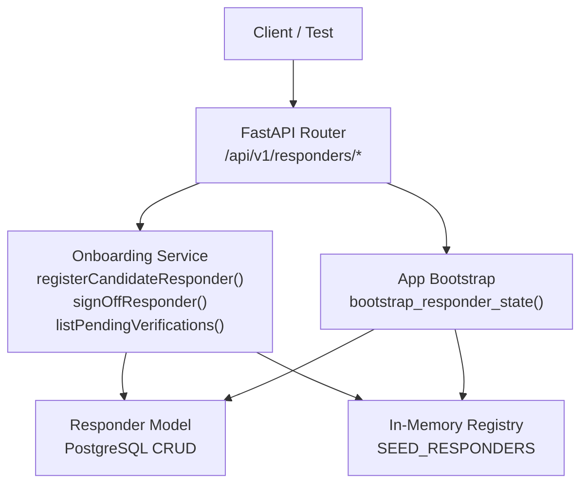
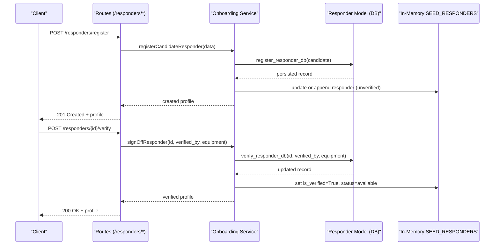
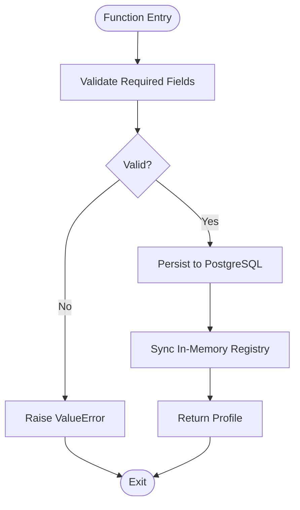
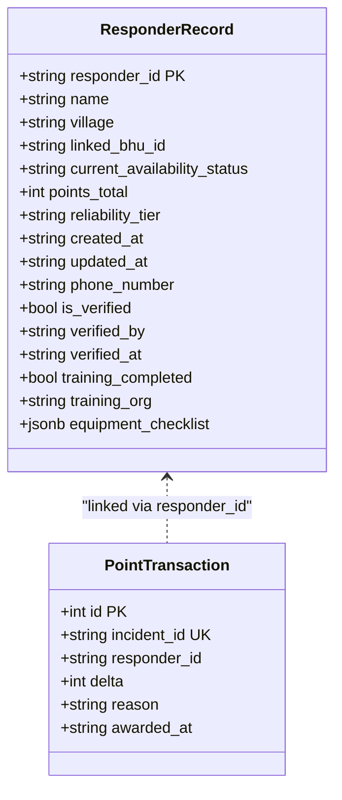
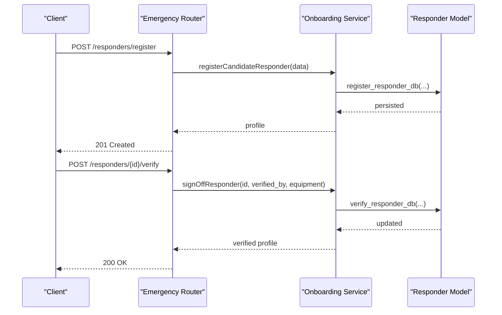
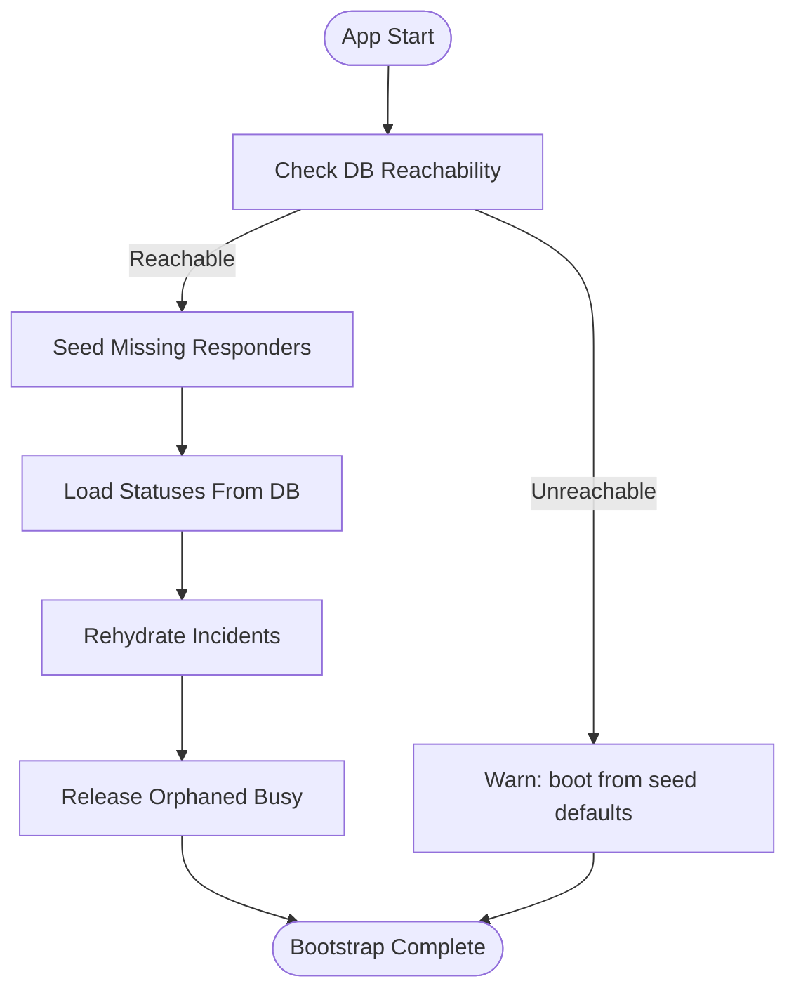
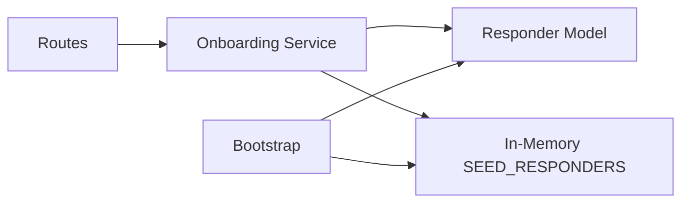

# Module 7: Responder Onboarding & Verification

<cite>
**Referenced Files in This Document**
- [onboarding_service.py](file://backend/services/onboarding_service.py)
- [responder_model.py](file://backend/models/responder_model.py)
- [emergency.py](file://backend/routes/emergency.py)
- [main.py](file://backend/main.py)
- [slice_runner.py](file://backend/slice_runner.py)
- [test_module7_onboarding.py](file://backend/test_module7_onboarding.py)
</cite>

## Table of Contents
1. [Introduction](#introduction)
2. [Project Structure](#project-structure)
3. [Core Components](#core-components)
4. [Architecture Overview](#architecture-overview)
5. [Detailed Component Analysis](#detailed-component-analysis)
6. [Dependency Analysis](#dependency-analysis)
7. [Performance Considerations](#performance-considerations)
8. [Troubleshooting Guide](#troubleshooting-guide)
9. [Conclusion](#conclusion)

## Introduction
Module 7 introduces a secure, auditable responder onboarding and verification workflow for the Village Emergency Response Network. It enforces that responders cannot self-verify; they must be verified by an authorized trainer or Basic Health Unit (BHU). Only after sign-off are responders promoted to available and eligible for dispatch. The module synchronizes PostgreSQL persistence with an in-memory registry so that state survives process restarts and remains consistent across the system.

Key outcomes:
- Candidate registration creates unverified responders with status “unverified”.
- Trainer/BHU sign-off promotes responders to “available” and records verification metadata.
- Dispatch gates exclude unverified responders from being matched.
- HTTP endpoints expose registration, verification, pending lists, and filtered registry views.
- Startup bootstrap rehydrates in-memory state from PostgreSQL to ensure continuity after restarts.

## Project Structure
Module 7 spans services, models, routes, application bootstrap, and tests:
- Service layer: business logic for registration, verification, and queries.
- Data model layer: SQLAlchemy ORM and helpers for PostgreSQL operations.
- Routes: FastAPI endpoints for onboarding and registry access.
- Bootstrap: startup reconciliation to persist availability and verification state.
- Tests: comprehensive scenarios validating end-to-end behavior.

**Diagram sources**
- [emergency.py:584-660](file://backend/routes/emergency.py#L584-L660)
- [onboarding_service.py:49-305](file://backend/services/onboarding_service.py#L49-L305)
- [responder_model.py:140-282](file://backend/models/responder_model.py#L140-L282)
- [main.py:149-216](file://backend/main.py#L149-L216)

**Section sources**
- [emergency.py:584-660](file://backend/routes/emergency.py#L584-L660)
- [onboarding_service.py:49-305](file://backend/services/onboarding_service.py#L49-L305)
- [responder_model.py:140-282](file://backend/models/responder_model.py#L140-L282)
- [main.py:149-216](file://backend/main.py#L149-L216)

## Core Components
- Onboarding Service: Validates inputs, persists candidates, performs verification sign-off, and provides query helpers for pending verifications and profiles.
- Responder Model: Defines the ResponderRecord schema and implements upsert, verify, list, and load functions for PostgreSQL.
- Routes: Expose REST endpoints for registration, verification, pending listing, and filtered registry views.
- Bootstrap: Reconciles in-memory state with PostgreSQL at app startup to preserve availability and verification across restarts.
- Tests: Validate candidate registration, dispatch isolation, sign-off promotion, post-verification matching, restart survival, and HTTP endpoint integration.

**Section sources**
- [onboarding_service.py:49-305](file://backend/services/onboarding_service.py#L49-L305)
- [responder_model.py:36-282](file://backend/models/responder_model.py#L36-L282)
- [emergency.py:584-660](file://backend/routes/emergency.py#L584-L660)
- [main.py:149-216](file://backend/main.py#L149-L216)
- [test_module7_onboarding.py:205-593](file://backend/test_module7_onboarding.py#L205-L593)

## Architecture Overview
The Module 7 architecture separates concerns into service, model, route, and bootstrap layers, ensuring clear responsibilities and robust persistence.

**Diagram sources**
- [emergency.py:584-617](file://backend/routes/emergency.py#L584-L617)
- [onboarding_service.py:49-235](file://backend/services/onboarding_service.py#L49-L235)
- [responder_model.py:140-213](file://backend/models/responder_model.py#L140-L213)

## Detailed Component Analysis

### Onboarding Service
Responsibilities:
- Register candidate responders with required fields validated and default unverified state.
- Perform trainer/BHU sign-off to promote to verified and available, recording verification metadata and equipment checklist.
- Provide query helpers to list pending verifications and retrieve full responder profiles.

Data flow highlights:
- Registration writes to PostgreSQL and updates in-memory registry immediately.
- Sign-off updates both DB and in-memory state, setting is_verified=True, current_availability_status="available", and timestamps.
- Pending list prefers DB results and falls back to in-memory filtering if needed.

**Diagram sources**
- [onboarding_service.py:49-131](file://backend/services/onboarding_service.py#L49-L131)

**Section sources**
- [onboarding_service.py:49-131](file://backend/services/onboarding_service.py#L49-L131)
- [onboarding_service.py:138-235](file://backend/services/onboarding_service.py#L138-L235)
- [onboarding_service.py:242-305](file://backend/services/onboarding_service.py#L242-L305)

### Responder Model (PostgreSQL)
Responsibilities:
- Define ResponderRecord schema including Module 7 fields (phone_number, is_verified, verified_by, verified_at, training_completed, training_org, equipment_checklist).
- Implement upsert, registration, verification, listing, and status loading functions.
- Seed responders from contract and rehydrate in-memory state from DB.

Key behaviors:
- Upsert ensures idempotent writes and preserves created_at while updating other fields.
- Verify sets is_verified=True, status="available", and records verification details.
- Load function updates in-memory responders with DB values, preserving dynamic registrations.

**Diagram sources**
- [responder_model.py:36-79](file://backend/models/responder_model.py#L36-L79)

**Section sources**
- [responder_model.py:90-167](file://backend/models/responder_model.py#L90-L167)
- [responder_model.py:170-213](file://backend/models/responder_model.py#L170-L213)
- [responder_model.py:216-282](file://backend/models/responder_model.py#L216-L282)
- [responder_model.py:369-427](file://backend/models/responder_model.py#L369-L427)
- [responder_model.py:429-477](file://backend/models/responder_model.py#L429-L477)

### Routes (HTTP Endpoints)
Endpoints:
- POST /api/v1/responders/register: Create a new candidate responder (unverified).
- POST /api/v1/responders/{responder_id}/verify: Admin/trainer sign-off to verify a responder.
- GET /api/v1/responders/pending: List candidates awaiting verification, optionally filtered by village.
- GET /api/v1/responders: Read-only view of in-memory registry with optional filters for village and verification status.

Validation and error handling:
- Pydantic models enforce payload structure.
- Structured errors follow project-wide contract with code/message pairs.
- Validation errors map to 400 responses; not found to 404; internal failures to 500.

**Diagram sources**
- [emergency.py:584-617](file://backend/routes/emergency.py#L584-L617)
- [onboarding_service.py:49-235](file://backend/services/onboarding_service.py#L49-L235)
- [responder_model.py:140-213](file://backend/models/responder_model.py#L140-L213)

**Section sources**
- [emergency.py:584-660](file://backend/routes/emergency.py#L584-L660)

### Application Bootstrap (Restart Survival)
Purpose:
- Ensure in-memory responder state reflects PostgreSQL after restarts.
- Release orphaned busy responders when no open incident exists.

Process:
1. Seed missing responders from contract (existing rows keep DB status).
2. Load availability statuses from DB into memory (DB authoritative).
3. Rehydrate incidents from DB (Module 6.5).
4. Release orphaned busy responders.

**Diagram sources**
- [main.py:149-216](file://backend/main.py#L149-L216)

**Section sources**
- [main.py:149-216](file://backend/main.py#L149-L216)

### Dispatch Gate Isolation
Behavior:
- Unverified responders are excluded from dispatch decisions.
- If only unverified responders exist in the incident’s village, the system escalates to BHU-only mode.

This ensures safety and compliance with verification requirements before dispatch.

**Section sources**
- [test_module7_onboarding.py:264-297](file://backend/test_module7_onboarding.py#L264-L297)

## Dependency Analysis
Module 7 components interact through well-defined boundaries:
- Routes depend on Onboarding Service for business logic.
- Onboarding Service depends on Responder Model for persistence and on In-Memory Registry for immediate consistency.
- Bootstrap coordinates seeding and rehydration to maintain state integrity.

**Diagram sources**
- [emergency.py:584-660](file://backend/routes/emergency.py#L584-L660)
- [onboarding_service.py:49-305](file://backend/services/onboarding_service.py#L49-L305)
- [responder_model.py:140-282](file://backend/models/responder_model.py#L140-L282)
- [main.py:149-216](file://backend/main.py#L149-L216)

**Section sources**
- [emergency.py:584-660](file://backend/routes/emergency.py#L584-L660)
- [onboarding_service.py:49-305](file://backend/services/onboarding_service.py#L49-L305)
- [responder_model.py:140-282](file://backend/models/responder_model.py#L140-L282)
- [main.py:149-216](file://backend/main.py#L149-L216)

## Performance Considerations
- Database writes are wrapped in try/except with rollback on failure to prevent partial states.
- In-memory synchronization avoids extra reads by directly updating SEED_RESPONDERS after DB writes.
- Pending list queries prefer DB results and fall back to in-memory filtering to reduce latency.
- Bootstrap steps are non-fatal; the app continues serving even if DB is unreachable, logging warnings.

[No sources needed since this section provides general guidance]

## Troubleshooting Guide
Common issues and resolutions:
- Registration validation failures: Ensure all required fields (name, village, phone_number, linked_bhu_id) are present and non-empty.
- Verification failures: Provide a valid verified_by identifier and a non-empty equipment_checklist.
- Not found errors: Confirm responder_id exists in registry before attempting verification.
- DB connectivity issues: App boots from seed data; check logs for warnings and verify PostgreSQL reachability via health endpoint.

Operational checks:
- Use GET /health to inspect db_reachable, responders_loaded, incidents_in_memory, and helpbot_sessions.
- Inspect pending responders via GET /responders/pending?village_id=... to review candidates awaiting verification.
- Filter registry via GET /responders?verified=true|false to audit verification status.

**Section sources**
- [emergency.py:76-122](file://backend/routes/emergency.py#L76-L122)
- [main.py:248-260](file://backend/main.py#L248-L260)
- [test_module7_onboarding.py:494-593](file://backend/test_module7_onboarding.py#L494-L593)

## Conclusion
Module 7 establishes a robust, auditable onboarding and verification pipeline that safeguards dispatch eligibility until responders are verified by authorized personnel. It integrates tightly with PostgreSQL and in-memory state to ensure consistency across restarts, exposes clear HTTP interfaces for operational workflows, and includes comprehensive tests validating critical scenarios such as dispatch gate isolation and restart survival.

[No sources needed since this section summarizes without analyzing specific files]