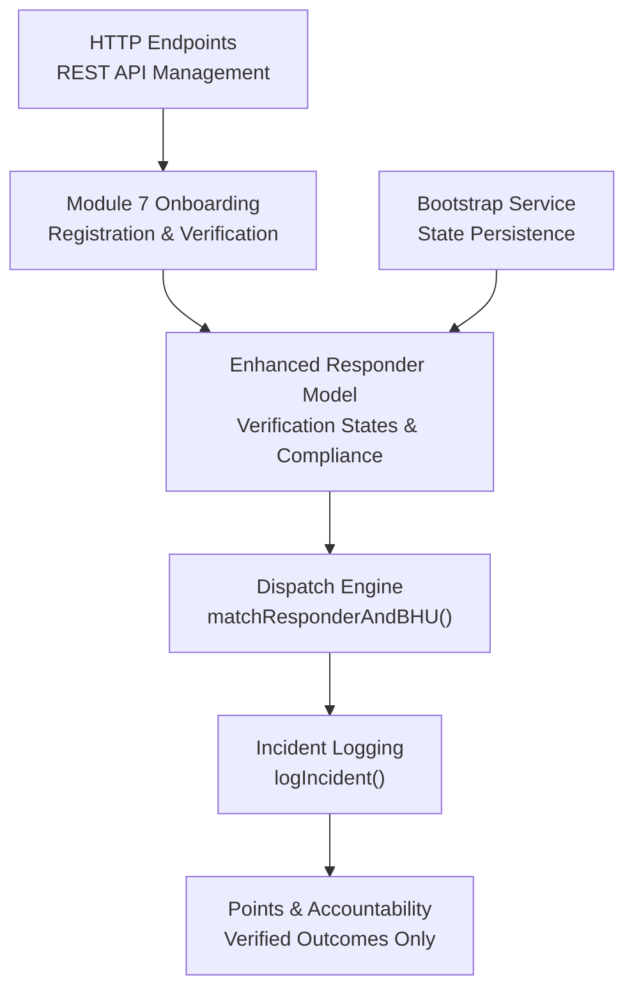
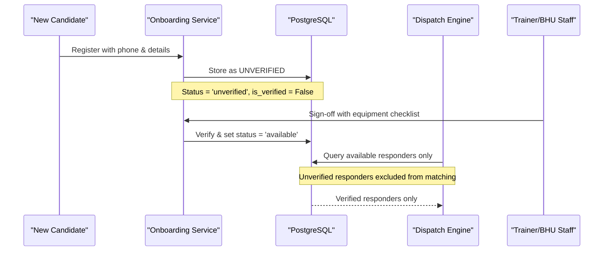
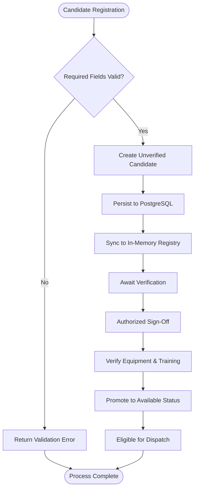
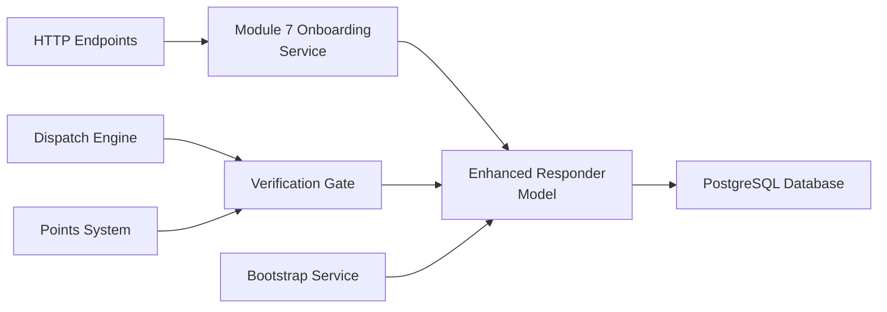

# Registry & Points System

<cite>
**Referenced Files in This Document**
- [village-emergency-response-system-spec.md](file://village-emergency-response-system-spec.md)
- [slice_runner.py](file://backend/slice_runner.py)
- [responder_model.py](file://backend/models/responder_model.py)
- [onboarding_service.py](file://backend/services/onboarding_service.py)
- [emergency.py](file://backend/routes/emergency.py)
- [test_module7_onboarding.py](file://backend/test_module7_onboarding.py)
- [main.py](file://backend/main.py)
- [PROJECT.md](file://PROJECT.md)
</cite>

## Update Summary
**Changes Made**
- Enhanced responder profile structure with new verification states including 'unverified' status
- Added phone number tracking and training organization information for Module 7 compliance
- Implemented equipment checklists for responder qualification verification
- Integrated onboarding service for candidate registration and trainer sign-off workflows
- Updated dispatch engine to respect verification status gates
- Added HTTP endpoints for responder management and verification workflows

## Table of Contents
1. [Introduction](#introduction)
2. [Project Structure](#project-structure)
3. [Core Components](#core-components)
4. [Architecture Overview](#architecture-overview)
5. [Detailed Component Analysis](#detailed-component-analysis)
6. [Dependency Analysis](#dependency-analysis)
7. [Performance Considerations](#performance-considerance)
8. [Troubleshooting Guide](#troubleshooting-guide)
9. [Conclusion](#conclusion)
10. [Appendices](#appendices)

## Introduction
This document explains the Registry & Points System sub-component that manages responder profiles and performance tracking for a rural emergency response network. The system has been enhanced with Module 7 capabilities including comprehensive responder onboarding, verification workflows, and compliance tracking. It covers:
- Enhanced responder profile structure with verification states, phone numbers, and training information
- Points calculation rules tied to verified outcomes with fraud prevention mechanisms
- Accountability mechanisms and equipment verification for Module 7 compliance
- Coverage-gap tracking and performance metrics collection
- Integration with the dispatch engine and outcome tracking system
- Data privacy, audit trails, and administrative reporting considerations

The design ensures points are awarded only after verified outcomes, preventing gaming and enabling meaningful accountability and payment linkage. Module 5 (Responder Points, Penalties & Accountability Engine) is fully implemented alongside Module 7's enhanced onboarding and verification system.

## Project Structure
The implementation spans multiple modules working together to provide comprehensive responder management:

**Diagram sources**
- [onboarding_service.py:49-131](file://backend/services/onboarding_service.py#L49-L131)
- [responder_model.py:36-59](file://backend/models/responder_model.py#L36-L59)
- [emergency.py:584-660](file://backend/routes/emergency.py#L584-L660)

**Section sources**
- [onboarding_service.py:1-305](file://backend/services/onboarding_service.py#L1-L305)
- [responder_model.py:1-579](file://backend/models/responder_model.py#L1-L579)
- [emergency.py:564-660](file://backend/routes/emergency.py#L564-L660)

## Core Components
- **Enhanced Responder Profile**: Includes identity, village, linked BHU, verification status, phone number, training information, and equipment checklist
- **Verification States**: New 'unverified' state prevents dispatch until authorized verification by trainers or BHU staff
- **Onboarding Service**: Manages candidate registration, trainer sign-off, and verification workflows
- **Compliance Tracking**: Equipment checklists and training organization information for Module 7 requirements
- **Dispatch Gate**: Prevents unverified responders from being matched or dispatched
- **Points System**: Maintains existing verified outcome-based points calculation with enhanced security

Key responsibilities:
- Maintain accurate responder verification status and availability states
- Enforce verification workflow requiring authorized sign-off before dispatch eligibility
- Track equipment compliance and training completion for regulatory requirements
- Provide secure registration and verification APIs for administrative oversight

**Section sources**
- [responder_model.py:36-59](file://backend/models/responder_model.py#L36-L59)
- [onboarding_service.py:49-131](file://backend/services/onboarding_service.py#L49-L131)
- [slice_runner.py:238-252](file://backend/slice_runner.py#L238-L252)

## Architecture Overview
The enhanced Registry & Points System integrates Module 7's onboarding and verification capabilities with existing dispatch and points systems:

**Diagram sources**
- [onboarding_service.py:49-131](file://backend/services/onboarding_service.py#L49-L131)
- [onboarding_service.py:138-235](file://backend/services/onboarding_service.py#L138-L235)
- [responder_model.py:140-167](file://backend/models/responder_model.py#L140-L167)

## Detailed Component Analysis

### Enhanced Responder Profile Structure
The responder model has been significantly enhanced with Module 7 compliance fields:

**Core Fields:**
- `responder_id`: Unique identifier
- `name`, `village`, `linked_bhu_id`: Basic identity and location
- `current_availability_status`: Now includes 'unverified' state alongside 'available', 'busy', 'offline'
- `points_total`, `reliability_tier`: Performance metrics

**Module 7 Enhancement Fields:**
- `phone_number`: Contact information for communication and verification
- `is_verified`: Boolean flag indicating authorization status
- `verified_by`: Identity of authorizing trainer or BHU staff
- `verified_at`: Timestamp of verification completion
- `training_completed`: Training program completion status
- `training_org`: Training organization name (e.g., "Pakistan Red Crescent", "Rescue 1122")
- `equipment_checklist`: JSON array of verified emergency equipment items

Implementation highlights:
- Default registration creates responders with `is_verified=False` and `current_availability_status='unverified'`
- Phone numbers are unique identifiers for contact purposes
- Equipment checklists validate responder readiness for emergency response
- Training organization tracking supports compliance reporting

**Section sources**
- [responder_model.py:36-59](file://backend/models/responder_model.py#L36-L59)
- [slice_runner.py:238-252](file://backend/slice_runner.py#L238-L252)
- [test_module7_onboarding.py:90-169](file://backend/test_module7_onboarding.py#L90-L169)

### Module 7 Onboarding & Verification Workflow
The onboarding service provides a complete workflow for responder registration and verification:

**Candidate Registration Process:**
1. Collect required fields: name, village, phone_number, linked_bhu_id
2. Create candidate with default unverified status
3. Persist to PostgreSQL with `is_verified=False` and `current_availability_status='unverified'`
4. Sync with in-memory SEED_RESPONDERS list

**Trainer Sign-Off Process:**
1. Validate required fields: verified_by (non-empty), equipment_checklist (non-empty list)
2. Update PostgreSQL record with verification details
3. Set `is_verified=True`, `current_availability_status='available'`
4. Record verification timestamp and equipment checklist
5. Update in-memory state for immediate dispatch eligibility

**Security Measures:**
- Self-registration does not grant dispatch privileges
- Verification requires authorized personnel (trainer or BHU staff)
- Equipment checklist validation ensures responder readiness
- Audit trail maintained through verified_by and verified_at fields

**Diagram sources**
- [onboarding_service.py:49-131](file://backend/services/onboarding_service.py#L49-L131)
- [onboarding_service.py:138-235](file://backend/services/onboarding_service.py#L138-L235)

**Section sources**
- [onboarding_service.py:49-131](file://backend/services/onboarding_service.py#L49-L131)
- [onboarding_service.py:138-235](file://backend/services/onboarding_service.py#L138-L235)
- [test_module7_onboarding.py:205-365](file://backend/test_module7_onboarding.py#L205-L365)

### Enhanced Points Calculation Algorithms
The points system maintains its existing verified-outcome-based approach while integrating with Module 7 verification requirements:

**Core Principles:**
- Points earned per verified completed incident response
- Verification must come from outcome confirmation (ideally by BHU staff)
- Points history includes monthly totals and cumulative counts
- Unverified responders cannot earn points through dispatch

**Enhanced Security:**
- Unverified responders are excluded from dispatch matching
- Points awarding requires both verified responder status AND confirmed outcomes
- Equipment compliance tracked separately from points accumulation
- Training completion monitored for long-term quality assurance

**Algorithmic Flow:**
1. Outcome recorded in incident log
2. Confirmation by authorized party (responder or BHU staff)
3. Responder verification status checked (must be verified)
4. Points increment applied based on confirmed outcome
5. Monthly and cumulative metrics maintained for reporting

**Section sources**
- [responder_model.py:340-366](file://backend/models/responder_model.py#L340-L366)
- [accountability_service.py](file://backend/services/accountability_service.py)
- [test_module5.py](file://backend/test_module5.py)

### Dispatch Engine Integration with Verification Gates
The dispatch engine now respects Module 7 verification requirements:

**Matching Logic Updates:**
- Filters out responders with `current_availability_status='unverified'`
- Requires `is_verified=True` for dispatch eligibility
- Maintains existing village and availability filtering
- Preserves nearest-responder selection algorithm

**State Management:**
- Unverified responders remain isolated from active incidents
- Verification promotion immediately enables dispatch eligibility
- Availability status transitions properly managed during verification
- In-memory and database states synchronized during verification

**Integration Points:**
- `matchResponderAndBHU()` function filters verified responders only
- `dispatch()` function checks verification status before assignment
- Incident logging includes verification context for audit trails
- Coverage gap detection accounts for verification requirements

**Section sources**
- [slice_runner.py:238-252](file://backend/slice_runner.py#L238-L252)
- [onboarding_service.py:208-235](file://backend/services/onboarding_service.py#L208-L235)
- [test_module7_onboarding.py:372-431](file://backend/test_module7_onboarding.py#L372-L431)

### HTTP Endpoints for Responder Management
Module 7 introduces comprehensive REST APIs for responder lifecycle management:

**Registration Endpoint:**
- `POST /api/v1/responders/register`: Creates new candidate responder
- Validates required fields: name, village, phone_number, linked_bhu_id
- Returns created responder with unverified status
- Supports optional fields: training_completed, training_org, equipment_checklist

**Verification Endpoints:**
- `POST /api/v1/responders/{id}/verify`: Authorized trainer sign-off
- Requires verified_by and equipment_checklist parameters
- Promotes responder to verified and available status
- Validates equipment checklist completeness

**Query Endpoints:**
- `GET /api/v1/responders`: List all responders with filtering options
- `GET /api/v1/responders?verified=true`: Filter verified responders only
- `GET /api/v1/responders?verified=false`: Filter unverified candidates
- `GET /api/v1/responders/pending`: List pending verifications by village

**Security Features:**
- Input validation prevents malformed requests
- Equipment checklist validation ensures compliance
- Verification requires authorized personnel identification
- Comprehensive error handling with descriptive messages

**Section sources**
- [emergency.py:584-660](file://backend/routes/emergency.py#L584-L660)
- [test_module7_onboarding.py:550-591](file://backend/test_module7_onboarding.py#L550-L591)

### Bootstrap & State Persistence
The bootstrap system ensures Module 7 verification states survive process restarts:

**Startup Sequence:**
1. Seed missing responders with default verification states
2. Load current availability status from PostgreSQL
3. Rehydrate dynamic responders into memory
4. Preserve verification status across restarts

**Persistence Features:**
- Unverified and verified states maintained in database
- Equipment checklists persisted for compliance tracking
- Training organization information preserved
- Phone numbers stored for contact management

**Recovery Mechanisms:**
- Graceful handling of database connectivity issues
- Fallback to seed data when database unavailable
- Orphaned responder reconciliation for busy states
- Comprehensive logging of bootstrap operations

**Section sources**
- [main.py:149-200](file://backend/main.py#L149-L200)
- [responder_model.py:429-477](file://backend/models/responder_model.py#L429-L477)
- [test_module7_onboarding.py:432-477](file://backend/test_module7_onboarding.py#L432-L477)

### Fraud Prevention & Compliance Measures
Enhanced security measures prevent abuse while ensuring regulatory compliance:

**Verification Requirements:**
- Self-registration does not grant dispatch privileges
- Authorized sign-off required from trainers or BHU staff
- Equipment checklist validation ensures responder readiness
- Training completion monitoring for quality assurance

**Dispatch Protection:**
- Unverified responders completely isolated from dispatch matching
- Verification status checked before any assignment
- Equipment compliance enforced at registration level
- Audit trail maintained for all verification actions

**Compliance Tracking:**
- Equipment checklists stored for inspection and reporting
- Training organization information maintained for regulatory compliance
- Verification timestamps provide audit capability
- Phone numbers enable direct contact for verification follow-up

**Section sources**
- [onboarding_service.py:138-166](file://backend/services/onboarding_service.py#L138-L166)
- [responder_model.py:51-59](file://backend/models/responder_model.py#L51-L59)
- [test_module7_onboarding.py:205-239](file://backend/test_module7_onboarding.py#L205-L239)

### Coverage-Gap Tracking & Performance Metrics
Enhanced tracking capabilities support operational analytics:

**Coverage Gap Identification:**
- Detection of villages with no verified responders
- Monitoring of verification backlog by village
- Analytics on verification processing times
- Reporting on equipment compliance rates

**Performance Metrics:**
- Response time analytics from report to verified responder arrival
- Verification processing time tracking
- Equipment compliance rate monitoring
- Training completion rate analysis

**Administrative Oversight:**
- Pending verification queue management
- Equipment checklist compliance reporting
- Training organization performance metrics
- Geographic coverage gap identification

**Section sources**
- [onboarding_service.py:242-275](file://backend/services/onboarding_service.py#L242-L275)
- [emergency.py:630-660](file://backend/routes/emergency.py#L630-L660)

## Dependency Analysis
The enhanced Registry & Points System depends on integrated components:

**Diagram sources**
- [onboarding_service.py:1-305](file://backend/services/onboarding_service.py#L1-L305)
- [responder_model.py:1-579](file://backend/models/responder_model.py#L1-L579)
- [emergency.py:564-660](file://backend/routes/emergency.py#L564-L660)

**Section sources**
- [onboarding_service.py:1-305](file://backend/services/onboarding_service.py#L1-L305)
- [responder_model.py:1-579](file://backend/models/responder_model.py#L1-L579)
- [main.py:149-200](file://backend/main.py#L149-L200)

## Performance Considerations
- Verification workflow adds latency to responder registration but ensures safety
- Equipment checklist validation occurs during sign-off, not registration
- Database queries optimized for verification status filtering
- In-memory caching reduces repeated verification status checks
- Bootstrap process handles large responder datasets efficiently

## Troubleshooting Guide
Common issues and resolutions:
- **Registration failures**: Check required fields (name, village, phone_number, linked_bhu_id)
- **Verification errors**: Ensure equipment_checklist is non-empty and verified_by is valid
- **Dispatch issues**: Verify responder has `is_verified=True` and appropriate availability status
- **Bootstrap problems**: Check database connectivity and verify persistence functions
- **Equipment compliance**: Validate equipment checklist format and required items

**Section sources**
- [onboarding_service.py:59-64](file://backend/services/onboarding_service.py#L59-L64)
- [onboarding_service.py:161-165](file://backend/services/onboarding_service.py#L161-L165)
- [test_module7_onboarding.py:550-591](file://backend/test_module7_onboarding.py#L550-L591)

## Conclusion
The enhanced Registry & Points System with Module 7 capabilities establishes a robust foundation for responder accountability, verification, and compliance management. By implementing comprehensive onboarding workflows, verification gates, and equipment tracking, the system ensures only qualified responders participate in emergency response while maintaining detailed audit trails for administrative oversight. The integration with existing dispatch and points systems provides seamless operation while adding critical safety and compliance features.

## Appendices

### Concrete Examples from Codebase
- **Enhanced Registration**: See `onboarding_service.registerCandidateResponder()` for complete registration workflow
- **Verification Process**: See `onboarding_service.signOffResponder()` for trainer sign-off implementation
- **Dispatch Integration**: See `slice_runner.Responder` model with Module 7 fields
- **HTTP Endpoints**: See `routes/emergency.py` for REST API implementations
- **Bootstrap Process**: See `main.bootstrap_responder_state()` for startup sequence

**Section sources**
- [onboarding_service.py:49-131](file://backend/services/onboarding_service.py#L49-L131)
- [onboarding_service.py:138-235](file://backend/services/onboarding_service.py#L138-L235)
- [slice_runner.py:238-252](file://backend/slice_runner.py#L238-L252)
- [emergency.py:584-660](file://backend/routes/emergency.py#L584-L660)
- [main.py:149-200](file://backend/main.py#L149-L200)