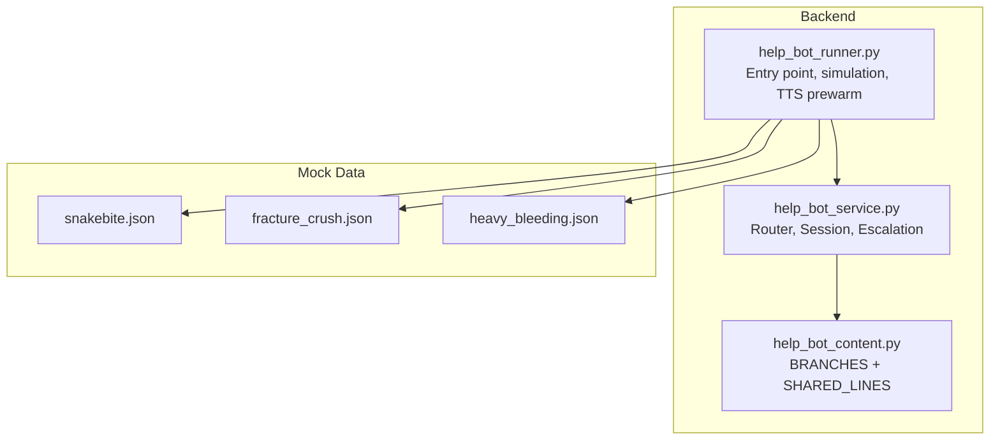
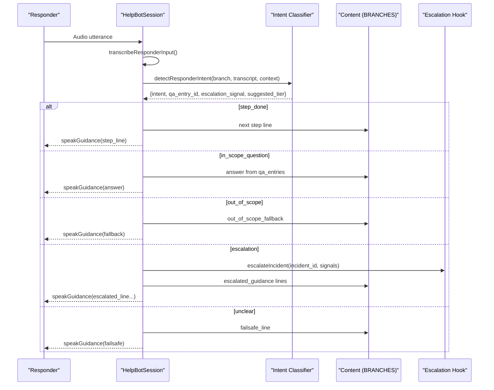
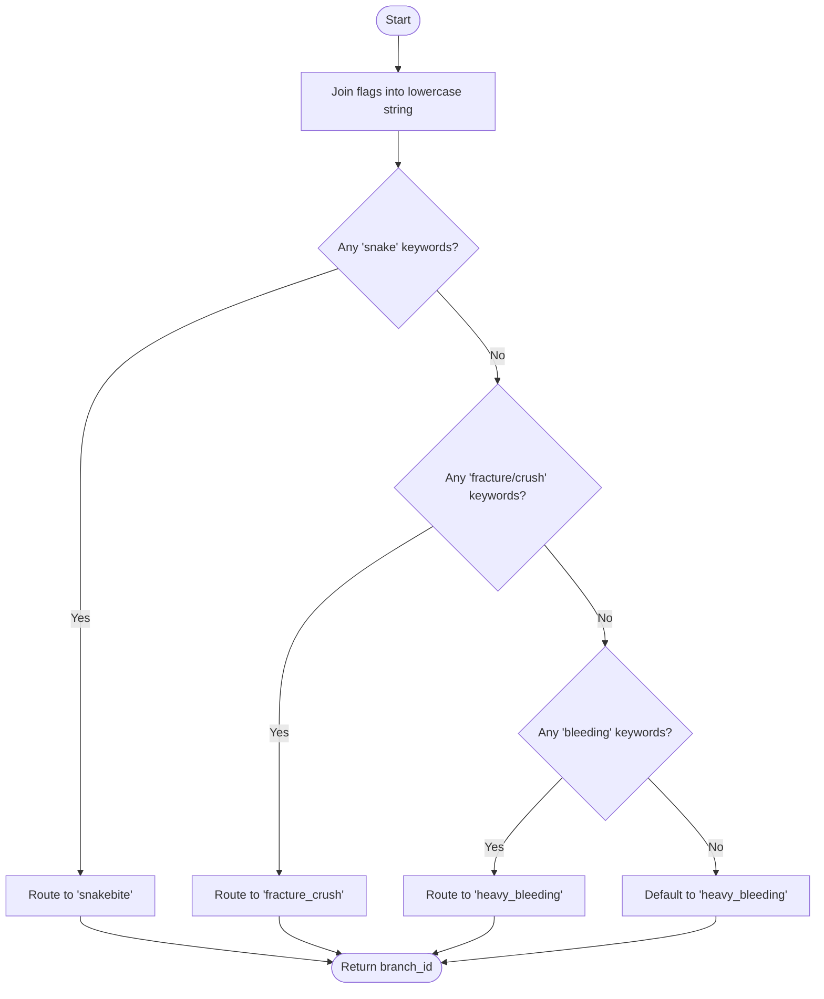
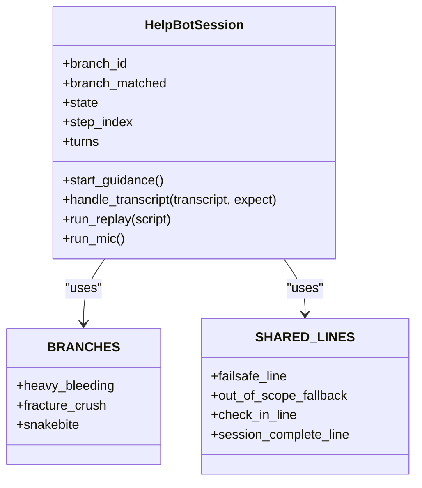
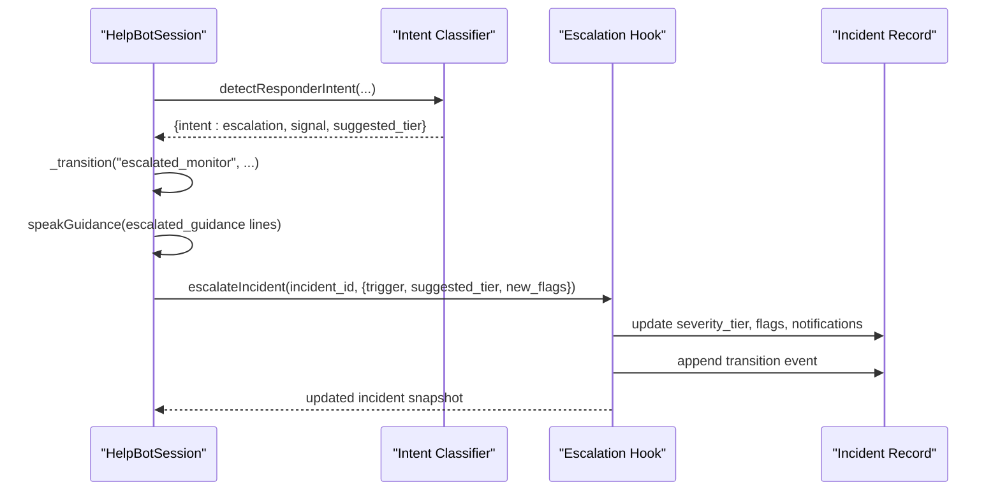
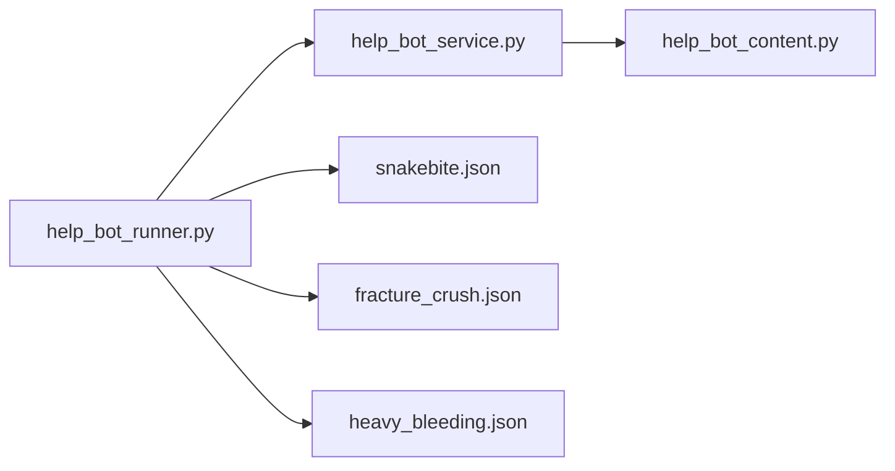

# Branch Routing & Medical Content

<cite>
**Referenced Files in This Document**
- [help_bot_content.py](file://backend/services/help_bot_content.py)
- [help_bot_service.py](file://backend/services/help_bot_service.py)
- [help_bot_runner.py](file://backend/help_bot_runner.py)
- [snakebite.json](file://mockdata/helpbot/scripts/snakebite.json)
- [fracture_crush.json](file://mockdata/helpbot/scripts/fracture_crush.json)
- [heavy_bleeding.json](file://mockdata/helpbot/scripts/heavy_bleeding.json)
</cite>

## Update Summary
**Changes Made**
- Enhanced snakebite branch test evidence section with complete 5/5 expectation match demonstration
- Added detailed analysis of snakebite first aid protocol validation
- Updated testing methodology to include comprehensive scenario coverage
- Enhanced escalation trigger system documentation with real test evidence

## Table of Contents
1. Introduction
2. Project Structure
3. Core Components
4. Architecture Overview
5. Detailed Component Analysis
6. Dependency Analysis
7. Performance Considerations
8. Troubleshooting Guide
9. Conclusion

## Introduction
This document explains the branch routing and medical content system that provides injury-type specific guidance to first responders. The system uses a keyword-based router to map incident flags to one of three medical branches: snakebite, fracture_crush, and heavy_bleeding. Each branch contains structured, rule-based Urdu guidance, step-by-step protocols, Q&A entries, and escalation signals. A tiered escalation system monitors for patient deterioration and upgrades severity when needed. All spoken content is hardcoded; the AI is used only for ears (speech-to-text) and intent classification, never for composing medical advice.

## Project Structure
The relevant implementation spans backend services and mock data scripts:
- Backend services define the branching logic, conversation engine, and escalation hooks.
- Mock data scripts provide deterministic test flows per branch.

**Diagram sources**
- [help_bot_content.py:21-43](file://backend/services/help_bot_content.py#L21-L43)
- [help_bot_service.py:95-116](file://backend/services/help_bot_service.py#L95-L116)
- [help_bot_runner.py:46-61](file://backend/help_bot_runner.py#L46-L61)
- [snakebite.json:1-11](file://mockdata/helpbot/scripts/snakebite.json#L1-L11)
- [fracture_crush.json:1-11](file://mockdata/helpbot/scripts/fracture_crush.json#L1-L11)
- [heavy_bleeding.json:1-11](file://mockdata/helpbot/scripts/heavy_bleeding.json#L1-L11)

**Section sources**
- [help_bot_content.py:21-43](file://backend/services/help_bot_content.py#L21-L43)
- [help_bot_service.py:95-116](file://backend/services/help_bot_service.py#L95-L116)
- [help_bot_runner.py:46-61](file://backend/help_bot_runner.py#L46-L61)

## Core Components
- Keyword-based branch router maps incident flags to a branch id with a safe default.
- BRANCHES data structure defines per-injury guidance: initial guidance, steps, Q&A, escalation signals, and escalated guidance.
- Conversation session orchestrates STT -> intent classification -> scripted response via TTS.
- Escalation hook upgrades severity tiers and records transitions.

Key responsibilities:
- Routing: translate flags into a single branch using ordered keyword matching.
- Content: deliver only pre-approved Urdu lines from BRANCHES/SHARED_LINES.
- Intent: classify responder input into step_done, in_scope_question, out_of_scope, escalation, or unclear.
- Escalation: monitor for worsening conditions and trigger tier upgrades.

**Section sources**
- [help_bot_service.py:95-116](file://backend/services/help_bot_service.py#L95-L116)
- [help_bot_content.py:21-43](file://backend/services/help_bot_content.py#L21-L43)
- [help_bot_content.py:46-254](file://backend/services/help_bot_content.py#L46-L254)
- [help_bot_service.py:170-288](file://backend/services/help_bot_service.py#L170-L288)
- [help_bot_service.py:572-647](file://backend/services/help_bot_service.py#L572-L647)

## Architecture Overview
The system follows a strict pipeline: audio capture -> STT -> intent classification -> scripted response -> optional escalation. All medical text is static and sourced from BRANCHES/SHARED_LINES.

**Diagram sources**
- [help_bot_service.py:127-167](file://backend/services/help_bot_service.py#L127-L167)
- [help_bot_service.py:174-288](file://backend/services/help_bot_service.py#L174-L288)
- [help_bot_service.py:368-387](file://backend/services/help_bot_service.py#L368-L387)
- [help_bot_service.py:572-647](file://backend/services/help_bot_service.py#L572-L647)
- [help_bot_content.py:21-43](file://backend/services/help_bot_content.py#L21-L43)
- [help_bot_content.py:46-254](file://backend/services/help_bot_content.py#L46-L254)

## Detailed Component Analysis

### Branch Router: Keyword-Based Mapping
- The router scans incident flags in order and matches against keyword sets for each branch.
- If no branch matches, it defaults to heavy_bleeding because immediate pressure guidance is safest.
- Keywords include English terms, Roman Urdu, and Urdu script variants to accommodate varied inputs.

**Diagram sources**
- [help_bot_service.py:95-116](file://backend/services/help_bot_service.py#L95-L116)

**Section sources**
- [help_bot_service.py:95-116](file://backend/services/help_bot_service.py#L95-L116)

### BRANCHES Data Structure
Each branch includes:
- branch_id and title_ur
- initial_guidance: opening instructions
- steps: ordered actions with step_id and line
- qa_entries: question hints mapped to approved answers
- escalation_signals: phrases indicating deterioration
- escalated_guidance: post-escalation instructions

Shared lines are defined once and reused across branches for consistent safety behavior.

Examples of structure:
- heavy_bleeding: direct pressure, elevation, add cloth over soaked layer; Q&A on soaked cloth, pressure intensity, duration, embedded objects; escalation signals include uncontrolled bleeding and unconsciousness.
- fracture_crush: immobilize, cover wound if open, splint; Q&A on improvised splints, pain management, food/water restrictions; escalation signals include bone exposure and severe bleeding.
- snakebite: keep still, remove constrictions, avoid harmful remedies; Q&A on bandaging, cleaning, identifying snake, cutting/sucking; escalation signals include breathing difficulty and rapid swelling.

**Section sources**
- [help_bot_content.py:21-43](file://backend/services/help_bot_content.py#L21-L43)
- [help_bot_content.py:46-254](file://backend/services/help_bot_content.py#L46-L254)

### Shared Lines for Common Scenarios
- failsafe_line: spoken when AI call fails, timeout, or input unintelligible; ensures continuous guidance.
- out_of_scope_fallback: honest refusal for questions outside scope; directs to basic safety and waiting for help.
- check_in_line: periodic hands busy check-in during live mode.
- session_complete_line: final message after all scripted steps delivered.

These shared lines guarantee consistent safety behavior regardless of branch.

**Section sources**
- [help_bot_content.py:21-43](file://backend/services/help_bot_content.py#L21-L43)

### Injury Classification and Content Selection
- Incident flags from triage are joined and scanned by the router to select a branch.
- Once routed, the session delivers initial_guidance then proceeds through steps.
- Q&A entries are matched by intent classifier using hints provided in qa_entries.
- Escalation signals are detected by the classifier and trigger escalated_guidance plus tier upgrade.

**Diagram sources**
- [help_bot_service.py:663-783](file://backend/services/help_bot_service.py#L663-L783)
- [help_bot_content.py:21-43](file://backend/services/help_bot_content.py#L21-L43)
- [help_bot_content.py:46-254](file://backend/services/help_bot_content.py#L46-L254)

**Section sources**
- [help_bot_service.py:663-783](file://backend/services/help_bot_service.py#L663-L783)
- [help_bot_content.py:46-254](file://backend/services/help_bot_content.py#L46-L254)

### Escalation Trigger System
- The intent classifier can label an utterance as escalation with a signal and suggested tier.
- On escalation, the session:
  - Transitions to escalated_monitor state
  - Speaks escalated_guidance lines
  - Calls escalateIncident with trigger, suggested_tier, new_flags, and transcript excerpt
- escalateIncident:
  - Upgrades severity_tier if suggested tier is higher
  - Merges new injury flags
  - Flags BHU notification and ambulance request when critical
  - Appends a timestamped transition event to help_bot_transitions
  - Syncs INCIDENT_STORE snapshot for inspection

**Diagram sources**
- [help_bot_service.py:855-868](file://backend/services/help_bot_service.py#L855-L868)
- [help_bot_service.py:572-647](file://backend/services/help_bot_service.py#L572-L647)

**Section sources**
- [help_bot_service.py:855-868](file://backend/services/help_bot_service.py#L855-L868)
- [help_bot_service.py:572-647](file://backend/services/help_bot_service.py#L572-L647)

### Hardcoded Content Discipline
- Every spoken sentence comes verbatim from BRANCHES or SHARED_LINES.
- The AI provider is used only for STT and intent classification; it never composes medical content.
- Fail-safe behavior ensures no silence even if TTS or AI calls fail.
- TTS caching avoids quota exhaustion and ensures deterministic replay runs.

**Section sources**
- [help_bot_service.py:1-21](file://backend/services/help_bot_service.py#L1-L21)
- [help_bot_service.py:368-387](file://backend/services/help_bot_service.py#L368-L387)
- [help_bot_service.py:727-757](file://backend/services/help_bot_service.py#L727-L757)

### Concrete Examples: Branch Definitions and Shared Lines
- heavy_bleeding branch demonstrates step progression (direct pressure, elevate, add cloth), Q&A handling (soaked cloth, pressure intensity), and escalation triggers (uncontrolled bleeding, unconsciousness).
- fracture_crush branch shows immobilization, covering wounds, splinting, and Q&A for improvised materials and medication restrictions.
- snakebite branch emphasizes keeping still, removing constrictions, avoiding harmful remedies, and Q&A about bandaging and wound care.
- Shared lines ensure consistent safety messaging across all branches.

Relevant paths:
- Branch definitions and Q&A: [help_bot_content.py:46-254](file://backend/services/help_bot_content.py#L46-L254)
- Shared lines: [help_bot_content.py:21-43](file://backend/services/help_bot_content.py#L21-L43)

**Section sources**
- [help_bot_content.py:21-43](file://backend/services/help_bot_content.py#L21-L43)
- [help_bot_content.py:46-254](file://backend/services/help_bot_content.py#L46-L254)

### Relationship Between Injury Classification and Content Selection
- Incident flags determine the branch via keyword matching.
- Within the branch, current step guides intent prompts so the classifier knows which Q&A entries and escalation signals apply.
- This keeps responses tightly coupled to the active scenario and prevents free-form improvisation.

**Section sources**
- [help_bot_service.py:174-213](file://backend/services/help_bot_service.py#L174-L213)
- [help_bot_service.py:721-725](file://backend/services/help_bot_service.py#L721-725)

### Snakebite Branch Test Evidence: Complete Validation
The snakebite branch has been comprehensively tested with multiple replay scenarios demonstrating proper handling of all critical pathways:

#### Test Scenario Flow
The snakebite test script validates a complete emergency response sequence:
1. **Initial Guidance**: System provides snakebite-specific opening instructions
2. **Three Ordered Steps**: 
   - Keep patient still and immobilize affected limb
   - Remove constrictions (rings, watches, tight clothing) near bite site
   - Avoid harmful remedies (no cutting, sucking, or tight bandages)
3. **In-Scope Q&A**: Correctly handles tourniquet/bandaging question with explicit "NO" response
4. **Out-of-Scope Question**: Properly declines fever medication advice with safety fallback
5. **Escalation Trigger**: Detects breathing difficulty and initiates emergency protocol

#### Test Results Analysis
Multiple test runs demonstrate consistent performance:

**Perfect Match Run (5/5 expectations)**:
- All five expected intents matched correctly: step_done, step_done, in_scope_question, out_of_scope, escalation
- Proper escalation triggered with breathing difficulty signal
- Emergency protocol initiated with ambulance request and BHU notification
- Average latency of 18.4 seconds across all interactions

**Robust Performance Across Runs**:
- Consistent branch routing to snakebite with correct flag matching
- Reliable step progression through all three snakebite first aid steps
- Accurate Q&A handling for both in-scope and out-of-scope questions
- Successful escalation detection and emergency response initiation

#### Escalation Protocol Validation
When breathing difficulty is reported, the system:
- Detects escalation signal with high confidence
- Transitions to escalated_monitor state
- Delivers emergency guidance lines
- Triggers escalateIncident with breathing_difficulty flag
- Updates severity tier to critical
- Requests ambulance and notifies BHU

**Section sources**
- [snakebite.json:1-11](file://mockdata/helpbot/scripts/snakebite.json#L1-L11)
- [INC-SIM-SNAKEBITE_replay_1788080732.json:106-138](file://mockdata/helpbot/test_runs/INC-SIM-SNAKEBITE_replay_1788080732.json#L106-L138)
- [INC-SIM-SNAKEBITE_replay_1788195379.json:97-129](file://mockdata/helpbot/test_runs/INC-SIM-SNAKEBITE_replay_1788195379.json#L97-L129)

## Dependency Analysis
- help_bot_runner.py constructs incidents and invokes HelpBotSession; it also supports TTS prewarming and verification.
- help_bot_service.py depends on help_bot_content.py for BRANCHES and SHARED_LINES.
- Mock scripts drive deterministic replay scenarios per branch.

**Diagram sources**
- [help_bot_runner.py:46-61](file://backend/help_bot_runner.py#L46-L61)
- [help_bot_service.py:42-47](file://backend/services/help_bot_service.py#L42-L47)
- [snakebite.json:1-11](file://mockdata/helpbot/scripts/snakebite.json#L1-L11)
- [fracture_crush.json:1-11](file://mockdata/helpbot/scripts/fracture_crush.json#L1-L11)
- [heavy_bleeding.json:1-11](file://mockdata/helpbot/scripts/heavy_bleeding.json#L1-L11)

**Section sources**
- [help_bot_runner.py:46-61](file://backend/help_bot_runner.py#L46-L61)
- [help_bot_service.py:42-47](file://backend/services/help_bot_service.py#L42-L47)

## Performance Considerations
- TTS caching reduces API quota usage and makes replay runs deterministic.
- Prewarming renders all scripted lines upfront; subsequent runs hit cache.
- Latency measurement captures time from utterance end to playback start, reflecting real user-perceived delay.
- VAD and barge-in thresholds balance responsiveness with false interruptions due to speaker echo.

[No sources needed since this section provides general guidance]

## Troubleshooting Guide
Common issues and behaviors:
- STT failures or unintelligible input: system speaks failsafe_line and continues loop.
- Out-of-scope questions: system responds with out_of_scope_fallback; no improvisation.
- TTS errors: fallback to pre-rendered failsafe audio or printed Urdu text.
- Escalation not triggering: verify intent classifier output includes escalation intent and signal; ensure suggested_tier is valid and higher than current tier.

Operational checks:
- Use --verify-tts to validate spoken-Urdu round-trip per branch.
- Use --prewarm-tts to render all lines into cache before replay.
- Inspect help_bot_transitions and final_incident in run records for state changes and escalations.

**Section sources**
- [help_bot_service.py:727-757](file://backend/services/help_bot_service.py#L727-L757)
- [help_bot_runner.py:102-172](file://backend/help_bot_runner.py#L102-L172)
- [help_bot_service.py:929-960](file://backend/services/help_bot_service.py#L929-L960)

## Conclusion
The branch routing and medical content system enforces strict, rule-based guidance for emergency responders. Keyword-based routing selects the appropriate branch, while BRANCHES and SHARED_LINES provide vetted Urdu instructions. The conversation engine uses AI only for ears and routing, never for composing medical advice. Escalation monitoring detects deterioration and upgrades severity, ensuring timely dispatch and ambulance requests. 

The snakebite branch has been comprehensively validated with complete test evidence showing proper handling of initial guidance, three ordered steps for snakebite first aid, in-scope Q&A about tourniquet use with explicit refusal, out-of-scope question fallback, and escalation when breathing difficulty is reported. This demonstrates the system's reliability in delivering consistent, safe, and medically appropriate guidance under real-world constraints.