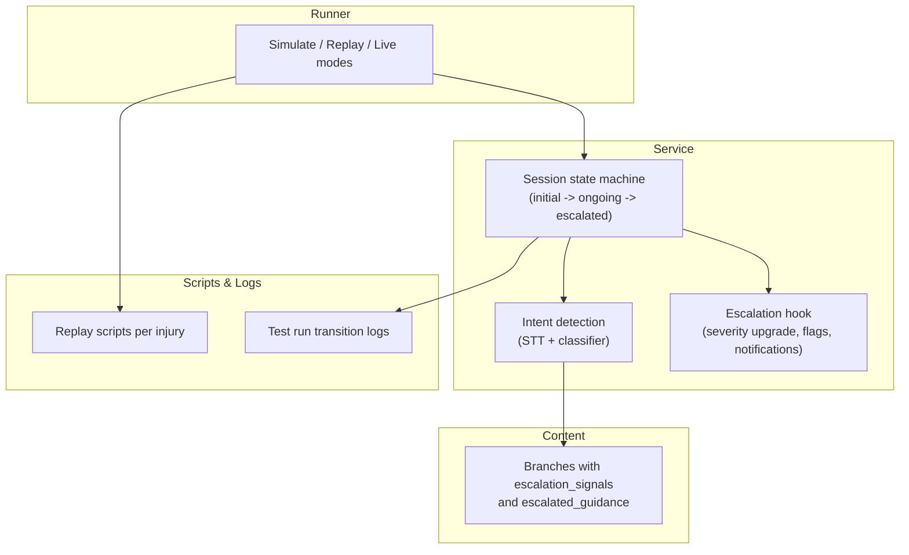
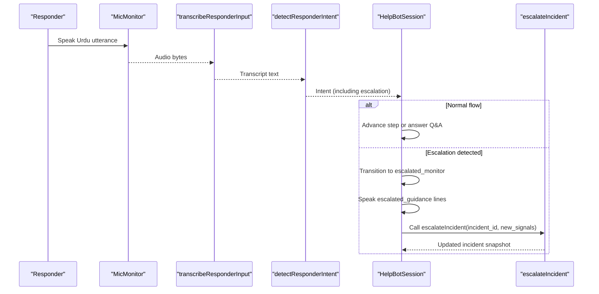
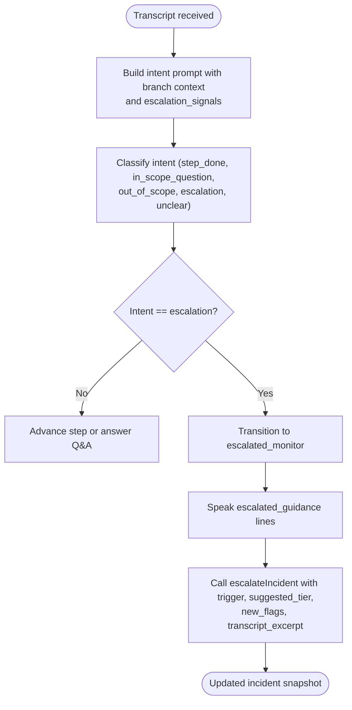
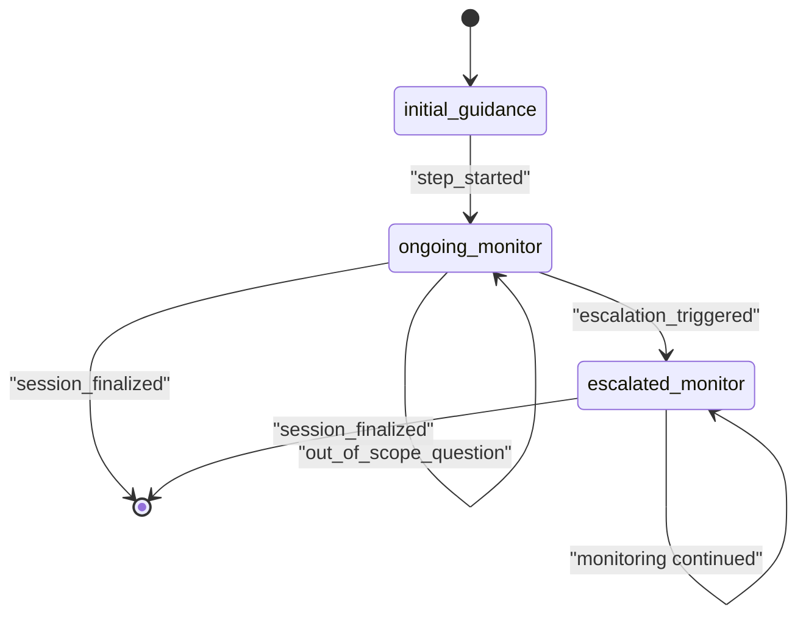
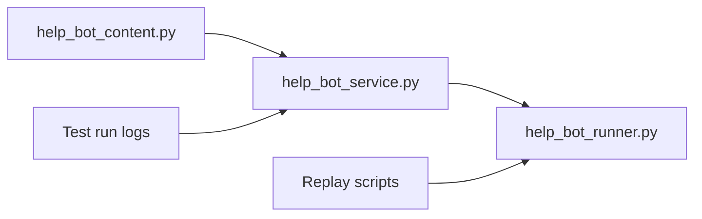

# Escalation Trigger System

<cite>
**Referenced Files in This Document**
- [help_bot_content.py](file://backend/services/help_bot_content.py)
- [help_bot_service.py](file://backend/services/help_bot_service.py)
- [help_bot_runner.py](file://backend/help_bot_runner.py)
- [heavy_bleeding.json](file://mockdata/helpbot/scripts/heavy_bleeding.json)
- [fracture_crush.json](file://mockdata/helpbot/scripts/fracture_crush.json)
- [snakebite.json](file://mockdata/helpbot/scripts/snakebite.json)
- [INC-SIM-HEAVY-BLEEDING_replay_1788076550.json](file://mockdata/helpbot/test_runs/INC-SIM-HEAVY-BLEEDING_replay_1788076550.json)
- [INC-SIM-FRACTURE-CRUSH_replay_1788079070.json](file://mockdata/helpbot/test_runs/INC-SIM-FRACTURE-CRUSH_replay_1788079070.json)
- [INC-SIM-SNAKEBITE_replay_1788080732.json](file://mockdata/helpbot/test_runs/INC-SIM-SNAKEBITE_replay_1788080732.json)
</cite>

## Table of Contents
1. [Introduction](#introduction)
2. [Project Structure](#project-structure)
3. [Core Components](#core-components)
4. [Architecture Overview](#architecture-overview)
5. [Detailed Component Analysis](#detailed-component-analysis)
6. [Dependency Analysis](#dependency-analysis)
7. [Performance Considerations](#performance-considerations)
8. [Troubleshooting Guide](#troubleshooting-guide)
9. [Conclusion](#conclusion)

## Introduction
This document explains the escalation trigger system that monitors a patient’s condition during first-aid guidance and automatically upgrades response severity when deterioration is detected. The system uses Urdu-language escalation signals to detect worsening conditions, transitions from standard first-aid instructions to emergency escalation pathways, and triggers automated actions such as requesting additional medical support and providing advanced intervention guidance.

The escalation logic is driven by:
- Branch-specific escalation signal arrays containing Urdu phrases indicating deterioration (for example, uncontrolled bleeding, unconsciousness, breathing difficulty).
- An intent classifier that maps responder utterances into intents including escalation detection.
- A session state machine that moves from normal branch progression to an escalated monitoring mode and calls an escalation hook to upgrade severity and record events.

## Project Structure
The escalation trigger system spans content definitions, conversation engine logic, runner orchestration, and test scripts:
- Content definitions define branches, steps, Q&A, escalation signals, and escalated guidance.
- The service layer implements STT, intent classification, TTS, session state management, and the escalation hook.
- The runner orchestrates simulated or live sessions and can pre-warm TTS cache for deterministic runs.
- Mock scripts define expected turn sequences including escalation scenarios per injury type.
- Test run logs show real transitions and escalation events captured during replay runs.

**Diagram sources**
- [help_bot_content.py:46-254](file://backend/services/help_bot_content.py#L46-L254)
- [help_bot_service.py:663-874](file://backend/services/help_bot_service.py#L663-L874)
- [help_bot_runner.py:175-236](file://backend/help_bot_runner.py#L175-L236)
- [heavy_bleeding.json:1-11](file://mockdata/helpbot/scripts/heavy_bleeding.json#L1-L11)
- [INC-SIM-HEAVY-BLEEDING_replay_1788076550.json:323-356](file://mockdata/helpbot/test_runs/INC-SIM-HEAVY-BLEEDING_replay_1788076550.json#L323-L356)

**Section sources**
- [help_bot_content.py:46-254](file://backend/services/help_bot_content.py#L46-L254)
- [help_bot_service.py:663-874](file://backend/services/help_bot_service.py#L663-L874)
- [help_bot_runner.py:175-236](file://backend/help_bot_runner.py#L175-L236)
- [heavy_bleeding.json:1-11](file://mockdata/helpbot/scripts/heavy_bleeding.json#L1-L11)
- [INC-SIM-HEAVY-BLEEDING_replay_1788076550.json:323-356](file://mockdata/helpbot/test_runs/INC-SIM-HEAVY-BLEEDING_replay_1788076550.json#L323-L356)

## Core Components
- Branch definitions with escalation signals and escalated guidance: Each injury branch defines Urdu phrases that indicate deterioration and the corresponding emergency guidance to speak when escalation is triggered.
- Intent detection pipeline: Converts audio to text, then classifies intent including escalation detection using branch context and escalation signals.
- Session state machine: Moves from initial guidance to ongoing monitoring; on escalation, transitions to escalated monitoring and speaks branch-specific escalated guidance.
- Escalation hook: Upgrades severity tier, merges new injury flags, marks BHU notification and ambulance request when critical, and records timestamped transition events.

Key responsibilities:
- Detecting escalation signals from Urdu utterances.
- Transitioning to emergency escalation pathways.
- Providing advanced intervention instructions via escalated guidance.
- Automating dispatch-related actions through incident record updates.

**Section sources**
- [help_bot_content.py:107-118](file://backend/services/help_bot_content.py#L107-L118)
- [help_bot_content.py:171-181](file://backend/services/help_bot_content.py#L171-L181)
- [help_bot_content.py:242-252](file://backend/services/help_bot_content.py#L242-L252)
- [help_bot_service.py:174-213](file://backend/services/help_bot_service.py#L174-L213)
- [help_bot_service.py:576-647](file://backend/services/help_bot_service.py#L576-L647)
- [help_bot_service.py:833-874](file://backend/services/help_bot_service.py#L833-L874)

## Architecture Overview
The escalation trigger system integrates voice input, intent classification, scripted guidance, and incident escalation:

**Diagram sources**
- [help_bot_service.py:159-167](file://backend/services/help_bot_service.py#L159-L167)
- [help_bot_service.py:274-288](file://backend/services/help_bot_service.py#L274-L288)
- [help_bot_service.py:833-874](file://backend/services/help_bot_service.py#L833-L874)
- [help_bot_service.py:576-647](file://backend/services/help_bot_service.py#L576-L647)

## Detailed Component Analysis

### Escalation Signals and Branch Mapping
Each branch defines:
- Escalation signals: Urdu phrases indicating worsening conditions.
- Escalated guidance: Emergency instructions to speak when escalation is detected.

Examples:
- Heavy bleeding branch includes signals for uncontrolled bleeding, increasing blood loss, unconsciousness, dizziness, and breathing difficulty. When triggered, it instructs calling for additional medical support, applying tourniquet-like pressure above the wound, and positioning an unconscious patient while monitoring breathing.
- Fracture/crush branch includes signals for unconsciousness, breathing difficulty, exposed bone, and heavy bleeding. Escalated guidance emphasizes immobilization, avoiding pushing back protruding bone, covering wounds, and monitoring breathing if unconscious.
- Snakebite branch includes signals for breathing difficulty, unconsciousness, rapidly increasing swelling, and vomiting. Escalated guidance instructs loosening tight clothing around neck/chest, keeping the patient still, and continuous breathing monitoring.

These signals are injected into the intent classifier prompt so the model can classify “escalation” based on the responder’s latest utterance within the current branch context.

**Section sources**
- [help_bot_content.py:107-118](file://backend/services/help_bot_content.py#L107-L118)
- [help_bot_content.py:171-181](file://backend/services/help_bot_content.py#L171-L181)
- [help_bot_content.py:242-252](file://backend/services/help_bot_content.py#L242-L252)
- [help_bot_service.py:200-213](file://backend/services/help_bot_service.py#L200-L213)

### Intent Detection and Escalation Classification
The intent detection pipeline builds a prompt that includes:
- Current branch title and ID.
- Current step line.
- In-scope Q&A entries for the branch.
- Escalation signals for the branch.
- Recent conversation context.

The classifier returns a strict schema including intent, optional QA entry ID, escalation signal label, suggested tier, and reason. If the intent is “escalation,” the session transitions to escalated monitoring and speaks the branch’s escalated guidance before calling the escalation hook.

**Diagram sources**
- [help_bot_service.py:174-213](file://backend/services/help_bot_service.py#L174-L213)
- [help_bot_service.py:274-288](file://backend/services/help_bot_service.py#L274-L288)
- [help_bot_service.py:833-874](file://backend/services/help_bot_service.py#L833-L874)

**Section sources**
- [help_bot_service.py:174-213](file://backend/services/help_bot_service.py#L174-L213)
- [help_bot_service.py:274-288](file://backend/services/help_bot_service.py#L274-L288)
- [help_bot_service.py:833-874](file://backend/services/help_bot_service.py#L833-L874)

### Session State Machine and Escalation Pathways
The HelpBotSession manages states:
- initial_guidance: Delivers branch introduction and first steps.
- ongoing_monitor: Advances through scripted steps and answers in-scope questions.
- escalated_monitor: Activated when escalation is detected; speaks escalated guidance and calls the escalation hook.

When escalation is detected:
- The session transitions to escalated_monitor.
- It speaks all escalated_guidance lines for the branch.
- It calls escalateIncident with a structured payload including trigger, suggested tier, new flags, and transcript excerpt.
- The incident record is updated with severity tier upgrade, new flags, BHU notification flag, and ambulance request if critical.

**Diagram sources**
- [help_bot_service.py:663-711](file://backend/services/help_bot_service.py#L663-L711)
- [help_bot_service.py:760-783](file://backend/services/help_bot_service.py#L760-L783)
- [help_bot_service.py:833-874](file://backend/services/help_bot_service.py#L833-L874)

**Section sources**
- [help_bot_service.py:663-711](file://backend/services/help_bot_service.py#L663-L711)
- [help_bot_service.py:760-783](file://backend/services/help_bot_service.py#L760-L783)
- [help_bot_service.py:833-874](file://backend/services/help_bot_service.py#L833-L874)

### Escalation Hook Actions
The escalation hook performs:
- Severity tier upgrade (monotonic, never downgrades).
- Merging new injury flags.
- Marking BHU notification and setting ambulance request when severity becomes critical.
- Appending a timestamped event to help_bot_transitions with trigger details and transcript excerpt.
- Syncing the INCIDENT_STORE snapshot for auditability.

Automated actions include:
- Requesting additional medical support (via BHU notification flag).
- Requesting ambulance when critical.
- Recording escalation events for later review.

**Section sources**
- [help_bot_service.py:576-647](file://backend/services/help_bot_service.py#L576-L647)

### Escalation Scenarios by Injury Type
Heavy bleeding:
- Normal progression: Apply direct pressure, elevate limb, add cloth without removing soaked one.
- Escalation signals: Uncontrolled bleeding, increasing blood loss, unconsciousness, dizziness, breathing difficulty.
- Automated actions: Speak urgent alert, instruct tourniquet-like pressure above wound, position unconscious patient, call for additional support, mark ambulance request if critical.

Fracture/crush:
- Normal progression: Immobilize, cover open wound gently, splint with available materials.
- Escalation signals: Unconsciousness, breathing difficulty, exposed bone, heavy bleeding.
- Automated actions: Emphasize no movement, do not push back bone, cover wound, monitor breathing, call for additional support, mark ambulance request if critical.

Snakebite:
- Normal progression: Keep patient still, remove constriction near bite, avoid harmful remedies.
- Escalation signals: Breathing difficulty, unconsciousness, rapidly increasing swelling, vomiting.
- Automated actions: Loosen tight clothing around neck/chest, keep patient still, continuous breathing monitoring, call for additional support, mark ambulance request if critical.

These scenarios are validated by replay scripts and test run logs showing escalation transitions and recorded events.

**Section sources**
- [help_bot_content.py:107-118](file://backend/services/help_bot_content.py#L107-L118)
- [help_bot_content.py:171-181](file://backend/services/help_bot_content.py#L171-L181)
- [help_bot_content.py:242-252](file://backend/services/help_bot_content.py#L242-L252)
- [heavy_bleeding.json:1-11](file://mockdata/helpbot/scripts/heavy_bleeding.json#L1-L11)
- [fracture_crush.json:1-11](file://mockdata/helpbot/scripts/fracture_crush.json#L1-L11)
- [snakebite.json:1-11](file://mockdata/helpbot/scripts/snakebite.json#L1-L11)
- [INC-SIM-HEAVY-BLEEDING_replay_1788076550.json:323-356](file://mockdata/helpbot/test_runs/INC-SIM-HEAVY-BLEEDING_replay_1788076550.json#L323-L356)
- [INC-SIM-FRACTURE-CRUSH_replay_1788079070.json:329-362](file://mockdata/helpbot/test_runs/INC-SIM-FRACTURE-CRUSH_replay_1788079070.json#L329-L362)
- [INC-SIM-SNAKEBITE_replay_1788080732.json:346-369](file://mockdata/helpbot/test_runs/INC-SIM-SNAKEBITE_replay_1788080732.json#L346-L369)

## Dependency Analysis
The escalation system depends on:
- Content module for branch definitions, escalation signals, and escalated guidance.
- Service module for STT, intent classification, TTS, session state, and escalation hook.
- Runner module for orchestration, simulation, and TTS prewarming.
- Scripts and logs for testing and verification of escalation behavior.

**Diagram sources**
- [help_bot_content.py:46-254](file://backend/services/help_bot_content.py#L46-L254)
- [help_bot_service.py:663-874](file://backend/services/help_bot_service.py#L663-L874)
- [help_bot_runner.py:175-236](file://backend/help_bot_runner.py#L175-L236)

**Section sources**
- [help_bot_content.py:46-254](file://backend/services/help_bot_content.py#L46-L254)
- [help_bot_service.py:663-874](file://backend/services/help_bot_service.py#L663-L874)
- [help_bot_runner.py:175-236](file://backend/help_bot_runner.py#L175-L236)

## Performance Considerations
- TTS caching reduces latency and quota usage; prewarming ensures deterministic replay runs.
- Intent detection uses lightweight prompts with branch context and escalation signals to minimize processing time.
- VAD-based capture and barge-in detection optimize responsiveness in live mode.
- Escalation events are appended efficiently to incident records and synced to store snapshots for auditability.

[No sources needed since this section provides general guidance]

## Troubleshooting Guide
Common issues and resolutions:
- STT failures: The system falls back to a failsafe line and continues the loop; ensure audio stack availability and proper microphone calibration.
- Intent classification errors: Non-JSON responses are handled; the system defaults to “unclear” and speaks the failsafe line.
- Escalation not triggering: Verify that Urdu escalation signals match branch definitions and that the intent classifier receives correct branch context and recent conversation.
- Missing escalation events: Check help_bot_transitions in test run logs to confirm escalation_triggered and escalateIncident events were recorded.

**Section sources**
- [help_bot_service.py:689-757](file://backend/services/help_bot_service.py#L689-L757)
- [help_bot_service.py:870-874](file://backend/services/help_bot_service.py#L870-L874)
- [INC-SIM-HEAVY-BLEEDING_replay_1788076550.json:323-356](file://mockdata/helpbot/test_runs/INC-SIM-HEAVY-BLEEDING_replay_1788076550.json#L323-L356)
- [INC-SIM-FRACTURE-CRUSH_replay_1788079070.json:329-362](file://mockdata/helpbot/test_runs/INC-SIM-FRACTURE-CRUSH_replay_1788079070.json#L329-L362)
- [INC-SIM-SNAKEBITE_replay_1788080732.json:346-369](file://mockdata/helpbot/test_runs/INC-SIM-SNAKEBITE_replay_1788080732.json#L346-L369)

## Conclusion
The escalation trigger system provides robust, voice-first first-aid guidance with automatic escalation when patient deterioration is detected. By leveraging Urdu escalation signals, intent classification, and a clear session state machine, the system transitions from standard first-aid instructions to critical care guidance and triggers automated actions such as requesting additional medical support and ambulance services. Replay scripts and test run logs validate the behavior across injury types, ensuring reliable escalation pathways in emergency scenarios.

[No sources needed since this section summarizes without analyzing specific files]