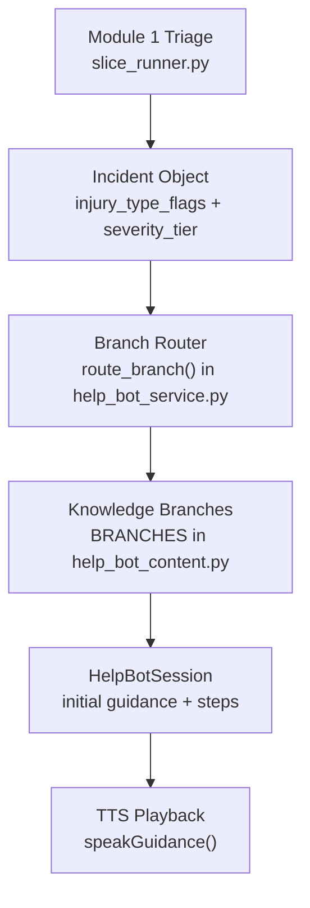
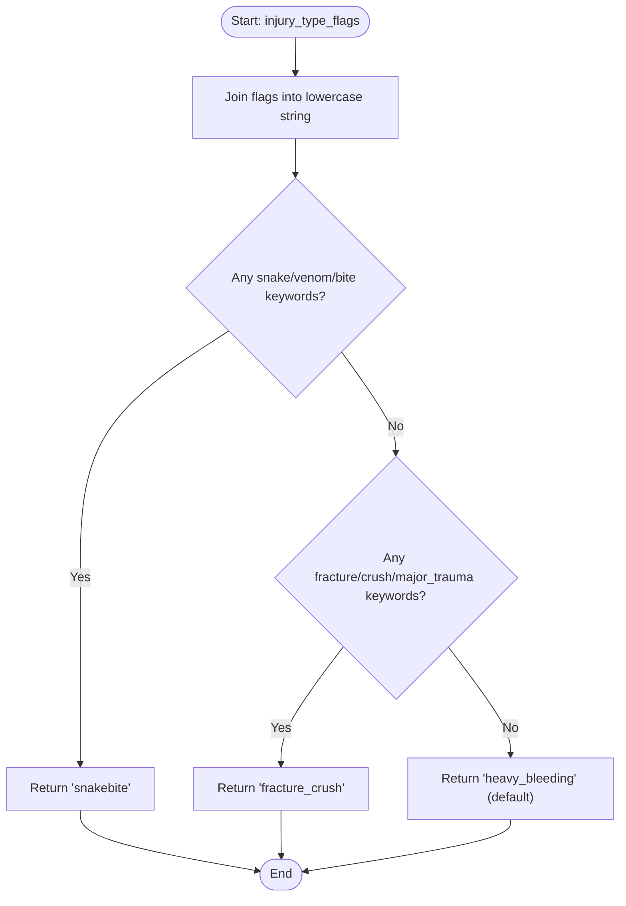
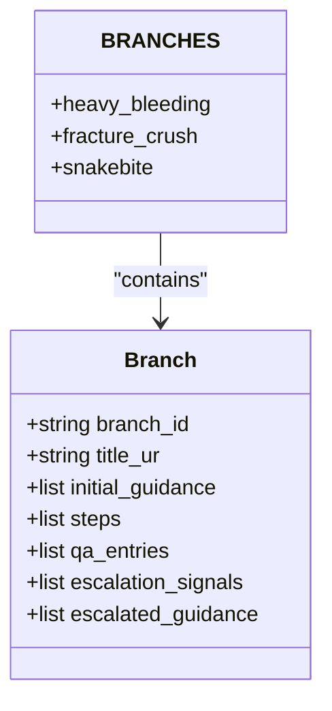
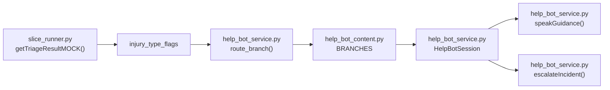

# Keyword-Based Routing Mechanism

<cite>
**Referenced Files in This Document**
- [help_bot_service.py](file://backend/services/help_bot_service.py)
- [help_bot_content.py](file://backend/services/help_bot_content.py)
- [help_bot_runner.py](file://backend/help_bot_runner.py)
- [slice_runner.py](file://backend/slice_runner.py)
- [heavy_bleeding.json](file://mockdata/helpbot/scripts/heavy_bleeding.json)
- [fracture_crush.json](file://mockdata/helpbot/scripts/fracture_crush.json)
- [snakebite.json](file://mockdata/helpbot/scripts/snakebite.json)
</cite>

## Table of Contents
1. Introduction
2. Project Structure
3. Core Components
4. Architecture Overview
5. Detailed Component Analysis
6. Dependency Analysis
7. Performance Considerations
8. Troubleshooting Guide
9. Conclusion

## Introduction
This document explains the keyword-based routing mechanism that maps incident flags produced by Module 1’s triage system to specific medical guidance branches in Module 2’s Responder AI Help Bot. It details how injury types are identified through flag matching, how responders are routed to appropriate guidance protocols, and how the system handles fallback when no match is found. It also clarifies the relationship between Module 1’s incident classification and Module 2’s branch selection, including how flags such as machine_entanglement, venomous_snake_bite, and major_trauma map to corresponding medical guidance paths.

## Project Structure
The routing mechanism spans two modules:
- Module 1 (triage): Produces structured incidents with severity tiers and injury_type_flags from voice and image inputs.
- Module 2 (help bot): Consumes those flags to select a knowledge branch containing scripted Urdu guidance steps, Q&A, and escalation instructions.



**Diagram sources**
- [slice_runner.py:520-586](file://backend/slice_runner.py#L520-L586)
- [help_bot_service.py:94-116](file://backend/services/help_bot_service.py#L94-L116)
- [help_bot_content.py:46-254](file://backend/services/help_bot_content.py#L46-L254)

**Section sources**
- [slice_runner.py:520-586](file://backend/slice_runner.py#L520-L586)
- [help_bot_service.py:94-116](file://backend/services/help_bot_service.py#L94-L116)
- [help_bot_content.py:46-254](file://backend/services/help_bot_content.py#L46-L254)

## Core Components
- Incident classification and flag generation: The triage pipeline produces severity_tier and injury_type_flags for each incident.
- Branch router: Maps injury_type_flags to a branch id using keyword sets.
- Knowledge branches: Hardcoded Urdu guidance content per injury type, including initial guidance, ordered steps, Q&A entries, escalation signals, and escalated guidance.
- Session orchestration: Initializes a HelpBotSession, routes to a branch, delivers initial guidance, advances steps, and handles intents and escalations.

Key responsibilities:
- slice_runner.py: Triaging, dispatching, logging, and building incidents with flags.
- help_bot_service.py: Branch routing, session lifecycle, STT/intent/TTS boundaries, escalation hook.
- help_bot_content.py: Branch definitions and shared lines used across all branches.

**Section sources**
- [slice_runner.py:170-188](file://backend/slice_runner.py#L170-L188)
- [slice_runner.py:520-586](file://backend/slice_runner.py#L520-L586)
- [help_bot_service.py:94-116](file://backend/services/help_bot_service.py#L94-L116)
- [help_bot_content.py:21-43](file://backend/services/help_bot_content.py#L21-L43)
- [help_bot_content.py:46-254](file://backend/services/help_bot_content.py#L46-L254)

## Architecture Overview
The routing architecture connects Module 1 outputs to Module 2 guidance via deterministic keyword matching on flags.

```mermaid
sequenceDiagram
participant M1 as "Module 1 Triage"
participant Sess as "HelpBotSession"
participant Route as "route_branch()"
participant Branch as "BRANCHES"
participant TTS as "speakGuidance()"
M1->>Sess : Incident(injury_type_flags, severity_tier)
Sess->>Route : route_branch(flags)
Route-->>Sess : (branch_id, matched)
Sess->>Branch : Load branch content
Sess->>TTS : Render initial guidance lines
TTS-->>Sess : Audio bytes / cached path
Sess-->>M1 : Guidance delivered; step loop begins
```

**Diagram sources**
- [help_bot_service.py:663-685](file://backend/services/help_bot_service.py#L663-L685)
- [help_bot_service.py:94-116](file://backend/services/help_bot_service.py#L94-L116)
- [help_bot_content.py:46-254](file://backend/services/help_bot_content.py#L46-L254)
- [help_bot_service.py:368-387](file://backend/services/help_bot_service.py#L368-L387)

## Detailed Component Analysis

### Branch Router: Keyword Matching on Flags
The router converts the list of injury_type_flags into a single lowercase string and checks it against ordered keyword sets. Order matters because the first match wins. If no keywords match, the system falls back to a safe default branch.

- Priority order: snakebite → fracture_crush → heavy_bleeding
- Keywords include English terms, transliterations, and Urdu script variants
- Default branch: heavy_bleeding (pressure-first guidance is safest when uncertain)



**Diagram sources**
- [help_bot_service.py:94-116](file://backend/services/help_bot_service.py#L94-L116)

**Section sources**
- [help_bot_service.py:94-116](file://backend/services/help_bot_service.py#L94-L116)

### Knowledge Branches: Content and Flow
Each branch defines:
- Title and initial guidance lines
- Ordered steps with completion prompts
- Q&A entries with hints and answers
- Escalation signals and escalated guidance lines
- Shared lines for fail-safe, out-of-scope responses, check-ins, and session completion



**Diagram sources**
- [help_bot_content.py:46-254](file://backend/services/help_bot_content.py#L46-L254)

**Section sources**
- [help_bot_content.py:46-254](file://backend/services/help_bot_content.py#L46-L254)

### Session Orchestration: From Flags to Guidance
The HelpBotSession initializes with an incident, routes to a branch, logs transitions, and delivers initial guidance followed by step-by-step instructions. It records turns, latencies, and expectations during replay runs.

```mermaid
sequenceDiagram
participant Runner as "help_bot_runner.py"
participant Service as "HelpBotSession"
participant Route as "route_branch()"
participant Branch as "BRANCHES"
participant TTS as "speakGuidance()"
Runner->>Service : new HelpBotSession(incident)
Service->>Route : route_branch(flags)
Route-->>Service : (branch_id, matched)
Service->>Branch : load branch content
Service->>TTS : render initial guidance
TTS-->>Service : audio or cache hit
Service-->>Runner : session started; steps begin
```

**Diagram sources**
- [help_bot_runner.py:74-89](file://backend/help_bot_runner.py#L74-L89)
- [help_bot_service.py:663-685](file://backend/services/help_bot_service.py#L663-L685)
- [help_bot_service.py:94-116](file://backend/services/help_bot_service.py#L94-L116)
- [help_bot_service.py:368-387](file://backend/services/help_bot_service.py#L368-L387)

**Section sources**
- [help_bot_runner.py:74-89](file://backend/help_bot_runner.py#L74-L89)
- [help_bot_service.py:663-685](file://backend/services/help_bot_service.py#L663-L685)

### Module 1 to Module 2 Mapping: Flag-to-Branch Examples
The following examples show how Module 1’s flags map to Module 2’s branches and subsequent guidance paths.

- Heavy bleeding scenario
  - Flags: machine_entanglement, heavy_bleeding, traumatic_amputation
  - Matched branch: heavy_bleeding
  - Guidance path: direct pressure, elevation, add cloth over soaked cloth, Q&A on cloth soaking and pressure intensity, escalation if bleeding worsens or patient becomes unconscious

- Fracture/crush scenario
  - Flags: heavy_bleeding, major_trauma, deep_open_wound
  - Matched branch: fracture_crush
  - Guidance path: immobilize as-found, cover wound without pressing bone, improvise splint, Q&A on splint alternatives and food/water restrictions, escalation if exposed bone or consciousness drops

- Snakebite scenario
  - Flags: venomous_snake_bite, puncture_wounds
  - Matched branch: snakebite
  - Guidance path: keep still, remove rings/watch, do not cut/suck/tie above bite, Q&A on tying cloth and washing wound, escalation for breathing difficulty

These mappings are verified by the runner’s simulated flags and the content comments linking real Module 1 flags to branches.

**Section sources**
- [help_bot_runner.py:46-61](file://backend/help_bot_runner.py#L46-L61)
- [help_bot_content.py:46-254](file://backend/services/help_bot_content.py#L46-L254)

### Fallback Mechanisms
When no keywords match the flags, the router returns the default branch heavy_bleeding and marks the match as False. The session logs a warning indicating branch_unmatched and proceeds with pressure-first guidance, which is the safest default in emergencies.

Additionally, if any AI call fails (STT, intent detection, TTS), the system uses pre-rendered fail-safe lines to avoid silence and ensure continuous guidance.

**Section sources**
- [help_bot_service.py:94-116](file://backend/services/help_bot_service.py#L94-L116)
- [help_bot_service.py:689-694](file://backend/services/help_bot_service.py#L689-L694)
- [help_bot_service.py:727-750](file://backend/services/help_bot_service.py#L727-L750)
- [help_bot_content.py:21-43](file://backend/services/help_bot_content.py#L21-L43)

## Dependency Analysis
The routing mechanism depends on:
- Module 1’s triage output (flags and tier)
- The router’s keyword sets and priority order
- The knowledge branches’ content structure
- TTS caching and playback utilities
- Intent detection and escalation hooks for dynamic adjustments



**Diagram sources**
- [slice_runner.py:520-586](file://backend/slice_runner.py#L520-L586)
- [help_bot_service.py:94-116](file://backend/services/help_bot_service.py#L94-L116)
- [help_bot_content.py:46-254](file://backend/services/help_bot_content.py#L46-L254)
- [help_bot_service.py:576-647](file://backend/services/help_bot_service.py#L576-L647)

**Section sources**
- [slice_runner.py:520-586](file://backend/slice_runner.py#L520-L586)
- [help_bot_service.py:94-116](file://backend/services/help_bot_service.py#L94-L116)
- [help_bot_content.py:46-254](file://backend/services/help_bot_content.py#L46-L254)
- [help_bot_service.py:576-647](file://backend/services/help_bot_service.py#L576-L647)

## Performance Considerations
- Deterministic routing: Keyword matching is O(k) per branch where k is the number of keywords; total cost is linear in the number of branches and keywords.
- TTS caching: Pre-rendered audio avoids repeated API calls and reduces latency; cache hits are immediate.
- Provider boundaries: STT and intent detection are isolated behind provider switches; failures fall back to safe defaults without blocking the flow.
- Replay mode: Deterministic scripts enable fast verification without live audio hardware.

[No sources needed since this section provides general guidance]

## Troubleshooting Guide
Common issues and resolutions:
- No branch matched: Indicates flags did not contain expected keywords; system defaults to heavy_bleeding. Review Module 1’s classifier output and consider adding relevant keywords if necessary.
- TTS quota exhaustion: Use prewarm-tts to render all scripted lines into cache before replay runs; verify-tts can validate spoken Urdu round-trips.
- Intent detection failures: System returns “unclear” and continues with scripted guidance; ensure transcripts are usable and context is provided.
- Escalation mid-session: Use escalateIncident to upgrade tier, merge new flags, and log events; ensure incident_id exists in active sessions or INCIDENT_STORE.

**Section sources**
- [help_bot_service.py:94-116](file://backend/services/help_bot_service.py#L94-L116)
- [help_bot_runner.py:102-132](file://backend/help_bot_runner.py#L102-L132)
- [help_bot_runner.py:135-172](file://backend/help_bot_runner.py#L135-L172)
- [help_bot_service.py:576-647](file://backend/services/help_bot_service.py#L576-L647)

## Conclusion
The keyword-based routing mechanism reliably maps Module 1’s incident flags to Module 2’s medical guidance branches using a prioritized, deterministic keyword set. It ensures safe defaults when no match is found and integrates tightly with TTS caching, intent detection, and escalation hooks to provide continuous, scripted Urdu guidance to responders. The design maintains clear separation between triage classification and guidance delivery, enabling robust operation under varying conditions and provider constraints.

[No sources needed since this section summarizes without analyzing specific files]