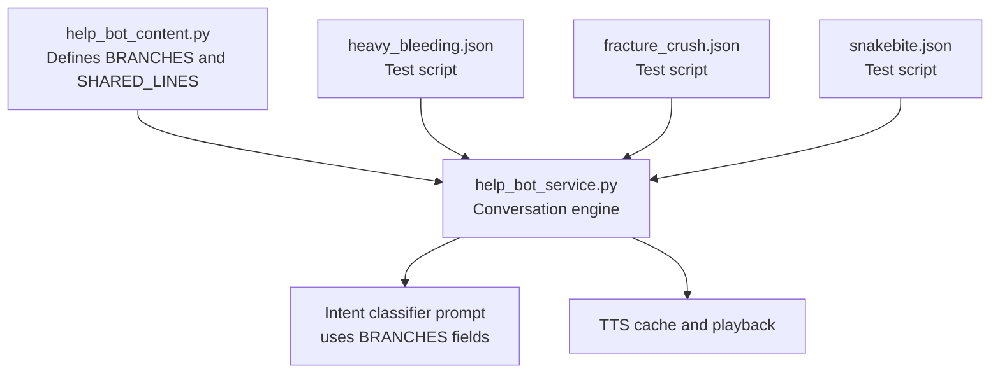
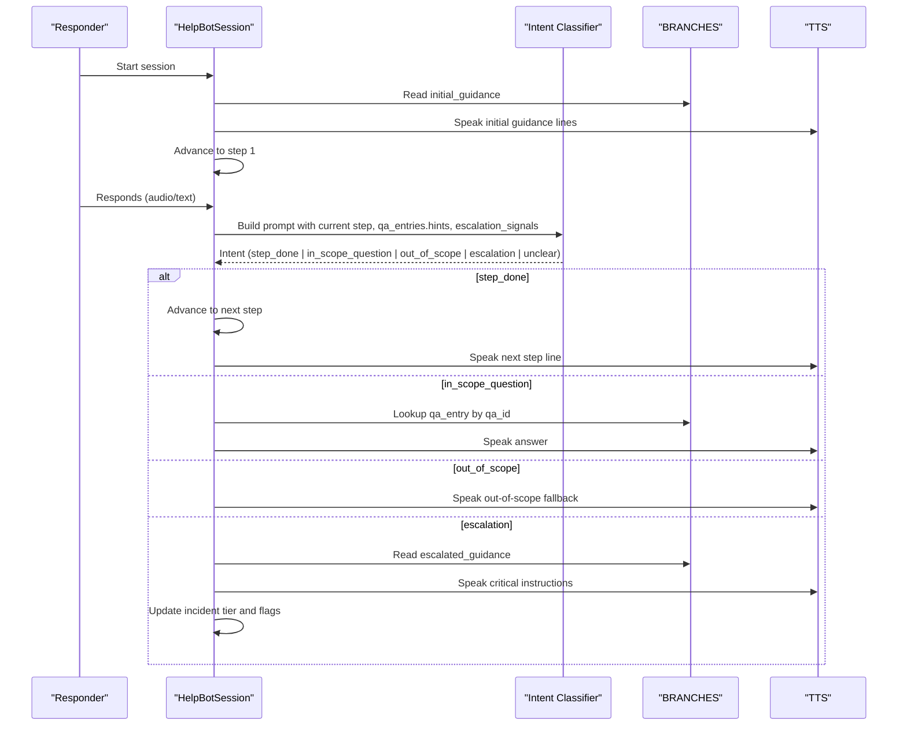
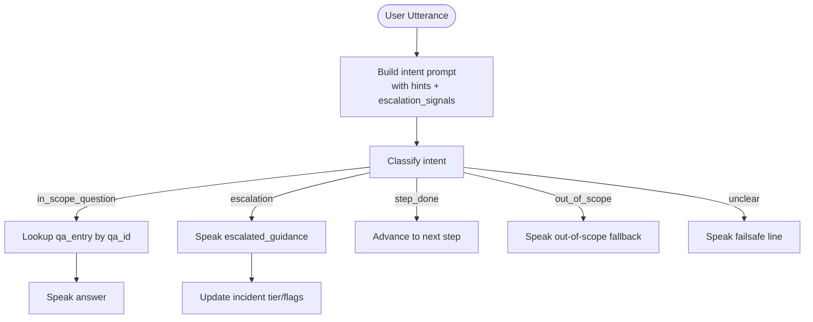
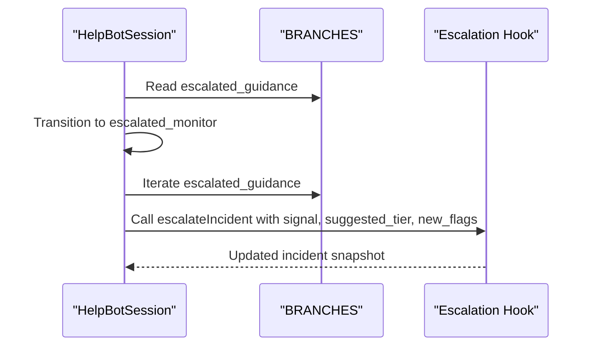
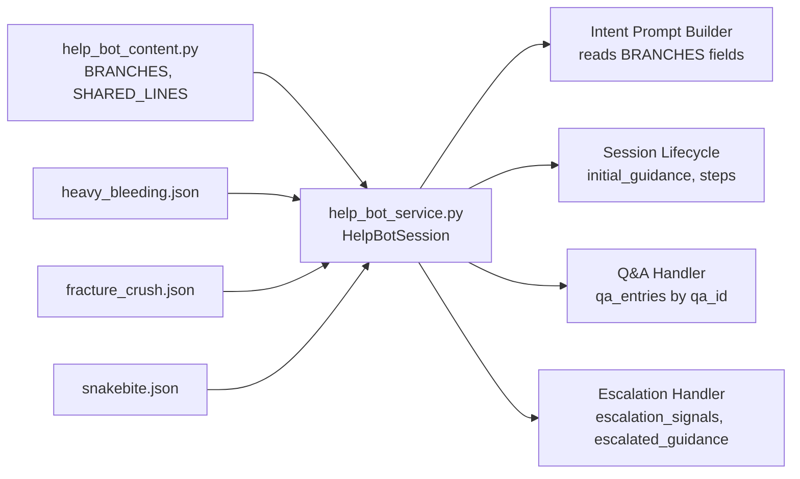

# Branch Data Structure

<cite>
**Referenced Files in This Document**
- [help_bot_content.py](file://backend/services/help_bot_content.py)
- [help_bot_service.py](file://backend/services/help_bot_service.py)
- [heavy_bleeding.json](file://mockdata/helpbot/scripts/heavy_bleeding.json)
- [fracture_crush.json](file://mockdata/helpbot/scripts/fracture_crush.json)
- [snakebite.json](file://mockdata/helpbot/scripts/snakebite.json)
</cite>

## Table of Contents
1. [Introduction](#introduction)
2. [Project Structure](#project-structure)
3. [Core Components](#core-components)
4. [Architecture Overview](#architecture-overview)
5. [Detailed Component Analysis](#detailed-component-analysis)
6. [Dependency Analysis](#dependency-analysis)
7. [Performance Considerations](#performance-considerations)
8. [Troubleshooting Guide](#troubleshooting-guide)
9. [Conclusion](#conclusion)

## Introduction
This document explains the BRANCHES data structure that defines each injury type’s medical guidance protocol for the Responder AI Help Bot. It details the standardized schema used across all branches, how the conversation engine consumes it, and how three specific branches implement specialized protocols while sharing a consistent format. You will learn:
- The canonical fields: branch_id, title_ur, initial_guidance, steps, qa_entries, escalation_signals, escalated_guidance
- How step sequences progress from basic to advanced interventions
- How hint matching works for intent recognition
- How escalation signals integrate with the conversation flow and incident records

## Project Structure
The BRANCHES definition lives in a dedicated content module and is consumed by the service layer that implements the voice-first conversation loop. Test scripts under mockdata define expected conversational flows for validation.

**Diagram sources**
- [help_bot_content.py:46-254](file://backend/services/help_bot_content.py#L46-L254)
- [help_bot_service.py:44-47](file://backend/services/help_bot_service.py#L44-L47)
- [help_bot_service.py:199-213](file://backend/services/help_bot_service.py#L199-L213)
- [heavy_bleeding.json:1-10](file://mockdata/helpbot/scripts/heavy_bleeding.json#L1-L10)
- [fracture_crush.json:1-10](file://mockdata/helpbot/scripts/fracture_crush.json#L1-L10)
- [snakebite.json:1-10](file://mockdata/helpbot/scripts/snakebite.json#L1-L10)

**Section sources**
- [help_bot_content.py:21-43](file://backend/services/help_bot_content.py#L21-L43)
- [help_bot_content.py:46-254](file://backend/services/help_bot_content.py#L46-L254)
- [help_bot_service.py:44-47](file://backend/services/help_bot_service.py#L44-L47)

## Core Components
BRANCHES is a dictionary keyed by branch_id. Each branch defines a uniform set of fields that drive the bot’s behavior:

- branch_id: Unique identifier for the injury scenario (e.g., heavy_bleeding, fracture_crush, snakebite). Used as the lookup key and routing target.
- title_ur: Urdu display name for the branch; included in prompts so the classifier understands context.
- initial_guidance: Array of immediate instructions spoken at session start before any step-by-step guidance begins.
- steps: Ordered array of first-aid procedures. Each step has:
  - step_id: Stable ID for the step (used in logs and transitions).
  - line: Urdu instruction text spoken to the responder.
- qa_entries: Array of Q&A entries for common responder questions. Each entry has:
  - qa_id: Stable identifier for the question/answer pair.
  - hints: Array of keyword triggers (Urdu phrases or words) that indicate this answer applies.
  - answer: Urdu response text spoken when matched.
- escalation_signals: Array of keyword phrases indicating deterioration; when detected, the bot switches to emergency mode.
- escalated_guidance: Array of critical-situation instructions spoken after escalation is triggered.

How the service uses these fields:
- Routing selects a branch based on incident flags and keywords; default is heavy_bleeding if no match.
- On session start, the bot speaks initial_guidance then advances to the first step.
- For each user turn, the bot builds an intent classification prompt that includes:
  - Current step line (if any)
  - All qa_entries with their qa_id and hints
  - All escalation_signals for the active branch
- Based on the classified intent, the bot either advances steps, answers in-scope questions, falls back to out-of-scope guidance, or escalates.

**Section sources**
- [help_bot_content.py:46-254](file://backend/services/help_bot_content.py#L46-L254)
- [help_bot_service.py:99-116](file://backend/services/help_bot_service.py#L99-L116)
- [help_bot_service.py:199-213](file://backend/services/help_bot_service.py#L199-L213)
- [help_bot_service.py:663-685](file://backend/services/help_bot_service.py#L663-L685)
- [help_bot_service.py:760-783](file://backend/services/help_bot_service.py#L760-L783)
- [help_bot_service.py:786-874](file://backend/services/help_bot_service.py#L786-L874)

## Architecture Overview
The conversation engine orchestrates a stateful loop:
- Enter branch: speak initial_guidance, then step 1
- Listen: STT -> Intent detection using BRANCHES context
- Act: advance step, answer QA, fallback, or escalate
- Escalate: speak escalated_guidance and update incident record

**Diagram sources**
- [help_bot_service.py:663-685](file://backend/services/help_bot_service.py#L663-L685)
- [help_bot_service.py:760-783](file://backend/services/help_bot_service.py#L760-L783)
- [help_bot_service.py:786-874](file://backend/services/help_bot_service.py#L786-L874)
- [help_bot_content.py:46-254](file://backend/services/help_bot_content.py#L46-L254)

## Detailed Component Analysis

### Standardized BRANCH Schema
Each branch follows the same structure:
- branch_id: String key used for routing and logging
- title_ur: Human-readable Urdu title
- initial_guidance: One or more opening instructions
- steps: Ordered list of step objects with step_id and line
- qa_entries: List of Q&A objects with qa_id, hints, answer
- escalation_signals: Keywords/phrases that trigger emergency mode
- escalated_guidance: Critical instructions to speak after escalation

These fields are consumed by:
- Prompt construction for intent classification (current step, hints, escalation signals)
- Step advancement logic (steps array)
- Answer selection (qa_entries by qa_id)
- Escalation handling (escalation_signals and escalated_guidance)

**Section sources**
- [help_bot_content.py:46-254](file://backend/services/help_bot_content.py#L46-L254)
- [help_bot_service.py:199-213](file://backend/services/help_bot_service.py#L199-L213)
- [help_bot_service.py:771-783](file://backend/services/help_bot_service.py#L771-L783)
- [help_bot_service.py:841-868](file://backend/services/help_bot_service.py#L841-L868)

### Branch: heavy_bleeding
Specialization: Immediate pressure-based bleeding control, cloth management, elevation, and tourniquet guidance if uncontrolled.

Key elements:
- Initial guidance emphasizes calmness and direct pressure with a clean cloth
- Steps progress from direct pressure to elevation to adding another cloth without removing the soaked one
- Q&A covers common concerns like soaked cloth handling, pressure intensity, duration, and embedded objects
- Escalation signals include worsening bleeding, unconsciousness, dizziness, breathing difficulty
- Escalated guidance instructs to request additional help, apply a proper tourniquet above the wound (not over a joint), and manage unconsciousness safely

Progression example (conceptual):
- Start with initial guidance
- Step 1: Apply continuous direct pressure
- Step 2: Elevate limb if possible without releasing pressure
- Step 3: Add another cloth over soaked one without removing
- If responder asks about soaked cloth: answer via qa_entries
- If responder reports worsening bleeding or unconsciousness: escalate immediately

**Section sources**
- [help_bot_content.py:52-119](file://backend/services/help_bot_content.py#L52-L119)
- [heavy_bleeding.json:1-10](file://mockdata/helpbot/scripts/heavy_bleeding.json#L1-L10)

### Branch: fracture_crush
Specialization: Immobilization, wound covering without pressing on bone, splinting, and avoiding food/water or medications pre-op.

Key elements:
- Initial guidance stresses keeping the injured limb still and not forcing alignment
- Steps progress from immobilizing the patient, covering open wounds gently, to creating a splint
- Q&A addresses lack of splint material, worsening pain/circulation signs, and whether to give food/water/painkillers
- Escalation signals include unconsciousness, breathing difficulty, exposed bone, severe bleeding
- Escalated guidance emphasizes no movement, do not push bone back, cover exposed bone, and monitor breathing

Progression example (conceptual):
- Start with initial guidance
- Step 1: Lay patient down and keep limb completely still
- Step 2: Cover open wound with light pressure, avoid pressing on bone
- Step 3: Splint with available rigid material wrapped and secured above/below injury
- If responder asks about splint alternatives: answer via qa_entries
- If responder reports worsening pain or circulation issues: adjust advice per qa_entries
- If escalation signals appear: switch to escalated guidance and update incident

**Section sources**
- [help_bot_content.py:124-182](file://backend/services/help_bot_content.py#L124-L182)
- [fracture_crush.json:1-10](file://mockdata/helpbot/scripts/fracture_crush.json#L1-L10)

### Branch: snakebite
Specialization: Keep victim still, remove constrictions, avoid harmful remedies, and maintain airway monitoring.

Key elements:
- Initial guidance focuses on calming the patient, minimizing movement, and keeping the bitten area below heart level
- Steps progress from keeping the limb still, removing rings/bracelets/tight clothing near the bite, and explicitly avoiding harmful actions (cutting, sucking, tight bandages)
- Q&A warns against tying above the bite, gentle washing only, safe identification practices, and forbidding cutting/sucking
- Escalation signals include breathing difficulty, unconsciousness, rapidly increasing swelling, vomiting
- Escalated guidance prioritizes airway support, loosening tight clothing, continuous breathing checks, and immediate escalation

Progression example (conceptual):
- Start with initial guidance
- Step 1: Keep bitten limb completely still
- Step 2: Remove rings/bracelets/tight items near the bite
- Step 3: Avoid harmful remedies; only immobilize
- If responder asks about tying a bandage above the bite: answer via qa_entries (must say no)
- If escalation signals appear: switch to escalated guidance and update incident

**Section sources**
- [help_bot_content.py:187-253](file://backend/services/help_bot_content.py#L187-L253)
- [snakebite.json:1-10](file://mockdata/helpbot/scripts/snakebite.json#L1-L10)

### Intent Recognition and Hint Matching
The intent classifier receives a prompt that includes:
- Current step line (if any)
- All qa_entries with qa_id and hints
- All escalation_signals for the active branch
- Recent conversation context

When a responder’s utterance matches a qa_entry’s hints, the classifier returns intent in_scope_question with the corresponding qa_entry_id. The service then looks up the exact qa_id in the active branch and speaks the associated answer.

Flow:
- Build prompt with hints and escalation_signals
- Classify intent
- If in_scope_question, retrieve qa_entry by qa_id and speak answer
- If escalation, speak escalated_guidance and update incident

**Diagram sources**
- [help_bot_service.py:199-213](file://backend/services/help_bot_service.py#L199-L213)
- [help_bot_service.py:801-874](file://backend/services/help_bot_service.py#L801-L874)

**Section sources**
- [help_bot_service.py:199-213](file://backend/services/help_bot_service.py#L199-L213)
- [help_bot_service.py:801-874](file://backend/services/help_bot_service.py#L801-L874)

### Escalation Integration with Conversation Flow
When escalation is detected:
- The session transitions to escalated_monitor
- The bot speaks all escalated_guidance lines for the active branch
- The incident record is updated with suggested tier, new flags, BHU notification flag, and ambulance request if critical
- A transition event is appended to the incident log for auditability

**Diagram sources**
- [help_bot_service.py:855-868](file://backend/services/help_bot_service.py#L855-L868)
- [help_bot_service.py:576-647](file://backend/services/help_bot_service.py#L576-L647)

**Section sources**
- [help_bot_service.py:855-868](file://backend/services/help_bot_service.py#L855-L868)
- [help_bot_service.py:576-647](file://backend/services/help_bot_service.py#L576-L647)

## Dependency Analysis
- help_bot_service.py imports BRANCHES and SHARED_LINES from help_bot_content.py
- The intent prompt builder reads branch metadata and lists from BRANCHES
- Session lifecycle methods read initial_guidance, steps, qa_entries, escalation_signals, and escalated_guidance
- Test scripts in mockdata define expected intents for replay validation

**Diagram sources**
- [help_bot_service.py:44-47](file://backend/services/help_bot_service.py#L44-L47)
- [help_bot_service.py:199-213](file://backend/services/help_bot_service.py#L199-L213)
- [help_bot_service.py:663-783](file://backend/services/help_bot_service.py#L663-L783)
- [help_bot_service.py:786-874](file://backend/services/help_bot_service.py#L786-L874)
- [heavy_bleeding.json:1-10](file://mockdata/helpbot/scripts/heavy_bleeding.json#L1-L10)
- [fracture_crush.json:1-10](file://mockdata/helpbot/scripts/fracture_crush.json#L1-L10)
- [snakebite.json:1-10](file://mockdata/helpbot/scripts/snakebite.json#L1-L10)

**Section sources**
- [help_bot_service.py:44-47](file://backend/services/help_bot_service.py#L44-L47)
- [help_bot_service.py:199-213](file://backend/services/help_bot_service.py#L199-L213)
- [help_bot_service.py:663-874](file://backend/services/help_bot_service.py#L663-L874)

## Performance Considerations
- TTS caching reduces repeated synthesis costs and ensures fail-safe audio availability
- Intent prompt construction is lightweight; performance depends on provider latency
- Replay mode avoids STT overhead for deterministic testing
- Audio capture uses VAD to minimize processing during silence

[No sources needed since this section provides general guidance]

## Troubleshooting Guide
Common scenarios and how the system responds:
- Unintelligible input: The bot speaks a failsafe line and continues listening
- Out-of-scope questions: The bot refuses to improvise and gives general safety guidance
- Mismatched qa_entry_id: If the classifier claims in-scope but the id is invalid, the system treats it as out-of-scope to avoid guessing
- Escalation misclassification: The system defaults to safer tiers and updates incident records accordingly

Operational tips:
- Verify hints in qa_entries align with likely responder phrasing
- Ensure escalation_signals cover realistic deterioration cues
- Use replay scripts to validate intent classification and branching behavior

**Section sources**
- [help_bot_service.py:216-241](file://backend/services/help_bot_service.py#L216-L241)
- [help_bot_service.py:849-874](file://backend/services/help_bot_service.py#L849-L874)

## Conclusion
The BRANCHES data structure provides a consistent, extensible framework for defining medical guidance protocols across different injury types. Each branch shares the same schema while embedding specialized steps, Q&A, and escalation behaviors tailored to its clinical scenario. The conversation engine integrates these fields seamlessly to deliver voice-first, rule-bound guidance with robust escalation and incident tracking.

[No sources needed since this section summarizes without analyzing specific files]