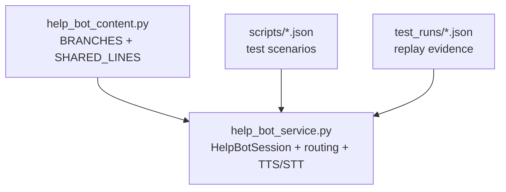
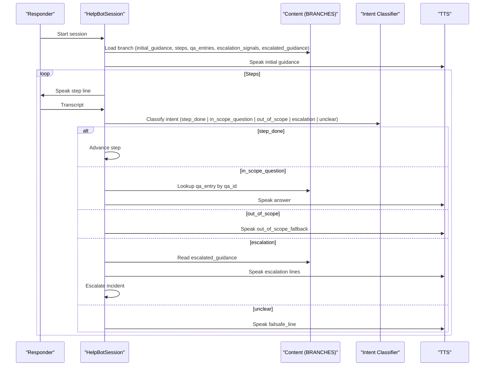
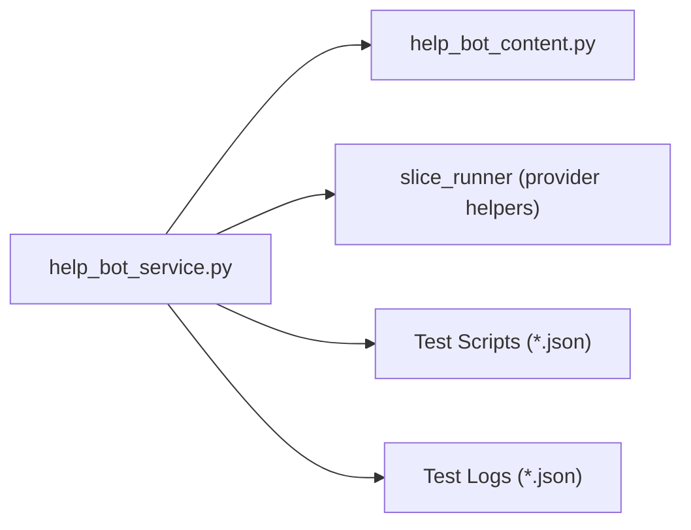
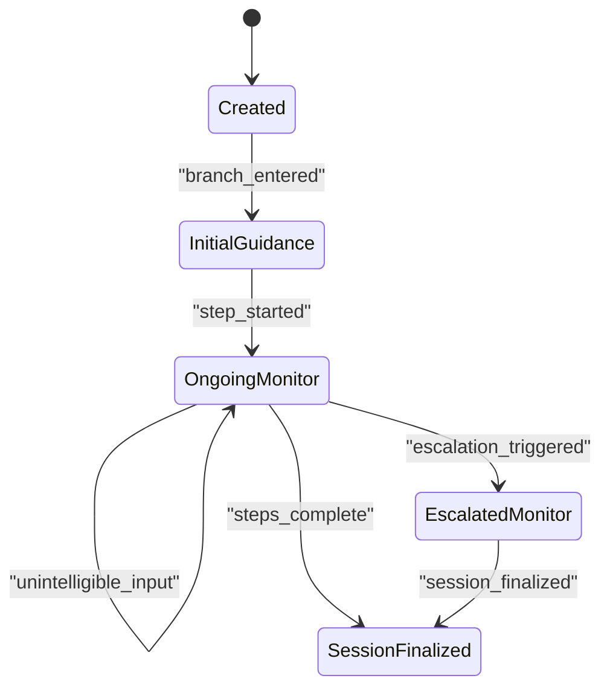

# Content Validation Rules

<cite>
**Referenced Files in This Document**
- [help_bot_content.py](file://backend/services/help_bot_content.py)
- [help_bot_service.py](file://backend/services/help_bot_service.py)
- [fracture_crush.json](file://mockdata/helpbot/scripts/fracture_crush.json)
- [heavy_bleeding.json](file://mockdata/helpbot/scripts/heavy_bleeding.json)
- [snakebite.json](file://mockdata/helpbot/scripts/snakebite.json)
- [INC-SIM-FRACTURE-CRUSH_replay_1788079070.json](file://mockdata/helpbot/test_runs/INC-SIM-FRACTURE-CRUSH_replay_1788079070.json)
</cite>

## Table of Contents
1. Introduction
2. Project Structure
3. Core Components
4. Architecture Overview
5. Detailed Component Analysis
6. Dependency Analysis
7. Performance Considerations
8. Troubleshooting Guide
9. Conclusion
10. Appendices

## Introduction
This document defines the validation rules and constraints that govern the medical content structure used by the Responder AI Help Bot. It specifies required fields for each branch, step structure requirements, QA entry requirements, escalation signal formatting, and content quality rules (Urdu-only text, prohibition of English or Roman Urdu, medical disclaimer compliance, and safety-critical message verification). It also provides examples of valid and invalid content structures, error handling behaviors for malformed data, and guidelines for extending the content system while preserving validation integrity and medical accuracy.

## Project Structure
The content system is implemented as a strict, hardcoded knowledge base consumed by a conversation engine:
- Content definitions live in a dedicated module with shared lines and per-branch entries.
- The conversation engine enforces state transitions, intent classification, and scripted responses derived exclusively from the content module.
- Test scripts and replay logs demonstrate expected flows and outcomes.

**Diagram sources**
- [help_bot_content.py:21-43](file://backend/services/help_bot_content.py#L21-L43)
- [help_bot_content.py:46-254](file://backend/services/help_bot_content.py#L46-L254)
- [help_bot_service.py:44-47](file://backend/services/help_bot_service.py#L44-L47)
- [help_bot_service.py:663-783](file://backend/services/help_bot_service.py#L663-L783)
- [fracture_crush.json:1-11](file://mockdata/helpbot/scripts/fracture_crush.json#L1-L11)
- [heavy_bleeding.json:1-11](file://mockdata/helpbot/scripts/heavy_bleeding.json#L1-L11)
- [snakebite.json:1-11](file://mockdata/helpbot/scripts/snakebite.json#L1-L11)

**Section sources**
- [help_bot_content.py:21-43](file://backend/services/help_bot_content.py#L21-L43)
- [help_bot_content.py:46-254](file://backend/services/help_bot_content.py#L46-L254)
- [help_bot_service.py:44-47](file://backend/services/help_bot_service.py#L44-L47)
- [help_bot_service.py:663-783](file://backend/services/help_bot_service.py#L663-L783)
- [fracture_crush.json:1-11](file://mockdata/helpbot/scripts/fracture_crush.json#L1-L11)
- [heavy_bleeding.json:1-11](file://mockdata/helpbot/scripts/heavy_bleeding.json#L1-L11)
- [snakebite.json:1-11](file://mockdata/helpbot/scripts/snakebite.json#L1-L11)

## Core Components
- Branches: Each injury scenario is a branch containing identification, initial guidance, steps, Q&A, escalation signals, and escalated guidance.
- Shared lines: Global messages for failsafe, out-of-scope fallback, check-in, and session completion.
- Conversation engine: Routes incidents to branches, advances steps, answers in-scope questions, handles escalations, and ensures no silence on failures.

Key responsibilities:
- Enforce that all spoken output originates from the content module.
- Validate intents against allowed categories and normalize model outputs.
- Maintain state transitions and record evidence for auditability.

**Section sources**
- [help_bot_content.py:21-43](file://backend/services/help_bot_content.py#L21-L43)
- [help_bot_content.py:46-254](file://backend/services/help_bot_content.py#L46-L254)
- [help_bot_service.py:110-116](file://backend/services/help_bot_service.py#L110-L116)
- [help_bot_service.py:174-241](file://backend/services/help_bot_service.py#L174-L241)
- [help_bot_service.py:663-783](file://backend/services/help_bot_service.py#L663-L783)

## Architecture Overview
The system uses a deterministic decision tree driven by pre-authored Urdu content. The flow:
- Route incident flags to a branch.
- Deliver initial guidance then iterate through steps.
- Classify responder input into intents using a classifier constrained by current step and branch context.
- Respond only with scripted content; escalate when warranted.

**Diagram sources**
- [help_bot_service.py:663-783](file://backend/services/help_bot_service.py#L663-L783)
- [help_bot_service.py:786-874](file://backend/services/help_bot_service.py#L786-L874)
- [help_bot_content.py:46-254](file://backend/services/help_bot_content.py#L46-L254)

## Detailed Component Analysis

### Branch Schema and Required Fields
Every branch must include:
- branch_id: Unique identifier for the branch.
- title_ur: Display title in Urdu.
- initial_guidance: Array of one or more Urdu strings delivered before steps.
- steps: Array of step objects, each with:
  - step_id: Identifier for the step.
  - line: Urdu string spoken to guide the responder.
- qa_entries: Array of Q&A objects, each with:
  - qa_id: Identifier matched by the classifier.
  - hints: Array of Urdu phrases that may trigger this Q&A.
  - answer: Urdu response text.
- escalation_signals: Array of Urdu phrases indicating deterioration.
- escalated_guidance: Array of Urdu strings spoken upon escalation.

Validation expectations enforced by the engine:
- Steps are iterated sequentially; after the last step, a completion message is spoken.
- In-scope questions are answered only if qa_id matches an existing entry.
- Escalation triggers speak all escalated_guidance lines and update incident severity.

**Section sources**
- [help_bot_content.py:46-254](file://backend/services/help_bot_content.py#L46-L254)
- [help_bot_service.py:771-783](file://backend/services/help_bot_service.py#L771-L783)
- [help_bot_service.py:841-868](file://backend/services/help_bot_service.py#L841-L868)

### Step Structure Validation
- Each step must have both step_id and line.
- The engine reads steps by index and speaks the line; missing fields would break iteration or produce undefined behavior.
- After completing all steps, the session speaks a completion message.

Example references:
- Valid step object pattern observed across branches.
- Completion behavior after final step.

**Section sources**
- [help_bot_content.py:59-72](file://backend/services/help_bot_content.py#L59-L72)
- [help_bot_content.py:131-144](file://backend/services/help_bot_content.py#L131-L144)
- [help_bot_content.py:194-207](file://backend/services/help_bot_content.py#L194-L207)
- [help_bot_service.py:771-783](file://backend/services/help_bot_service.py#L771-L783)

### QA Entry Requirements
- Each qa_entry must include qa_id, hints array, and answer text.
- The classifier maps user utterances to qa_id; if matched, the corresponding answer is spoken.
- If the classifier claims in-scope but no matching qa_id exists, the system treats it as out-of-scope to avoid guessing answers.

Quality rules:
- All hints and answers must be in Urdu script.
- Hints should reflect realistic phrasing responders might use.

**Section sources**
- [help_bot_content.py:73-106](file://backend/services/help_bot_content.py#L73-L106)
- [help_bot_content.py:145-170](file://backend/services/help_bot_content.py#L145-L170)
- [help_bot_content.py:208-241](file://backend/services/help_bot_content.py#L208-L241)
- [help_bot_service.py:216-241](file://backend/services/help_bot_service.py#L216-L241)
- [help_bot_service.py:841-847](file://backend/services/help_bot_service.py#L841-L847)

### Escalation Signals and Escalated Guidance
- escalation_signals: Array of Urdu phrases indicating worsening condition.
- When escalation is detected, the system:
  - Speaks all escalated_guidance lines.
  - Upgrades severity tier if suggested tier is higher.
  - Records transition events and updates incident records.

Safety rule:
- Escalation defaults to safer tiers when uncertain.

**Section sources**
- [help_bot_content.py:107-118](file://backend/services/help_bot_content.py#L107-L118)
- [help_bot_content.py:171-181](file://backend/services/help_bot_content.py#L171-L181)
- [help_bot_content.py:242-252](file://backend/services/help_bot_content.py#L242-L252)
- [help_bot_service.py:855-868](file://backend/services/help_bot_service.py#L855-L868)
- [help_bot_service.py:576-647](file://backend/services/help_bot_service.py#L576-L647)

### Content Quality Rules
- Urdu-only text requirement:
  - All spoken content must be real Urdu script.
  - English or Roman Urdu is prohibited in content strings.
- Medical disclaimer compliance:
  - The content module includes a draft disclaimer noting that content requires professional first-aid review prior to production use.
- Safety-critical message verification:
  - Failsafe and out-of-scope fallbacks ensure the responder is never left silent and receives safe, general guidance.
  - Escalation paths prioritize patient safety and ambulance requests when critical.

Evidence in code:
- Module header explicitly states Urdu-only and draft status.
- Shared lines provide failsafe and out-of-scope fallbacks.
- Intent normalization prevents unsafe improvisation.

**Section sources**
- [help_bot_content.py:1-19](file://backend/services/help_bot_content.py#L1-L19)
- [help_bot_content.py:21-43](file://backend/services/help_bot_content.py#L21-L43)
- [help_bot_service.py:174-241](file://backend/services/help_bot_service.py#L174-L241)
- [help_bot_service.py:870-874](file://backend/services/help_bot_service.py#L870-L874)

### Examples of Valid and Invalid Content Structures
Valid patterns (observed):
- Branch with all required fields and arrays populated.
- Steps with step_id and line.
- QA entries with qa_id, hints array, and answer text.
- Escalation signals as keyword arrays and escalated_guidance as Urdu strings.

Invalid patterns (would fail or degrade behavior):
- Missing branch_id, title_ur, initial_guidance, steps, qa_entries, escalation_signals, or escalated_guidance.
- Step missing step_id or line.
- QA entry missing qa_id, hints, or answer.
- Escalation signals not present or empty where needed.
- Non-Urdu text in any content field.
- Mismatched qa_id referenced by classifier leading to out-of-scope fallback.

References:
- Valid structures across three branches.
- Replay logs showing correct transitions and fallbacks.

**Section sources**
- [help_bot_content.py:46-254](file://backend/services/help_bot_content.py#L46-L254)
- [INC-SIM-FRACTURE-CRUSH_replay_1788079070.json:173-216](file://mockdata/helpbot/test_runs/INC-SIM-FRACTURE-CRUSH_replay_1788079070.json#L173-L216)

### Error Handling for Malformed Data
- STT failures or unclear transcripts result in speaking the failsafe line and continuing the loop.
- Out-of-scope questions receive a standardized fallback message.
- TTS failures fall back to pre-rendered failsafe audio or printed Urdu text.
- Intent normalization coerces malformed model replies to “unclear” to prevent unsafe actions.

Operational safeguards:
- No silence at any point; always respond with safe guidance.
- Escalation defaults to safer tiers when uncertain.

**Section sources**
- [help_bot_service.py:727-757](file://backend/services/help_bot_service.py#L727-L757)
- [help_bot_service.py:870-874](file://backend/services/help_bot_service.py#L870-L874)
- [help_bot_service.py:216-241](file://backend/services/help_bot_service.py#L216-L241)

### Guidelines for Extending the Content System
When adding new branches or modifying existing ones:
- Preserve schema:
  - Include all required fields: branch_id, title_ur, initial_guidance, steps, qa_entries, escalation_signals, escalated_guidance.
- Maintain Urdu-only content:
  - Ensure all strings are in Urdu script; do not introduce English or Roman Urdu.
- Keep steps actionable and sequential:
  - Each step must have step_id and line; avoid ambiguous instructions.
- Design robust Q&A:
  - Provide clear qa_id, realistic hints, and precise answers aligned with first-aid best practices.
- Define escalation signals carefully:
  - Use concise Urdu phrases that clearly indicate deterioration.
  - Ensure escalated_guidance covers immediate safety actions and communication with emergency services.
- Validate via replay:
  - Add test scripts under scripts/*.json and verify expected intents and transitions in replay logs.
- Review medical accuracy:
  - Any content changes must undergo professional first-aid review due to the draft disclaimer.

**Section sources**
- [help_bot_content.py:1-19](file://backend/services/help_bot_content.py#L1-L19)
- [help_bot_content.py:46-254](file://backend/services/help_bot_content.py#L46-L254)
- [fracture_crush.json:1-11](file://mockdata/helpbot/scripts/fracture_crush.json#L1-L11)
- [heavy_bleeding.json:1-11](file://mockdata/helpbot/scripts/heavy_bleeding.json#L1-L11)
- [snakebite.json:1-11](file://mockdata/helpbot/scripts/snakebite.json#L1-L11)

## Dependency Analysis
The content module is imported by the service layer and consumed throughout the session lifecycle. Routing depends on incident flags mapped to branch keywords.

**Diagram sources**
- [help_bot_service.py:44-47](file://backend/services/help_bot_service.py#L44-L47)
- [help_bot_service.py:110-116](file://backend/services/help_bot_service.py#L110-L116)
- [help_bot_service.py:663-783](file://backend/services/help_bot_service.py#L663-L783)

**Section sources**
- [help_bot_service.py:44-47](file://backend/services/help_bot_service.py#L44-L47)
- [help_bot_service.py:110-116](file://backend/services/help_bot_service.py#L110-L116)
- [help_bot_service.py:663-783](file://backend/services/help_bot_service.py#L663-L783)

## Performance Considerations
- TTS caching reduces repeated synthesis costs and latency; cached files are keyed by voice and text.
- First playback delay is measured to capture perceived responsiveness.
- Audio capture uses VAD to segment utterances and supports barge-in detection.

Practical implications:
- Pre-rendering failsafe audio mitigates network failures during emergencies.
- Latency metrics help identify bottlenecks in STT/intent/TTS pipelines.

**Section sources**
- [help_bot_service.py:350-387](file://backend/services/help_bot_service.py#L350-L387)
- [help_bot_service.py:405-444](file://backend/services/help_bot_service.py#L405-L444)
- [help_bot_service.py:456-569](file://backend/services/help_bot_service.py#L456-L569)
- [help_bot_service.py:727-757](file://backend/services/help_bot_service.py#L727-L757)
- [help_bot_service.py:929-959](file://backend/services/help_bot_service.py#L929-L959)

## Troubleshooting Guide
Common issues and resolutions:
- Empty or unintelligible transcript:
  - Behavior: Speak failsafe line and continue listening.
  - Check STT provider connectivity and environment configuration.
- Out-of-scope question:
  - Behavior: Speak out-of-scope fallback; ensure no improvised advice.
  - Verify whether the question should be added as a new qa_entry if relevant.
- TTS failure:
  - Behavior: Fall back to pre-rendered failsafe audio or print Urdu text.
  - Ensure cache directory exists and has write permissions.
- Escalation not triggering:
  - Verify escalation_signals match responder’s reported conditions.
  - Confirm suggested_tier logic and incident store updates.

Evidence in logs:
- Replay logs show transitions for unintelligible inputs and escalation events.

**Section sources**
- [help_bot_service.py:727-757](file://backend/services/help_bot_service.py#L727-L757)
- [help_bot_service.py:870-874](file://backend/services/help_bot_service.py#L870-L874)
- [help_bot_service.py:855-868](file://backend/services/help_bot_service.py#L855-L868)
- [INC-SIM-FRACTURE-CRUSH_replay_1788079070.json:173-216](file://mockdata/helpbot/test_runs/INC-SIM-FRACTURE-CRUSH_replay_1788079070.json#L173-L216)

## Conclusion
The medical content system enforces a strict, safety-first design:
- All spoken guidance is pre-authored in Urdu and validated by schema requirements.
- Steps, Q&A, and escalation pathways are structured to minimize risk and maximize clarity.
- Robust error handling ensures responders always receive safe guidance, even in degraded conditions.
- Extensibility is supported through well-defined schemas and replay-based testing, with mandatory professional review for any medical content changes.

## Appendices

### Appendix A: Branch State Flow

**Diagram sources**
- [help_bot_service.py:696-711](file://backend/services/help_bot_service.py#L696-L711)
- [help_bot_service.py:760-783](file://backend/services/help_bot_service.py#L760-L783)
- [help_bot_service.py:833-874](file://backend/services/help_bot_service.py#L833-L874)

### Appendix B: Scripted Scenarios
- fracture_crush.json: Demonstrates step advancement, in-scope Q&A, out-of-scope handling, and escalation.
- heavy_bleeding.json: Demonstrates step progression, Q&A, and escalation.
- snakebite.json: Demonstrates step progression, Q&A, and escalation.

**Section sources**
- [fracture_crush.json:1-11](file://mockdata/helpbot/scripts/fracture_crush.json#L1-L11)
- [heavy_bleeding.json:1-11](file://mockdata/helpbot/scripts/heavy_bleeding.json#L1-L11)
- [snakebite.json:1-11](file://mockdata/helpbot/scripts/snakebite.json#L1-L11)