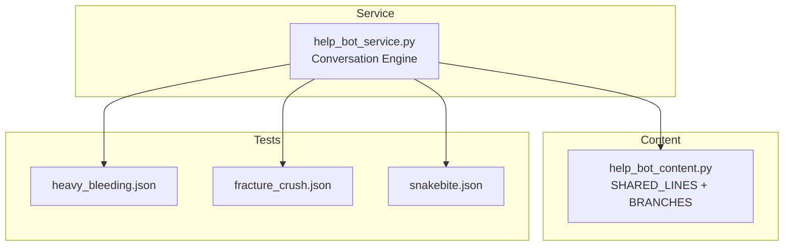
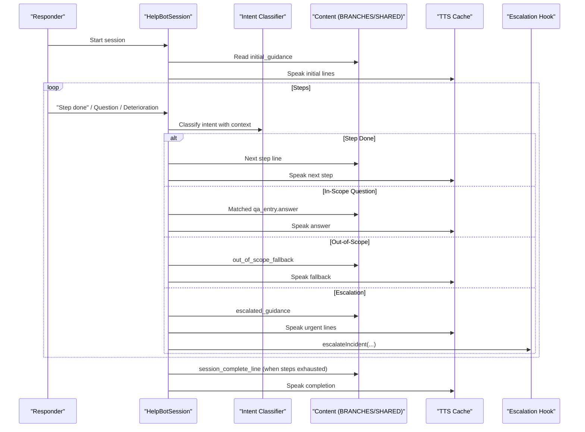
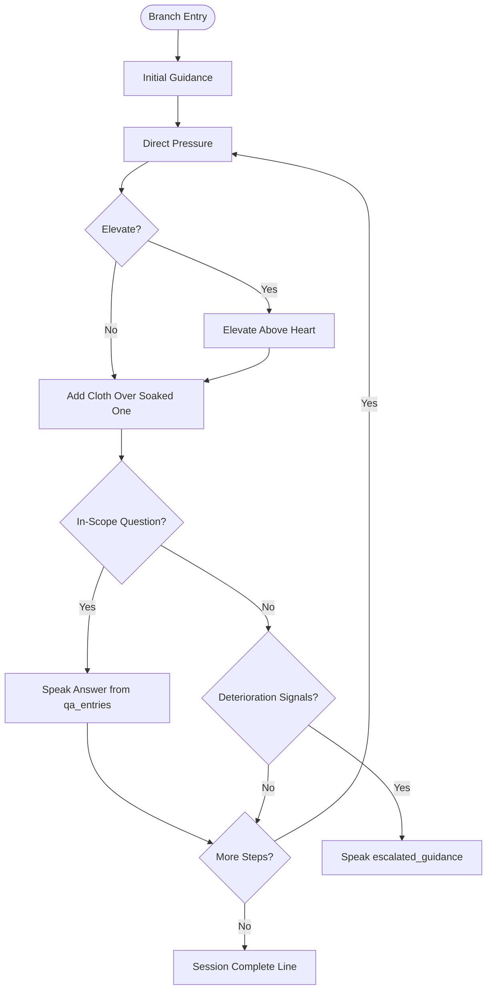
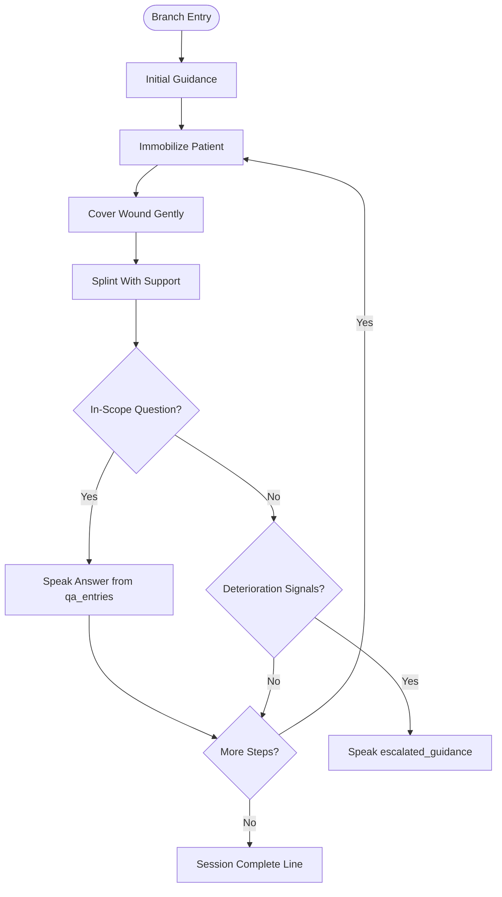
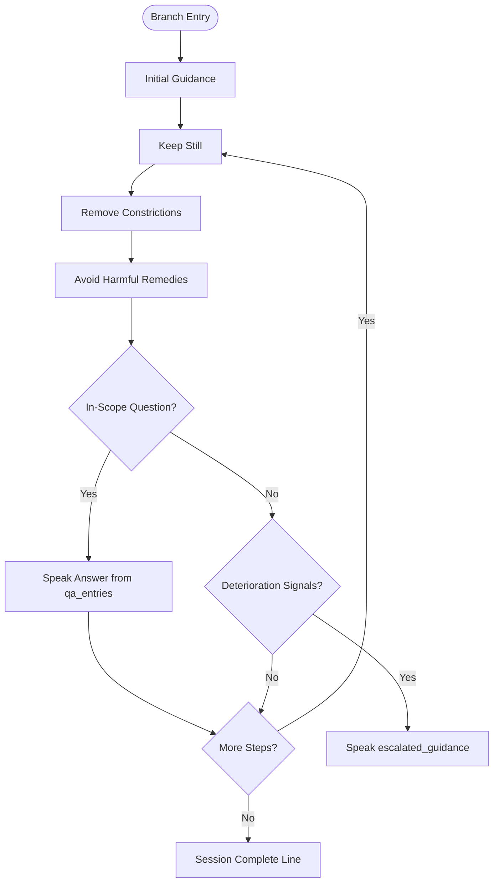
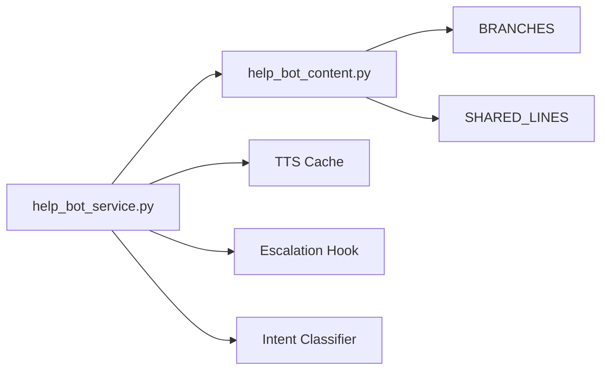

# Medical Content Structure & Organization

<cite>
**Referenced Files in This Document**
- [help_bot_content.py](file://backend/services/help_bot_content.py)
- [help_bot_service.py](file://backend/services/help_bot_service.py)
- [heavy_bleeding.json](file://mockdata/helpbot/scripts/heavy_bleeding.json)
- [fracture_crush.json](file://mockdata/helpbot/scripts/fracture_crush.json)
- [snakebite.json](file://mockdata/helpbot/scripts/snakebite.json)
</cite>

## Table of Contents
1. [Introduction](#introduction)
2. [Project Structure](#project-structure)
3. [Core Components](#core-components)
4. [Architecture Overview](#architecture-overview)
5. [Detailed Component Analysis](#detailed-component-analysis)
6. [Dependency Analysis](#dependency-analysis)
7. [Performance Considerations](#performance-considerations)
8. [Troubleshooting Guide](#troubleshooting-guide)
9. [Conclusion](#conclusion)

## Introduction
This document explains the structured medical content system that organizes Urdu first-aid guidance for a voice-first responder assistant. The system uses a fixed, auditable knowledge base to ensure every spoken line is pre-approved and never generated by an AI model during emergencies. It defines:
- A consistent BRANCHES data structure for each injury type (heavy bleeding, fracture/crush, snakebite).
- A SHARED_LINES system for common responses across all branches.
- A conversation engine that routes incidents to the correct branch, advances step-by-step instructions, answers in-scope questions, handles out-of-scope queries safely, and escalates when patient condition deteriorates.

The goal is clarity, safety, and consistency: responders receive clear, ordered steps in Urdu, with built-in escalation triggers and fail-safe behavior.

## Project Structure
At a high level:
- Content definitions live in a dedicated module that contains SHARED_LINES and BRANCHES.
- The service layer implements the conversation engine, intent classification, TTS playback, and escalation hooks.
- Mock test scripts define deterministic turn sequences per branch to validate behavior.

**Diagram sources**
- [help_bot_content.py:21-255](file://backend/services/help_bot_content.py#L21-L255)
- [help_bot_service.py:44-47](file://backend/services/help_bot_service.py#L44-L47)
- [heavy_bleeding.json:1-11](file://mockdata/helpbot/scripts/heavy_bleeding.json#L1-L11)
- [fracture_crush.json:1-11](file://mockdata/helpbot/scripts/fracture_crush.json#L1-L11)
- [snakebite.json:1-11](file://mockdata/helpbot/scripts/snakebite.json#L1-L11)

**Section sources**
- [help_bot_content.py:21-255](file://backend/services/help_bot_content.py#L21-L255)
- [help_bot_service.py:44-47](file://backend/services/help_bot_service.py#L44-L47)

## Core Components
- SHARED_LINES: Common messages used by all branches, including failsafe, out-of-scope fallback, check-in prompt, and session completion message.
- BRANCHES: A dictionary keyed by injury type, where each branch defines:
  - branch_id: Unique identifier for the branch.
  - title_ur: Urdu title displayed/used in context.
  - initial_guidance: Ordered list of opening lines to orient the responder.
  - steps: Array of step objects with step_id and line fields; delivered sequentially as the responder confirms completion.
  - qa_entries: Array of question-answer entries with hints and answer text; matched via intent classification.
  - escalation_signals: List of phrases or conditions indicating deterioration; trigger escalation flow.
  - escalated_guidance: Ordered array of urgent actions to speak when escalation occurs.

Each injury type follows this identical schema while containing specialized protocols appropriate to its clinical scenario.

**Section sources**
- [help_bot_content.py:21-43](file://backend/services/help_bot_content.py#L21-L43)
- [help_bot_content.py:46-255](file://backend/services/help_bot_content.py#L46-L255)

## Architecture Overview
The conversation engine orchestrates:
- Branch routing based on incident flags.
- Sequential delivery of initial guidance and steps.
- Intent classification to determine whether the responder completed a step, asked an in-scope question, asked an out-of-scope question, or reported deterioration.
- TTS playback of scripted Urdu lines with caching and fail-safe behavior.
- Escalation hook that updates incident severity, requests ambulance if critical, and logs transitions.

**Diagram sources**
- [help_bot_service.py:663-874](file://backend/services/help_bot_service.py#L663-L874)
- [help_bot_content.py:21-255](file://backend/services/help_bot_content.py#L21-L255)

## Detailed Component Analysis

### BRANCHES Data Structure
Each branch object has the following fields:
- branch_id: String key identifying the branch.
- title_ur: Urdu label for the branch.
- initial_guidance: Array of strings; first lines to set expectations and immediate action.
- steps: Array of objects:
  - step_id: Identifier for the step.
  - line: Urdu instruction; includes a cue for the responder to confirm completion.
- qa_entries: Array of objects:
  - qa_id: Identifier for the Q&A entry.
  - hints: Array of phrases/responder utterances that map to this answer.
  - answer: Urdu response text.
- escalation_signals: Array of phrases indicating worsening condition.
- escalated_guidance: Array of urgent instructions to deliver upon escalation.

This structure ensures uniformity across injury types and simplifies routing, testing, and maintenance.

**Section sources**
- [help_bot_content.py:46-255](file://backend/services/help_bot_content.py#L46-L255)

### heavy_bleeding Branch
- Focus: Immediate hemorrhage control using direct pressure, elevation, and cloth management.
- Steps: Direct pressure, elevate limb, add cloth without removing soaked one.
- Q&A: Covers soaked cloth handling, pressure intensity, duration, and embedded objects.
- Escalation signals: Uncontrolled bleeding, increasing blood loss, unconsciousness, dizziness, breathing difficulty.
- Escalated guidance: Urgent alert, tourniquet placement above wound (not at joint), positioning for shock, continuous monitoring.

**Diagram sources**
- [help_bot_content.py:52-119](file://backend/services/help_bot_content.py#L52-L119)

**Section sources**
- [help_bot_content.py:52-119](file://backend/services/help_bot_content.py#L52-L119)

### fracture_crush Branch
- Focus: Immobilization, wound coverage without pressing on bone, splinting with improvised materials.
- Steps: Immobilize, cover open wound gently, splint with rigid support and padding.
- Q&A: Addresses lack of splint material, pain progression, and avoiding food/water/painkillers before possible surgery.
- Escalation signals: Unconsciousness, breathing difficulty, exposed bone, severe bleeding.
- Escalated guidance: Do not move patient, do not push bone back, position for airway if needed, monitor breathing.

**Diagram sources**
- [help_bot_content.py:124-182](file://backend/services/help_bot_content.py#L124-L182)

**Section sources**
- [help_bot_content.py:124-182](file://backend/services/help_bot_content.py#L124-L182)

### snakebite Branch
- Focus: Minimize movement to slow venom spread, remove constrictions, avoid harmful remedies.
- Steps: Keep still, remove rings/watch/tight clothing near bite, avoid cutting/sucking/tight bandaging.
- Q&A: Prohibits tight bandages, clarifies gentle cleaning only, advises against capturing snake, warns against cutting/sucking.
- Escalation signals: Breathing difficulty, unconsciousness, rapid swelling, vomiting.
- Escalated guidance: Urgent alert, loosen tight clothing around neck/chest, keep immobilized, monitor breathing continuously.

**Diagram sources**
- [help_bot_content.py:187-253](file://backend/services/help_bot_content.py#L187-L253)

**Section sources**
- [help_bot_content.py:187-253](file://backend/services/help_bot_content.py#L187-L253)

### SHARED_LINES System
Common responses shared across all branches:
- failsafe_line: Spoken when AI call fails, times out, or input is unintelligible; ensures no silence.
- out_of_scope_fallback: Honest refusal for questions outside scope; provides general safety guidance without improvisation.
- check_in_line: Periodic check-in when responder is silent (e.g., hands busy).
- session_complete_line: Spoken after all scripted steps are delivered; instructs continued monitoring until help arrives.

These lines are referenced throughout the conversation engine to maintain consistent, safe messaging.

**Section sources**
- [help_bot_content.py:21-43](file://backend/services/help_bot_content.py#L21-L43)
- [help_bot_service.py:689-757](file://backend/services/help_bot_service.py#L689-L757)

## Dependency Analysis
- The service imports BRANCHES and SHARED_LINES from the content module.
- Branch routing maps incident flags to a branch id using keyword sets; defaults to heavy_bleeding if none match.
- Intent detection builds prompts using current branch’s title, step, Q&A hints, and escalation signals, then classifies into five intents.
- TTS uses a cache to avoid repeated synthesis; failures fall back to a pre-rendered failsafe audio.
- Escalation updates incident tier, adds new flags, marks BHU notification, and requests ambulance when critical.

**Diagram sources**
- [help_bot_service.py:44-47](file://backend/services/help_bot_service.py#L44-L47)
- [help_bot_service.py:99-116](file://backend/services/help_bot_service.py#L99-L116)
- [help_bot_service.py:174-288](file://backend/services/help_bot_service.py#L174-L288)
- [help_bot_service.py:307-387](file://backend/services/help_bot_service.py#L307-L387)
- [help_bot_service.py:576-647](file://backend/services/help_bot_service.py#L576-L647)
- [help_bot_content.py:21-255](file://backend/services/help_bot_content.py#L21-L255)

**Section sources**
- [help_bot_service.py:99-116](file://backend/services/help_bot_service.py#L99-L116)
- [help_bot_service.py:174-288](file://backend/services/help_bot_service.py#L174-L288)
- [help_bot_service.py:307-387](file://backend/services/help_bot_service.py#L307-L387)
- [help_bot_service.py:576-647](file://backend/services/help_bot_service.py#L576-L647)
- [help_bot_content.py:21-255](file://backend/services/help_bot_content.py#L21-L255)

## Performance Considerations
- TTS caching reduces latency and quota usage; pre-rendering the failsafe line ensures immediate playback even if network fails mid-session.
- Intent classification uses concise prompts with limited context windows to balance accuracy and speed.
- Audio capture uses VAD to minimize processing overhead and supports barge-in to reduce perceived delay.
- Latency metrics are recorded per turn to identify bottlenecks in STT, classification, and TTS.

[No sources needed since this section provides general guidance]

## Troubleshooting Guide
Common issues and how the system handles them:
- STT failure or unclear input: The bot speaks the failsafe line and continues the loop; no silence is produced.
- Out-of-scope questions: The bot responds with the honest fallback, avoiding any improvised medical advice.
- TTS failure: The bot falls back to the pre-rendered failsafe audio and logs the error.
- Escalation: When deterioration signals are detected, the bot speaks urgent guidance and calls the escalation hook to update severity, request ambulance if critical, and log transitions.

Operational tips:
- Verify audio device availability; if missing, playback is skipped but evidence remains in logs.
- Use replay mode to validate expected intents and branching behavior deterministically.
- Inspect final run records for turns, expectations, latencies, and transitions.

**Section sources**
- [help_bot_service.py:689-757](file://backend/services/help_bot_service.py#L689-L757)
- [help_bot_service.py:833-874](file://backend/services/help_bot_service.py#L833-L874)
- [help_bot_service.py:878-960](file://backend/services/help_bot_service.py#L878-L960)

## Conclusion
The structured medical content system ensures safe, consistent, and auditable first-aid guidance in Urdu through:
- A uniform BRANCHES schema across injury types with clear steps, Q&A, and escalation pathways.
- A robust SHARED_LINES system for fail-safe, scope limitation, check-ins, and completion.
- A conversation engine that enforces scripted content, classifies intent accurately, and escalates appropriately.
This design prioritizes responder safety, minimizes risk of hallucination, and provides measurable performance and reliability characteristics suitable for emergency use.

[No sources needed since this section summarizes without analyzing specific files]