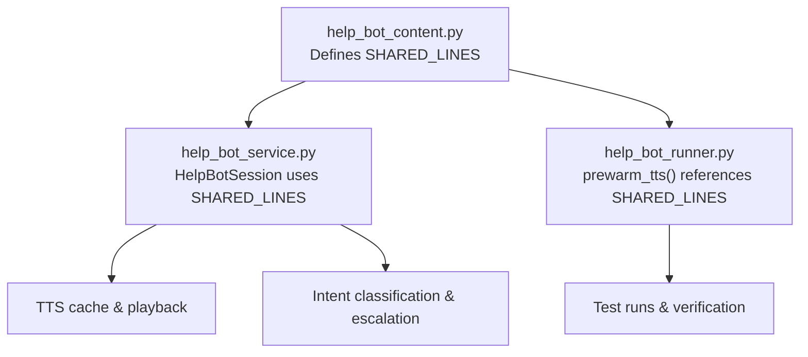
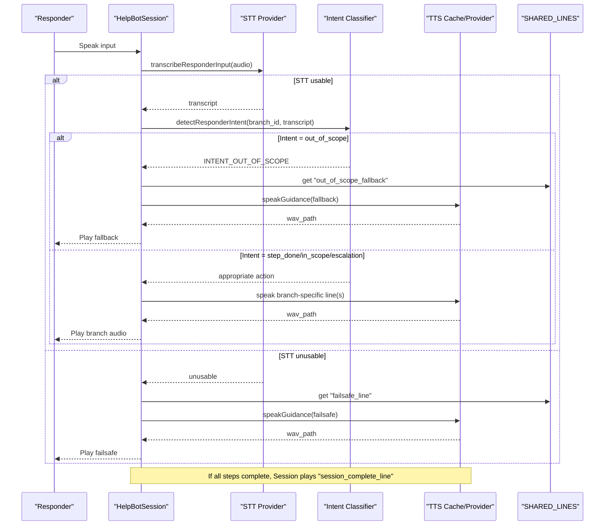
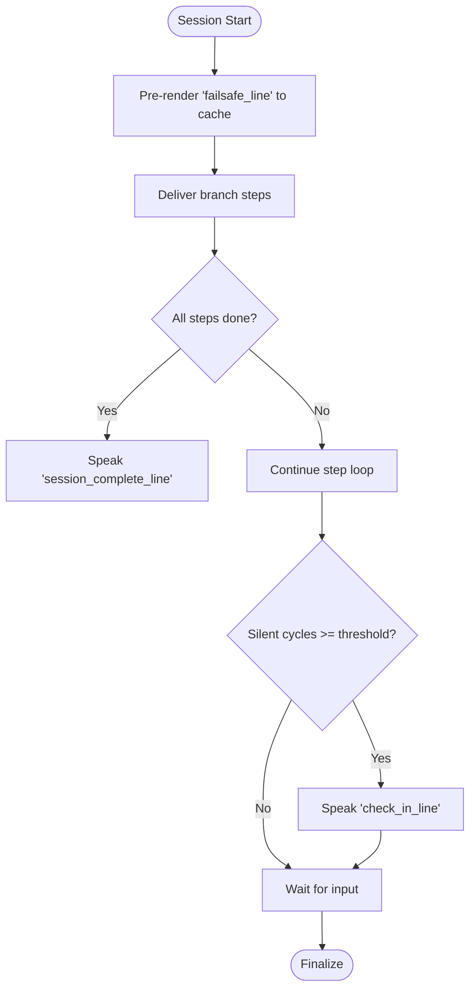
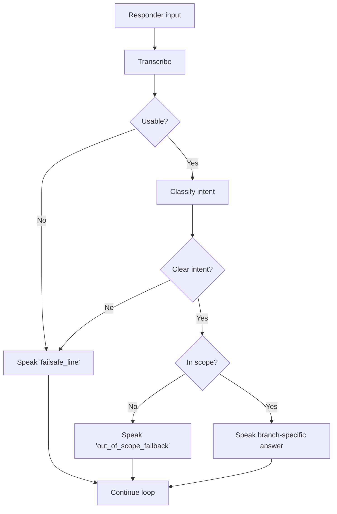
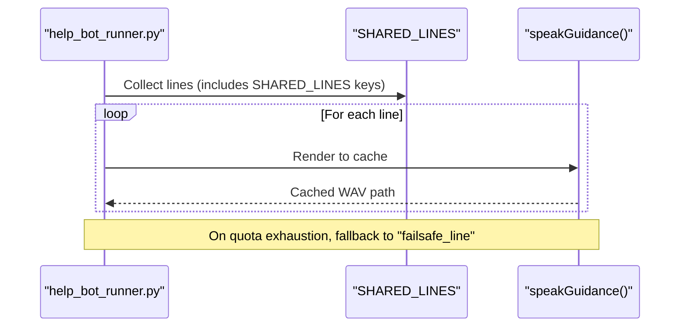
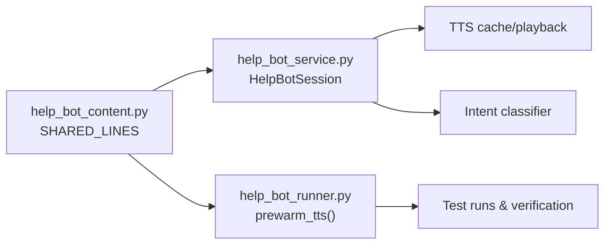

# Shared Lines System

<cite>
**Referenced Files in This Document**
- [help_bot_content.py](file://backend/services/help_bot_content.py)
- [help_bot_service.py](file://backend/services/help_bot_service.py)
- [help_bot_runner.py](file://backend/help_bot_runner.py)
</cite>

## Table of Contents
1. [Introduction](#introduction)
2. [Project Structure](#project-structure)
3. [Core Components](#core-components)
4. [Architecture Overview](#architecture-overview)
5. [Detailed Component Analysis](#detailed-component-analysis)
6. [Dependency Analysis](#dependency-analysis)
7. [Performance Considerations](#performance-considerations)
8. [Troubleshooting Guide](#troubleshooting-guide)
9. [Conclusion](#conclusion)
10. [Appendices](#appendices)

## Introduction
This document explains the SHARED_LINES system that provides universal, pre-approved response templates used across all injury branches in the Help Bot. These shared lines ensure consistent user experience, safety, and professional communication regardless of injury type. They act as safety nets when AI components fail or when questions fall outside defined knowledge, and they mark key session milestones such as completion of guided procedures.

The SHARED_LINES dictionary centralizes four critical messages:
- failsafe_line: spoken when AI calls fail, time out, or input is unintelligible; ensures no silence during emergencies.
- out_of_scope_fallback: honest refusal for questions not covered by the current branch’s knowledge base; maintains safety by avoiding improvised advice.
- check_in_line: hands-free check-in prompt during busy periods when the responder has been silent for a while.
- session_complete_line: marks the end of scripted guidance steps and reassures the responder to continue monitoring until help arrives.

These lines are referenced consistently by the conversation engine and test harness to keep behavior predictable and auditable.

## Project Structure
The SHARED_LINES system lives in the content module and is consumed by the service layer and runner utilities:
- Content definition: backend/services/help_bot_content.py
- Service usage (session lifecycle, intent handling, live loop): backend/services/help_bot_service.py
- Runner prewarming and fallbacks: backend/help_bot_runner.py

**Diagram sources**
- [help_bot_content.py:21-43](file://backend/services/help_bot_content.py#L21-L43)
- [help_bot_service.py:44-47](file://backend/services/help_bot_service.py#L44-L47)
- [help_bot_runner.py:102-114](file://backend/help_bot_runner.py#L102-L114)

**Section sources**
- [help_bot_content.py:21-43](file://backend/services/help_bot_content.py#L21-L43)
- [help_bot_service.py:44-47](file://backend/services/help_bot_service.py#L44-L47)
- [help_bot_runner.py:102-114](file://backend/help_bot_runner.py#L102-L114)

## Core Components
SHARED_LINES keys and their roles:
- failsafe_line: Ensures continuous vocal support when STT/intent/TTS fail or when input cannot be understood. It is pre-rendered at session start so audio can play even if network fails mid-session.
- out_of_scope_fallback: Used when the intent classifier determines a question is not covered by the current branch’s Q&A entries. The bot refuses to improvise and gives general safety guidance.
- check_in_line: Spoken after multiple silent cycles in live hands-free mode to re-engage the responder without interrupting ongoing tasks.
- session_complete_line: Spoken after all scripted steps are delivered, signaling completion of initial guidance and encouraging continued monitoring.

Implementation highlights:
- Pre-rendering: The session constructor pre-renders the failsafe line into cached audio to guarantee availability under network failure.
- Live loop: After repeated silent captures, the live loop speaks the check-in line.
- Step completion: When steps are exhausted, the session speaks the session complete line.
- Intent-driven fallbacks: Out-of-scope questions trigger the out-of-scope fallback; unclear or failed inputs trigger the failsafe line.

**Section sources**
- [help_bot_content.py:21-43](file://backend/services/help_bot_content.py#L21-L43)
- [help_bot_service.py:689-694](file://backend/services/help_bot_service.py#L689-L694)
- [help_bot_service.py:771-783](file://backend/services/help_bot_service.py#L771-L783)
- [help_bot_service.py:849-853](file://backend/services/help_bot_service.py#L849-L853)
- [help_bot_service.py:870-874](file://backend/services/help_bot_service.py#L870-L874)
- [help_bot_service.py:907-914](file://backend/services/help_bot_service.py#L907-L914)

## Architecture Overview
The SHARED_LINES system integrates with the Help Bot’s conversation engine to provide consistent responses across all injury branches. The flow below shows how shared lines are triggered during normal operation and error conditions.

**Diagram sources**
- [help_bot_service.py:786-831](file://backend/services/help_bot_service.py#L786-L831)
- [help_bot_service.py:833-874](file://backend/services/help_bot_service.py#L833-L874)
- [help_bot_service.py:771-783](file://backend/services/help_bot_service.py#L771-L783)
- [help_bot_content.py:21-43](file://backend/services/help_bot_content.py#L21-L43)

## Detailed Component Analysis

### SHARED_LINES Definition and Purpose
- Location: backend/services/help_bot_content.py
- Keys:
  - failsafe_line: Always available; pre-rendered at session start to avoid network dependency during failures.
  - out_of_scope_fallback: Honest refusal for untrained topics; avoids medical improvisation.
  - check_in_line: Re-engagement prompt during hands-free operation when the responder is silent.
  - session_complete_line: Signals completion of scripted steps and encourages continued monitoring.

These lines are intentionally concise, calm, and actionable, maintaining professional standards across all injury types.

**Section sources**
- [help_bot_content.py:21-43](file://backend/services/help_bot_content.py#L21-L43)

### Session Lifecycle Integration
- Pre-rendering failsafe audio: At session creation, the failsafe line is rendered once and cached so it can play even if later calls fail.
- Step completion: After delivering all branch steps, the session speaks the session_complete_line.
- Live loop check-ins: In hands-free mode, after multiple silent capture cycles, the session speaks the check_in_line to maintain engagement.

**Diagram sources**
- [help_bot_service.py:689-694](file://backend/services/help_bot_service.py#L689-L694)
- [help_bot_service.py:771-783](file://backend/services/help_bot_service.py#L771-L783)
- [help_bot_service.py:907-914](file://backend/services/help_bot_service.py#L907-L914)

**Section sources**
- [help_bot_service.py:689-694](file://backend/services/help_bot_service.py#L689-L694)
- [help_bot_service.py:771-783](file://backend/services/help_bot_service.py#L771-L783)
- [help_bot_service.py:907-914](file://backend/services/help_bot_service.py#L907-L914)

### Error Handling Scenarios
- STT failure or empty transcript: The session speaks the failsafe_line and continues listening.
- Intent detection failure or unclear input: The session speaks the failsafe_line and remains in the current state.
- Out-of-scope question: The session speaks the out_of_scope_fallback, refusing to improvise and providing general safety guidance.
- Network or TTS failure mid-session: The pre-rendered failsafe audio ensures continuous vocal support.

**Diagram sources**
- [help_bot_service.py:786-831](file://backend/services/help_bot_service.py#L786-L831)
- [help_bot_service.py:833-874](file://backend/services/help_bot_service.py#L833-L874)

**Section sources**
- [help_bot_service.py:786-831](file://backend/services/help_bot_service.py#L786-L831)
- [help_bot_service.py:833-874](file://backend/services/help_bot_service.py#L833-L874)

### Runner Prewarming and Fallbacks
- The runner pre-warms TTS cache for all scripted lines, including all SHARED_LINES keys, to minimize quota usage and ensure deterministic replay runs.
- If TTS quota is exhausted before rendering a branch-specific line, the runner falls back to the shared failsafe line and records a note indicating the gap.

**Diagram sources**
- [help_bot_runner.py:102-114](file://backend/help_bot_runner.py#L102-L114)
- [help_bot_runner.py:143-155](file://backend/help_bot_runner.py#L143-L155)

**Section sources**
- [help_bot_runner.py:102-114](file://backend/help_bot_runner.py#L102-L114)
- [help_bot_runner.py:143-155](file://backend/help_bot_runner.py#L143-L155)

## Dependency Analysis
- Content dependency: help_bot_service.py imports BRANCHES and SHARED_LINES from help_bot_content.py.
- Usage points:
  - Session initialization: pre-renders failsafe_line.
  - Step advancement: speaks session_complete_line upon completion.
  - Live loop: speaks check_in_line after silent cycles.
  - Intent handling: speaks out_of_scope_fallback for out-of-scope intents; speaks failsafe_line for unclear/unusable inputs.
- Runner dependency: help_bot_runner.py references SHARED_LINES keys for prewarming and fallback logic.

**Diagram sources**
- [help_bot_service.py:44-47](file://backend/services/help_bot_service.py#L44-L47)
- [help_bot_runner.py:102-114](file://backend/help_bot_runner.py#L102-L114)

**Section sources**
- [help_bot_service.py:44-47](file://backend/services/help_bot_service.py#L44-L47)
- [help_bot_runner.py:102-114](file://backend/help_bot_runner.py#L102-L114)

## Performance Considerations
- TTS caching: All scripted lines, including SHARED_LINES, are cached to disk. Subsequent runs hit the cache, reducing latency and quota consumption.
- Pre-rendering failsafe: Rendering the failsafe line at session start eliminates network dependency during critical moments.
- First playback delay measurement: Latency metrics capture the perceived delay from utterance end to playback start, helping optimize responsiveness.
- Quota-aware fallbacks: If TTS quota is exhausted, the runner falls back to the shared failsafe line and logs notes for traceability.

[No sources needed since this section provides general guidance]

## Troubleshooting Guide
Common issues and resolutions:
- No audio output: Verify TTS cache exists for the intended line; if missing, prewarm TTS or allow runtime rendering. Ensure audio hardware is available in live mode.
- Repeated failsafe prompts: Indicates STT or intent detection failures; check provider connectivity and environment variables for model selection.
- Out-of-scope responses: Confirm that the question matches a branch’s qa_entries; otherwise, the system will use the out_of_scope_fallback to avoid unsafe advice.
- Silent loops without engagement: Ensure the live loop is running and silent cycle thresholds are configured appropriately; check_in_line should appear after repeated silence.

**Section sources**
- [help_bot_service.py:689-694](file://backend/services/help_bot_service.py#L689-L694)
- [help_bot_service.py:849-853](file://backend/services/help_bot_service.py#L849-L853)
- [help_bot_service.py:870-874](file://backend/services/help_bot_service.py#L870-L874)
- [help_bot_service.py:907-914](file://backend/services/help_bot_service.py#L907-L914)
- [help_bot_runner.py:143-155](file://backend/help_bot_runner.py#L143-L155)

## Conclusion
The SHARED_LINES system provides a robust, consistent foundation for the Help Bot’s user-facing messaging. By centralizing critical responses—failsafe, out-of-scope, check-in, and session completion—the system ensures safety, professionalism, and continuity across all injury branches. Implementation details in the service layer and runner utilities enforce these patterns reliably, with caching and fallbacks to handle real-world constraints like network failures and quota limits.

[No sources needed since this section summarizes without analyzing specific files]

## Appendices

### Guidelines for Adding New Shared Responses
- Add a new key to SHARED_LINES in help_bot_content.py with clear, concise Urdu text aligned with existing tone and safety principles.
- Reference the new key wherever appropriate in help_bot_service.py (e.g., new session states or error paths).
- Update help_bot_runner.py prewarming to include the new key to ensure deterministic test runs and quota efficiency.
- Validate via replay tests and verify that the new line integrates cleanly with TTS caching and playback.

**Section sources**
- [help_bot_content.py:21-43](file://backend/services/help_bot_content.py#L21-L43)
- [help_bot_service.py:44-47](file://backend/services/help_bot_service.py#L44-L47)
- [help_bot_runner.py:102-114](file://backend/help_bot_runner.py#L102-L114)