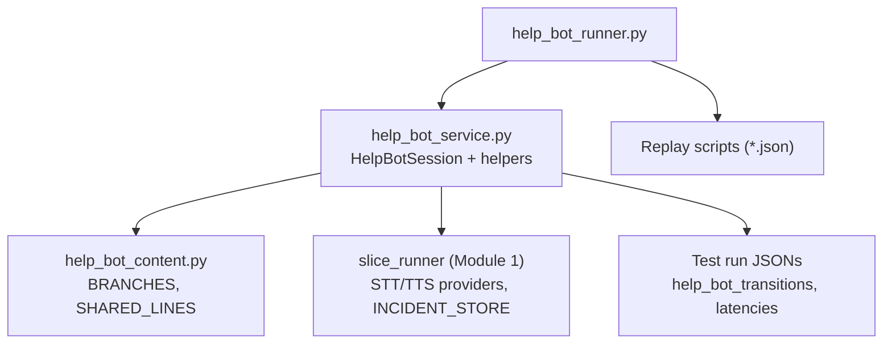
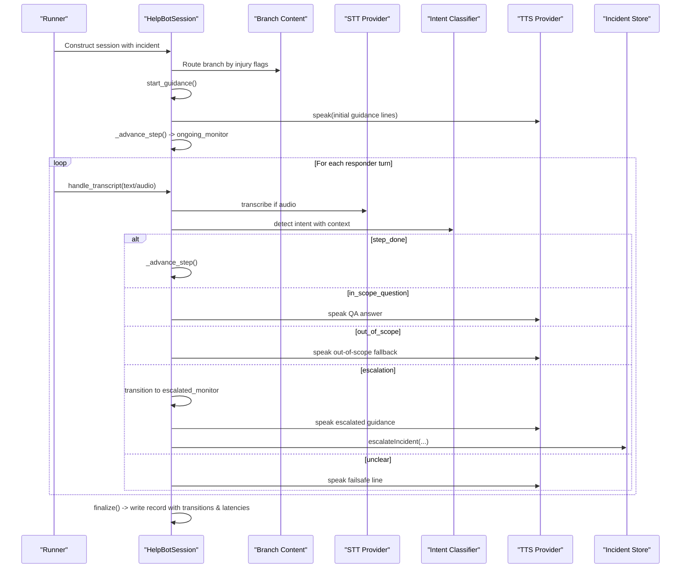
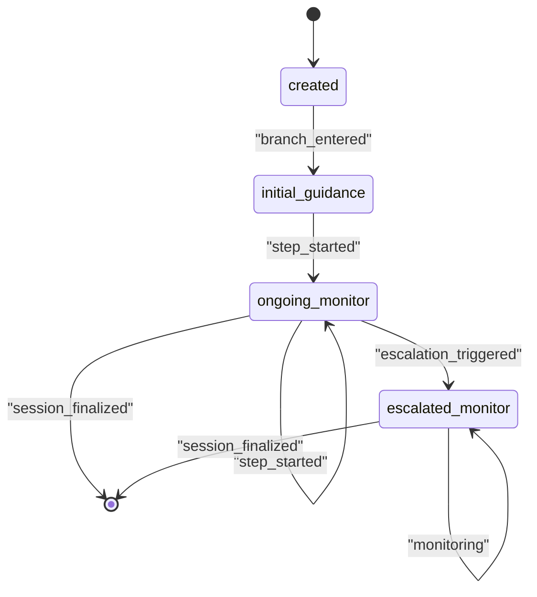
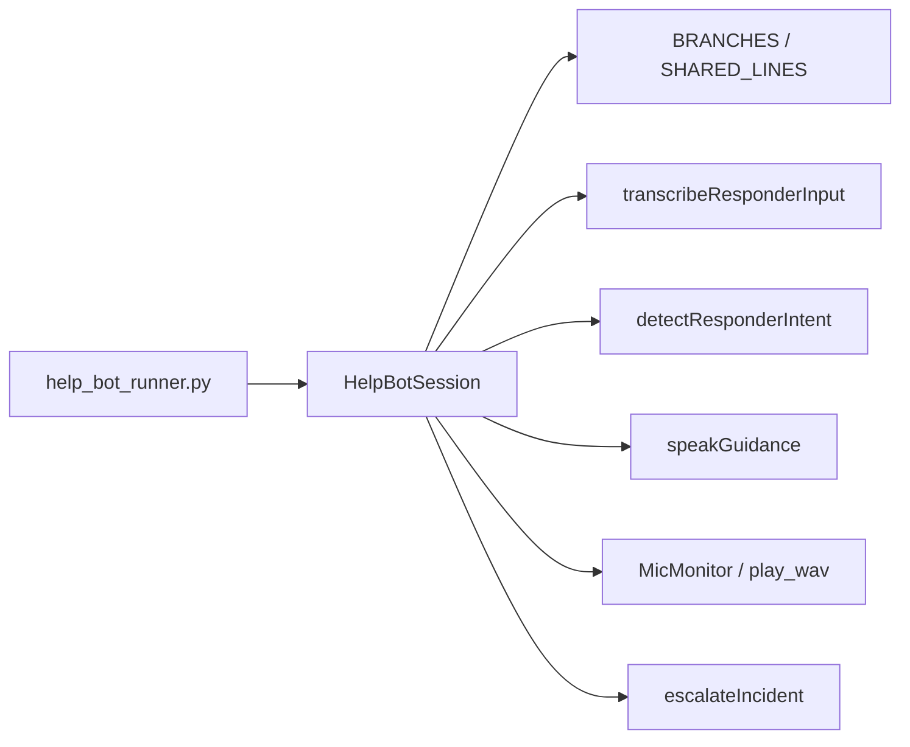

# Conversation State Machine

<cite>
**Referenced Files in This Document**
- [help_bot_service.py](file://backend/services/help_bot_service.py)
- [help_bot_content.py](file://backend/services/help_bot_content.py)
- [help_bot_runner.py](file://backend/help_bot_runner.py)
- [heavy_bleeding.json](file://mockdata/helpbot/scripts/heavy_bleeding.json)
- [INC-SIM-HEAVY-BLEEDING_replay_1788076550.json](file://mockdata/helpbot/test_runs/INC-SIM-HEAVY-BLEEDING_replay_1788076550.json)
</cite>

## Table of Contents
1. [Introduction](#introduction)
2. [Project Structure](#project-structure)
3. [Core Components](#core-components)
4. [Architecture Overview](#architecture-overview)
5. [Detailed Component Analysis](#detailed-component-analysis)
6. [Dependency Analysis](#dependency-analysis)
7. [Performance Considerations](#performance-considerations)
8. [Troubleshooting Guide](#troubleshooting-guide)
9. [Conclusion](#conclusion)

## Introduction
This document explains the conversation state machine implemented by the HelpBotSession class that manages responder guidance sessions for a voice-first, Urdu-only first-aid assistant. It focuses on the three-state system (initial_guidance, ongoing_monitor, escalated_monitor), how transitions occur between states, and how branch-specific protocols are followed step-by-step. It also documents integration with incident tracking via help_bot_transitions logging, relationship to branch routing, error handling patterns, latency tracking, and failsafe mechanisms that keep the session running even when AI services fail.

## Project Structure
The conversation engine is implemented in the backend services layer and driven by a console runner:
- The service module implements STT, intent classification, TTS, audio I/O, escalation hooks, and the HelpBotSession state machine.
- The content module defines all scripted lines and branch flows (initial guidance, steps, Q&A, escalation guidance).
- The runner orchestrates simulation or live modes, runs replay scripts, and writes final records including transitions and latencies.

**Diagram sources**
- [help_bot_runner.py:175-236](file://backend/help_bot_runner.py#L175-L236)
- [help_bot_service.py:663-960](file://backend/services/help_bot_service.py#L663-L960)
- [help_bot_content.py:21-255](file://backend/services/help_bot_content.py#L21-L255)

**Section sources**
- [help_bot_runner.py:1-241](file://backend/help_bot_runner.py#L1-L241)
- [help_bot_service.py:1-960](file://backend/services/help_bot_service.py#L1-L960)
- [help_bot_content.py:1-255](file://backend/services/help_bot_content.py#L1-L255)

## Core Components
- HelpBotSession: owns one incident’s guidance session, maintains state, step index, turns, latencies, and expectations; drives initial guidance, step advancement, monitoring, and escalation.
- Branch routing: maps incident injury flags to a knowledge branch (heavy_bleeding, fracture_crush, snakebite) using keyword matching.
- Provider boundaries: STT (transcribeResponderInput), intent detection (detectResponderIntent), and TTS (speakGuidance) are isolated behind provider selection and retries.
- Escalation hook: escalateIncident updates severity tier, flags, BHU notification, ambulance request, and appends an escalation event to help_bot_transitions.
- Audio I/O: MicMonitor captures utterances with VAD and barge-in; playback supports interruption and best-effort operation without hardware.

Key responsibilities:
- Deliver initial guidance from the branch, then advance through scripted steps.
- Classify each responder turn into intents: step_done, in_scope_question, out_of_scope, escalation, unclear.
- Transition states and log every transition with timestamps, triggers, and optional latency.
- Persist evidence: turns, expectations, latencies, and help_bot_transitions in test run JSONs.

**Section sources**
- [help_bot_service.py:90-117](file://backend/services/help_bot_service.py#L90-L117)
- [help_bot_service.py:127-168](file://backend/services/help_bot_service.py#L127-L168)
- [help_bot_service.py:200-289](file://backend/services/help_bot_service.py#L200-L289)
- [help_bot_service.py:307-387](file://backend/services/help_bot_service.py#L307-L387)
- [help_bot_service.py:456-570](file://backend/services/help_bot_service.py#L456-L570)
- [help_bot_service.py:576-657](file://backend/services/help_bot_service.py#L576-L657)
- [help_bot_service.py:663-960](file://backend/services/help_bot_service.py#L663-L960)
- [help_bot_content.py:21-255](file://backend/services/help_bot_content.py#L21-L255)

## Architecture Overview
The session lifecycle follows a strict decision tree while keeping spoken content hardcoded. AI is used only for ears (STT) and routing (intent classification).

**Diagram sources**
- [help_bot_service.py:663-960](file://backend/services/help_bot_service.py#L663-L960)
- [help_bot_content.py:46-255](file://backend/services/help_bot_content.py#L46-L255)
- [help_bot_runner.py:175-236](file://backend/help_bot_runner.py#L175-L236)

## Detailed Component Analysis

### HelpBotSession State Machine
States:
- created: initialization before any guidance delivered.
- initial_guidance: delivering branch-specific introductory lines.
- ongoing_monitor: stepping through scripted instructions; waiting for step completion signals.
- escalated_monitor: after escalation detected; delivering escalated guidance and updating incident.

Transitions:
- created -> initial_guidance: triggered by branch_entered when starting guidance.
- initial_guidance -> ongoing_monitor: triggered by step_started when moving to the first step.
- ongoing_monitor -> ongoing_monitor: repeated step_started as steps advance.
- ongoing_monitor -> escalated_monitor: triggered by escalation_triggered when intent indicates worsening condition.
- escalated_monitor -> escalated_monitor: continued monitoring until session_finalized.
- Any state -> session_finalized: finalized at end of run.

Step progression:
- start_guidance delivers initial guidance lines, then advances to step 1.
- _advance_step increments step_index, speaks the next step line, and logs a step_started transition.
- When all steps are delivered, it speaks a session-complete line and remains in ongoing_monitor until escalation or finalization.

Turn handling:
- handle_transcript records the turn, detects intent (or defaults to unclear if empty), and delegates to _act_on_intent.
- _act_on_intent branches on intent:
  - step_done: advances to next step.
  - in_scope_question: answers with pre-defined QA entry.
  - out_of_scope: responds with honest fallback.
  - escalation: transitions to escalated_monitor, speaks escalated guidance, calls escalateIncident.
  - unclear: speaks failsafe line and continues.

**Diagram sources**
- [help_bot_service.py:663-960](file://backend/services/help_bot_service.py#L663-L960)

**Section sources**
- [help_bot_service.py:663-960](file://backend/services/help_bot_service.py#L663-L960)

### Branch Routing and Protocols
Routing:
- route_branch maps incident.injury_type_flags to a branch id using keyword sets (snakebite, fracture_crush, heavy_bleeding). If no match, defaults to heavy_bleeding for safety.

Protocols per branch:
- Each branch defines initial_guidance lines, ordered steps with step_id and line, qa_entries with hints and answers, escalation_signals, and escalated_guidance lines.
- The session uses these to deliver structured guidance and respond to questions within scope.

Example flow (heavy_bleeding):
- Initial guidance introduces the bot and instructs immediate pressure on wound.
- Steps: direct pressure, elevate, add cloth over soaked bandage.
- Q&A covers common concerns (e.g., soaked cloth, pressure intensity).
- Escalation triggers include uncontrolled bleeding or unconsciousness; escalated guidance includes tourniquet advice and positioning.

Concrete example references:
- Replay script defines expected intents for each turn.
- Test run JSON shows transitions from created to initial_guidance, then multiple step_started transitions, and finally session_finalized.

**Section sources**
- [help_bot_service.py:90-117](file://backend/services/help_bot_service.py#L90-L117)
- [help_bot_content.py:46-255](file://backend/services/help_bot_content.py#L46-L255)
- [heavy_bleeding.json:1-11](file://mockdata/helpbot/scripts/heavy_bleeding.json#L1-L11)
- [INC-SIM-HEAVY-BLEEDING_replay_1788076550.json:167-200](file://mockdata/helpbot/test_runs/INC-SIM-HEAVY-BLEEDING_replay_1788076550.json#L167-L200)

### Integration with Incident Tracking and help_bot_transitions
Every state change is recorded via _transition, which appends an entry to incident.help_bot_transitions with timestamp, branch, from_state, to_state, trigger_type, detail, and optional latency_ms. The session also syncs the incident snapshot to INCIDENT_STORE so logs remain inspectable.

Escalation integration:
- When escalation is detected, escalateIncident upgrades severity_tier (never downgrades), merges new injury flags, flags BHU notification and ambulance request when appropriate, and appends an escalation event to help_bot_transitions.

Evidence output:
- finalize writes a comprehensive record including turns, expectations, latencies, help_bot_transitions, and final_incident to test_runs directory.

**Section sources**
- [help_bot_service.py:696-711](file://backend/services/help_bot_service.py#L696-L711)
- [help_bot_service.py:576-657](file://backend/services/help_bot_service.py#L576-L657)
- [help_bot_service.py:929-960](file://backend/services/help_bot_service.py#L929-L960)
- [INC-SIM-HEAVY-BLEEDING_replay_1788076550.json:167-200](file://mockdata/helpbot/test_runs/INC-SIM-HEAVY-BLEEDING_replay_1788076550.json#L167-L200)

### Turn Handling and Session Lifecycle
- start_guidance: enters initial_guidance state, speaks initial lines, then advances to step 1.
- run_replay: deterministic harness that processes scripted turns; text turns skip STT, audio turns exercise real STT path; TTS always uses cached files.
- run_mic: live hands-free loop with continuous listening, barge-in support, periodic check-ins during silence, and graceful finalization.
- finalize: records session_finalized transition, computes latency summaries, and writes the full record.

Latency tracking:
- Per-turn latency metrics capture detect_ms (time to classify intent), respond_ms (utterance end to first playback start), and turn_wall_ms (full wall time). First playback delay is measured once per turn to reflect perceived latency.

**Section sources**
- [help_bot_service.py:760-783](file://backend/services/help_bot_service.py#L760-L783)
- [help_bot_service.py:786-831](file://backend/services/help_bot_service.py#L786-L831)
- [help_bot_service.py:878-925](file://backend/services/help_bot_service.py#L878-L925)
- [help_bot_service.py:929-960](file://backend/services/help_bot_service.py#L929-L960)

### Error Handling and Failsafe Mechanisms
Provider failures:
- STT and intent detection wrap calls in try/except; on failure, returns unusable or unclear intent respectively, ensuring the session never halts.
- TTS failures fall back to a pre-rendered failsafe line; if rendering fails, printed Urdu text is shown and playback may be skipped.

Failsafe behavior:
- Pre-renders failsafe audio at session start to avoid network dependency during errors.
- Unclear input or STT failure triggers the failsafe line and continues the loop.
- Playback best-effort: if audio hardware is unavailable, playback is skipped but transcript and saved wav still serve as evidence.

**Section sources**
- [help_bot_service.py:159-168](file://backend/services/help_bot_service.py#L159-L168)
- [help_bot_service.py:274-289](file://backend/services/help_bot_service.py#L274-L289)
- [help_bot_service.py:368-387](file://backend/services/help_bot_service.py#L368-L387)
- [help_bot_service.py:405-444](file://backend/services/help_bot_service.py#L405-L444)
- [help_bot_service.py:689-695](file://backend/services/help_bot_service.py#L689-L695)
- [help_bot_service.py:727-757](file://backend/services/help_bot_service.py#L727-L757)

## Dependency Analysis
The HelpBotSession depends on:
- Branch content definitions for scripted guidance and Q&A.
- Provider boundary functions for STT, intent classification, and TTS.
- Audio I/O utilities for capture and playback.
- Escalation hook to update incidents and log transitions.
- Runner for orchestration and test run outputs.

**Diagram sources**
- [help_bot_service.py:663-960](file://backend/services/help_bot_service.py#L663-L960)
- [help_bot_content.py:21-255](file://backend/services/help_bot_content.py#L21-L255)
- [help_bot_runner.py:175-236](file://backend/help_bot_runner.py#L175-L236)

**Section sources**
- [help_bot_service.py:663-960](file://backend/services/help_bot_service.py#L663-L960)
- [help_bot_content.py:21-255](file://backend/services/help_bot_content.py#L21-L255)
- [help_bot_runner.py:175-236](file://backend/help_bot_runner.py#L175-L236)

## Performance Considerations
- TTS caching: All scripted lines are cached to disk; subsequent runs hit cache, avoiding quota usage and ensuring determinism. Prewarming renders all lines ahead of time.
- Latency measurement: respond_ms measures perceived delay (utterance end to playback start); detect_ms isolates classifier overhead; turn_wall_ms captures total wall time.
- Rate limiting: Prewarm pacing avoids exceeding free-tier quotas; retries with delays ensure robustness.
- Audio efficiency: VAD-based capture reduces unnecessary processing; barge-in prevents redundant playback.

[No sources needed since this section provides general guidance]

## Troubleshooting Guide
Common issues and resolutions:
- STT unusable: The session falls back to failsafe line and continues; verify audio quality and environment noise calibration.
- Intent misclassification: Check recent context and current step line passed to classifier; review QA hints and escalation signals in branch content.
- TTS failures: Ensure TTS cache exists; if not, prewarm cache; otherwise, failsafe audio will be used.
- No audio device: Playback is skipped; transcripts and saved wav files remain as evidence.
- Escalation not triggering: Confirm escalation signals match branch definitions; verify intent detection returns escalation intent with proper signal and suggested tier.

Operational checks:
- Inspect help_bot_transitions in test run JSONs for state changes and triggers.
- Review latency_summary_ms to identify bottlenecks (classifier vs. TTS vs. playback).
- Validate expectations against actual intents in replay scripts to ensure correct routing.

**Section sources**
- [help_bot_service.py:159-168](file://backend/services/help_bot_service.py#L159-L168)
- [help_bot_service.py:274-289](file://backend/services/help_bot_service.py#L274-L289)
- [help_bot_service.py:368-387](file://backend/services/help_bot_service.py#L368-L387)
- [help_bot_service.py:405-444](file://backend/services/help_bot_service.py#L405-L444)
- [help_bot_service.py:929-960](file://backend/services/help_bot_service.py#L929-L960)
- [INC-SIM-HEAVY-BLEEDING_replay_1788076550.json:97-166](file://mockdata/helpbot/test_runs/INC-SIM-HEAVY-BLEEDING_replay_1788076550.json#L97-L166)

## Conclusion
The HelpBotSession implements a robust, deterministic conversation state machine that guides responders through branch-specific protocols while maintaining strict separation between decision logic and scripted content. Transitions are consistently logged to help_bot_transitions, enabling traceability and auditability. The system integrates tightly with incident tracking, escalates appropriately, and ensures continuous operation through failsafe mechanisms and resilient provider boundaries. Latency tracking and TTS caching optimize performance and reliability, making the session suitable for both replay verification and live deployment.

[No sources needed since this section summarizes without analyzing specific files]