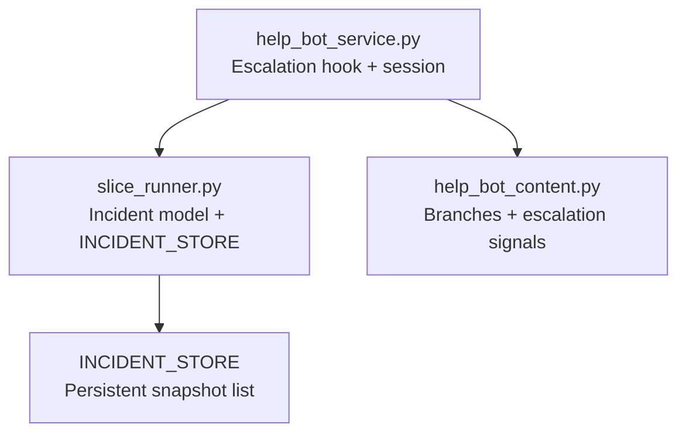
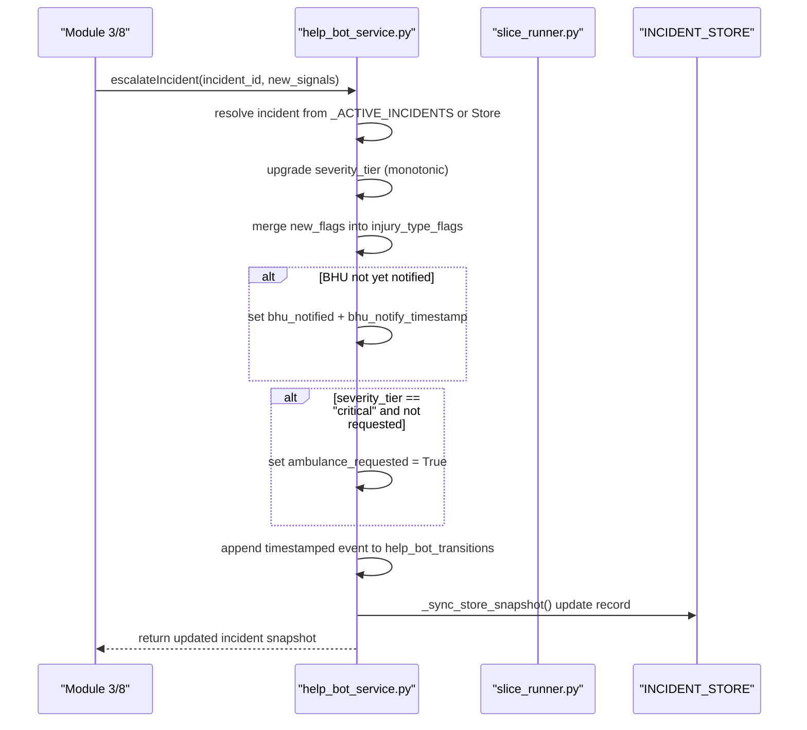
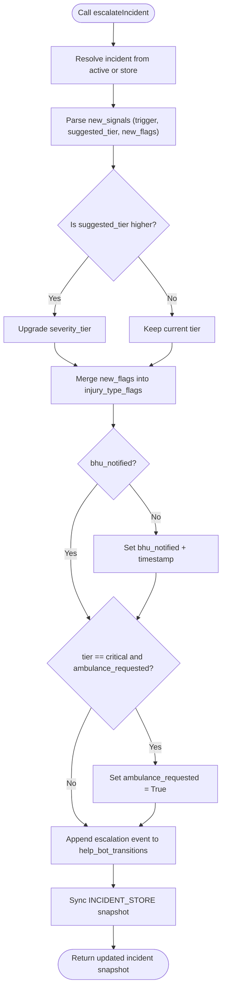
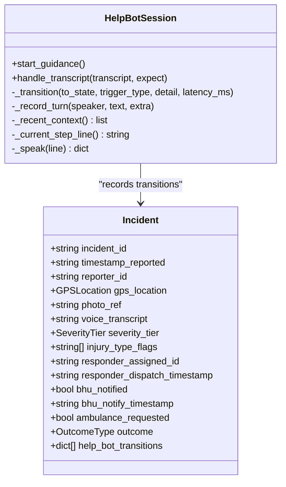
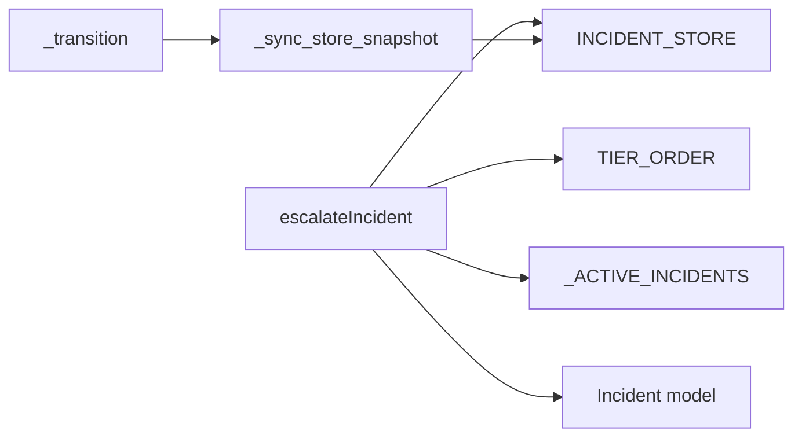

# Escalation Handling & Incident Updates

<cite>
**Referenced Files in This Document**
- [help_bot_service.py](file://backend/services/help_bot_service.py)
- [slice_runner.py](file://backend/slice_runner.py)
- [help_bot_content.py](file://backend/services/help_bot_content.py)
- [MODULE2_HELPBOT_REPORT.md](file://MODULE2_HELPBOT_REPORT.md)
</cite>

## Table of Contents
1. [Introduction](#introduction)
2. [Project Structure](#project-structure)
3. [Core Components](#core-components)
4. [Architecture Overview](#architecture-overview)
5. [Detailed Component Analysis](#detailed-component-analysis)
6. [Dependency Analysis](#dependency-analysis)
7. [Performance Considerations](#performance-considerations)
8. [Troubleshooting Guide](#troubleshooting-guide)
9. [Conclusion](#conclusion)

## Introduction
This document explains the escalation handling system for mid-session incident severity updates and BHU coordination. It focuses on the escalateIncident function as the clean integration point for future dispatch modules, detailing how it upgrades severity tiers, merges injury flags, triggers BHU notifications, and automatically requests ambulances for critical cases. It also documents the transition logging system that captures escalation events with timestamps, triggers, and details, and clarifies how active incidents remain consistent with INCIDENT_STORE snapshots. Finally, it outlines fail-safe mechanisms that maintain stability during escalation and the audit trail provided for post-incident analysis.

## Project Structure
The escalation logic lives in the help bot service and integrates with the core incident model and store defined in the slice runner. The help bot content module provides scripted guidance and escalation signals used by the conversation engine.

**Diagram sources**
- [help_bot_service.py:576-659](file://backend/services/help_bot_service.py#L576-L659)
- [slice_runner.py:170-188](file://backend/slice_runner.py#L170-L188)
- [slice_runner.py:277-277](file://backend/slice_runner.py#L277-L277)
- [help_bot_content.py:107-118](file://backend/services/help_bot_content.py#L107-L118)

**Section sources**
- [help_bot_service.py:576-659](file://backend/services/help_bot_service.py#L576-L659)
- [slice_runner.py:170-188](file://backend/slice_runner.py#L170-L188)
- [slice_runner.py:277-277](file://backend/slice_runner.py#L277-L277)
- [help_bot_content.py:107-118](file://backend/services/help_bot_content.py#L107-L118)

## Core Components
- Escalation hook: escalateIncident is the single integration point for Module 3 (dispatch/matching) and Module 8 (escalation). It upgrades severity tiers monotonically, merges new injury flags, marks BHU notification, and auto-requests ambulance when the tier becomes critical. It appends a timestamped escalation event to the incident’s transition log and refreshes the INCIDENT_STORE snapshot.
- Incident model and store: The Incident model defines fields such as severity_tier, injury_type_flags, bhu_notified, bhu_notify_timestamp, ambulance_requested, and help_bot_transitions. INCIDENT_STORE holds immutable logs of each incident lifecycle; help_bot_synced_at tracks when the live session state was last synced into the store.
- Help bot session: Maintains an in-memory registry of active incidents (_ACTIVE_INCIDENTS), routes branches based on injury flags, and records transitions via _transition and _sync_store_snapshot.

**Section sources**
- [help_bot_service.py:576-659](file://backend/services/help_bot_service.py#L576-L659)
- [slice_runner.py:170-188](file://backend/slice_runner.py#L170-L188)
- [slice_runner.py:277-277](file://backend/slice_runner.py#L277-L277)
- [help_bot_service.py:663-718](file://backend/services/help_bot_service.py#L663-L718)

## Architecture Overview
The escalation flow integrates the help bot session with the core incident model and store. When an escalation signal arrives, escalateIncident resolves the incident from either the active session or the store, applies monotonic tier upgrades, merges flags, sets BHU notification and ambulance request flags if needed, records a transition event, and syncs the store snapshot.

**Diagram sources**
- [help_bot_service.py:576-659](file://backend/services/help_bot_service.py#L576-L659)
- [slice_runner.py:170-188](file://backend/slice_runner.py#L170-L188)
- [slice_runner.py:277-277](file://backend/slice_runner.py#L277-L277)

## Detailed Component Analysis

### Escalation Hook: escalateIncident
- Purpose: Clean integration point for future dispatch and escalation modules; callers should invoke this function rather than mutate incident state directly.
- Inputs: incident_id (str), new_signals (dict) containing trigger, suggested_tier, new_flags, transcript_excerpt.
- Behavior:
  - Resolves the incident from active sessions or INCIDENT_STORE; raises a clear error if unknown.
  - Upgrades severity_tier only if suggested_tier is higher per TIER_ORDER; never downgrades.
  - Merges new_flags additively into injury_type_flags.
  - Sets BHU notification flags if not already set.
  - Automatically sets ambulance_requested when severity_tier becomes critical.
  - Appends a timestamped escalation event to help_bot_transitions with trigger, old/new tier, transcript excerpt, and new flags.
  - Syncs the INCIDENT_STORE snapshot so logs remain inspectable and current.
- Outputs: Updated incident snapshot (dict).

**Diagram sources**
- [help_bot_service.py:576-659](file://backend/services/help_bot_service.py#L576-L659)

**Section sources**
- [help_bot_service.py:576-659](file://backend/services/help_bot_service.py#L576-L659)

### Severity Tiers and Monotonicity
- TIER_ORDER defines the allowed tiers and their ordering: minor < moderate < critical.
- Escalation enforces monotonic upgrades: only higher tiers are applied; no downgrade occurs.
- Suggested tier must be present in TIER_ORDER to be considered.

**Section sources**
- [help_bot_service.py:49-49](file://backend/services/help_bot_service.py#L49-L49)
- [help_bot_service.py:608-611](file://backend/services/help_bot_service.py#L608-L611)

### Injury Flag Merging
- New flags are merged additively into injury_type_flags.
- Duplicate flags are avoided by checking membership before appending.

**Section sources**
- [help_bot_service.py:613-616](file://backend/services/help_bot_service.py#L613-L616)

### BHU Coordination and Automatic Ambulance Request
- BHU Notification: If bhu_notified is False, it is set to True along with bhu_notify_timestamp. This serves as a dispatch-intent marker for Module 3.
- Ambulance Request: If severity_tier becomes critical and ambulance_requested is False, it is set to True. This ensures immediate ambulance request for critical cases during escalation.

**Section sources**
- [help_bot_service.py:618-627](file://backend/services/help_bot_service.py#L618-L627)

### Transition Logging System
- Each escalation appends a structured event to help_bot_transitions:
  - Fields include timestamp, branch (null for escalation hook), from_state, to_state, trigger_type, and detail (trigger, old_tier, new_tier, transcript_excerpt, new_flags).
- The session’s _transition helper similarly records transitions for branch entry, steps, and finalization, always syncing the store snapshot afterward.

**Diagram sources**
- [slice_runner.py:170-188](file://backend/slice_runner.py#L170-L188)
- [help_bot_service.py:696-718](file://backend/services/help_bot_service.py#L696-L718)

**Section sources**
- [help_bot_service.py:629-647](file://backend/services/help_bot_service.py#L629-L647)
- [help_bot_service.py:696-718](file://backend/services/help_bot_service.py#L696-L718)

### Active Incidents vs INCIDENT_STORE Consistency
- Active incidents are tracked in _ACTIVE_INCIDENTS for in-memory mutation during sessions.
- On escalation or session transitions, _sync_store_snapshot updates the corresponding INCIDENT_STORE record to reflect live state and records help_bot_synced_at.
- This ensures logs remain inspectable without duplicating state storage.

**Section sources**
- [help_bot_service.py:595-604](file://backend/services/help_bot_service.py#L595-L604)
- [help_bot_service.py:650-657](file://backend/services/help_bot_service.py#L650-L657)
- [slice_runner.py:277-277](file://backend/slice_runner.py#L277-L277)

### Fail-Safe Mechanisms During Escalation
- Unknown incident_id: Raises a KeyError with a descriptive message, preventing silent failures.
- Provider failures elsewhere in the help bot pipeline fall back to pre-rendered Urdu failsafe lines; escalation itself remains deterministic and safe.
- Monotonic tier upgrades prevent accidental downgrades even if downstream components misclassify.

**Section sources**
- [help_bot_service.py:595-604](file://backend/services/help_bot_service.py#L595-L604)
- [help_bot_service.py:689-694](file://backend/services/help_bot_service.py#L689-L694)
- [help_bot_service.py:405-444](file://backend/services/help_bot_service.py#L405-L444)

### Audit Trail for Incident Analysis
- help_bot_transitions capture every significant state change with timestamps, triggers, and details.
- INCIDENT_STORE records include the full incident snapshot plus dispatch_status and logged_at; help_bot_synced_at indicates when the session state was last reflected in the store.
- Test replay files demonstrate real-world transition sequences including escalation events.

**Section sources**
- [slice_runner.py:665-672](file://backend/slice_runner.py#L665-L672)
- [help_bot_service.py:696-718](file://backend/services/help_bot_service.py#L696-L718)

## Dependency Analysis
- escalateIncident depends on:
  - TIER_ORDER for monotonic tier checks.
  - _ACTIVE_INCIDENTS for fast resolution of in-progress sessions.
  - INCIDENT_STORE for fallback resolution and snapshot synchronization.
  - Incident model fields for flag merging and status updates.
- Session transitions depend on _sync_store_snapshot to keep logs consistent.

**Diagram sources**
- [help_bot_service.py:49-49](file://backend/services/help_bot_service.py#L49-L49)
- [help_bot_service.py:595-604](file://backend/services/help_bot_service.py#L595-L604)
- [help_bot_service.py:650-657](file://backend/services/help_bot_service.py#L650-L657)
- [slice_runner.py:170-188](file://backend/slice_runner.py#L170-L188)
- [slice_runner.py:277-277](file://backend/slice_runner.py#L277-L277)

**Section sources**
- [help_bot_service.py:49-49](file://backend/services/help_bot_service.py#L49-L49)
- [help_bot_service.py:595-604](file://backend/services/help_bot_service.py#L595-L604)
- [help_bot_service.py:650-657](file://backend/services/help_bot_service.py#L650-L657)
- [slice_runner.py:170-188](file://backend/slice_runner.py#L170-L188)
- [slice_runner.py:277-277](file://backend/slice_runner.py#L277-L277)

## Performance Considerations
- Escalation operations are lightweight: dictionary lookups, list appends, and simple comparisons.
- _sync_store_snapshot iterates INCIDENT_STORE; for large stores, consider indexing by incident_id to avoid linear scans.
- Avoid excessive escalation calls; batch signals where possible to reduce repeated syncs.

[No sources needed since this section provides general guidance]

## Troubleshooting Guide
- Unknown incident_id: Ensure the incident exists in either active sessions or INCIDENT_STORE before calling escalateIncident.
- No tier upgrade: Verify suggested_tier is valid and strictly higher than current severity_tier.
- Missing flags: Confirm new_flags are strings and not duplicates; they will be added only if absent.
- BHU not notified: Check bhu_notified and bhu_notify_timestamp after escalation; ensure Module 3 picks up these markers.
- Ambulance not requested: Confirm severity_tier reached critical; otherwise ambulance_requested remains False.
- Transition log missing: Inspect help_bot_transitions for the latest event; verify _sync_store_snapshot ran successfully.

**Section sources**
- [help_bot_service.py:595-604](file://backend/services/help_bot_service.py#L595-L604)
- [help_bot_service.py:608-616](file://backend/services/help_bot_service.py#L608-L616)
- [help_bot_service.py:618-627](file://backend/services/help_bot_service.py#L618-L627)
- [help_bot_service.py:629-647](file://backend/services/help_bot_service.py#L629-L647)

## Conclusion
The escalateIncident function provides a robust, monotonic escalation mechanism that integrates seamlessly with the help bot session and core incident model. It ensures BHU coordination and automatic ambulance requests for critical cases while maintaining a comprehensive audit trail through help_bot_transitions and INCIDENT_STORE snapshots. Fail-safe behaviors protect system stability, and the design cleanly separates concerns for future dispatch and escalation modules.

[No sources needed since this section summarizes without analyzing specific files]