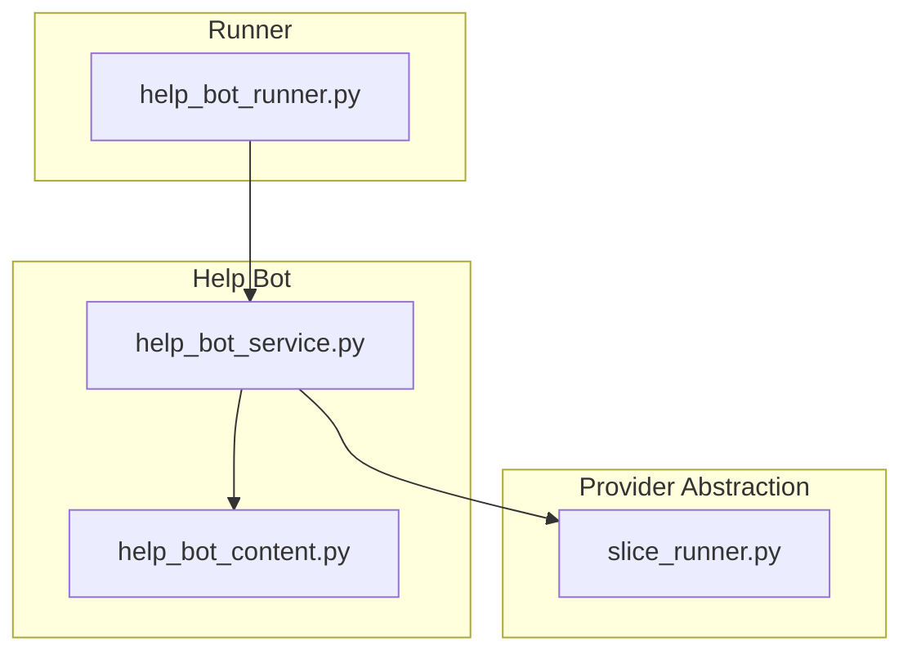
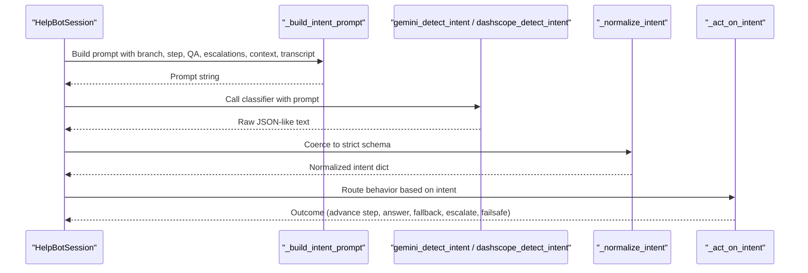
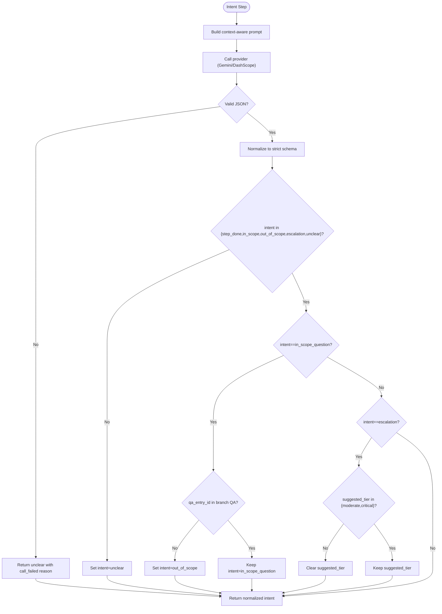
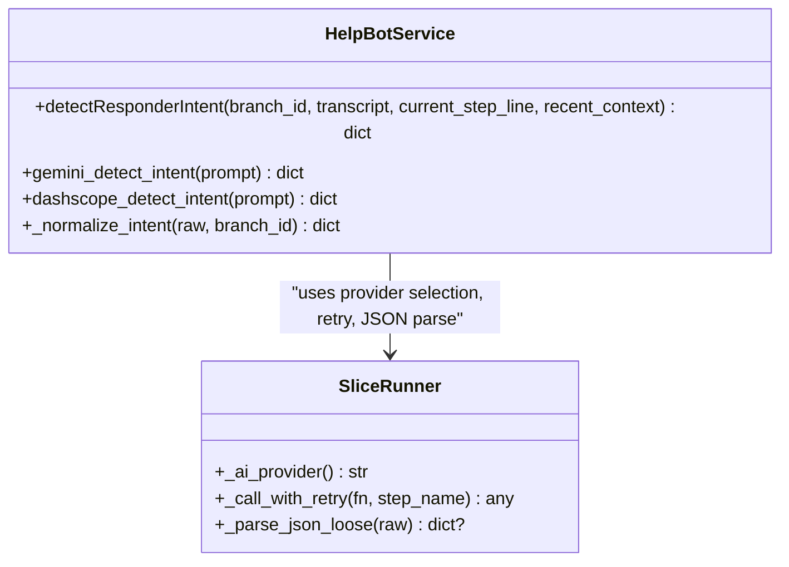
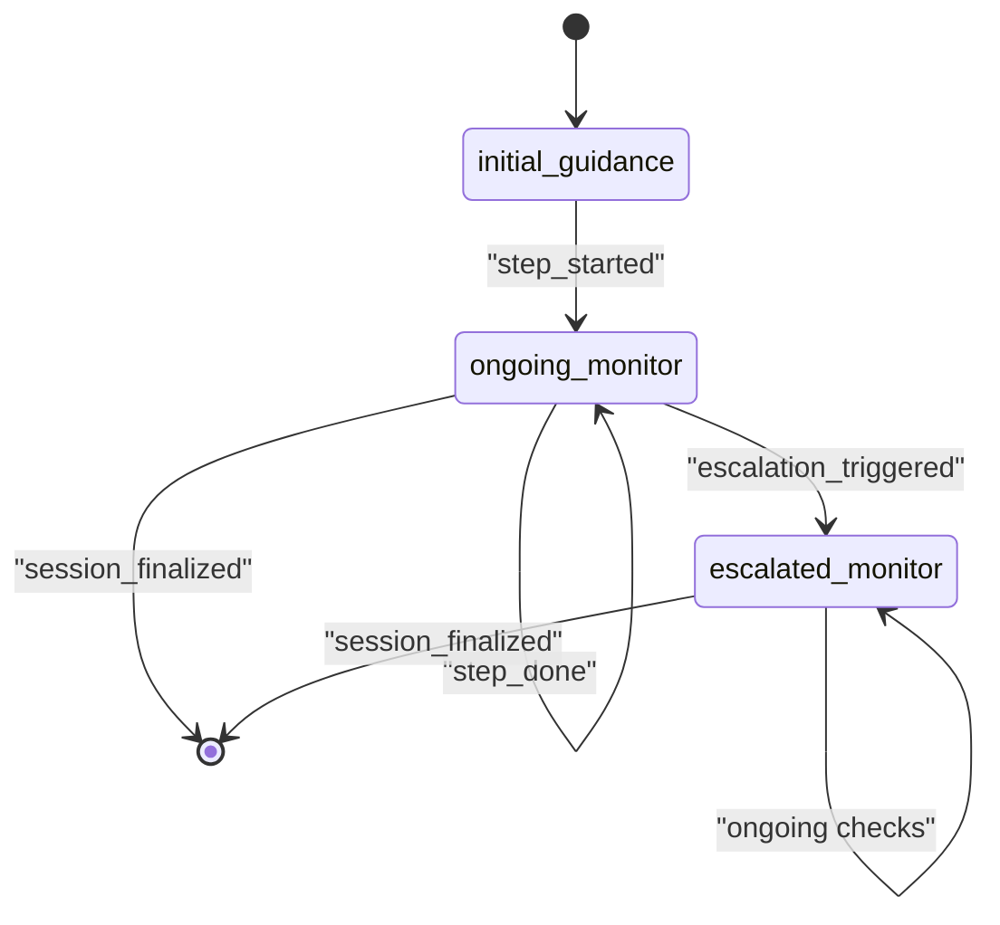
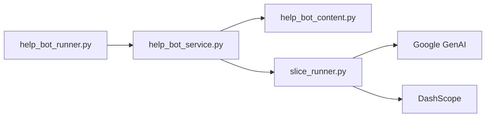

# Intent Classification System

<cite>
**Referenced Files in This Document**
- [help_bot_service.py](file://backend/services/help_bot_service.py)
- [help_bot_content.py](file://backend/services/help_bot_content.py)
- [slice_runner.py](file://backend/slice_runner.py)
- [help_bot_runner.py](file://backend/help_bot_runner.py)
</cite>

## Table of Contents
1. [Introduction](#introduction)
2. [Project Structure](#project-structure)
3. [Core Components](#core-components)
4. [Architecture Overview](#architecture-overview)
5. [Detailed Component Analysis](#detailed-component-analysis)
6. [Dependency Analysis](#dependency-analysis)
7. [Performance Considerations](#performance-considerations)
8. [Troubleshooting Guide](#troubleshooting-guide)
9. [Conclusion](#conclusion)

## Introduction
This document explains the intent classification system that powers an AI-assisted, voice-first Urdu help bot for first responders. The system classifies each responder utterance into one of five intents and uses context-aware prompts to route responses safely and deterministically. It supports two AI providers (Gemini and DashScope) behind a clean abstraction, enforces strict JSON schema validation on classifier outputs, and includes robust error handling so the conversation never stalls.

The five-intent schema:
- step_done: Responder confirms completion or asks for the next instruction.
- in_scope_question: A question covered by the branch’s Q&A entries; maps to a specific qa_entry_id.
- out_of_scope: Any question not covered by the branch’s knowledge base.
- escalation: Patient is deteriorating or an escalation signal is reported; may suggest tier upgrade.
- unclear: Empty, noisy, or unintelligible input.

## Project Structure
The intent classification system lives in the backend services and integrates with shared provider utilities:
- Services layer:
  - help_bot_service.py: Conversation engine, prompt construction, provider selection, normalization, session state machine, and escalation hook.
  - help_bot_content.py: Hardcoded Urdu guidance content, branches, steps, Q&A entries, escalation signals, and shared lines.
- Provider abstraction:
  - slice_runner.py: Shared client setup, retry/timeout helpers, provider selection, JSON parsing, and STT/vision/classifier implementations used elsewhere.
- Runner:
  - help_bot_runner.py: CLI entrypoint for replay/mic modes, TTS prewarming, and verification.

**Diagram sources**
- [help_bot_service.py:170-289](file://backend/services/help_bot_service.py#L170-L289)
- [help_bot_content.py:21-255](file://backend/services/help_bot_content.py#L21-L255)
- [slice_runner.py:132-154](file://backend/slice_runner.py#L132-L154)
- [help_bot_runner.py:175-236](file://backend/help_bot_runner.py#L175-L236)

**Section sources**
- [help_bot_service.py:1-960](file://backend/services/help_bot_service.py#L1-L960)
- [help_bot_content.py:1-255](file://backend/services/help_bot_content.py#L1-L255)
- [slice_runner.py:1-745](file://backend/slice_runner.py#L1-L745)
- [help_bot_runner.py:1-241](file://backend/help_bot_runner.py#L1-L241)

## Core Components
- Intent detection pipeline:
  - Prompt builder composes branch context, current step, Q&A hints, escalation signals, recent conversation, and the latest transcript.
  - Provider dispatch selects Gemini or DashScope based on environment configuration.
  - Strict normalization coerces model output into a fixed schema; invalid or missing fields fall back to safe defaults.
- Branch routing and content:
  - Injury flags map to a branch (heavy_bleeding, fracture_crush, snakebite).
  - Each branch defines initial guidance, steps, Q&A entries, escalation signals, and escalated guidance.
- Session state machine:
  - Transitions between initial guidance, ongoing monitoring, and escalated monitoring.
  - Actions per intent advance steps, answer questions, provide honest fallbacks, escalate incidents, or speak fail-safe lines.
- Escalation hook:
  - Updates severity tier, merges injury flags, marks BHU notification and ambulance request when appropriate, and logs transitions.

**Section sources**
- [help_bot_service.py:64-70](file://backend/services/help_bot_service.py#L64-L70)
- [help_bot_service.py:174-289](file://backend/services/help_bot_service.py#L174-L289)
- [help_bot_content.py:46-255](file://backend/services/help_bot_content.py#L46-L255)
- [help_bot_service.py:576-648](file://backend/services/help_bot_service.py#L576-L648)

## Architecture Overview
The intent classification flow is a provider-agnostic boundary around a single responsibility: classify the responder’s latest utterance into one of five intents using a context-rich prompt and return a normalized JSON object.

**Diagram sources**
- [help_bot_service.py:200-289](file://backend/services/help_bot_service.py#L200-L289)
- [help_bot_service.py:786-875](file://backend/services/help_bot_service.py#L786-L875)

## Detailed Component Analysis

### Intent Detection and Prompt Construction
- Context-aware prompt composition:
  - Branch title and id.
  - Current step line (or “initial guidance” if none yet).
  - Q&A entries for the branch, formatted as id :: hints.
  - Escalation signals for the branch.
  - Recent conversation history (last six turns).
  - Latest transcript appended at the end.
- Provider selection:
  - gemini_detect_intent uses the Gemini client with a configurable model.
  - dashscope_detect_intent uses DashScope Generation with a configurable model.
- Strict JSON validation and normalization:
  - Only accepted intents are allowed; others default to unclear.
  - For in_scope_question, qa_entry_id must match a valid entry; otherwise treated as out_of_scope to avoid guessing answers.
  - Escalation_signal and suggested_tier are validated only when intent is escalation.
  - Reason is truncated to a safe length.

**Diagram sources**
- [help_bot_service.py:200-241](file://backend/services/help_bot_service.py#L200-L241)
- [help_bot_service.py:244-289](file://backend/services/help_bot_service.py#L244-L289)

**Section sources**
- [help_bot_service.py:174-289](file://backend/services/help_bot_service.py#L174-L289)

### Provider Abstraction (Gemini and DashScope)
- Provider selection:
  - TRIAGE_AI_PROVIDER determines which implementation is active.
- Gemini path:
  - Uses the Gemini client with configurable models for STT and intent classification.
  - Enforces timeouts via shared helper and retries on quota errors.
- DashScope path:
  - Uses DashScope Generation for intent classification with configurable model and timeout.
  - Validates HTTP status and parses response content into JSON.
- Shared utilities:
  - _call_with_retry handles rate limits and resource exhaustion with exponential backoff.
  - _parse_json_loose tolerates markdown fences and stray prose around JSON.

**Diagram sources**
- [help_bot_service.py:244-289](file://backend/services/help_bot_service.py#L244-L289)
- [slice_runner.py:72-95](file://backend/slice_runner.py#L72-L95)
- [slice_runner.py:349-364](file://backend/slice_runner.py#L349-L364)
- [slice_runner.py:132-154](file://backend/slice_runner.py#L132-L154)

**Section sources**
- [help_bot_service.py:244-289](file://backend/services/help_bot_service.py#L244-L289)
- [slice_runner.py:72-95](file://backend/slice_runner.py#L72-L95)
- [slice_runner.py:349-364](file://backend/slice_runner.py#L349-L364)
- [slice_runner.py:132-154](file://backend/slice_runner.py#L132-L154)

### Response Normalization and Schema Enforcement
- Output schema:
  - intent: one of the five allowed values.
  - qa_entry_id: present only for in_scope_question and must match a branch entry.
  - escalation_signal: present only for escalation.
  - suggested_tier: moderate or critical for escalation; null otherwise.
  - reason: short explanation, truncated to safe length.
- Safety rules:
  - Invalid intent -> unclear.
  - In-scope claim without matching QA -> out_of_scope to prevent hallucinated answers.
  - Missing or invalid escalation fields -> cleared to avoid unsafe actions.

**Section sources**
- [help_bot_service.py:216-241](file://backend/services/help_bot_service.py#L216-L241)

### Branch Content and Escalation Signals
- Branches:
  - heavy_bleeding, fracture_crush, snakebite.
  - Each has initial guidance, ordered steps, Q&A entries with hints and answers, escalation signals, and escalated guidance.
- Escalation signals:
  - Branch-specific phrases indicating worsening conditions.
  - Used by the classifier to detect deterioration and suggest tier upgrades.

**Section sources**
- [help_bot_content.py:46-255](file://backend/services/help_bot_content.py#L46-L255)

### Session Actions and State Machine
- handle_transcript orchestrates:
  - STT (if audio), intent detection, and action.
  - Latency tracking and expectation matching in replay mode.
- _act_on_intent routes:
  - step_done: advance to next step.
  - in_scope_question: speak the scripted answer.
  - out_of_scope: speak honest fallback.
  - escalation: speak escalated guidance and call escalateIncident.
  - unclear: speak fail-safe line.

**Diagram sources**
- [help_bot_service.py:663-783](file://backend/services/help_bot_service.py#L663-L783)
- [help_bot_service.py:833-875](file://backend/services/help_bot_service.py#L833-L875)

**Section sources**
- [help_bot_service.py:786-875](file://backend/services/help_bot_service.py#L786-L875)

### Concrete Examples of Intent Detection Prompts and Responses
- Prompt construction example:
  - Includes branch title/id, current step line, Q&A list (id :: hints), escalation signals, recent conversation, and the latest Urdu transcript.
- Example normalized responses:
  - step_done: {"intent": "step_done", "reason": "responder confirmed completion"}
  - in_scope_question: {"intent": "in_scope_question", "qa_entry_id": "cloth_soaked", "reason": "matches cloth soaked hint"}
  - out_of_scope: {"intent": "out_of_scope", "reason": "question not covered by branch Q&A"}
  - escalation: {"intent": "escalation", "escalation_signal": "uncontrolled_bleeding", "suggested_tier": "critical", "reason": "patient worsening"}
  - unclear: {"intent": "unclear", "reason": "empty or noise"}

Note: These examples illustrate the structure and semantics; actual prompts and responses are constructed and processed by the functions referenced below.

**Section sources**
- [help_bot_service.py:200-241](file://backend/services/help_bot_service.py#L200-L241)
- [help_bot_service.py:244-289](file://backend/services/help_bot_service.py#L244-L289)

## Dependency Analysis
- Module coupling:
  - help_bot_service.py depends on help_bot_content.py for branch definitions and shared lines.
  - Both rely on slice_runner.py for provider selection, retries, timeouts, and JSON parsing.
  - help_bot_runner.py orchestrates sessions and invokes service functions.
- External dependencies:
  - Google GenAI SDK for Gemini calls.
  - DashScope SDK for alternative provider calls.
  - Audio libraries (sounddevice, numpy) for live mic mode.

**Diagram sources**
- [help_bot_runner.py:39-44](file://backend/help_bot_runner.py#L39-L44)
- [help_bot_service.py:42-47](file://backend/services/help_bot_service.py#L42-L47)
- [slice_runner.py:62-69](file://backend/slice_runner.py#L62-L69)
- [slice_runner.py:142-154](file://backend/slice_runner.py#L142-L154)

**Section sources**
- [help_bot_runner.py:39-44](file://backend/help_bot_runner.py#L39-L44)
- [help_bot_service.py:42-47](file://backend/services/help_bot_service.py#L42-L47)
- [slice_runner.py:62-69](file://backend/slice_runner.py#L62-L69)
- [slice_runner.py:142-154](file://backend/slice_runner.py#L142-L154)

## Performance Considerations
- Provider retries and timeouts:
  - Quota/rate-limit retries with backoff keep the pipeline usable during demos.
  - Per-call timeouts prevent blocking emergency flows.
- TTS caching:
  - Scripted lines are cached to disk to avoid repeated rendering and to ensure deterministic runs.
- Latency measurement:
  - Turn-level latency tracks detection and response times; first playback delay captures perceived responsiveness.
- Audio capture:
  - VAD-based chunking and barge-in detection optimize real-time performance while avoiding self-interruption.

[No sources needed since this section provides general guidance]

## Troubleshooting Guide
Common issues and resolutions:
- Non-JSON classifier output:
  - The system raises an error and falls back to unclear; check provider logs and retry behavior.
- Invalid intent or mismatched qa_entry_id:
  - Normalization enforces safety; in-scope claims without matching QA are downgraded to out_of_scope.
- STT failures:
  - Unusable transcripts trigger the fail-safe line; verify audio quality and provider availability.
- Provider misconfiguration:
  - Ensure TRIAGE_AI_PROVIDER and required API keys are set; endpoint auto-detection applies to DashScope.
- Regional language variations and background noise:
  - The prompt instructs the classifier to handle regional inflections and Roman-Urdu spelling; noisy inputs often result in unclear intent.
- Ambiguous responses:
  - When uncertain, the system prefers conservative actions (out_of_scope or unclear) to avoid unsafe advice.

**Section sources**
- [help_bot_service.py:244-289](file://backend/services/help_bot_service.py#L244-L289)
- [help_bot_service.py:833-875](file://backend/services/help_bot_service.py#L833-L875)
- [slice_runner.py:72-95](file://backend/slice_runner.py#L72-L95)
- [slice_runner.py:349-364](file://backend/slice_runner.py#L349-L364)

## Conclusion
The intent classification system provides a safe, deterministic, and provider-agnostic mechanism to understand responder utterances in urgent scenarios. By combining context-aware prompts, strict JSON schema enforcement, and robust error handling, it ensures reliable routing to scripted guidance, honest fallbacks, or escalation pathways. The design supports both Gemini and DashScope, enabling flexibility without compromising safety or clarity.

[No sources needed since this section summarizes without analyzing specific files]