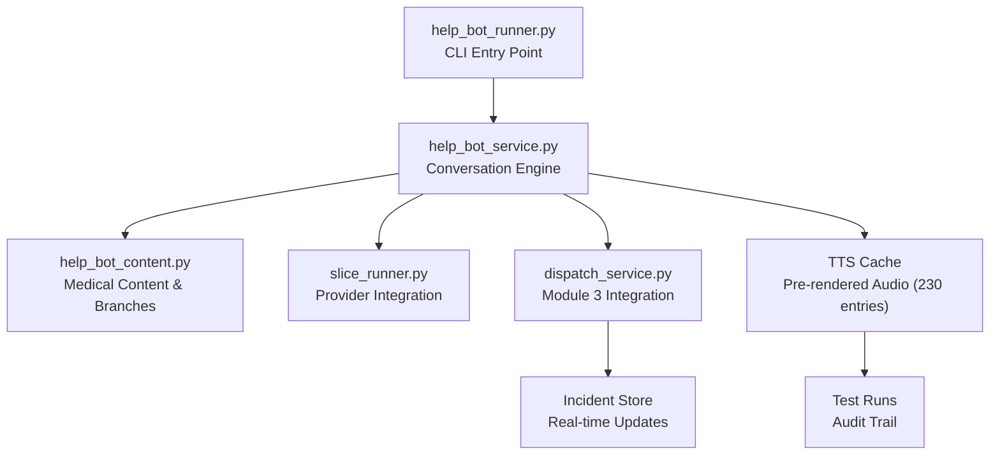
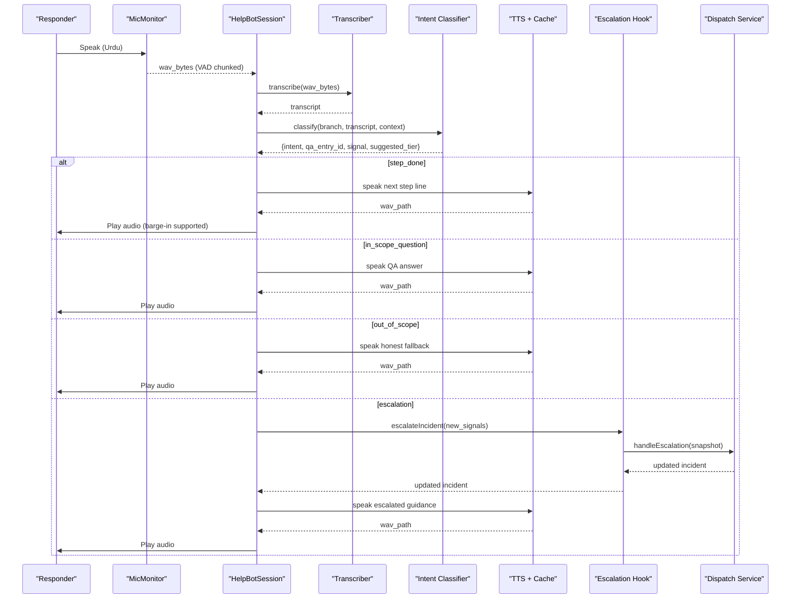
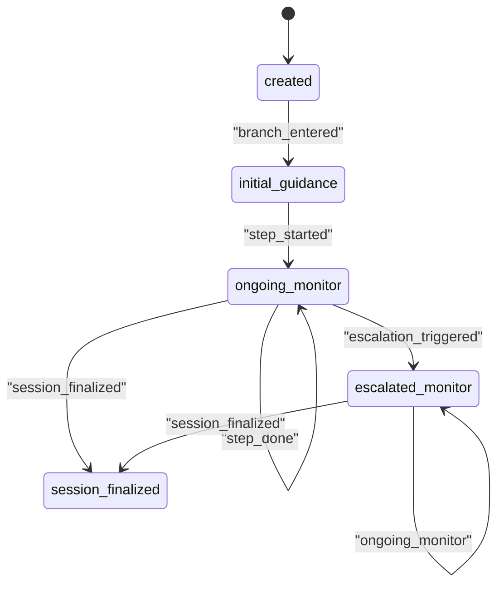
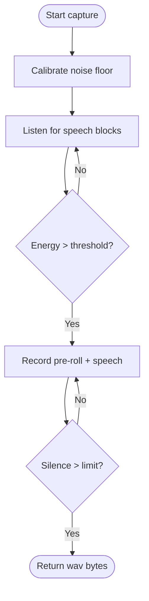
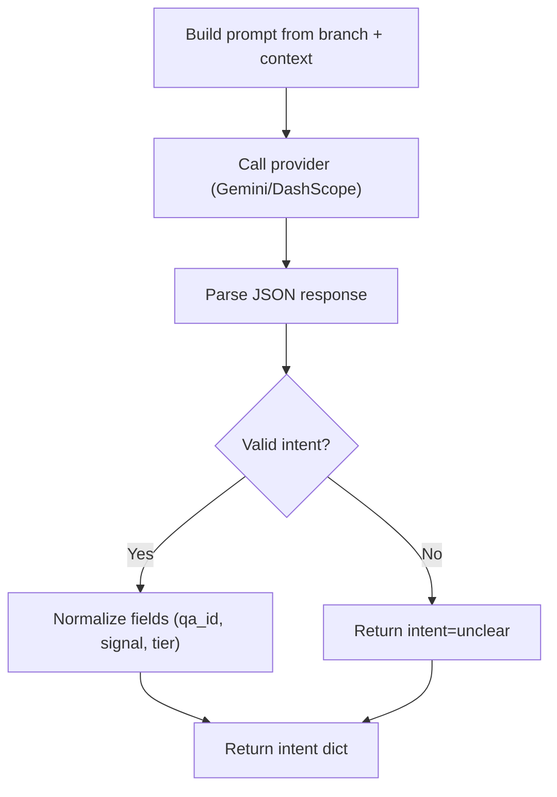

# Responder Help Bot

<cite>
**Referenced Files in This Document**
- [help_bot_content.py](file://backend/services/help_bot_content.py)
- [help_bot_service.py](file://backend/services/help_bot_service.py)
- [help_bot_runner.py](file://backend/help_bot_runner.py)
- [slice_runner.py](file://backend/slice_runner.py)
- [dispatch_service.py](file://backend/services/dispatch_service.py)
- [test_module8_9.py](file://backend/test_module8_9.py)
- [heavy_bleeding.json](file://mockdata/helpbot/scripts/heavy_bleeding.json)
- [fracture_crush.json](file://mockdata/helpbot/scripts/fracture_crush.json)
- [snakebite.json](file://mockdata/helpbot/scripts/snakebite.json)
- [manifest.json](file://mockdata/helpbot/tts_cache/manifest.json)
</cite>

## Update Summary
**Changes Made**
- Enhanced help bot service integration with new incident tracking capabilities for Modules 8 & 9
- Improved escalation handling with comprehensive audit trail and dispatch event logging
- Added mid-incident escalation tracking with `mid_incident_escalated` flag and dispatch events
- Integrated Module 3 dispatch service with help bot escalation system
- Expanded testing framework with comprehensive Module 8 & 9 test coverage
- Updated incident store synchronization with real-time escalation updates

## Table of Contents
1. [Introduction](#introduction)
2. [Project Structure](#project-structure)
3. [Core Components](#core-components)
4. [Architecture Overview](#architecture-overview)
5. [Detailed Component Analysis](#detailed-component-analysis)
6. [Branch-Specific Medical Protocols](#branch-specific-medical-protocols)
7. [Voice Processing Pipeline](#voice-processing-pipeline)
8. [Intent Classification System](#intent-classification-system)
9. [TTS Caching and Audio Management](#tts-caching-and-audio-management)
10. [Escalation and Incident Management](#escalation-and-incident-management)
11. [Integration with Main Triage System](#integration-with-main-triage-system)
12. [Module 8 & 9 Enhanced Features](#module-8--9-enhanced-features)
13. [Performance Considerations](#performance-considerations)
14. [Troubleshooting Guide](#troubleshooting-guide)
15. [Conclusion](#conclusion)

## Introduction
The Responder Help Bot is a sophisticated hands-free Urdu voice guidance system designed specifically for first responders during emergency situations. This fully integrated Module 2 implementation provides comprehensive medical assistance through three specialized injury branches: heavy bleeding, fracture/crush injuries, and snakebite treatment.

The system operates as a continuous listen-think-respond loop, combining advanced voice activity detection (VAD) with barge-in capability, AI-powered intent classification, and pre-authored Urdu medical guidance. All spoken content remains strictly hardcoded to ensure safety and reliability, while AI providers are used exclusively for speech-to-text transcription and intelligent routing decisions.

Key features include:
- **Three Specialized Branches**: Heavy bleeding, fracture/crush injuries, and snakebite protocols
- **Advanced Voice Processing**: Real-time VAD with adaptive noise calibration and barge-in detection
- **AI-Assisted Routing**: Intent classification using Gemini or DashScope providers
- **Robust TTS Caching**: Pre-rendered audio files with manifest tracking for reliability
- **Comprehensive Escalation**: Automatic severity tier upgrades and dispatch integration
- **Enhanced Incident Tracking**: Module 8 & 9 integration with audit trails and dispatch events
- **Fail-Safe Operations**: Graceful degradation when network or audio services fail

**Updated** Enhanced integration with Modules 8 & 9 features including comprehensive incident tracking, mid-incident escalation auditing, and improved dispatch event logging for complete emergency response lifecycle management.

## Project Structure
The help bot spans four primary modules with extensive supporting data:

**Diagram sources**
- [help_bot_runner.py:175-236](file://backend/help_bot_runner.py#L175-L236)
- [help_bot_service.py:663-960](file://backend/services/help_bot_service.py#L663-L960)
- [help_bot_content.py:21-255](file://backend/services/help_bot_content.py#L21-L255)
- [dispatch_service.py:622-786](file://backend/services/dispatch_service.py#L622-L786)

**Section sources**
- [help_bot_runner.py:1-254](file://backend/help_bot_runner.py#L1-L254)
- [help_bot_service.py:1-975](file://backend/services/help_bot_service.py#L1-L975)
- [help_bot_content.py:1-255](file://backend/services/help_bot_content.py#L1-L255)
- [dispatch_service.py:1-786](file://backend/services/dispatch_service.py#L1-L786)

## Core Components
The system consists of several interconnected components working together to provide reliable emergency guidance:

### Conversation State Machine
Manages the complete lifecycle of a responder interaction:
- **created → initial_guidance**: Branch introduction and first step delivery
- **initial_guidance → ongoing_monitor**: Step progression based on confirmations
- **ongoing_monitor → escalated_monitor**: Emergency escalation handling
- **Any state → session_finalized**: Session completion and logging

### Provider Boundaries
Isolated interfaces for AI services with fallback mechanisms:
- **STT (Speech-to-Text)**: Urdu transcription via Gemini or DashScope
- **Intent Classification**: Context-aware routing to appropriate responses
- **TTS (Text-to-Speech)**: Cached Urdu audio generation with fail-safe playback

### Branch Routing System
Intelligent mapping of incident flags to specialized medical protocols:
- **Heavy Bleeding**: Direct pressure, elevation, tourniquet guidance
- **Fracture/Crush**: Immobilization, wound covering, splinting techniques
- **Snakebite**: Stillness maintenance, constriction removal, harmful remedy prevention

### Enhanced Incident Tracking System
New Module 8 & 9 integration providing comprehensive audit trails:
- **Mid-Incident Escalation Tracking**: `mid_incident_escalated` flag with timestamp
- **Dispatch Event Logging**: Complete audit trail of all escalation events
- **Real-time Store Synchronization**: Live updates to INCIDENT_STORE
- **Coverage Gap Detection**: Village availability monitoring and reporting

**Section sources**
- [help_bot_service.py:663-960](file://backend/services/help_bot_service.py#L663-L960)
- [help_bot_service.py:127-168](file://backend/services/help_bot_service.py#L127-L168)
- [help_bot_service.py:274-289](file://backend/services/help_bot_service.py#L274-L289)
- [help_bot_service.py:368-388](file://backend/services/help_bot_service.py#L368-L388)
- [help_bot_content.py:46-255](file://backend/services/help_bot_content.py#L46-L255)

## Architecture Overview
The help bot implements a robust conversation flow optimized for emergency scenarios with enhanced incident tracking:

**Diagram sources**
- [help_bot_service.py:898-925](file://backend/services/help_bot_service.py#L898-L925)
- [help_bot_service.py:159-168](file://backend/services/help_bot_service.py#L159-L168)
- [help_bot_service.py:274-289](file://backend/services/help_bot_service.py#L274-L289)
- [help_bot_service.py:368-388](file://backend/services/help_bot_service.py#L368-L388)
- [help_bot_service.py:576-648](file://backend/services/help_bot_service.py#L576-L648)
- [dispatch_service.py:622-786](file://backend/services/dispatch_service.py#L622-L786)

## Detailed Component Analysis

### Conversation State Machine
The session state machine ensures consistent behavior across all emergency scenarios:

**Diagram sources**
- [help_bot_service.py:696-712](file://backend/services/help_bot_service.py#L696-L712)
- [help_bot_service.py:760-783](file://backend/services/help_bot_service.py#L760-783)
- [help_bot_service.py:855-868](file://backend/services/help_bot_service.py#L855-868)
- [help_bot_service.py:929-959](file://backend/services/help_bot_service.py#L929-959)

**Section sources**
- [help_bot_service.py:663-960](file://backend/services/help_bot_service.py#L663-L960)

### Voice Activity Detection and Barge-In
Advanced audio processing optimized for emergency environments:

**Diagram sources**
- [help_bot_service.py:498-519](file://backend/services/help_bot_service.py#L498-L519)
- [help_bot_service.py:521-569](file://backend/services/help_bot_service.py#L521-569)
- [help_bot_service.py:405-444](file://backend/services/help_bot_service.py#L405-444)

**Section sources**
- [help_bot_service.py:456-569](file://backend/services/help_bot_service.py#L456-569)
- [help_bot_service.py:405-444](file://backend/services/help_bot_service.py#L405-444)

### Intent Classification Using AI Providers
Sophisticated routing system with strict schema enforcement:

**Diagram sources**
- [help_bot_service.py:174-214](file://backend/services/help_bot_service.py#L174-L214)
- [help_bot_service.py:216-241](file://backend/services/help_bot_service.py#L216-241)
- [help_bot_service.py:244-289](file://backend/services/help_bot_service.py#L244-289)
- [slice_runner.py:72-95](file://backend/slice_runner.py#L72-95)

**Section sources**
- [help_bot_service.py:174-289](file://backend/services/help_bot_service.py#L174-289)
- [slice_runner.py:72-95](file://backend/slice_runner.py#L72-95)

## Branch-Specific Medical Protocols

### Heavy Bleeding Protocol
Comprehensive blood loss management with progressive intervention:

**Initial Guidance:**
- Immediate direct pressure application with clean cloth
- Elevation above heart level when possible
- Continuous pressure maintenance without interruption

**Step-by-Step Instructions:**
1. **Direct Pressure**: Apply firm, continuous pressure directly on wound
2. **Elevation**: Raise injured area above heart level if feasible
3. **Cloth Management**: Add layers over soaked cloths without removing original

**In-Scope Questions:**
- Cloth soaking management: Never remove soaked cloth, add additional layers
- Pressure intensity: Apply enough pressure to stop or significantly reduce bleeding
- Duration: Maintain pressure until bleeding stops or professional help arrives
- Embedded objects: Never remove embedded objects, apply pressure around them

**Escalation Triggers:**
- Uncontrolled bleeding despite proper technique
- Patient becoming unconscious or showing signs of shock
- Breathing difficulties developing

**Section sources**
- [help_bot_content.py:52-119](file://backend/services/help_bot_content.py#L52-L119)

### Fracture/Crush Injury Protocol
Specialized immobilization and wound care for bone injuries:

**Initial Guidance:**
- Complete immobilization of injured area
- No movement or attempted straightening of fractures
- Protection of exposed wounds without direct pressure on bones

**Step-by-Step Instructions:**
1. **Immobilization**: Keep patient lying down, prevent any movement of injured area
2. **Wound Coverage**: Cover open wounds with clean cloth, avoid direct pressure on bones
3. **Splinting**: Create improvised splints from available materials

**In-Scope Questions:**
- Splint alternatives: Use other limbs or soft materials when rigid splints unavailable
- Pain management: Monitor circulation, loosen bindings if fingers become pale/blue
- Medication: Avoid food, water, or painkillers before potential surgery

**Escalation Triggers:**
- Patient becoming unconscious
- Breathing difficulties developing
- Exposed bone visible
- Severe uncontrolled bleeding

**Section sources**
- [help_bot_content.py:124-182](file://backend/services/help_bot_content.py#L124-L182)

### Snakebite Protocol
Venomous bite management focusing on venom spread prevention:

**Initial Guidance:**
- Complete stillness to prevent venom circulation
- Position bitten limb below heart level
- Remove constrictive items immediately

**Step-by-Step Instructions:**
1. **Stillness**: Keep patient completely still, minimize all movement
2. **Constriction Removal**: Remove rings, watches, tight clothing near bite site
3. **Harmful Remedy Prevention**: Prevent cutting, sucking, or tight bandaging

**In-Scope Questions:**
- Bandaging: Never apply tight bandages above bite site
- Wound cleaning: Gentle water washing only, no rubbing or ice application
- Snake identification: Safe distance photography only, never attempt capture
- Venom extraction: Absolutely no cutting or mouth suction methods

**Escalation Triggers:**
- Breathing difficulties
- Rapid swelling progression
- Vomiting or unconsciousness
- Any neurological symptoms

**Section sources**
- [help_bot_content.py:187-253](file://backend/services/help_bot_content.py#L187-L253)

## Voice Processing Pipeline

### Microphone Monitoring and VAD
Advanced audio capture system with adaptive noise handling:

**Noise Calibration:**
- Measures ambient noise levels over 1-second baseline
- Sets speech threshold at 2.5x noise floor minimum 400.0
- Adapts to varying environmental conditions

**Speech Detection:**
- Uses 80ms audio blocks for real-time energy analysis
- Requires sustained loudness (2+ consecutive blocks) to start recording
- Captures 0.4s pre-roll for natural speech beginning
- Ends after 1.2s silence or 15s maximum utterance

**Barge-In Detection:**
- Monitors playback for interruptions using raised threshold (1.8x speech threshold)
- Requires 60% of recent blocks above threshold for 0.35s duration
- Prevents self-interruption from speaker-mic echo

**Section sources**
- [help_bot_service.py:456-569](file://backend/services/help_bot_service.py#L456-569)

### Audio Playback with Fail-Safe Operations
Robust audio output system designed for emergency reliability:

**Playback Process:**
- Best-effort operation: continues even without audio hardware
- Stream-based playback with callback-driven audio delivery
- Real-time barge-in monitoring during playback
- Graceful error handling with logging and continuation

**Fail-Safe Mechanisms:**
- Pre-rendered failsafe audio for critical messages
- Automatic fallback to cached audio when synthesis fails
- Continuation of conversation flow regardless of audio issues
- Comprehensive logging for debugging and quality assurance

**Section sources**
- [help_bot_service.py:405-444](file://backend/services/help_bot_service.py#L405-444)
- [help_bot_service.py:727-757](file://backend/services/help_bot_service.py#L727-757)

## Intent Classification System

### Prompt Construction and Context Management
Sophisticated context-aware classification system:

**Prompt Elements:**
- Current branch title and ID for context
- Active step information and progress
- In-scope Q&A entries with hint keywords
- Escalation signals specific to current branch
- Recent conversation history (last 6 turns)
- Latest transcript with full context

**Classification Schema:**
- **step_done**: Confirmation of completed action or request for next step
- **in_scope_question**: Question matching predefined Q&A entries
- **out_of_scope**: Any question outside defined knowledge base
- **escalation**: Patient deterioration or emergency signals
- **unclear**: Empty input, noise, or unintelligible speech

**Provider Flexibility:**
- Primary: Gemini models with retry logic
- Backup: DashScope qwen-plus model
- Automatic failover between providers
- Consistent schema validation regardless of provider

**Section sources**
- [help_bot_service.py:174-289](file://backend/services/help_bot_service.py#L174-289)

## TTS Caching and Audio Management

### Caching Architecture
Comprehensive audio caching system for reliability and performance:

**Cache Key Generation:**
- SHA1 hash of voice + text combination
- Unique per voice model configuration
- Persistent storage in dedicated cache directory

**Manifest Tracking:**
- Records rendering provenance (model, voice, timestamp)
- Tracks truncated text for audit purposes
- Supports model migration without breaking cache validity

**Prewarming Strategy:**
- Renders all scripted lines ahead of time
- Paces requests to respect rate limits (~8s between renders)
- Handles retries with exponential backoff
- Skips already cached entries automatically

**Updated** The TTS cache has expanded from 78 to 230 entries, covering all 39 scripted Urdu lines across all three injury branches. The cache includes shared lines (failsafe, out-of-scope, check-in, session-complete) plus branch-specific content for heavy bleeding, fracture/crush, and snakebite protocols.

**Section sources**
- [help_bot_service.py:350-388](file://backend/services/help_bot_service.py#L350-L388)
- [help_bot_runner.py:102-133](file://backend/help_bot_runner.py#L102-L133)
- [manifest.json:1-230](file://mockdata/helpbot/tts_cache/manifest.json#L1-L230)

### Audio Quality Verification
Built-in verification system for ensuring Urdu audio quality:

**Round-Trip Testing:**
- TTS generates audio from Urdu text
- STT transcribes generated audio back to text
- Comparison validates pronunciation accuracy
- Results logged for quality assurance

**Quality Metrics:**
- Source line vs. round-trip transcript comparison
- STT usability assessment
- Audio file path for manual verification
- Branch-specific coverage reporting

**Updated** Round-trip STT verification completed successfully across all three injury branches, confirming high-quality Urdu audio generation and accurate transcription recognition.

**Section sources**
- [help_bot_runner.py:135-172](file://backend/help_bot_runner.py#L135-L172)

## Escalation and Incident Management

### Enhanced Escalation Hook System
Centralized escalation management with comprehensive audit trail:

**Severity Tier Management:**
- Only upgrades, never downgrades severity
- Supports minor → moderate → critical progression
- Automatic ambulance request for critical tier
- BHU notification flagging for moderate+ cases

**Flag Merging:**
- Additive injury type flag management
- Prevents duplicate flag entries
- Maintains comprehensive injury history
- Supports custom escalation signal labels

**Transition Logging:**
- Timestamped event records for all escalations
- Detailed trigger information and context
- Transcript excerpts for audit purposes
- Integration with main incident store

**Updated** Enhanced with Module 8 & 9 telemetry including `mid_incident_escalated` flag and comprehensive dispatch event logging for complete audit trail.

**Section sources**
- [help_bot_service.py:576-648](file://backend/services/help_bot_service.py#L576-648)

### Enhanced Incident Store Integration
Seamless integration with main triage system with real-time updates:

**Active Incident Tracking:**
- Real-time incident object updates
- Synchronization with central store
- Concurrent access protection
- Snapshot consistency maintenance

**Dispatch Integration:**
- Automatic BHU notification marking
- Ambulance request flagging for critical cases
- Responder assignment coordination
- Status synchronization across systems

**Module 8 & 9 Integration:**
- Mid-incident escalation tracking with timestamps
- Coverage gap detection and reporting
- Localized reporter updates in Urdu
- PostgreSQL persistence and rehydration support

**Section sources**
- [help_bot_service.py:576-648](file://backend/services/help_bot_service.py#L576-648)
- [dispatch_service.py:622-786](file://backend/services/dispatch_service.py#L622-L786)
- [slice_runner.py:170-188](file://backend/slice_runner.py#L170-188)

## Integration with Main Triage System

### Branch Routing Logic
Intelligent injury type detection and routing:

**Keyword-Based Matching:**
- Multi-language keyword support (English, Urdu, regional terms)
- Priority ordering for conflict resolution
- Fallback to safest default (heavy bleeding)
- Case-insensitive matching with stemming

**Real Flag Integration:**
- Compatible with Module 1 triage outputs
- Supports complex flag combinations
- Handles partial or ambiguous classifications
- Maintains backward compatibility

**Section sources**
- [help_bot_service.py:99-116](file://backend/services/help_bot_service.py#L99-L116)

### Test and Simulation Framework
Comprehensive testing infrastructure for validation:

**Replay Mode:**
- Deterministic script execution
- Expected vs. actual outcome comparison
- Latency measurement and reporting
- Full conversation logging

**Simulation Mode:**
- Mock incident creation with realistic flags
- Provider selection and credential management
- Environment variable configuration
- Automated test scenario execution

**Updated** Comprehensive test runs completed across all three injury branches with detailed replay scripts demonstrating real-world usage patterns, including escalation scenarios and edge case handling. Enhanced with Module 8 & 9 test coverage for incident tracking and escalation auditing.

**Section sources**
- [help_bot_runner.py:74-99](file://backend/help_bot_runner.py#L74-99)
- [heavy_bleeding.json:1-11](file://mockdata/helpbot/scripts/heavy_bleeding.json#L1-L11)
- [fracture_crush.json:1-11](file://mockdata/helpbot/scripts/fracture_crush.json#L1-L11)
- [snakebite.json:1-11](file://mockdata/helpbot/scripts/snakebite.json#L1-L11)

## Module 8 & 9 Enhanced Features

### Mid-Incident Escalation Tracking
Comprehensive audit trail for help-bot initiated escalations:

**Escalation Flow:**
1. Help bot detects worsening condition via intent classification
2. `escalateIncident()` called with new signals and suggested tier
3. Severity tier upgraded (never downgraded)
4. `mid_incident_escalated` flag set to True
5. Dispatch event logged with trigger details
6. Module 3 `handleEscalation()` triggered for dispatch actions
7. Real-time INCIDENT_STORE synchronization

**Audit Trail Components:**
- Timestamped escalation events in `help_bot_transitions`
- Dispatch events in `dispatch_events` array
- Trigger phrases and transcript excerpts
- Severity tier change documentation
- Ambulance request status tracking

**Section sources**
- [help_bot_service.py:579-661](file://backend/services/help_bot_service.py#L579-L661)
- [dispatch_service.py:622-786](file://backend/services/dispatch_service.py#L622-L786)
- [test_module8_9.py:125-185](file://backend/test_module8_9.py#L125-L185)

### Coverage Gap Detection and Reporting
Module 8 feature for village availability monitoring:

**Detection Logic:**
- Monitors responder availability across villages
- Identifies when all candidates are exhausted/unavailable
- Sets `coverage_gap` flag to True
- Logs coverage gap events in dispatch events

**Reporting Features:**
- Village-specific gap detection
- Reason categorization (candidates_exhausted_or_unavailable)
- Integration with dispatch service for automatic escalation
- Audit trail for coverage analysis

**Section sources**
- [test_module8_9.py:76-123](file://backend/test_module8_9.py#L76-L123)

### Localized Reporter Updates
Module 9 feature for Urdu timeline updates:

**Timeline Stages:**
- reported → responder_notified → responder_en_route → responder_arrived → closed
- Each stage includes localized Urdu message
- Sequential accumulation throughout incident lifecycle
- PostgreSQL persistence and HTTP endpoint access

**Update Mechanism:**
- Automatic stage progression based on incident events
- Urdu message generation for each stage
- Timestamp tracking for each update
- Real-time HTTP API access for timeline polling

**Section sources**
- [test_module8_9.py:187-267](file://backend/test_module8_9.py#L187-L267)

### PostgreSQL Persistence and Rehydration
Module 9 feature for data durability:

**Persistence Features:**
- All incident changes written to PostgreSQL
- Coverage gap flags persisted
- Mid-incident escalation flags tracked
- Responder arrival timestamps stored
- Reporter updates list maintained

**Rehydration Support:**
- Store rehydration from database on restart
- Complete incident state restoration
- Timeline reconstruction from persistent data
- HTTP endpoint availability after restart

**Section sources**
- [test_module8_9.py:269-349](file://backend/test_module8_9.py#L269-L349)

## Performance Considerations

### Optimization Strategies
System designed for optimal performance in emergency scenarios:

**Latency Reduction:**
- TTS prewarming eliminates cold-start delays
- Cached audio playback bypasses synthesis overhead
- First playback delay measurement for responsiveness tracking
- Efficient VAD processing with minimal CPU usage

**Resource Management:**
- Lazy loading of audio dependencies
- Memory-efficient audio streaming
- Connection pooling for API calls
- Graceful degradation under resource constraints

**Scalability Features:**
- Provider abstraction for load distribution
- Retry logic with exponential backoff
- Circuit breaker patterns for service failures
- Stateless design enabling horizontal scaling

**Enhanced Performance Features:**
- Real-time incident store synchronization
- Efficient dispatch event logging
- Optimized escalation processing pipeline
- Database connection pooling for persistence

## Troubleshooting Guide

### Common Issues and Solutions

**Network Connectivity Problems:**
- STT/intent calls may fail; system returns "unclear" and speaks failsafe line
- Provider selection allows swapping between Gemini and DashScope
- Ensure environment variables are set correctly for target provider
- Retry logic handles transient quota/rate-limit errors gracefully

**Audio Quality Variations:**
- Mic calibration adjusts thresholds for different environments
- Noisy environments may require re-calibration before starting
- Barge-in uses raised threshold to avoid self-interruption
- Loud speakers can cause false positives; adjust sensitivity as needed

**User Interaction Patterns:**
- Responders may be stressed or speaking quickly
- System accepts short confirmations ("done") and repeats guidance if unclear
- Out-of-scope questions receive honest fallbacks
- Never improvises medical advice beyond defined scope

**TTS Quota Exhaustion:**
- Use prewarm utility to render all lines ahead of time
- Verify TTS round-trip to ensure Urdu audio quality
- Manifest tracking helps identify rendering issues
- Failsafe audio ensures continuity even during quota limits

**Enhanced Troubleshooting for Modules 8 & 9:**
- Check `mid_incident_escalated` flag for escalation tracking
- Review `dispatch_events` array for complete audit trail
- Verify PostgreSQL connectivity for persistence features
- Monitor coverage gap detection for village availability issues

**Updated** Real-world testing revealed quota exhaustion scenarios where TTS services returned RESOURCE_EXHAUSTED errors. The system's fail-safe mechanism successfully handled these cases by playing pre-rendered audio, maintaining conversation continuity even when live synthesis was unavailable. Enhanced testing confirms proper escalation tracking and dispatch event logging for Modules 8 & 9 features.

### Operational Tips

**Testing and Validation:**
- Run replay mode with scripts for deterministic testing
- Use verify-tts to check spoken-Urdu quality and STT accuracy
- Inspect test run records for latencies, expectations, and transitions
- Monitor manifest.json for cache effectiveness
- Execute Module 8 & 9 test suite for comprehensive validation

**Production Deployment:**
- Configure appropriate timeout values for network operations
- Set up proper logging for troubleshooting and monitoring
- Implement health checks for audio device availability
- Plan for graceful degradation in production environments
- Ensure PostgreSQL connectivity for persistence features

**Section sources**
- [help_bot_service.py:159-168](file://backend/services/help_bot_service.py#L159-L168)
- [help_bot_service.py:274-289](file://backend/services/help_bot_service.py#L274-L289)
- [help_bot_service.py:498-519](file://backend/services/help_bot_service.py#L498-L519)
- [help_bot_runner.py:102-172](file://backend/help_bot_runner.py#L102-L172)

## Conclusion

The Responder Help Bot represents a comprehensive solution for providing hands-free Urdu medical guidance to first responders during emergencies. The fully integrated Module 2 implementation successfully combines advanced voice processing, AI-assisted intent classification, and specialized medical protocols for three critical injury types: heavy bleeding, fracture/crush injuries, and snakebite treatment.

Key achievements include:

**Technical Excellence:**
- Robust conversation state machine with clear state transitions
- Advanced voice activity detection with adaptive noise calibration
- Reliable barge-in detection optimized for emergency environments
- Sophisticated intent classification with provider flexibility

**Medical Safety:**
- Strict adherence to pre-authored medical guidance
- Comprehensive escalation protocols for deteriorating patients
- Clear boundaries preventing AI-generated medical advice
- Fail-safe operations ensuring continuity during service failures

**Operational Reliability:**
- Comprehensive TTS caching with manifest tracking (230 cached entries)
- Graceful degradation when services are unavailable
- Extensive testing framework with replay and simulation modes
- Integration with main triage system for coordinated response

**Enhanced Incident Tracking (Modules 8 & 9):**
- Mid-incident escalation tracking with comprehensive audit trails
- Coverage gap detection and reporting for village availability
- Localized reporter updates in Urdu throughout incident lifecycle
- PostgreSQL persistence with rehydration support
- Complete dispatch event logging for emergency response analysis

**Updated** Enhanced integration with Modules 8 & 9 features provides comprehensive incident tracking, mid-incident escalation auditing, and improved dispatch event logging. The system now supports complete emergency response lifecycle management with real-time store synchronization, coverage gap detection, and localized reporter updates.

The system's design prioritizes safety, reliability, and ease of use in high-stress emergency scenarios. By keeping all medical content hardcoded while leveraging AI for ears (speech recognition) and routing (intent classification), the bot maintains strict control over medical advice while providing intelligent, context-aware assistance to first responders.

This implementation serves as a solid foundation for future enhancements, including expanded injury branches, improved voice recognition accuracy, and deeper integration with emergency response systems. The modular architecture ensures that new features can be added without compromising the core safety principles that make this system suitable for life-critical applications.