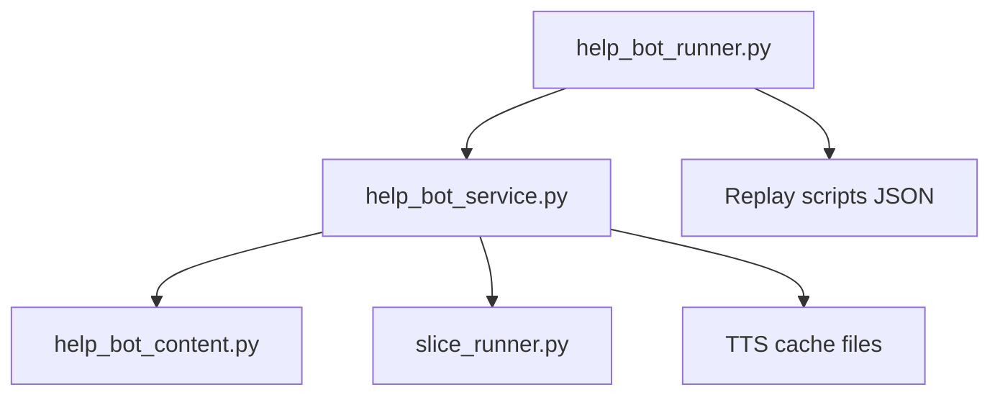
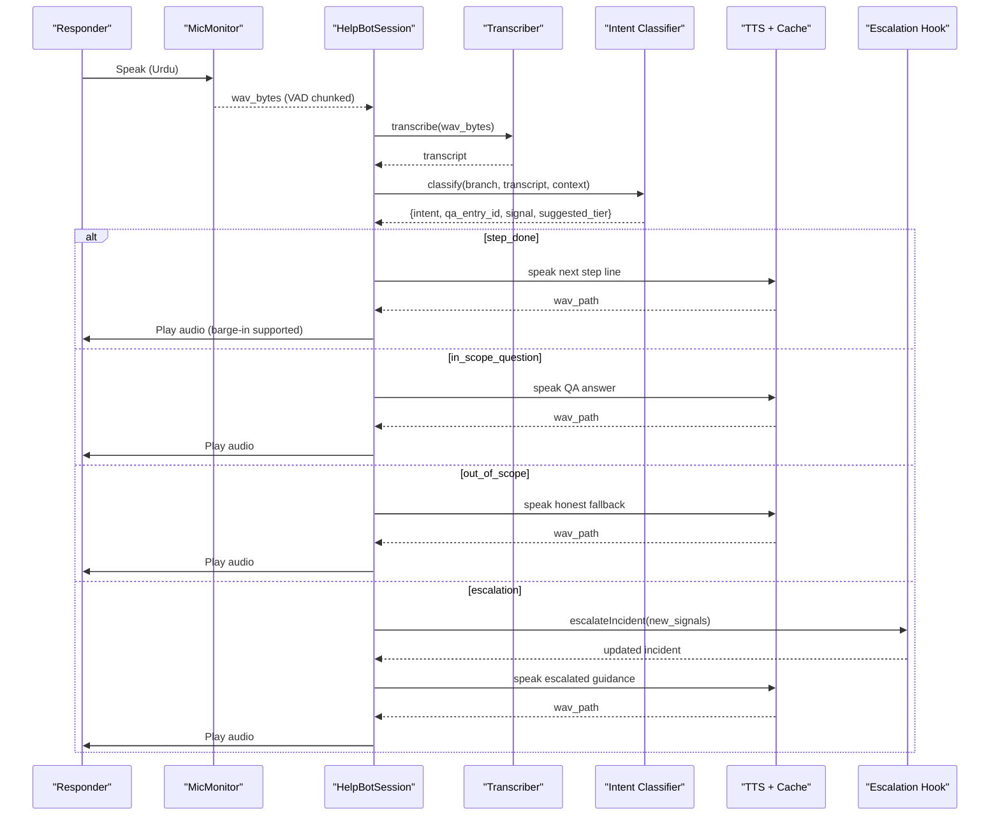
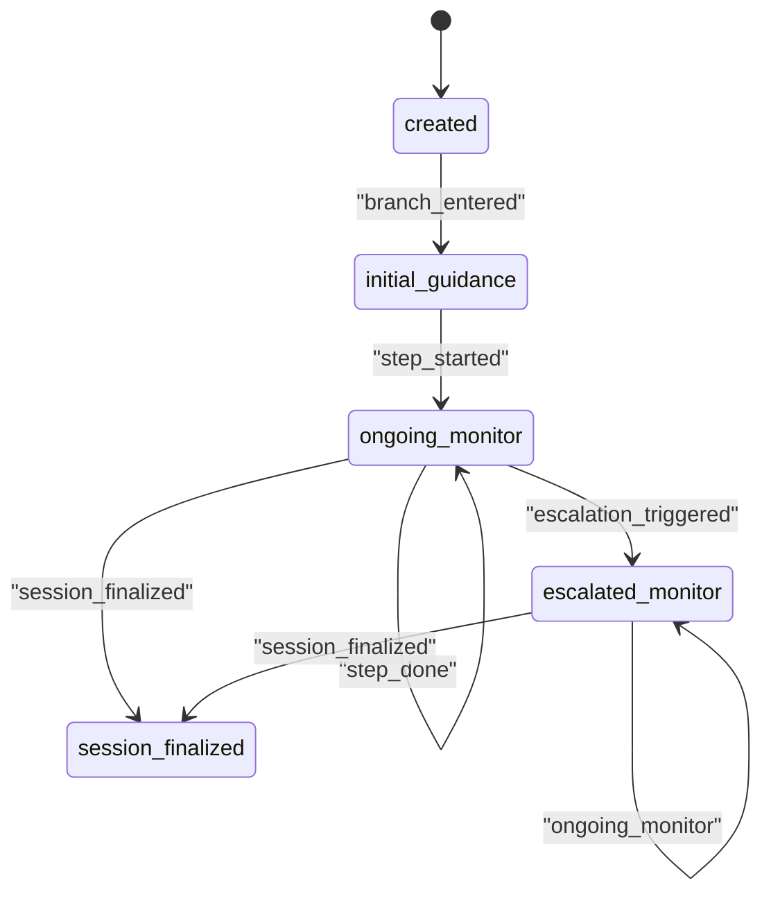
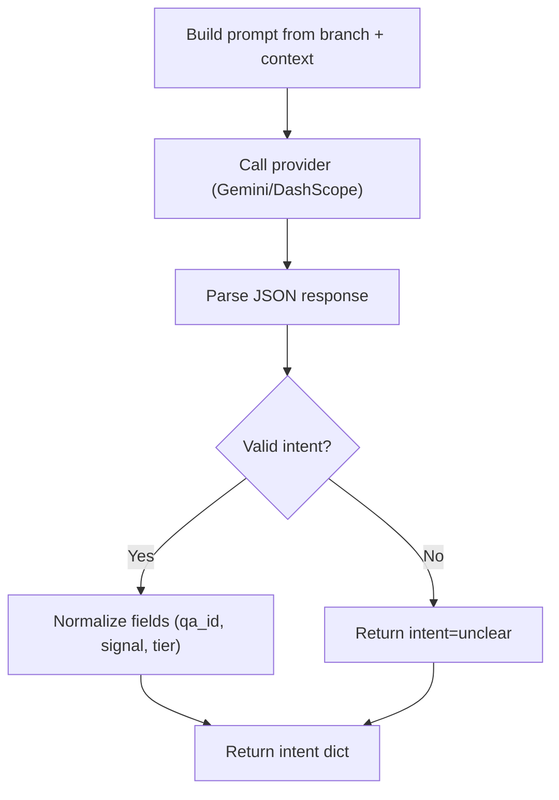
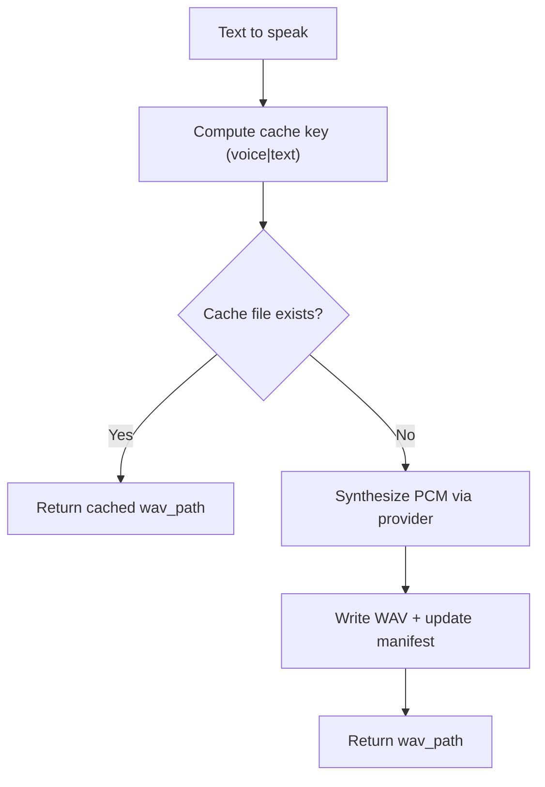
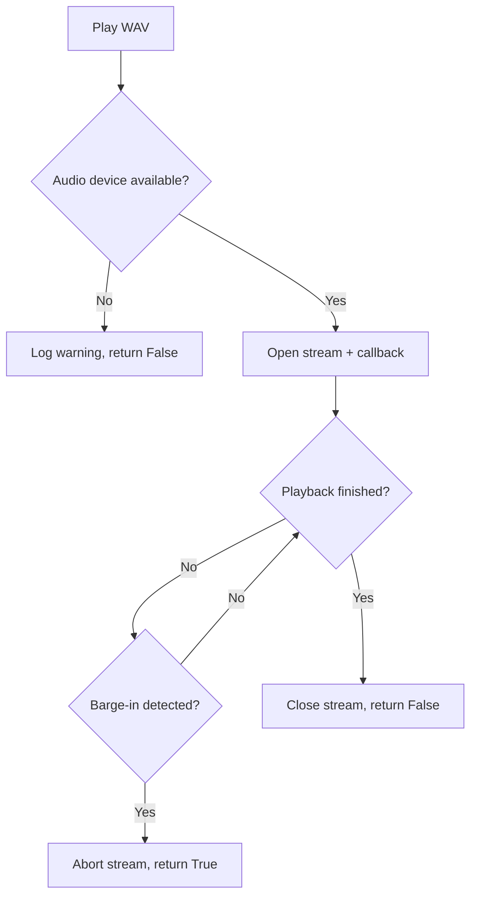
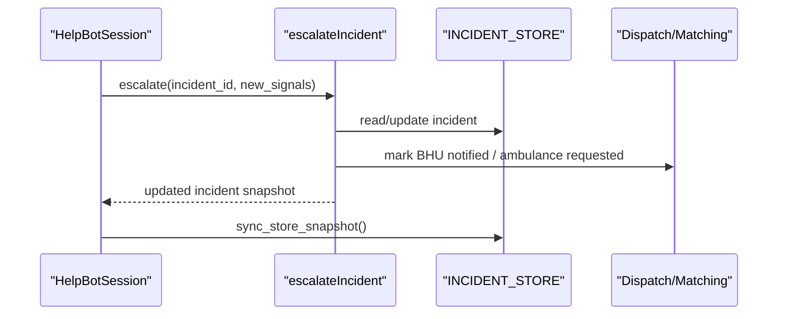
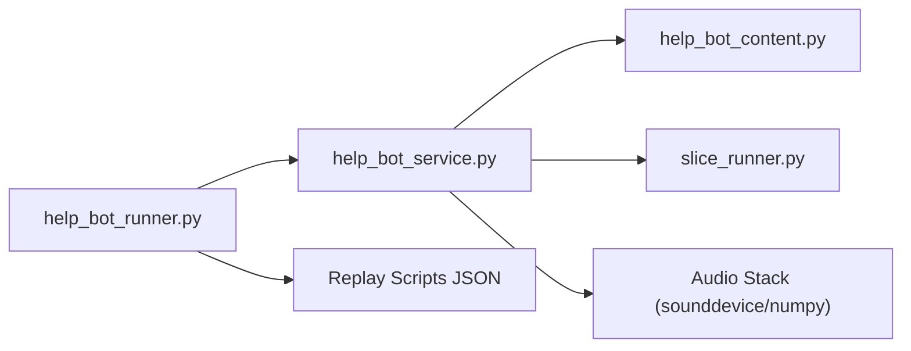

# Responder Help Bot

<cite>
**Referenced Files in This Document**
- [help_bot_content.py](file://backend/services/help_bot_content.py)
- [help_bot_service.py](file://backend/services/help_bot_service.py)
- [help_bot_runner.py](file://backend/help_bot_runner.py)
- [slice_runner.py](file://backend/slice_runner.py)
- [heavy_bleeding.json](file://mockdata/helpbot/scripts/heavy_bleeding.json)
- [fracture_crush.json](file://mockdata/helpbot/scripts/fracture_crush.json)
- [snakebite.json](file://mockdata/helpbot/scripts/snakebite.json)
- [manifest.json](file://mockdata/helpbot/tts_cache/manifest.json)
</cite>

## Table of Contents
1. [Introduction](#introduction)
2. [Project Structure](#project-structure)
3. [Core Components](#core-components)
4. [Architecture Overview](#architecture-overview)
5. [Detailed Component Analysis](#detailed-component-analysis)
6. [Dependency Analysis](#dependency-analysis)
7. [Performance Considerations](#performance-considerations)
8. [Troubleshooting Guide](#troubleshooting-guide)
9. [Conclusion](#conclusion)

## Introduction
This document explains the Responder Help Bot sub-component that provides hands-free Urdu voice guidance to first responders during emergencies. It focuses on:
- The conversation state machine and turn flow
- Voice activity detection (VAD) with barge-in capability
- Intent classification using AI providers while keeping all medical content hardcoded
- Branch-specific protocols for bleeding, fractures/crush injuries, and snakebite
- TTS caching, audio playback with fail-safe operations, and integration with the main triage system
- Common issues such as network connectivity problems, audio quality variations, and emergency interaction patterns

The bot is intentionally a scripted decision tree: AI is used only for ears (speech-to-text) and routing (intent classification). All spoken guidance is pre-authored Urdu text.

## Project Structure
The help bot spans three primary modules and supporting data:
- Content: branch scripts, shared lines, escalation signals, and Q&A entries
- Service: conversation engine, provider boundaries (STT/intent/TTS), audio I/O, session state machine, and escalation hook
- Runner: CLI entrypoint, simulation, replay mode, live mic mode, TTS prewarming, and verification utilities
- Shared infrastructure: incident model, provider selection, retry logic, and dispatch/logging hooks

**Diagram sources**
- [help_bot_runner.py:175-236](file://backend/help_bot_runner.py#L175-L236)
- [help_bot_service.py:663-960](file://backend/services/help_bot_service.py#L663-L960)
- [help_bot_content.py:21-255](file://backend/services/help_bot_content.py#L21-L255)
- [slice_runner.py:132-188](file://backend/slice_runner.py#L132-L188)

**Section sources**
- [help_bot_runner.py:1-241](file://backend/help_bot_runner.py#L1-L241)
- [help_bot_service.py:1-960](file://backend/services/help_bot_service.py#L1-L960)
- [help_bot_content.py:1-255](file://backend/services/help_bot_content.py#L1-L255)
- [slice_runner.py:1-200](file://backend/slice_runner.py#L1-L200)

## Core Components
- Conversation state machine: manages initial guidance, step progression, ongoing monitoring, and escalation states
- Provider boundary: STT, intent classification, and TTS are isolated behind provider selection; failures route to safe Urdu fallbacks
- Branch routing: maps incident flags to injury-type branches (bleeding, fracture/crush, snakebite)
- Audio pipeline: VAD-based capture, barge-in detection, WAV playback, and fail-safe behavior when audio devices or services are unavailable
- Escalation hook: upgrades severity tier, merges new flags, marks BHU notification and ambulance request, and logs transitions

Key implementation references:
- State machine and session lifecycle: [HelpBotSession:663-960](file://backend/services/help_bot_service.py#L663-L960)
- Provider boundaries (STT/intent/TTS): [transcribeResponderInput:159-168](file://backend/services/help_bot_service.py#L159-L168), [detectResponderIntent:274-289](file://backend/services/help_bot_service.py#L274-L289), [speakGuidance:368-388](file://backend/services/help_bot_service.py#L368-L388)
- Branch definitions and escalation triggers: [BRANCHES:46-255](file://backend/services/help_bot_content.py#L46-L255)
- Integration with triage system: [Incident model and store sync:170-188](file://backend/slice_runner.py#L170-L188), [escalateIncident:576-648](file://backend/services/help_bot_service.py#L576-L648)

**Section sources**
- [help_bot_service.py:663-960](file://backend/services/help_bot_service.py#L663-L960)
- [help_bot_service.py:127-168](file://backend/services/help_bot_service.py#L127-L168)
- [help_bot_service.py:274-289](file://backend/services/help_bot_service.py#L274-L289)
- [help_bot_service.py:368-388](file://backend/services/help_bot_service.py#L368-L388)
- [help_bot_content.py:46-255](file://backend/services/help_bot_content.py#L46-L255)
- [slice_runner.py:170-188](file://backend/slice_runner.py#L170-L188)
- [help_bot_service.py:576-648](file://backend/services/help_bot_service.py#L576-L648)

## Architecture Overview
The help bot runs as a continuous listen-think-respond loop:
1. Capture audio via microphone with VAD
2. Transcribe to Urdu using an AI provider (Gemini or DashScope)
3. Classify intent against current branch context (step_done, in_scope_question, out_of_scope, escalation, unclear)
4. Speak pre-authored Urdu guidance from the branch
5. Handle escalations by upgrading severity and notifying dispatch

**Diagram sources**
- [help_bot_service.py:898-925](file://backend/services/help_bot_service.py#L898-L925)
- [help_bot_service.py:159-168](file://backend/services/help_bot_service.py#L159-L168)
- [help_bot_service.py:274-289](file://backend/services/help_bot_service.py#L274-L289)
- [help_bot_service.py:368-388](file://backend/services/help_bot_service.py#L368-L388)
- [help_bot_service.py:576-648](file://backend/services/help_bot_service.py#L576-L648)

## Detailed Component Analysis

### Conversation State Machine
The session moves through well-defined states:
- created -> initial_guidance: deliver branch intro and first step
- ongoing_monitor: advance steps based on responder confirmations
- escalated_monitor: handle worsening conditions and provide emergency guidance
- session_finalized: record outcomes, latencies, and transitions

State transitions are logged into the incident’s transition history and synced back to the central store for auditability.

**Diagram sources**
- [help_bot_service.py:696-712](file://backend/services/help_bot_service.py#L696-L712)
- [help_bot_service.py:760-783](file://backend/services/help_bot_service.py#L760-L783)
- [help_bot_service.py:855-868](file://backend/services/help_bot_service.py#L855-L868)
- [help_bot_service.py:929-959](file://backend/services/help_bot_service.py#L929-L959)

**Section sources**
- [help_bot_service.py:663-960](file://backend/services/help_bot_service.py#L663-L960)

### Voice Activity Detection and Barge-In
- MicMonitor captures 16 kHz mono audio blocks and estimates energy per block
- Calibration sets noise floor and speech threshold; barge-in uses a raised threshold to avoid self-interruption due to speaker-mic echo
- capture_utterance implements VAD: starts recording on sustained loudness, ends after trailing silence or max utterance length
- play_wav integrates barge-in checks during playback to interrupt if the responder speaks over the bot

**Diagram sources**
- [help_bot_service.py:498-519](file://backend/services/help_bot_service.py#L498-L519)
- [help_bot_service.py:521-569](file://backend/services/help_bot_service.py#L521-L569)
- [help_bot_service.py:405-444](file://backend/services/help_bot_service.py#L405-L444)

**Section sources**
- [help_bot_service.py:456-569](file://backend/services/help_bot_service.py#L456-L569)
- [help_bot_service.py:405-444](file://backend/services/help_bot_service.py#L405-L444)

### Intent Classification Using AI Providers
- Prompt construction includes branch title, current step, in-scope Q&A hints, escalation signals, recent context, and latest transcript
- Normalization enforces strict schema and rejects invalid outputs; any failure falls back to “unclear”
- Provider selection supports Gemini and DashScope swap-back; retries apply to quota/rate-limit errors

**Diagram sources**
- [help_bot_service.py:174-214](file://backend/services/help_bot_service.py#L174-L214)
- [help_bot_service.py:216-241](file://backend/services/help_bot_service.py#L216-L241)
- [help_bot_service.py:244-289](file://backend/services/help_bot_service.py#L244-L289)
- [slice_runner.py:72-95](file://backend/slice_runner.py#L72-L95)

**Section sources**
- [help_bot_service.py:174-289](file://backend/services/help_bot_service.py#L174-L289)
- [slice_runner.py:72-95](file://backend/slice_runner.py#L72-L95)

### Branch-Specific Protocols
Branches define initial guidance, step-by-step instructions, in-scope Q&A, escalation signals, and escalated guidance. Each branch is tailored to a specific injury type.

- Heavy bleeding: direct pressure, elevation, cloth management, tourniquet guidance if needed; escalation on uncontrolled bleeding or unconsciousness
- Fracture/crush: immobilization, wound covering without pressing bone, splinting; escalation on exposed bone, severe pain, or breathing difficulty
- Snakebite: keep still, remove constrictions, avoid harmful remedies; escalation on breathing difficulty, rapid swelling, vomiting, or unconsciousness

Concrete examples from the content module:
- Initial guidance and steps for each branch: [heavy_bleeding:52-119](file://backend/services/help_bot_content.py#L52-L119), [fracture_crush:124-182](file://backend/services/help_bot_content.py#L124-L182), [snakebite:187-253](file://backend/services/help_bot_content.py#L187-L253)
- In-scope Q&A entries with hints and answers: [heavy_bleeding Q&A:73-106](file://backend/services/help_bot_content.py#L73-L106), [fracture_crush Q&A:145-170](file://backend/services/help_bot_content.py#L145-L170), [snakebite Q&A:208-241](file://backend/services/help_bot_content.py#L208-L241)
- Escalation signals and escalated guidance: [heavy_bleeding escalation:107-118](file://backend/services/help_bot_content.py#L107-L118), [fracture_crush escalation:171-181](file://backend/services/help_bot_content.py#L171-L181), [snakebite escalation:242-252](file://backend/services/help_bot_content.py#L242-L252)

Shared safety lines ensure the bot never leaves the responder in silence and always provides honest fallbacks for out-of-scope questions.

**Section sources**
- [help_bot_content.py:21-43](file://backend/services/help_bot_content.py#L21-L43)
- [help_bot_content.py:46-255](file://backend/services/help_bot_content.py#L46-L255)

### TTS Caching Mechanisms
- Every scripted line is rendered once and cached as WAV files keyed by voice+text hash
- Manifest tracks rendering provenance (model, voice, timestamp, truncated text)
- Prewarm utility renders all lines ahead of time to avoid quota exhaustion during demos
- On TTS failure, the session falls back to a pre-rendered failsafe line

**Diagram sources**
- [help_bot_service.py:350-388](file://backend/services/help_bot_service.py#L350-L388)
- [help_bot_runner.py:102-133](file://backend/help_bot_runner.py#L102-L133)
- [manifest.json:1-152](file://mockdata/helpbot/tts_cache/manifest.json#L1-L152)

**Section sources**
- [help_bot_service.py:350-388](file://backend/services/help_bot_service.py#L350-L388)
- [help_bot_runner.py:102-133](file://backend/help_bot_runner.py#L102-L133)
- [manifest.json:1-152](file://mockdata/helpbot/tts_cache/manifest.json#L1-L152)

### Audio Playback with Fail-Safe Operations
- Playback is best-effort: if no audio device is available, it logs and returns False without breaking the flow
- Barge-in interrupts playback when sustained speech is detected above threshold
- On TTS error, the session plays a pre-rendered failsafe line to maintain vocal continuity

**Diagram sources**
- [help_bot_service.py:405-444](file://backend/services/help_bot_service.py#L405-L444)
- [help_bot_service.py:727-757](file://backend/services/help_bot_service.py#L727-L757)

**Section sources**
- [help_bot_service.py:405-444](file://backend/services/help_bot_service.py#L405-L444)
- [help_bot_service.py:727-757](file://backend/services/help_bot_service.py#L727-L757)

### Integration with Main Triage System
- Incidents are registered and dispatched via shared helpers; the help bot augments them with transitions and escalations
- Escalation hook upgrades severity tier, merges new flags, marks BHU notification and ambulance request, and appends a transition event
- Incident store snapshots are kept in sync so logs remain inspectable across modules

**Diagram sources**
- [help_bot_service.py:576-648](file://backend/services/help_bot_service.py#L576-L648)
- [slice_runner.py:170-188](file://backend/slice_runner.py#L170-L188)

**Section sources**
- [help_bot_service.py:576-648](file://backend/services/help_bot_service.py#L576-L648)
- [slice_runner.py:170-188](file://backend/slice_runner.py#L170-L188)

## Dependency Analysis
- help_bot_service depends on:
  - help_bot_content for branch definitions and shared lines
  - slice_runner for provider selection, retry logic, incident model, and store access
  - Audio stack (sounddevice, numpy) for live mic and playback
- help_bot_runner orchestrates simulation, replay, and live modes; it also prewarms TTS and verifies audio round-trips
- Replay scripts define expected intents for deterministic testing

**Diagram sources**
- [help_bot_service.py:24-48](file://backend/services/help_bot_service.py#L24-L48)
- [help_bot_runner.py:39-45](file://backend/help_bot_runner.py#L39-L45)
- [heavy_bleeding.json:1-11](file://mockdata/helpbot/scripts/heavy_bleeding.json#L1-L11)
- [fracture_crush.json:1-11](file://mockdata/helpbot/scripts/fracture_crush.json#L1-L11)
- [snakebite.json:1-11](file://mockdata/helpbot/scripts/snakebite.json#L1-L11)

**Section sources**
- [help_bot_service.py:24-48](file://backend/services/help_bot_service.py#L24-L48)
- [help_bot_runner.py:39-45](file://backend/help_bot_runner.py#L39-L45)
- [heavy_bleeding.json:1-11](file://mockdata/helpbot/scripts/heavy_bleeding.json#L1-L11)
- [fracture_crush.json:1-11](file://mockdata/helpbot/scripts/fracture_crush.json#L1-L11)
- [snakebite.json:1-11](file://mockdata/helpbot/scripts/snakebite.json#L1-L11)

## Performance Considerations
- TTS prewarming reduces latency and avoids quota limits during demos; cached lines render instantly
- VAD parameters balance sensitivity and false positives; calibration adapts to ambient noise
- Retry logic handles transient quota/rate-limit errors gracefully
- First playback delay is measured from utterance end to playback start to reflect perceived responsiveness

[No sources needed since this section provides general guidance]

## Troubleshooting Guide
Common issues and mitigations:
- Network connectivity problems:
  - STT/intent calls may fail; the bot returns “unclear” and speaks a failsafe line to keep the responder engaged
  - Provider selection allows swapping between Gemini and DashScope; ensure environment variables are set correctly
- Audio quality variations:
  - Mic calibration adjusts thresholds; noisy environments may require re-calibration before starting
  - Barge-in uses a raised threshold to avoid self-interruption; loud speakers can still cause false positives
- User interaction patterns in emergencies:
  - Responders may be stressed or speaking quickly; the bot accepts short confirmations (“done”) and repeats guidance if unclear
  - Out-of-scope questions receive honest fallbacks; the bot never improvises medical advice
- TTS quota exhaustion:
  - Use prewarm utility to render all lines ahead of time; verify TTS round-trip to ensure Urdu audio quality

Operational tips:
- Run replay mode with scripts to validate flows deterministically
- Use verify-tts to check spoken-Urdu quality and STT transcription accuracy
- Inspect test run records for latencies, expectations, and transitions

**Section sources**
- [help_bot_service.py:159-168](file://backend/services/help_bot_service.py#L159-L168)
- [help_bot_service.py:274-289](file://backend/services/help_bot_service.py#L274-L289)
- [help_bot_service.py:498-519](file://backend/services/help_bot_service.py#L498-L519)
- [help_bot_runner.py:102-172](file://backend/help_bot_runner.py#L102-L172)

## Conclusion
The Responder Help Bot delivers reliable, hands-free Urdu guidance through a robust conversation state machine, VAD-enabled capture with barge-in, and AI-assisted intent classification while keeping all medical content strictly scripted. Branch-specific protocols cover critical injury types with clear escalation paths. TTS caching and fail-safe operations ensure continuity even under adverse conditions. Integration with the triage system enables real-time escalation and auditability, making the bot suitable for emergency scenarios where clarity, safety, and reliability are paramount.