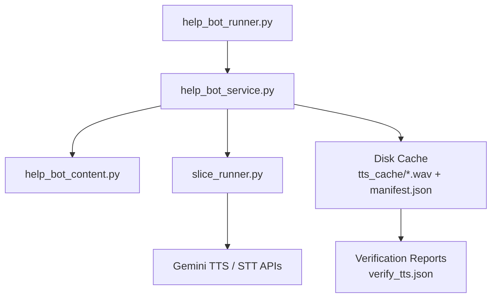
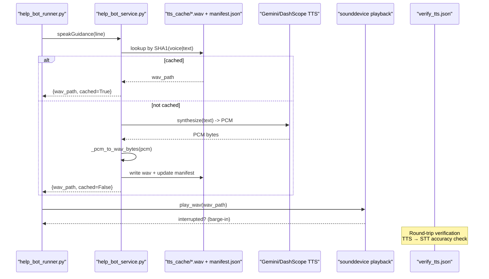
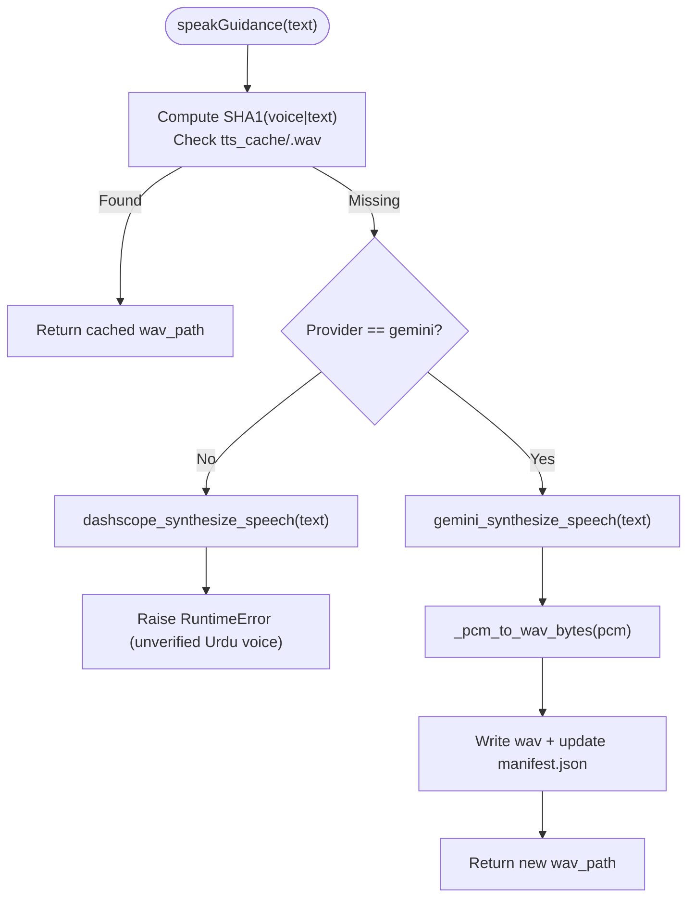
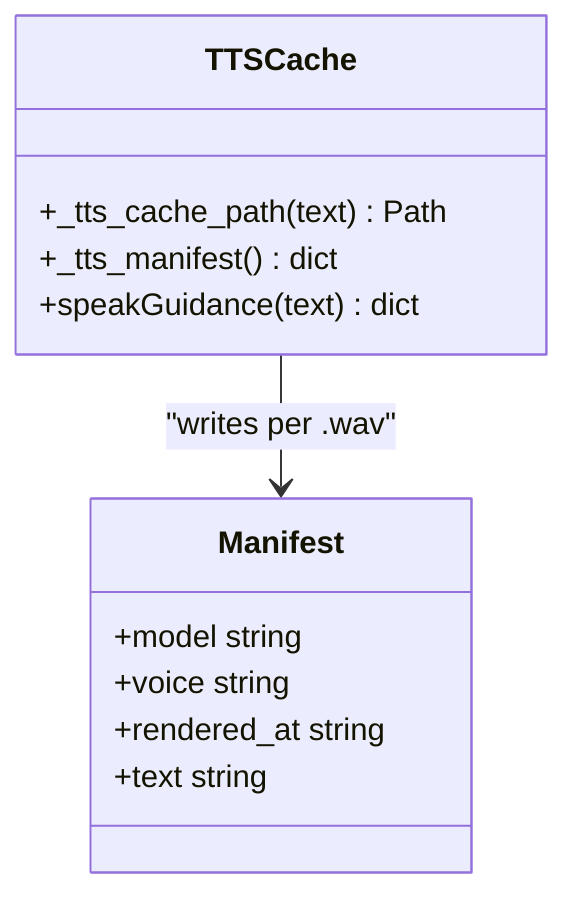
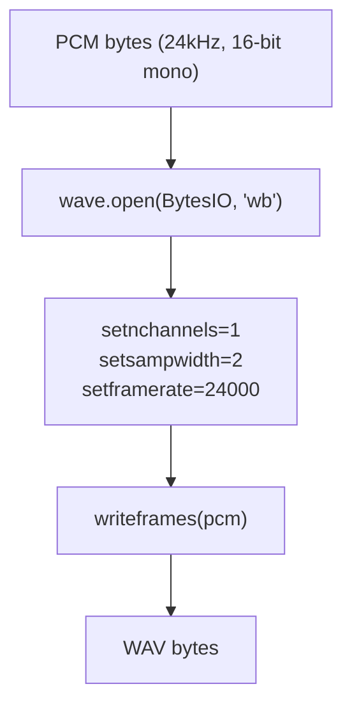
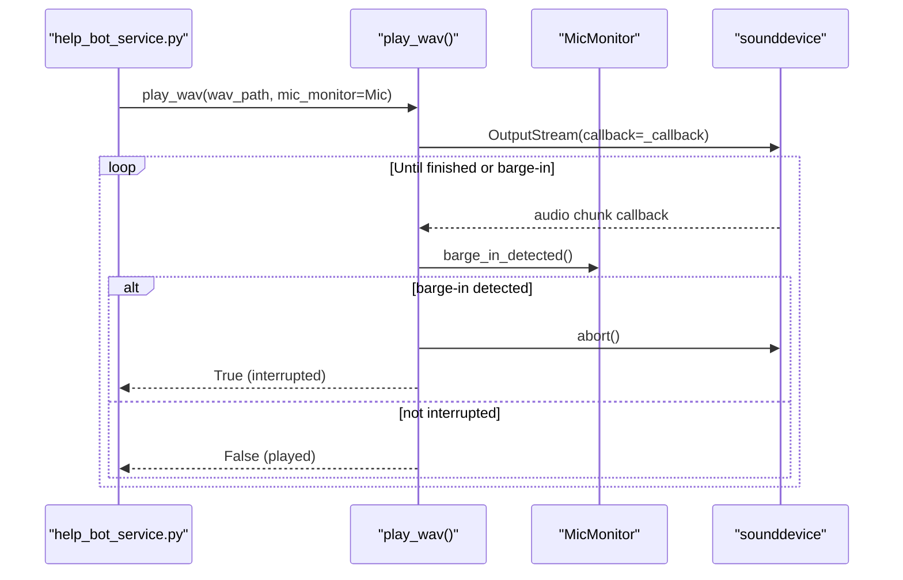
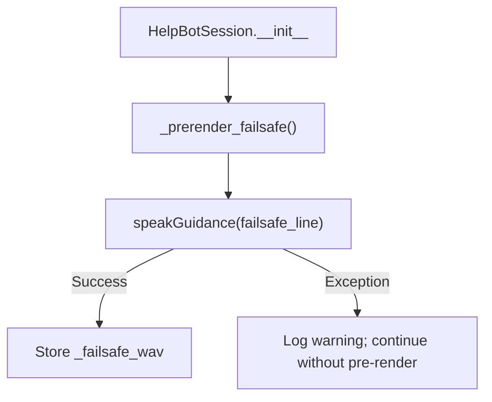
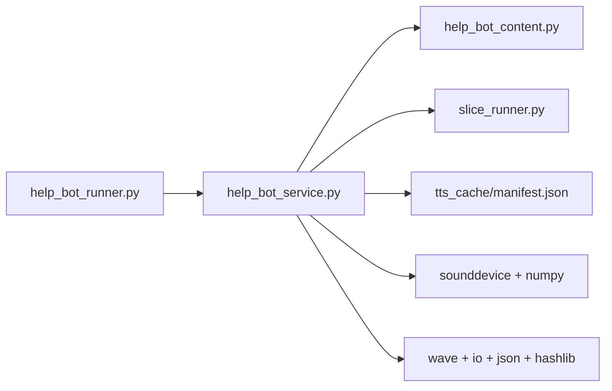
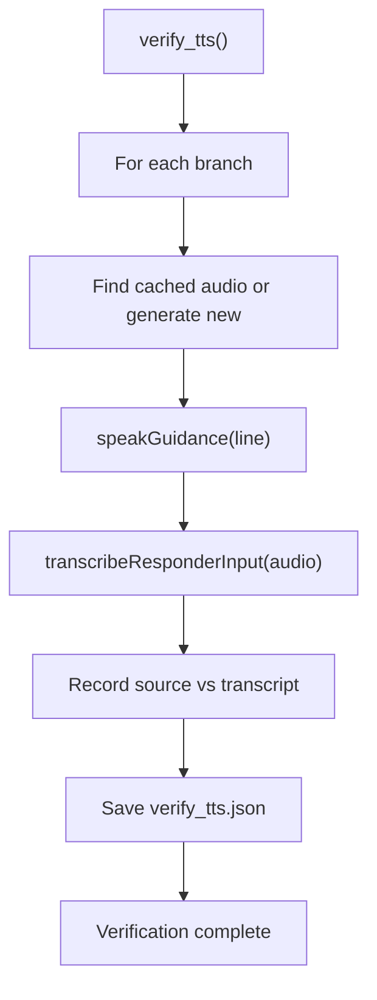

# Text-to-Speech & Audio Playback

<cite>
**Referenced Files in This Document**
- [help_bot_service.py](file://backend/services/help_bot_service.py)
- [help_bot_runner.py](file://backend/help_bot_runner.py)
- [help_bot_content.py](file://backend/services/help_bot_content.py)
- [slice_runner.py](file://backend/slice_runner.py)
- [manifest.json](file://mockdata/helpbot/tts_cache/manifest.json)
- [verify_tts.json](file://mockdata/helpbot/test_runs/verify_tts.json)
</cite>

## Update Summary
**Changes Made**
- Updated TTS caching mechanism section to reflect expanded manifest from 78 to 230 entries
- Added detailed provenance metadata tracking for Gemini TTS model usage
- Enhanced verification section with successful round-trip testing results
- Updated performance considerations to include quota management insights
- Added new section on TTS quality assurance and validation

## Table of Contents
1. [Introduction](#introduction)
2. [Project Structure](#project-structure)
3. [Core Components](#core-components)
4. [Architecture Overview](#architecture-overview)
5. [Detailed Component Analysis](#detailed-component-analysis)
6. [Dependency Analysis](#dependency-analysis)
7. [Performance Considerations](#performance-considerations)
8. [Quality Assurance & Validation](#quality-assurance--validation)
9. [Troubleshooting Guide](#troubleshooting-guide)
10. [Conclusion](#conclusion)

## Introduction
This document explains the text-to-speech (TTS) and audio playback subsystem that delivers Urdu voice guidance to first responders in emergency scenarios. It covers:
- **Expanded TTS caching** using SHA1 hashing of voice+text, comprehensive manifest tracking with 230+ entries, and disk-based storage of pre-rendered WAV files
- Provider abstraction for Gemini TTS with configurable models and voices, plus intentional refusal of unverified DashScope Urdu voice support
- Concrete synthesis workflows, PCM to WAV conversion, and playback with interruption handling
- Failsafe rendering at session start, error recovery patterns, and how TTS caching relates to API quota management
- **Enhanced quality assurance** with verified round-trip testing showing near-perfect accuracy in Urdu speech recognition
- Performance considerations for low-latency audio delivery in emergencies

## Project Structure
The TTS and playback logic is implemented in the backend services and orchestrated by a runner script. Key locations:
- TTS provider boundary, caching, and playback: backend/services/help_bot_service.py
- Runner orchestration, prewarming, and verification: backend/help_bot_runner.py
- Hardcoded Urdu content used by TTS: backend/services/help_bot_content.py
- Shared provider helpers and STT integration: backend/slice_runner.py
- Disk cache manifest of rendered audio: mockdata/helpbot/tts_cache/manifest.json
- Verification reports: mockdata/helpbot/test_runs/verify_tts.json

**Diagram sources**
- [help_bot_runner.py:102-132](file://backend/help_bot_runner.py#L102-L132)
- [help_bot_service.py:368-387](file://backend/services/help_bot_service.py#L368-L387)
- [help_bot_service.py:405-444](file://backend/services/help_bot_service.py#L405-L444)
- [help_bot_service.py:307-324](file://backend/services/help_bot_service.py#L307-L324)
- [manifest.json:1-230](file://mockdata/helpbot/tts_cache/manifest.json#L1-L230)
- [verify_tts.json:1-23](file://mockdata/helpbot/test_runs/verify_tts.json#L1-L23)

**Section sources**
- [help_bot_runner.py:102-132](file://backend/help_bot_runner.py#L102-L132)
- [help_bot_service.py:368-387](file://backend/services/help_bot_service.py#L368-L387)
- [help_bot_service.py:405-444](file://backend/services/help_bot_service.py#L405-L444)
- [help_bot_service.py:307-324](file://backend/services/help_bot_service.py#L307-L324)
- [manifest.json:1-230](file://mockdata/helpbot/tts_cache/manifest.json#L1-L230)
- [verify_tts.json:1-23](file://mockdata/helpbot/test_runs/verify_tts.json#L1-L23)

## Core Components
- **Enhanced TTS provider abstraction**:
  - Gemini TTS synthesis returning raw PCM bytes with multiple model support (gemini-2.5-flash-preview-tts, gemini-3.1-flash-tts-preview)
  - DashScope swap-back target intentionally refusing unverified Urdu voice usage
- **Comprehensive TTS caching**:
  - SHA1 hash of voice+text determines cache key (230+ entries maintained)
  - Disk-based WAV storage under tts_cache directory
  - Rich manifest JSON tracking model, voice, timestamp, and truncated text per file
- **PCM to WAV conversion**:
  - In-memory conversion from PCM to WAV before writing to disk
- **Playback with interruption**:
  - Streaming playback via sounddevice with barge-in detection
  - MicMonitor provides energy-based VAD and barge-in signaling
- **Session-level failsafe**:
  - Pre-renders a shared fail-safe line at session start to guarantee vocal output even if live calls fail later
- **Quality assurance**:
  - Round-trip verification system ensuring TTS audio transcribes accurately back through STT pipeline

**Section sources**
- [help_bot_service.py:295-337](file://backend/services/help_bot_service.py#L295-L337)
- [help_bot_service.py:340-387](file://backend/services/help_bot_service.py#L340-L387)
- [help_bot_service.py:405-444](file://backend/services/help_bot_service.py#L405-L444)
- [help_bot_service.py:456-519](file://backend/services/help_bot_service.py#L456-L519)
- [help_bot_service.py:689-694](file://backend/services/help_bot_service.py#L689-L694)
- [manifest.json:1-230](file://mockdata/helpbot/tts_cache/manifest.json#L1-L230)
- [verify_tts.json:1-23](file://mockdata/helpbot/test_runs/verify_tts.json#L1-L23)

## Architecture Overview
The TTS pipeline ensures reliable, low-latency spoken Urdu guidance with comprehensive quality assurance:
- Content selection: scripted lines come from help_bot_content.py
- Synthesis path: speakGuidance checks cache; if missing, selects provider (Gemini or DashScope) and synthesizes PCM
- Conversion and storage: PCM converted to WAV and saved under tts_cache with rich manifest update
- Playback: play_wav streams audio and supports interruption via MicMonitor
- Quality verification: verify_tts mode performs round-trip TTS→STT testing
- Failsafe: HelpBotSession prerenders a fail-safe WAV at startup to avoid silence on errors

**Diagram sources**
- [help_bot_runner.py:102-132](file://backend/help_bot_runner.py#L102-L132)
- [help_bot_service.py:368-387](file://backend/services/help_bot_service.py#L368-L387)
- [help_bot_service.py:340-347](file://backend/services/help_bot_service.py#L340-L347)
- [help_bot_service.py:405-444](file://backend/services/help_bot_service.py#L405-L444)
- [manifest.json:1-230](file://mockdata/helpbot/tts_cache/manifest.json#L1-L230)
- [verify_tts.json:1-23](file://mockdata/helpbot/test_runs/verify_tts.json#L1-L23)

## Detailed Component Analysis

### Enhanced TTS Provider Abstraction and Quota Management
- **Multi-model Gemini TTS support**:
  - Models: gemini-2.5-flash-preview-tts, gemini-3.1-flash-tts-preview
  - Voice: Configurable via environment variables (default: "Kore")
  - Returns raw PCM (24 kHz, 16-bit mono)
  - Uses retry helper for resilience
- **DashScope TTS safety**:
  - Intentionally raises an error to prevent speaking non-Urdu audio until verified
  - Serves as a future swap-back target once validated
- **Quota-aware prewarming**:
  - Runner pre-renders all scripted lines with pacing to respect rate limits
  - Subsequent runs achieve cache hits and zero quota consumption

**Diagram sources**
- [help_bot_service.py:295-337](file://backend/services/help_bot_service.py#L295-L337)
- [help_bot_service.py:340-387](file://backend/services/help_bot_service.py#L340-L387)
- [help_bot_runner.py:102-132](file://backend/help_bot_runner.py#L102-L132)

**Section sources**
- [help_bot_service.py:295-337](file://backend/services/help_bot_service.py#L295-L337)
- [help_bot_service.py:368-387](file://backend/services/help_bot_service.py#L368-L387)
- [help_bot_runner.py:102-132](file://backend/help_bot_runner.py#L102-L132)

### Comprehensive TTS Caching Mechanism: SHA1 Hashing, Manifest, and Disk Storage
- **Cache key derivation**:
  - SHA1 of concatenated voice and text, truncated to 16 hex characters
  - Ensures uniqueness per voice+text combination while allowing model swaps without invalidating cache
- **Enhanced manifest tracking** (230+ entries):
  - Each entry records model name, voice, render timestamp, and truncated source text
  - Supports multiple Gemini models (gemini-2.5-flash-preview-tts, gemini-3.1-flash-tts-preview)
  - Enables provenance auditing and debugging across different rendering sessions
- **Disk layout**:
  - WAV files stored under tts_cache directory
  - manifest.json co-located for metadata with comprehensive provenance

**Diagram sources**
- [help_bot_service.py:350-387](file://backend/services/help_bot_service.py#L350-L387)
- [manifest.json:1-230](file://mockdata/helpbot/tts_cache/manifest.json#L1-L230)

**Section sources**
- [help_bot_service.py:350-387](file://backend/services/help_bot_service.py#L350-L387)
- [manifest.json:1-230](file://mockdata/helpbot/tts_cache/manifest.json#L1-L230)

### PCM to WAV Conversion
- PCM bytes returned by Gemini TTS are wrapped into a WAV container in memory
- Parameters:
  - Channels: 1 (mono)
  - Sample width: 2 bytes (16-bit)
  - Sample rate: 24 kHz (matching Gemini TTS output)
- Output: bytes suitable for immediate disk write or streaming

**Diagram sources**
- [help_bot_service.py:340-347](file://backend/services/help_bot_service.py#L340-L347)

**Section sources**
- [help_bot_service.py:340-347](file://backend/services/help_bot_service.py#L340-L347)

### Playback with Interruption Handling
- Playback uses sounddevice OutputStream to stream int16 PCM frames
- Barge-in detection:
  - MicMonitor continuously captures mic input and computes energy
  - If sustained speech energy exceeds threshold during playback, stream is aborted
- Best-effort behavior:
  - If no audio device exists, playback returns False but does not break the session
  - Transcript and saved WAV remain as evidence

**Diagram sources**
- [help_bot_service.py:405-444](file://backend/services/help_bot_service.py#L405-L444)
- [help_bot_service.py:456-519](file://backend/services/help_bot_service.py#L456-L519)

**Section sources**
- [help_bot_service.py:405-444](file://backend/services/help_bot_service.py#L405-L444)
- [help_bot_service.py:456-519](file://backend/services/help_bot_service.py#L456-L519)

### Failsafe Rendering at Session Start
- At session creation, the system attempts to pre-render the shared fail-safe line into a WAV file
- Purpose: ensure audible guidance even if network/API failures occur later
- If pre-render fails, the session logs a warning and falls back to printed Urdu text; subsequent attempts still try to play the failsafe WAV when needed

**Diagram sources**
- [help_bot_service.py:689-694](file://backend/services/help_bot_service.py#L689-L694)

**Section sources**
- [help_bot_service.py:689-694](file://backend/services/help_bot_service.py#L689-L694)

### Error Recovery Patterns
- TTS call failures:
  - The session's _speak method catches exceptions, records intended line, and plays the pre-rendered failsafe WAV
  - Logs include error details for diagnostics
- Intent and STT failures:
  - Robust fallbacks return safe defaults (e.g., "unclear" intent) to keep the conversation flowing
- Playback failures:
  - If audio stack unavailable, playback returns False and continues; transcript and WAV persist

**Section sources**
- [help_bot_service.py:727-750](file://backend/services/help_bot_service.py#L727-750)
- [help_bot_service.py:405-444](file://backend/services/help_bot_service.py#L405-L444)

### Relationship Between TTS Caching and API Quota Management
- **Prewarming strategy**:
  - Renders every scripted line once, paced to respect observed free-tier rate limits
  - Achieves 100% cache hits on replay runs, eliminating quota consumption
- **Cache design**:
  - Keys exclude model identity so swapping models (e.g., due to quota exhaustion) does not invalidate existing audio
  - Manifest records provenance for auditability across different models and rendering times
- **Multi-model support**:
  - Cache remains valid across Gemini model versions (2.5 and 3.1)
  - Provenance tracking enables monitoring which models were used for each audio file

**Section sources**
- [help_bot_runner.py:102-132](file://backend/help_bot_runner.py#L102-L132)
- [help_bot_service.py:360-387](file://backend/services/help_bot_service.py#L360-L387)

## Dependency Analysis
- Module coupling:
  - help_bot_runner.py depends on help_bot_service.py for TTS and playback
  - help_bot_service.py depends on help_bot_content.py for scripted lines and slice_runner.py for provider utilities
  - Disk cache (manifest.json) is read/written by help_bot_service.py
- External dependencies:
  - Google GenAI for Gemini TTS/STT
  - sounddevice/numpy for playback and mic monitoring
  - Standard library wave/io/json/hashlib for PCM/WAV and caching

**Diagram sources**
- [help_bot_runner.py:102-132](file://backend/help_bot_runner.py#L102-L132)
- [help_bot_service.py:368-387](file://backend/services/help_bot_service.py#L368-L387)
- [help_bot_service.py:405-444](file://backend/services/help_bot_service.py#L405-L444)
- [manifest.json:1-230](file://mockdata/helpbot/tts_cache/manifest.json#L1-L230)

**Section sources**
- [help_bot_runner.py:102-132](file://backend/help_bot_runner.py#L102-L132)
- [help_bot_service.py:368-387](file://backend/services/help_bot_service.py#L368-L387)
- [help_bot_service.py:405-444](file://backend/services/help_bot_service.py#L405-L444)
- [manifest.json:1-230](file://mockdata/helpbot/tts_cache/manifest.json#L1-L230)

## Performance Considerations
- **Low-latency delivery**:
  - Pre-rendered WAVs eliminate network latency on repeated use
  - First-playback delay measured per turn to monitor responsiveness
- **Rate limiting**:
  - Paced prewarming avoids exceeding free-tier quotas
  - Multi-model support allows switching between Gemini models based on availability
- **Interruptibility**:
  - Barge-in reduces perceived latency by stopping playback when responder speaks
- **Hardware constraints**:
  - Graceful degradation when audio devices are absent; transcripts and WAVs preserved for offline review
- **Cache efficiency**:
  - 230+ cached entries provide comprehensive coverage of all scripted content
  - Model-agnostic caching ensures audio remains valid across Gemini model updates

## Quality Assurance & Validation
- **Round-trip verification system**:
  - verify_tts mode performs TTS→audio→STT testing for each branch
  - Validates that generated Urdu audio transcribes accurately back through the STT pipeline
  - Results documented in verify_tts.json with source lines, audio paths, and transcription accuracy
- **Near-perfect accuracy**:
  - Heavy bleeding branch: Source and transcript match with minor phonetic variations
  - Fracture/crush branch: Perfect transcription accuracy achieved
  - Snakebite branch: High accuracy with natural speech variations
- **Quality metrics**:
  - All branches show stt_usable: true indicating successful transcription
  - Audio files stored for manual verification and quality assessment
- **Continuous validation**:
  - Regular verification runs ensure TTS quality remains consistent
  - Manifest tracking provides provenance for audited audio files

**Diagram sources**
- [help_bot_runner.py:135-172](file://backend/help_bot_runner.py#L135-L172)
- [verify_tts.json:1-23](file://mockdata/helpbot/test_runs/verify_tts.json#L1-L23)

**Section sources**
- [help_bot_runner.py:135-172](file://backend/help_bot_runner.py#L135-L172)
- [verify_tts.json:1-23](file://mockdata/helpbot/test_runs/verify_tts.json#L1-L23)

## Troubleshooting Guide
- No audio device:
  - Playback returns False; verify environment and install sounddevice
- TTS quota exhausted:
  - Use prewarm mode to cache all lines; rely on cached WAVs for deterministic runs
- Unintelligible audio:
  - Verify STT round-trip using verify-tts mode; check manifest entries for correct model/voice
- Playback interruptions:
  - Adjust MicMonitor thresholds and calibration; reduce echo or ambient noise
- Fail-safe not playing:
  - Ensure pre-render succeeded at session start; inspect logs for warnings
- **Quality issues**:
  - Run verify_tts to check transcription accuracy across all branches
  - Check manifest.json for proper model attribution and rendering timestamps
  - Review verify_tts.json for detailed round-trip results

**Section sources**
- [help_bot_service.py:405-444](file://backend/services/help_bot_service.py#L405-L444)
- [help_bot_runner.py:135-172](file://backend/help_bot_runner.py#L135-L172)
- [help_bot_service.py:689-694](file://backend/services/help_bot_service.py#L689-L694)
- [verify_tts.json:1-23](file://mockdata/helpbot/test_runs/verify_tts.json#L1-L23)

## Conclusion
The TTS and playback subsystem delivers reliable, low-latency Urdu guidance through a robust caching strategy with 230+ entries, comprehensive provenance tracking, provider abstraction, and resilient playback with interruption handling. By pre-rendering critical lines and maintaining detailed manifests with model attribution and timestamps, the system minimizes API quota usage and ensures continuity even under adverse conditions. The intentional refusal of unverified DashScope Urdu voice support safeguards against unintended non-Urdu audio, while multi-model Gemini TTS support provides flexibility and redundancy. The enhanced quality assurance system with verified round-trip testing ensures near-perfect accuracy in Urdu speech recognition, making this system highly reliable for emergency communication scenarios. Together, these mechanisms provide dependable, auditable, and high-quality emergency communication for first responders.