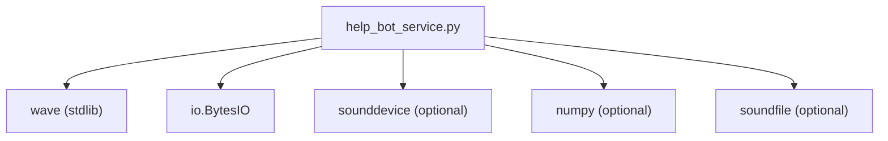
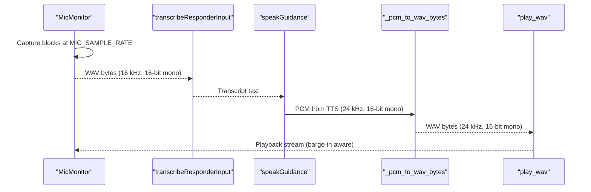
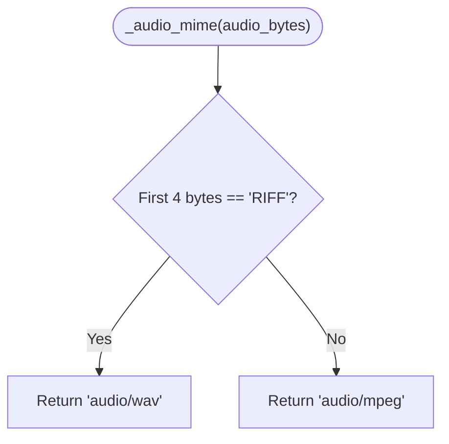
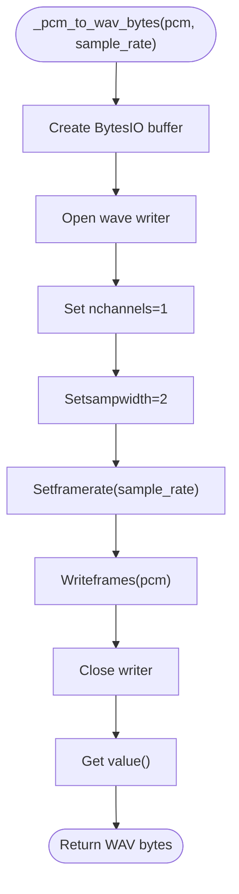
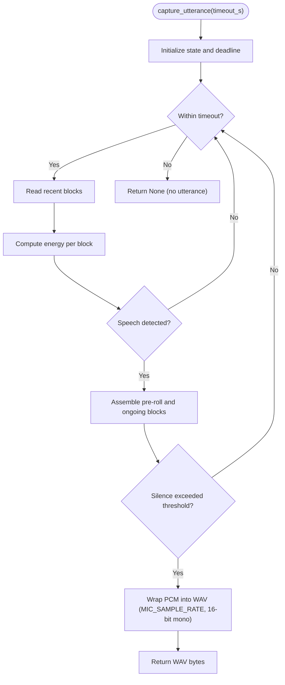
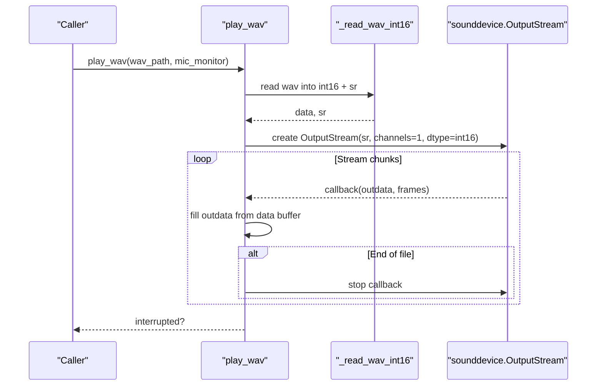
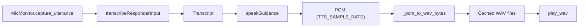
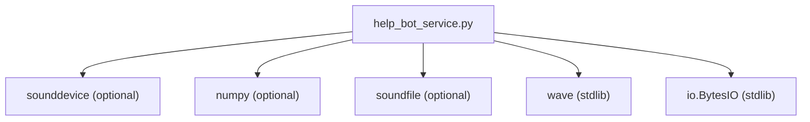

# Audio Format Handling

<cite>
**Referenced Files in This Document**
- [help_bot_service.py](file://backend/services/help_bot_service.py)
- [requirements.txt](file://backend/requirements.txt)
</cite>

## Table of Contents
1. [Introduction](#introduction)
2. [Project Structure](#project-structure)
3. [Core Components](#core-components)
4. [Architecture Overview](#architecture-overview)
5. [Detailed Component Analysis](#detailed-component-analysis)
6. [Dependency Analysis](#dependency-analysis)
7. [Performance Considerations](#performance-considerations)
8. [Troubleshooting Guide](#troubleshooting-guide)
9. [Conclusion](#conclusion)

## Introduction
This document explains how audio formats and sample rates are handled across the voice processing pipeline, focusing on:
- Converting raw PCM to WAV with correct headers
- Managing sample rate differences between microphone capture (STT input) and TTS output
- Detecting audio MIME types for STT providers
- Capturing utterances as WAV files and playing them back via streaming
- Buffer management and memory-efficient processing of large audio streams
- Compatibility and fallback mechanisms when audio hardware or libraries are unavailable

The implementation is centered around a single service module that orchestrates capture, conversion, playback, and provider integration points.

## Project Structure
Audio handling lives primarily in the backend services module. It uses standard library modules for WAV I/O and optional third-party libraries for live audio I/O. The project’s runtime dependencies include sounddevice and soundfile, which are lazily imported to allow non-audio modes to run without hardware.

**Diagram sources**
- [help_bot_service.py:390-403](file://backend/services/help_bot_service.py#L390-L403)
- [help_bot_service.py:447-453](file://backend/services/help_bot_service.py#L447-L453)
- [help_bot_service.py:340-347](file://backend/services/help_bot_service.py#L340-L347)

**Section sources**
- [help_bot_service.py:390-403](file://backend/services/help_bot_service.py#L390-L403)
- [requirements.txt:4-5](file://backend/requirements.txt#L4-L5)

## Core Components
- Sample rate constants define the expected formats:
  - MIC_SAMPLE_RATE for microphone capture and STT input
  - TTS_SAMPLE_RATE for TTS output PCM
- _audio_mime detects whether incoming audio bytes are WAV or MP3 by inspecting file signatures
- _pcm_to_wav_bytes wraps raw PCM into a WAV container with proper headers
- MicMonitor captures continuous audio at MIC_SAMPLE_RATE, performs VAD-based segmentation, and emits WAV bytes per utterance
- play_wav reads WAV files into numpy arrays and streams them to the audio device with barge-in support
- _read_wav_int16 loads WAV data as int16 samples and returns the original sample rate

Key responsibilities:
- Maintain consistent encoding (16-bit mono) across capture and playback
- Preserve sample rate metadata so downstream components know the format
- Provide robust fallbacks when audio stack is unavailable

**Section sources**
- [help_bot_service.py:53-54](file://backend/services/help_bot_service.py#L53-L54)
- [help_bot_service.py:123-124](file://backend/services/help_bot_service.py#L123-L124)
- [help_bot_service.py:340-347](file://backend/services/help_bot_service.py#L340-L347)
- [help_bot_service.py:405-453](file://backend/services/help_bot_service.py#L405-L453)
- [help_bot_service.py:456-569](file://backend/services/help_bot_service.py#L456-L569)

## Architecture Overview
The audio pipeline spans capture, transcription, synthesis, and playback. The following diagram shows where format conversions occur and how sample rates flow through the system.

**Diagram sources**
- [help_bot_service.py:456-569](file://backend/services/help_bot_service.py#L456-L569)
- [help_bot_service.py:159-167](file://backend/services/help_bot_service.py#L159-L167)
- [help_bot_service.py:368-387](file://backend/services/help_bot_service.py#L368-L387)
- [help_bot_service.py:340-347](file://backend/services/help_bot_service.py#L340-L347)
- [help_bot_service.py:405-453](file://backend/services/help_bot_service.py#L405-L453)

## Detailed Component Analysis

### Sample Rate Constants and Intent
- MIC_SAMPLE_RATE defines the capture rate used by the microphone stream and STT input WAV files
- TTS_SAMPLE_RATE defines the PCM sample rate returned by the TTS provider; this is the default when wrapping PCM into WAV

These constants ensure consistent expectations across capture, storage, and playback.

**Section sources**
- [help_bot_service.py:53-54](file://backend/services/help_bot_service.py#L53-L54)

### Audio MIME Type Detection
_audio_mime inspects the first four bytes of an audio buffer to determine if it is WAV or MP3:
- WAV files start with the RIFF signature
- Otherwise, it assumes MP3

This detection is used when constructing provider payloads for STT.

**Diagram sources**
- [help_bot_service.py:123-124](file://backend/services/help_bot_service.py#L123-L124)

**Section sources**
- [help_bot_service.py:123-124](file://backend/services/help_bot_service.py#L123-L124)
- [help_bot_service.py:127-139](file://backend/services/help_bot_service.py#L127-L139)
- [help_bot_service.py:142-156](file://backend/services/help_bot_service.py#L142-L156)

### PCM to WAV Conversion
_pcm_to_wav_bytes converts raw PCM bytes into a WAV container:
- Sets channels to 1 (mono)
- Sets sample width to 2 bytes (16-bit)
- Sets frame rate to the provided sample_rate (default TTS_SAMPLE_RATE)
- Writes PCM frames and returns the resulting WAV bytes

This function is used to persist TTS output as WAV files for caching and playback.

**Diagram sources**
- [help_bot_service.py:340-347](file://backend/services/help_bot_service.py#L340-L347)

**Section sources**
- [help_bot_service.py:340-347](file://backend/services/help_bot_service.py#L340-L347)
- [help_bot_service.py:368-387](file://backend/services/help_bot_service.py#L368-L387)

### Utterance Capture and WAV Generation
MicMonitor implements continuous capture at MIC_SAMPLE_RATE with energy-based VAD:
- Captures small blocks (e.g., 0.05 seconds) and stores them in a ring buffer
- Detects speech onset and offset using thresholds derived from ambient noise calibration
- Assembles captured blocks into a single PCM segment per utterance
- Wraps PCM into WAV with 16-bit mono at MIC_SAMPLE_RATE and returns WAV bytes

**Diagram sources**
- [help_bot_service.py:456-569](file://backend/services/help_bot_service.py#L456-L569)

**Section sources**
- [help_bot_service.py:456-569](file://backend/services/help_bot_service.py#L456-L569)

### Playback and Streaming
play_wav handles best-effort playback:
- Lazily imports audio dependencies; returns False if unavailable
- Reads WAV into numpy int16 array and sample rate via _read_wav_int16
- Streams chunks to an output stream with a callback that supports barge-in interruption
- Handles end-of-file gracefully by zero-padding and stopping the callback

_read_wav_int16 opens a WAV file, reads all frames, and converts them to a numpy int16 array while preserving the original sample rate.

**Diagram sources**
- [help_bot_service.py:405-453](file://backend/services/help_bot_service.py#L405-L453)

**Section sources**
- [help_bot_service.py:405-453](file://backend/services/help_bot_service.py#L405-L453)

### Integration Points in STT-TTS Pipeline
- STT path:
  - Input WAV bytes are created by MicMonitor.capture_utterance at MIC_SAMPLE_RATE
  - transcribeResponderInput selects provider and passes audio bytes with MIME type determined by _audio_mime
- TTS path:
  - speakGuidance obtains PCM from the TTS provider (TTS_SAMPLE_RATE)
  - _pcm_to_wav_bytes wraps PCM into WAV for caching and playback
  - play_wav streams the cached WAV to speakers with barge-in support

**Diagram sources**
- [help_bot_service.py:159-167](file://backend/services/help_bot_service.py#L159-L167)
- [help_bot_service.py:368-387](file://backend/services/help_bot_service.py#L368-L387)
- [help_bot_service.py:405-453](file://backend/services/help_bot_service.py#L405-L453)
- [help_bot_service.py:456-569](file://backend/services/help_bot_service.py#L456-L569)

**Section sources**
- [help_bot_service.py:159-167](file://backend/services/help_bot_service.py#L159-L167)
- [help_bot_service.py:368-387](file://backend/services/help_bot_service.py#L368-L387)
- [help_bot_service.py:405-453](file://backend/services/help_bot_service.py#L405-L453)
- [help_bot_service.py:456-569](file://backend/services/help_bot_service.py#L456-L569)

## Dependency Analysis
- Optional audio stack:
  - sounddevice for live I/O
  - numpy for efficient array operations
  - soundfile imported but not required for core paths
- Lazy import pattern ensures replay/text modes work without audio hardware
- WAV I/O uses stdlib wave; no extra dependency needed for reading/writing WAV containers

**Diagram sources**
- [help_bot_service.py:390-403](file://backend/services/help_bot_service.py#L390-L403)
- [help_bot_service.py:447-453](file://backend/services/help_bot_service.py#L447-L453)
- [help_bot_service.py:340-347](file://backend/services/help_bot_service.py#L340-L347)

**Section sources**
- [help_bot_service.py:390-403](file://backend/services/help_bot_service.py#L390-L403)
- [requirements.txt:4-5](file://backend/requirements.txt#L4-L5)

## Performance Considerations
- Memory efficiency:
  - MicMonitor stores only recent blocks in a bounded deque to limit memory usage during capture
  - Playback streams chunks rather than loading entire files into device buffers
- CPU efficiency:
  - Energy calculation uses vectorized numpy operations over small blocks
  - WAV I/O uses stdlib wave for minimal overhead
- Streaming:
  - Callback-driven playback reduces latency and allows responsive barge-in
- Caching:
  - TTS outputs are cached as WAV files to avoid repeated synthesis calls

[No sources needed since this section provides general guidance]

## Troubleshooting Guide
Common issues and mitigations:
- Audio stack unavailable:
  - If sounddevice/numpy/soundfile cannot be imported, playback/capture functions return early and log warnings
  - Replay mode continues without audio hardware
- Playback failures:
  - Exceptions during playback are caught and logged; playback returns False
- No utterance detected:
  - If no speech is detected within timeout, capture_utterance returns None; session logic handles retries and check-ins
- Mismatched sample rates:
  - Ensure WAV files are written with the intended sample rate; playback uses the file’s recorded sample rate

Operational tips:
- Calibrate the microphone in a quiet environment to set appropriate thresholds
- Use replay mode to validate behavior deterministically without hardware

**Section sources**
- [help_bot_service.py:394-403](file://backend/services/help_bot_service.py#L394-L403)
- [help_bot_service.py:405-453](file://backend/services/help_bot_service.py#L405-L453)
- [help_bot_service.py:456-569](file://backend/services/help_bot_service.py#L456-L569)

## Conclusion
The audio pipeline maintains consistent 16-bit mono encoding across capture and playback, with explicit sample rate handling for STT and TTS stages. WAV containers provide reliable persistence and transport, while lazy imports and best-effort playback ensure resilience across environments. The design balances performance and simplicity, leveraging streaming and caching to handle large audio streams efficiently.

[No sources needed since this section summarizes without analyzing specific files]