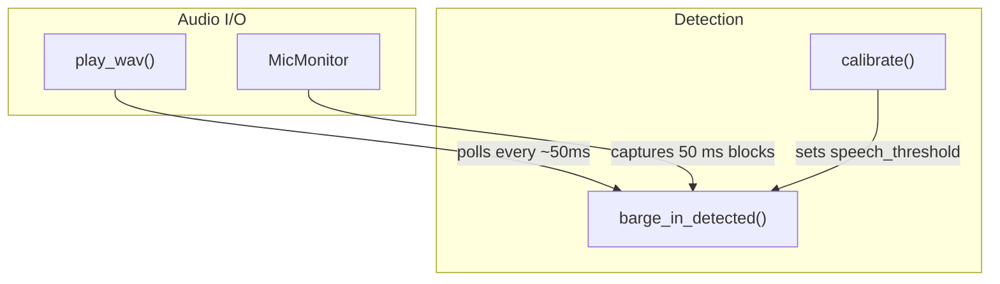
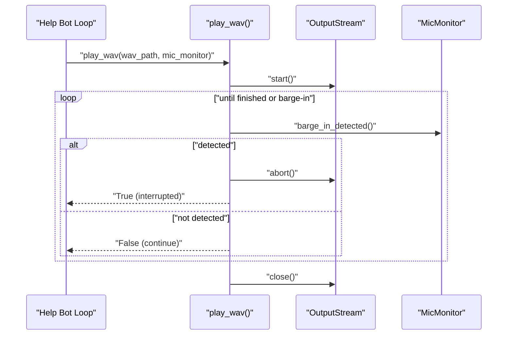
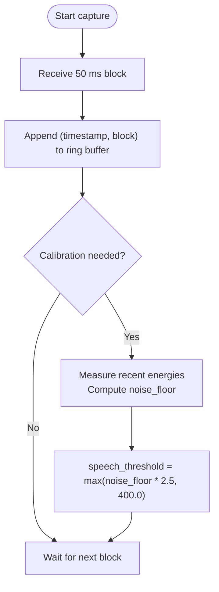
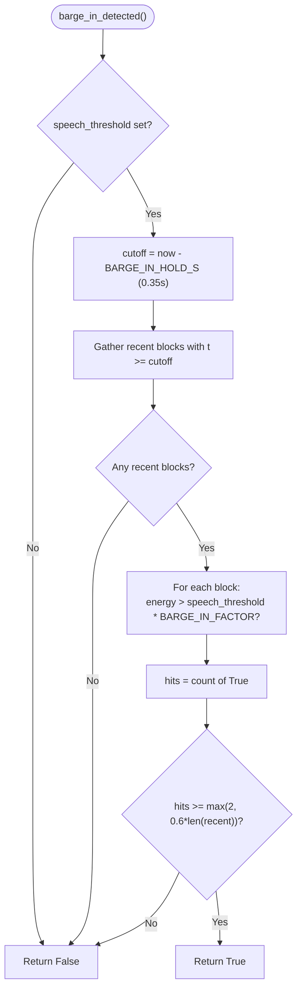
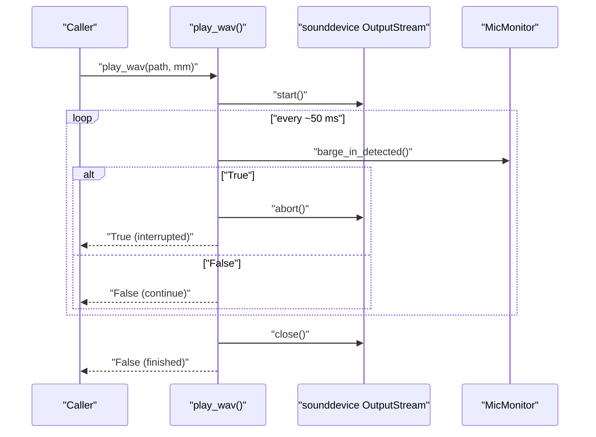
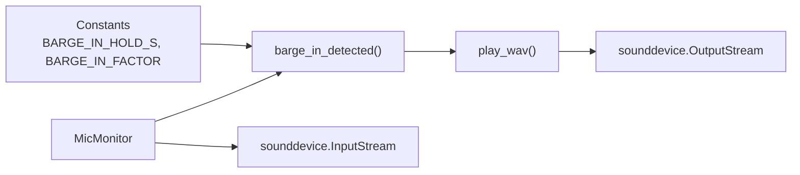

# Barge-In Detection

<cite>
**Referenced Files in This Document**
- [help_bot_service.py](file://backend/services/help_bot_service.py)
</cite>

## Table of Contents
1. [Introduction](#introduction)
2. [Project Structure](#project-structure)
3. [Core Components](#core-components)
4. [Architecture Overview](#architecture-overview)
5. [Detailed Component Analysis](#detailed-component-analysis)
6. [Dependency Analysis](#dependency-analysis)
7. [Performance Considerations](#performance-considerations)
8. [Troubleshooting Guide](#troubleshooting-guide)
9. [Conclusion](#conclusion)

## Introduction
This document explains the barge-in detection mechanism that allows a responder to interrupt bot playback during emergency guidance sessions. It focuses on how sustained speech is detected, how false interruptions from speaker echo or ambient noise are prevented, and how playback is immediately stopped when a genuine interruption occurs. The explanation covers the key parameters BARGE_IN_HOLD_S and BARGE_IN_FACTOR, the sliding-window analysis performed by barge_in_detected(), and the integration between play_wav() and MicMonitor via stream.abort().

## Project Structure
The barge-in logic resides in the backend service module responsible for voice capture, playback, and conversation control. Key elements include:
- Constants defining thresholds and timing for barge-in detection
- A continuous microphone monitor that captures audio blocks and computes energy
- A playback function that checks for barge-in events while streaming TTS audio
- An escalation hook integrated into the broader session flow

**Diagram sources**
- [help_bot_service.py:405-444](file://backend/services/help_bot_service.py#L405-L444)
- [help_bot_service.py:456-519](file://backend/services/help_bot_service.py#L456-L519)

**Section sources**
- [help_bot_service.py:405-444](file://backend/services/help_bot_service.py#L405-L444)
- [help_bot_service.py:456-519](file://backend/services/help_bot_service.py#L456-L519)

## Core Components
- BARGE_IN_HOLD_S (0.35 s): Defines the time window used to evaluate recent microphone blocks for sustained speech before allowing an interruption.
- BARGE_IN_FACTOR (1.8x): Multiplies the calibrated speech threshold to raise the effective threshold for barge-in, compensating for speaker-to-mic feedback loops in field conditions where acoustic echo cancellation is not implemented.
- MicMonitor: Continuously captures 16 kHz mono audio in 50 ms blocks, maintains a ring buffer of recent blocks with timestamps, and exposes methods to calibrate thresholds and detect barge-in.
- play_wav(): Streams TTS audio and polls for barge-in; if detected, it calls stream.abort() to immediately stop playback.

These components work together to ensure that only sustained, sufficiently loud speech interrupts playback, while minimizing false positives caused by echo or ambient noise.

**Section sources**
- [help_bot_service.py:54-62](file://backend/services/help_bot_service.py#L54-L62)
- [help_bot_service.py:405-444](file://backend/services/help_bot_service.py#L405-L444)
- [help_bot_service.py:456-519](file://backend/services/help_bot_service.py#L456-L519)

## Architecture Overview
The runtime sequence during playback is:
1. play_wav() opens an output stream and starts playback.
2. In a tight loop, it waits briefly and asks MicMonitor whether barge-in is detected.
3. If barge_in_detected() returns True, play_wav() aborts the stream immediately and returns an interrupted flag.
4. Otherwise, playback continues until the file finishes or an error occurs.

**Diagram sources**
- [help_bot_service.py:405-444](file://backend/services/help_bot_service.py#L405-L444)
- [help_bot_service.py:456-519](file://backend/services/help_bot_service.py#L456-L519)

## Detailed Component Analysis

### Parameters: BARGE_IN_HOLD_S and BARGE_IN_FACTOR
- BARGE_IN_HOLD_S = 0.35 s: The sliding window length used to collect recent microphone blocks for evaluation. Only blocks within this window are considered when deciding whether to interrupt playback.
- BARGE_IN_FACTOR = 1.8: The multiplier applied to the calibrated speech threshold to compute the barge-in threshold. This raised threshold helps prevent the system from interrupting itself due to speaker echo or ambient noise in environments without acoustic echo cancellation.

These constants are defined at module scope and consumed directly by the detection method.

**Section sources**
- [help_bot_service.py:54-62](file://backend/services/help_bot_service.py#L54-L62)

### MicMonitor: Continuous Capture and Calibration
- Captures 16 kHz mono audio in 50 ms blocks using an input stream callback.
- Stores each block with its timestamp in a fixed-size deque (ring buffer), keeping approximately 30 seconds of history.
- Computes per-block energy using RMS over int16 samples.
- Calibrates by measuring ambient noise and setting a speech threshold above the noise floor, with a minimum absolute value to avoid overly sensitive detection in quiet environments.

**Diagram sources**
- [help_bot_service.py:456-507](file://backend/services/help_bot_service.py#L456-L507)

**Section sources**
- [help_bot_service.py:456-507](file://backend/services/help_bot_service.py#L456-L507)

### Barge-In Detection: Sliding Window, Energy Comparison, Minimum Hit Ratio
The barge_in_detected() method performs the following steps:
1. If no calibration has occurred, return False (no decision).
2. Compute cutoff time as current time minus BARGE_IN_HOLD_S (0.35 s).
3. Collect all recent blocks whose timestamps are at or after the cutoff.
4. For each recent block, compute energy and compare against speech_threshold multiplied by BARGE_IN_FACTOR (1.8x).
5. Count “hits” where energy exceeds the raised threshold.
6. Trigger barge-in if hits >= max(2, int(0.6 * len(recent))). This enforces both a minimum number of hits and a minimum hit ratio (60%) within the window.

**Diagram sources**
- [help_bot_service.py:509-519](file://backend/services/help_bot_service.py#L509-L519)

**Section sources**
- [help_bot_service.py:509-519](file://backend/services/help_bot_service.py#L509-L519)

### Integration: play_wav() and stream.abort()
During playback:
- play_wav() opens an output stream and starts streaming TTS audio.
- In a loop, it waits briefly and queries mic_monitor.barge_in_detected().
- If barge-in is detected, it calls stream.abort() to immediately stop audio output and sets an interrupted flag.
- If playback completes without interruption, it closes the stream and returns False.

**Diagram sources**
- [help_bot_service.py:405-444](file://backend/services/help_bot_service.py#L405-L444)

**Section sources**
- [help_bot_service.py:405-444](file://backend/services/help_bot_service.py#L405-L444)

### Known Limitation: No Acoustic Echo Cancellation
The implementation explicitly notes that there is no acoustic echo cancellation. To mitigate self-interruption caused by speaker-to-mic feedback loops, the barge-in threshold is raised by multiplying the calibrated speech threshold by BARGE_IN_FACTOR (1.8x). This reduces false positives in noisy or reflective environments but does not eliminate them entirely. Replay mode remains the deterministic verification path for testing behavior under controlled conditions.

**Section sources**
- [help_bot_service.py:456-462](file://backend/services/help_bot_service.py#L456-L462)
- [help_bot_service.py:509-519](file://backend/services/help_bot_service.py#L509-L519)

## Dependency Analysis
- play_wav() depends on sounddevice for playback and optionally on MicMonitor for interruption.
- MicMonitor depends on sounddevice for capture and numpy for energy computation.
- Both rely on module-level constants for timing and thresholds.

**Diagram sources**
- [help_bot_service.py:405-444](file://backend/services/help_bot_service.py#L405-L444)
- [help_bot_service.py:456-519](file://backend/services/help_bot_service.py#L456-L519)
- [help_bot_service.py:54-62](file://backend/services/help_bot_service.py#L54-L62)

**Section sources**
- [help_bot_service.py:405-444](file://backend/services/help_bot_service.py#L405-L444)
- [help_bot_service.py:456-519](file://backend/services/help_bot_service.py#L456-L519)
- [help_bot_service.py:54-62](file://backend/services/help_bot_service.py#L54-L62)

## Performance Considerations
- Block size: 50 ms blocks balance responsiveness and CPU usage. At 16 kHz, each block contains 800 samples, which is efficient for RMS energy calculation.
- Ring buffer: Fixed-length deque limits memory use to roughly 30 seconds of audio.
- Threshold calibration: Using a minimum absolute threshold prevents excessive sensitivity in very quiet environments.
- Raised barge-in threshold: The 1.8x factor reduces false positives from echo and ambient noise at the cost of slightly slower reaction to soft speech.

[No sources needed since this section provides general guidance]

## Troubleshooting Guide
- No audio devices available: Playback and capture gracefully degrade; play_wav() returns False and MicMonitor initialization raises an error if sounddevice is unavailable.
- Calibration not run: barge_in_detected() returns False until speech_threshold is set by calibrate(). Ensure calibration runs before playback.
- Excessive false interruptions: Reduce microphone gain or increase distance from speakers; consider adjusting environment to minimize echo.
- Missed interruptions: Verify that the responder’s voice is loud enough relative to ambient noise and that calibration was performed in the actual deployment environment.

**Section sources**
- [help_bot_service.py:394-402](file://backend/services/help_bot_service.py#L394-L402)
- [help_bot_service.py:498-507](file://backend/services/help_bot_service.py#L498-L507)
- [help_bot_service.py:509-519](file://backend/services/help_bot_service.py#L509-L519)

## Conclusion
The barge-in detection mechanism uses a short sliding window (0.35 s) and a raised energy threshold (1.8x the calibrated speech threshold) to reliably detect sustained speech while avoiding false interruptions from echo and ambient noise. During playback, the system continuously checks for barge-in and immediately stops audio via stream.abort() when confirmed. While acoustic echo cancellation is not implemented, the raised threshold mitigates self-interruption risks in field conditions. Calibration and proper environment setup are essential to achieving robust performance.

[No sources needed since this section summarizes without analyzing specific files]